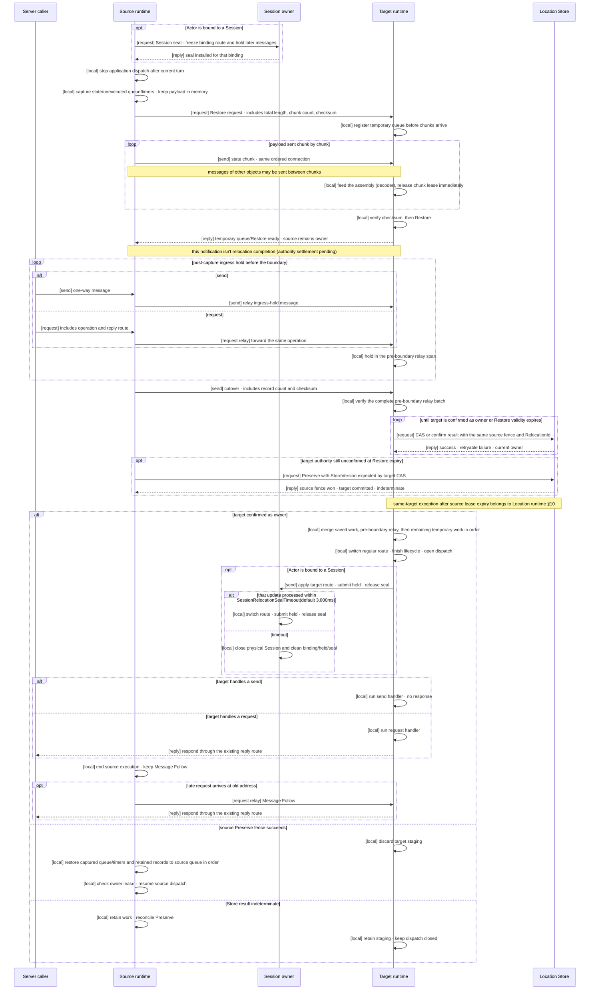
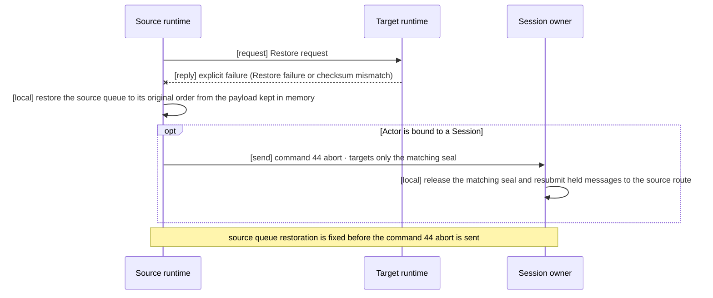

# Complete Actor and Spot Relocation Flow

[Location And Relocation topic table of contents](README.en.md) · [Spec table of contents](../README.en.md) · [Previous: 03. Relocation Store (Redis)](03-relocation-store-redis.en.md) · [Next: 05. Complete Host Relocation Flow](05-host-relocation-flow.en.md)

> **What this document defines** — the single handoff protocol that changes owner,
> queue, and the bound Session route for one Actor or [Spot](../00-foundation/02-glossary.en.md#spot)
> — a logical instance that keeps receiving messages at the same address even as the node
> running it changes — moving from a source node to a target node, while messages keep
> arriving. Every initiating API (Host `Relocate`,
> cross-node Actor Join, User Spot authority transfer) and all four language runtimes
> share this one protocol.

## 1. Result Visible to the Application

This document defines the common contract from the start of Actor or Spot relocation
until message processing resumes on the target. Host `Relocate`, cross-node Actor Join,
and User Spot authority transfer have different start conditions and callbacks, but all
use this document's owner-transition and message-handling order together. [Complete Host
Relocation Flow](05-host-relocation-flow.en.md) defines how a host operation applies this
flow to multiple Actors and Spots and the source-side completion condition for returning
`Relocated`.

The node currently processing an Actor or Spot is called its
[owner](../00-foundation/02-glossary.en.md#owner). On successful relocation, the owner that the
[Location Store](../00-foundation/02-glossary.en.md#location-store) — the store that keeps each
Spot's and Actor's current owner where multiple nodes can check it together — points to changes
once from source to target, and the target continues under the same object ID and the value
that distinguishes this logical incarnation from others reusing the same ID,
[`ObjectGeneration`](../00-foundation/02-glossary.en.md#objectgeneration). The application doesn't directly manage the
target node, Store version, relay connection, or cutover control message.

This contract covers planned graceful relocation. It doesn't provide a way for another
runtime to automatically resume an in-progress relocation after the source or target
process terminates. The full scope of failure and automatic reselection is defined by
[Failure Handling And Failover Scope](06-failure-failover-policy.en.md).

## 2. Responsibility of Each Participant

| Participant | Responsibility |
|---|---|
| Application | Requests host relocation or registers an Actor Join. Provides a relocation adapter for the object kind when application state must be preserved. |
| Source runtime | Finishes the current application turn and stops new dispatch. Sends the captured application state, not-yet-executed existing work, and timers directly to the target, and keeps the whole payload in memory until the authority settlement under [§4.4](#44-ordered-relay-and-one-way-cutover). Keeps relaying messages arriving at the old address to the target. Doesn't change the Location Store owner. |
| Target runtime | Prepares the temporary queue first, then creates and restores the object. Only after verifying the pre-boundary relay batch and cutover (§4.4), runs the Location Store CAS and opens the target queue only on success. For a bound Actor, then tells the Session owner to apply the target route and release the seal. |
| Session owner | Keeps the bound Actor's physical Session. The role this handoff asks of it is defined in §7; the actual handling is owned by [Session and Actor Binding "8. The Session's Responsibility During Actor Relocation"](../04-session/02-session-actor-binding.en.md#8-the-sessions-responsibility-during-actor-relocation). |
| Location Store | Stores current owner, object generation, and membership. Applies the target's requested values in one step only when the expected source values still match. |
| [Relocation Store](../00-foundation/02-glossary.en.md#relocation-store) | Doesn't hold the Actor/Spot relocation handoff payload of state, existing work, and timers. Holds only the first message and creation information of Instance Spot cold activation and the reply payload and terminal result of a pending request completed after relocation. Doesn't decide owner. |
| Transport | Validates authenticated peer, node run generation, and frame shape. Preserves the order of relay and the cutover boundary sent on the same TCP connection. |

One participant doesn't repeat another participant's decision. Transport peer
validation, the target's Location Store CAS, and the Session owner's current-binding
validation are different responsibilities.

## 3. What Moves as One Unit

One Actor or Spot bundle that the Framework moves independently is called a
[relocation unit](../00-foundation/02-glossary.en.md#relocation-unit).

| Target | Relocation unit |
|---|---|
| Actor belonging to an Entry Spot | One Actor |
| `PerActor` User Spot | One Spot-level authority and each member Actor separately |
| `SpotWide` User Spot | The User Spot and every member Actor at the cutover point |
| Instance Spot | One Instance Spot |

An Entry Spot instance belongs to node lifecycle and doesn't move. An Entry Spot Actor
moves into an Entry Spot already present on the target node. A `PerActor` User Spot may
change Spot authority first; each member Actor then moves through the same common flow.
A `SpotWide` User Spot changes the Spot and member Actor owners in one conditional
change.

Relocation isn't object deletion and recreation, so `ObjectGeneration` is preserved. The
order in which owner changed within the same object incarnation is distinguished by
[`AuthorityOwnerGeneration`](../00-foundation/02-glossary.en.md#authority-owner-generation). Whether
several control messages belong to the same move is distinguished by a non-zero
relocation identity the runtime creates. This identity consists of the `RelocationId`, a
non-zero value unique per target preparation attempt within one `RelocationId` —
`targetAttemptGeneration` — and the coordinator fence — the current-owner value the
coordinator that started the move expects. The Restore request, state chunks (§4.2), and the
target's Location Store CAS are bound to one move by the same relocation identity.
Attribution is decided only by this relocation identity and the connection that carried it;
arrival order or the most recent timestamp never attributes a prepare, chunk, or CAS to a
particular relocation. The application neither creates nor interprets this identity.

One relocation unit's handoff state owns these values.

| Value | Purpose |
|---|---|
| Object identity | Fixes ActorId or SpotId and `ObjectGeneration`. |
| Source fence | Fixes source node RID/node generation and the initially read owner generation. |
| Target fence | Fixes target node RID/node generation and the requested new owner generation. |
| Relocation identity | Distinguishes retries and late completions belonging to the same handoff. |
| Saved-work reference | Refers to captured state, existing queue, and timers held in source memory pending the direct payload chunk transfer. |
| Relay connection | Fixes TCP order between the source relay and the cutover boundary. |
| Temporary queue | Holds work arriving before target dispatch opens. |

This state doesn't own a per-application-message ACK or numeric high-water. If the same
payload is sent twice, it's two accepted messages, and existing duplicate-handling rules
apply only where transport or an existing request contract already provides a distinct
operation identity.

## 4. Normal Processing Order

### 4.1 Prepare the Target Before Stopping the Source

The Framework first confirms that the target node supports the object kind and
application version. If no target is usable, source application dispatch isn't blocked
and relocation doesn't start.

If the Actor is bound to a Session, the Session owner seals that binding before source
application dispatch stops. Requests and pushes arriving from that Session after the
seal are held by the Session owner. Other Actors bound to the same Session aren't
affected.

### 4.2 Stop Source Execution, Not Message Reception

The source finishes the running handler and timer callback, then starts no new
application turn. Before that, it captures already-accepted but not-yet-executed work,
timer information, and application state into one relocation payload, and fixes it. This
payload is not written to any store. The source keeps the whole payload in memory and
sends it directly to the target, and until authority settles or the source-lease-expiry terminal under [§4.4](#44-ordered-relay-and-one-way-cutover), this in-memory copy is the handoff source of truth.

The direct-transfer payload is the schema's `relocation-envelope-v1`: a canonical
big-endian field stream with no monolithic provider envelope. In schema declaration
order, it contains `relocation`, `object`, `applicationVersion`, `applicationStates`,
`savedWork`, `timerRegistrations`, and `pendingTimerTicks`. The target reconstructs the
canonical ordered participant inventory from the Location Store's authority keys, sorted
by UTF-8 authority-key bytes. Participant identity is deliberately absent from the
stream: `participantId` is that sorted inventory's zero-based index plus one, and every
participant vector must be sorted and unique by the schema's declared keys.

`savedWork` is a frozen, ordered `(participantId, order, record)` vector. Each frozen
record carries record kind, source identity, optional metadata, `operationId`, operation
kind, conditional reply route, and its record-kind body; consequently a queued request
retains its correlation/operation identity, reply route, and every record-kind deadline
field. `timerRegistrations` carries each participant's timer name, handler type, period,
overrun policy, catch-up limit, unhandled-exception policy, completed delivery and
schedule indices, and next scheduled Unix-millisecond cursor. `pendingTimerTicks`
carries the participant/order sequence, timer name, delivery and scheduled indices,
scheduled timestamp, and skipped-tick count. Native timer handles and callback
continuations are not part of this frozen saved-work record.

Command 40, `relocationPrepare`, is the manifest for this stream. Its
`payloadTotalLength`, `payloadChunkCount`, and `payloadChecksumCrc32c` describe the
complete encoded logical stream. `payloadChecksumCrc32c` is the CRC-32C integrity check
over that whole stream; it is not a provider envelope checksum, and no provider envelope
is added around the stream. After command 40, the source sends the stream as command 52
`relocationState` chunks on the same ordered mesh connection relay uses, with `[send]`.
A chunk can split at any byte boundary, including within a frozen record, and messages
of other objects on the same connection may be interleaved between chunks.

The effective size of one transmitted chunk is the smallest of three values — the server
setting `RelocationPayloadChunkLimit` (encoded size of one chunk, default 256 KiB), the
effective receive chunk limit the target advertised in a reply that already exists
before the seal, and the effective in-flight budget of §5.3. On a path where no such
negotiation reply exists (such as `JoinEntrySpot`, which has no approval round trip),
the source uses a conservative 32 KiB chunk size that is safe in any deployment.

The source doesn't put the existing queue prefix and timers fixed by capture on the
relay lane again. Relay must not recreate this saved-work reference, and the target must
not deduplicate saved-work records against relay records. Before relay-ready, an explicit target failure reply restores the source from the memory payload in original queue order. After relay-ready, source resumption follows authority settlement in [§4.4](#44-ordered-relay-and-one-way-cutover).

The source doesn't wait for the queue to become empty, because new messages can keep
arriving at the source mailbox or previous route. After sending the Restore request, it
keeps placing new messages in the source ingress hold until the target reports that
relay reception is ready.

Permit return and relocation-backlog handoff for ingress hold follow
[Application Job Queue And Backpressure §3](../01-execution/04-application-job-queue-and-backpressure.en.md#3-ordinary-ingress-permit-order).

Limits on individual message size, transport, deadline, and cancellation still apply during
this holding.

### 4.3 Restore the Target Without Running It

The target registers the temporary queue for the relocation target as soon as it
receives the Restore request, before the application-instance lookup or a call to the
application-provided code that constructs the instance for the registered stable type — the
[factory](../00-foundation/02-glossary.en.md#factory) — and
before any state chunk arrives. A target without a temporary queue doesn't start Restore
or change the Location Store. A message arriving directly at the target during Restore
enters the temporary queue and isn't delivered to an application handler.

**The target immediately feeds each arriving chunk to the assembly and releases the input message
buffer.** The definition of assembly is owned by
[06 §9](../02-channel-transport/06-wire-protocol.en.md#9-maintenance-capture-and-relocation-envelope).
Dequeue accounting for Core receive HWM follows the [Core socket contract](../../../../../../../core/doc/spec/core/socket/README.en.md#8-implementation-and-contract-test-verification-requirements);
Framework payload storage lifetime follows [Payload ownership §8](../01-execution/05-payload-ownership-and-codec.en.md#retained-record-children). After assembling every chunk, the Restore request compares the result against the whole
checksum it carries, and only on a match runs the factory to restore application state,
existing queue work, and timers. On a checksum mismatch, the target doesn't start
restoration and sends an explicit failure reply instead of the relay-ready reply — over
TCP a checksum mismatch signals an implementation defect or memory corruption rather
than a transient transmission error, so it isn't retried, and a partially assembled
payload is never restored.

Which move a chunk or Restore request belongs to is decided only by the connection it
arrived on and the relocation identity (§3) the message carries. A chunk or Restore request
with a different relocation identity isn't linked to an in-progress assembly and is
discarded. If a Restore request with the same relocation identity arrives with a length or
checksum different from the first declared values, the target neither reuses nor
overwrites the existing assembly and ends with an explicit conflict failure. Receiving
the same Restore request again doesn't create a new temporary queue or assembly; it uses
the existing progress.

Restored existing queue work and timers are kept in a dispatch-closed saved-work span
and aren't mixed with source relay.

The temporary queue and saved-work span form an ordered durable backlog before dispatch and own their payloads after finite handoff. Permit return and later acquisition for staging ingress and runnable callbacks follow [Application job queue §3](../01-execution/04-application-job-queue-and-backpressure.en.md#3-ordinary-ingress-permit-order).

Once the temporary queue and Restore are ready, the target reports **ready to receive
relay** to the source. This notification isn't relocation completion. The Location
Store owner is still the source, and the target doesn't run an application handler. The
target doesn't send this reply until target-side retained-byte ownership is confirmed
for every staged payload.

The Restore request asks for more than simple state restoration. The source asks the
target to **install the temporary queue first, assemble, verify, and restore the
directly transferred state, existing queue work, and timers, and finish relay
preparation without opening application dispatch**. The `ready to receive relay` reply
for this means only that this preparation is finished — it doesn't mean an owner change
or an open queue.

### 4.4 Ordered Relay and One-Way Cutover

After the source receives the target's ready-to-receive-relay reply, it relays only the
messages the ingress hold accepted after capture, over the same TCP connection. Because
the existing queue work and timers fixed by capture were already restored on the target
from the directly transferred payload, it doesn't relay them again. At the point that
serializes the relay, it inserts a one-way cutover control as `[send]` after every
message accepted so far. Cutover tells the target that **all pre-boundary relay has been
sent, so it may proceed with the Location Store owner CAS, queue merge, and application
dispatch opening**. The cutover control carries the `RelocationId`, the count of relay
records sent before the boundary, and the CRC-32C checksum of that whole relay. The
target sends no cutover reply. New messages keep arriving while this control is being
sent, but they enter the post-boundary span, so cutover doesn't wait for mailbox drain.

Acceptance of the ready-to-receive-relay reply does not itself permit source dispatch
to reopen after a cutover-submit failure. The source submits cutover once and holds its
queued-job permit until submit is terminal. It retains the captured payload and original
ingress-hold records accepted before and after the boundary until authority settlement
under [Location runtime §6.1 and §10](01-location-runtime.en.md#61-read-and-cas) is confirmed.
The relocation-backlog handoff, permit return, and later permit acquisition for accepted records follow [Application job queue §3](../01-execution/04-application-job-queue-and-backpressure.en.md#3-ordinary-ingress-permit-order). On confirmed target commit, the source releases its copy and adopts the target route. On a successful source `Preserve` fence, it returns
the captured queue and timers followed by retained records to the source queue in their
original acceptance order. Source dispatch reopens while its owner lease is valid. If `Preserve` is
indeterminate, both sides retain work while the source owner lease remains valid, and neither opens dispatch until authority settles. This Framework-memory copy occupies no pipe and is not charged to the §5.3
in-flight budget. The target sends no separate cutover reply.

If the source owner lease expires before `Preserve` succeeds, settlement ends under the expired-owner rule in [failure/failover policy §7](06-failure-failover-policy.en.md#7-store-failure). The source permanently stops dispatch and Store changes for that unit and discards retained work. Each pending request without an observed terminal receives `Unavailable` once on its original reply route, subject to its original absolute deadline; this does not assert non-execution. A completed one-way send receives no further completion; uncertain delivery is recorded through diagnostics. Source lease expiry does not settle an indeterminate target CAS. The target opens dispatch only after confirming its commit with this `RelocationId` under [Location runtime §10](01-location-runtime.en.md#10-when-a-store-response-isnt-received). Staging terminals also follow §10. After source lease expiry, target CAS resubmission and staging terminals follow [Location runtime §10](01-location-runtime.en.md#10-when-a-store-response-isnt-received). If the Store remains unavailable, authority checks follow that section. Subsequent object handling follows [failure/failover policy §4.2](06-failure-failover-policy.en.md#42-an-existing-actor-and-spot). Source retention does not outlast the owner lease TTL.

When cutover arrives at the target, every ingress-hold relay sent on the same connection
before the boundary has already arrived. The target compares the record count and
checksum carried by cutover against the relay it received, then immediately starts CAS
and queue opening. If cutover arrived on an ordered connection, all preceding relay has
also arrived, so this comparison always succeeds on the normal path; a comparison
failure is an Error signaling an implementation defect.

The server setting `RelocationCutoverWaitTimeout` (**default 1,000 ms**) is only a
Warning threshold measured from the ready-to-receive-relay reply until cutover arrives. If the connection breaks and cutover is lost, and
the source process is still running, the source resends the whole pre-boundary relay
batch and the cutover over a new connection. The target discards the partially received
pre-boundary relay span and replaces it wholly with the retransmitted batch — a whole
replacement, not per-record deduplication or partial merge, so the order inside the span
is fixed by the batch order even on the new connection. When the verification values
match, the target proceeds with CAS and queue opening.

The end of the cutover wait never permits CAS or application dispatch without verified
cutover. The target records a `cutover_timeout` Warning. At the Restore absolute deadline,
the source settles authority using the `Preserve` fence under
[Location runtime §6.1 and §10](01-location-runtime.en.md#61-read-and-cas). If the source
fence commits first, a late target CAS fails and the target discards staging. The source
processes the retained work itself, so accepted requests on this path do not receive
`Unavailable`. If target commit is confirmed first, its queue processes the work. An indeterminate `Preserve` keeps retention and reconciliation active while the source lease remains valid; expiry follows the expired-owner rule above. A late or duplicate
cutover does not change settled authority.

The source can still receive a message that arrives late at the old address after this
boundary. Before owner change it relays it to the temporary queue; after owner change it
delivers it through the path by which the previous owner forwards it to the new owner on
its behalf, [Message Follow](../00-foundation/02-glossary.en.md#message-follow) (§10).

### 4.5 Only the Prepared Target Changes the Location Store

The target runs the Location Store CAS only after all of the following conditions are
satisfied. Source, Session owner, Message Follow, and route cache don't run this CAS in
its place.

- Factory and Restore have completed.
- The temporary queue is registered.
- The full pre-boundary relay batch and cutover count/checksum were verified (§4.4).
- Current owner, `ObjectGeneration`, owner generation, and membership still match the
  source values first read.

A conditional change that records new values only when the values first read still
match is called a [CAS](../00-foundation/02-glossary.en.md#compare-and-set). The target changes every
required owner and membership value in one CAS. If any single condition differs, no
value changes and the target queue doesn't open either.

If the Store returns a transient error or the response is indeterminate, the target
retries with the same expected source fence and `RelocationId`. The retry deadline
doesn't create a separate timeout; it uses the absolute deadline the Restore operation
already carries as-is. On retry, the deadline isn't restarted or extended. When a
response isn't received, the target first re-reads the Store to check whether that
target has already been recorded as the owner.

Location runtime [§10](01-location-runtime.en.md#10-when-a-store-response-isnt-received) owns source `Preserve` after Restore expiry and the same-target exception after source lease expiry. Confirmed target commit opens its queue; a winning source fence removes staging. Retention and terminals while authority is indeterminate follow [§4.4](#44-ordered-relay-and-one-way-cutover) and §10. No Session route update precedes confirmed target commit.

For an Actor relocation unit, only the prepared target Actor is removed. For a Spot
relocation unit, the prepared target Spot scope and every staging Actor included in that
unit are removed together. Source application execution resumes after a successful source `Preserve` fence under
[§4.4](#44-ordered-relay-and-one-way-cutover). Message Follow is retained only after
confirmed target commit.

### 4.6 Target Opens the Queue Progressively, Starting with Existing Work

Once CAS succeeds, the target fixes the ordered durable backlog in this order.

1. Work and timers the source queue had already accepted before relocation
2. Work the source relayed before the cutover boundary
3. Work the temporary queue accepted after that

It then switches the temporary route to the regular dispatch route and finishes the
required lifecycle callbacks.

**The backlog secures the queue order of handler turns before ordinary ingress, and this
guarantee is not implemented by running callbacks while holding exclusive access.** That
approach can easily create a structure in which an external callback reacquires the same
exclusive-access primitive, which [State Ownership And State Lanes §6](../01-execution/06-state-ownership-and-lanes.en.md#6-structuring-so-reentrancy-cannot-arise)
prohibits. This guarantee is provided by a linearization point in one of the following
two forms.

- Before opening dispatch, fix placeholder ownership claims for the backlog share in an
  owning turn; fill individual execution claims outside exclusive access, then settle
  the placeholders in the same owning turn while opening ordinary admission.
- Or switch to ordinary dispatch only when the backlog is observed atomically to be
  empty — ordinary ingress cannot get ahead of backlog turns posted before that
  observation.

Permit acquisition and return for runnable backlog turns follow [Application job queue §3](../01-execution/04-application-job-queue-and-backpressure.en.md#3-ordinary-ingress-permit-order). Items waiting for a permit remain owned by the backlog payload owner. A timer keeps its original timer lifecycle and follows the relevant ingress rule
when its callback turn becomes runnable.

The target sends no separate completion reply to the source after finishing owner
change, queue merge, and application dispatch opening. For a bound Actor, the target
runtime notifies the Session owner with a one-way control to apply the target binding
route, submit held messages, and release the seal (§7).

This diagram shows the normal path after verifying the complete relay and cutover.
`[send]` is one-way and has no reply; `[request]` always has a corresponding `[reply]`.
`[request relay]` forwards the original request without making it a new operation.
`[local]` is runtime-internal processing rather than a network message.

If the target fails explicitly before the ready-to-receive-relay reply reaches its
accepted state, the rollback proceeds in the order below. **Only after the durable
abort and the source queue restoration are both fixed** does the source coordinator send
the command 44 abort one-way. The order in which the Session owner, on receiving this
abort, releases the matching seal and submits held messages to the source route is owned
by [Session and Actor Binding "8.1 Seal, Held Messages, And Route Switchover"](../04-session/02-session-actor-binding.en.md#81-seal-held-messages-and-route-switchover)
— this document doesn't redefine that order.

## 5. Message Order and Completion Meaning

### 5.1 Order That Is Guaranteed

Relay and the cutover boundary the source sends on the same TCP connection arrive at the
target in that order. The target execution queue places, in order, existing work sent
in the payload, relay before the cutover boundary, and then work accepted afterward.
Once the target queue accepts work, the existing Actor/Spot serial execution rules
apply.

There's no global order guarantee across messages arriving on different TCP connections.
For example, whether Message Follow through the old address or a message sent directly
to the new address arrives at the target first isn't guaranteed.

### 5.2 `send` and `request`

| Kind | Values kept when relaying | Result the caller waits for |
|---|---|---|
| `send` | Target identity and payload | Confirms only the transport submit result. There's no target application response. |
| `request` | The value that identifies retries and duplicate delivery as the same work, [Operation identity](../00-foundation/02-glossary.en.md#operation-identity), correlation, reply route, payload, and original absolute deadline | Waits for the settled owner's response, a terminal at the original request deadline, or the source-lease-expiry `Unavailable` terminal in [§4.4](#44-ordered-relay-and-one-way-cutover). If source `Preserve` wins, source processes retained work. |

Relocation adds no application ACK to `send`. It doesn't turn a `request` into a new
operation and doesn't resubmit it against another target, hidden from the caller. The
source isn't the caller of a relayed request. A pending request the caller keeps ends through the settled owner's response or its
existing deadline. A winning source `Preserve` processes retained work under the same
operation identity; it does not create a new request. Both kinds use the same queue order, and no per-message
ACK, numeric high-water, or durable delivery journal is added.

When a diagram or a contract test marks `[request]`, it also shows the corresponding
`[reply]` on the normal path. A timeout or failure reply is the failed result of the
same request, not a new request.

### 5.3 No Relocation-Specific Capacity Limit

Relocation adds no separate correctness cap on the number of concurrent units,
participant count, or the number of records in the relay queue. Limits that also apply
outside relocation — runtime memory, negotiated frame size, and Location Store
record/page size — still apply as-is. If a resource isn't immediately ready, it waits
before blocking source dispatch, and an already-started relocation isn't failed because
a capacity was reached.

So that a directly transferred relocation payload doesn't monopolize the bandwidth of a
shared mesh connection, the source node limits the sum of relocation chunk bytes it has
in flight simultaneously with an in-flight payload budget.

| Setting | Scope | Default |
|---|---|---|
| `RelocationInFlightPayloadBudget` | Sum of relocation chunk bytes one source node has in flight simultaneously on one peer connection | 16 MiB. 0 disables the budget. |
| `RelocationNodeInFlightPayloadBudget` | Sum of relocation chunk bytes in flight simultaneously across the whole source node | 0 = not applied |

When the sum fills the budget, a new relocation unit waits before applying the source
admission seal, and the next chunk submission of an already-started unit waits until
room becomes available. Because the wait happens before the seal, the waiting Actor or
Spot keeps processing messages normally during that time, and this wait isn't included
in service-interruption measurement. The budget limits bytes in flight simultaneously,
not the total payload size, so a payload larger than the budget can still start and
complete as its chunks flow in order — no payload size is prevented from starting by the
budget. An already-started relocation isn't failed because the budget was reached.

The accounting target is not encoded payload bytes but the Core accounted charge
including frame metadata charge — added when a chunk is submitted, and subtracted when
the Core is observed to have released that chunk's charge. Until Core provides a public
observation API for per-pipe applied HWM and accounted charge, the effective budget is
operated as the smaller of a fixed conservative value based on per-pipe-role lower
bounds and the configured value. The boundary batch copy kept during the retransmission
window is Framework memory that occupies no pipe, so it isn't counted against this
budget (§4.4).

Permit handoff for the staging backlog and runnable callbacks follows [Application job queue §3](../01-execution/04-application-job-queue-and-backpressure.en.md#3-ordinary-ingress-permit-order). So even when the ordered backlog is larger
than the target's live job limit, it executes progressively without failure or an
all-at-once reservation. The backlog payload's retained-byte ownership is kept until the
last item's ownership transfers to ordinary terminal ownership or is cleaned up.

## 6. Location Store Transition Contract

The Location Store CAS is the transition point that keeps owner from existing
simultaneously at both source and target. The target supplies the expected source owner
and generation as the condition, and requests its own node and the new owner generation
as new values.

| CAS result | Handling |
|---|---|
| Change succeeds | The target is owner. It opens the target queue and doesn't roll back to source. |
| Condition mismatch | Authority is settled under [Location runtime §6.1 and §10](01-location-runtime.en.md#61-read-and-cas). If source `Preserve` won, target staging is removed and the source resumes retained work. |
| Store returns a retryable failure | Target dispatch stays closed; ordinary retries and the post-source-lease exception follow [Location runtime §10](01-location-runtime.en.md#10-when-a-store-response-isnt-received). |
| Target receives no CAS response | Same-`RelocationId` result confirmation and the post-Restore exception follow [Location runtime §10](01-location-runtime.en.md#10-when-a-store-response-isnt-received). |
| A different valid owner or generation is confirmed | Ends the relocation immediately as stale and removes the prepared target object and queue. |
| CAS result is indeterminate at Restore expiry | Source `Preserve`, target CAS settlement, and the post-source-lease exception follow [Location runtime §10](01-location-runtime.en.md#10-when-a-store-response-isnt-received). |

Cutover and the Session route update have no completion reply. Source and Session owner
don't write the Location Store on the target's behalf.

## 7. Session During Actor Relocation

The Session's physical STREAM connection and Session scope are kept at the Session owner
process even when the Actor moves to another node. Socket, transport handle, and Session
callback state aren't moved or copied to the target Actor process. This handoff asks only
three things of the Session owner — sealing that binding before relocation starts
(§4.1), changing the binding route to the target after owner transition finishes (§4.6),
and, if it fails before target ownership is confirmed, releasing only the matching seal
and returning held messages to the source route (§4.4's abort diagram). The Session
owner doesn't select the relocation target or judge readiness, and doesn't read or
change the Location Store.

The values the Session owner validates, the specific timing and timeout of seal and route
switch (`SessionRelocationSealTimeout`, default 3,000 ms), and the payload of commands
42/43/44 are owned by [Session and Actor Binding "8. The Session's Responsibility During
Actor Relocation"](../04-session/02-session-actor-binding.en.md#8-the-sessions-responsibility-during-actor-relocation).
This document describes the handoff order in §4 and §9 on the premise of the seal/route
switch result that section defines, and doesn't redefine the Session owner's validation
rules.

## 8. Differences by Actor and Spot Kind

The common owner transition and queue order are the same for all; only the prepared
state and callbacks differ. Each adapter provides only the values in the table below —
queue merge, target-only CAS, timeout, and Session responsibility aren't reimplemented
per adapter.

| Target | Additional values prepared or changed | Callback |
|---|---|---|
| Cross-node Actor Join | Changes Actor owner and source/target Spot membership in the same CAS. | Proceeds according to the target User Spot's admission result, then runs the Join lifecycle callback after commit. |
| Entry Spot Actor host relocation | Changes Actor owner and target Entry Spot membership. | Isn't an application-requested Join, so no membership callback is called. |
| `PerActor` User Spot authority | Changes the owner that handles the Spot-level queue. Member Actors move as separate units each. | Spot authority transition itself doesn't call a member Actor callback. |
| `SpotWide` User Spot | Changes Spot and cutover-time member Actor owner/membership in one conditional batch. | With `ApplicationSignaled`, runs the relocation-ready completion callback before opening the target queue. |
| Instance Spot | Moves Spot owner, state, queue, and timers. Has no Actor or Session stage. | Opens the queue after target Restore and applies `OnClosing(RelocationOut)` to the source. |

Each API's target selection, membership callback, and completion payload are defined by
the Spot document and the document covering how an Actor belongs to a Spot; host
operation mode and final result are
defined by [Complete Host Relocation Flow](05-host-relocation-flow.en.md).

## 9. Timeout, Failure, and Cancellation

| Timing | Owner and queue kept | Result and follow-up |
|---|---|---|
| Failure before target selection or preparation | Source | Doesn't block source dispatch and fails the operation. |
| Explicit failure after Session seal but before the ready-to-receive-relay reply reaches its accepted state | Source | Doesn't run the target's temporary queue. Restores source queue and matching Session seal from the payload kept in memory. |
| Chunk assembly result doesn't match the Restore request's checksum | Source | Target doesn't start restoration, sends an explicit failure reply, and removes the chunks being assembled. Source restores the queue from the memory payload and fails the operation. No retry. |
| A Restore request with the same relocation identity arrives with a length or checksum different from the first | Source | Target neither reuses nor overwrites the existing assembly and ends with an explicit conflict failure. Source restores as with the explicit failure above. |
| Target CAS fails on condition mismatch after the ready-to-receive-relay reply | Source owner fenced by `Preserve`, or another confirmed authority | If the source fence won, target staging is removed and the source resumes retained work (§4.4). |
| Target receives no CAS response | Owner confirmed by Store read, or UNKNOWN | Source fencing and the exceptional post-Restore target CAS follow [Location runtime §10](01-location-runtime.en.md#10-when-a-store-response-isnt-received). The queue stays closed until target commit is confirmed. |
| Authority is indeterminate at Restore expiry | Settlement pending | Source fencing and target progress after source lease expiry follow [Location runtime §10](01-location-runtime.en.md#10-when-a-store-response-isnt-received). Dispatch remains closed until target commit is confirmed. |
| Connection breaks and cutover is lost, source process still running | Follows the target's outcome | Source resends the whole pre-boundary batch and cutover over a new connection. Target replaces the partially received span wholly with the retransmitted batch and proceeds with CAS when the verification values match. |
| Neither cutover nor retransmission arrives by the cutover-wait Warning threshold | Source authority retained, dispatch sealed | Target records a Warning. On successful source `Preserve`, it removes staging and the source processes retained work (§4.4). |
| Target process terminates after CAS succeeds | Target authority is kept, but the object is unavailable | Doesn't roll back to source or automatically resume on another target. |
| No route update within `SessionRelocationSealTimeout` | Target owner, Session connection closed | Session owner closes the physical connection and cleans binding, held messages, and seal. A late update is ignored with only a Warning. |
| Caller cancellation | Shared relocation keeps following the current phase's rule | Ends only that waiter. Authority settlement under [Location runtime §6.1 and §10](01-location-runtime.en.md#61-read-and-cas), not cutover submit or cancellation, determines source restoration. |
| Source shutdown races relocation | Whichever operation sealed first | If relocation is already past owner transition, performs only Message Follow cleanup. If shutdown sealed first, no new relocation starts. |
| Cutover submit result is unknown | Authority settlement pending | The source retains original work under [§4.4](#44-ordered-relay-and-one-way-cutover). Confirmed target commit adopts the target route; winning source `Preserve` processes work locally. Indeterminate Store results retain work until the source-lease-expiry terminal under [§4.4](#44-ordered-relay-and-one-way-cutover). |

An explicit failure before the ready-to-receive-relay reply uses the existing source
restoration path. A cutover-submit result alone does not reopen source dispatch. At the
Restore absolute deadline, ordinary new target CAS ends and the source settles with `Preserve`. The same-target exception after source lease expiry follows [Location runtime §10](01-location-runtime.en.md#10-when-a-store-response-isnt-received).
Confirmed target commit opens its queue; winning source `Preserve` lets the source process
retained work under [§4.4](#44-ordered-relay-and-one-way-cutover). Both sides retain work
while the Store result is indeterminate.

If Store failure continues until Restore validity expires, the Session may end through
its own separate seal timeout. After the Store recovers, a new Session connection
doesn't restore the previous binding; it performs normal location validation and Actor/
Spot creation or recovery again. An expired owner lease or terminal relocation state
isn't used as the new connection's authority.

## 10. Message Follow and Cleanup

Even after owner change, the sender may briefly keep using the old address. This section
defines the detailed rules for Message Follow, which §4.4 only named. Message Follow keeps the original
operation identity, `ObjectGeneration`, payload, source routing id, and reply route. It
doesn't re-read the Store or run an application handler on the source. The default
active duration, the maximum hop count, and the result of a loop or generation mismatch
are owned by [Location Runtime](01-location-runtime.en.md). This handoff doesn't
redefine those values and only adds the following two.

- **Session connection and relay depend on this forwarding path.** Without it, a
  session connected to a moved Actor silently disconnects even if the move itself
  succeeds. So Message Follow isn't an optional performance optimization.
- Message Follow's forwarding volume has no separate cap set by this handoff — beyond
  the hop count and duration limit Location Runtime sets, no relocation-specific record
  count or byte cap is added.

A followed request carries the original absolute deadline in [§5.2](#52-send-and-request)
through every hop. Each relay hop bounds its local wait by the remaining time. Relaying never
extends the client's terminal deadline.

A late cutover or Session route update being late doesn't indefinitely extend the
Message Follow period. Conversely, a Session route being applied first doesn't
immediately discard a server message already sent to the old address.

On confirmed target commit, the source cleans its instance and temporary state except
for Message Follow, then releases retained payload and records under
[§4.4](#44-ordered-relay-and-one-way-cutover). On winning source `Preserve`, retained work
returns to the source queue. Cleanup failure does not revert confirmed target authority.

## 11. Implementation Decision — Relocation Techniques Not Used

**One state-transition rule owns the move of one object or bundle.** Splitting the move
path into several states that evolve independently per component means the authority settlement and source-restoration conditions of §4 would have to be
reimplemented for each branch, and on failure it can't be read off which branch owns
cleanup responsibility. What this document fixes is the step order and the progress
stage values; whether that value is kept as one enum or several immutable records, and
whether it's serialized with a lock, an actor loop, or an executor, is **per-language
discretion** — the transition order and the source-resumption condition after the `Preserve` fence
aren't discretionary, and whether this
order is followed is confirmed by the verification requirements of §13.

The progress stages §4 describes can be named — `SourceRunning` (normal processing) →
`SourcePaused` (§4.1, dispatch stopped after the current turn ends) →
`TargetRestoring` (§4.3, temporary-queue installation and Restore in progress) →
`RelayReady` (§4.3, ready-to-receive-relay reply) → on verified cutover,
`CutoverReceived` (§4.4) → on a transient Store failure, `StoreRetry` (§4.5) → on
confirmed CAS, `OwnerCommitted`, or on confirmed other authority, `TargetRemoved`
(§4.5) → after target commit, `TargetOpen` (§4.6, queue opened) → `FollowOnly` (§10, only
Message Follow remains). An explicit failure before `RelayReady` acceptance or a successful source `Preserve`
fence returns `SourcePaused` to `SourceRunning` — this value and condition are the same as the "transition order and allowed reversal" of the
paragraph above, and only how the name is expressed is per-language discretion.

The following techniques aren't part of this handoff. Don't reimplement them.

- Draining that waits for the mailbox to become completely empty
- A relay protocol requiring a separate ACK per message
- Comparing source and target queues with a numeric high-water
- Rechecking normal TCP delivery with a durable delivery journal
- A record-count, byte-count, or concurrent-unit capacity gate applied only to
  relocation
- Reserving Application Job Queue permits for the entire pre-dispatch backlog
- A Location Store owner change performed by source or Session owner
- A guessed rollback to source owner after an ACK timeout
- A way of assigning a global order to messages on different TCP connections
- Recovering and continuing to use a partially assembled payload stage on the target
  instead of an explicit failure — a checksum or length mismatch always ends with an
  explicit `relocationFailed` reply, and the target never repairs a partial assembly on
  its own
- Attributing a prepare, chunk, or CAS to a relocation by arrival order or the most
  recent timestamp — attribution is decided only by the `RelocationId`/
  `targetAttemptGeneration`/coordinator fence and the connection that carried it (§3)
- **Keeping two Actor Join prewarm prepares alive at the same time for the same target
  queue.** When a new identity arrives, the existing prepare is aborted, and the most
  recent attempt always wins — if two prepares occupied the same target queue at the
  same time, the later-arriving identity would risk overwriting the earlier prepare's
  assembly state.

Existing resource limits that apply to every feature — runtime memory, frame size,
Store page, and payload — still apply as-is. This limit isn't duplicated as
relocation-specific state or a new public setting.

## 12. Guarantees and Non-Guarantees

| Guarantee | Scope |
|---|---|
| Owner is never simultaneously source and target. | Before the target-only Location Store CAS succeeds, source is recognized as owner; after it succeeds, target is. |
| Target doesn't run a message before preparation. | Dispatch opens only after factory, Restore, and temporary queue are ready and, after verification of the complete relay and cutover, CAS succeeds. |
| Relocation backlog doesn't bypass the live job limit. | Permit handoff and runnable-turn accounting follow [Application job queue §3](../01-execution/04-application-job-queue-and-backpressure.en.md#3-ordinary-ingress-permit-order). |
| On normal cutover, order is kept on the same relay connection. | Within a TCP connection, cutover arrives after the pre-boundary relay. |
| A bound Session's physical connection is kept conditionally. | If the route update for that binding arrives within `SessionRelocationSealTimeout`, only the route changes. On timeout, the connection is closed. |
| Global order across different connections isn't guaranteed. | The relative order of a Message Follow relay and a direct target message isn't defined. |
| Exactly-once across a process crash isn't guaranteed. | An application callback or external side effect can run twice even on a retry within the same process. |
| Doesn't wait for a cutover or Session update ACK. | Both controls are one-way. Cutover is settled by the authoritative owner check in [§4.4](#44-ordered-relay-and-one-way-cutover); Session seal has a default 3,000ms timeout. |

## 13. Implementation and Contract-Test Verification Requirements

The following is confirmed only through the public surface (Location Store record
lookup, the Session owner's observable route/connection state, target/source
request/reply/send results, and the returned Error/Warning log). Each item maps to one
test.

**Normal handoff and chunk transfer**

- Actor, `PerActor`/`SpotWide` User Spot, and Instance Spot use the same target-only CAS
  boundary.
- The source keeps relaying old-address messages to the target without waiting for the
  queue to become empty.
- The source sends no ingress-hold relay before the target's ready-to-receive-relay
  notification.
- The saved queue prefix and timers fixed by the source-memory payload aren't resent by
  the source relay.
- Only the ready-to-receive-relay reply is handled as a reply; state chunk, cutover, and
  Session route update are handled one-way.
- A payload that finishes in one chunk and a payload split into multiple chunks show the
  same owner-transition result, the same failure rules, and the same Message Follow
  behavior.
- Messages of other objects on the same connection are delivered between chunks during
  chunk transmission.
- A chunk or Restore request with a different relocation identity isn't linked to an
  in-progress assembly and is discarded.
- A Restore request that arrives with the same relocation identity but a different length or
  checksum from the first ends with an explicit conflict failure without overwriting the
  existing assembly. Receiving the same Restore request again doesn't create a new
  temporary queue or assembly.
- On a checksum mismatch, the target doesn't proceed to CAS, doesn't restore from a
  partially assembled payload, and responds with an explicit failure reply.
- The wire representation of chunk headers, checksums, and cutover verification values
  is confirmed by language-neutral golden fixtures, and a relocation whose source and
  target are different language runtimes passes chunk transfer, checksum verification,
  and owner transition with the same results.

**In-flight budget and retransmission**

- A payload larger than the budget can still start and finish, and when the in-flight
  budget is full, a new relocation unit waits before its seal while the corresponding
  Actor/Spot keeps processing messages during the wait.
- A retransmitted batch wholly replaces the partially received staging, the span order
  after replacement matches the batch order, and each record is staged only once.
- On target commit under [§4.4](#44-ordered-relay-and-one-way-cutover), the source
  releases its copy; on winning source `Preserve`, it returns that copy to source work;
  while indeterminate, it retains the copy.

**Location Store CAS**

- The target doesn't record a relocation Location Store record including `Prepared`
  before preparing the temporary queue and Restore.
- Target authority CAS and dispatch require the complete relay-batch and cutover
  verification in [§4.4](#44-ordered-relay-and-one-way-cutover). The cutover-wait Warning
  does not change this condition.
- Source and Session owner don't change the Location Store owner.
- On a CAS conflict, the target doesn't run the target queue's message or a one-way
  handler.
- Retries before Restore expiry and the same-target exception after source lease expiry follow [Location runtime §10](01-location-runtime.en.md#10-when-a-store-response-isnt-received).
- While authority is UNKNOWN, target dispatch and Session route update remain closed until §10 confirmation or terminal.

**Backlog order and message completion meaning**

- Existing work transferred in the payload enters the target queue before the relay
  before the cutover boundary.
- Even when the target backlog is larger than the live job limit, the backlog's handler
  turns process in order and don't fail because of capacity.
- `send` is handled with no application response, and `request` keeps operation
  identity, reply route, and deadline.
- Relocation doesn't require a numeric high-water, a per-message ACK journal, or a
  separate capacity gate (the forbidden techniques of §11 aren't present in code).

**Session and abort**

- A bound Session message is held during the seal, submitted after the target route
  change, and only then is the seal released.
- A late or duplicate cutover only records a Warning and doesn't change owner or queue
  again.
- If a Session route update doesn't arrive within the default 3,000ms, the physical
  Session is closed and its state is cleaned up.
- A route update after timeout only records a Warning and doesn't change route or seal
  again.
- Source resumes retained work after explicit failure before relay-ready or a successful source `Preserve` fence afterward (§4.4). Target staging terminals follow [Location runtime §10](01-location-runtime.en.md#10-when-a-store-response-isnt-received).
- A bound-Session abort before the relay-ready reply reaches its accepted state is a
  one-way message sent only after the source queue restoration is fixed.
- Two Actor Join prewarm prepares don't exist at the same time for the same target
  queue, and the existing prepare is aborted when a new identity arrives.
- The results of not guaranteeing global order across different connections and not
  guaranteeing exactly-once across a process crash are distinguished in contract tests
  and operational logs.

---

[Location And Relocation topic table of contents](README.en.md) · [Spec table of contents](../README.en.md) · [Previous: 03. Relocation Store (Redis)](03-relocation-store-redis.en.md) · [Next: 05. Complete Host Relocation Flow](05-host-relocation-flow.en.md)
