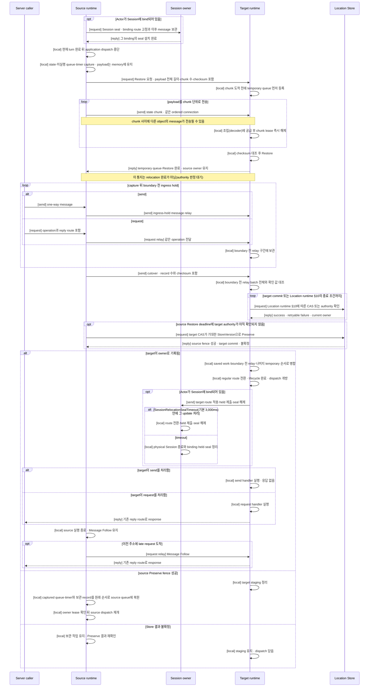
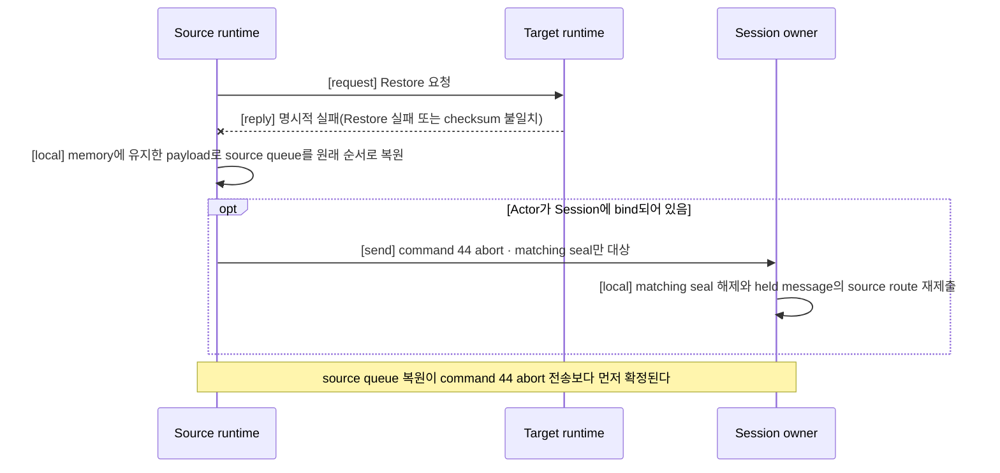

# Actor와 Spot relocation 전체 흐름

[Location·Relocation 주제 목차](README.ko.md) · [스펙 목차](../README.ko.md) · [이전: 03. Relocation Store (Redis)](03-relocation-store-redis.ko.md) · [다음: 05. Host relocation 전체 흐름](05-host-relocation-flow.ko.md)

> **이 문서가 정의하는 것** — Actor나, node가 바뀌어도 같은 주소로 계속 message를 받는 논리
> instance인 [Spot](../00-foundation/02-glossary.ko.md#spot) 하나를 source node에서 target
> node로 옮길 때 message를 계속 받아들이면서 owner, queue와 bound Session route를 바꾸는 단일 handoff
> 프로토콜. 모든 시작 API(Host `Relocate`, cross-node Actor Join, User Spot authority 이전)와
> 네 언어 runtime이 이 프로토콜 하나를 공유한다.

## 1. Application에서 보이는 결과

이 문서는 Actor와 Spot relocation이 시작된 뒤 target에서 message 처리를 다시 시작할
때까지의 공통 계약을 정의한다. Host `Relocate`, cross-node Actor Join과 User Spot authority
이전은 시작 조건과 callback은 다르지만 이 문서의 owner 전환과 message 처리 순서를 함께
사용한다. [Host relocation 전체 흐름](05-host-relocation-flow.ko.md)은 host operation이 이
흐름을 여러 Actor와 Spot에 적용하고 `Relocated`를 반환하는 source 측 완료 조건을 정의한다.

Actor나 Spot을 현재 처리하는 node를 [owner](../00-foundation/02-glossary.ko.md#owner)라고 한다.
Relocation이 성공하면, 각 Spot·Actor의 현재 owner를 여러 node가 함께 확인할 수 있도록 보관하는
[Location Store](../00-foundation/02-glossary.ko.md#location-store)가 가리키는 owner가 source에서
target으로 한 번 바뀌고, target은 같은 object ID와, 같은 incarnation을 구분하는
[`ObjectGeneration`](../00-foundation/02-glossary.ko.md#objectgeneration) 값으로 처리를 계속한다. Application은 target node,
Store version, relay connection이나 전환 제어 message를 직접 관리하지 않는다.

이 계약은 계획된 graceful relocation을 다룬다. Source 또는 target process가 종료된 뒤 다른
runtime이 진행 중인 relocation을 자동으로 이어받는 기능은 제공하지 않는다. 장애와 자동
재선택의 전체 범위는 [장애 대응과 failover 범위](06-failure-failover-policy.ko.md)가
정의한다.

## 2. 각 주체의 책임

| 주체 | 책임 |
|---|---|
| Application | Host relocation을 요청하거나 Actor Join을 등록한다. State 보존이 필요하면 object 종류에 맞는 relocation adapter를 제공한다. |
| Source runtime | 현재 application turn을 끝내고 새 dispatch를 중단한다. 갈무리한 application state, 실행하지 않은 기존 작업과 timer를 target에 직접 전송하고, 그 payload 전체를 [§4.4](#44-ordered-relay와-one-way-cutover)의 authority 판정이 끝날 때까지 memory에 유지한다. 이전 주소로 계속 도착하는 message를 target에 relay한다. Location Store owner는 변경하지 않는다. |
| Target runtime | Temporary queue를 먼저 준비하고 object를 생성·복원한다. boundary 전 relay batch와 cutover를 검증한 뒤에만 Location Store CAS를 실행하고, 성공한 경우에만 target queue를 연다. Bound Actor라면 그 뒤 Session owner에 target route 적용과 seal 해제를 알린다. |
| Session owner | Bound Actor의 physical Session을 유지한다. 이 handoff에서 요청받는 역할은 §7이 정의하며, 실제 처리는 [Session과 Actor binding 「8」](../04-session/02-session-actor-binding.ko.md#8-actor-relocation-중-session의-책임)이 소유한다. |
| Location Store | 현재 owner, object generation과 membership을 보관한다. 예상한 source 값이 그대로일 때만 target이 요청한 값을 한 번에 반영한다. |
| [Relocation Store](../00-foundation/02-glossary.ko.md#relocation-store) | Actor·Spot relocation의 state·기존 작업·timer handoff payload는 보관하지 않는다. Instance Spot cold activation의 최초 message·생성 정보와, relocation 뒤 완료되는 pending request의 reply payload·terminal 결과만 보관한다. Owner를 결정하지 않는다. |
| Transport | Authenticated peer, node 실행 세대와 frame 형식을 확인한다. 같은 TCP connection으로 보낸 relay와 전환 경계의 순서를 유지한다. |

한 주체가 다른 주체의 결정을 반복해서 검증하지 않는다. Transport의 peer 검증, target의
Location Store CAS와 Session owner의 current binding 검증은 서로 다른 책임이다.

## 3. 무엇을 한 번에 옮기는가

Framework가 독립적으로 옮기는 Actor 하나 또는 Spot 묶음을
[relocation unit](../00-foundation/02-glossary.ko.md#relocation-unit)이라고 한다.

| 대상 | Relocation unit |
|---|---|
| Entry Spot에 속한 Actor | Actor 하나 |
| `PerActor` User Spot | Spot-level authority 하나와 member Actor 각각 |
| `SpotWide` User Spot | User Spot과 전환 시점의 member Actor 전체 |
| Instance Spot | Instance Spot 하나 |

Entry Spot instance 자체는 node lifecycle에 속하므로 옮기지 않는다. Entry Spot Actor는 target
node에 이미 존재하는 Entry Spot으로 이동한다. `PerActor` User Spot은 Spot authority를 먼저
바꿀 수 있으며, member Actor는 각각 같은 공통 흐름으로 이동한다. `SpotWide` User Spot은 Spot과
member Actor owner를 한 번의 조건부 변경으로 함께 바꾼다.

Relocation은 object를 삭제하고 다시 만드는 작업이 아니므로 `ObjectGeneration`을 유지한다.
Owner가 바뀐 순서는, 같은 object incarnation 안에서 owner가 바뀐 차례를 매기는
[`AuthorityOwnerGeneration`](../00-foundation/02-glossary.ko.md#authority-owner-generation)으로
구분한다. 여러 control message가 같은
이동에 속하는지는 runtime이 만든 0이 아닌 relocation identity로 구분한다. 이 identity는
`RelocationId`, 하나의 `RelocationId` 안에서 target 준비 시도마다 유일한 0이 아닌 값
`targetAttemptGeneration`과 coordinator fence — 이동을 시작한 coordinator가 예상하는 현재
owner 값 — 로 구성된다. Restore
요청, state chunk(§4.2)와 target의 Location Store CAS는 같은 relocation identity로 한 이동에
결합된다. 귀속은 오직 이 relocation identity와 그 값을 실어 온 connection으로만 판정하며, 도착
순서나 가장 최근 시각 같은 신호로 prepare·chunk·CAS를 특정 relocation에 귀속시키지 않는다.
Application은 이 identity를 만들거나 해석하지 않는다.

Relocation unit 하나의 handoff state는 다음 값을 소유한다.

| 값 | 용도 |
|---|---|
| Object identity | ActorId 또는 SpotId와 `ObjectGeneration`을 고정한다. |
| Source fence | Source node RID·node generation과 처음 읽은 owner generation을 고정한다. |
| Target fence | Target node RID·node generation과 요청할 새 owner generation을 고정한다. |
| Relocation identity | Retry와 late completion이 같은 handoff에 속하는지 구분한다. |
| Saved-work reference | 갈무리한 state·기존 queue·timer가 direct payload chunk transfer를 기다리며 source memory에 머무는 것을 가리킨다. |
| Relay connection | Source relay와 cutover boundary의 TCP 순서를 고정한다. |
| Temporary queue | Target dispatch가 열리기 전 도착한 작업을 보관한다. |

이 state는 application message별 ACK나 숫자 high-water를 소유하지 않는다. 같은 payload가 두
번 전송되면 두 번 수락된 message이며, transport나 기존 request 계약이 별도 operation
identity를 제공한 경우에만 기존 중복 처리 규칙을 적용한다.

## 4. 정상 처리 순서

### 4.1 Source를 멈추기 전에 target을 준비한다

Framework는 target node가 object 종류와 application version을 지원하는지 먼저 확인한다.
Target을 사용할 수 없으면 source application dispatch를 막지 않고 relocation을 시작하지
않는다.

Actor가 Session에 bind되어 있으면 source application dispatch를 중단하기 전에 Session owner가
그 binding을 seal한다. Seal 뒤 Session에서 들어온 request와 push는 Session owner가 보관한다.
같은 Session에 bind된 다른 Actor는 영향을 받지 않는다.

### 4.2 Source는 실행을 멈추지만 message 수신은 멈추지 않는다

Source는 현재 실행 중인 handler와 timer callback을 끝낸 뒤 새 application turn을 시작하지
않는다. 그 전에 queue가 수락했지만 아직 실행하지 않은 작업, timer 정보와 application state를
capture해 하나의 relocation payload로 확정한다. 이 payload는 저장소에 기록하지 않는다.
Source는 payload 전체를 memory에 유지한 채 target에 직접 전송하며, cutover submit이 terminal
[§4.4](#44-ordered-relay와-one-way-cutover)의 authority 판정 또는 source lease 만료 terminal까지 이 memory 사본이 handoff 원본이다.

직접 전송 payload는 schema의 `relocation-envelope-v1`이다. Provider 전체 envelope 없이
canonical big-endian field stream으로 encoding한다. Schema 선언 순서는 `relocation`, `object`,
`applicationVersion`, `applicationStates`, `savedWork`, `timerRegistrations`,
`pendingTimerTicks`다. Target은 Location Store의 authority key를 UTF-8 authority-key byte
순서로 정렬해 canonical participant inventory를 재구성한다. Participant identity는 stream에
의도적으로 넣지 않는다. `participantId`는 이 정렬된 inventory의 zero-based index에 1을 더한
값이고, 모든 participant vector는 schema가 선언한 key로 정렬되고 unique해야 한다.

`savedWork`는 `(participantId, order, record)`의 frozen ordered vector다. Frozen record에는
record kind, source identity, optional metadata, `operationId`, operation kind, conditional reply
route와 record-kind body가 들어간다. 따라서 queue에 있던 request는 correlation/operation identity,
reply route와 record-kind별 deadline field를 보존한다. `timerRegistrations`에는 participant별
timer name, handler type, period, overrun policy, catch-up limit, unhandled-exception policy, 완료한
delivery·schedule index, 다음 Unix-millisecond schedule cursor가 들어간다. `pendingTimerTicks`에는
participant/order sequence, timer name, delivery·scheduled index, scheduled timestamp,
skipped-tick count가 들어간다. Native timer handle과 callback continuation은 이 frozen
saved-work record에 넣지 않는다.

Command 40 `relocationPrepare`가 이 stream의 manifest다. `payloadTotalLength`,
`payloadChunkCount`, `payloadChecksumCrc32c`가 complete encoded logical stream을 설명한다.
`payloadChecksumCrc32c`는 그 stream 전체의 CRC-32C integrity check다. Provider envelope
checksum이 아니며 stream 주위에 provider envelope을 추가하지 않는다. Command 40 뒤 source는
stream을 command 52 `relocationState` chunk로 relay와 같은 ordered mesh connection에
`[send]`한다. Frozen
record 내부를 포함해 어느 byte boundary에서도 chunk를 나눌 수 있고, chunk 사이에는 같은
connection의 다른 object message가 섞여 전송될 수 있다.

전송 chunk 하나의 유효 크기는 다음 세 값 중 가장 작은 값이다 — server 설정
`RelocationPayloadChunkLimit`(chunk 하나의 encoded 크기, 기본 256 KiB), target이 seal 전에
이미 존재하는 reply로 알린 자기 유효 수신 chunk 상한, §5.3의 유효 in-flight 예산. 이 협상
reply가 존재하지 않는 경로(승인 왕복이 없는 `JoinEntrySpot` 등)에서는 어느 배치에서도 안전한
32 KiB 보수값을 chunk 크기로 사용한다.

Capture로 확정한 기존 queue prefix와 timer를 source는 relay lane에 다시 넣지 않는다. 이
saved-work reference를 relay가 다시 만들거나 target이 saved-work record와 relay record를
중복 제거하면 안 된다. Relay-ready 전에는 target의 명시적 실패 reply로 source가 memory payload를 원래 queue 순서로 복원하며 Location Store를 다시 읽지 않는다. Relay-ready 뒤 source 재개는 [§4.4](#44-ordered-relay와-one-way-cutover)의 authority 판정을 따른다.

Source mailbox나 이전 route로 새 message가 계속 도착할 수 있으므로 queue가 비기를 기다리지
않는다. Restore 요청을 보낸 뒤 target이 relay 수신 준비를 알릴 때까지 새 message를 source
ingress hold에 계속 넣는다.

Ingress hold의 permit 반환과 relocation backlog handoff는
[Application job queue와 backpressure §3](../01-execution/04-application-job-queue-and-backpressure.ko.md#3-ordinary-ingress-permit-순서)을 따른다.

개별 message 크기, transport, deadline과 cancellation 제한은 이 보관 중에도 그대로 적용한다.

### 4.3 Target은 실행하지 않은 상태로 복원한다

Target은 application instance lookup이나, 등록된 stable type에 맞는 instance를 생성하는 application
코드인 [factory](../00-foundation/02-glossary.ko.md#factory) 호출보다 먼저, Restore 요청을 받는 즉시 state
chunk가 도착하기 전에 relocation 대상의 temporary queue를 등록한다. Temporary queue가 없는
target은 Restore를 시작하거나 Location Store를 변경하지 않는다. Restore 중 target에 직접
도착한 message는 temporary queue에 넣고 application handler에는 전달하지 않는다.

**Target은 도착한 각 chunk를 즉시 조립에 공급하고 입력 message buffer를 정리한다.** 조립의
정의는 [06 §9](../02-channel-transport/06-wire-protocol.ko.md#9-maintenance-capture와-relocation-envelope)가
소유한다.
Core receive HWM의 dequeue 계상은 [Core socket 계약](../../../../../../../core/doc/spec/core/socket/README.ko.md#8-구현-및-contract-test-검증-요구)을,
Framework payload 저장소의 수명은 [Payload 소유권 §8](../01-execution/05-payload-ownership-and-codec.ko.md#retained-record-children)을 따른다. 모든 chunk를 조립한 뒤
Restore 요청이 실은 전체 checksum과 대조하고, 일치할 때만 factory를 실행해 application
state, 기존 queue와 timer를 복원한다. Checksum이 다르면 복원을 시작하지 않고 relay 수신 준비
reply 대신 명시적 실패 reply를 보낸다 — TCP 위에서 checksum 불일치는 일시적 전송 오류가
아니라 구현 결함이나 memory 손상의 신호이므로 재시도하지 않으며, 부분 조립된 payload로
복원하지 않는다.

Chunk와 Restore 요청이 어느 이동에 속하는지는 도착한 connection과 message가 실은 relocation
identity(§3)로만 판정한다. Exact identity가 다른 chunk나 Restore 요청은 진행 중인 조립에
연결하지 않고 폐기한다. 같은 relocation identity의 Restore 요청에 처음 선언한 값과 다른 길이나
checksum이 도착하면 기존 조립을 재사용하지도 덮어쓰지도 않고 명시적 conflict 실패로 끝낸다.
같은 Restore 요청을 다시 받으면 temporary queue와 조립을 새로 만들지 않고 기존 진행 상태를
사용한다.

복원한 기존 queue와 timer는 dispatch가 닫힌 saved-work 구간에 유지하며 source relay와 섞지
않는다.

Temporary queue와 saved-work 구간은 dispatch 전 ordered durable backlog이며, 유한한 handoff 뒤 payload를 소유한다. Staging ingress와 runnable callback의 permit 반환·재획득은 [Application job queue §3](../01-execution/04-application-job-queue-and-backpressure.ko.md#3-ordinary-ingress-permit-순서)을 따른다.

Temporary queue와 Restore가 준비되면 target은 source에 **relay 수신 준비 완료**를 알린다. 이
통지는 relocation 완료가 아니다. Location Store owner는 아직 source이며 target은 application
handler를 실행하지 않는다. Target은 staged payload마다 target-side retained-byte owner를
확정하기 전에는 이 reply를 보내지 않는다.

여기서 Restore request는 단순히 state 복원만 요청하지 않는다. Source는 target에 **temporary
queue를 먼저 설치하고, 직접 전송한 state·기존 queue·timer를 조립·검증·복원한 뒤,
application dispatch를 열지 않은 상태에서 relay를 받을 준비를 끝내라**고 요청한다. 이에 대한
`relay 수신 준비 완료` reply는 이 준비가 끝났다는 뜻이며 owner 변경이나 queue 개방을 뜻하지
않는다.

### 4.4 Ordered relay와 one-way cutover

Source는 target의 relay 수신 준비 reply를 받은 뒤, capture 뒤 ingress hold가 수락한 message만
같은 TCP connection으로 relay한다. Capture로 확정한 기존 queue와 timer는 target이 직접
전송된 payload에서 이미 복원했으므로 다시 relay하지 않는다. Relay를 직렬화하는 지점에서
현재까지 수락한 message 뒤에 one-way cutover control을 `[send]`로 넣는다. Cutover는 target에
**boundary보다 앞선 relay를 모두 보냈으므로 Location Store owner CAS, queue 병합과 application
dispatch 개방을 진행할 수 있다**고 알린다. Cutover control에는 `RelocationId`, boundary 전에
보낸 relay record 수와 그 relay 전체의 CRC-32C checksum을 함께 싣는다. Target은 cutover
reply를 보내지 않는다. 이 control을 보내는 동안 새 message가 계속 도착해도 boundary 뒤
구간에 넣으므로 cutover가 mailbox drain을 기다리지 않는다.

Relay 수신 준비 reply의 acceptance는 cutover submit 실패만으로 source dispatch를 다시 여는
근거가 아니다. Source는 cutover를 한 번 제출하고 submit terminal까지 queued-job permit을
유지한다. Capture payload와 boundary 전후에 수락한 ingress-hold record의 원본은
[Location runtime §6.1·§10](01-location-runtime.ko.md#61-read와-cas)의 authority settlement가
확인될 때까지 유지한다. 수락한 record의 relocation backlog handoff와 permit 반환·재획득은
[Application job queue §3](../01-execution/04-application-job-queue-and-backpressure.ko.md#3-ordinary-ingress-permit-순서)을 따른다. Target commit이 확인되면 source copy를 해제하고 target route를 채택한다. Source `Preserve` fence가 성공하면 captured queue·timer 뒤에 보관한 record를 원래
수락 순서로 source queue에 되돌린다. Source owner lease가 유효할 때 source dispatch를 다시 연다. `Preserve`가 불확정이면
source owner lease가 유효한 동안 양쪽이 작업을 보관하며 결과가 확정될 때까지 dispatch를 열지 않는다. Framework memory
사본은 pipe를 점유하지 않아 §5.3의 in-flight 예산에 포함하지 않는다. Target의 별도 cutover
reply는 없다.

Source `Preserve`가 성공하기 전에 source owner lease가 만료되면 [failure/failover policy §7](06-failure-failover-policy.ko.md#7-store-장애)의 expired-owner 규칙으로 끝낸다. Source는 해당 unit의 dispatch와 Store 변경을 영구 중단하고 보관 작업을 폐기한다. 관찰된 terminal이 없는 pending request는 원래 절대 deadline 안에서 원래 reply route에 `Unavailable`을 한 번 받으며, 이는 실행되지 않았다고 단정하지 않는다. 이미 완료된 one-way send에는 더 이상 완료를 전달하지 않고, 전달 여부가 불확실하면 diagnostics에 기록한다. Source lease 만료는 결과를 모르는 target CAS를 정리하지 않는다. Target은 [Location runtime §10](01-location-runtime.ko.md#10-store-응답을-받지-못했을-때)에 따라 같은 `RelocationId`의 commit을 확인한 뒤에만 dispatch를 연다. Staging terminal도 §10을 따른다. Source lease 만료 뒤 target의 CAS 재제출·staging terminal은 [Location runtime §10](01-location-runtime.ko.md#10-store-응답을-받지-못했을-때)이 정한다. Store를 계속 사용할 수 없으면 그 절에 따라 authority를 확인한다. 이후 object 처리는 [failure/failover policy §4.2](06-failure-failover-policy.ko.md#42-기존-actor와-spot)를 따른다. Source 보관 기간은 owner lease TTL을 넘지 않는다.

Cutover가 target에 도착하면 같은 connection에서 boundary보다 앞서 보낸 ingress-hold relay가
모두 도착한 것이다. Target은 cutover가 실은 record 수와 checksum을 수신한 relay와 대조한 뒤
즉시 CAS와 queue 개방을 시작한다. Ordered connection에서 cutover가 도착했다면 앞선 relay도
모두 도착한 것이므로 이 대조는 정상 경로에서 항상 성공하며, 대조 실패는 구현 결함을 뜻하는
Error다.

Server 설정 `RelocationCutoverWaitTimeout`(**기본 1,000 ms**)은 relay 수신 준비 reply부터
cutover 도착까지의 Warning 임계값일 뿐이다. Connection이 끊겨 cutover가 유실된 경우, source process가 실행 중이면 source는 새
connection으로 boundary 전 relay batch 전체와 cutover를 다시 보낸다. Target은 부분 수신한
boundary 전 relay 구간을 폐기하고 재전송된 batch 전체로 한 번에 교체한다 — 개별 중복 제거나
부분 병합이 아니라 전체 교체이므로, 새 connection에서도 구간 안의 순서가 batch 순서로
확정된다. 확인 값이 일치하면 target은 CAS와 queue 개방을 진행한다.

대기 시간이 끝나도 검증된 cutover 없이 CAS나 application dispatch를 시작하지 않는다.
Target은 `cutover_timeout` Warning을 기록한다. Restore absolute deadline은 그 relocation을 시작한
operation의 [deadline](../00-foundation/02-glossary.ko.md#deadline)이다. 이 deadline에 source는
[Location runtime §6.1·§10](01-location-runtime.ko.md#61-read와-cas)의 `Preserve` fence로
authority를 확정한다. Source fence가 먼저 성공하면 target의 늦은 CAS는 실패하고 target은
staging을 정리한다. Source는 §4.4의 보관 작업을 직접 처리하므로 이 경로에서 accepted request에
`Unavailable`을 보내지 않는다. Target commit이 먼저 확인되면 target queue가 작업을 처리한다.
`Preserve`가 불확정이면 source lease가 유효한 동안 보관과 재확인을 계속하며, lease 만료는 위 expired-owner 규칙으로 끝낸다. 늦은 cutover와 duplicate cutover는 확정된
authority를 다시 바꾸지 않는다.

Source는 이 경계 뒤에도 이전 주소로 늦게 도착하는 message를 받을 수 있다. Owner 변경 전에는
temporary queue로 relay하고, owner 변경 뒤에는 이전 owner가 그 message를 새 owner에게 대신
전달하는 [Message Follow](../00-foundation/02-glossary.ko.md#message-follow) 경로로 target에 전달한다(§10).

### 4.5 준비를 끝낸 target만 Location Store를 변경한다

Target은 다음 조건을 모두 만족한 뒤에만 Location Store CAS를 실행한다. Source, Session owner,
Message Follow와 route cache는 이 CAS를 대신 실행하지 않는다.

- Factory와 Restore를 완료했다.
- Temporary queue가 등록되어 있다.
- Source가 보낸 boundary 전 relay batch 전체와 cutover의 record 수·checksum을 검증했다(§4.4).
- 현재 owner, `ObjectGeneration`, owner generation과 membership이 처음 확인한 source 값과
  같다.

처음 읽은 값이 그대로일 때만 새 값을 기록하는 조건부 변경을
[CAS](../00-foundation/02-glossary.ko.md#compare-and-set)라고 한다. Target은 CAS 한 번으로 필요한 owner와
membership을 모두 바꾼다. 조건 하나라도 다르면 아무 값도 변경하지 않고 target queue도 열지
않는다.

Target CAS의 재제출·종료·응답 불확정 판정과 source의 Restore deadline `Preserve`는 [Location runtime §10](01-location-runtime.ko.md#10-store-응답을-받지-못했을-때)이 정한다. Commit 확인 전에는 Session route update를 보내지 않는다.

Actor relocation unit이면 준비한 target Actor만 제거한다. Spot relocation unit이면 target에
준비한 Spot scope와 그 unit에 포함된 staging Actor를 함께 제거한다. Source `Preserve` fence가 성공하면 [§4.4](#44-ordered-relay와-one-way-cutover)에 따라 source
application 실행을 재개한다. Target commit이 확인된 경우에만 Message Follow를 유지한다.

### 4.6 Target은 기존 작업부터 점진적으로 queue를 연다

CAS가 성공하면 target은 다음 순서의 ordered durable backlog를 확정한다.

1. Relocation 전에 source queue가 이미 수락했던 작업과 timer
2. Source가 전환 경계보다 앞에 relay한 작업
3. 그 뒤 temporary queue가 수락한 작업

그다음 temporary route를 기존 dispatch route로 전환하고 필요한 lifecycle callback을 끝낸다.

**Backlog가 ordinary ingress보다 먼저 handler turn의 queue 순서를 확보하며, 이 보장을
배타적 접근을 쥔 채 callback을 실행하는 방식으로 구현하지 않는다.** 그 방식은 외부
callback이 같은 배타적 접근 primitive를 다시 획득하는 구조가 되기 쉬우며
[상태 소유와 state lane §6](../01-execution/06-state-ownership-and-lanes.ko.md#6-재진입을-만들지-않는-구조)이
금지한다. 이 보장은 다음 두 형태 중 하나의 선형화점으로 만든다.

- dispatch 개방 전에 backlog 몫의 placeholder ownership claim을 소유 turn 안에서
  확정하고, 개별 execution claim은 배타적 접근 밖에서 채운 뒤 같은 소유 turn에서
  placeholder를 정산하면서 ordinary admission을 연다.
- 또는 backlog가 비었음을 원자적으로 관측한 시점에만 ordinary dispatch로 전환한다 —
  관측 전에 게시된 backlog turn보다 ordinary ingress가 앞설 수 없다.

Dispatch가 runnable해진 backlog turn의 permit 취득과 반환은 [Application job queue §3](../01-execution/04-application-job-queue-and-backpressure.ko.md#3-ordinary-ingress-permit-순서)을 따른다. 기다리는 item은 backlog payload owner가 계속 소유한다. Timer는 원래 timer
lifecycle을 유지하고 callback turn이 runnable할 때 해당 ingress 규칙을 따른다.

Target은 owner 변경, queue 병합과 application dispatch 개방을 끝낸 뒤 source에 별도의 완료
reply를 보내지 않는다. Bound Actor라면 target runtime이 Session owner에 target binding
route 적용, held message 제출과 seal 해제를 one-way control로 알린다(§7).

이 diagram은 완전한 relay와 cutover를 검증한 정상 경로를 보여준다. `[send]`는 one-way라
reply가 없고, `[request]`는 반드시 대응하는 `[reply]`가 있다. `[request relay]`는 original
request를 새 operation으로 만들지 않고 전달한다. `[local]`은 network message가 아닌 runtime
내부 처리다.

Relay 수신 준비 reply가 accepted 상태가 되기 전 target이 명시적으로 실패하면 아래 순서로
되돌린다. Durable abort와 source queue 복원을 **먼저 확정한 뒤에만** source coordinator가
command 44 abort를 one-way로 보낸다. Session owner가 이 abort를 받았을 때 matching seal을
해제하고 held message를 source route로 제출하는 순서는
[Session과 Actor binding 「8.1」](../04-session/02-session-actor-binding.ko.md#81-seal-held-message와-route-전환)이
소유한다 — 이 문서는 그 순서를 다시 정의하지 않는다.

## 5. Message 순서와 완료 의미

### 5.1 보장하는 순서

Source가 같은 TCP connection으로 보낸 relay와 전환 경계는 target에 같은 순서로 도착한다.
Target execution queue에는 payload로 전송된 기존 작업, 전환 경계 전 relay, 그 뒤 수락한 작업
순으로 넣는다. Target queue가 수락한 뒤에는 Actor·Spot의 기존 직렬 실행 규칙을 따른다.

서로 다른 TCP connection에서 도착한 message 사이의 전역 순서는 보장하지 않는다. 예를 들어
이전 주소를 거친 Message Follow와 새 주소로 직접 보낸 message 중 어느 것이 먼저 target에
도착할지는 보장하지 않는다.

### 5.2 `send`와 `request`

| 종류 | Relay할 때 유지하는 값 | Caller가 기다리는 결과 |
|---|---|---|
| `send` | 대상 identity와 payload | Transport submit 결과까지만 확인한다. Target application response는 없다. |
| `request` | Retry나 중복 전달을 같은 작업으로 판정하는 값인 [Operation identity](../00-foundation/02-glossary.ko.md#operation-identity), correlation, reply route, payload와 남은 request 예산. 요청자는 terminal 완료를 위해 원래 absolute deadline을 유지한다 | 확정된 owner의 response, 원래 request deadline의 terminal 또는 source lease 만료 시 [§4.4](#44-ordered-relay와-one-way-cutover)의 `Unavailable` terminal을 기다린다. Source `Preserve` fence가 이기면 source가 보관 작업을 처리한다. |

Relocation은 `send`에 application ACK를 추가하지 않는다. `request`를 새로운 operation으로
바꾸거나 다른 target에 숨겨서 다시 제출하지 않는다. Source는 relayed request의 caller가
아니다. Caller가 유지한 pending request는 확정된 owner의 response 또는 기존 deadline으로
끝난다. Source `Preserve`가 이겨도 같은 operation identity로 보관 작업을 처리하며 새로운
request를 만들지 않는다. 두 종류 모두 같은 queue 순서를 사용하며,
message마다 ACK, 숫자 high-water나 durable delivery journal을 추가하지 않는다.

Diagram이나 contract test에서 `[request]`를 표시하면 정상 경로의 대응 `[reply]`도 함께
표시한다. Timeout과 failure reply는 같은 request의 실패 결과이며 새 request가 아니다.

### 5.3 Relocation 전용 capacity 제한을 두지 않는다

Relocation은 동시 unit 수, participant 수나 relay queue의 record 수에 별도 correctness 상한을
두지 않는다. Runtime memory, negotiated frame 크기와 Location Store record/page 크기처럼
relocation 밖에서도 적용되는 제한은 그대로 유지한다. Resource가 즉시 준비되지 않으면 source
dispatch를 막기 전에 기다리며, 이미 시작한 relocation을 capacity 도달을 이유로 실패시키지
않는다.

직접 전송하는 relocation payload가 공유 mesh connection의 대역폭을 독점하지 않도록, source
노드는 동시에 전송 중인 relocation chunk byte 합계를 in-flight payload 예산으로 제한한다.

| 설정 | 적용 범위 | 기본값 |
|---|---|---|
| `RelocationInFlightPayloadBudget` | Source 노드 하나가 peer connection 하나에서 동시에 전송 중인 relocation chunk byte 합계 | 16 MiB. 0이면 예산을 적용하지 않는다. |
| `RelocationNodeInFlightPayloadBudget` | Source 노드 전체에서 동시에 전송 중인 relocation chunk byte 합계 | 0 = 미적용 |

합계가 예산에 차 있으면 새 relocation unit은 source admission seal을 적용하기 전에 대기하고,
이미 시작한 unit의 다음 chunk 제출은 여유가 생길 때까지 기다린다. Seal 전 대기이므로 대기하는
Actor·Spot은 그동안 message를 정상적으로 처리하며, 이 대기는 서비스 중단 시간 측정에
포함되지 않는다. 예산은 payload 전체 크기가 아니라 동시에 전송 중인 byte를 제한하므로,
예산보다 큰 payload도 chunk가 순서대로 흘러가며 시작하고 완료할 수 있다 — 예산 때문에
시작하지 못하는 payload 크기는 없다. 이미 chunk 전송을 시작한 relocation을 예산 도달을
이유로 실패시키지 않는다.

계상 기준의 목표는 encoded payload byte가 아니라 frame metadata charge를 포함한 Core accounted
charge다 — chunk를 제출할 때 더하고, Core가 그 chunk의 charge를 해제한 것을 관찰하면 뺀다.
Core가 pipe별 적용 HWM과 accounted charge를 조회하는 공개 관찰 API를 제공하기 전에는, 유효
예산을 pipe role별 하한에 기반한 고정 보수값과 설정값 중 작은 값으로 운용한다. 재전송 창
동안 유지하는 boundary batch 사본은 pipe를 점유하지 않는 Framework memory이므로 이 예산에
계상하지 않는다(§4.4).

Staging backlog의 permit handoff와 runnable callback permit은 [Application job queue §3](../01-execution/04-application-job-queue-and-backpressure.ko.md#3-ordinary-ingress-permit-순서)을 따른다. 따라서
ordered backlog 크기가 target의 live job limit보다 커도 failure나 all-at-once reservation
없이 점진적으로 실행한다. Backlog payload의 retained-byte ownership은 마지막 item이 ordinary
terminal ownership으로 이전되거나 정리될 때까지 유지한다.

## 6. Location Store 전환 계약

Location Store CAS는 owner가 동시에 source와 target 두 곳에 존재하지 않게 만드는 전환점이다.
Target은 예상한 source owner와 generation을 조건으로 주고, 자기 node와 새 owner generation을
새 값으로 요청한다.

| CAS 결과 | 처리 |
|---|---|
| 변경 성공 | Target이 owner다. Target queue를 열고 source로 되돌리지 않는다. |
| 조건 불일치 | [Location runtime §6.1·§10](01-location-runtime.ko.md#61-read와-cas)의 authority settlement로 판정한다. Source `Preserve` fence가 이겼으면 target staging을 정리하고 source가 보관 작업을 재개한다. |
| Store가 retry 가능한 실패를 반환 | Target queue는 닫아 두고 일반 재시도와 source lease 만료 뒤 예외를 [Location runtime §10](01-location-runtime.ko.md#10-store-응답을-받지-못했을-때)에 맡긴다. |
| Target이 CAS 응답을 받지 못함 | Target CAS 재제출과 그 종료는 [Location runtime §10](01-location-runtime.ko.md#10-store-응답을-받지-못했을-때)을 따른다. |
| 다른 valid owner나 generation이 확인됨 | Stale relocation으로 즉시 종료하고 준비한 target object와 queue를 제거한다. |
| Source Restore deadline에 CAS 결과가 불확정 | Source `Preserve`와 target CAS 재제출은 [Location runtime §10](01-location-runtime.ko.md#10-store-응답을-받지-못했을-때)을 따른다. |

Cutover와 Session route update에는 완료 reply가 없다. Source와 Session owner는 Location
Store를 대신 사용하지 않는다.

## 7. Actor relocation 중 Session

Session의 physical STREAM connection과 Session scope는 Actor가 다른 node로 이동해도 Session
owner process에 유지된다. Socket, transport handle과 Session callback state를 target Actor
process로 이동하거나 복제하지 않는다. 이 handoff가 Session owner에 요청하는 것은 세 가지뿐이다
— relocation 시작 전 해당 binding을 seal하는 것(§4.1), owner 전환이 끝난 뒤 binding route를
target으로 바꾸는 것(§4.6), 그리고 target owner 확정 전에 실패하면 matching seal만 해제하고
held message를 source route로 되돌리는 것(§4.4의 abort diagram)이다. Session owner는
relocation target을 선택하거나 준비 상태를 판정하지 않으며 Location Store를 읽거나 변경하지
않는다.

Session owner가 검증하는 값, seal과 route 전환의 정확한 시점·timeout(`SessionRelocationSealTimeout`,
기본 3,000 ms)과 command 42·43·44의 payload는
[Session과 Actor binding 「8. Actor relocation 중 Session의 책임」](../04-session/02-session-actor-binding.ko.md#8-actor-relocation-중-session의-책임)이
소유한다. 이 문서는 그 절이 정의하는 seal·route 전환 결과를 전제로 §4·§9의 handoff 순서를
서술하며, Session owner의 검증 규칙을 다시 정의하지 않는다.

## 8. Actor와 Spot별 차이

공통 owner 전환과 queue 순서는 모두 같고, 준비하는 state와 callback만 다르다. 각 adapter는
아래 표의 값만 제공하며, queue 병합, target-only CAS, timeout과 Session 책임은 adapter마다
다시 구현하지 않는다.

| 대상 | 추가로 준비하거나 변경하는 값 | Callback |
|---|---|---|
| Cross-node Actor Join | Actor owner와 source·target Spot membership을 같은 CAS에서 바꾼다. | Target User Spot의 admission 결과에 따라 진행하며, commit 뒤 Join lifecycle callback을 실행한다. |
| Entry Spot Actor host relocation | Actor owner와 target Entry Spot membership을 바꾼다. | Application이 요청한 Join이 아니므로 membership callback을 호출하지 않는다. |
| `PerActor` User Spot authority | Spot-level queue를 처리할 owner를 바꾼다. Member Actor는 각자 별도 unit으로 이동한다. | Spot authority 전환 자체는 member Actor callback을 호출하지 않는다. |
| `SpotWide` User Spot | Spot과 전환 시점의 member Actor owner·membership을 조건부 batch 하나로 바꾼다. | `ApplicationSignaled`이면 target queue를 열기 전에 relocation-ready completion callback을 실행한다. |
| Instance Spot | Spot owner와 state·queue·timer를 옮긴다. Actor와 Session 단계는 없다. | Target Restore 뒤 queue를 열고 source에 `OnClosing(RelocationOut)`을 적용한다. |

각 API의 target 선택, membership callback과 completion payload는 Spot 문서와 Actor가 Spot에
속하는 관계를 다루는 문서, host operation의 mode와 최종 결과는
[Host relocation 전체 흐름](05-host-relocation-flow.ko.md)이 정의한다.

## 9. Timeout, failure와 cancellation

| 발생 시점 | 유지하는 owner와 queue | 결과와 후속 처리 |
|---|---|---|
| Target 선택 또는 준비 전 실패 | Source | Source dispatch를 막지 않고 operation을 실패시킨다. |
| Session seal 뒤, relay 수신 준비 reply가 accepted 상태가 되기 전 명시적인 실패 | Source | Target temporary queue를 실행하지 않는다. Memory에 유지한 payload로 source queue와 matching Session seal을 복원한다. |
| Chunk 조립 결과가 Restore 요청의 checksum과 다름 | Source | Target은 복원을 시작하지 않고 명시적 실패 reply를 보내며 조립 중인 chunk를 제거한다. Source는 memory의 payload로 queue를 복원하고 operation을 실패로 끝낸다. 재시도하지 않는다. |
| 같은 relocation identity의 Restore 요청에 처음과 다른 길이나 checksum이 도착 | Source | Target은 기존 조립을 재사용하지도 덮어쓰지도 않고 명시적 conflict 실패로 끝낸다. Source는 위 명시적 실패와 같이 복원한다. |
| Relay 수신 준비 reply 뒤 target CAS가 조건 불일치로 실패 | `Preserve` fence로 확정한 source owner 또는 다른 authority | Source fence가 이겼으면 target staging을 정리하고 source가 보관 작업을 재개한다(§4.4). |
| Target이 CAS 응답을 받지 못함 | Store를 다시 읽어 확인한 owner 또는 UNKNOWN | Source fence와 target CAS 재제출은 [Location runtime §10](01-location-runtime.ko.md#10-store-응답을-받지-못했을-때)을 따른다. Target commit 확인 전에는 queue를 열지 않는다. |
| Source Restore deadline에 authority가 불확정 | Settlement 대기 | Source fence와 target CAS 재제출은 [Location runtime §10](01-location-runtime.ko.md#10-store-응답을-받지-못했을-때)을 따른다. Dispatch는 target commit 확인 전까지 닫는다. |
| Connection이 끊겨 cutover가 유실됨, source process는 실행 중 | [§4.4](#44-ordered-relay와-one-way-cutover)의 cutover 재전송 결과 | Whole-batch 재전송과 교체는 [§4.4](#44-ordered-relay와-one-way-cutover)를 따른다. |
| Relay 준비 reply 뒤 cutover 대기 Warning 시한 동안 cutover와 재전송이 모두 오지 않음 | Source authority 유지, dispatch 봉인 | Target은 Warning을 기록한다. Source `Preserve` fence가 성공하면 target staging을 정리하고 source가 보관 작업을 처리한다(§4.4). |
| CAS 성공 뒤 target process 종료 | Target authority를 유지하지만 object는 unavailable | Source로 rollback하거나 다른 target에서 자동 재개하지 않는다. |
| `SessionRelocationSealTimeout` 안에 route update가 없음 | Target owner, Session connection 종료 | Session owner는 physical connection을 종료하고 binding, held message와 seal을 정리한다. 늦은 update는 Warning만 기록하고 무시한다. |
| Caller cancellation | Shared relocation은 현재 phase 규칙을 계속 따름 | 해당 waiter만 끝낸다. Source 복원 여부는 cutover submit 또는 cancellation이 아니라 [Location runtime §6.1·§10](01-location-runtime.ko.md#61-read와-cas)의 authority settlement가 정한다. |
| Source shutdown과 경쟁 | 먼저 seal한 operation | Relocation이 owner 전환 뒤라면 Message Follow 정리만 수행한다. Shutdown이 먼저면 새 relocation을 시작하지 않는다. |
| Cutover submit 결과를 알 수 없음 | Authority settlement 대기 | Source는 [§4.4](#44-ordered-relay와-one-way-cutover)의 원본 작업을 유지한다. Target commit이 확인되면 target route를 채택하고, source `Preserve`가 이기면 source가 처리한다. Store 결과가 불명확하면 source lease 만료 전까지 [§4.4](#44-ordered-relay와-one-way-cutover)에 따라 보관한다. |

Relay 수신 준비 reply 이전의 명시적 실패는 기존 source 복원 절차를 따른다. 그 뒤의
cutover submit 결과만으로 source dispatch를 열지 않는다. Restore absolute deadline에
source는 `Preserve` fence로 판정하며, target CAS 재제출은 [Location runtime §10](01-location-runtime.ko.md#10-store-응답을-받지-못했을-때)을 따른다. Target commit이면 target queue를 열고, source fence가 이기면 source가 [§4.4](#44-ordered-relay와-one-way-cutover)의 보관 작업을 직접 처리한다. 불확정이면 양쪽이 작업을 보관한다.

Store 장애가 Restore deadline까지 계속되면 Session은 별도의 seal timeout으로 종료될 수 있다.
Store가 정상화된 뒤 새 Session connection은 이전 binding을 복원하지 않고 일반 location
validation과 Actor·Spot 생성 또는 복구 절차를 다시 수행한다. 만료된 owner lease나 terminal
relocation state를 새 연결의 authority로 사용하지 않는다.

## 10. Message Follow와 정리

Owner 변경 뒤에도 sender가 잠시 이전 주소를 사용할 수 있다. 이 절은 §4.4가 이름만 언급한
Message Follow의 세부 규칙을 정의한다. Message Follow는 original operation identity, `ObjectGeneration`, payload, source routing id와
reply route를 유지한다. Store를 다시 읽거나 application handler를 source에서 실행하지
않는다. 기본 동작 기간, 최대 hop 수와 순환·generation 불일치의 결과값은
[Location runtime](01-location-runtime.ko.md)이 소유한다. 이 handoff는 그 값을 다시 정의하지
않고 다음 두 가지만 추가한다.

- **Session 연결과 중계가 이 전달 경로에 의존한다.** 이 경로가 없으면 이동한 Actor에 연결된
  session은 이동 자체가 성공해도 조용히 끊긴다. 따라서 Message Follow는 선택적인 성능
  최적화가 아니다.
- Message Follow의 전달량에는 이 handoff가 별도로 두는 상한이 없다 — Location runtime이 정한
  hop 수와 기간 제한 외에 relocation 전용 record 수·byte 상한을 추가하지 않는다.

원래 요청자의 [§5.2](#52-send와-request) deadline이 그 terminal 결과를 정한다. Wire의 request
command(22·25)는 남은 request 예산을 `remainingDeadlineMs`로 싣는다. Spot·Actor request를 처음 보낼 때
송신자는 앞 단계 뒤에 남은 양수 예산을 다음 정수 millisecond로 올려 싣고(u64 millisecond 최댓값, 약
5억 8천만 년을 넘는 예산은 그 최댓값으로 싣는다), 예산이 이미 끝났으면 보내지 않고
timeout으로 완료한다. 받은 hop은 받은 시각과 받은 예산으로 자기 local deadline을 정하고, 남은 값이 양수일
때만 다음 hop으로 보내며 만료된 request는 보내지 않는다. 전송 시간 때문에 받은 hop의 local deadline이
요청자의 deadline보다 늦을 수 있다. Relay는 요청자의 terminal deadline을 연장하지 않는다.

Late cutover나 Session route update가 늦었다는 이유로 Message Follow 기간을 무기한 연장하지
않는다. 반대로 Session route가 먼저 적용됐다는 이유로 이미 이전 주소로 전송된 server
message를 즉시 폐기하지 않는다.

Source는 Message Follow에 필요한 route를 제외한 source instance와 temporary state를 정리하고,
Target commit이 확인된 경우 source는 Message Follow route 외의 source instance와
temporary state를 정리하고 [§4.4](#44-ordered-relay와-one-way-cutover)의 보관 payload와
record를 해제한다. Source `Preserve`가 이기면 보관 작업은 source queue로 돌아간다. Cleanup
실패는 확인된 target owner를 되돌리는 조건이 아니다.

## 11. 구현 결정 — 하지 않는 relocation 기법

**객체나 묶음 하나의 이동은 하나의 상태 전이 규칙이 소유한다.** 이동 경로를 component별로
독립 진화하는 여러 state로 쪼개면 §4의 authority settlement와 source 복원 조건을 갈래마다 다시 구현하게 되고, 실패했을 때 어느 갈래가 정리 책임을 지는지 읽어낼
수 없다. 이 문서가 정하는 것은 단계 순서와 진행 단계 값이며, 그 값을 enum 하나로 보관할지
여러 immutable record로 표현할지, lock·actor loop·executor 중 무엇으로 직렬화할지는
**언어별 재량**이다 — 위 §4의 전이 순서와 `Preserve` fence 뒤 source 재개의 조건은 재량이 아니며, 이 순서를 지키는지는 §13의 검증 요구로 확인한다.

§4가 서술한 진행 단계에는 이름을 붙일 수 있다 — `SourceRunning`(정상 처리 중) →
`SourcePaused`(§4.1, current turn 종료 뒤 dispatch 중단) → `TargetRestoring`(§4.3, temporary
queue 설치와 Restore 진행) → `RelayReady`(§4.3, relay 수신 준비 reply) → 검증된 cutover
수신이면 `CutoverReceived`(§4.4) → Store가 일시적으로 실패하면 `StoreRetry`(§4.5) →
CAS가 확인되면 `OwnerCommitted`, 다른 authority가 확인되면 `TargetRemoved`(§4.5) →
target commit을 확인한 경우 `TargetOpen`(§4.6, queue 개방) →
`FollowOnly`(§10, Message Follow만 남은 상태). `RelayReady`가 accepted 상태가 되기 전 명시적
실패 또는 source `Preserve` fence 성공에서 `SourcePaused`가 `SourceRunning`으로 돌아간다 — 이 값과 조건은
위 문단의 "전이 순서와 허용한 역전"과 같으며, 이름을 어떻게 표현할지만 언어별 재량이다.

다음 기법은 이 handoff의 일부가 아니다. 재구현하지 않는다.

- Mailbox가 완전히 빌 때까지 기다리는 drain
- Message마다 별도 ACK를 요구하는 relay protocol
- 숫자 high-water로 source와 target queue를 대조하는 방식
- Durable delivery journal로 정상 TCP 전송을 다시 확인하는 방식
- Relocation에만 적용하는 record 수·byte 수·동시 unit capacity gate
- Dispatch 전 backlog 전체에 대한 Application Job Queue permit 선예약
- Source나 Session owner가 수행하는 Location Store owner 변경
- ACK timeout 뒤 source owner로 되돌리는 추측성 rollback
- 서로 다른 TCP connection의 message에 전역 순서를 부여하는 방식
- Target에서 부분 조립한 payload stage를 명시적 실패 대신 복구해 계속 사용하는 방식 — checksum이나
  길이 불일치는 항상 명시적 `relocationFailed` reply로 끝나며, target이 부분 조립을 스스로
  수선하지 않는다
- Prepare·chunk·CAS를 도착 순서나 가장 최근 시각 같은 신호로 relocation에 귀속시키는 방식 —
  귀속은 오직 `RelocationId`·`targetAttemptGeneration`·coordinator fence 세 값과 그 값을
  실어 온 connection으로만 판정한다(§3)
- **같은 target queue에 대해 Actor Join prewarm prepare 두 개를 동시에 살려 두는 방식.** 새
  identity가 도착하면 기존 prepare를 중단하며, 가장 최근 시도가 항상 이긴다 — 두 prepare가
  같은 target queue를 동시에 점유하면 나중에 도착한 identity가 이전 prepare의 조립 상태를
  덮어사용할 위험이 생기기 때문이다.

Runtime memory, frame size, Store page와 payload처럼 모든 기능에 적용되는 기존 resource
제한은 그대로 적용한다. 이 제한을 relocation 전용 상태나 새로운 공개 설정으로 복제하지
않는다.

## 12. 보장하는 것과 보장하지 않는 것

| 보장 | 범위 |
|---|---|
| Owner가 동시에 둘이 되지 않는다. | Target-only Location Store CAS가 성공하기 전에는 source, 성공한 뒤에는 target을 owner로 인정한다. |
| Target은 준비 전에 message를 실행하지 않는다. | Factory, Restore와 temporary queue가 준비되고, 완전한 relay와 cutover 검증 뒤 CAS가 성공해야 dispatch를 연다. |
| Relocation backlog가 live job limit를 우회하지 않는다. | Permit handoff와 runnable turn 계상은 [Application job queue §3](../01-execution/04-application-job-queue-and-backpressure.ko.md#3-ordinary-ingress-permit-순서)을 따른다. |
| 정상 cutover에서 같은 relay connection의 순서를 유지한다. | TCP connection 안에서 boundary 전 relay 뒤 cutover가 도착한다. |
| Bound Session의 physical connection을 조건부로 유지한다. | Exact route update가 `SessionRelocationSealTimeout` 안에 도착하면 route만 바꾼다. Timeout이면 connection을 종료한다. |
| 서로 다른 connection의 전역 순서는 보장하지 않는다. | Message Follow relay와 target direct message의 상대 순서는 정의하지 않는다. |
| Process crash 구간의 exactly-once는 보장하지 않는다. | Application callback이나 외부 side effect는 같은 process의 retry에서도 두 번 실행될 수 있다. |
| Cutover나 Session update ACK를 기다리지 않는다. | 두 control은 one-way다. Cutover 결과는 [§4.4](#44-ordered-relay와-one-way-cutover)의 authoritative owner 확인으로, Session seal은 기본 3,000ms timeout으로 끝난다. |

## 13. 구현 및 contract test 검증 요구

공개 표면(Location Store record 조회, Session owner의 관찰 가능한 route·connection 상태,
target·source의 request·reply·send 결과, 반환하는 Error·Warning log)만으로 다음을 확인한다.
각 항목은 test 하나로 이어진다.

**정상 handoff와 chunk 전송**

- Actor, `PerActor`·`SpotWide` User Spot과 Instance Spot이 같은 target-only CAS 경계를 사용한다.
- Source가 queue가 빌 때까지 기다리지 않고 이전 주소의 message를 target에 계속 relay한다.
- Target의 relay 수신 준비 통지 전에 source가 ingress-hold relay를 보내지 않는다.
- Source memory payload로 확정한 saved queue prefix와 timer를 source relay로 다시 보내지 않는다.
- Relay 수신 준비만 reply로 처리하고 state chunk, cutover와 Session route update는 one-way로 처리한다.
- Chunk 하나로 끝나는 payload와 여러 chunk로 나뉘는 payload가 같은 owner 전환 결과, 같은 실패
  규칙과 같은 Message Follow 동작을 보인다.
- Chunk 전송 중에 같은 connection의 다른 object message가 chunk 사이에서 전달된다.
- Exact identity가 다른 chunk나 Restore 요청은 진행 중인 조립에 연결되지 않고 폐기된다.
- 같은 relocation identity에 처음과 다른 길이나 checksum의 Restore 요청이 도착하면 기존 조립을
  덮어쓰지 않고 명시적 conflict 실패로 끝난다. 같은 Restore 요청을 다시 받으면 temporary
  queue와 조립을 다시 만들지 않는다.
- Checksum이 불일치하면 target이 CAS를 진행하지 않고, 부분 조립 payload로 복원하지 않으며
  명시적 실패 reply로 응답한다.
- Chunk header, checksum과 cutover 확인 값의 wire 표현이 언어 중립 golden fixture로 검증되고,
  source와 target이 서로 다른 언어 runtime인 relocation이 chunk 전송, checksum 검증과 owner
  전환을 같은 결과로 통과한다.

**In-flight 예산과 재전송**

- 예산보다 큰 payload도 시작하고 완료할 수 있으며, in-flight 예산이 차면 새 relocation unit은
  seal 전에 대기하고 대기 중 해당 Actor·Spot이 message를 계속 처리한다.
- 재전송 batch가 부분 수신 staging을 전체 교체하고, 교체 뒤 구간 순서가 batch 순서와 일치하며
  record가 한 번만 staging된다.
- [§4.4](#44-ordered-relay와-one-way-cutover)의 target commit이면 source 사본을 정리한다.
  Source `Preserve`가 이기면 같은 사본을 source queue의 작업으로 돌린다. 불확정이면 유지한다.

**Location Store CAS**

- Target이 temporary queue와 Restore를 준비하기 전에 `Prepared`를 포함한 relocation Location
  Store record를 기록하지 않는다.
- Target의 authority CAS와 dispatch는 [§4.4](#44-ordered-relay와-one-way-cutover)의 완전한
  relay batch·cutover 검증 뒤에만 가능하다. Cutover 대기 Warning은 이 조건을 바꾸지 않는다.
- Source와 Session owner가 Location Store owner를 변경하지 않는다.
- CAS conflict에서는 target queue의 message와 one-way handler를 실행하지 않는다.
- Target CAS 재제출과 그 종료는 [Location runtime §10](01-location-runtime.ko.md#10-store-응답을-받지-못했을-때)을 따른다.
- Authority가 UNKNOWN이면 §10의 확인·terminal까지 target dispatch와 Session route update를 시작하지 않는다.

**Backlog 순서와 message 완료 의미**

- Payload로 전송된 기존 작업이 전환 경계 전 relay보다 먼저 target queue에 들어간다.
- Target backlog가 live job limit보다 커도 backlog의 handler turn이 순서대로 처리되며 capacity
  때문에 실패하지 않는다.
- `send`는 application response 없이 처리하고, `request`는 operation identity·reply
  route·deadline을 유지한다.
- Relocation이 numeric high-water, message별 ACK journal이나 별도 capacity gate를 요구하지
  않는다(§11의 금지 기법이 코드에 없다).

**Session과 abort**

- Bound Session message가 seal 중 보관되고 target route 변경 뒤 제출된 다음 seal이 해제된다.
- Late·duplicate cutover는 Warning만 기록하고 owner와 queue를 다시 변경하지 않는다.
- Session route update가 기본 3,000ms 안에 없으면 physical Session을 종료하고 state를
  정리한다.
- Timeout 뒤 route update는 Warning만 기록하고 route와 seal을 다시 변경하지 않는다.
- Relay-ready 전 명시적 failure 또는 그 뒤 source `Preserve` fence 성공에서 source가 보관 작업을 재개한다(§4.4). Target staging terminal은 [Location runtime §10](01-location-runtime.ko.md#10-store-응답을-받지-못했을-때)을 따른다.
- Relay-ready reply가 accepted 상태가 되기 전 bound Session abort는 source queue 복원이
  확정된 뒤에만 전송되는 one-way다.
- 같은 target queue에 대한 Actor Join prewarm prepare 두 개가 동시에 존재하지 않으며, 새
  identity 도착 시 기존 prepare가 abort된다.
- 서로 다른 connection 사이의 전역 순서와 process crash 구간의 exactly-once를 보장하지 않는다는
  결과가 contract test와 운영 log에서 구분된다.

---

[Location·Relocation 주제 목차](README.ko.md) · [스펙 목차](../README.ko.md) · [이전: 03. Relocation Store (Redis)](03-relocation-store-redis.ko.md) · [다음: 05. Host relocation 전체 흐름](05-host-relocation-flow.ko.md)
