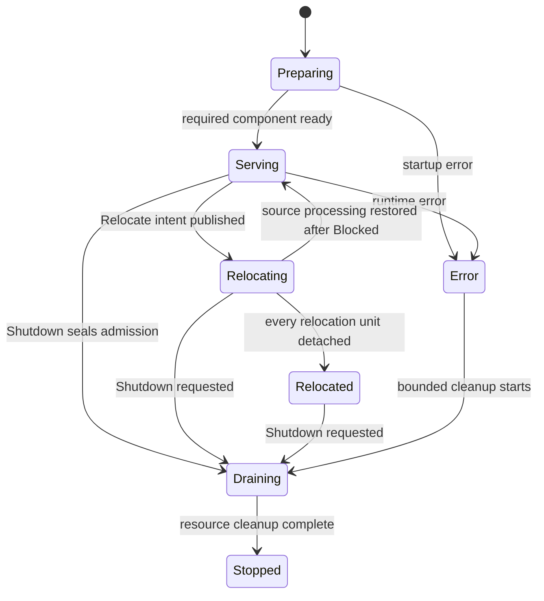
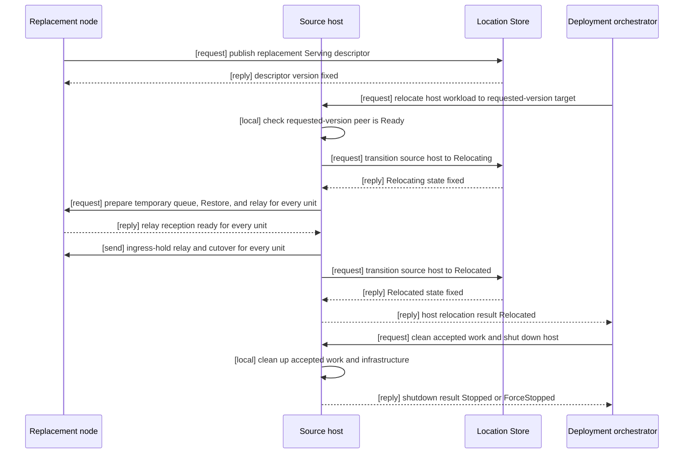
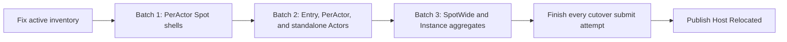

# Complete Host Relocation Flow

[Location·Relocation Topic Table Of Contents](README.en.md) · [Spec Table Of Contents](../README.en.md) · [Previous: 04. Complete Actor And Spot Relocation Flow](04-relocation-flow.en.md) · [Next: 06. Failure Handling And Failover Scope](06-failure-failover-policy.en.md)

> **What this document defines** — the complete sequence and results in which Host
> `Relocate` fixes the stateful workload as relocation units, selects a target, moves the
> units, returns `Relocated`, and removes source resources through Message Follow and
> `Shutdown`. The single source for one unit's owner transition and message processing
> order is [Complete Actor And Spot Relocation Flow](04-relocation-flow.en.md); this
> document adds only how the host operation enumerates those units, the modes, and the
> completion conditions.

## 1. Questions This Document Answers

This document defines which operations the application calls when moving a host's
stateful workload to another node or shutting the host down, the order in which the
Framework processes them, and what result each call ends with.

The unit that runs message handlers and Actors is called a
[Spot](../00-foundation/02-glossary.en.md#spot). In this document, stateful workload means the
Actors/Spots a host is processing and the not-yet-finished messages and timers.

To inspect or reboot a node while keeping the application version, call `Relocate` with
`PlannedMaintenance`. To switch to a prepared new application version, call it with
`RollingUpdate`. The way the target version is chosen is called a
[relocation mode](../00-foundation/02-glossary.en.md#relocation-mode).

On success, both modes only detach the stateful workload from the source host. The host
and infrastructure connections are kept. The application or deployment orchestrator
confirms this result and then separately calls
[Shutdown](../00-foundation/02-glossary.en.md#shutdown), which stops the runtime and
refuses new operations.

To shut down a host without guaranteeing stateful workload continuity, call `Shutdown`
alone, without `Relocate`.

### 1.1 Failure-Handling Scope

`Relocate` only supports a graceful handoff that runs until the source runtime, the
chosen target runtime, and the
[Location Store](../00-foundation/02-glossary.en.md#location-store) — the store where
multiple nodes together confirm each Spot's current owner and location — finish the
operation. A transient Store or
transport error within the same process can be retried within the deadline. But once the
source or target process terminates, a different runtime doesn't take over the
relocation, and there's no automatic recovery by picking a different target. Recovery
after the source or target process terminates is outside this contract.

The rule against creating two owners at once still applies here too. If a Location Store
change's result isn't received, success or failure isn't guessed — the same record is
re-read. Source admission isn't reopened, and target application message processing
isn't started, before confirming the actual owner.

A connection group in which several nodes exchange messages is called a
[RouteMesh](../00-foundation/02-glossary.en.md#routemesh). The name that identifies the group of
nodes connected under the same name is called a
[MeshName](../00-foundation/02-glossary.en.md#meshname). The name selecting a target among
nodes participating in the same Channel is
[ChannelName](../00-foundation/02-glossary.en.md#channelname). The application doesn't directly
assemble a shutdown sequence by picking only some components via MeshName, ChannelName,
or node RID.

A RouteMesh, a runtime node participating in that group
([MeshNode](../00-foundation/02-glossary.en.md#meshnode)), a ClientServer server, and a
[Classic fanout](../00-foundation/02-glossary.en.md#classic-fanout) publisher are all coordinated
together at the host level.

This document owns the host lifecycle the application observes, the method for fixing
Actor/Spot relocation units, the complete order for removing source resources after
cutover, and the handoff result. The node currently processing an Actor/Spot is called
the [owner](../00-foundation/02-glossary.en.md#owner). The record by which multiple nodes together
judge an Actor/Spot's owner and location is called
[authority](../00-foundation/02-glossary.en.md#authority). The order in which the Framework uses
authority and the two Stores is defined by
[Location Runtime](01-location-runtime.en.md). The provider contract for the
[Location Store](../00-foundation/02-glossary.en.md#location-store), which stores the current owner
and location, is defined by
[Location Store (Redis)](02-location-store-redis.en.md). The application state and
unexecuted queue/timer payload being moved doesn't pass through a store — it's sent
directly from source memory to the target, and that transfer contract is owned by
[Complete Actor And Spot Relocation Flow](04-relocation-flow.en.md). The provider
contract for the responsibilities remaining in the
[Relocation Store](../00-foundation/02-glossary.en.md#relocation-store) — the store that
keeps the record made when an Instance Spot is newly created by its first message, and
the terminal result of a pending request completing after relocation — is defined by
[Relocation Store (Redis)](03-relocation-store-redis.en.md). This document doesn't
repeat the transfer format — it only defines the public order of host operations.

## 2. Operations the Application Chooses

### 2.1 Choosing a Relocate Mode

The caller must specify a mode when calling `Relocate`. The only difference between the
two modes is the target application version. The subsequent queue seal, state restore,
authority transition, and session handoff rules are the same.

| Value | Mode | Value the caller specifies | Target the Framework selects |
|---:|---|---|---|
| 0 | `PlannedMaintenance` | Doesn't specify `TargetApplicationVersion`. | Selects only a node whose application version exactly matches the source. |
| 1 | `RollingUpdate` | Specifies a `TargetApplicationVersion` greater than the source. | Selects only a node whose application version exactly matches what the caller specified. |

`PlannedMaintenance`'s effective target version is the source's `ApplicationVersion`.
Specifying a target version alongside it is an argument error. `RollingUpdate` is an
argument error if there's no target version or it's at or below the source version. The
Framework rejects these invalid combinations before changing runtime state or admission.

The final time an operation must finish is called a
[deadline](../00-foundation/02-glossary.en.md#deadline). Both modes use 30 seconds if `Deadline` is
omitted. A specified value must be greater than 0.

### 2.2 Public Operation

The following .NET declaration is one expression of the common contract. The name
and signature in other languages are defined by that language's interface document.

```csharp
public enum ZLinkFrameworkRelocationMode
{
    PlannedMaintenance = 0,
    RollingUpdate = 1
}

public sealed record ZLinkFrameworkRelocationOptions
{
    // choose whether this is maintenance at the same version or a new version rollout.
    public required ZLinkFrameworkRelocationMode Mode { get; init; }

    // only for RollingUpdate — specify one version, greater than the source.
    public long? TargetApplicationVersion { get; init; }

    // uses 30 seconds if omitted.
    public TimeSpan? Deadline { get; init; }
}

public readonly record struct ZLinkFrameworkRelocationResult(
    ZLinkFrameworkRelocationMode Mode,
    long TargetApplicationVersion,
    ZLinkFrameworkRelocationOutcome Outcome,
    ZLinkFrameworkRelocationReason Reason);

public interface IZLinkFrameworkRuntime
{
    // provides the current host lifecycle state and last result.
    ZLinkFrameworkRuntimeStatus Status { get; }

    // observes host state and terminal result changes in order.
    IAsyncEnumerable<ZLinkObservedStatus<ZLinkFrameworkRuntimeStatus>> ObserveAsync(
        CancellationToken cancellationToken = default);

    // moves stateful workload; stays in the Relocated state on success.
    ValueTask<ZLinkFrameworkRelocationResult> RelocateAsync(
        ZLinkFrameworkRelocationOptions options,
        CancellationToken cancellationToken = default);

    // cleans up accepted work and host resources without a new relocation.
    ValueTask<ZLinkFrameworkTerminationResult> ShutdownAsync(
        TimeSpan? deadline = null,
        CancellationToken cancellationToken = default);
}
```

A typical rolling-update call sequence looks like this.

```csharp
var relocation = await runtime.RelocateAsync(
    new ZLinkFrameworkRelocationOptions
    {
        // only use nodes prepared as N+1 as target candidates.
        Mode = ZLinkFrameworkRelocationMode.RollingUpdate,
        TargetApplicationVersion = currentVersion + 1,
        Deadline = TimeSpan.FromSeconds(30)
    },
    cancellationToken);

if (relocation.Outcome == ZLinkFrameworkRelocationOutcome.Relocated)
{
    // once relocation success is confirmed, clean up host resources separately.
    // shutting down immediately also removes the Message Follow routes and
    // the cutover retransmission copies (§14).
    await runtime.ShutdownAsync(cancellationToken: cancellationToken);
}
```

Calling `Shutdown` right after `Relocated`, as in the example above, is allowed. A
deployment that wants to use both old-route message forwarding and cutover
retransmission to the end waits until
[`SafeToShutdown`](../00-foundation/02-glossary.en.md#safe-to-shutdown) — the observation value
indicating the source runtime can shut down safely — is published in the runtime status
before calling `Shutdown`; the publication condition is explained by
[§14](#14-the-race-between-shutdown-and-relocate).

A `Relocate` result always includes the mode and effective target version. Even when no
target is found, the same values are preserved so the caller can confirm what condition
it was waiting on. If `Relocate` ends `Blocked`, the caller can retry, or `Shutdown`
without continuity.

## 3. Host State and Completion Results

The host lifecycle is owned by a single `FrameworkRuntimeState`.

Information a host publishes to the Store — its endpoint, run generation, and
capabilities — is called a [descriptor](../00-foundation/02-glossary.en.md#descriptor). The state
where it's ready to accept new application work is called
[ready](../00-foundation/02-glossary.en.md#ready).

| Value | State | Meaning |
|---:|---|---|
| 0 | `Preparing` | Proceeds with registration, bind, descriptor verification, and recovery; doesn't accept application messages. |
| 1 | `Serving` | The host is ready and accepts new application work. |
| 2 | `Relocating` | Excluded from new placement and selection, but local units not yet sealed keep processing messages and timers. |
| 3 | `Relocated` | Every stateful object has been detached from source dispatch. Host and infrastructure connections are kept. |
| 4 | `Draining` | `Shutdown` has closed new admission and is cleaning up already-accepted work and resources. |
| 5 | `Stopped` | Application resource, infrastructure resource, and listener cleanup are finished. |
| 6 | `Error` | Can't serve due to a startup or runtime error. |

`IsReady` is true only in `Serving`. A component lifecycle snapshot provides information
about each component's state and doesn't substitute for host state. Per-component
`Drain`, `AwaitDrained`, `Stop`, or a public operation targeting only some Meshes isn't
provided.



For each unit, only an explicit failure before its relay-ready reply reaches the accepted
state may clean tentative work and restore source processing. Even when another unit has
crossed that boundary, the host may restore source workload that hasn't crossed it and
return to `Serving`. A unit across the boundary never returns to source regardless of its
cutover-submit result; it continues through target cutover receipt (including a
retransmission after connection re-establishment) or the cutover-wait fallback.
Returning to `Serving` doesn't mean every unit rolled back to the source.

Relocation outcome is fixed to the following values. Among the reasons in the table,
[`DeadlineExceeded`](../00-foundation/02-glossary.en.md#deadlineexceeded) means the call ended
because it did not finish within its allotted time; it does not mean the remaining work was
cancelled.

| Value | Outcome | Allowed reason | Meaning |
|---:|---|---|---|
| 0 | `Relocated` | `None` | Every stateful object has been detached from source dispatch. |
| 1 | `Blocked` | `TargetUnavailable`, `StoreUnavailable`, `RelocationDisabled`, `StateIncompatible`, `DeadlineExceeded`, `RelocationFailed`, `RuntimeNotReady`, `ManualTopologyUnsupported`, `ShutdownRequested`, `OperationInProgress` | Relocation couldn't start, or the whole workload move didn't finish. |

The wire values are `Relocated=0`, `Blocked=1`. Reason is `None=0`,
`TargetUnavailable=1`, `StoreUnavailable=2`, `RelocationDisabled=3`,
`StateIncompatible=4`, `DeadlineExceeded=5`, `RelocationFailed=6`, `RuntimeNotReady=7`,
`ManualTopologyUnsupported=8`, `ShutdownRequested=9`, `OperationInProgress=10`. An
undefined outcome/reason combination is a protocol error.

Shutdown outcome is `Stopped=0`, `ForceStopped=1`, and reason is `None=0`,
`DeadlineExceeded=1`, `TeardownFailed=2`. `ForceStopped` isn't a separate host state —
it's the result of finishing cleanup via bounded teardown, with host state `Stopped`.
Relocation failure is owned by the relocation result and isn't mixed into the
termination reason.

## 4. Conditions Checked Before Selecting a Target

`Relocate` started from `Serving` checks the whole host at once before changing host
state and application admission. At this point it doesn't block new work for the moving
targets or pre-secure target capacity.

The way of saving application state as bytes and restoring it on the target is the
[Preserve-state relocation policy](../00-foundation/02-glossary.en.md#preserve-state-relocation-policy).
The period during which a host keeps current owner eligibility is called an
[owner lease](../00-foundation/02-glossary.en.md#owner-lease).

| Check item | Passing condition |
|---|---|
| Concurrently in-progress work | If there's new object creation, join, Instance placement, session binding, or inbound relocation, the work to finish first is confirmed. |
| Local workload | Checks every MeshNode's Actors, Spots, timers, sessions, and in-progress infrastructure operations. |
| Store | The Location Store's current location record and the target descriptor's owner lease must be usable. Because the payload being moved is sent directly from source memory, Relocation Store readiness isn't a handoff condition — it's checked only in deployments that need the remaining responsibilities: the record made when an Instance Spot is newly created by its first message, and the terminal record of a pending request completing after relocation. |
| Unit compatibility | The relocation policy and state adapter used by an explicitly application-created User Spot, an Instance Spot created on demand by its first message, and the Actors within them, are all compatible with the target [factory](../00-foundation/02-glossary.en.md#factory) and capacity. |
| Topology | Every service topology the host uses finds remote endpoints via Store descriptors. This method is called [automatic discovery](../00-foundation/02-glossary.en.md#automatic-discovery). |

If even one manual RouteMesh peer, ClientServer client endpoint, fanout subscriber
endpoint, or manual fanout publisher not publishing a descriptor is registered, it's
`Blocked/ManualTopologyUnsupported`. Registration is checked, not current connection
status. A setting where an automatic component explicitly binds a listener address isn't
manual topology.

The scope the runtime checks is local registration. It doesn't check connections another
process made outside the Framework, so the condition that the whole set of participating
processes uses only automatic discovery is guaranteed by the deployment.

## 5. Selecting a Target Matching the Mode

The Framework narrows down targets in this order.

| Order | Condition |
|---:|---|
| 1 | `PlannedMaintenance` keeps only the same application version as the source. `RollingUpdate` keeps only the version the caller specified, excluding both lower and higher versions. |
| 2 | Keeps only an Object Server that isn't the source and is in `Serving` state. |
| 3 | Keeps only nodes compatible in [factory](../00-foundation/02-glossary.en.md#factory) — the function the application registered to create objects — [stable type](../00-foundation/02-glossary.en.md#stable-type) — the language-independent object type name — relocation policy, and state adapter. |
| 4 | Keeps only nodes with sufficient remaining capacity, and, if the source has a [maintenance wave](../00-foundation/02-glossary.en.md#maintenance-wave) set, only nodes with a different value. Maintenance wave is an application setting distinguishing hosts in the same maintenance operation. |
| 5 | Keeps only nodes whose RID and [lifecycle generation](../00-foundation/02-glossary.en.md#lifecycle-generation) both match in the same-point-in-time descriptor list and the Core peer table. Lifecycle generation distinguishes different process runs using the same RID. That peer must be `Admitted` and `Ready`. |

Version is checked before capacity and placement weight. So a different-version node's
remaining space or higher weight doesn't affect the selection result. The relative share
by which new work is assigned among several candidates is called
[weight](../00-foundation/02-glossary.en.md#weight). This value only applies when there are multiple
targets satisfying the conditions.

A published descriptor or a created connect intent alone doesn't establish that a target
is ready. The result of copying state at a specific point in time into a
read-only value is called a [snapshot](../00-foundation/02-glossary.en.md#snapshot). If the descriptor
snapshot is empty, contains only the source itself, or every remote peer is draining,
there's no target.

### 5.1 When There's No Target Yet

Before searching for a target, the Framework first checks whether there's a unit to move. If
the source owns no Actor, User Spot, or Instance Spot, there's nothing to move, so a target
isn't searched for and it ends with `Relocated/None`. Relocation's purpose is workload
migration — a host with no workload to move isn't blocked just because it has no target.
Even in this case, the host state transition and admission closing are the same as any
other relocation.

If there's a unit to move but no target of the requested version exists, source state
and admission are kept while waiting up to the deadline for the descriptor and Core peer
table to converge. A process with multiple Meshes must satisfy the condition on every
Mesh. If no target is secured by the deadline, tentative coordination is cleaned up and
`Blocked/TargetUnavailable` is returned.



`Relocated` is the source-side result that every unit's cutover submit attempt reached a
success or failure terminal; it doesn't mean the source awaited a target-CAS completion
reply. `Relocated` keeps descriptor, connection, listener, and infrastructure resources.
This diagram shows the normal flow when a target is ready. Without a target, the
deadline rule from the previous section returns `Blocked/TargetUnavailable`.

Automatic ClientServer clients and fanout subscribers build new connections using the
replacement descriptor and reflect the source's state in selection. An existing
connection with accepted work and a remaining barrier isn't closed immediately just
because the descriptor changed.

## 6. Concurrent Calls and Cancellation

| Situation | Result |
|---|---|
| Concurrent `Relocate` with the same mode and effective target version | Shares the deadline of the first operation. A later call doesn't change the deadline. |
| Concurrent `Relocate` with a different mode or effective target version | `Blocked/OperationInProgress` without waiting. |
| `Relocate` again after `Blocked` | `Blocked` isn't stored, so host conditions are re-checked from the start. |
| `Relocate` again in `Relocated` | Returns the first `Relocated/None`'s mode and effective target version. |
| Concurrent `Shutdown` | Shares the same operation and stores the terminal result. |
| `Shutdown` again in `Stopped` | Returns the stored result. If none, `Stopped/None` with no new work. |
| `Relocate` in `Preparing`, `Error`, or `Stopped` | `Blocked/RuntimeNotReady` without changing admission. |

Caller cancellation ends only that waiter — it doesn't cancel the shared operation.
`Shutdown` interrupts startup in `Preparing` and starts bounded cleanup in `Error`.

## 7. Relocation Units and Batch Order

The bundle of Actors or a Spot the Framework can move independently is called a
[relocation unit](../00-foundation/02-glossary.en.md#relocation-unit). The relationship of which Entry
Spot or User Spot an Actor currently belongs to is
[Actor membership](../00-foundation/02-glossary.en.md#actor-membership).

| Relocation unit | Boundary |
|---|---|
| `SpotWide` User Spot aggregate | The User Spot and every member Actor at the moment new work is blocked |
| Actor | One Actor belonging to an Entry Spot or `PerActor` User Spot |
| `PerActor` Spot authority transition | The target's stateless Spot shell and Spot-level queue authority |
| Instance Spot | One Spot with no Actor membership |

The Entry Spot itself doesn't move. A source Entry Spot's Actor moves as an Actor unit to
the target node's Entry Spot. A `PerActor` User Spot also moves its Actors as the same
unit without moving Spot application state.

The source runtime reads active state once, immediately before the host enters
`Relocating`, and fixes the inventory. An Actor in a User Spot membership appears exactly
once, either as a `PerActor` Actor unit or inside a `SpotWide` aggregate, according to
the Spot's execution mode. An Entry Spot Actor and a standalone Actor not included in a
User Spot membership each become an Actor unit. The same Actor never appears in both a
Spot unit and a standalone unit. No new stateful placement is admitted after the
inventory is fixed.

Host relocation runs the following batch order. A batch means units with the same
dependency; it isn't a fixed-size chunk based on a numeric unit count.

| Batch | Units | Start condition |
|---:|---|---|
| 1 | Stateless Spot shell and Spot-level queue authority for each `PerActor` User Spot | Inventory and target preflight are complete and the current Spot turn has ended. |
| 2 | Entry Spot Actors, `PerActor` member Actors, and standalone Actors | Each Actor's current turn has ended; a `PerActor` member also waits for its Spot shell transition. |
| 3 | `SpotWide` User Spot aggregates and Instance Spots | The entire aggregate's current turn and application safe point have ended. |

The next batch starts after the previous batch reaches a terminal state. Units without a
dependency in the same batch may run concurrently. A `PerActor` member Actor never starts
before its Spot shell, and a `SpotWide` member Actor isn't split into a separate Actor
unit. When a unit fails, no later batch starts. Units that have already started continue
to a safe terminal state.



For relocation correctness, the Framework sets no separate cap on concurrent unit count,
participant count, or relay record count. How much moves concurrently per unit is paced
by the in-flight payload budget, which limits the bytes occupied by in-progress relocation
payloads on a peer connection at the same time; the budget's calculation and waiting rules
are owned by
[Complete Actor And Spot Relocation Flow
§5.3](04-relocation-flow.en.md#53-no-relocation-specific-capacity-limit). When the
budget is full, the next unit waits before its source admission seal is applied, and a
waiting Actor/Spot keeps processing messages normally in the meantime — the coordinator
doesn't set a separate cap on concurrent unit count. Existing runtime and Store provider
memory, frame, and page-size limits still apply, and if a resource isn't immediately
available, it waits before blocking source application dispatch. Reaching a limit
doesn't fail a relocation that has already started.

If the target is already saturated, chunk intake slows down, so the source's budget
releases come later and the next unit's start is also delayed — a move meant to shed
load is slowed by that load. This is the intended result of the backpressure contract
that never bypasses saturation; no bypass path is created for relocation. If the move
doesn't finish within the host operation deadline, the existing §8 rule against starting
any new unit relocation applies, so the operator first decides between extending the
deadline and relieving target load. Deadline sizing uses the transfer throughput
observed in that deployment as input, not a formula.

This batch order isn't an Application Job Queue capacity chunk. Each target's
pre-dispatch temporary queue and saved work form an ordered durable backlog owned by a
retained-byte owner; ordinary staging ingress uses a shared reservation for receive and
returns it at durable handoff. After target-only CAS and required lifecycle work make
dispatch runnable, backlog handler turns acquire live queued-job permits one at a time in
order. So a compatible target whose job limit is smaller than an aggregate backlog
executes it progressively instead of failing the aggregate as a capacity blocker or
leaving members at the source.

`SpotWide` moves the Spot and every member Actor at the end of the current turn as one
unit. `PerActor` and Entry Spot move each Actor once that Actor's current turn ends. A
`PerActor` Spot lane is only briefly blocked during authority transition and doesn't
wait for every member Actor to become ready at the same time.

A `SpotWide` User Spot using `ApplicationSignaled` readiness uses the turn boundary the
application registers via `RelocationReady().Defer()` after target preparation. If no
relocation is prepared, a `Continued` completion callback runs on the source in the next
application turn. Cancellation before relay-ready is accepted restores the source queue
and then calls `Continued`. After that boundary, cancellation or cutover-submit failure
doesn't restore source. After owner commit, `Relocated` runs as the first application
turn on the target queue.

## 8. Interruption Budget Target

| Target | Measurement unit |
|---|---|
| Entry Spot Actor | One Actor |
| `PerActor` User Spot | One [Spot direct](../00-foundation/02-glossary.en.md#spot-direct) admission — targeting by Global Spot ID — and each Actor |
| `SpotWide` User Spot | One aggregate including the Spot and member Actors |
| Instance Spot | One Spot |

Measurement starts when the source admission seal is applied. Wait time for target
selection, target preparation including temporary-queue registration, and waiting for
the current turn or an application safe point are excluded. This preparation must finish
before source admission is blocked. Capture, encoding, chunk transfer to the target,
checksum verification, authority change, target Restore, and queue/timer restore run
after the seal and are all included in measurement. Measurement ends when the source's
ordered-relay-then-one-way-cutover submit reaches a terminal result, whether success or
failure. What this metric measures is the time the source is stopped — not the full
interruption the application observes until the target resumes processing.

Each relocation unit records the following points in time. Each point is recorded, on
its own clock, by the node where the event happens.

| Point | Meaning | Recorded by |
|---|---|---|
| S0 | Source admission seal applied | Source |
| S1 | Terminal result of the one-way cutover submit | Source |
| S2 | Target's Location Store CAS confirmed | Target |
| S3 | Target application dispatch opened | Target |
| S4 | The moment the [Message Follow](../00-foundation/02-glossary.en.md#message-follow) route — which keeps relaying messages that arrive at the old address to the target — may be removed. Based on `MessageFollowDuration` expiry; the source owns the Message Follow route, so this is a source-side point. | Source |

| Metric | Interval | Meaning |
|---|---|---|
| Source stop time | S0→S1 | Same as the measurement interval defined above. |
| Target resume time | S2→S3 | Target-local interval from owner confirmation to opening application dispatch. |
| Route convergence time | S1→S4 | Source-local interval that grounds how long the source must keep the Message Follow route. |

No metric subtracts timestamps of different nodes directly. A whole interval crossing
nodes, like S0→S3, is observed only through same-flow correlation in
[message flow tracing](../06-observability/03-message-flow-tracing.en.md). S3 is the
dispatch-open moment, so because of backlog and permit ordering, the moment the
application observes its first handler result can be later. The formal definition of
metric names and instruments is owned by
[Runtime monitoring](../06-observability/01-runtime-monitoring.en.md) and
[Runtime metrics](../06-observability/02-runtime-metrics.en.md); this section fixes only
the point definitions and who measures them.

Each unit has a default target of under 1 second. **This value is neither a timeout nor a
correctness condition** — it shares the same number as
[Complete Actor And Spot Relocation Flow's `RelocationCutoverWaitTimeout` (default
1,000 ms)](04-relocation-flow.en.md#44-ordered-relay-and-one-way-cutover) but is a
different value: this 1 second is an observation-only target used solely as a warning
threshold, while `RelocationCutoverWaitTimeout` is the protocol fallback deadline after
which, once the cutover wait ends, the target moves on to CAS and queue opening.
Exceeding it doesn't cancel the relocation or roll back to the source. The Framework
keeps the same operation going until the one-way cutover submit reaches a terminal result, and records
a warning and the `zlink.relocation.interruption` histogram. Source application close
runs after the cutover submit's success or failure terminal. The target sends no
processing-start ACK; target admission opening is observed through target-local status
and traces.

Once the host operation deadline ends, no new unit relocation is started. A unit already
started performs a safe abort only when target explicitly fails before sending its
relay-ready reply. If the reply result is indeterminate, target may have started the
cutover-wait fallback, so source dispatch doesn't reopen. A unit that attempted cutover
also doesn't roll back to source, and its target continues the owner transition until
the Restore validity deadline. If source doesn't attempt every unit's cutover, the host
doesn't become `Relocated`; success or failure of an attempted submit isn't a completion
condition.

## 9. The Order for Relocating One Unit — Owned by 04

The single source for one Actor or Spot unit's owner transition, ordered relay,
temporary-queue installation, checksum verification, cutover, Location Store CAS, queue
merge, and Session route transition is
[Complete Actor And Spot Relocation Flow "4. Normal Processing
Order"](04-relocation-flow.en.md#4-normal-processing-order). Once host relocation
starts, the Framework moves the source host's workload to the target node without the
application calling a separate move API per Actor or Spot. Actor and Spot IDs are kept,
and once moved, a target continues message processing in existing queue order.

This section adds only **how many units the host divides that common order into and in
what order it opens them** — the batch rules dividing units are defined in §7. This
section covers only the **differences**, per unit kind, in what the target prepares and
what values it changes together, and which callbacks it calls or doesn't call, in §10.

| Participant | What it does (same as 04) |
|---|---|
| Application | Calls the host's `Relocate`. Only a `SpotWide` User Spot that chose `ApplicationSignaled` signals a safe move moment via `RelocationReady().Defer()`. |
| Source runtime | Finishes currently running work and stops application dispatch. Fixes application state and the not-yet-executed queue/timers as a payload in source memory and sends it directly to the target, and relays to the target only messages that arrive at the old address after capture. It doesn't change the Location Store. |
| Target runtime | Assembles the received chunks and verifies the checksum, then creates an Actor or Spot using the same ID and restores state and existing work. After receiving the relay cutover boundary, or reaching the cutover-wait fallback after relay-ready, it CASes the Location Store from source to target and opens the queue only if that succeeds. |
| Location Store | Records which node currently processes an Actor or Spot. When multiple values must change together, changes all or none. |
| Relocation Store | Holds no handoff payload. Its only remaining responsibilities are recording when an Instance Spot is newly created by its first message and recording the terminal result of a pending request completing after relocation. |

`RelocationCutoverWaitTimeout` (the wait time from the relay-ready reply until cutover
arrives, **default 1,000 ms**) is owned by
[Framework API](../00-foundation/06-framework-api.en.md).

What the target factory does, per policy, is as follows.

| Policy | Handling |
|---|---|
| `DisableRelocation` | If that object remains, `Blocked/RelocationDisabled`. |
| `RecreateOnRelocation` | Runs the target factory with the same object ID. Application state isn't moved, but not-yet-finished Framework work is moved. |
| `PreserveStateWith` | Stores the bytes the adapter returned and `Restore`s them into the target factory instance. The application manages the bytes' format, version, and migration. |

The Framework doesn't add a separate state contract ID or generic state type.

One relocation unit's temporary queue has no bound on record count or stored size, and
the Framework doesn't create an additional temporary queue for the same object.

## 10. Differences by Unit Kind

### 10.1 An Actor Belonging to an Entry Spot

An Entry Spot instance belongs to the Object Server lifecycle, so it isn't moved to
another node. Only Actors belonging to a source Entry Spot are moved, each as an
independent relocation unit. The target runtime restores the Actor into the Entry Spot
the target node already created at startup. Since this move isn't a join the
application requested, it doesn't call the target Entry Spot's `OnJoinedActor` or the
source Entry Spot's `OnLeaveActor`/`OnActorJoin`.

### 10.2 PerActor User Spot

A `PerActor` User Spot changes the node handling Spot messages and the node handling each
Actor separately. So even while some Actors are still on the source, already-moved Actors and
new Spot messages can be handled on the target.

1. The target runtime creates an empty Spot instance using the same SpotId and
   ObjectGeneration as the source. Before the Location Store's current location
   changes, this instance isn't returned as an external lookup result.
2. The source runtime finishes the current Spot handler and in-progress Actor
   Create/Join. Spot messages arriving afterward are briefly held on the source.
3. The target runtime registers a Spot relocation temporary queue. The source runtime
   keeps relaying held Spot messages and later messages arriving on the previous route
   to this queue.
4. Once the target's Spot is ready, the Location Store changes the node handling Spot
   messages from source to target. Held Spot messages move to the real Spot queue, the
   temporary queue registration is removed, and new `ToSpot`, Actor Create, and Join are
   handled via the existing dispatch path.
5. Each source member Actor finishes its current turn and then moves to the target as
   an Actor unit. `ToActor` for a not-yet-moved Actor goes to the source; for a moved
   Actor it goes to the target.
6. Once the last Actor and all messages held on the source are delivered to the target,
   `OnClosing(RelocationOut)` is called on the source Spot.

The Framework doesn't create a temporary SpotId during the move. Once the Location
Store records the target as the current node handling Spot messages, the source Spot no
longer handles new `ToSpot`, Create, or Join. The source Spot only continues handling
not-yet-moved Actors and delivering messages during the move.

The empty Spot created on the target doesn't restore the source Spot's application
fields, so it doesn't call the Spot relocation adapter. Each member Actor uses its own
relocation policy and Actor adapter. Applying the Session command 44 route update
doesn't block processing of each Actor or the next Actor relocation.

### 10.3 SpotWide User Spot

A `SpotWide` User Spot moves the Spot and every member Actor, as of the moment new work
is blocked, as a single move operation. If even one Actor fails to satisfy the
relocation policy, state adapter, or target capacity condition, the Location Store isn't
changed and the whole move is aborted. The ID distinguishing this move is a non-zero
128-bit value.

The target registers the Spot and every member Actor in the same relocation temporary
queue group. Each record preserves the actual target Spot or Actor identity. Only after
every participant's Restore and the aggregate owner change does it split saved work,
pre-boundary relay, and remaining temporary work into the real Spot and Actor queues,
then switch to the regular route. It next finishes `OnRelocationReadyCompleted` and
opens dispatch. If one participant fails, no work in the temporary queue is run and the
whole group is discarded.

There's no 1,024 cap on the total number of Actors belonging to a User Spot. The
Framework splits the relocation target list across multiple Location Store pages. One
page records at most 1,024 entries, and one encoded page's size is at most 1 MiB. For
example, with 2,500 Actors, at least three pages are used. The Framework confirms the
total Actor count and each page's content matches the originally stored list. Only when
everything matches does it change the node processing the User Spot and all Actors from
source to target, all at once. If a conflict occurs mid-way, it doesn't change the
locations of only some Actors. This method — changing everything or nothing, only if the
first-read
Store version is unchanged — is called
[CAS](../00-foundation/02-glossary.en.md#compare-and-set).

Member Actors' `OnActorJoin`, `OnJoinedActor`, and `OnLeaveActor` aren't called. Bound
Session location updates proceed per Actor after the Spot and Actors start message
processing, and one Session owner's response doesn't block processing of a different
Actor or Spot.

### 10.4 Instance Spot

An Instance Spot can't contain Actors, so one Spot is the relocation unit. Once the
source's current handler finishes, direct messages and timers are held. The target
runtime creates the Instance Spot with the same SpotId, and if it's `PreserveStateWith`,
restores the directly transferred application state via `Restore`. Once the Location
Store records the target as the current processing node, the target processes the
restored queue and timers. Since an Instance Spot has no Actor, Actor location or
Session binding isn't updated.

Host relocation only moves an Instance Spot that already exists on the source. It doesn't
start [cold activation](../00-foundation/02-glossary.en.md#cold-activation), which creates an
Instance Spot not on the source from its first message.

### 10.5 Callbacks Not Called During the Move

Entry Spot and `PerActor` User Spot Actor relocation isn't a join or leave requested by
the application. So `OnActorJoin`, `OnJoinedActor`, and `OnLeaveActor` aren't
called. The Framework moves Actor state, not-yet-executed queue, and timers, and
changes only the current processing node.

A `SpotWide` User Spot also only changes the processing node without changing which
Spot each Actor belongs to, so member Actors' join/joined/leave callbacks aren't
called. If `ApplicationSignaled` was used, only `OnRelocationReadyCompleted(Relocated)`
is called on the target after the regular-route switch and immediately before dispatch
opens.

`OnClosing(RelocationOut)` is called on a User Spot's or Instance Spot's source instance
after the Location Store's location change. Since an Entry Spot instance doesn't move,
the Entry Spot's closing callback isn't called. An Instance Spot has no Actor, so there's
no Actor lifecycle callback at all.

A cross-node Actor join uses the same policy and adapter, but the specific lifecycle is
owned by [Spot and Actor membership](../03-spot-actor/05-spot-actor-membership.en.md). A same-node join doesn't
call the adapter. Instance Spot maintenance relocation doesn't newly create an Instance
Spot not present on the source.

## 11. Which Location Is Kept on a Mid-Way Failure

If the target explicitly fails before the relay-ready reply is accepted, the source
keeps processing messages. The Framework doesn't expose the target instance, discards
the temporary queue, and restores source messages and timers to the original queue. The
target doesn't create a request terminal result or run a one-way message from the
temporary queue.

After the relay-ready reply is accepted, source dispatch doesn't reopen while the
Location Store still points to source, even if cutover hasn't been sent yet or its
submit fails. The target continues CAS after receiving cutover (including a
retransmission after connection re-establishment) or through the cutover-wait fallback.
If target CAS ultimately fails, the target removes its object and queue, the Session
cleans up under its own seal timeout, and the source's Message Follow also ends after
its defined duration.

Once the Location Store records the target as the current processing node, it isn't
rolled back to the source. If the target runtime is still running, a failed stage can be
retried. Location Store update retries until Restore validity expires; if target
ownership isn't confirmed by then, the prepared Actor or Spot and queue are removed and
the Session route isn't updated. If the source or target process terminates, a different
runtime doesn't take over this relocation. If the target terminates after commit, it
isn't rolled back to the source — that object is left unavailable. Automatic recovery
afterward isn't part of the contract. The source sends one-way cutover, waits for no
completion reply, and changes to Message Follow. After CAS and queue opening, the target
sends the Session route update one-way. This choice doesn't guarantee exactly-once
behavior or global ordering across a process-crash window. The specific failure result the
application observes is defined by [§13 Relocate Completion and
Failure](#13-relocate-completion-and-failure).

## 12. Moving Pending Messages, Timers, and Sessions

The number distinguishing whether an object under the same ID was deleted and
re-created is called [ObjectGeneration](../00-foundation/02-glossary.en.md#objectgeneration). The
value distinguishing one operation, to avoid processing a message or request twice, is
[operation identity](../00-foundation/02-glossary.en.md#operation-identity). The window during which
the source temporarily holds new messages during a move is called
[relocation ingress hold](../00-foundation/02-glossary.en.md#relocation-ingress-hold).

| Resource | Move rule |
|---|---|
| A message arriving after new work is blocked | The source holds arriving messages with no bound on record count or stored size. If the owner change succeeds, the message is delivered to the target with its operation identity and ObjectGeneration preserved. On an explicit cancellation before the relay-ready reply is accepted, it's restored to the source queue in arrival order; afterward it isn't restored to source. |
| `SpotWide`/Instance Spot timer | The runtime handle and continuation aren't moved. Logical registration, next fire time, and pending tick are moved, and the target automatically restores them in queue order. The application doesn't duplicate-capture a timer or re-register it in restore. |
| Entry/`PerActor` Actor timer | Moves with the Actor queue to the Actor owner. Spot-level application timers aren't moved — a schedule that must be kept is managed in the application's external state. |
| A session connected to an Actor | The physical STREAM connection is kept. The specific seal/route-transition order and timeouts are summarized by [04 §7](04-relocation-flow.en.md#7-session-during-actor-relocation) and owned by [Session and Actor Binding "8"](../04-session/02-session-actor-binding.en.md#8-the-sessions-responsibility-during-actor-relocation). |

Operation identity and authority generation are also kept when delivering a
late-arriving message to the target via the previous owner. Independently of Session
command 44 application, a Message Follow route only delivers packets arriving on the
previous route to the target Actor within `MessageFollowDuration`. Packets and replies
of a previous generation are rejected. A newly created Actor under the same ActorId
must be rebound by the application.

An Instance Spot's `Close` and relocation are ordered within the same authority commit.
If `Closing` comes first, close finishes and it isn't moved. If relocation comes first,
a late `Close` is a moving result and isn't automatically resubmitted.

## 13. Relocate Completion and Failure

Once every unit is detached from source dispatch and the one-way cutover submit attempt
for each target that sent a relay-ready reply reaches a success or failure terminal, the
host transitions to `Relocated` and returns `Relocated/None`. This result is not
confirmation that target Location Store CAS completed. Descriptor lease, listener, peer
connection, and raw transport resources aren't cleaned up at this point.

| Completion point | Observer | Meaning |
|---|---|---|
| Restore and relay-ready reply | Source unit | The target temporary queue and Restore are ready, and the source is still the owner. |
| One-way cutover submit terminal | Source unit | Source attempted cutover once after pre-boundary relay and obtained a success or failure terminal. Neither result confirms target CAS. |
| `Relocated/None` reply | Source host and caller | Every source unit dispatch has ended and every cutover submit attempt reached a terminal result. Submit success isn't a completion condition. |
| Successful Location Store CAS | Target unit | The target is the owner and may open the transferred existing queue and the relay queue in order. |
| Applied Session route update | Session owner | Owned by [04 §7](04-relocation-flow.en.md#7-session-during-actor-relocation) and [Session and Actor Binding "8"](../04-session/02-session-actor-binding.en.md#8-the-sessions-responsibility-during-actor-relocation). |

The target sends neither a cutover reply nor a Session route-update reply. The source
host doesn't create an acknowledgement journal or numeric high-water to wait for target
CAS or Session route application.

Because cutover can be lost to a connection failure, the source keeps a copy of each
unit's pre-boundary relay batch and cutover for the same duration as the cutover wait
time (`RelocationCutoverWaitTimeout`) after the first cutover submit terminal. That
duration is the unit's cutover retransmission window. If the connection to the target is
re-established within the window, the source resends the batch and cutover over the new
connection, and the target discards its partially received pre-boundary relay span and
atomically replaces it with the whole retransmitted batch — a full replacement, not
per-message deduplication or partial merging, so the span's order is fixed by batch
order. Retransmission resends one batch; it's not a per-message ACK or journal. The copy
is source-memory retention that occupies no pipe, and when the window ends the source
cleans it up exactly once and never retransmits afterward. The retransmission window
changes none of the completion points in the table above — the host still transitions to
`Relocated` at the first cutover submit terminal, and retransmission is a recovery
action after it. Once the source process has been cleaned up or terminated,
retransmission is impossible and the target proceeds through the cutover-wait fallback.
The per-unit retransmission and replacement rules are owned by
[Complete Actor And Spot Relocation Flow](04-relocation-flow.en.md).

The result when an operation doesn't satisfy its completion condition by the deadline is
called [`DeadlineExceeded`](../00-foundation/02-glossary.en.md#deadlineexceeded).

| Timing and cause | Result |
|---|---|
| No target candidate satisfying the requested application version and registered factory/type eligibility is ready by the deadline. | `Blocked/TargetUnavailable` |
| Store read, write, or owner lease check fails before relay-ready reply acceptance. | Cleans up temporary records without changing owner and returns `Blocked/StoreUnavailable` |
| A `DisableRelocation` policy remains. | `Blocked/RelocationDisabled` |
| After target selection, the transferred state schema/type adapter is incompatible, or `Capture` and `Restore` both fail across every allowed retry. | `Blocked/StateIncompatible` |
| Before relay-ready reply acceptance, the Framework cancels a callback due to the deadline or work exceeds the deadline. | `Blocked/DeadlineExceeded` |
| Target explicitly rejects Restore before relay-ready reply, so the source queue can be restored. | Restores source workload that hasn't attempted cutover and returns `Blocked/RelocationFailed` |

An explicit failure before relay-ready is accepted cleans temporary records and lets
that source authority and queue accept new work again. A unit that crossed this boundary
doesn't roll back to source regardless of cutover-submit success or failure. Only source
workload that hasn't crossed the boundary may be reprocessed before the host transitions
to `Serving`.

A target CAS, queue opening, or Session route-update failure after relay-ready is
accepted is not a Host result delivered synchronously to source. The target retries CAS
until the Restore validity deadline. If it cannot confirm target ownership, it removes
the prepared unit and records an Error log. It doesn't change an already returned
`Relocated` result or reopen source dispatch.

If the directly transferred payload's checksum differs from the assembly result, the
target doesn't restore from a partial assembly and answers with an explicit failure
before the relay-ready reply, and the source restores its queue from the payload kept in
memory — the same path as `Blocked/RelocationFailed` in the table above. If the
`SpotWide` relocation target list's content checksum differs from the originally stored
list, it's an unrecoverable `DataLost` even on retry. It doesn't guess a previous list or
roll back to the source.

If some MeshNodes' `Relocating` descriptor write result can't be confirmed, every
attempted descriptor is rolled back to `Serving`. Only once every rollback is confirmed
is it `Blocked/StoreUnavailable`. If even one can't be confirmed, no new work is
accepted, cleanup proceeds for a fixed maximum time, and it ends as
`ForceStopped/TeardownFailed`.

## 14. The Race Between Shutdown and Relocate

`Shutdown` isn't blocked by an absent target, policy, capacity, or Relocation Store. The
action that changes state to stop accepting new application work is called
[admission seal](../00-foundation/02-glossary.en.md#admission-seal). Shutdown first applies an
admission seal to the whole host. It doesn't guarantee stateful workload continuity and
completes within a fixed time, in this order.

1. Changes the host to `Draining` and closes new application admission and the start of
   new relocation units. The mesh node follows the same seal: it neither starts nor accepts
   a new peer admission (sends no Hello, answers no inbound Hello with Admit) and sends
   already-admitted peers only the `Draining` Update. A
   peer's transport loss, liveness expiry, or send failure after the seal does not move the
   node state back before `Draining`.
2. Publishes a `Draining` descriptor, excluding it from new selection and placement.
3. Processes already-accepted handlers, request completions, relocation units, and
   session barriers up to the deadline.
4. Doesn't start new object relocation. While Actor membership and local instances
   remain valid, delivers a `HostShutdown` closing context to every Entry, User, and
   Instance Spot. Per-Actor closing callbacks aren't called.
5. After Spot callbacks, cleans up local Actor and Spot scope, owner record,
   descriptor, listener, and transport, in order.
6. If finished within the deadline, ends with `Stopped/None`; if not, ends with
   `ForceStopped/DeadlineExceeded` or `ForceStopped/TeardownFailed` after bounded
   teardown.

When a listener and transport are cleaned up, already-accepted transport callbacks and
in-flight read/write operations are completed or cancelled first. In particular,
TLS/WebSocket resources and a per-connection write queue aren't destroyed until
cancellation completion has been observed on the owning transport execution context. A
late callback accessing a destroyed resource or turning an accepted operation terminal
twice isn't a valid bounded teardown.

| Operation confirmed first | Handling |
|---|---|
| `Shutdown`'s admission seal | Returns capacity secured on the target, and ends a pending Relocate call with `Blocked/ShutdownRequested`. |
| `Relocating` publication | Only confirms the current unit to a terminal state and doesn't start the rest. Preserves published authority; the waiter gets `Blocked/ShutdownRequested`. |

`Shutdown` in `Relocated` only cleans up accepted work and infrastructure. Calling it
directly from `Serving` doesn't move objects.

While `Relocated`, the source retains Message Follow routes and the descriptors, peer
connections, and listeners required to forward sends and requests that still arrive at
the old address, and also keeps each unit's cutover retransmission copy until its
retransmission window (§13) ends. A deployment that needs the full configured
`MessageFollowDuration` calls `Shutdown` after that period. Calling `Shutdown` earlier
removes the remaining Message Follow routes and retransmission copies with the source
transport.

For a relocation operation it started, the source runtime publishes `SafeToShutdown` —
the observation value saying it's safe to shut down — into its own runtime status after
every unit has reached the moment its Message Follow route may be removed (S4, §8) and
every unit's retransmission window (§13) has ended. Both conditions are events happening
on the source, so no other node's clock is needed for this judgment. The value is not a
completion ACK sent by the target or anyone else — the source publishes it and other
parties observe it; the specific status surface is owned by
[Runtime monitoring](../06-observability/01-runtime-monitoring.en.md). A deployment
orchestrator can confirm it via status queries and observation of changes before calling
`Shutdown`. Calling `Shutdown` before publication is also allowed, but as the first
paragraph of this section says, the remaining Message Follow routes and retransmission
copies disappear with it — a request from a sender that still caches the previous route
can end with `Unavailable`.

Descriptor and owner lease keep renewing during `Draining`. To avoid losing owner
eligibility before already-accepted requests, relocation, and session route changes
finish, lease use ends only after all work finishes. The cleanup order is as follows.

Information a fanout publisher publishes to the Store — its endpoint, identity, and run
generation — is called a
[fanout publisher descriptor](../00-foundation/02-glossary.en.md#fanout-publisher-descriptor).

1. While keeping Actor membership and local instances, finishes the Spot closing
   callback and cleans up local scope.
2. Only the source holding current authority changes or removes owner and relocation
   target records to the next state.
3. Releases the MeshNode, ClientServer server, and fanout publisher descriptor and
   owner lease.
4. Closes peer connections, listeners, executors, and binding transport.

A language supporting standard cooperative cancellation passes a cleanup cancellation
signal representing the remaining deadline to the Spot closing callback. An
already-accepted handler's token isn't reused. A callback exception is
`ForceStopped/TeardownFailed`; deadline expiry is `ForceStopped/DeadlineExceeded`.
Callback execution isn't guaranteed on hardware failure or `SIGKILL`. It doesn't
guarantee that a different runtime automatically takes over an interrupted relocation or
cleanup.

## 15. Admission per State

The way the Framework picks one Server candidate among several under the same
ChannelName is called [select-one](../00-foundation/02-glossary.en.md#select-one). A call where the
caller directly specifies a node RID is [Node direct](../00-foundation/02-glossary.en.md#node-direct).
A feature that sends a message to several Spots participating in the same Channel is
[Logical Multicast](../00-foundation/02-glossary.en.md#logical-multicast).

The path from the source runtime to the current owner is called an
[owner route](../00-foundation/02-glossary.en.md#owner-route).

| Public feature | `Relocating` | `Relocated` | `Draining` |
|---|---|---|---|
| ChannelName select-one | Excluded from new selection, but existing direct owner routes are kept. | Excluded from new selection; infrastructure connections are kept. | Closes new admission; only already-submitted operations process to a terminal state. |
| Logical Multicast | Excluded from the new target snapshot; already-accepted submissions are kept. | Excluded from the new target snapshot. | Closes new admission; only already-accepted submissions are processed. |
| Node direct application request | An existing owner's requests are accepted until unit seal. | No local stateful owner, so new requests aren't accepted. | New requests end with a shutdown result. |
| Node direct infrastructure control | Keeps accepting relocation, completion, binding, and recovery control. | Keeps accepting monitoring and shutdown control. | Only accepts the control needed for the termination barrier, up to the deadline. |
| Spot/Actor direct | Keeps processing payload and timers until unit seal. | No local stateful owner, so new payload isn't accepted. | Rejects new payload; only already-accepted turns are processed. |
| Spot/Actor create and join | Rejects new owner and membership admission. | Keeps the same rejection. | Keeps the same rejection. |
| Instance Spot placement | Excluded from new target claims; existing direct routes are kept until seal. | Excluded from new target claims. | Only activations accepted before seal are processed to a terminal state. |
| STREAM | Excluded from new binding; existing sessions are handled via unit barrier. | Excluded from new binding; infrastructure connection is kept. | Doesn't accept new sessions; only pending reply and binding barrier are processed. |
| ClientServer server | Excluded from new selection; accepted handlers and reply routes are kept. | Service connection is kept but excluded from new selection. | Closes handler admission; only accepted requests' reply routes are kept. |
| Classic fanout publisher | Doesn't create new automatic subscriber connections; processes accepted events. | Infrastructure is kept but new publish admission isn't accepted. | Closes publish admission; only accepted events are processed. |

An already-accepted request only ends once, via reply, error, timeout, or shutdown. Even
while an application callback waits, infrastructure execution keeps proceeding with
request completion, peer lifecycle, recovery, and session binding. An observer or
monitoring callback doesn't own a claim that blocks maintenance.

## 16. Observability Information

State and relocation result changes are observed via
`zlink.runtime.host.relocation_changed`; shutdown result changes via
`zlink.runtime.host.termination_changed`. Terminal events aren't lost to observer
overflow. Relocation events and a limited set of diagnostic states include mode and
effective target version. Version isn't added as a metric label.

Host state and terminal results are checked in host status and structured logs. When
aggregation is needed, host state, relocation mode/outcome/reason, and shutdown
outcome/reason are recorded on the instruments defined by
[Runtime metrics](../06-observability/02-runtime-metrics.en.md). Object relocation
instruments and host-wide operation instruments use different names.

The point definitions and measuring parties for the per-unit points S0–S4 and the three
interval metrics (source stop S0→S1, target resume S2→S3, route convergence S1→S4) are
fixed by §8. The status surface of the `SafeToShutdown` observation value (§14) is owned
by [Runtime monitoring](../06-observability/01-runtime-monitoring.en.md); the
interval-metric instruments and the `cutover_timeout` counter, which counts cutover-wait
fallbacks, are owned by
[Runtime metrics](../06-observability/02-runtime-metrics.en.md).

The global string address for finding a Spot system-wide is called a
[Spot ID](../00-foundation/02-glossary.en.md#spot-id). Metric labels don't include Actor ID, Spot ID,
node RID, endpoint, session ID, or relocation ID. Individual blockers and relocation
states are checked via count-limited diagnostic queries and traces. Telemetry provider
failure doesn't block operation progress. The full observability contract is owned by
[Runtime monitoring](../06-observability/01-runtime-monitoring.en.md) and
[Runtime metrics](../06-observability/02-runtime-metrics.en.md).

## 17. Implementation and Contract-Test Verification Requirements

The following is confirmed using only the public surface (`Relocate`/`Shutdown`'s
options and return values, host status/observe stream, Location Store record lookup,
metrics/events). Verification of one unit's handoff mechanics is owned by
[Complete Actor And Spot Relocation Flow
§13](04-relocation-flow.en.md#13-implementation-and-contract-test-verification-requirements);
this section covers only items observable at the host level. Each item maps to one test.

**Mode and target selection**

- Planned maintenance selects only the same version, and rolling update selects only
  the requested higher version.
- Version applies before capacity and weight, and excludes the same wave.
- The Framework proceeds only once that Core peer is `Ready` on every Mesh. If there's no
  target, it waits and blocks on manual topology.

**Lifecycle and concurrency**

- A blocked preflight keeps `Serving`; success becomes `Relocated` with infrastructure
  kept.
- `Shutdown` is called separately, with a default deadline of 30 seconds.
- Caller cancellation ends only the waiter, and doesn't change admission in an invalid
  runtime state.
- Relocations with the same option share one operation, as do concurrent shutdowns.
- A different relocation option ends with `OperationInProgress`; shutdown during
  relocation ends with `ShutdownRequested`; repeated calls return the same terminal
  result.

**Inventory and batches**

- Entry Spot Actors, `PerActor` shells and member Actors, `SpotWide` aggregates,
  Instance Spots, and standalone Actors each appear exactly once, while the Entry Spot
  instance is excluded.
- The `PerActor` shell, Actor, and aggregate batch order and its dependencies are kept,
  and only independent units in the same batch start concurrently.
- No relocation-specific cap on unit count, participant count, or relay record count is
  required. Reaching the in-flight payload budget appears only as waiting before the
  seal, and doesn't fail a unit that already started.

**SpotWide/PerActor handoff**

- A `SpotWide` User Spot aggregate commits at once and moves queue, timer, and pending
  tick together.
- The target dispatcher registers the Spot and every member Actor in the same
  relocation temporary queue group while preserving each record's actual target.
- After every Restore and aggregate commit, the target moves saved work, pre-boundary relay,
  and remaining temporary work into the real queues in order, switches to the regular route,
  then completes `OnRelocationReadyCompleted` and opens dispatch. No participant's application
  work runs before that switch.
- A Message Follow route is removed after `MessageFollowDuration` independently of
  command 44 application. An Instance Spot isn't secretly re-created.
- Entry Spot and `PerActor` User Spot move only Actors independently and don't call a
  Spot adapter or membership callback.
- After the Spot authority transition, `ToSpot`/Create/Join use the target, and
  `ToActor` uses each Actor's current owner.
- Spot and Actor relocation temporary queues are registered independently. The order of
  transferred existing work, temporary work, and direct work after the transition is
  preserved, and resending the same relocation request doesn't create the temporary queue
  and Restore twice.

**Interruption budget and pacing**

- For each Actor, Instance Spot, `SpotWide` User Spot, and `PerActor` Spot direct message,
  measure a source-local 1 second from when the source blocks new work through
  the one-way cutover submit's success or failure terminal.
- Don't create a target processing-start ACK, and don't treat exceeding this as a failure,
  rollback, or retry condition.
- After the host deadline, don't start a new unit, and process an already-started unit
  to a safe terminal state.
- When the in-flight payload budget is full, a new unit waits before the source
  admission seal, and the waiting Actor/Spot keeps processing messages meanwhile. The
  coordinator doesn't set a separate cap on concurrent unit count.
- If the connection is re-established within the retransmission window, the source resends
  the pre-boundary relay batch and cutover, the target replaces partially received staging
  with the complete retransmitted batch, and once the window ends, the copy is cleaned up
  exactly once and no further retransmission occurs.

**Metrics and SafeToShutdown**

- Source stop time (S0→S1), target resume time (S2→S3), and route convergence time
  (S1→S4) are measured on the clock of the node where each point happens, and no metric
  directly subtracts timestamps of different nodes.
- `SafeToShutdown` isn't published before every unit reaches S4 and every unit's
  retransmission window ends, and neither judgment uses another node's clock.
- `Shutdown` before publication is also allowed, and its result matches §14's route and
  copy cleanup.

**Failure and cleanup**

- Only on an explicit abort before relay-ready is accepted is the target temporary
  queue discarded without running and the source's original work restored to the queue. After
  that boundary, source isn't restored regardless of cutover-submit result.
- A request's terminal result isn't duplicated across two runtimes.
- If the same target runtime fails after owner commit, it doesn't roll back to the
  source or automatically pick a different target.
- Returns the specific `Blocked` reason, completes the terminal result exactly once, and
  performs bounded teardown if descriptor rollback can't be confirmed. Automatic
  relocation resumption after process termination isn't a verification target.
- Lease keeps renewing until the barrier finishes, and an accepted request completes
  exactly once.
- Callback failure is classified with a defined reason, and state, outcome, reason,
  event, and metric match the wire values.
- Topology cleanup doesn't change a different authority.

---

[Location·Relocation Topic Table Of Contents](README.en.md) · [Spec Table Of Contents](../README.en.md) · [Previous: 04. Complete Actor And Spot Relocation Flow](04-relocation-flow.en.md) · [Next: 06. Failure Handling And Failover Scope](06-failure-failover-policy.en.md)
