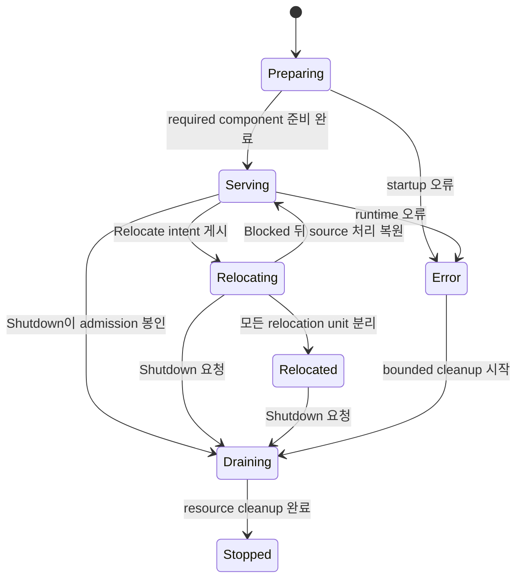
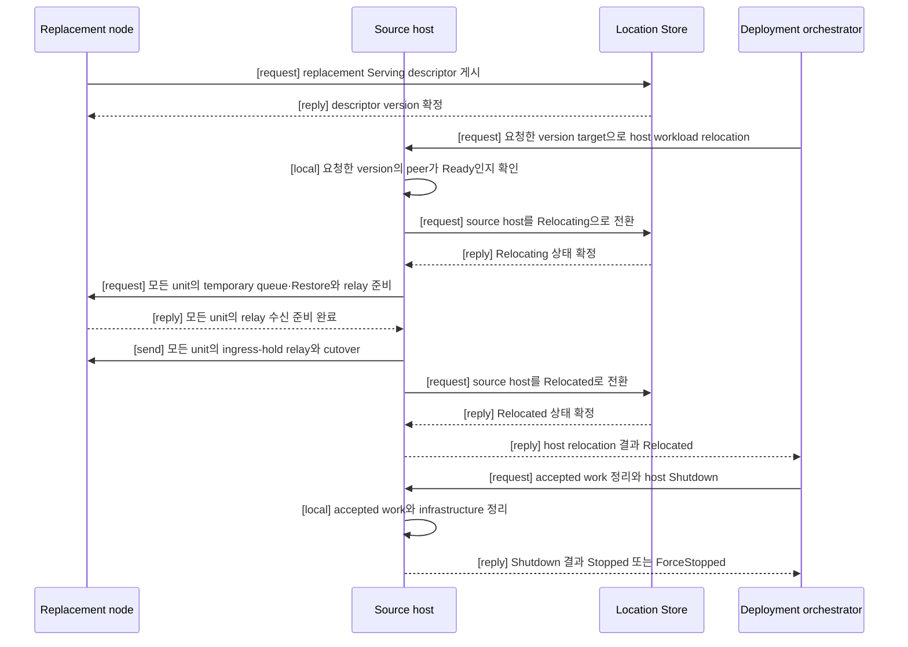
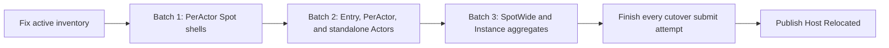

# Host relocation 전체 흐름

[Location·Relocation 주제 목차](README.ko.md) · [스펙 목차](../README.ko.md) · [이전: 04. Actor와 Spot relocation 전체 흐름](04-relocation-flow.ko.md) · [다음: 06. 장애 대응과 failover 범위](06-failure-failover-policy.ko.md)

> **이 문서가 정의하는 것** — Host `Relocate`가 stateful workload를 relocation unit으로
> 확정하고 target을 선택해 이전한 뒤 `Relocated`를 반환하며, Message Follow와 `Shutdown`으로
> source resource를 정리하는 전체 순서와 결과. Unit 하나의 owner 전환·message 처리 순서는
> [Actor와 Spot relocation 전체 흐름](04-relocation-flow.ko.md)이 단일 기준이며, 이 문서는
> host operation이 그 unit을 열거하는 방법, mode와 완료 조건만 추가한다.

## 1. 이 문서가 답하는 질문

이 문서는 application이 host의 stateful workload를 다른 node로 이전하거나 host를 종료할 때
어떤 operation을 호출하고, Framework가 어떤 순서로 처리하며, 호출이 어떤 결과로 끝나는지를
정의한다.

Message handler와 Actor를 실행하는 단위를 [Spot](../00-foundation/02-glossary.ko.md#spot)이라고 한다. 이
문서에서 stateful workload는 host가 처리 중인 Actor·Spot, 아직 끝나지 않은 message와
timer를 뜻한다.

Application version을 유지한 채 node를 점검하거나 재부팅하려면 `PlannedMaintenance`로
`Relocate`를 호출한다. 준비한 새 application version으로 교체하려면 `RollingUpdate`로
호출한다. Target version 선택 방식을 [relocation mode](../00-foundation/02-glossary.ko.md#relocation-mode)라고
한다.

두 mode 모두 성공하면 stateful workload만 source host에서 분리된다. Host와 infrastructure
connection은 유지된다. Application 또는 deployment orchestrator는 이 결과를 확인한 뒤, 새
operation을 받지 않고 runtime을 종료하는 [Shutdown](../00-foundation/02-glossary.ko.md#shutdown)을
별도로 호출한다.

Stateful workload의 연속성을 보장하지 않고 host를 종료하려면 `Relocate` 없이 `Shutdown`만
호출한다.

### 1.1 장애 처리 범위

`Relocate`는 source runtime, 선택한 target runtime과 각 Spot의 현재 owner와 위치를 여러
node가 함께 확인하는 저장소인 [Location Store](../00-foundation/02-glossary.ko.md#location-store)가
operation을 끝낼 때까지 실행되는 graceful handoff만 지원한다. 같은 process 안에서 일시적인 Store 또는
transport 오류를 deadline 안에 다시 시도할 수는 있다. 그러나 source나 target process가
종료된 뒤 다른 runtime이 relocation을 이어받거나, 다른 target을 선택하여 자동으로 복구하지
않는다. Source나 target process가 종료된 뒤의 복구는 이 계약의 범위 밖이다.

Owner를 동시에 둘로 만들지 않는 규칙은 이 경우에도 적용한다. Location Store 변경 결과를
받지 못하면 성공이나 실패를 추측하지 않고 같은 record를 다시 읽는다. 실제 owner를 확인하기
전에는 source admission을 다시 열거나 target application message 처리를 시작하지 않는다.

여러 node가 message를 주고받는 연결 그룹인 [RouteMesh](../00-foundation/02-glossary.ko.md#routemesh)에서
같은 이름으로 연결된 node 그룹을 구분하는 이름을
[MeshName](../00-foundation/02-glossary.ko.md#meshname)이라고 한다. 같은 Channel에 참여한 target을 고르는
이름은 [ChannelName](../00-foundation/02-glossary.ko.md#channelname)이다. Application은 MeshName,
ChannelName 또는 node RID로 일부 component만 골라 종료 순서를 직접 조립하지 않는다.

RouteMesh, 그
그룹에 참여하는 runtime node인 [MeshNode](../00-foundation/02-glossary.ko.md#meshnode), ClientServer
server와 [Classic fanout](../00-foundation/02-glossary.ko.md#classic-fanout) publisher를 host 단위로 함께
조정한다.

이 문서는 application이 관찰하는 host lifecycle, Actor·Spot relocation unit을 확정하는
방법, cutover 뒤 source resource를 정리하는 전체 순서와 handoff 결과를 소유한다.
Actor·Spot을 현재 처리하는 node를 [owner](../00-foundation/02-glossary.ko.md#owner)라고 한다.
Actor·Spot의 owner와 위치를 여러 node가 함께 판단하는 record를
[authority](../00-foundation/02-glossary.ko.md#authority)라고 한다. Framework가 authority와 두 Store를
사용하는 순서는 [Location runtime](01-location-runtime.ko.md)이 정의한다. 현재 owner와
위치를 저장하는 [Location Store](../00-foundation/02-glossary.ko.md#location-store) provider 계약은
[Location Store (Redis)](02-location-store-redis.ko.md)가 정의한다. 이전할 application
state와 실행하지 않은 queue·timer payload는 저장소를 거치지 않고 source memory에서
target으로 직접 전송하며, 그 전달 계약은
[Actor와 Spot relocation 전체 흐름](04-relocation-flow.ko.md)이 소유한다. Instance Spot을
최초 message로 새로 만들 때의 기록과 relocation 뒤 완료되는 pending request의 terminal
결과 기록을 보관하는 저장소인
[Relocation Store](../00-foundation/02-glossary.ko.md#relocation-store)에 남는 저장 책임의
provider 계약은 [Relocation Store (Redis)](03-relocation-store-redis.ko.md)가 정의한다. 이 문서는 전달
형식을 반복하지 않고 host operation의 공개 순서만 정의한다.

## 2. Application이 선택하는 operation

### 2.1 Relocate mode 선택

Caller는 `Relocate`를 호출할 때 mode를 반드시 지정한다. 두 mode의 차이는 target application
version뿐이다. 이후의 queue seal, state 복원, authority 전환과 session handoff 규칙은
같다.

| 값 | Mode | Caller가 지정하는 값 | Framework가 선택하는 target |
|---:|---|---|---|
| 0 | `PlannedMaintenance` | `TargetApplicationVersion`을 지정하지 않는다. | Source와 application version이 정확히 같은 node만 선택한다. |
| 1 | `RollingUpdate` | Source보다 큰 `TargetApplicationVersion`을 지정한다. | Caller가 지정한 application version과 정확히 같은 node만 선택한다. |

`PlannedMaintenance`의 effective target version은 source의 `ApplicationVersion`이다. Target
version을 함께 지정하면 argument error다. `RollingUpdate`는 target version이 없거나 source
version 이하이면 argument error다. Framework는 이런 잘못된 조합을 runtime state와 admission을
변경하기 전에 거부한다.

Operation이 끝나야 하는 마지막 시각을 [deadline](../00-foundation/02-glossary.ko.md#deadline)이라고 한다.
두 mode 모두 `Deadline`을 생략하면 30초를 사용한다. 명시한 값은 0보다 커야 한다.

### 2.2 Public operation

다음 .NET 선언은 공통 계약의 한 표현이다. 다른 언어의 정확한 이름과 signature는 각 언어의
interface 문서가 정의한다.

```csharp
public enum ZLinkFrameworkRelocationMode
{
    PlannedMaintenance = 0,
    RollingUpdate = 1
}

public sealed record ZLinkFrameworkRelocationOptions
{
    // 같은 version 점검인지 새 version 배포인지 선택한다.
    public required ZLinkFrameworkRelocationMode Mode { get; init; }

    // RollingUpdate에서만 source보다 큰 version 하나를 지정한다.
    public long? TargetApplicationVersion { get; init; }

    // 생략하면 30초를 사용한다.
    public TimeSpan? Deadline { get; init; }
}

public readonly record struct ZLinkFrameworkRelocationResult(
    ZLinkFrameworkRelocationMode Mode,
    long TargetApplicationVersion,
    ZLinkFrameworkRelocationOutcome Outcome,
    ZLinkFrameworkRelocationReason Reason);

public interface IZLinkFrameworkRuntime
{
    // 현재 host lifecycle state와 마지막 결과를 제공한다.
    ZLinkFrameworkRuntimeStatus Status { get; }

    // Host state와 terminal result 변화를 순서대로 관찰한다.
    IAsyncEnumerable<ZLinkObservedStatus<ZLinkFrameworkRuntimeStatus>> ObserveAsync(
        CancellationToken cancellationToken = default);

    // Stateful workload를 이전하고 성공하면 Relocated 상태로 남는다.
    ValueTask<ZLinkFrameworkRelocationResult> RelocateAsync(
        ZLinkFrameworkRelocationOptions options,
        CancellationToken cancellationToken = default);

    // 새 relocation 없이 accepted work와 host resource를 정리한다.
    ValueTask<ZLinkFrameworkTerminationResult> ShutdownAsync(
        TimeSpan? deadline = null,
        CancellationToken cancellationToken = default);
}
```

Rolling update의 일반적인 호출 순서는 다음과 같다.

```csharp
var relocation = await runtime.RelocateAsync(
    new ZLinkFrameworkRelocationOptions
    {
        // N+1로 준비한 node만 target 후보로 사용한다.
        Mode = ZLinkFrameworkRelocationMode.RollingUpdate,
        TargetApplicationVersion = currentVersion + 1,
        Deadline = TimeSpan.FromSeconds(30)
    },
    cancellationToken);

if (relocation.Outcome == ZLinkFrameworkRelocationOutcome.Relocated)
{
    // Relocation 성공을 확인한 뒤 host resource를 별도로 정리한다.
    // 바로 종료하면 Message Follow route와 cutover 재전송 사본이 함께 사라진다(§14).
    await runtime.ShutdownAsync(cancellationToken: cancellationToken);
}
```

위 예제처럼 `Relocated` 직후 `Shutdown`을 호출하는 것도 허용된다. 이전 route로 도착하는
message 전달과 cutover 재전송을 모두 사용한 뒤 종료하려는 deployment는, source runtime이
종료해도 안전한 시점을 알리는 관찰 상태 [`SafeToShutdown`](../00-foundation/02-glossary.ko.md#safe-to-shutdown)이
runtime status에 게시된 것을 확인한 뒤 `Shutdown`을 호출한다 — 게시 조건은
[§14](#14-shutdown과-relocate의-경쟁)가 설명한다.

`Relocate` 결과에는 mode와 effective target version이 항상 포함된다. Target을 찾지 못한
경우에도 caller가 어떤 조건으로 기다렸는지 확인할 수 있도록 같은 값을 보존한다. `Relocate`가
`Blocked`로 끝나면 caller는 다시 시도하거나 continuity 없이 `Shutdown`할 수 있다.

## 3. Host state와 완료 결과

Host lifecycle은 `FrameworkRuntimeState` 하나가 소유한다.

Host의 endpoint, 실행 세대와 제공 기능을 Store에 게시한 정보를
[descriptor](../00-foundation/02-glossary.ko.md#descriptor)라고 한다. 새 application 작업을 받을 준비가
끝난 상태를 [ready](../00-foundation/02-glossary.ko.md#ready)라고 한다.

| 값 | State | 의미 |
|---:|---|---|
| 0 | `Preparing` | Registration, bind, descriptor 검증과 recovery를 진행하며 application message를 받지 않는다. |
| 1 | `Serving` | Host가 ready 상태이며 새로운 application work를 받는다. |
| 2 | `Relocating` | 새 placement와 selection에서는 제외됐지만 아직 seal하지 않은 local unit은 message와 timer를 계속 처리한다. |
| 3 | `Relocated` | 모든 stateful object가 source dispatch에서 분리됐다. Host와 infrastructure 연결은 유지한다. |
| 4 | `Draining` | `Shutdown`이 새 admission을 닫고 이미 수락한 work와 resource를 정리한다. |
| 5 | `Stopped` | Application resource, infrastructure resource와 listener 정리가 끝났다. |
| 6 | `Error` | Startup 또는 runtime 오류 때문에 service를 제공할 수 없다. |

`IsReady`는 `Serving`에서만 true다. Component lifecycle snapshot은 각 component의 상태를
관찰하는 정보이며 host state를 대신하지 않는다. Component별 `Drain`, `AwaitDrained`, `Stop`
또는 일부 Mesh만 대상으로 하는 public operation은 제공하지 않는다.



각 unit에서 relay-ready reply가 accepted 상태가 되기 전 명시적인 실패만 tentative 작업을
정리하고 source 처리를 복원할 수 있다. 다른 unit이 이미 이 경계를 지났더라도 아직 경계를
지나지 않은 source workload를 복원하고 host는 `Serving`으로 돌아갈 수 있다. 경계를 지난
unit은 cutover submit 결과와 관계없이 source로 되돌리지 않고 target의 cutover 수신(connection
재수립 시 재전송 포함) 또는 cutover 대기 fallback을 계속 따른다. `Serving` 복귀가 모든
unit의 source rollback을 뜻하지 않는다.

Relocation outcome은 다음 값으로 고정한다. 표의 reason 가운데
[`DeadlineExceeded`](../00-foundation/02-glossary.ko.md#deadlineexceeded)는 정해진 시간 안에
끝나지 않아 호출을 끝낸 경우를 뜻하며, 남은 작업이 취소됐다는 뜻은 아니다.

| 값 | Outcome | 허용 reason | 의미 |
|---:|---|---|---|
| 0 | `Relocated` | `None` | 모든 stateful object가 source dispatch에서 분리됐다. |
| 1 | `Blocked` | `TargetUnavailable`, `StoreUnavailable`, `RelocationDisabled`, `StateIncompatible`, `DeadlineExceeded`, `RelocationFailed`, `RuntimeNotReady`, `ManualTopologyUnsupported`, `ShutdownRequested`, `OperationInProgress` | Relocation을 시작할 수 없거나 전체 workload 이전을 끝내지 못했다. |

Wire 값은 `Relocated=0`, `Blocked=1`이다. Reason은 `None=0`, `TargetUnavailable=1`,
`StoreUnavailable=2`, `RelocationDisabled=3`, `StateIncompatible=4`, `DeadlineExceeded=5`,
`RelocationFailed=6`, `RuntimeNotReady=7`, `ManualTopologyUnsupported=8`,
`ShutdownRequested=9`, `OperationInProgress=10`이다. 정의하지 않은 outcome과 reason 조합은
protocol 오류다.

Shutdown outcome은 `Stopped=0`, `ForceStopped=1`이고 reason은 `None=0`, `DeadlineExceeded=1`,
`TeardownFailed=2`다. `ForceStopped`는 별도 host state가 아니다. Bounded teardown으로 정리를
끝낸 결과이며 host state는 `Stopped`다. Relocation 실패는 relocation result가 소유하고
termination reason에 섞지 않는다.

## 4. Target을 선택하기 전에 확인하는 조건

`Serving`에서 시작한 `Relocate`는 host state와 application admission을 바꾸기 전에 host
전체를 한 번에 검사한다. 이때 이동 대상의 새 작업을 막거나 target 수용 공간을 미리 확보하지
않는다.

Application state를 bytes로 저장해 target에서 복원하는 방식은
[Preserve-state relocation policy](../00-foundation/02-glossary.ko.md#preserve-state-relocation-policy)다.
Host가 현재 owner 자격을 유지하는 기간을 [owner lease](../00-foundation/02-glossary.ko.md#owner-lease)라고
한다.

| 검사 항목 | 통과 조건 |
|---|---|
| 동시에 진행 중인 작업 | 새 object 생성, join, Instance placement, session binding과 inbound relocation이 있으면 먼저 끝낼 작업을 확정한다. |
| Local workload | 모든 MeshNode의 Actor, Spot, timer, session과 진행 중인 infrastructure operation을 확인한다. |
| Store | Location Store의 현재 위치 record와 target descriptor의 owner lease를 사용할 수 있다. 이전할 payload는 source memory에서 직접 전송하므로 Relocation Store 준비는 handoff 조건이 아니며, 잔존 책임 — Instance Spot을 최초 message로 새로 만들 때의 기록과 relocation 뒤 완료되는 pending request의 terminal 기록 — 이 필요한 배치에서만 확인한다. |
| Unit 호환성 | Application이 명시적으로 만드는 User Spot, 최초 message로 필요할 때 만드는 Instance Spot, 그 안의 Actor가 사용하는 relocation policy와 state adapter, target [factory](../00-foundation/02-glossary.ko.md#factory), 수용 공간이 모두 호환된다. |
| Topology | Host가 사용하는 모든 service topology가 Store의 descriptor로 remote endpoint를 찾는다. 이 방식을 [automatic discovery](../00-foundation/02-glossary.ko.md#automatic-discovery)라고 한다. |

Manual RouteMesh peer, ClientServer client endpoint, fanout subscriber endpoint 또는
descriptor를 게시하지 않는 manual fanout publisher가 하나라도 등록돼 있으면
`Blocked/ManualTopologyUnsupported`다. 현재 연결 여부가 아니라 registration을 검사한다.
Automatic component가 listener 주소를 명시적으로 bind하는 설정은 manual topology가 아니다.

Runtime이 확인하는 범위는 local registration이다. 다른 process가 Framework 밖에서 만든
connection까지 확인하지 않으므로, 참여 process 전체가 automatic discovery만 사용한다는
조건은 deployment가 보장한다.

## 5. Mode에 맞는 target을 선택한다

Framework는 다음 순서로 target을 좁힌다.

| 순서 | 조건 |
|---:|---|
| 1 | `PlannedMaintenance`는 source와 같은 application version만 남긴다. `RollingUpdate`는 caller가 지정한 version만 남기며 더 낮거나 높은 다른 version도 제외한다. |
| 2 | Source가 아니며 `Serving` 상태인 Object Server만 남긴다. |
| 3 | Application이 object를 만들도록 등록한 함수인 [factory](../00-foundation/02-glossary.ko.md#factory), 언어 독립 object type 이름인 [stable type](../00-foundation/02-glossary.ko.md#stable-type), relocation policy와 state adapter가 호환되는 node만 남긴다. |
| 4 | 필요한 수용 공간이 남아 있고, source에 [maintenance wave](../00-foundation/02-glossary.ko.md#maintenance-wave)가 설정되어 있으면 값이 다른 node만 남긴다. Maintenance wave는 같은 점검 작업의 host를 구분하는 application 설정값이다. |
| 5 | 같은 시점의 descriptor 목록과 Core peer table에서 RID와 [lifecycle generation](../00-foundation/02-glossary.ko.md#lifecycle-generation)이 모두 같은 node만 남긴다. Lifecycle generation은 같은 RID를 사용한 서로 다른 process 실행을 구분한다. 해당 peer는 `Admitted`와 `Ready`여야 한다. |

Version은 수용 공간과 placement weight보다 먼저 확인한다. 따라서 다른 version node의 남은
공간이나 높은 weight는 선택 결과에 영향을 주지 않는다. 여러 후보에 새 작업을 배정할 상대
비중을 [weight](../00-foundation/02-glossary.ko.md#weight)라고 한다. 조건을 만족한 target이 여러 개일
때만 이 값을 적용한다.

Descriptor가 게시됐거나 connect intent가 만들어진 것만으로 target이 ready라고 판단하지
않는다. 특정 시점의 상태를 읽기 전용으로 복사한 결과를 [snapshot](../00-foundation/02-glossary.ko.md#snapshot)이라고
한다. Descriptor snapshot이 비어 있거나 source 자신만 포함하거나 모든 remote peer가
draining이면 target이 없는 상태다.

### 5.1 Target이 아직 없을 때

Target 탐색보다 먼저 이전할 unit이 있는지 확인한다. Source가 소유한 Actor, User Spot과
Instance Spot이 모두 없으면 옮길 것이 없으므로 target을 찾지 않고 `Relocated/None`으로
끝낸다. Relocation의 목적은 workload 이전이며, 이전할 workload가 없는 host를 target이
없다는 이유로 막지 않는다. 이 경우에도 host state 전이와 admission 종료는 다른 relocation과
같다.

이전할 unit이 있는데 요청한 version의 target이 없으면 source state와 admission을 유지한 채
deadline까지 descriptor와 Core peer table의 수렴을 기다린다. 여러 Mesh를 가진 process는
모든 Mesh에서 조건을 만족해야 한다. Deadline까지 target을 확보하지 못하면 tentative
coordination을 정리하고 `Blocked/TargetUnavailable`을 반환한다.



`Relocated`는 모든 unit의 cutover submit 시도가 성공 또는 실패 terminal에 도달했다는 source
측 결과이며 target CAS 완료 reply를 기다렸다는 뜻이 아니다. `Relocated`에서는 descriptor,
connection, listener와 infrastructure resource를 유지한다. 이 다이어그램은 target이 준비된
정상 흐름이다. Target이 없으면 앞 절의 deadline 규칙으로 `Blocked/TargetUnavailable`을
반환한다.

Automatic ClientServer client와 fanout subscriber는 replacement descriptor로 새 connection을
만들고 source 상태를 selection에 반영한다. Accepted work와 barrier가 남은 기존 connection은
descriptor 변화만으로 즉시 닫지 않는다.

## 6. Concurrent 호출과 cancellation

| 상황 | 결과 |
|---|---|
| Mode와 effective target version이 같은 concurrent `Relocate` | 최초 operation과 deadline을 공유한다. 뒤의 호출은 deadline을 바꾸지 않는다. |
| Mode 또는 effective target version이 다른 concurrent `Relocate` | 기다리지 않고 `Blocked/OperationInProgress`다. |
| `Blocked` 뒤 다시 `Relocate` | `Blocked`는 저장하지 않으므로 host 조건을 처음부터 다시 검사한다. |
| `Relocated`에서 다시 `Relocate` | 최초 `Relocated/None`의 mode와 effective target version을 반환한다. |
| Concurrent `Shutdown` | 같은 operation을 공유하고 terminal result를 저장한다. |
| `Stopped`에서 다시 `Shutdown` | 저장한 결과를 반환한다. 없으면 새 작업 없이 `Stopped/None`이다. |
| `Preparing`, `Error` 또는 `Stopped`에서 `Relocate` | Admission을 바꾸지 않고 `Blocked/RuntimeNotReady`다. |

Caller cancellation은 해당 waiter만 끝내며 shared operation은 취소하지 않는다. `Shutdown`은
`Preparing`에서 startup을 중단하고 `Error`에서는 bounded cleanup을 시작한다.

## 7. Relocation unit과 batch 순서

Framework가 서로 독립적으로 옮길 수 있는 Actor 또는 Spot 묶음을
[relocation unit](../00-foundation/02-glossary.ko.md#relocation-unit)이라고 한다. Actor가 현재 어느 Entry
Spot 또는 User Spot에 속하는 관계는 [Actor membership](../00-foundation/02-glossary.ko.md#actor-membership)이다.

| Relocation unit | 경계 |
|---|---|
| `SpotWide` User Spot aggregate | User Spot과 새 작업을 막는 시점의 member Actor 전체 |
| Actor | Entry Spot 또는 `PerActor` User Spot에 속한 Actor 하나 |
| `PerActor` Spot authority 전환 | Target의 stateless Spot shell과 Spot-level queue authority |
| Instance Spot | Actor membership이 없는 Spot 하나 |

Entry Spot 자체는 이전하지 않는다. Source Entry Spot의 Actor는 Actor unit으로 target node의
Entry Spot에 이전한다. `PerActor` User Spot도 Spot application state를 이전하지 않고 Actor를
같은 단위로 이전한다.

Source runtime은 host가 `Relocating`으로 바뀌기 직전의 active state를 한 번 읽어 inventory를
확정한다. User Spot membership에 포함된 Actor는 해당 Spot의 execution mode에 따라 `PerActor`
Actor unit 또는 `SpotWide` aggregate에 한 번만 포함한다. Entry Spot Actor와 User Spot
membership에 포함되지 않은 standalone Actor는 각각 Actor unit으로 포함한다. 같은 Actor를
Spot unit과 standalone unit에 중복으로 넣지 않는다. Inventory를 확정한 뒤 생긴 새 stateful
placement는 받지 않는다.

Host relocation은 다음 batch 순서로 실행한다. 여기서 batch는 dependency가 같은 unit 묶음을
뜻하며, unit 수를 숫자로 나눈 고정 크기 묶음이 아니다.

| Batch | 포함하는 unit | 시작 조건 |
|---:|---|---|
| 1 | `PerActor` User Spot의 stateless Spot shell과 Spot-level queue authority | Inventory와 target preflight가 끝나고 해당 Spot의 current turn이 끝났다. |
| 2 | Entry Spot Actor, `PerActor` member Actor와 standalone Actor | 각 Actor의 current turn이 끝났고, `PerActor` member라면 해당 Spot shell 전환이 끝났다. |
| 3 | `SpotWide` User Spot aggregate와 Instance Spot | Aggregate 전체의 current turn과 application safe point가 끝났다. |

앞 batch가 terminal 상태에 도달한 뒤 다음 batch를 시작한다. 같은 batch 안에서는 dependency가
없는 unit을 동시에 처리할 수 있다. `PerActor` member Actor는 같은 Spot의 shell보다 먼저
시작하지 않으며, `SpotWide` member Actor는 별도 Actor unit으로 분리하지 않는다. 한 unit이
실패하면 그 unit보다 뒤의 batch를 새로 시작하지 않는다. 이미 시작한 unit은 안전한 terminal
상태까지 처리한다.



Framework는 relocation correctness를 위해 별도 동시 실행 unit 수, participant 수 또는 relay
record 수 상한을 두지 않는다. Unit별 동시 이동량은 진행 중인 relocation payload가 peer
연결에서 동시에 차지하는 byte를 제한하는 in-flight payload 예산이 조절하며, 예산의 계산과
대기 규칙은
[Actor와 Spot relocation 전체 흐름 §5.3](04-relocation-flow.ko.md#53-relocation-전용-capacity-제한을-두지-않는다)이
소유한다. 예산이 차 있으면 다음 unit은 source admission seal을 적용하기 전에 대기하고,
대기하는 Actor·Spot은 그동안 message를 정상적으로 처리한다 — coordinator가 동시 unit 수
상한을 별도로 정하지 않는다. Runtime과 Store provider의 기존 memory, frame, page 크기
제한은 그대로 적용하며, resource가 즉시 준비되지 않으면 source application dispatch를 막기
전에 기다린다. Limit에 도달했다는 이유만으로 이미 시작한 relocation을 실패시키지 않는다.

Target이 이미 포화 상태이면 chunk 유입이 느려지고, 그만큼 source의 예산 해제가 늦어 다음
unit의 시작도 늦어진다 — 부하를 덜어내려는 이동이 부하 때문에 느려지는 것이다. 이것은
포화를 우회하지 않는 backpressure 계약의 의도된 결과이며, relocation을 위한 우회로를 만들지
않는다. Host operation deadline 안에 이전이 끝나지 않으면 새 unit relocation을 시작하지
않는 기존 규칙(§8)이 적용되므로, 운영자는 deadline 연장 또는 target 부하 완화를 먼저
판단한다. Deadline 산정은 계산식이 아니라 해당 배치에서 관측한 이전 처리량을 입력으로
사용한다.

이 batch 순서는 Application Job Queue capacity chunk가 아니다. 각 target의 pre-dispatch
temporary queue와 saved work는 retained-byte owner가 소유하는 ordered durable backlog이며,
ordinary staging ingress는 shared reservation을 사용해 받은 뒤 durable handoff에서 즉시
반환한다. Target-only CAS와 required lifecycle이 끝나 dispatch가 runnable해지면 backlog의
handler turn이 순서대로 live queued-job permit을 하나씩 얻는다. 따라서 compatible target의
job limit가 aggregate backlog보다 작아도 aggregate를 capacity blocker로 실패시키거나
member를 source에 남기지 않고 점진적으로 실행한다.

`SpotWide`는 current turn이 끝나면 Spot과 그 시점의 member Actor 전체를 한 unit으로 옮긴다.
`PerActor`와 Entry Spot은 Actor별 current turn이 끝난 unit부터 옮긴다. `PerActor` Spot
lane은 authority 전환 때만 잠시 막고 member Actor 전체가 같은 시점에 준비될 때까지 기다리지
않는다.

`ApplicationSignaled` readiness를 선택한 `SpotWide` User Spot은 target 준비를 마친 뒤
application이 `RelocationReady().Defer()`로 등록한 turn 경계를 사용한다. 준비된 relocation이
없으면 source에서 `Continued` completion callback을 다음 application turn으로 실행한다.
Relay-ready reply가 accepted 상태가 되기 전 취소되면 source queue를 복원한 뒤 `Continued`를
호출한다. 이 경계 뒤에는 취소나 cutover submit 실패로 source를 복원하지 않는다. Owner
commit 뒤에는 target queue에서 `Relocated`를 첫 application turn으로 호출한다.

## 8. Interruption budget 목표

| 대상 | 측정 unit |
|---|---|
| Entry Spot Actor | Actor 하나 |
| `PerActor` User Spot | Global Spot ID로 대상을 지정하는 [Spot direct](../00-foundation/02-glossary.ko.md#spot-direct) admission 하나와 Actor 각각 |
| `SpotWide` User Spot | Spot과 member Actor를 포함한 aggregate 하나 |
| Instance Spot | Spot 하나 |

측정은 source admission seal이 적용된 시점에 시작한다. Target 선택, temporary queue 등록을
포함한 target 준비와 현재 turn 또는 application safe point를 기다리는 시간은 제외한다. 이
준비는 source admission을 막기 전에 끝내야 한다. Seal 뒤에 실행하는 Capture, encoding,
target으로의 chunk 전송, checksum 검증, authority 변경, target Restore와 queue·timer 복원은
모두 측정에 포함한다. Source가 ordered relay 뒤 one-way cutover submit의 terminal result에
도달하면 성공·실패와 관계없이 측정을 끝낸다. 이 지표가 측정하는 것은 source가 멈춰 있는
시간이며, target이 처리를 재개하기까지 application이 관찰하는 전체 중단 시간이 아니다.

Relocation unit마다 다음 시점을 기록한다. 각 시점은 그 사건이 일어나는 node가 자기 clock으로
기록한다.

| 시점 | 뜻 | 기록 주체 |
|---|---|---|
| S0 | Source admission seal 적용 | Source |
| S1 | One-way cutover submit의 terminal result | Source |
| S2 | Target의 Location Store CAS 확인 | Target |
| S3 | Target application dispatch 개방 | Target |
| S4 | 이전 주소로 온 message를 target에 계속 전달하는 [Message Follow](../00-foundation/02-glossary.ko.md#message-follow) route 제거 가능 시점. `MessageFollowDuration` 만료 기준이며, Message Follow route를 source가 소유하므로 source 시점이다. | Source |

| 지표 | 구간 | 뜻 |
|---|---|---|
| Source 정지 시간 | S0→S1 | 위 문단이 정의한 측정 구간과 같다. |
| Target 재개 시간 | S2→S3 | Target이 owner를 확인한 뒤 application dispatch를 열기까지의 target-local 구간이다. |
| Route 수렴 시간 | S1→S4 | Source가 Message Follow route를 유지해야 하는 기간의 근거가 되는 source-local 구간이다. |

서로 다른 node의 시각을 직접 빼는 지표는 만들지 않는다. S0→S3처럼 node를 가로지르는 전체
중단 구간은 [message flow tracing](../06-observability/03-message-flow-tracing.ko.md)의 같은 flow 상관으로만 관찰한다. S3은 dispatch 개방
시점이므로, backlog와 permit 순서 때문에 application이 첫 handler 결과를 관찰하는 시점은
이보다 늦을 수 있다. 지표 이름과 계기의 정식 정의는 [Runtime monitoring](../06-observability/01-runtime-monitoring.ko.md)과
[Runtime metrics](../06-observability/02-runtime-metrics.ko.md)가 소유하며, 이 절은 시점 정의와 측정 주체만 정한다.

각 unit은 기본 1초 이내를 목표로 한다. **이 값은 timeout도 correctness 조건도 아니며**,
[Actor와 Spot relocation 전체 흐름의 `RelocationCutoverWaitTimeout`(기본 1,000 ms)](04-relocation-flow.ko.md#44-ordered-relay와-one-way-cutover)과
숫자는 같지만 다른 값이다 — 이 1초는 warning 임계값으로만 쓰는 관측용 목표이고,
`RelocationCutoverWaitTimeout`은 cutover 대기가 끝나면 target이 CAS와 queue 개방으로
넘어가는 protocol fallback 시한이다. 초과해도 relocation을 취소하거나 source로 되돌리지
않는다. Framework는 같은 operation을 one-way cutover submit이 terminal result에 도달할 때까지 계속하고 warning과
`zlink.relocation.interruption` histogram을 기록한다. Source application close는 cutover
submit의 성공 또는 실패 terminal 뒤 수행한다. Target은 처리 시작 ACK를 보내지 않으며 target
admission open은 target-local status와 trace로 관찰한다.

Host operation deadline이 끝나면 새 unit relocation을 시작하지 않는다. 이미 시작한 unit 중
target이 relay-ready reply를 보내기 전에 명시적으로 실패한 unit만 안전한 abort를 수행한다.
Reply 결과가 불확정이면 target의 cutover 대기 fallback이 시작됐을 수 있으므로 source
dispatch를 다시 열지 않는다. Cutover 전송을 시도한 unit도 source로 되돌리지 않으며
target이 Restore 유효시간까지 owner 전환을 계속한다. Source가 모든 unit의 cutover 전송을
시도하지 못하면 host는 `Relocated`가 되지 않는다. 시도한 cutover submit의 성공·실패는 완료
조건이 아니다.

## 9. Unit 하나를 이전하는 순서 — 04를 따른다

Actor와 Spot unit 하나의 owner 전환, ordered relay, temporary queue 설치, checksum 검증,
cutover, Location Store CAS, queue 병합과 Session route 전환은
[Actor와 Spot relocation 전체 흐름 「4. 정상 처리 순서」](04-relocation-flow.ko.md#4-정상-처리-순서)가
단일 기준이다. Host relocation을 시작하면 Application이 Actor나 Spot마다 별도 이동 API를
호출하지 않아도 Framework가 source host의 workload를 target node로 옮긴다. Actor와 Spot의
ID는 유지되며, 이동이 끝난 대상은 target에서 기존 queue 순서대로 message 처리를 계속한다.

이 절이 추가로 정의하는 것은 host가 그 공통 순서를 **몇 개의 unit으로 나누고 어떤 순서로
여는가**뿐이다 — unit을 나누는 batch 규칙은 §7이 정의했다. 이 절은 unit 종류별로 target이
무엇을 준비하고 어떤 값을 함께 바꾸는지, 그리고 어떤 callback을 호출하거나 호출하지 않는지의
**차이**만 §10에서 다룬다.

| 주체 | 하는 일(04와 같음) |
|---|---|
| Application | Host의 `Relocate`를 호출한다. `ApplicationSignaled`를 선택한 `SpotWide` User Spot만 안전한 이동 시점을 `RelocationReady().Defer()`로 알린다. |
| Source runtime | 현재 실행 중인 작업을 끝내고 application dispatch를 중단한다. Application state와 아직 실행하지 않은 queue·timer를 source memory에 payload로 확정해 target에 직접 전송하고, capture 뒤 이전 주소로 도착하는 message만 target에 relay한다. Location Store는 변경하지 않는다. |
| Target runtime | 전송받은 chunk를 조립해 checksum을 검증한 뒤 같은 ID를 사용하는 Actor나 Spot을 만들고 state와 기존 작업을 복원한다. Relay의 cutover 경계를 받거나 relay-ready 뒤 cutover 대기 시간이 끝나면 Location Store를 source에서 target으로 CAS하고, 성공한 경우에만 queue를 연다. |
| Location Store | 현재 어느 node가 Actor나 Spot을 처리하는지 기록한다. 여러 값을 함께 바꿔야 할 때는 모두 바꾸거나 하나도 바꾸지 않는다. |
| Relocation Store | Handoff payload는 보관하지 않는다. Instance Spot을 최초 message로 새로 만들 때의 기록과 relocation 뒤 완료되는 pending request의 terminal 결과만 남는 책임으로 기록한다. |

`RelocationCutoverWaitTimeout`(relay 준비 reply부터 cutover 도착까지 대기하는 시간, **기본
1,000ms**)은 [Framework API](../00-foundation/06-framework-api.ko.md)가 소유한다.

Target factory가 policy별로 하는 일은 다음과 같다.

| Policy | 처리 |
|---|---|
| `DisableRelocation` | 해당 object가 남아 있으면 `Blocked/RelocationDisabled`다. |
| `RecreateOnRelocation` | 같은 object ID로 target factory를 실행한다. Application state는 옮기지 않지만 아직 끝나지 않은 Framework 작업은 옮긴다. |
| `PreserveStateWith` | Adapter가 반환한 bytes를 저장하고 target factory instance에 `Restore`한다. Application이 bytes의 format, version과 migration을 관리한다. |

Framework는 별도 state contract ID나 generic state type을 추가하지 않는다.

Relocation unit 하나의 temporary queue에는 record 수와 저장 크기 어느 쪽에도 상한을 두지
않으며, Framework는 같은 object에 temporary queue를 추가로 만들지 않는다.

## 10. Unit 종류별 차이

### 10.1 Entry Spot에 속한 Actor

Entry Spot instance는 Object Server lifecycle에 속하므로 다른 node로 옮기지 않는다. Source
Entry Spot에 속한 Actor만 각각 독립된 relocation unit으로 옮긴다. Target runtime은 target
node가 startup에서 이미 만든 Entry Spot에 Actor를 복원한다. 이 이동은 application이 요청한
join이 아니므로 target Entry Spot의 `OnJoinedActor`, source Entry Spot의 `OnLeaveActor`와
`OnActorJoin`을 호출하지 않는다.

### 10.2 PerActor User Spot

`PerActor` User Spot은 Spot message를 처리할 node와 각 Actor를 처리할 node를 따로 바꾼다.
따라서 일부 Actor가 아직 source에 있어도 이미 이동한 Actor와 새 Spot message는 target에서
처리할 수 있다.

1. Target runtime은 source와 같은 SpotId와 ObjectGeneration을 사용하는 빈 Spot instance를
   만든다. Location Store의 현재 위치를 바꾸기 전에는 이 instance를 외부 조회 결과로
   반환하지 않는다.
2. Source runtime은 현재 Spot handler와 진행 중인 Actor Create·Join을 끝낸다. 그 뒤 도착한
   Spot message는 source에서 잠시 보관한다.
3. Target runtime은 Spot relocation temporary queue를 등록한다. Source runtime은 보관한
   Spot message와 이후 이전 route로 들어오는 message를 이 queue로 계속 relay한다.
4. Target의 Spot 준비가 끝나면 Location Store에서 Spot message를 처리할 node를 source에서
   target으로 바꾼다. 보관한 Spot message를 실제 Spot queue로 옮기고 temporary queue 등록을
   제거한 뒤 새 `ToSpot`, Actor Create와 Join을 기존 dispatch 경로로 처리한다.
5. Source member Actor는 각자 현재 turn을 끝낸 뒤 Actor unit으로 target에 이전한다.
   이전되지 않은 Actor의 `ToActor`는 source, 이전된 Actor의 `ToActor`는 target으로 보낸다.
6. 마지막 Actor와 source에 보관했던 message를 모두 target에 전달하면 source Spot에
   `OnClosing(RelocationOut)`을 호출한다.

Framework는 이동 중에 임시 SpotId를 만들지 않는다. Location Store가 target을 현재 Spot
message 처리 node로 기록한 뒤에는 source Spot이 새 `ToSpot`, Create와 Join을 처리하지
않는다. Source Spot은 아직 이동하지 않은 Actor와 이동 중 message 전달만 계속한다.

Target에 만든 빈 Spot은 source Spot의 application field를 복원하지 않으므로 Spot relocation
adapter를 호출하지 않는다. Member Actor는 각자의 relocation policy와 Actor adapter를
사용한다. Session command 44 route update 적용은 각 Actor의 처리나 다음 Actor relocation을
막지 않는다.

### 10.3 SpotWide User Spot

`SpotWide` User Spot은 Spot과 새 작업을 막은 시점의 member Actor 전체를 하나의 이동 작업으로
옮긴다. Actor 하나라도 relocation policy, state adapter 또는 target의 수용 공간 조건을
만족하지 못하면 Location Store를 바꾸지 않고 전체 이동을 중단한다. 이 이동을 구분하는 ID는
0이 아닌 128-bit 값이다.

Target은 Spot과 모든 member Actor를 같은 relocation temporary queue group에 등록한다. 각
record는 실제 target Spot 또는 Actor identity를 보존한다. 모든 participant의 Restore와
aggregate owner 변경이 끝난 뒤 saved work, boundary 전 relay와 나머지 temporary work를 실제
Spot queue와 Actor queue로 나눠 옮기고 regular route로 전환한다. 그다음
`OnRelocationReadyCompleted`를 끝내고 dispatch를 연다. Participant 하나가 실패하면
temporary queue의 어느 작업도 실행하지 않고 group 전체를 폐기한다.

User Spot에 속한 Actor 총수에는 1,024개 상한을 두지 않는다. Framework는 이동 대상 목록을
Location Store의 여러 페이지로 나눈다. 한 페이지에는 최대 1,024개를 기록하며, encoded page
하나의 크기는 최대 1 MiB다. 예를 들어 Actor가 2,500개이면 최소 세 페이지에 나눠 기록한다.
Framework는 전체 Actor 수와 각 페이지 내용이 처음 저장한 목록과 일치하는지 확인한다. 모두
일치할 때만 User Spot과 모든 Actor를 처리할 node를 source에서 target으로 한 번에 바꾼다.
중간에 충돌하면 일부 Actor의 위치만 바꾸지 않는다. 처음 읽은 Store version이 그대로일 때만
모두 바꾸거나 아무것도 바꾸지 않는 이 방식을 [CAS](../00-foundation/02-glossary.ko.md#compare-and-set)라고
한다.

Member Actor의 `OnActorJoin`, `OnJoinedActor`와 `OnLeaveActor`는 호출하지 않는다. Bound
Session 위치 갱신은 Spot과 Actor가 message 처리를 시작한 뒤 Actor별로 진행하며, 한 Session
owner의 응답이 다른 Actor나 Spot의 처리를 막지 않는다.

### 10.4 Instance Spot

Instance Spot은 Actor를 포함할 수 없으므로 Spot 하나가 relocation unit이다. Source의 현재
handler가 끝나면 direct message와 timer를 보관한다. Target runtime은 같은 SpotId로 Instance
Spot을 만들고, `PreserveStateWith`이면 직접 전송받은 application state를 `Restore`로
복원한다. Location Store가 target을 현재 처리 node로 기록하면 target은 복원한 queue와
timer를 처리한다. Instance Spot에는 Actor가 없으므로 Actor 위치나 Session binding을 갱신하지
않는다.

Host relocation은 source에 이미 존재하는 Instance Spot만 옮긴다. Source에 없는 Instance
Spot을 첫 message로 새로 만드는 [cold activation](../00-foundation/02-glossary.ko.md#cold-activation)은
시작하지 않는다.

### 10.5 이동 중 호출하지 않는 callback

Entry Spot과 `PerActor` User Spot의 Actor relocation은 application이 요청한 join이나 leave가
아니다. 따라서 `OnActorJoin`, `OnJoinedActor`와 `OnLeaveActor`를 호출하지 않는다. Framework가
Actor state, 실행 전 queue와 timer를 옮기고 현재 처리 node만 바꾼다.

`SpotWide` User Spot도 각 Actor가 어느 Spot에 속하는지 바꾸지 않고 처리 node만 바꾸므로
member Actor의 join·joined·leave callback을 호출하지 않는다. `ApplicationSignaled`를
사용했다면 target에서 regular route 전환 뒤 dispatch 개방 직전에
`OnRelocationReadyCompleted(Relocated)`만 호출한다.

User Spot과 Instance Spot의 source instance에는 Location Store의 위치 변경 뒤
`OnClosing(RelocationOut)`을 호출한다. Entry Spot instance는 이동하지 않으므로 Entry Spot의
closing callback을 호출하지 않는다. Instance Spot에는 Actor가 없으므로 Actor lifecycle
callback 자체가 없다.

Cross-node Actor join도 같은 policy와 adapter를 사용하지만 정확한 lifecycle은
[Spot과 Actor membership](../03-spot-actor/05-spot-actor-membership.ko.md)이 소유한다. Same-node join은 adapter를 호출하지 않는다. Instance Spot
maintenance relocation은 source에 없는 Instance Spot을 새로 만들지 않는다.

## 11. 중간에 실패하면 어느 위치를 유지하는가

Relay-ready reply가 accepted 상태가 되기 전에 target이 명시적으로 실패하면 source가 계속
message를 처리한다. Framework는 target에 만든 instance를 외부에 공개하지 않고 temporary
queue를 폐기하며 source의 message와 timer를 원래 queue에 되돌린다. Target은 temporary
queue의 record로 request의 terminal 결과를 만들거나 one-way message를 실행하지 않는다.

Relay-ready reply가 accepted 상태가 된 뒤에는 Cutover를 아직 보내지 않았거나 submit이
실패해도 Location Store가 source를 가리키는 동안 source dispatch를 다시 열지 않는다.
Target은 cutover(connection 재수립 시 재전송 포함)를 받거나 cutover 대기 fallback으로 CAS를
계속한다. Target CAS가 끝내 실패하면 target object와 queue를 제거하고 Session은 자체 seal
timeout으로 정리한다. Source의 Message Follow도 정해진 기간에 끝난다.

Location Store가 target을 현재 처리 node로 기록한 뒤에는 source로 되돌리지 않는다. Target
runtime이 계속 실행 중이면 실패한 단계를 다시 시도할 수 있다. Location Store 갱신은 Restore
유효시간까지 다시 시도하며, 그 안에 target owner를 확인하지 못하면 준비한 Actor 또는 Spot과
queue를 제거하고 Session route를 갱신하지 않는다. Source나 target process가 종료되면 다른
runtime이 이 relocation을 이어받지 않는다. Commit 뒤 target이 종료되면 source로 되돌리지
않고 해당 object를 unavailable 상태로 둔다. 이후 자동 복구는 계약에 포함하지 않는다. Source는
one-way cutover 뒤 완료 reply를 기다리지 않고 Message Follow로 전환한다. Target은 CAS와
queue 개방 뒤 Session route update를 one-way로 보낸다. 이 선택은 process crash 구간의
exactly-once 또는 전역 순서를 보장하지 않는다. Application이 관찰하는 정확한 실패 결과는
[§13 Relocate 완료와 실패](#13-relocate-완료와-실패)가 정의한다.

## 12. 대기 중인 message, timer와 session을 옮긴다

같은 ID로 object를 삭제한 뒤 다시 만들었는지 구분하는 번호를
[ObjectGeneration](../00-foundation/02-glossary.ko.md#objectgeneration)이라고 한다. Message나 request를
중복 처리하지 않도록 operation 하나를 구분하는 값은
[operation identity](../00-foundation/02-glossary.ko.md#operation-identity)다. 이전하는 동안 source가 새
message를 임시 보관하는 구간을
[relocation ingress hold](../00-foundation/02-glossary.ko.md#relocation-ingress-hold)라고 한다.

| Resource | 이동 규칙 |
|---|---|
| 새 작업 차단 뒤 도착한 message | Source는 record 수와 저장 크기 어느 쪽에도 상한 없이 임시 보관한다. Owner 변경이 성공하면 operation identity와 ObjectGeneration을 유지해 target에 전달한다. Relay-ready reply가 accepted되기 전 명시 취소에서는 도착 순서대로 source queue에 되돌리며, 그 뒤에는 source로 복원하지 않는다. |
| `SpotWide`·Instance Spot timer | Runtime handle과 continuation은 이전하지 않는다. Logical registration, 다음 실행 시각과 pending tick을 이전하며 target이 queue 순서에 맞춰 자동 복원한다. Application은 timer를 중복 capture하거나 restore에서 다시 등록하지 않는다. |
| Entry·`PerActor` Actor timer | Actor queue와 함께 Actor owner로 이전한다. Spot-level application timer는 이전하지 않으며 유지해야 하는 schedule은 application의 외부 state에서 관리한다. |
| Actor에 연결된 session | Physical STREAM connection은 유지한다. Seal·route 전환의 정확한 순서와 timeout은 [04 §7](04-relocation-flow.ko.md#7-actor-relocation-중-session)이 요약하고 [Session과 Actor binding 「8」](../04-session/02-session-actor-binding.ko.md#8-actor-relocation-중-session의-책임)이 소유한다. |

이전 owner로 늦게 도착한 message를 target에 전달할 때도 operation identity와 authority
generation을 유지한다. Session command 44 적용과 무관하게 Message Follow route는
`MessageFollowDuration` 안에서만 이전 route로 도착한 packet을 Target Actor에 전달한다.
이전 generation의 packet과 reply는 거부한다. 같은 ActorId로 새로 만든 Actor는 application이
다시 bind해야 한다.

Instance Spot의 `Close`와 relocation은 같은 authority commit에서 순서를 정한다. `Closing`이
먼저면 close를 완료하고 이전하지 않는다. Relocation이 먼저면 늦은 `Close`는 moving 결과이며
자동 재제출하지 않는다.

## 13. Relocate 완료와 실패

모든 unit이 source dispatch에서 분리되고 relay-ready reply를 보낸 각 target에 대한 one-way
cutover submit 시도가 성공 또는 실패의 terminal result에 도달하면 host는 `Relocated`로
전환하고 `Relocated/None`을 반환한다. 이 결과는 target Location Store CAS 완료 확인이
아니다. Descriptor lease, listener, peer connection과 raw transport resource는 이때 정리하지
않는다.

| 완료 지점 | 관찰 주체 | 의미 |
|---|---|---|
| Restore와 relay-ready reply | Source unit | Target temporary queue와 Restore가 준비됐으며 source가 아직 owner다. |
| One-way cutover submit terminal | Source unit | Boundary 전 relay 뒤 cutover를 한 번 제출했고 성공 또는 실패가 확정됐다. 어느 결과도 target CAS 완료 확인이 아니다. |
| `Relocated/None` reply | Source host와 caller | 모든 source unit dispatch가 끝났고 모든 cutover submit 시도가 terminal result에 도달했다. Submit 성공은 완료 조건이 아니다. |
| Location Store CAS 성공 | Target unit | Target이 owner이며 이전한 기존 queue와 relay queue를 순서대로 개방할 수 있다. |
| Session route update 적용 | Session owner | [04 §7](04-relocation-flow.ko.md#7-actor-relocation-중-session)과 [Session과 Actor binding 「8」](../04-session/02-session-actor-binding.ko.md#8-actor-relocation-중-session의-책임)이 소유한다. |

Target은 cutover reply나 Session route update reply를 보내지 않는다. Source host는 target
CAS와 Session route 적용을 기다리는 acknowledgement journal이나 numeric high-water를 만들지
않는다.

Cutover가 connection 장애로 유실될 수 있으므로, source는 각 unit의 boundary 전 relay batch와
cutover의 사본을 최초 cutover submit terminal 뒤에도 cutover 대기 시간
(`RelocationCutoverWaitTimeout`)과 같은 시간 동안 유지한다. 이 시간이 그 unit의 cutover
재전송 창이다. 창 안에서 target과의 connection이 다시 수립되면 source는 batch와 cutover를 새
connection으로 다시 보내고, target은 부분 수신한 boundary 전 relay 구간을 폐기하고 재전송
batch 전체로 원자적으로 교체한다 — 개별 중복 제거나 부분 병합이 아니라 전체 교체이므로 구간
안의 순서가 batch 순서로 확정된다. 재전송은 batch 하나를 다시 보내는 것이며 message별 ACK나
journal이 아니다. 사본은 pipe를 점유하지 않는 source memory 보관이며, 창이 끝나면 source가
정확히 한 번 정리하고 그 뒤에는 재전송하지 않는다. 재전송 창은 위 표의 완료 지점을 바꾸지
않는다 — host는 최초 cutover submit terminal에서 그대로 `Relocated`로 전환하며, 재전송은 그
뒤의 복구 동작이다. Source process가 이미 정리되거나 종료된 뒤에는 재전송이 불가능하고
target은 cutover 대기 fallback으로 진행한다. Unit 하나의 재전송·교체 규칙은
[Actor와 Spot relocation 전체 흐름](04-relocation-flow.ko.md)이 소유한다.

Operation이 deadline까지 완료 조건을 만족하지 못한 결과를
[`DeadlineExceeded`](../00-foundation/02-glossary.ko.md#deadlineexceeded)라고 한다.

| 발생 시점과 원인 | 결과 |
|---|---|
| 요청한 application version과 등록 factory/type eligibility를 만족하는 target 후보가 deadline까지 준비되지 않는다. | `Blocked/TargetUnavailable` |
| Store 읽기, 쓰기 또는 owner lease 확인이 relay-ready reply acceptance 전에 실패한다. | Owner를 바꾸지 않은 임시 record를 정리하고 `Blocked/StoreUnavailable` |
| `DisableRelocation` policy가 남아 있다. | `Blocked/RelocationDisabled` |
| Target 선택 뒤 전달한 state schema/type adapter가 호환되지 않거나 허용한 재시도에서 `Capture`와 `Restore`가 모두 실패한다. | `Blocked/StateIncompatible` |
| Framework가 relay-ready reply acceptance 전에 deadline 때문에 callback을 취소하거나 작업이 deadline을 넘는다. | `Blocked/DeadlineExceeded` |
| Target이 relay-ready reply 전에 Restore를 명시적으로 거부해 source queue를 복원할 수 있다. | 아직 cutover를 시도하지 않은 source workload를 복원하고 `Blocked/RelocationFailed` |

Relay-ready reply가 accepted 상태가 되기 전 명시적인 실패는 임시 record를 정리하고 해당
source authority와 queue가 새 작업을 다시 받게 한다. 일부 unit이 이 경계를 지났다면 cutover
submit의 성공·실패와 관계없이 그 unit은 source로 되돌리지 않는다. 아직 경계를 지나지 않은
source workload만 다시 처리한 뒤 host를 `Serving`으로 전환할 수 있다.

Relay-ready reply가 accepted 상태가 된 뒤 target CAS, queue 개방 또는 Session route update
실패는 source가 동기적으로 받는 Host 결과가 아니다. Target은 Restore 유효시간까지 CAS를
다시 시도하고, 끝내 target owner를 확인하지 못하면 준비한 unit을 제거하고 Error log를 남긴다.
이미 반환한 `Relocated` 결과를 바꾸거나 source dispatch를 다시 열지 않는다.

직접 전송한 payload의 checksum이 조립 결과와 다르면 target은 부분 조립 payload로 복원하지
않고 relay-ready reply 전의 명시적 실패로 응답하며, source는 memory에 유지한 payload로
queue를 복원한다 — 위 표의 `Blocked/RelocationFailed` 경로와 같다. `SpotWide` 이동 대상
목록의 내용 확인값이 처음 저장한 목록과 다르면 다시 시도해도 복구할 수 없는 `DataLost`다.
이전 목록을 추측하거나 source로 되돌리지 않는다.

일부 MeshNode의 `Relocating` descriptor 기록 결과를 확인하지 못하면 시도한 모든 descriptor를
`Serving`으로 되돌린다. 모든 변경 취소를 확인해야 `Blocked/StoreUnavailable`이다. 하나라도
확인할 수 없으면 새 작업을 받지 않고 정해진 최대 시간 동안 정리한 뒤
`ForceStopped/TeardownFailed`로 끝난다.

## 14. Shutdown과 Relocate의 경쟁

`Shutdown`은 target, policy, capacity 또는 Relocation Store 부재로 차단되지 않는다. 새
application 작업을 받지 않도록 바꾸는 동작을 [admission seal](../00-foundation/02-glossary.ko.md#admission-seal)이라고
한다. Shutdown은 먼저 host 전체에 admission seal을 적용한다. Stateful workload의 연속성을
보장하지 않으며 다음 순서로 정해진 시간 안에 완료한다.

1. Host를 `Draining`으로 바꾸고 신규 application admission과 새 relocation unit 시작을 닫는다.
2. `Draining` descriptor를 게시해 새 selection과 placement에서 제외한다.
3. 이미 수락한 handler, request completion, relocation unit과 session barrier를 deadline까지
   처리한다.
4. 새 object relocation은 시작하지 않는다. Actor membership과 local instance가 유효한
   상태에서 모든 Entry, User, Instance Spot에 `HostShutdown` closing context를 전달한다.
   Actor별 closing callback은 호출하지 않는다.
5. Spot callback 뒤 local Actor와 Spot scope, owner record, descriptor, listener와
   transport를 순서대로 정리한다.
6. Deadline 안에 끝나면 `Stopped/None`, 끝나지 않으면 bounded teardown 뒤
   `ForceStopped/DeadlineExceeded` 또는 `ForceStopped/TeardownFailed`로 끝난다.

Listener와 transport를 정리할 때는 이미 수락한 transport callback과 진행 중인 read·write
operation을 먼저 완료하거나 취소한다. 특히 TLS·WebSocket resource와 per-connection write
queue를 파괴하기 전에 소유한 transport 실행 문맥에서 cancellation completion을 관찰해야
한다. 늦은 callback이 파괴된 resource를 참조하거나 accepted operation을 두 번 terminal로
만드는 경우는 정상적인 bounded teardown이 아니다.

| 먼저 확정된 operation | 처리 |
|---|---|
| `Shutdown`의 admission seal | Target에 확보한 수용 공간을 반환하고 기다리던 Relocate 호출을 `Blocked/ShutdownRequested`로 끝낸다. |
| `Relocating` publication | 현재 unit만 terminal 상태까지 확정하고 나머지는 시작하지 않는다. Published authority를 보존하며 waiter는 `Blocked/ShutdownRequested`다. |

`Relocated`의 `Shutdown`은 accepted work와 infrastructure만 정리한다. `Serving`에서 바로
호출하면 object를 이전하지 않는다.

`Relocated` 상태의 source는 이전 주소로 도착하는 send와 request를 target으로 전달하기 위해
Message Follow route와 필요한 descriptor, peer connection과 listener를 유지하고, 각 unit의
cutover 재전송 사본도 재전송 창(§13)이 끝날 때까지 유지한다. Deployment가 설정한
`MessageFollowDuration` 전체를 사용하려면 그 기간이 끝난 뒤 `Shutdown`을 호출한다. 먼저
`Shutdown`을 호출하면 남은 Message Follow route와 재전송 사본도 source transport와 함께
정리한다.

Source runtime은 자기가 시작한 relocation operation에 대해, 모든 unit이 Message Follow
route를 제거할 수 있는 시점(S4, §8)에 도달하고 각 unit의 재전송 창(§13)이 끝난 뒤, 종료해도
안전하다는 관찰 상태 `SafeToShutdown`을 자기 runtime status에 게시한다. 두 조건 모두
source에서 일어나는 사건이므로 이 판정에 다른 node의 시각은 필요 없다. 이 값은 target이나
다른 주체가 보내는 완료 ACK가 아니라 source가 게시하고 다른 주체가 관찰하는 값이며, 정확한
status 표면은 [Runtime monitoring](../06-observability/01-runtime-monitoring.ko.md)이 소유한다. Deployment orchestrator는 상태 조회·변화
관찰로 이 값을 확인한 뒤 `Shutdown`을 호출할 수 있다. 게시 전에 `Shutdown`을 호출하는 것도
허용되지만, 이 절 첫 문단대로 남은 Message Follow route와 재전송 사본이 함께 사라진다 — 아직
이전 route를 캐시에 둔 sender의 request는 `Unavailable`로 끝날 수 있다.

`Draining` 동안 descriptor와 owner lease를 계속 갱신한다. 이미 수락한 request, relocation과
session route 변경이 끝나기 전에 owner 권한을 잃지 않도록 모든 작업이 끝난 뒤 lease 사용을
종료한다. 정리 순서는 다음과 같다.

Fanout publisher의 endpoint, identity와 실행 세대를 Store에 게시한 정보를
[fanout publisher descriptor](../00-foundation/02-glossary.ko.md#fanout-publisher-descriptor)라고 한다.

1. Actor membership과 local instance를 유지한 채 Spot closing callback을 끝내고 local
   scope를 정리한다.
2. Current authority를 가진 source만 owner와 이동 대상 record를 다음 상태로 바꾸거나
   제거한다.
3. MeshNode, ClientServer server와 fanout publisher descriptor와 owner lease를 해제한다.
4. Peer connection, listener, executor와 binding transport를 닫는다.

표준 cooperative cancellation을 지원하는 언어는 Spot closing callback에 남은 deadline을
나타내는 정리용 cancellation signal을 전달한다. 이미 수락한 handler의 token은 재사용하지
않는다. Callback exception은 `ForceStopped/TeardownFailed`, deadline 만료는
`ForceStopped/DeadlineExceeded`다. Hardware failure와 `SIGKILL`에서는 callback을 보장하지
않는다. 종료 중이던 relocation이나 cleanup을 다른 runtime이 자동으로 이어받는 동작을
보장하지 않는다.

## 15. State별 admission

Framework가 같은 ChannelName의 Server 후보 중 하나를 고르는 방식을
[select-one](../00-foundation/02-glossary.ko.md#select-one)이라고 한다. Caller가 node RID를 직접 지정하는
호출은 [Node direct](../00-foundation/02-glossary.ko.md#node-direct)다. 같은 Channel에 참여한 여러 Spot에
message를 보내는 기능은 [Logical Multicast](../00-foundation/02-glossary.ko.md#logical-multicast)다.

Source runtime에서 현재 owner까지 message를 보내는 경로를
[owner route](../00-foundation/02-glossary.ko.md#owner-route)라고 한다.

| 공개 기능 | `Relocating` | `Relocated` | `Draining` |
|---|---|---|---|
| ChannelName select-one | 새 selection에서 제외하지만 기존 direct owner route는 유지한다. | 새 selection에서 제외하고 infrastructure 연결은 유지한다. | 새 admission을 닫고 이미 제출한 operation만 terminal 상태까지 처리한다. |
| Logical Multicast | 새 target snapshot에서 제외하고 이미 수락한 제출은 유지한다. | 새 target snapshot에서 제외한다. | 새 admission을 닫고 이미 수락한 제출만 처리한다. |
| Node direct application request | 기존 owner request는 unit seal 전까지 수락한다. | Local stateful owner가 없으므로 새 request를 받지 않는다. | 새 request를 shutdown 결과로 끝낸다. |
| Node direct infrastructure control | Relocation, completion, binding과 recovery control을 계속 수락한다. | Monitoring과 shutdown control을 계속 수락한다. | Termination barrier에 필요한 control만 deadline까지 수락한다. |
| Spot·Actor direct | Unit seal 전까지 payload와 timer를 계속 처리한다. | Local stateful owner가 없으므로 새 payload를 받지 않는다. | 새 payload를 거부하고 이미 수락한 turn만 처리한다. |
| Spot·Actor create와 join | 새 owner와 membership admission을 거부한다. | 같은 거부를 유지한다. | 같은 거부를 유지한다. |
| Instance Spot placement | 새 target claim에서 제외하고 기존 direct route는 seal 전까지 유지한다. | 새 target claim에서 제외한다. | Seal 전에 수락한 activation만 terminal 상태까지 처리한다. |
| STREAM | 새 binding에서 제외하고 기존 session은 unit barrier로 처리한다. | 새 binding에서 제외하고 infrastructure connection은 유지한다. | 새 session을 받지 않고 pending reply와 binding barrier만 처리한다. |
| ClientServer server | 새 selection에서 제외하고 accepted handler와 reply route를 유지한다. | Service connection은 유지하지만 새 selection에서 제외한다. | Handler admission을 닫고 accepted request의 reply route만 유지한다. |
| Classic fanout publisher | 새 automatic subscriber connection을 만들지 않고 accepted event를 처리한다. | Infrastructure는 유지하지만 새 publish admission을 받지 않는다. | Publish admission을 닫고 accepted event만 처리한다. |

이미 수락한 request는 reply, error, timeout 또는 shutdown 중 하나로 한 번만 끝난다.
Application callback이 대기해도 infrastructure execution은 request completion, peer
lifecycle, recovery와 session binding을 계속 진행한다. Observer와 monitoring callback은
maintenance를 막는 claim을 소유하지 않는다.

## 16. 관측 정보

State와 relocation result 변화는 `zlink.runtime.host.relocation_changed`, shutdown result
변화는 `zlink.runtime.host.termination_changed`로 관찰한다. Terminal event는 observer
overflow로 잃지 않는다. Relocation event와 제한된 개수의 진단 상태에는 mode와 effective
target version을 포함한다. Version을 metric label로 추가하지 않는다.

Host state와 terminal 결과는 host status와 structured log에서 확인한다. 집계가 필요하면
host state, relocation mode·outcome·reason과 shutdown outcome·reason을 [Runtime metrics](../06-observability/02-runtime-metrics.ko.md)가 정의한 계기로 기록한다. Object relocation 계기와 host-wide operation 계기는 서로
다른 이름을 사용한다.

Relocation unit별 시점 S0–S4와 세 구간 지표(source 정지 S0→S1, target 재개 S2→S3, route
수렴 S1→S4)의 시점 정의와 측정 주체는 §8이 정한다. `SafeToShutdown` 관찰 상태(§14)의 status
표면은 [Runtime monitoring](../06-observability/01-runtime-monitoring.ko.md)이, 구간 지표 계기와 cutover 대기 fallback 횟수를 세는
`cutover_timeout` counter는 [Runtime metrics](../06-observability/02-runtime-metrics.ko.md)가 소유한다.

Spot을 system 전체에서 찾는 전역 문자열 주소를 [Spot ID](../00-foundation/02-glossary.ko.md#spot-id)라고
한다. Metric label에는 Actor ID, Spot ID, node RID, endpoint, session ID와 relocation ID를
넣지 않는다. 개별 blocker와 relocation 상태는 개수를 제한한 진단 조회와 trace에서 확인한다.
Telemetry provider failure는 operation 진행을 막지 않는다. 전체 관측 계약은
[Runtime monitoring](../06-observability/01-runtime-monitoring.ko.md)과 [Runtime metrics](../06-observability/02-runtime-metrics.ko.md)가 소유한다.

## 17. 구현 및 contract test 검증 요구

공개 표면(`Relocate`·`Shutdown`의 옵션과 반환값, host status·observe stream, Location Store
record 조회, metric·event)만으로 다음을 확인한다. Unit 하나의 handoff mechanics 검증은
[Actor와 Spot relocation 전체 흐름 §13](04-relocation-flow.ko.md#13-구현-및-contract-test-검증-요구)이
소유하며, 이 절은 host 단위로만 관찰되는 항목을 다룬다. 각 항목은 test 하나로 이어진다.

**Mode와 target 선택**

- Planned maintenance는 같은 version만, rolling update는 요청한 그 높은 version만
  선택한다.
- Version을 capacity와 weight보다 먼저 적용하고, 같은 wave를 제외한다.
- 모든 Mesh에서 그 Core peer가 ready일 때만 진행한다. Target이 없으면 기다리고, manual
  topology이면 차단한다.

**Lifecycle과 concurrency**

- Preflight가 막히면 `Serving`을 유지하고, 성공하면 infrastructure를 유지한 `Relocated`가
  된다.
- `Shutdown`은 별도로 호출하며 기본 deadline은 30초다.
- Caller cancellation은 waiter만 끝내고, 잘못된 runtime state에서는 admission을 바꾸지 않는다.
- 같은 option의 relocation과 concurrent shutdown은 각각 하나의 operation을 공유한다.
- 다른 relocation option은 `OperationInProgress`, relocation 중 shutdown은
  `ShutdownRequested`로 끝나며, terminal result를 반복 호출해도 같은 값을 반환한다.

**Inventory와 batch**

- Entry Spot instance를 제외하고 Entry Spot Actor, `PerActor` shell과 member Actor,
  `SpotWide` aggregate, Instance Spot과 standalone Actor를 한 번씩 포함한다.
- `PerActor` shell, Actor, aggregate batch 순서와 dependency를 지키고, 같은 batch의 독립
  unit만 병렬로 시작한다.
- Relocation 전용 unit 수, participant 수 또는 relay record 수 상한을 요구하지 않는다.
  In-flight payload 예산 도달은 seal 전 대기로만 나타나며, 이미 시작한 unit을 실패시키지
  않는다.

**SpotWide·PerActor handoff**

- `SpotWide` User Spot aggregate를 한 번에 commit하고 queue, timer와 pending tick을 함께
  이전한다.
- Target dispatcher는 Spot과 모든 member Actor를 같은 relocation temporary queue group에
  등록하되 record의 실제 target을 보존한다.
- 모든 Restore와 aggregate commit 뒤 saved work, boundary 전 relay, 나머지 temporary work를
  실제 queue에 순서대로 넣고 regular route로 전환한 뒤 `OnRelocationReadyCompleted`를 끝내고
  dispatch를 연다. 전환 전에는 어느 participant의 application 작업도 실행하지 않는다.
- Message Follow route는 command 44 적용과 무관하게 `MessageFollowDuration` 뒤 제거된다.
  Instance Spot을 숨겨서 새로 만들지 않는다.
- Entry Spot과 `PerActor` User Spot은 Actor만 독립적으로 이전하고 Spot adapter나 membership
  callback을 호출하지 않는다.
- Spot authority 전환 뒤 `ToSpot`·Create·Join은 target, `ToActor`는 Actor별 current owner를
  사용한다.
- Spot과 Actor relocation temporary queue는 독립적으로 등록한다. 이전한 기존 작업, temporary
  작업과 전환 뒤 direct 작업 순서를 보존하고, 같은 relocation request를 재전송해도 temporary
  queue와 Restore를 두 번 만들지 않는다.

**Interruption budget과 pacing**

- Actor, Instance Spot, `SpotWide` User Spot과 `PerActor` Spot direct message 각각에 대해
  source가 새 작업을 막은 시점부터 one-way cutover submit의 성공 또는 실패 terminal까지
  source-local 1초를 측정한다.
- Target 처리 시작 ACK를 만들지 않으며, 초과를 failure, rollback 또는 retry 조건으로 사용하지
  않는다.
- Host deadline 뒤에는 새 unit을 시작하지 않고, 이미 시작한 unit을 안전한 terminal 상태까지
  처리한다.
- In-flight payload 예산이 차 있으면 새 unit이 source admission seal 전에 대기하고, 대기하는
  Actor·Spot이 그동안 message를 계속 처리한다. Coordinator가 동시 unit 수 상한을 별도로 두지
  않는다.
- 재전송 창 안에서 connection이 재수립되면 source가 boundary batch와 cutover를 다시 보내고
  target이 부분 수신 staging을 재전송 batch 전체로 교체하며, 창이 끝나면 사본이 정확히 한 번
  정리되고 그 뒤 재전송이 발생하지 않는다.

**지표와 SafeToShutdown**

- Source 정지 시간(S0→S1), target 재개 시간(S2→S3)과 route 수렴 시간(S1→S4)을 각 시점이
  일어나는 node가 자기 clock으로 측정하며, 서로 다른 node의 시각을 직접 뺀 지표가 없다.
- `SafeToShutdown`이 모든 unit의 S4 도달과 각 unit 재전송 창 종료보다 먼저 게시되지 않으며,
  두 판정에 다른 node의 시각을 사용하지 않는다.
- 게시 전 `Shutdown`도 허용되고 그 결과는 §14의 route·사본 정리와 같다.

**Failure와 cleanup**

- Relay-ready reply가 accepted 상태가 되기 전 명시적인 abort에서만 target temporary queue를
  실행하지 않고 폐기하며 source 원본을 queue에 되돌린다. 이 경계 뒤에는 cutover submit 결과와
  관계없이 source를 복원하지 않는다.
- Request terminal 결과를 두 runtime에서 중복으로 만들지 않는다.
- Owner commit 뒤 같은 target runtime이 실패하면 source로 rollback하거나 다른 target을 자동
  선택하지 않는다.
- 정확한 `Blocked` reason을 반환하고 terminal result를 한 번만 완료하며, descriptor rollback을
  확인할 수 없으면 bounded teardown을 수행한다. Process 종료 뒤 relocation 자동 재개는 검증
  대상이 아니다.
- Barrier가 끝날 때까지 lease를 갱신하고 accepted request를 한 번만 완료한다.
- Callback failure를 정해진 reason으로 분류하며, state, outcome, reason, event와 metric이
  wire 값과 일치한다.
- Topology cleanup은 다른 authority를 변경하지 않는다.

---

[Location·Relocation 주제 목차](README.ko.md) · [스펙 목차](../README.ko.md) · [이전: 04. Actor와 Spot relocation 전체 흐름](04-relocation-flow.ko.md) · [다음: 06. 장애 대응과 failover 범위](06-failure-failover-policy.ko.md)
