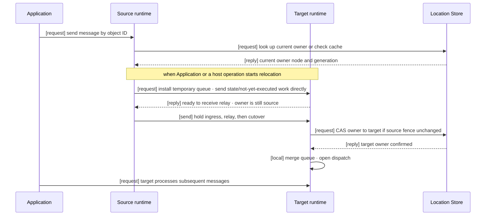

# Location And Relocation

[Spec table of contents](../README.en.md) · [Next: 01. Location Runtime](01-location-runtime.en.md)

## 1. What This Topic Covers

An Actor, or a [Spot](../00-foundation/02-glossary.en.md#spot) — a running target that
keeps receiving messages — must stay findable by the same ID even after it moves off
the node currently running it. This topic covers both how the framework finds that
location and how it changes the processing node for planned reasons.

It covers two things.

- **Location** — how the framework finds which node currently handles a given
  Actor, Spot, or server. The [Location Store](../00-foundation/02-glossary.en.md#location-store)
  holds owner, [ObjectGeneration](../00-foundation/02-glossary.en.md#objectgeneration), and
  membership, and the [Relocation Store](../00-foundation/02-glossary.en.md#relocation-store) —
  which stores only the Instance Spot's initial creation information and the results
  of requests that complete after relocation — holds those values.
- **Relocation** — how the stateful workload of one Actor/Spot, or of an entire
  host, is moved to another node on purpose. Owner, queue, and the bound Session
  route all change while the object keeps accepting messages.

What this topic doesn't define is listed in §7.

## 2. Who Decides What

| Participant | Decides / owns |
|---|---|
| Application | Calls Host `Relocate`, or [`Shutdown`](../00-foundation/02-glossary.en.md#shutdown) — the host call that blocks new admission and proceeds with termination — or registers an Actor Join. Provides a relocation adapter when state must be preserved. Doesn't directly manage the target node, Store version, or cutover control messages. |
| Source runtime | Finishes the current turn and stops new dispatch. Sends state, not-yet-executed work, and timers directly to the target, and keeps them in memory until confirmed. Doesn't change the Location Store owner. |
| Target runtime | Prepares the temporary queue first, then creates and restores the object. Runs the Location Store CAS only after preparation finishes, and opens the queue only on success. |
| Session owner | Keeps the bound Actor's physical Session. Seals the binding during relocation, changes the route after cutover, then releases the seal. Detailed responsibility is owned by [Session and Actor Binding "8. The Session's Responsibility During Actor Relocation"](../04-session/02-session-actor-binding.en.md#8-the-sessions-responsibility-during-actor-relocation). |
| Location Store | Stores current owner, object generation, and membership. Applies the target's requested values in one step only when the expected source values still match. |
| Relocation Store | Holds only the Instance Spot cold activation's first message and creation information, and the results of a pending request that completes after relocation. Doesn't decide owner. |

## 3. One Flow, At A Glance

This diagram shows only the normal path. Each step's conditions, failures, and
timeouts are defined by the documents in §4.

## 4. Documents In This Topic

| Document | Covers | Layer |
|---|---|---|
| [01. Location Runtime](01-location-runtime.en.md) | Location Store/Relocation Store usage order, the generation scheme, Redis record interoperability | Contract |
| [02. Location Store (Redis)](02-location-store-redis.en.md) | Location Store provider SPI and the official Redis implementation | Contract + Implementation Spec |
| [03. Relocation Store (Redis)](03-relocation-store-redis.en.md) | Relocation Store provider SPI and the official Redis implementation | Contract + Implementation Spec |
| [04. Complete Actor And Spot Relocation Flow](04-relocation-flow.en.md) | The single handoff protocol for moving one Actor/Spot — owner switch, message processing order, and failure rules | Contract + Implementation Spec |
| [05. Complete Host Relocation Flow](05-host-relocation-flow.en.md) | How Host `Relocate`/`Shutdown` applies the flow from 04 to multiple units, coordinated at the host level | Contract |
| [06. Failure Handling And Failover Scope](06-failure-failover-policy.en.md) | The scope in which the framework automatically continues the same work on failure | Contract |

## 5. Find By Question

| Question | Section with the answer |
|---|---|
| How does the framework find an object's current location | [01. Location Runtime](01-location-runtime.en.md)'s overview |
| What does each of the Location Store and Relocation Store own | [01. Location Runtime](01-location-runtime.en.md)'s roles and responsibilities section |
| What must a direct implementation of the Location Store/Relocation Store guarantee | [02. Location Store (Redis)](02-location-store-redis.en.md) · [03. Relocation Store (Redis)](03-relocation-store-redis.en.md) |
| How is an object re-created with the same ID distinguished from an object with a changed owner | [01. Location Runtime](01-location-runtime.en.md)'s re-creation vs. owner-change section |
| What is the normal order for moving an Actor/Spot to another node | [04. Complete Actor And Spot Relocation Flow "4. Normal Processing Order"](04-relocation-flow.en.md#4-normal-processing-order) |
| Where do messages go during the move, and when does completion happen after the move | [04. Complete Actor And Spot Relocation Flow "5. Message Order And Completion Meaning"](04-relocation-flow.en.md#5-message-order-and-completion-meaning) · ["6. Location Store Transition Contract"](04-relocation-flow.en.md#6-location-store-transition-contract) |
| What remains on failure, and how far does automatic continuation go | [04. Complete Actor And Spot Relocation Flow "9. Timeout, Failure, And Cancellation"](04-relocation-flow.en.md#9-timeout-failure-and-cancellation) · [06. Failure Handling And Failover Scope](06-failure-failover-policy.en.md) |
| What happens to a session connected to an Actor during that Actor's relocation | [04. Complete Actor And Spot Relocation Flow "7. Session During Actor Relocation"](04-relocation-flow.en.md#7-session-during-actor-relocation) → [Session and Actor Binding "8"](../04-session/02-session-actor-binding.en.md#8-the-sessions-responsibility-during-actor-relocation) |
| How does Host maintenance (a planned move of an entire host) differ from moving individual Actors | [05. Complete Host Relocation Flow](05-host-relocation-flow.en.md) |
| What are the limits (chunk size, in-flight budget, page size, timeout values) | Each document's numbers section, and [01. Location Runtime](01-location-runtime.en.md)'s roles and responsibilities section |
| What stops when the Store connection drops or doesn't respond | [01. Location Runtime](01-location-runtime.en.md)'s Store connection blocking section · [06. Failure Handling And Failover Scope "7. Store Failure"](06-failure-failover-policy.en.md#7-store-failure) |

## 6. Reading Order

**Developer reading this for the first time**

1. Read §1–§3 of this document to get the whole picture.
2. Read [01. Location Runtime](01-location-runtime.en.md)'s overview and roles
   section for what each of the two Stores is responsible for.
3. Read §1–§4 of [04. Complete Actor And Spot Relocation Flow](04-relocation-flow.en.md)
   for the normal handoff sequence.

**Developer porting to a new language** — the normal processing order and
verification requirements sections of
[04. Complete Actor And Spot Relocation Flow](04-relocation-flow.en.md) hold the
rules every runtime must follow with the same structure. The provider SPI and
official Redis key formats in [02](02-location-store-redis.en.md) and
[03](03-relocation-store-redis.en.md) are required reading when implementing a new
provider backed by a different store.

**Operator/SRE** — read [05. Complete Host Relocation Flow](05-host-relocation-flow.en.md)
for the `Relocate`/`Shutdown` call sequence and completion results, and
[06. Failure Handling And Failover Scope](06-failure-failover-policy.en.md) for the
scope of automatic handling on failure.

## 7. What This Topic Doesn't Define

- **Session owner responsibility** — keeping the physical Session connection alive
  during Actor relocation, installing and releasing the seal, and changing the
  binding route is owned by [Session and Actor Binding "8. The Session's Responsibility During Actor Relocation"](../04-session/02-session-actor-binding.en.md#8-the-sessions-responsibility-during-actor-relocation).
  Documents in this topic only describe and link to what they ask the Session owner
  to do at that boundary.
- **Actor/Spot membership and lifecycle** — the general rules for Actor Join, Spot
  creation, and membership changes — governed by
  [Actor membership](../00-foundation/02-glossary.en.md#actor-membership), the
  relationship showing which Spot an Actor belongs to — are owned by the
  [Spot And Actor Membership](../03-spot-actor/05-spot-actor-membership.en.md)
  document. This topic covers only the points where relocation meets those rules.
- **Definition of runtime observability surfaces** — metric names, event shapes,
  and the tracing contract are owned by the observability topic's documents. This
  topic only mentions the metric names and firing points that become observation
  targets.

---

[Spec table of contents](../README.en.md) · [Next: 01. Location Runtime](01-location-runtime.en.md)
