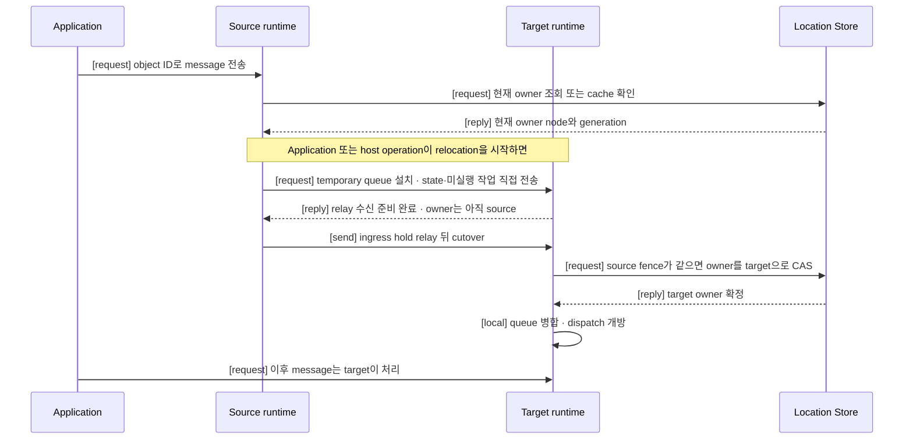

# Location과 Relocation

[스펙 목차](../README.ko.md) · [다음: 01. Location runtime](01-location-runtime.ko.md)

## 1. 무엇을 다루는가

Actor와, message를 계속 받는 실행 대상인 [Spot](../00-foundation/02-glossary.ko.md#spot)은
실행 중인 node를 벗어나서도 같은 ID로 계속 찾을 수 있어야 한다. 이 주제는
그 위치를 찾는 방법과, 계획된 이유로 처리 node를 바꾸는 방법을 함께 다룬다.

두 가지를 다룬다.

- **Location** — Framework가 지금 어느 node가 어떤 Actor·Spot·server를 처리하는지 찾는
  방법. [Location Store](../00-foundation/02-glossary.ko.md#location-store)가 owner, [ObjectGeneration](../00-foundation/02-glossary.ko.md#objectgeneration)과
  membership을 보관하고, Instance Spot 최초 생성 정보와 relocation 뒤 완료되는 request의
  결과만 저장하는 [Relocation Store](../00-foundation/02-glossary.ko.md#relocation-store)가
  그 값을 보관한다.
- **Relocation** — Actor·Spot 하나 또는 host 전체의 stateful workload를 계획적으로 다른
  node로 옮기는 방법. Message를 계속 받아들이면서 owner, queue와 bound Session route를
  바꾼다.

다루지 않는 것은 §7에 정리한다.

## 2. 누가 무엇을 결정하는가

| 주체 | 결정·소유하는 것 |
|---|---|
| Application | Host `Relocate`나, 새 admission을 막고 종료를 진행하는 host 호출인 [`Shutdown`](../00-foundation/02-glossary.ko.md#shutdown)을 호출하거나 Actor Join을 등록한다. State 보존이 필요하면 relocation adapter를 제공한다. Target node, Store version이나 전환 제어 message를 직접 관리하지 않는다. |
| Source runtime | 현재 turn을 끝내고 새 dispatch를 중단한다. State·미실행 작업·timer를 target에 직접 전송하고, 확정 전까지 memory에 유지한다. Location Store owner는 바꾸지 않는다. |
| Target runtime | Temporary queue를 먼저 준비하고 object를 생성·복원한다. 준비가 끝난 뒤에만 Location Store CAS를 실행하고, 성공한 경우에만 queue를 연다. |
| Session owner | Bound Actor의 physical Session을 유지한다. Relocation 중 binding을 seal하고, 전환 뒤 route를 바꾸고 seal을 해제한다. 자세한 책임은 [Session과 Actor binding 「8. Actor relocation 중 Session의 책임」](../04-session/02-session-actor-binding.ko.md#8-actor-relocation-중-session의-책임)이 소유한다. |
| Location Store | 현재 owner, object generation과 membership을 보관한다. 예상한 source 값이 그대로일 때만 target이 요청한 값을 한 번에 반영한다. |
| Relocation Store | Instance Spot cold activation의 최초 message·생성 정보와, relocation 뒤 완료되는 pending request의 결과만 보관한다. Owner는 결정하지 않는다. |

## 3. 한 흐름으로 보기

이 그림은 정상 경로 하나만 보여준다. 각 단계의 조건, 실패와 timeout은 §4의 문서가
정의한다.

## 4. 이 주제의 문서

| 문서 | 다루는 것 | 층 |
|---|---|---|
| [01. Location runtime](01-location-runtime.ko.md) | Location Store·Relocation Store 사용 순서, generation 체계, Redis record 상호운용 | 계약 |
| [02. Location Store (Redis)](02-location-store-redis.ko.md) | Location Store provider SPI와 공식 Redis 구현 | 계약 + 구현 스펙 |
| [03. Relocation Store (Redis)](03-relocation-store-redis.ko.md) | Relocation Store provider SPI와 공식 Redis 구현 | 계약 + 구현 스펙 |
| [04. Actor와 Spot relocation 전체 흐름](04-relocation-flow.ko.md) | Actor·Spot 하나를 옮기는 단일 handoff 프로토콜 — owner 전환, message 처리 순서와 실패 규칙 | 계약 + 구현 스펙 |
| [05. Host relocation 전체 흐름](05-host-relocation-flow.ko.md) | Host `Relocate`·`Shutdown`이 여러 unit에 04의 흐름을 적용하는 host 단위 조율 | 계약 |
| [06. 장애 대응과 failover 범위](06-failure-failover-policy.ko.md) | 장애 시 Framework가 같은 작업을 자동으로 계속하는 범위 | 계약 |

## 5. 질문으로 찾기

| 질문 | 답이 있는 절 |
|---|---|
| Framework는 object의 현재 위치를 어떻게 찾는가 | [01. Location runtime](01-location-runtime.ko.md)의 개요 |
| Location Store와 Relocation Store는 각각 무엇을 책임지는가 | [01. Location runtime](01-location-runtime.ko.md)의 역할과 책임 절 |
| Location Store·Relocation Store를 직접 구현하려면 무엇을 보장해야 하는가 | [02. Location Store (Redis)](02-location-store-redis.ko.md) · [03. Relocation Store (Redis)](03-relocation-store-redis.ko.md) |
| 같은 ID로 다시 만든 object와 owner가 바뀐 object는 어떻게 구분하는가 | [01. Location runtime](01-location-runtime.ko.md)의 재생성·owner 변경 구분 절 |
| Actor·Spot을 다른 node로 옮기는 정상 순서는 무엇인가 | [04. Actor와 Spot relocation 전체 흐름 「4. 정상 처리 순서」](04-relocation-flow.ko.md#4-정상-처리-순서) |
| 이동 중 message는 어디로 가는가, 이동 뒤 완료는 언제인가 | [04. Actor와 Spot relocation 전체 흐름 「5. Message 순서와 완료 의미」](04-relocation-flow.ko.md#5-message-순서와-완료-의미) · [「6. Location Store 전환 계약」](04-relocation-flow.ko.md#6-location-store-전환-계약) |
| 실패하면 무엇이 남고, 자동으로 어디까지 계속하는가 | [04. Actor와 Spot relocation 전체 흐름 「9. Timeout, failure와 cancellation」](04-relocation-flow.ko.md#9-timeout-failure와-cancellation) · [06. 장애 대응과 failover 범위](06-failure-failover-policy.ko.md) |
| Actor relocation 중 그 Actor에 연결된 session은 어떻게 되는가 | [04. Actor와 Spot relocation 전체 흐름 「7. Actor relocation 중 Session」](04-relocation-flow.ko.md#7-actor-relocation-중-session) → [Session과 Actor binding 「8」](../04-session/02-session-actor-binding.ko.md#8-actor-relocation-중-session의-책임) |
| Host maintenance(계획된 host 전체 이동)는 개별 Actor 이동과 무엇이 다른가 | [05. Host relocation 전체 흐름](05-host-relocation-flow.ko.md) |
| 제한은 무엇인가(chunk 크기, in-flight budget, 페이지 크기, timeout 값들) | 각 문서의 수치 절, [01. Location runtime](01-location-runtime.ko.md)의 역할과 책임 절 |
| Store 연결이 끊기거나 응답을 못 받으면 무엇이 멈추는가 | [01. Location runtime](01-location-runtime.ko.md)의 Store 연결 차단 절 · [06. 장애 대응과 failover 범위 「7. Store 장애」](06-failure-failover-policy.ko.md#7-store-장애) |

## 6. 읽는 순서

**처음 읽는 개발자**

1. 이 문서 §1~§3으로 전체 그림을 잡는다.
2. [01. Location runtime](01-location-runtime.ko.md)의 개요와 역할 절로 두 Store의 책임을
   읽는다.
3. [04. Actor와 Spot relocation 전체 흐름](04-relocation-flow.ko.md)의 §1~§4로 handoff의
   정상 순서를 읽는다.

**새 언어로 porting하는 개발자** — [04. Actor와 Spot relocation 전체 흐름](04-relocation-flow.ko.md)의
정상 처리 순서와 검증 요구 절이 모든 runtime이 같은 구조로 따라야 하는 규칙을 담는다.
[02](02-location-store-redis.ko.md)·[03](03-relocation-store-redis.ko.md)의 provider SPI와
공식 Redis key 형식은 다른 저장소로 provider를 새로 구현할 때 반드시 읽는다.

**운영자·SRE** — [05. Host relocation 전체 흐름](05-host-relocation-flow.ko.md)으로 `Relocate`·`Shutdown`
호출 순서와 완료 결과를, [06. 장애 대응과 failover 범위](06-failure-failover-policy.ko.md)로 장애
시 자동 처리 범위를 읽는다.

## 7. 이 주제가 정의하지 않는 것

- **Session owner의 책임** — Actor relocation 중 physical Session connection을 유지하고, seal을
  설치·해제하고, binding route를 바꾸는 동작은 [Session과 Actor binding 「8. Actor relocation 중
  Session의 책임」](../04-session/02-session-actor-binding.ko.md#8-actor-relocation-중-session의-책임)이
  소유한다. 이 주제의 문서는 그 경계에서 Session owner에 무엇을 요청하는지만 서술하고 링크한다.
- **Actor·Spot membership과 lifecycle** — Actor가 어느 Spot에 속하는지 나타내는 관계인
  [Actor membership](../00-foundation/02-glossary.ko.md#actor-membership)의 일반 규칙(Actor
  Join, Spot 생성과 membership 변경)은 [Spot과 Actor membership](../03-spot-actor/05-spot-actor-membership.ko.md)
  문서가 소유한다. 이 주제는 relocation이 그 규칙과 만나는 지점만 다룬다.
- **Runtime 관측 표면의 정의** — Metric 이름, event 구조와 tracing 계약은 관측 주제 문서가
  소유한다. 이 주제는 관측 대상이 되는 지표 이름과 발생 시점만 언급한다.

---

[스펙 목차](../README.ko.md) · [다음: 01. Location runtime](01-location-runtime.ko.md)
