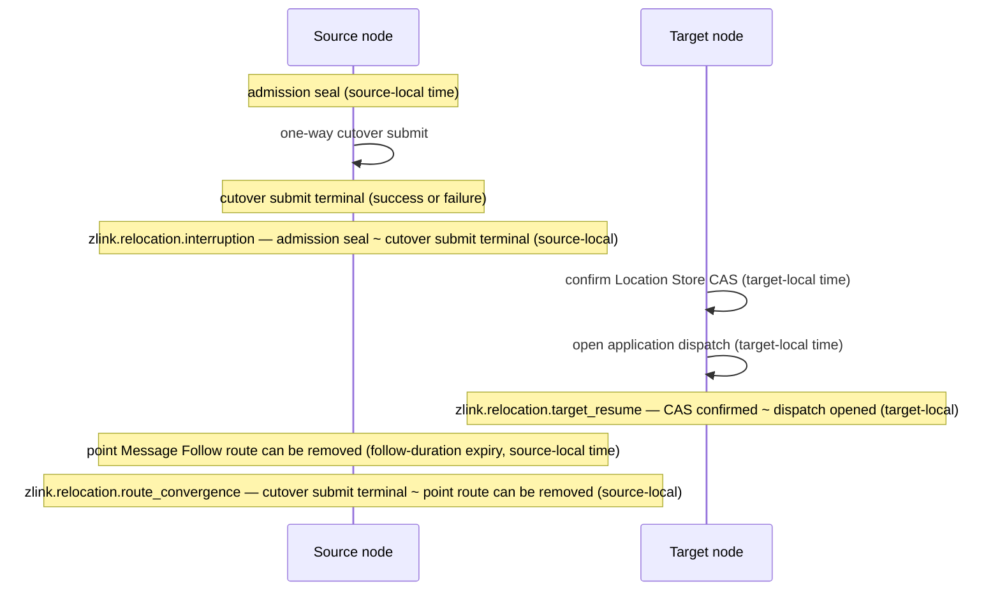

# Runtime Metrics And Aggregation Rules

[Observability topic table of contents](README.en.md) · [Spec table of contents](../README.en.md) · [Previous: 01. Runtime Status Query And Operational Diagnostics](01-runtime-monitoring.en.md) · [Next: 03. Message Flow Tracing](03-message-flow-tracing.en.md)

> Defines the name, kind, unit, and label of the metrics aggregating
> throughput, wait, failure, and current counts over time. The ownership
> boundary with other documents in this topic follows the
> [Observability responsibility map](README.en.md).

## 1. Metric Contract Overview

Defines the name, kind, unit, and label of the metrics aggregating the
framework's throughput, wait, failure, and current counts. Since every
language records values under the same contract, a single dashboard and
alert rule set can be shared.

The current complete state of runtime and topology is owned by
[Runtime Status Query And Operational Diagnostics](01-runtime-monitoring.en.md);
the progress record of one message is owned by
[Message Flow Tracing](03-message-flow-tracing.en.md); individual host
operation results are owned by
[Host Relocation And Shutdown](../05-location-relocation/05-host-relocation-flow.en.md). See the
[topic README](README.en.md) for the complete ownership map.

| Party | Responsibility |
|---|---|
| Application | Configures the standard metric provider and builds dashboards and alerts from collected values. |
| Framework | Records values under this document's name/kind/unit/label and doesn't change message processing order. |
| Provider | Decides collection interval, histogram bucket, aggregation, exporter, and backend. |

The value space of a label must not grow in proportion to application
object or message count. Exporter, registry, storage, histogram bucket,
and backend aren't part of the framework's public contract.

## 2. Naming And Aggregation Rules

In the metric tables, `counter` monotonically increases occurrence count or
a cumulative amount, `updown` records the delta when a current count goes
up or down, `observable` reads the current value at the moment the
provider collects, and `histogram` records a per-operation measured value
as a distribution.

- **Instrument names use the format `zlink.<surface>.<name>`, lowercase
  dotted ASCII.** Name, label key, and allowed label value are
  byte-identical across every language — so a single dashboard/alert rule
  set can be reused regardless of language.
- Time histograms use seconds (`s`); byte-size uses `By`; everything else
  uses a count unit wrapped in braces.
- **Provider failure doesn't change application callback, reply, new-work
  acceptance, or host lifecycle results.**

## 3. Host Core HWM And Application Job Queue

The following instance-aggregate instruments read the Core runtime snapshot
and [application job queue](../00-foundation/02-glossary.en.md#application-job-queue)
accounting. The application job queue is the shared permit resource a
framework host instance holds until an application callback starts. They
don't walk queues or handlers to collect metrics.

| Instrument | Kind | Unit | Label | Meaning |
|---|---|---|---|---|
| `zlink.host.core_hwm.effective_budget` | observable | `By` | none | Effective budget Core fixed at startup. |
| `zlink.host.core_hwm.applied` | observable | `By` | none | Sum of ordinary directional queue HWMs, excluding completion. |
| `zlink.host.core_hwm.accounted` | observable | `By` | `state` | Core current or epoch-peak accounted bytes. |
| `zlink.host.core_hwm.completion_accounted` | observable | `By` | `state` | Completion current or epoch-peak accounted bytes. |
| `zlink.host.core_hwm.blocked_ratio` | observable | `{ppm}` | none | Blocked ratio from the Core snapshot. |
| `zlink.host.application_job_queue.limit` | observable | `{job}` | none | Effective maximum fixed at startup. |
| `zlink.host.application_job_queue.jobs` | observable | `{job}` | `state` | Aggregate by `reserved|queued|in_use|peak`. |
| `zlink.host.application_job_queue.capacity_waiters` | observable | `{waiter}` | none | Current capacity waiters. |
| `zlink.host.application_job_queue.capacity_waits` | counter | `{wait}` | none | Capacity waits in the current epoch. |
| `zlink.host.application_job_queue.capacity_wait_duration` | counter | `s` | none | Cumulative capacity-wait duration in the current epoch. |
| `zlink.host.application_job_queue.pressure_state` | observable | `{state}` | `state` | Observes exactly one current `running` or `paused` series with value `1`. |
| `zlink.host.application_job_queue.pressure_transitions` | counter | `{transition}` | `state` | Transitions into the labeled `running` or `paused` state in the current epoch. |
| `zlink.host.application_job_queue.pause_duration` | observable | `s` | `state` | Pause time selected by `current` or `cumulative`. |
| `zlink.host.application_job_queue.flow_state_config_failures` | counter | `{failure}` | none | Failures to apply an absolute Core flow state in the current epoch. |

**Reset preserves current gauges, including pressure state and current
pause duration, rebases peak to current, and clears epoch counters and
cumulative values, including transitions, cumulative pause duration, and
configuration failures.** If it's already `paused` at reset time,
cumulative pause duration starts accumulating again from that point as the
new epoch's start. This measurement-epoch concept is observed as-is by
[Runtime Monitoring §4](01-runtime-monitoring.en.md#4-the-capacity-fields-of-host-status)'s
Host status capacity fields at query time, and this document owns the
meaning of epoch and Reset.

**Always-on metrics don't timestamp every job or create a per-job
queue-wait histogram.** The name identifying a physical connection group,
[`MeshName`](../00-foundation/02-glossary.en.md#meshname); the name
identifying a Channel, [`ChannelName`](../00-foundation/02-glossary.en.md#channelname);
Actor ID; the global logical address of a
[Spot](../00-foundation/02-glossary.en.md#spot),
[Spot ID](../00-foundation/02-glossary.en.md#spot-id); session ID, RID,
endpoint, packet name, and owner aren't used as labels.

## 4. Peer And Channel

The runtime unit that provides peer connections and Channel messaging
within one process is called a [MeshNode](../00-foundation/02-glossary.en.md#meshnode).
The logical runtime where multiple MeshNodes share the same messaging
rules is called a [RouteMesh](../00-foundation/02-glossary.en.md#routemesh).
RouteMesh registers under a MeshName, and Channel registers under a
ChannelName, both at startup. The action by which the
framework selects one member among those satisfying the condition is
called [select-one](../00-foundation/02-glossary.en.md#select-one).

Only a peer or member in the [Ready state](../00-foundation/02-glossary.en.md#ready) —
satisfying every per-feature serving condition — is included in a ready
instrument. The
[MeshNode descriptor](../00-foundation/02-glossary.en.md#meshnode-descriptor) a remote
MeshNode publishes to announce its identity, endpoint, Channel
participation info, and state is the basis for configured-peer
aggregation.

| Instrument | Kind | Unit | Label | Meaning |
|---|---|---|---|---|
| `zlink.mesh_node.peers.configured` | observable | `{peer}` | `mesh_name`, `source` | Provides the number of peers currently present in the descriptor. |
| `zlink.mesh_node.peers.connected` | observable | `{peer}` | `mesh_name`, `source` | Provides the number of peers currently transport-connected. |
| `zlink.mesh_node.peers.ready` | observable | `{peer}` | `mesh_name`, `source` | Provides the number of peers that passed the new-work-acceptance condition and handler readiness. |
| `zlink.mesh_node.channels.ready_members` | observable | `{member}` | `mesh_name`, `channel_name` | Provides the number of members usable for select-one. |
| `zlink.mesh_node.channel.selection_failures` | counter | `{failure}` | `mesh_name`, `channel_name`, `reason` | Accumulates the count of times an operation couldn't start because no member was available for select-one. |
| `zlink.mesh_node.requests.inflight` | updown | `{request}` | `mesh_name`, `surface` | Provides the number of requests currently waiting for a reply. |
| `zlink.mesh_node.request.duration` | histogram | `s` | `mesh_name`, `surface`, `outcome` | Records the request time from submit to terminal completion. |
| `zlink.mesh_node.request.timeouts` | counter | `{request}` | `mesh_name`, `surface` | Accumulates the count of request timeouts. |

| Label | Value |
|---|---|
| `source` | `manual`, `redis`, `manual_and_redis` |
| Selection failure `reason` | `no_member`, `not_ready`, `draining` |
| `surface` | `node`, `channel`, `spot`, `instance_spot`, `actor` |

## 5. One-Way Message Drop

A call that doesn't build a reply and separates send completion from
remote handler completion is called
[one-way](../00-foundation/02-glossary.en.md#submitted). **This section only records a
count when the framework can confirm the cause of failing to deliver to
the remote handler.** `message_kind` is an allowed value of
[message kind](../00-foundation/02-glossary.en.md#message-kind), distinguishing call
kinds like send/request/publish within the handler namespace.

| Instrument | Kind | Unit | Label | Meaning |
|---|---|---|---|---|
| `zlink.mesh_node.messages.dropped` | counter | `{message}` | `mesh_name`, `surface`, `message_kind`, `reason` | Accumulates the count of one-way drops whose cause the framework confirmed. |

Message drop `reason` is
`no_handler|decode_error|backpressure|stale_target|shutdown`. Here
`backpressure` means the [state](../00-foundation/02-glossary.en.md#backpressured) where
the send path or queue's capacity is temporarily insufficient.

[Logical Multicast](../00-foundation/02-glossary.en.md#logical-multicast), which fixes a
Spot member list and sends to every target, and
[classic fanout](../00-foundation/02-glossary.en.md#classic-fanout) publish, which sends
events via a separate PUB/SUB connection, are excluded. A per-target
metric also isn't created.

## 6. Object Count, Capacity, And Relocation Instruments

This section aggregates the current count and capacity of Spots and the
Actors processing application messages within them, plus relocation and
STREAM connection instruments. The connection unit where one client and
server share a byte stream is a
[STREAM session](../00-foundation/02-glossary.en.md#stream-session).

The method of re-creating or storing and restoring application state when
continuing to run an Actor or Spot on a different node is called a
[relocation policy](../00-foundation/02-glossary.en.md#relocation-policy). The MeshNode
that actually runs an Actor/Spot and manages its application queue is
called the [owner](../00-foundation/02-glossary.en.md#owner). Capacity aggregation uses
the confirmed value from the
[Location Store](../00-foundation/02-glossary.en.md#location-store), which holds the
reference record for judging the current owner and location.

**`zlink.spot.count` and `zlink.actor.count` count how many this MeshNode
is currently running, while `zlink.object.capacity.*` and
`zlink.spot.type.capacity.*` read the population the Location Store
confirmed.** These two instruments have different aggregation boundaries
and don't substitute for each other — their values can differ.
[Spot kind](../00-foundation/02-glossary.en.md#spot-kind), representing the Spot's kind,
and [stable type](../00-foundation/02-glossary.en.md#stable-type), the type identity
that doesn't change after startup registration, are only used in labels
as registered values. A Spot the framework can create on the first call
by ID is called an
[Instance Spot](../00-foundation/02-glossary.en.md#entry-user-instance-spot).

| Instrument | Kind | Unit | Label | Meaning |
|---|---|---|---|---|
| `zlink.spot.count` | updown | `{spot}` | `mesh_name`, `spot_kind` | Provides the current Spot count. |
| `zlink.actor.count` | updown | `{actor}` | `mesh_name` | Provides the current Actor count. |
| `zlink.object.capacity.active` | observable | `{object}` | `mesh_name`, `capacity_scope` | Provides the active population count the Location Store confirmed. |
| `zlink.object.capacity.reserved` | observable | `{object}` | `mesh_name`, `capacity_scope` | Provides the population count a Location Store reservation secured. |
| `zlink.object.capacity.limit` | observable | `{object}` | `mesh_name`, `capacity_scope` | Provides the overall Actor or overall Spot limit; `0` means no limit. |
| `zlink.spot.type.capacity.active` | observable | `{spot}` | `mesh_name`, `spot_kind`, `stable_type` | Provides the active count of the registered Spot type. |
| `zlink.spot.type.capacity.reserved` | observable | `{spot}` | `mesh_name`, `spot_kind`, `stable_type` | Provides the reserved count of the registered Spot type. |
| `zlink.spot.type.capacity.limit` | observable | `{spot}` | `mesh_name`, `spot_kind`, `stable_type` | Provides the registered Spot type's limit; `0` means no separate limit. |
| `zlink.object.activation.active` | observable | `{activation}` | `mesh_name` | Provides the count currently running factory and initialization. |
| `zlink.object.activation.limit` | observable | `{activation}` | `mesh_name` | Provides the activation concurrency limit applied separately from population capacity. |
| `zlink.relocation.started` | counter | `{relocation}` | `mesh_name`, `object_kind`, `policy` | Accumulates the count of Actor/Instance Spot relocations started. |
| `zlink.relocation.completed` | counter | `{relocation}` | `mesh_name`, `object_kind`, `policy`, `outcome` | Accumulates relocation terminal results. |
| `zlink.relocation.duration` | histogram | `s` | `mesh_name`, `object_kind`, `policy`, `outcome` | Records the time from prepare to the terminal phase. |
| `zlink.relocation.bytes` | histogram | `By` | `mesh_name`, `object_kind`, `policy` | Records the size of the unchangeable relocation envelope. |
| `zlink.stream.connections.active` | updown | `{connection}` | `transport` | Provides the current STREAM session count. |
| `zlink.stream.connections.opened` | counter | `{connection}` | `transport` | Accumulates the count of STREAM sessions opened. |
| `zlink.stream.connections.closed` | counter | `{connection}` | `transport`, `close_reason` | Accumulates the count of STREAM sessions closed. |

| Label | Value and limit |
|---|---|
| `spot_kind` | `entry|user|instance` for regular Spot; `user|instance` for type capacity. |
| `capacity_scope` | `actor|spot`. An Actor inside an Entry Spot is included in `actor`. |
| `stable_type` | Only the stable type of a User/Instance Spot registered at startup with a limited count is used. |
| `object_kind` | `actor|user_spot|instance_spot` |
| `policy` | `recreate|snapshot` |
| Relocation `outcome` | `completed|aborted|failed|shutdown` |
| `transport` | One of the allowed values fixed at startup registration. |
| `close_reason` | `client_close|idle_timeout|heartbeat_timeout|server_shutdown|protocol_error|transport_error` |

## 7. Instance Spot Activation Instruments

Instance Spot adds the following instruments. `instance_spot_type` only
uses a type registered at startup with a limited count. The count and byte
count of messages in front of the
[activation barrier](../00-foundation/02-glossary.en.md#activation-barrier), which
blocks handler execution until Spot initialization and the first
message's storage finish, are also aggregated. The reference information
judging an Actor's or Spot's current location, owner, and generation is
called [authority](../00-foundation/02-glossary.en.md#authority). A claim conflict is
recorded when this reference information doesn't match the request's Spot
kind or stable type.

| Instrument | Kind | Unit | Label | Meaning |
|---|---|---|---|---|
| `zlink.instance_spot.activations` | counter | `{activation}` | `mesh_name`, `instance_spot_type`, `outcome` | Accumulates the result from owner claim through Ready or terminal failure. |
| `zlink.instance_spot.activation.duration` | histogram | `s` | `mesh_name`, `instance_spot_type`, `outcome` | Records the time from the first address resolve to the Ready state able to process messages, or terminal failure. |
| `zlink.instance_spot.pending.messages` | observable | `{message}` | `mesh_name`, `instance_spot_type` | Provides the number of messages waiting in front of the activation barrier. |
| `zlink.instance_spot.pending.bytes` | observable | `By` | `mesh_name`, `instance_spot_type` | Provides the payload bytes reserved in front of the activation barrier, holding the first message until the creation result is decided. |
| `zlink.instance_spot.claim.conflicts` | counter | `{claim}` | `mesh_name`, `instance_spot_type`, `reason` | Accumulates the count of conflicts between the currently valid authority, Spot kind, or stable type, and the request. |
| `zlink.instance_spot.takeovers` | counter | `{takeover}` | `mesh_name`, `instance_spot_type`, `outcome` | Accumulates the result of a caller claim replacing an expired owner row. |

Activation `outcome` only allows
`ready|rejected|conflict|timed_out|shutdown|store_failure|fenced`; claim
`reason` only allows `authority|spot_kind|spot_type|closing`; takeover
`outcome` only allows `claimed|lost|failed`.

## 8. Host Relocation And Shutdown

The procedure where a host stops accepting new work and cleans up
already-accepted work and resources is called
[drain](../00-foundation/02-glossary.en.md#drain). Host
[`Shutdown`](../00-foundation/02-glossary.en.md#shutdown) finishes this
cleanup and terminates the runtime and infrastructure. The action of
forwarding a message that arrives at the previous owner node, on behalf of
the new owner, after relocation commits is called
[Message Follow](../00-foundation/02-glossary.en.md#message-follow).

| Instrument | Kind | Unit | Label | Meaning |
|---|---|---|---|---|
| `zlink.host.state` | observable | `{runtime}` | `state` | Records value 1 for the single current framework runtime state. |
| `zlink.host.relocation.duration` | histogram | `s` | `mode`, `outcome` | Records the time from host `Relocate` start to a `Relocated` or `Blocked` result. |
| `zlink.host.relocation.blocked` | counter | `{operation}` | `mode`, `reason` | Accumulates the count of host `Relocate`s that ended `Blocked`. |
| `zlink.relocation.interruption` | histogram | `s` | `unit_kind`, optional `execution_mode` | Records the source-local time from one Actor/Instance Spot/User Spot unit's admission seal to the one-way cutover submit's success or failure terminal. `unit_kind` is `actor`, `instance_spot`, `user_spot`. Exceeding 1 second isn't turned into a relocation failure. |
| `zlink.relocation.target_resume` | histogram | `s` | `unit_kind` | Records the target-local time from the point the target confirmed one unit's Location Store CAS to the point it opened that unit's application dispatch. |
| `zlink.relocation.route_convergence` | histogram | `s` | `unit_kind` | Records the source-local time from one unit's cutover submit terminal to the point that unit's Message Follow route can be removed (based on follow-duration expiry). It's the basis for how long the source must keep the Message Follow route. |
| `zlink.relocation.cutover_timeout` | counter | `{fallback}` | `unit_kind` | Accumulates the count of times the cutover wait ran out and the target proceeded with the fallback Location Store CAS without verifying the completeness confirmation values. |
| `zlink.host.shutdown.duration` | histogram | `s` | `outcome` | Records the time from host `Shutdown` start to terminal result. |
| `zlink.host.shutdown.forced` | counter | `{operation}` | `reason` | Accumulates the count of host `Shutdown`s that forcibly ended remaining work to finish cleanup within the time limit. |

`state` is the 7 values
[Runtime Monitoring §3](01-runtime-monitoring.en.md#3-host-state--values-read-at-once)
defines: `preparing|serving|relocating|relocated|draining|stopped|error`.
Relocation `outcome` is `relocated|blocked`. Shutdown `outcome` is
`stopped|force_stopped`. Reason uses the identifiers from
[Host Relocation And Shutdown](../05-location-relocation/05-host-relocation-flow.en.md).

**The relocation interval instruments record three separate intervals, and
each interval is measured with exactly one node's local clock.** No metric
directly subtracts clocks of different nodes — a full interval crossing
nodes, such as from source seal to target dispatch opening, is observed
via same-flow correlation in
[Message Flow Tracing](03-message-flow-tracing.en.md). The relationship
between the three intervals is as follows.

- **The source-stopped interval** is from admission seal to cutover submit
  terminal, and it's the same interval `zlink.relocation.interruption`
  records. No separate instrument is added for it.
- **The target-resume interval** (`zlink.relocation.target_resume`) is
  measured by the target with its own clock and published as its own
  instrument.
- **The route-convergence interval** (`zlink.relocation.route_convergence`)
  is measured by the source with its own clock and published as its own
  instrument.

The [§10](#10-label-cardinality) rule of not distinguishing individual
relocations by label also applies to these instruments as-is. A non-zero
`zlink.relocation.cutover_timeout` means the fallback path that doesn't
guarantee relay ordering is actually being used in that deployment, so an
operator uses it as the basis for adjusting the cutover wait setting
(`RelocationCutoverWaitTimeout` in [Framework API](../00-foundation/06-framework-api.en.md)).

## 9. Location And Telemetry

The authority by which a framework host proves it can keep using the
current lifecycle's registration information and object ownership is the
[owner lease](../00-foundation/02-glossary.en.md#owner-lease), renewed on a fixed
schedule.

| Instrument | Kind | Unit | Label | Meaning |
|---|---|---|---|---|
| `zlink.location.store.errors` | counter | `{error}` | `operation` | Accumulates Redis read/write/lease failure counts. |
| `zlink.location.owner_lease.renew.failures` | counter | `{failure}` | `scope_kind`, `scope_name` | Accumulates owner lease renew failure counts. |
| `zlink.location.owner_lease.renew.lateness` | histogram | `s` | `scope_kind`, `scope_name` | Records how late an owner lease renew was relative to the scheduled time. |
| `zlink.observability.events.overflow` | counter | `{event}` | `source` | Accumulates overflow counts of the internal telemetry queue delivering runtime status and trace. |

`scope_kind` is `mesh|channel`. `scope_name` holds the corresponding
MeshName or ChannelName. `operation` is closed to the following 7 values —
`read|compare_exchange|relocation_put|relocation_get|relocation_delete|lease_renew|release`.
Logical Multicast and classic fanout publish aren't aggregated.

## 10. Label Cardinality

Labels only use startup registration values or values an enum allows.

The string distinguishing the kind of event a classic fanout subscriber
receives is called a [topic](../00-foundation/02-glossary.en.md#topic). Individual
object/connection/operation identities — including Spot ID — aren't used as
labels.

| Allowed | Forbidden |
|---|---|
| `mesh_name`, `channel_name`, `scope_kind`, `scope_name`, static `source`, `surface`, `message_kind`, `operation`, `outcome`, `reason`, `mode`, `object_kind`, `unit_kind`, `execution_mode`, `policy`, `spot_kind`, `capacity_scope`, registered `stable_type`, registered `instance_spot_type`, `transport`, `close_reason`, `state` | topic, Actor ID, Spot ID, RID, endpoint, session ID, relocation ID, user ID, correlation ID, flow ID, application metadata value, application state format/version |

`MeshName`, `ChannelName`, and `scope_name` are only used when closed to
host registration values. A label isn't built from payload. Individual
Actor/Spot/message flows are checked via
[Message Flow Tracing](03-message-flow-tracing.en.md), not a metric.

## 11. Collection Boundary

Each language uses a standard meter or registry. The public API doesn't
configure exporter, reader, storage, or histogram bucket.

- **A path with metrics turned off doesn't copy payload or build a
  per-message label dictionary.**
- **A counter or updown update doesn't change dispatch ordering.**
- **An observable only reads a bounded aggregate value the runtime already
  maintains.** It doesn't walk every Actor/Spot, mailbox, or Location
  Store record to build a value.
- A counter, timestamp, or histogram isn't recorded per mailbox
  enqueue/dequeue or turn.
- The provider decides histogram bucket and aggregation.
- **A provider callback failure doesn't retroactively change the last
  normal collection result against a processing stage it already passed.**

## 12. Verification Requirements

The following is confirmed using only the public surface — instrument
name/kind/unit/label, and allowed label values. Each item leads to one
implementation or contract test.

**Name and unit**

- Instrument name, kind, unit, and allowed label value are the same across
  every language.
- No mailbox/Spot/Actor-queue or per-turn metric exists, and collection
  doesn't walk every object or Store record.

**Label**

- Topic, Actor ID, Spot ID, RID, endpoint, correlation ID, and flow ID
  don't appear in any metric label.

**Relocation and host lifecycle**

- Telemetry queue overflow and provider failure don't change dispatch or
  host lifecycle results.
- Host instruments and labels match the results in
  [Host Relocation And Shutdown](../05-location-relocation/05-host-relocation-flow.en.md).
- Relocation interval instruments are measured with each node's own local
  clock, and no metric directly subtracts clocks of different nodes.
  `zlink.relocation.cutover_timeout` matches the count of fallback CAS
  proceedings without verification.
- Instance activation is observed per registered type, excluding Spot
  ID/owner ID/generation from labels.
- An Instance one-way activation failure is a `surface=instance_spot`
  drop, and doesn't create a reply or replay.

**Public surface scope**

- Exporter, reader, storage, bucket, and metric event DTO don't appear in
  the public framework interface.

---

[Observability topic table of contents](README.en.md) · [Spec table of contents](../README.en.md) · [Previous: 01. Runtime Status Query And Operational Diagnostics](01-runtime-monitoring.en.md) · [Next: 03. Message Flow Tracing](03-message-flow-tracing.en.md)
