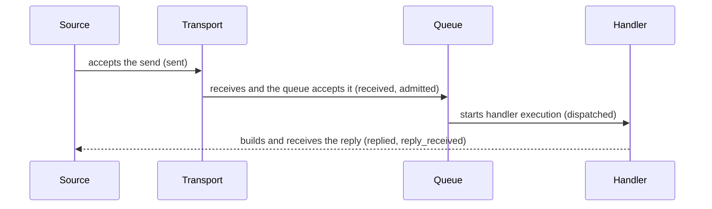

# Message Flow Tracing

[Observability topic table of contents](README.en.md) · [Spec table of contents](../README.en.md) · [Previous: 02. Runtime Metrics](02-runtime-metrics.en.md) · [Next: 04. Request Correlation](04-flow-correlation.en.md)

> Defines the per-message progress record (trace), its attributes, and its
> recording level. The ownership split among this topic's four documents
> follows
> [the topic table of contents "2. Documents In This Topic"](README.en.md#2-documents-in-this-topic).

## 1. What Can Be Confirmed

This document defines the contract for checking, via trace and structured
log, which processing stage one message reached in the framework and where
it failed. Node, Channel, [Spot](../00-foundation/02-glossary.en.md#spot) —
a logical target that receives messages — Actor, and STREAM use the same
stage names, processing result, and attribute names. This record doesn't change
existing message delivery and completion guarantees.

The application configures the record level, the ratio for sampling a
normal flow, and whether to record message byte size. The framework builds
a record at each processing boundary and delivers it to the standard
tracing and structured logging paths. A standard telemetry provider
exports records externally, but must not delay message processing or
change the result. The framework public interface doesn't expose an
exporter, storage, observer, or event DTO.

The creation/propagation/lifetime of
[reply correlation](../00-foundation/02-glossary.en.md#reply-correlation) — the
identifying information linking a request and reply to the same work — and
`flow_id` — indicating several messages continue from the same cause — are
defined by [04. Request Correlation](04-flow-correlation.en.md). This
document only defines the condition for including the two identifiers in
a record.

## 2. Which Processing Stages Are Recorded

The framework records a regular processing stage as `zlink.message_flow`.
If payload interpretation, handler, reply delivery path, or protocol
dispatch fails, it uses `zlink.dispatch_error`. Both `event_id` strings
are the same in every language.

### 2.1 Message Flow Stages

| `phase` | Processing boundary represented by this record |
|---|---|
| `received` | The message arrived at the framework's receive/dispatch boundary. |
| `admitted` | The target application queue accepted the message. |
| `dispatched` | The typed application handler started running. |
| `completed` | A one-way handler with no reply ended in a terminal state. |
| `replied` | A request handler built a response or error reply. |
| `sent` | The source's local transport accepted the outbound submission. |
| `reply_received` | The outbound request received a terminal reply. |
| `backpressured` | A [backpressure](../00-foundation/02-glossary.en.md#backpressured) state — insufficient send-path or queue capacity — occurred, or capacity wasn't secured by the time limit. |
| `dropped` | The message was excluded from delivery per policy. |



`sent` doesn't mean the remote handler received the message. `admitted`
also doesn't mean the handler finished running. A request only reaches
`reply_received` once the caller received the terminal reply.

[Logical Multicast](../00-foundation/02-glossary.en.md#logical-multicast), which
delivers a message to several Spots using
[ChannelName](../00-foundation/02-glossary.en.md#channelname) — identifying the logical
Channel scope — and [topic](../00-foundation/02-glossary.en.md#topic) — selecting a
receiving target within it — and
[Classic fanout](../00-foundation/02-glossary.en.md#classic-fanout), which delivers
events over a separate PUB/SUB path, don't confirm a per-subscriber
result. So neither method builds a message-flow trace.

### 2.2 The Public Behavior Recorded

The framework applies §2.1's stages at the following boundaries.

- Submit, receive, handler dispatch, and reply for
  [Node direct](../00-foundation/02-glossary.en.md#node-direct), which specifies one
  node by MeshName and target RID, and for
  [RouteMesh](../00-foundation/02-glossary.en.md#routemesh)/ClientServer Channel — RouteMesh
  being the scope in which multiple MeshNodes exchange node and Channel messages
- Application queue acceptance and handler completion for
  [Spot direct](../00-foundation/02-glossary.en.md#spot-direct), which sends a message
  by global Spot ID
- An Instance Spot's source lookup, creation-message submit, the target
  securing creation authority, the wait before opening application
  processing, application queue acceptance, and one-way drop
- Actor queue acceptance, handler completion, and relocation terminal
  result
- A [STREAM session](../00-foundation/02-glossary.en.md#stream-session)'s receive,
  Actor handler dispatch, reply, and send connected to the current
  session
- Request timeout, cancellation, runtime termination, and handler
  dispatch error

A wrapper and a transport don't duplicate the same terminal trace. A
request has exactly one terminal record per surface. Actor payload isn't
recorded as a Spot's handler dispatch stage.

## 3. Common Attributes

Every record uses the following closed values and inclusion conditions.
So records built in different languages can be searched and compared
under the same criteria.

### 3.1 Closed Values Shared by Every Language

The value indicating which processing method a message uses — send,
request, response, error, or control — is called
[message kind](../00-foundation/02-glossary.en.md#message-kind). The following values
must match, including case, in every language.

| Attribute | Allowed values |
|---|---|
| `surface` | `node`, `channel`, `spot`, `instance_spot`, `actor`, `stream`, `actor_relocation`, `classic_fanout` |
| `message_kind` | `send`, `request`, `response`, `error`, `control` |
| `outcome` | `succeeded`, `failed`, `backpressured`, `dropped`, `cancelled`, `shutdown` |
| `channel_route_kind` | `route_mesh`, `client_server` |
| `activation_state` | `activating`, `ready`, `closing` |

`shutdown` means the [state](../00-foundation/02-glossary.en.md#shutdown) where the
runtime is terminating and doesn't accept new operations.

When `zlink.message_flow` records the cause of a failure, backpressure,
or drop, `reason` is one of the following values.

`backpressure`, `stale_target`, `target_closed`, `shutdown`,
`location_unavailable`, `activation_rejected`, `activation_timeout`.

The last three values respectively mean that an Instance Spot's location
couldn't be found, new Spot creation was declined, or creation wasn't
finished within the time limit. Instance Spot close and lease fencing are
recorded as `target_closed`.

`zlink.dispatch_error` always uses `outcome=failed`. `reason` is one of
the following values.

`no_handler`, `decode_error`, `handler_exception`, `invalid_frame`,
`reply_path_missing`, `unexpected_reply`, `backpressure`, `stale_target`,
`shutdown`.

| `action` | The result of the framework handling the failure |
|---|---|
| `reply_error` | Sent an error reply to a request that had a reply delivery path. |
| `fail_caller` | Ended the local call as a terminal failure. |
| `drop` | Stopped processing a one-way operation with no reply. |

### 3.2 Attribute Inclusion Conditions

| Attribute | Inclusion condition and meaning |
|---|---|
| `event_id` | Included in every record. The value is `zlink.message_flow` or `zlink.dispatch_error`. |
| `timestamp` | Included in every record. The time the framework observed that boundary. |
| `phase` | Included in `zlink.message_flow`. |
| `surface`, `message_kind`, `outcome` | Included in every message-flow record. |
| `reason` | Included when there's a failure, backpressure, or drop cause. |
| `action` | Included in `zlink.dispatch_error`. |
| `channel_name` | Included when a logical Channel address exists. |
| `channel_route_kind` | Included only when `surface=channel`; not included for `classic_fanout`. |
| `mesh_name` | Included when there's a Node direct or RouteMesh scope. |
| `server_rid` | Included when a ClientServer target was selected. |
| `source_rid`, `target_rid` | Included when a routed hop has that identity. |
| `packet_name` | Included when there's a [packet name](../00-foundation/02-glossary.en.md#packet-name) used to find a typed handler. |
| `topic`, `spot_id`, `actor_id` | Included when that surface uses a logical target. |
| `instance_spot_type`, `activation_state` | Included when Instance Spot processing has that value. |
| `correlation_id` | Included when linking a request and terminal reply. |
| `flow_id`, `flow_origin` | Both included together when recording a message flow continuing from the same cause. |
| `message_size_bytes` | Only included if message size recording is on at `Detailed` level. |
| `duration_seconds` | Included when a terminal record for an operation or handler provides elapsed time. |

`channel_route_kind`, `mesh_name`, and `server_rid` aren't inputs for
finding a handler or selecting a target. A trace doesn't include payload,
application [metadata values](../00-foundation/02-glossary.en.md#metadata-snapshot),
native handle, raw frame, or an exception object. When recording an error
description as a string, it's limited to an implementation-defined maximum
length and doesn't include a secret or stack trace.

#### Structured Log Substitute Notation

An implementation providing a structured log as a substitute uses the
`zlink flow:` prefix and the following keys as-is.

`event`, `phase`, `surface`, `kind`, `mesh`, `channel`, `channel_route`,
`source_rid`, `target_rid`, `server_rid`, `packet`, `topic`, `spot`,
`instance_type`, `activation_state`, `actor`, `corr`, `flow`, `origin`,
`outcome`, `reason`, `size`.

Normal publish and subscriber delivery for Logical Multicast and Classic
fanout don't build a `zlink.message_flow` record. If local dispatch at a
Classic fanout subscriber has no handler, the subscriber process records
`zlink.dispatch_error` with `surface=classic_fanout`, `message_kind=send`,
`outcome=failed`, `reason=no_handler`, and `action=drop` through its
logger provider. That record has no `channel_route_kind` and isn't
returned as a per-publisher delivery result.

## 4. How the Application Sets the Recording Scope — Level and Sampling

The application sets the diagnostics level to one of four values.

| Level | Scope the framework records |
|---|---|
| `Off` | Doesn't record message flow or dispatch error. |
| `Errors` | Only records dispatch error, backpressure, and drop. |
| `Normal` | Records errors and §2.1's main stages. |
| `Detailed` | Can add message byte size and terminal elapsed time to `Normal` records. |

The default is `Errors`. The message size setting only adds byte size,
not payload content. Diagnostics level doesn't turn off metric recording.

Sampling rate is the ratio of normal flows to record, in the range
`0.0..1.0`. A value outside the range is treated as a startup or public
argument error. The framework selects normal flows using a hash of
`flow_id`, so every hop of the same flow is either all recorded or all
excluded. `zlink.dispatch_error`, `backpressured`, and `dropped` aren't
sampled. With no `flow_id`, whether to record is decided by the
generation and local sequence of the source
[MeshNode](../00-foundation/02-glossary.en.md#meshnode) — the runtime
node that participates in RouteMesh to send or receive messages.

The following C# is a non-normative excerpt explaining the common
behavior. It doesn't require the same signature in other languages, and
the precise .NET declaration is defined by
[.NET Topology Monitoring](../languages/dotnet/interfaces/10-topology-monitoring.en.md).

```csharp
public interface IZLinkDiagnosticsOptions
{
    IZLinkDiagnosticsOptions SetLevel(ZLinkDiagnosticsLevel level);
    IZLinkDiagnosticsOptions SetSampleRate(double rate);
    IZLinkDiagnosticsOptions IncludeMessageSizes(bool include);
}
```

```csharp
options.ConfigureDispatch().Diagnostics
    .SetLevel(ZLinkDiagnosticsLevel.Normal) // records errors and the main processing boundaries.
    .SetSampleRate(0.1)                     // selects each normal flow as a whole and records only 10%.
    .IncludeMessageSizes(false);            // records neither payload content nor byte size.
```

Public configuration only provides level, sampling rate, and whether to
include message size. Exporter, logger provider, and storage backend are
owned by standard telemetry configuration.

## 5. Changing the Record Level at Runtime and the Cost Rule

The application can change diagnostics level without restarting the
process. The level specified at startup is the initial value, and a
runtime change applies to all Node, Channel, Spot, Actor, and STREAM
processing in the process. A separate toggle per surface isn't
provided. Each language's public interface must provide runtime
control to read and change the process's current level.

The change must be an atomic state change that doesn't make message
processing wait. Each processing point checks the current level once
before building trace data. Processing points that observe the changed
level apply the new setting starting from there. A record already in the
telemetry queue before the change can be delivered or discarded. Turning
the level back on doesn't later build records for a previous processing
stage.

**At `Off`, the per-message hot path eliminates even the cost of building
a log message.** Beyond reading and branching on the current level, no
trace-only work happens.

- Doesn't build an event object or attribute collection.
- Doesn't assemble a string or collect timestamp and elapsed time.
- Doesn't copy payload and metadata or compute their size.
- Doesn't compute a sampling hash or trace-only `flow_id`.
- Doesn't build or format a structured log message.
- Doesn't build a telemetry queue item or internal delivery message, or
  put one on a queue.
- Doesn't call a logger, observer, exporter, or telemetry provider.

So an implementation that only blocks output at the log provider doesn't
satisfy the `Off` contract. It must exit at the first trace branch on the
message hot path, not right before the provider call.

**The per-message tracing hot path is wrapped in `if (enabled(outcome))`,
so it builds neither an event nor a lambda.** A rare transition, such as
failure or abort, only builds an event via a lazy form
(`trace(outcome, build)` / `traceLazy`), after the check passes. The lazy
form removes the `if` at the call site but still allocates one lambda
(C++ inlines it, so there's no allocation), so on the hot path even the
lazy form is wrapped in one more `if` to block even lambda creation. No
call site assembles a string before the gate.

**Language-specific discretion** — how the gate is expressed differs by
language. C++ uses a template lambda, .NET uses an interpolated-string
handler and `Func<>`, Java uses `Supplier<>`, Node uses a thunk. As long
as the observed result is the same — that when tracing is off, no string,
event, or lambda is built, so the cost is zero — the method is
discretionary. The criterion for this discretion is confirmation in the
call-site code that, after adding a new trace, the path builds no string,
event, or lambda while tracing is off.

## 6. Completion, Failure, and Lifetime

A trace's `sent`, `admitted`, handler completion, and reply receipt are
different completion boundaries. Whether the trace record itself
succeeded isn't part of a message operation's completion condition.
Timeout, cancellation, and shutdown decide the result per the original
message operation's contract — tracing doesn't add retry or route
re-selection. Tracing doesn't change routing, handler dispatch, or
lifecycle decisions.

A worker doesn't wait for a slow or failed telemetry provider. If a
bounded telemetry queue fills up, it can drop a normal trace and
increment `zlink.observability.events.overflow`. Provider failure isn't a
message operation failure.

An implementation logging a provider failure limits how many times the
same error is recorded. It doesn't call the same provider again to create
a trace for this log. Without a provider, it avoids an allocation made
just for the trace.

When the provider failure itself is recorded, the implementation uses the
application's fallback logger or process stderr, not the failed provider.
Failure of that fallback record also doesn't change the message-operation
result, dispatch, or lifecycle.

A trace attribute only includes the identifier needed for diagnosis, and
doesn't reference a caller buffer or runtime object after message
processing ends. The ownership and lifetime of `correlation_id`,
`flow_id`, and `flow_origin` follow
[04. Request Correlation](04-flow-correlation.en.md), and the three
values aren't used as a metric label.

An Instance Spot's one-way creation failure is recorded exactly once as
`surface=instance_spot`, `phase=dropped`, without building a hidden
request or replay.

## 7. Verification Requirements

The following is verified using only the public surface —
`event_id`, `phase`, `surface`/`message_kind`/`outcome`/`reason`/`action`,
attribute keys, and the diagnostics level/sampling rate configuration
interface. Each item corresponds to one contract test.

**Closed values and attributes**

- Every language uses the same `event_id`, phase, surface, message kind,
  outcome, reason, action, and attribute keys.
- Payload and application metadata values don't appear in trace or
  structured log.
- Logical Multicast and Classic fanout don't build a message-flow trace.
- A missing subscriber-local Classic fanout handler builds a dispatch
  error with `surface=classic_fanout`, `reason=no_handler`, and
  `action=drop`, without `channel_route_kind`.
- Each request surface records the terminal trace exactly once.
- An Instance Spot's one-way creation failure is recorded exactly once as
  `surface=instance_spot`, `phase=dropped`, without building a hidden
  request or replay.
- RouteMesh and ClientServer paths using the same ChannelName are
  distinguished by `channel_route_kind`, without requiring an application
  handler to provide this value.

**Level changes and the `Off` cost**

- Changing the level between `Off` and a different value at runtime
  applies the new level starting from processing points after the
  change.
- After turning tracing off at runtime, a new processing point doesn't
  add existing flow information to the context or outbound envelope, and
  turning it back on doesn't retroactively apply it to a processing stage
  that already passed.
- On a path that doesn't record because of the level or sampling, no
  payload or metadata appears in a trace or log. The allocation, queue and
  call-site cost conditions of the `Off` path are owned as internal check
  conditions by the rule paragraphs of §5.

**Provider and public interface**

- Telemetry provider failure doesn't change handler dispatch, reply, or
  lifecycle results.
- Exporter, storage, observer callback, runtime error sink, and raw event
  DTO don't appear in the public interface.

---

[Observability topic table of contents](README.en.md) · [Spec table of contents](../README.en.md) · [Previous: 02. Runtime Metrics](02-runtime-metrics.en.md) · [Next: 04. Request Correlation](04-flow-correlation.en.md)
