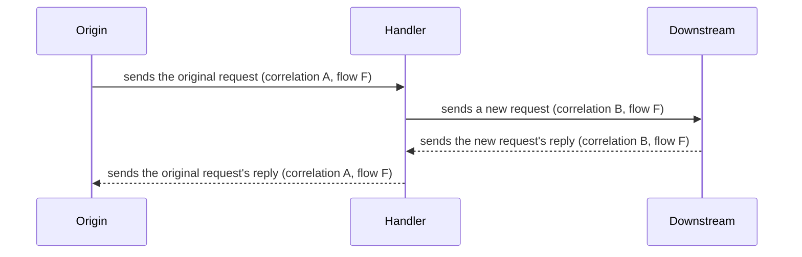

# Request Correlation And Business Flow Identification

[Observability topic table of contents](README.en.md) · [Spec table of contents](../README.en.md) · [Previous: 03. Message Flow Tracing](03-message-flow-tracing.en.md)

> Defines the creation, format, propagation, ownership, and lifetime of
> `correlation_id`, `flow_id`, and `flow_origin`. The ownership split among
> this topic's four documents follows
> [the topic table of contents "2. Documents In This Topic"](README.en.md#2-documents-in-this-topic).

## 1. What Is Identified

This document defines the contract by which the framework exactly links a
request and terminal reply, and identifies several messages continuing
from the same cause as one business flow. The application doesn't
generate this identifier or use it to link a reply.

The identifying information created when sending a request and kept the
same through the terminal reply is called
[reply correlation](../00-foundation/02-glossary.en.md#reply-correlation), and its
public field name is `correlation_id`. The value indicating that several
hops and fan-out branches started from the same cause is `flow_id`.
`flow_origin` indicates where that flow first started.

This document only defines the creation, format, propagation, ownership,
and lifetime of these three fields. The ownership and size of metadata
the application sends with a message is defined by
[Message Model](../00-foundation/05-message-model.en.md). The condition for including a
field in trace and sampling are defined by
[03. Message Flow Tracing](03-message-flow-tracing.en.md). The three
fields are framework-managed context — not an application metadata key.

## 2. The Role Of The Two Identifiers

| Identifier | Scope it links | Who creates it | Valid period |
|---|---|---|---|
| `correlation_id` | One request and its one response or error | The framework runtime that started the request | Until the request terminally completes |
| `flow_id` | Several messages and fan-out branches derived from the same cause | The framework runtime processing that flow's first work | Until work propagating to related branches finishes |

The framework only uses `correlation_id` to link a reply with the
currently pending request. `flow_id` is a value for observation and
isn't used for message dedup, idempotency, or current-owner
verification.

Work where a handler, while processing the original request, sends a new
request to a different target is called a
[downstream request](../00-foundation/02-glossary.en.md#downstream-request). A new
`correlation_id` is built for each downstream request, but `flow_id` is
kept if it continues from the same cause. A `correlation_id` isn't built
for a one-way message with no reply.

## 3. Format And Ownership

| Field | Format and value range |
|---|---|
| `correlation_id` | A framework-built opaque ASCII value, `1..64 bytes`. Can't be duplicated among requests concurrently pending within the same lifecycle of the runtime that built the value. |
| `flow_id` | A UUIDv7 written in lowercase with hyphens, exactly `36 ASCII bytes`. |
| `flow_origin` | One of `inbound`, `timer`, `application`, `lifecycle`. The value fixed when the flow was first built is kept across subsequent hops. |

The application doesn't interpret or assemble these three values.
`flow_id` and `flow_origin` must exist together or be absent together.

A malformed `flow_id`, a zero-byte-length `correlation_id`, or flow
information with only one of the two fields present, is a protocol
error.

| Where the invalid value arrives | How the framework completes it |
|---|---|
| Framework message envelope | Completes that operation with `ProtocolError`. |
| STREAM frame | Terminates the connection with `ProtocolError`. |

## 4. When A Flow Is Created

If an inbound message has a well-formed `flow_id` and `flow_origin`,
they're used as-is. However, the two fields are only read and put into
flow context when the current runtime's message-flow tracing is on. If
the two fields are absent, the framework treats the following work as
the start of a new flow and builds the values. In this list, a
logical target that keeps the same ID for messages even when the node
running it changes is a
[Spot](../00-foundation/02-glossary.en.md#spot).

- STREAM ingress and Node/Channel/Spot/Instance Spot/Actor inbound
  processing
- Timer callback and lifecycle callback
- The first outbound operation started by application code outside a
  framework callback

If the diagnostics level is `Off`, every observation-only flow-handling
step is skipped. A new `flow_id` isn't built, and an inbound message's
flow field isn't turned into flow context or copied to the next message.
The two fields also aren't added to an outbound envelope. An outbound
request the client connector starts follows the same rule.

`correlation_id` is protocol information linking a request and terminal
reply. Even if the diagnostics level is `Off`, it's built per request and
preserved through the reply. This value can't be removed by turning off
tracing.

The framework sets the current flow context when starting callback
execution. It restores the pre-execution context at the callback's
terminal completion. If tracing is `Off`, this context isn't built or
put into async-local storage.

The rule for changing diagnostics level at runtime follows
[03. Message Flow Tracing "5. Changing The Record Level At Runtime And The Cost Rule"](03-message-flow-tracing.en.md#5-changing-the-record-level-at-runtime-and-the-cost-rule).
Once each processing point confirms `Off`, it doesn't build a flow ID,
validate, capture context, add an envelope field, or build an internal
propagation message. A change isn't retroactively applied to an
already-built outbound frame.

## 5. Propagation Rule

While message-flow tracing is on, the framework delivers `flow_id` and
`flow_origin` together for as long as cause and effect continue in one
piece of work. When `Off`, the §4 omission rule applies.

The standard list of processing boundaries preserving the two flow
fields is the same as the boundaries defined by
[03. Message Flow Tracing "2.2 The Public Behavior Recorded"](03-message-flow-tracing.en.md#22-the-public-behavior-recorded) —
Node direct and Channel, [Spot direct](../00-foundation/02-glossary.en.md#spot-direct)
(sent by Global Spot ID), Instance Spot direct, Actor direct
and STREAM Actor dispatch, Actor relocation, a push connected to the
current session, and Logical Multicast and
[Classic fanout](../00-foundation/02-glossary.en.md#classic-fanout), which
delivers an event over a separate socket. At each
boundary, the two flow fields are preserved through that boundary's
last recorded processing point — for example, Instance Spot direct
preserves them from source lookup through the first application turn,
and Actor relocation preserves them through relocation control and the
target Actor's related lifecycle work.

Logical Multicast sends a message to several Spots by ChannelName and
topic, and Classic fanout sends an event over a separate PUB/SUB path.
The two methods have a different target identity or local sequence per
branch, but the same `flow_id`.

When an intermediate runtime forwards the original request, it
preserves the original `correlation_id` through the terminal reply. A
downstream request uses a new `correlation_id`. If tracing is on and a
current flow context exists, the two flow fields are also delivered.

If the target first selected for an Instance Spot doesn't obtain
creation authority, the message can be delivered once to a
[Ready](../00-foundation/02-glossary.en.md#ready) owner that can currently accept the
request. In this case the original `correlation_id` is kept. If tracing
is on, `flow_id` and `flow_origin` are also kept. Once the target queue
accepts the message, the framework doesn't automatically resend it.

## 6. Async Work And Execution Context

The framework preserves the current flow context in an async
continuation it's waiting on. Context isn't implicitly delivered to a
task run separately from the framework, a separate executor, or an
external callback. If there's no explicitly delivered context, it's
treated as a new application flow. However, a new flow is only built and
context preserved when tracing is on.

A language that can't safely support async-local context provides a
public interface to explicitly capture context. The current flow isn't
guessed from a process-global variable, thread ID, or a mutable
connector field.

## 7. Reply And Failure

A Response and error preserve the request's `correlation_id`. If
tracing is on at the moment the reply is built and a request flow
context exists, `flow_id` and `flow_origin` are also preserved. Once a
request terminally completes via reply, error, timeout, cancellation, or
shutdown, the framework no longer uses that `correlation_id` for reply
linking.

A reply arriving after timeout or cancellation isn't linked to a
different pending request. After a connection is replaced, a previous
[STREAM session](../00-foundation/02-glossary.en.md#stream-session)'s reply and push
also aren't linked to the new session's flow. Even when the
[binding token](../00-foundation/02-glossary.en.md#binding-token) identifying the
connection between an Actor and the current STREAM session is no longer
valid, a reply and push aren't linked to the new session's flow. If a
dispatch failure can be recorded, the correlation and flow information
read from the failed message is kept. If an identifier can't be read
from an invalid frame, a new identifier isn't built and marked as if it
were the original request's record.

Downstream terminal completion is delivered exactly once to the
original activation that started it. If that operation's confirmed
generation changes, or the owner terminates, it ends as a stale result.
Timeout, cancellation, and a late reply don't cause handler dispatch to
re-run or a route to be re-selected.

Sharing the same `flow_id` doesn't authorize a retry. Whether to retry
and whether to issue a new `correlation_id` follows that messaging
surface's contract.

## 8. Observability And Privacy

Tracing records `correlation_id`, `flow_id`, and `flow_origin`. The
precise inclusion condition and structured-log key are defined by
[03. Message Flow Tracing "3.2 Attribute Inclusion Conditions"](03-message-flow-tracing.en.md#32-attribute-inclusion-conditions).
None of the three values is used in a metric label.

The three fields don't encode user ID, Actor ID, the global address
identifying a Spot
([Spot ID](../00-foundation/02-glossary.en.md#spot-id)), endpoint,
payload, or application metadata. An external trace adapter also
doesn't change the format and ownership the framework set.

## 9. Verification Requirements

The following is confirmed using only the public surface — the
request/reply exchanging `correlation_id`/`flow_id`/`flow_origin`, and
the public interface capturing execution context. Each item leads to
one contract test.

**Correlation and reply**

- A request and terminal reply use the same `correlation_id`, and the
  request completes exactly once.
- A target that didn't obtain creation authority doesn't build a new
  identifier even when delivering a message to the Ready owner.
- A previous STREAM session's reply and a late reply aren't linked to a
  new correlation.
- A downstream request uses a new `correlation_id`, and terminal
  completion is delivered exactly once to the original Spot/Actor
  activation.

**Flow propagation**

- Node, Channel, Spot, Actor, and STREAM hops continuing from the same
  cause use the same `flow_id` and `flow_origin`.
- An Instance Spot's source lookup, Spot creation message, target
  creation-authority acquisition, the wait before opening application
  processing, and the first handler keep the same correlation and flow
  information.
- With tracing on, every branch of Logical Multicast and Classic fanout
  preserves the original `flow_id`.
- No previous flow context remains on an unrelated callback after a
  callback ends.

**With tracing off**

- A runtime with tracing off doesn't build a trace-only `flow_id`,
  `flow_origin`, flow context, or internal propagation message.
- A runtime with tracing off still builds `correlation_id` for
  request/reply and preserves it through the terminal reply.
- After turning tracing off at runtime, a new processing point doesn't
  add existing flow information to context or an outbound envelope, and
  turning it back on doesn't retroactively apply it to a processing
  stage that already passed.

**Privacy**

- Correlation and flow information aren't used as a metric label or an
  application metadata value.

---

[Observability topic table of contents](README.en.md) · [Spec table of contents](../README.en.md) · [Previous: 03. Message Flow Tracing](03-message-flow-tracing.en.md)
