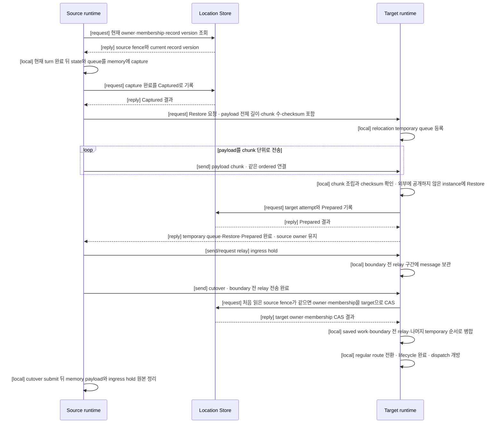
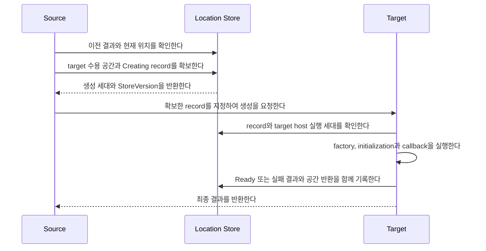
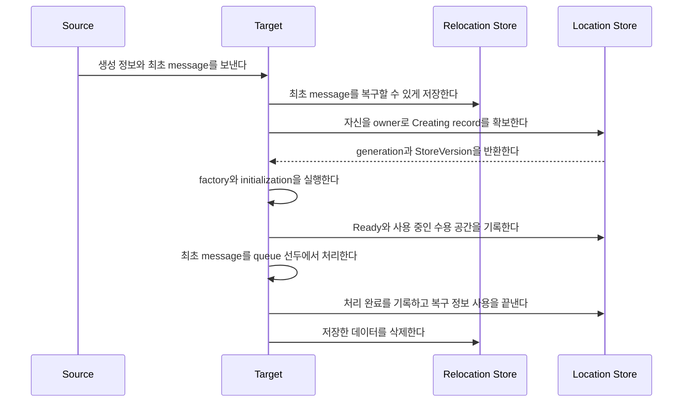
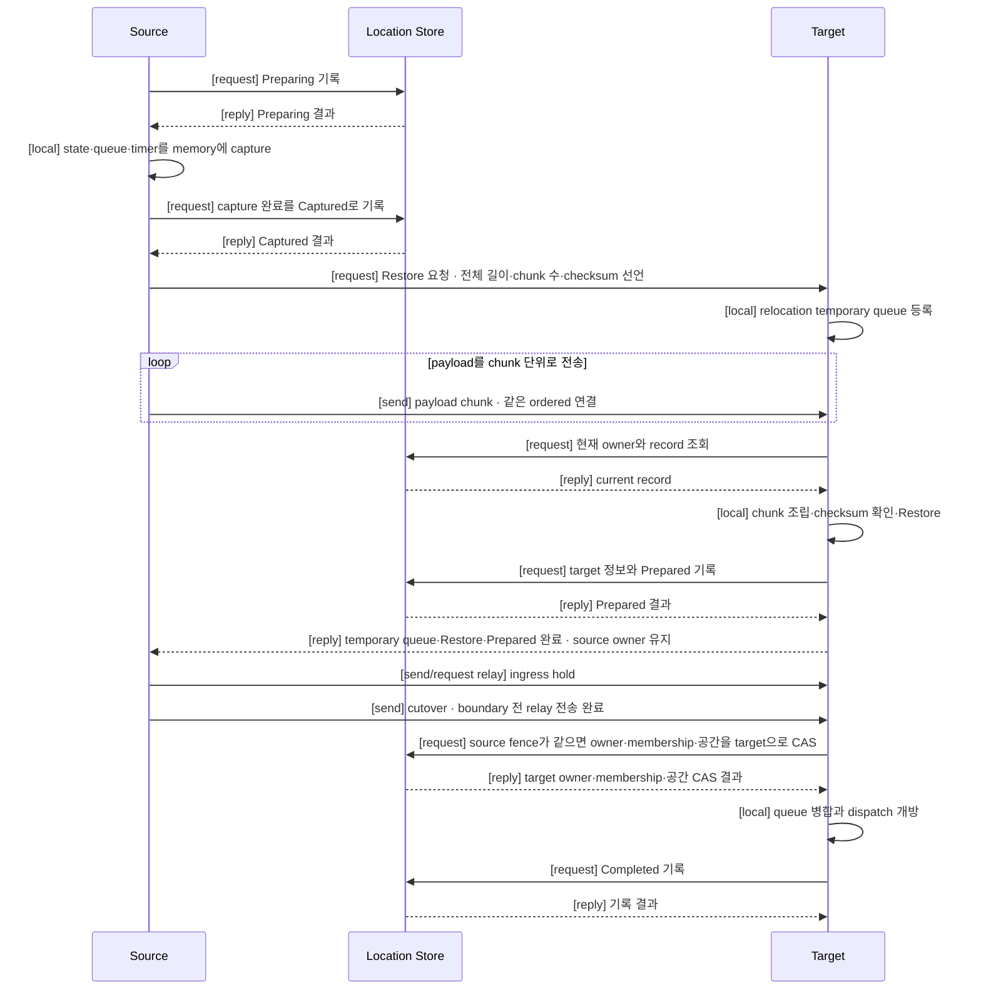

# Location runtime

[스펙 목차](README.ko.md) · [이전: Session Actor dispatch](20-session-actor-dispatch.ko.md) · [다음: Location Store provider SPI와 공식 Redis 구현](22-location-store-redis.ko.md)

> **이 장이 정의하는 것** — Framework가 application object의 현재 위치를 찾고 다른
> node로 옮기는 방법.


## 1. 범위와 책임

이 문서는 Framework가 application object의 현재 위치를 찾고 다른 node로 옮기는
방법을 정의한다.

Message handler와 Actor를 실행하는 단위를
[Spot](01-glossary.ko.md#spot)이라고 한다. Actor는 Entry Spot이나 User Spot에
속할 수 있다.

Actor·Spot 하나를 현재 처리하는 node를
[owner](01-glossary.ko.md#owner)라고 한다. Framework는 owner가 동시에 둘이 되지
않도록 관리한다.

Framework 시작과 함께 server 진입점으로 만드는 Spot을
[Entry Spot](01-glossary.ko.md#entry-spot-user-spot과-instance-spot)이라고 한다.
Application이 명시적으로 생성하고 관리하는 Spot은
[User Spot](01-glossary.ko.md#entry-spot-user-spot과-instance-spot)이다. 별도 create
call 없이 최초 message로 만드는 Spot은
[Instance Spot](01-glossary.ko.md#entry-spot-user-spot과-instance-spot)이다.

현재 owner와 위치를 여러 node가 함께 확인하도록 보관하는 저장소를
[Location Store](01-glossary.ko.md#location-store)라고 한다. Instance Spot cold
activation 기록과 relocation 뒤 완료되는 request의 완료 기록을 보관하는 저장소는
Relocation Store라고 한다. Actor·Spot relocation의 application state·queue·timer
handoff payload는 저장소를 거치지 않고 source가 target에 직접 전송한다.

저장소 구현자가 제공해야 하는 정확한 함수는
[Location Store provider](22-location-store-redis.ko.md)와
[Relocation Store provider](23-relocation-store-redis.ko.md) 문서가 정의한다. 이
문서는 Framework가 두 Store를 사용하는 순서와 실패했을 때 유지해야 하는 상태를
설명한다.

### 1.1 Framework가 보장하는 결과

Framework는 다음 결과를 보장한다.

- 현재 요청을 처리할 수 있는 service와 연결 주소를 찾는다.
- Actor·Spot마다 현재 owner를 하나만 인정한다.
- Actor·Spot을 만들거나 옮길 node에 필요한 수용 공간을 미리 확보한다.
- 같은 Actor·Spot을 동시에 두 번 만들지 않는다.
- 이전 owner가 뒤늦게 위치를 변경하지 못하게 한다.
- Host 교체 중 application state와 아직 실행하지 않은 작업을 다른 node에서 복원한다.

relocation은 source와 선택한 target process가 실행되는 동안에만 진행한다.
Process가 종료된 뒤 다른 runtime이 relocation을 이어받거나 다른 target으로 자동
failover하지 않는다. Location Store 응답이 유실됐을 때 실제 owner를 다시 확인하는
동작은 자동 failover가 아니라 owner를 둘로 만들지 않기 위한 필수 확인이다.

Core transport는 byte를 전달할 뿐 Actor·Spot의 위치, 생성과 relocation 상태를
해석하지 않는다.

### 1.2 두 Store의 책임

Framework는 위치를 판단하는 정보와 복구용 payload를 서로 다른 Store에 저장한다.

| Store | 저장하는 정보 | Framework가 사용하는 방법 |
|---|---|---|
| Location Store | 현재 owner와 위치, 세대 번호, Spot membership, 확보한 수용 공간과 relocation 진행 상태 | 어떤 node를 현재 owner로 인정할지 최종 결정한다. |
| Relocation Store | Instance Spot cold activation의 생성 정보와 최초 message, relocation 뒤 완료되는 pending request의 reply payload와 완료 결과 | Cold activation 복구와 이전 owner를 통한 reply 전달에 필요한 데이터를 제공한다. |

Actor·Spot relocation에서 새 owner가 복원할 application state, 실행하지 않은
queue와 timer는 어느 Store에도 저장하지 않는다. Source가 memory에 유지하다가
target에 직접 전송한다(§1.4).

어떤 Actor가 User Spot에 속하는 관계를
[Actor membership](01-glossary.ko.md#actor-membership)이라고 한다. Location Store에 저장한
이동 대상 목록이 membership의 기준이다. Restore 대화가 전달하는 payload는 이
관계를 바꾸지 못한다.

Actor가 많아도 목록 전체를 record 하나에 넣지 않는다. Framework는 이동 대상
목록을 여러 페이지로 나누어 저장한다.

| 구분 | 제한 |
|---|---|
| 시스템 전체 Actor·Spot 수 | 이 계약에서 고정 상한을 두지 않는다. |
| User Spot 하나에 속한 Actor 총수 | `1,024`로 제한하지 않는다. |
| 이동 대상 목록 한 페이지 | Actor·Spot 항목을 최대 1,024개까지 기록하며 저장 크기는 최대 1 MiB다. |

목록의 항목 하나는 “어떤 object를 옮겨야 하는가”만 나타낸다. Object identity,
generation, membership과 relocation 때 적용할 변경 정보를 기록한다. 여기서
generation은 같은 ID로 다시 만든 object나 이전 owner의 늦은 요청을 구분하는 세대
번호다. Actor state나 message payload는 넣지 않는다. 실제 application state와
실행하지 않은 작업은 source가 memory에 유지하다가 Restore 대화로 target에 직접
전송한다(§1.4).

예를 들어 User Spot에 Actor가 10,000개 있으면 약 10개의 목록 페이지를 만든다.
마지막 페이지에는 남은 항목만 들어간다.

```text
User Spot object list
|
+-- Page 1  : User Spot + Actor 1..1023
+-- Page 2  : Actor 1024..2047
+-- ...
+-- Page 10 : Remaining Actors
```

페이지가 많으면 페이지를 찾는 상위 목록도 여러 페이지로 나눈다. Location Store는
전체 목록의 시작 위치, 전체 항목 수와 내용 확인값을 보관한다. Framework는 이 세
값으로 페이지가 빠지거나 바뀌지 않았는지 확인한다.

복원 데이터 자체는 저장소를 거치지 않는다. Target은 Restore 요청이 선언한 전체
길이, chunk 수와 checksum으로 직접 전송받은 payload를 검증하고, 이동 대상 목록은
Location Store의 전체 항목 수와 내용 확인값으로 검증한다. 두 검증이 모두 성공해야
복원을 시작한다. Actor용 Store와 Spot용 Store를 따로 만들지 않는다.

외부 Store provider는 Location Store interface와 Relocation Store interface만 구현한다.
Framework의 Actor·Spot 규칙을 provider가 직접 구현하지 않는다.

| 책임 | 담당 |
|---|---|
| 의미를 해석하지 않는 key와 bytes를 읽고, 지정한 버전이 그대로일 때만 함께 변경한다. | Location Store provider |
| 한 번 저장하면 바꾸지 않는 payload를 저장하고 읽고 삭제한다. | Relocation Store provider |
| 실행 중인 node 정보, owner 사용 기한과 현재 위치 record의 의미를 해석한다. | Framework |
| 남은 수용 공간을 계산하고 여러 object를 함께 옮기며 실패 결과를 정리한다. | Framework |

예를 들어 Location Store provider는 저장할 bytes가 Actor owner인지 capacity인지 알
필요가 없다. Framework가 필요한 record를 만들고 provider에는 읽기와 “전부
성공하거나 전혀 변경하지 않는 쓰기”만 요청한다.

MeshNode descriptor, owner lease, ClientServer descriptor와 fanout publisher
descriptor처럼 서로 다른 언어의 runtime이 같은 논리 record를 읽고 써야 하는 항목은,
언어마다 다른 provider 구현이 저장해도 같은 Redis key와 같은 byte 표현을 만들어야
상호 운용이 성립한다. 이 항목이 사용하는 Redis key·value 형식은 provider가 자유롭게
고르는 내부 구현이 아니라 [Location Store provider의 공식 Redis
구현](22-location-store-redis.ko.md#7-등록-수명과-공식-redis-provider)이 정하는 공개
계약이며 §2.4가 요약한다. Relocation Store가 보관하는 payload의 Redis key·저장
형식도 별도로 버전을 매긴 공개 계약이며 [Relocation Store의 공식 Redis
구현](23-relocation-store-redis.ko.md#8-공식-redis-provider)이 정한다. Provider가
언어 전용으로 추가하는 보조 색인은 이 공개 계약에 포함되지 않는다.

Redis provider는 위 공개 계약을 넘어서는 범위에서 Lua script나 변경 감지 기능을
내부적으로 사용할 수 있다. Framework는 Redis 구현체로 변환하여 이런 기능을 직접
호출하지 않는다. 따라서 다른 database provider도 같은 두 Store interface와 §2.4가
요약하는 record 형식을 구현할 수 있다.

Application이 사용하는 위치 조회와 readiness API는 Store 구현 API가 아니다.
Application은 Framework runtime API를 사용하며 Store provider를 직접 호출하지 않는다.

### 1.3 등록 조건과 수명

Location Store와 Relocation Store는 Framework 설정에 각각 정확히 한 번 등록한다.
두 Store를 하나의 interface나 Redis 전용 등록 함수로 묶지 않는다.

여러 runtime node가 message를 주고받는 연결 그룹을
[RouteMesh](01-glossary.ko.md#routemesh)라고 한다. RouteMesh에 참여하여 message를
보내거나 받는 runtime node를
[MeshNode](01-glossary.ko.md#meshnode)라고 한다.
[Object Client role](01-glossary.ko.md#object-client와-object-server-role)은 Spot
생성·조회와 message를 요청할 수 있다.
[Object Server role](01-glossary.ko.md#object-client와-object-server-role)은 이
기능에 더해 Spot을 만드는 함수와 lifecycle을 제공한다. Application이 등록하고
Framework가 object를 만들 때 호출하는 이 함수를
[factory](01-glossary.ko.md#factory)라고 한다.

Object role이 `Client` 또는 `Server`인 MeshNode는 Location Store가 필수다. Store가
없으면 network socket을 열기 전에 startup configuration error로 끝난다. Framework는
대신 사용할 process 내부 Store를 만들지 않는다. Role이 `None`인 MeshNode는 object
create, find, message와 factory를 제공하지 않는다.

Object를 다른 node로 옮길 때 application state를 어떻게 복원할지 정하는 방식을
[relocation policy](01-glossary.ko.md#relocation-policy)라고 한다. `RecreateOnRelocation`은
application state 없이 새 instance를 만들고,
[PreserveStateWith](01-glossary.ko.md#preserve-state-relocation-policy)는
저장한 application state를 복원한다.

Object Server factory에 `RecreateOnRelocation` 또는 `PreserveStateWith` policy를 하나라도 등록했거나
Instance Spot factory를 하나라도 등록한 Framework
설정에는 Relocation Store를 정확히 하나 등록해야 한다. 누락되거나 둘 이상이면 socket bind 전에 startup
configuration error다. Instance Spot factory가 없고
모든 factory가 `DisableRelocation`일 때만 Relocation Store가 필요하지 않다.

등록에 성공하면 Framework가 Store instance를 종료할 책임을 가진다. Store를
사용하는 작업을 먼저 끝낸 뒤 instance를 정확히 한 번 dispose한다. 두 Store가 같은
database connection을 공유한다면 provider가 connection을 언제 닫을지 결정한다.

다음 .NET 예제는 두 Store를 별도로 등록한다. 다른 언어도 같은 등록 규칙을 따른다.

```csharp
services.AddZLinkFramework(options =>
{
    options.AddLocationStore(locationStore);     // 현재 owner와 위치를 최종 결정한다.
    options.AddRelocationStore(relocationStore); // 복원할 실제 데이터를 저장한다.
});
```

### 1.4 정상 처리 순서

Actor나 Spot을 다른 node로 이전할 때는 다음 순서를 따른다.

1. Framework가 현재 실행 중인 node 정보, owner의 사용 기한과 위치 record를
   확인한다.
2. Location Store에서 target node가 사용할 수용 공간을 확보한다.
3. Source는 현재 application turn을 끝낸 뒤 application state와 아직 실행하지 않은
   작업을 capture하여 memory에 유지한다. Location Store에는 capture 완료를
   `Captured`로 기록한다.
4. Source가 Target에 Restore 요청을 보낸다. 요청에는 payload의 전체 길이, chunk
   수와 checksum이 들어가고, source는 같은 ordered connection으로 payload를 chunk로
   나눠 직접 전송한다.
5. Target은 요청을 받으면 relocation temporary queue를 먼저 등록하고, 전송받은
   chunk를 조립해 checksum을 확인한 뒤 외부에 아직 공개하지 않은 instance에
   복원한다. Restore가 끝나면 source에
   relay 수신 준비를 알린다. Source는 이 통지 뒤 ingress hold를 relay하고 같은 ordered
   connection으로 cutover를 one-way로 보낸다.
6. Target은 cutover를 받거나 relay 준비 reply 뒤 1,000ms가 지나면 Location Store의 처음 읽은 version이 그대로일
   때만 owner, membership과 수용 공간을 한 번에 변경한다. 이 방식을 compare-and-set, 줄여서
   [CAS](01-glossary.ko.md#compare-and-set)라고 한다.
7. Owner 변경 뒤 저장된 기존 작업, cutover 전 relay와 나머지 temporary 작업을 실제 object
   queue에 순서대로 넣는다. Temporary queue 등록을 제거하고 regular route로 전환하되 dispatch는
   닫아 둔다. 필요한 lifecycle callback을 끝낸 뒤 application message 처리를 시작한다.
8. Source는 cutover를 보낸 뒤 완료 reply를 기다리지 않고 Message Follow를 유지한다.
   Memory에 유지한 payload 원본은 cutover submit이 끝난 뒤 정리한다.



Handoff payload와 owner 변경을 하나의 distributed transaction이나 2PC로 묶지
않는다. Restore 요청, 각 chunk와 target의 owner CAS는 같은 `RelocationId`, target
attempt와 source fence로 결합되고, Location Store의 owner CAS 한 번으로 새 owner를
공개한다.

Relocation Store 사용 여부는 다음과 같다. Actor·Spot relocation의 handoff
payload는 이 Store를 거치지 않는다.

| 작업 | Framework 동작 |
|---|---|
| Same-node Actor join | Location Store에서 membership만 변경하며 payload를 만들지 않는다. |
| `DisableRelocation` cross-node 이동 | Capture 전에 거부한다. |
| `RecreateOnRelocation` cross-node Actor·Spot 이동 | Application state 없이 실행 전 queue·timer를 capture하여 target에 직접 전송한다. Relocation Store에는 저장하지 않는다. |
| `PreserveStateWith` cross-node Actor·Spot 이동 | Application state와 실행 전 queue·timer를 capture하여 target에 직접 전송한다. Relocation Store에는 저장하지 않는다. |
| Host maintenance의 Actor·User Spot 이동 | 이동 대상별 state와 완료되지 않은 작업을 target에 직접 전송한다. Relocation 뒤 완료되는 pending request의 완료 기록만 Relocation Store에 저장한다(§7.5). |
| Cross-node Actor `JoinSpot`·`JoinEntrySpot` | 이동하는 Actor의 policy에 맞는 payload를 target에 직접 전송한다. |
| Instance Spot을 처음 만들면서 message 처리 | 생성 정보와 최초 message를 Relocation Store에 함께 저장한다. Policy가 `DisableRelocation`이어도 사용한다. |

실행 중인 node를 알리는 정보는 해당 host의 owner 사용 기한이 끝나면 더 이상
사용하지 않는다. Actor·Spot의 현재 위치 record는 정해진 조건으로 삭제할 때까지
유지한다. Transport가 message를 보낼 준비가 된 상태, node 정보의 존재와 Actor·
Spot의 현재 owner는 서로 다른 조건이다. Framework는 요청을 보내거나 새 object를
배치하기 전에 필요한 조건을 모두 확인한다.

## 2. 같은 ID의 재생성과 owner 변경을 구분하는 값

### 2.1 Host process가 다시 시작됐는지 구분한다

Host process 하나가 실행되는 동안 Framework는 `(OwnerId, LeaseGeneration)` 조합을
사용한다. Process가 다시 시작되면 이전 값과 다른 조합을 발급한다.

| 값 | 발급과 용도 |
|---|---|
| `OwnerId` | Framework가 만드는 재사용 불가능한 값이다. |
| [LeaseGeneration](01-glossary.ko.md#ownerleasegeneration) | Location Store에 유지하는 counter를 조건부로 증가시켜 발급한다. 0은 사용하지 않는다. 이전 process의 늦은 요청을 거부할 때 사용하며 object owner 변경 횟수와는 관계없다. |

Host가 현재 유효한지는 Store에 기록한 만료 시각으로 판단한다. 이 유효 기간을
[owner lease](01-glossary.ko.md#owner-lease)라고 한다. 모든 MeshNode, ClientServer, fanout publisher와 Actor·Spot
위치 record가 같은 host 실행 조합과 owner lease를 사용한다.

Framework는 필요한 `OwnerId` record를 직접 읽는다. Store 전체의 owner lease를
열거한 결과만으로 변경 권한을
판단하지 않는다.

새 host가 owner 자격을 얻거나 만료된 자격을 인계받을 때만 새 `LeaseGeneration`을
발급한다. 사용 기한 연장과 정상 해제는 값을 바꾸지 않는다. Counter가 `2^63-1`이면
`GenerationExhausted`다. 이 결과는 다시 시도해도 성공하지 않으며 Store record와
counter를 변경하지 않는다.

### 2.2 Object 재생성과 owner 변경은 다른 세대 번호를 사용한다

Location Store에서 Actor·Spot의 현재 owner와 변경 세대를 결정하는 공식 record를
[authority](01-glossary.ko.md#authority)라고 한다. Authority는 다음 값을 서로 다른 목적으로 사용한다.

같은 ID를 삭제한 뒤 다시 만든 object와 이전 object를 구분하는 번호를
[ObjectGeneration](01-glossary.ko.md#objectgeneration)이라고 한다. Object를 다른 node로 옮길 때는 같은 object가
계속 처리되므로 이 번호를 바꾸지 않는다.

| 값 | 의미 |
|---|---|
| `ObjectGeneration` | 같은 ID로 object를 삭제한 뒤 다시 만들었는지 구분한다. Relocation은 같은 object를 옮기는 작업이므로 값을 유지한다. |
| [AuthorityOwnerGeneration](01-glossary.ko.md#authorityownergeneration) | 같은 object의 owner가 바뀐 순서를 나타낸다. |
| `StoreVersion` | 처음 읽은 뒤 다른 caller가 record를 바꿨는지 CAS에서 확인하는 provider 발급 값이다. Framework는 내부 구성을 해석하지 않는다. |
| `OwnerLeaseGeneration` | 현재 owner host가 어느 process 실행에 속하는지 나타낸다. |

Framework가 object와 owner의 generation을 증가하는 counter로 발급한다.
`StoreVersion`만 provider가 발급한다. ActorRef와 SpotRef는 ObjectGeneration을
사용한다.

저장하는 generation 범위는 `1..2^63-1`이며 `2^63-1`은 소진 sentinel로 저장만 하고
발급하지 않는다. 따라서 발급 범위는 `1..2^63-2`다. 저장한 counter가 sentinel이면 다음
발급은 `GenerationExhausted`이며 Store를 변경하지 않는다. 반복 호출도 같은 결과다.
Framework는 해당 authority를 오류 상태로 기록하고 network command를 보내지 않는다.
Counter를 0으로 되돌리거나 범위를 넘어 다시 사용하지 않는다.

### 2.3 현재 위치 record에 저장하는 값

같은 이름으로 등록한 node가 하나의 RouteMesh 연결 그룹에 참여한다. 이 그룹 이름을
[MeshName](01-glossary.ko.md#meshname)이라고 한다. Object를 처음 배치할 Mesh를 고를 때 사용하지만 SpotId의
일부는 아니다.

Spot을 system 전체에서 찾을 때 사용하는 전역 문자열 주소를
[Spot ID](01-glossary.ko.md#spot-id)라고 한다. Public interface에서는 `SpotId`로
표기한다.

Authority의 key는 전역 ActorId 또는 SpotId다. 두 ID는 UTF-8 `1..255` bytes이며
대소문자까지 같아야 같은 ID다. Unicode normalization과 대소문자 변환은 하지
않는다. Spot 종류는 `Entry | User | Instance` 중 하나다.
MeshName은 현재 배치 위치이며 identity key의 일부가 아니다.

Factory를 등록할 때 언어와 관계없이 같은 object type을 가리키도록 정한 문자열을
[stable type](01-glossary.ko.md#stable-type)이라고 한다.

| 저장 항목 | 계약 |
|---|---|
| 변경 충돌을 막는 값 | `StoreVersion`, `ObjectGeneration`, `AuthorityOwnerGeneration`, 현재 `OwnerId`와 `OwnerLeaseGeneration` |
| 배치 정보 | `Reserved | Active`, object 종류, stable type, target node 실행 세대와 종류별 수용 공간 |
| Store가 읽은 시각 | `StoreNow` |
| Framework 내부 데이터 | 최초 배치 요청, 생성 요청과 relocation 진행 상태 |

Key와 배치 정보는 Framework 내부 데이터에 다시 넣지 않는다. Provider는 저장한
bytes의 의미를 해석하지 않는다.

| Object | 필요한 수용 공간 |
|---|---|
| Actor | Actor slot 1 |
| User·Instance Spot | Spot slot 1과 해당 Spot 종류·stable type slot 1 |
| User Spot과 member Actor의 relocation | Spot slot 1, 해당 Spot type slot 1과 member Actor 수만큼의 Actor slot |

각 slot은 `0..2^31-1`이다. 한 번에 확보하는 묶음에는 하나 이상의 양수 slot이
있어야 한다. 생성과 relocation에서 확보한 수용 공간, 현재 사용량과 Store counter는
같은 종류 구분을 사용한다.

Authority record에는 자동 만료 시간을 두지 않는다. Owner lease가 끝난 뒤에도
record를 유지한다. 복구를 담당하는 Framework 작업만 처음 읽은 `StoreVersion`을
조건으로 owner를 교체하거나 record를 삭제한다. Record가 없으면 Store가 읽은
시각만 반환한다. 없는 record를 위해 임시 `StoreVersion`이나 generation을 만들지
않는다.

### 2.4 여러 언어가 같은 Redis record를 읽고 쓰는 방법

MeshNode descriptor, owner lease, ClientServer server descriptor, fanout publisher
descriptor와 authority record(§3, §2.2, §2.3)는 언어가 달라도 같은 저장 방식을 통해
Redis에 기록해야 다른 언어의 runtime이 그 record를 읽을 수 있다. 이 저장 방식을
[Location Store provider의 공식 Redis 구현](22-location-store-redis.ko.md#7-등록-수명과-공식-redis-provider)이
정의하며, Framework는 이를 "opaque record"라고 부른다. 각 record마다 byte 그대로
고정한 문자열("logical key preimage")을 만들고, 이 preimage의 SHA-256 hash를 소문자
16진수로 표기한 값을 Redis key의 마지막 segment로 사용한다.

| Record | Logical key preimage(UTF-8, `\0`으로 값을 구분) |
|---|---|
| MeshNode descriptor | `mesh-node\0{MeshName}\0{hex(RoutingId)}` |
| Owner lease | `owner-lease\0{OwnerId}` |
| ClientServer server descriptor | `client-server\0{ChannelName}\0{hex(RoutingId)}` |
| Fanout publisher descriptor | `fanout-publisher\0{ChannelName}\0{hex(RoutingId)}` |
| Authority | `authority\0{actor \| spot}\0{Id}` |

`{hex(RoutingId)}`는 RoutingId의 raw bytes를 소문자 16진수로 표기한 값이다.
`{MeshName}`, `{ChannelName}`, `{OwnerId}`와 authority의 `{Id}`(전역 ActorId 또는
SpotId, §2.3)는 UTF-8 bytes를 그대로 이어 붙이며 길이 접두사를 붙이지 않는다 —
preimage 안의 `\0` byte만으로 값의 경계를 고정하므로, `MeshName`·`ChannelName`·
`Id` 자체에는 `\0` byte를 허용하지 않는다(§2.3이 이미 ActorId·SpotId에 이 제약을
둔다). Authority preimage의 두 번째 segment는 object 종류를 그대로 적은 literal
`actor` 또는 `spot`이다 — 같은 문자열 Id라도 actor와 spot은 다른 key이며(예:
`authority\0actor\0user:42`와 `authority\0spot\0user:42`는 다른 key다), Spot
종류(`Entry | User | Instance`)는 이 segment를 공유해 한 Id당 하나의 authority
row만 존재한다(§2.3). [Store record golden fixture](../../../../../runtime/protocol/golden/store-record-v1.json)가
이 preimage 구조의 key 파생 벡터를 고정한다.

각 record의 value는 provider가 의미를 해석하지 않고 bytes로만 저장·비교하는 canonical
JSON 값이다. 최소한 다음 field를 포함한다.

| Field | 의미 |
|---|---|
| `recordVersion` | 이 record의 JSON 구조 버전이다. 현재 값은 `1`이다. Provider가 아니라 Framework가 이 값을 확인하며, 인식하지 못하는 값을 만나면 명시적으로 실패시키고 추측해서 읽지 않는다. |
| `ownerId`, `leaseGeneration` | 이 record를 게시한 host의 `(OwnerId, LeaseGeneration)`(§2.1)이다. Authority record는 대신 `ownerId`·`ownerLeaseGeneration`이라는 이름을 쓴다(아래 표). |
| `descriptorRevision` | §3의 Revision이다. Owner lease record와 authority record에는 없다. |
| `descriptor` | MeshNode·ClientServer·fanout publisher 각각의 descriptor 내용(§3)이다. Owner lease record와 authority record에는 없다. |

`descriptor`의 정확한 field 목록은 이 문서 §2.3·§3의 계약과
[glossary](01-glossary.ko.md#meshnode-descriptor)가 이미 고정한 .NET 표기를 기준으로
정한다. generation·revision류 정수 field는 다른 record의 generation field와
마찬가지로 JSON number가 아닌 JSON string으로 쓴다. 반면 weight·limit·capacity
count류의 크기 값은 JSON number로 쓴다 — golden fixture가 고정한 형태가 기준이다.
RoutingId는 소문자 16진수 문자열로, timestamp는 Unix epoch millisecond를 담은
문자열로 쓴다. 세 record
모두 `descriptor` 안에 자신의 `ownerId`·`leaseGeneration`·`descriptorRevision`을
다시 담는다 — 이 값은 record 최상위 field와 같은 publish 작업이 쓰는 같은 값이므로
항상 같아야 한다(최상위와 `descriptor` 안 두 곳에 각각 쓰지만 CAS는 record 전체를
하나의 opaque bytes로 다루므로 두 값이 어긋나는 중간 상태는 없다). 언어별 provider가
내부적으로 관리하는 storage-row 버전 counter(예: 일부 구현이 `generation`이라는
이름으로 descriptor 안에 넣던 값)는 이 opaque record의 cmsgpack `version` member(§22
§7)가 이미 그 역할을 하므로 canonical JSON에 다시 넣지 않는다 — 두 곳에 store 버전을
중복해서 두면 어느 쪽이 진짜인지 다시 정의해야 하기 때문이다.

**MeshNode descriptor** — [glossary](01-glossary.ko.md#meshnode-descriptor)의
`ZLinkMeshNodeDescriptor`에서 파생한다.

| Field | 의미 |
|---|---|
| `meshName` | RouteMesh 그룹 이름이다. |
| `routingIdHex` | RoutingId의 raw bytes를 소문자 16진수로 표기한 값이다. |
| `lifecycleGeneration` | 현재 MeshNode 실행을 구분하는 값이다. |
| `descriptorRevision` | 위 최상위 field와 같은 값이다. |
| `endpoint` | 실제로 연결할 advertised ROUTER endpoint다. |
| `entrySpotId` | Object Server lifecycle의 exact Entry Spot ID다. `Server` role이 아니면 `null`이다. |
| `channelWeights` | ClientServer ChannelName마다의 선택 비중이다. Key는 ChannelName, value는 `0..10000` 정수다. |
| `applicationVersion` | Application 배포 순번이다. |
| `objectCapabilities` | 등록한 object 종류별 배치 능력 목록이다. 각 원소는 `objectKind`(`actor \| userSpot \| instanceSpot`), `stableType`, `policy`(`unspecified \| disabled \| recreate \| snapshot`), `hasSnapshotAdapter`(boolean)와 `limit`(정수, `0`은 무제한)을 포함한다. 최대 1,024개다. |
| `objectRole` | `none \| client \| server` 중 하나다. |
| `placementWeight` | `0..10000`, 기본값 100이다(§3). |
| `capacity` | §3의 "Descriptor의 count는 운영자가 상태를 확인하기 위한 복사본" 투영이다. `actors`와 `spots`는 각각 `{active, reserved, limit}`이다. `spotTypes`는 `{objectKind, stableType, active, reserved, limit}` 배열이다. Entry Spot은 포함하지 않는다(§3). |
| `activationConcurrency` | 동시 생성 중인 Instance Spot factory 실행 수 제한이다. `{active, limit}`이다. |
| `maintenanceWave` | Optional maintenance wave stable ID다. 없으면 `null`이다. |
| `state` | `preparing \| serving \| relocating \| relocated \| draining \| stopped \| error` 중 하나다. |
| `securityIdentity` | 연결 상대를 검증하는 identity다. |
| `ownerId`, `leaseGeneration` | 위 최상위 field와 같은 값이다. |
| `updatedAtEpochMs` | Store에 기록한 갱신 시각이다. |

**ClientServer server descriptor** — [glossary](01-glossary.ko.md#clientserver-server-descriptor)의
`ZLinkClientServerServerDescriptor`에서 파생한다.

| Field | 의미 |
|---|---|
| `channelName` | Client가 조회할 service Channel 이름이다. |
| `serverRoutingIdHex` | Server RoutingId를 소문자 16진수로 표기한 값이다. |
| `lifecycleGeneration` | 현재 Server 실행을 구분하는 값이다. |
| `descriptorRevision` | 위 최상위 field와 같은 값이다. |
| `endpoint` | 실제로 연결할 advertised endpoint다. |
| `weight` | `0..10000`, 기본값 100이다. 새 request와 send의 상대 선택 비중이다. |
| `state` | MeshNode descriptor와 같은 값 집합이다. |
| `securityIdentity` | Transport admission identity다. |
| `ownerId`, `leaseGeneration` | 위 최상위 field와 같은 값이다. |
| `updatedAtEpochMs` | Store에 기록한 갱신 시각이다. |

**Fanout publisher descriptor** — [glossary](01-glossary.ko.md#fanout-publisher-descriptor)의
`ZLinkFanoutPublisherDescriptor`에서 파생한다. ClientServer server descriptor와 같은
field에서 `weight`만 뺀 형태다.

| Field | 의미 |
|---|---|
| `channelName` | Fanout Channel 이름이다. |
| `publisherRoutingIdHex` | Publisher RoutingId를 소문자 16진수로 표기한 값이다. |
| `lifecycleGeneration` | 현재 publisher 실행을 구분하는 값이다. |
| `descriptorRevision` | 위 최상위 field와 같은 값이다. |
| `endpoint` | Subscriber가 연결할 advertised PUB endpoint다. |
| `state` | MeshNode descriptor와 같은 값 집합이다. |
| `securityIdentity` | 연결 admission identity다. |
| `ownerId`, `leaseGeneration` | 위 최상위 field와 같은 값이다. |
| `updatedAtEpochMs` | Store에 기록한 갱신 시각이다. |

Authority record(§2.2, §2.3)는 네 언어 모두 하나의 logical key가 가리키는 하나의
opaque-record 행으로 저장한다. **`objectGeneration`은 Store 전역 단조 sequence에서
발급하며**, 이 방식은 identity별 단조성도 보장한다. 이 sequence의 counter key와 발급
계약은 [Location Store Redis §7](22-location-store-redis.ko.md#7-등록-수명과-공식-redis-provider)이 정한다.

Authority record의 canonical JSON은 최소한 다음 field를 포함한다. `payload`를
제외한 정수 field는 다른 record의 generation field와 마찬가지로 JSON number가 아닌
JSON string으로 쓴다(64-bit 값이 JSON number 정밀도를 넘을 수 있으므로).

| Field | 의미 |
|---|---|
| `recordVersion` | 위와 같다. 현재 값은 `1`이다. |
| `payload` | Framework가 의미를 해석하지 않는 application 정의 opaque bytes다. 네 언어 모두 JSON 안에서 **base64**로 인코딩한다. |
| `objectGeneration` | 이 object(§2.2)의 현재 generation이다. 위에서 정한 Store 전역 단조 sequence에서 발급한다. |
| `authorityOwnerGeneration` | Owner 변경을 구분하는 값이다(§2.2). |
| `ownerId`, `ownerLeaseGeneration` | 현재 owner의 `(OwnerId, LeaseGeneration)`이다(§2.1). |
| `allocation` | 배치 정보(§2.3)다. dotnet `ZLinkPlacementAllocation`(내부 구현)에서 파생한다. `state`(`reserved \| active`), `objectKind`(`actor \| userSpot \| instanceSpot` — Entry Spot은 없다. Entry Spot의 Actor는 `actor`로 집계한다, §3), `stableType`, `descriptor`(`{meshName, routingIdHex}` — MeshNode descriptor key와 같은 모양), `descriptorLifecycleGeneration`(target MeshNode의 `lifecycleGeneration`과 CAS로 맞춰야 하는 값)과 `capacity`를 포함한다. `capacity`는 `{actors, spots, spotType}`이며 `actors`·`spots`는 이번 allocation이 확보한 정수 slot 수, `spotType`은 Spot이 아니면 `null`이고 Spot이면 `{objectKind, stableType, count}`다(§2.3의 "Spot slot 1과 해당 Spot 종류·stable type slot 1" — flat counter 하나로는 어떤 `(spotKind, stableType)` 조합을 확보했는지 표현할 수 없다). |
| `pendingCreation` | 생성 진행 상태다(§6). 없으면 `null`이다. 있으면 `reservationId`, `requestContentReference`, `requestSha256`(hex, 64자)과 `requestEncodedSize`(정수)를 포함한다. |

Relocation Store가 보관하는 payload(cold activation envelope, 완료 기록)는 이
opaque record를 사용하지 않는다. 별도로 버전을 매긴 key 공간과 raw bytes 저장 형식을
[Relocation Store의 공식 Redis 구현](23-relocation-store-redis.ko.md#8-공식-redis-provider)이
정한다.

각 언어 구현은 opaque record의 key 파생과 value byte 표현을 확인하는 공용 golden
fixture 대상 conformance test를 실행해야 한다(§10).

## 3. 실행 중인 node와 제공 기능을 찾는다

Host는 자신의 network 주소, 실행 상태와 제공 기능을 Store에 게시한다. 이 정보를
[descriptor](01-glossary.ko.md#descriptor)라고 한다. MeshNode, ClientServer server와 fanout publisher가 각각
자신의 descriptor를 게시하며 현재 host 실행 조합을 포함한다.

Framework가 Store에서 이 정보를 읽어 필요한 connection을 자동으로 구성하는 기능을
[automatic discovery](01-glossary.ko.md#automatic-discovery)라고 한다. Framework는 descriptor 페이지를 읽은 뒤 해당 host의
owner lease가 아직 유효한지 직접 확인한다.

| Descriptor 항목 | 계약 |
|---|---|
| Revision | Host가 descriptor마다 발급하는 0이 아닌 증가 값이다. Provider 전체에서 공유하는 counter가 아니다. 다음 값이 `2^63-1`을 넘으면 host를 `Error`로 바꾸고 게시를 중단한다. |
| Page | 항목은 `1..1000`개이며 저장 크기는 최대 4 MiB다. 다음 페이지를 읽는 값은 provider가 발급하고 Framework는 해석하지 않는다. |
| Descriptor 하나 | 저장 크기는 최대 1 MiB다. 등록 type 목록과 state adapter 지원 목록은 각각 최대 1,024개다. |

Framework는 목록을 읽기 전과 후에 변경 번호를 확인한다. 두 번호가 같을 때만 전체
페이지를 사용한다. Provider는 전체 목록을 Lua memory에 한꺼번에 만들거나 Redis
`SCAN` cursor를 Framework에 노출하지 않는다.

Publisher가 이미 저장된 것과 같은 Revision으로 보낸 `RENEW`는 무해한 no-op이며 Store는
이를 ignored/stale로 보고하고 descriptor를 다시 저장하지 않는다. Publisher는 게시 내용을
바꾸려면 반드시 Revision을 증가시켜야 한다 — Revision이 바뀌지 않은 `RENEW`는 여러 번
반복되더라도 error가 되지 않고 저장된 descriptor를 덮어쓰지도 않는다.

Host는 startup 중 descriptor 전체를 먼저 만든다. 크기 제한을 넘으면 일부를
자르거나 나누어 게시하지 않고 startup 전체를 실패시킨다. Application state의
format과 version은 descriptor에 넣지 않는다.

Descriptor가 있다는 사실만으로 message를 보낼 수 있는 것은 아니다. RouteMesh와
ClientServer는 실제 connection의 handshake와 사용 승인까지 끝나야 한다. 이 상태를
[ready](01-glossary.ko.md#ready)라고 한다. Fanout subscriber는 publisher별
connection에서 첫 정상 application record 또는 형식이 올바른
[liveness beacon](01-glossary.ko.md#liveness와-liveness-beacon)을 받은 뒤 ready다.
Liveness beacon은 publisher가 연결 상태를 확인하려고 보내는 전용 record이며
application message가 아니다.

Object Server descriptor에는 `Server` role, node-wide placement weight, node별
Actor·Spot count와 limit, 지원하는 Spot stable type과 Entry Spot ID가 있다.

여러 target 후보에 새 object를 배정할 상대 비중을
[weight](01-glossary.ko.md#weight)라고 한다. 값이 클수록 다른 조건이 같은 후보보다
자주 선택하며, 처리 가능한 동시 작업 수를 뜻하지 않는다.

| 설정 | 범위와 의미 |
|---|---|
| Weight | `0..10000`, 기본값 100이다. 0이면 새 object를 배치하거나 relocation할 node를 선택할 때 제외한다. |
| Actor·Spot 전체 limit | 기본값 0은 제한 없음이다. 양수는 `1..2^31-1`이다. |
| User·Instance Spot type limit | 기본값 0은 제한 없음이다. 양수는 `1..2^31-1`이다. |
| 음수 limit | Startup configuration error다. |

Entry Spot은 Spot 수에 포함하지 않는다. Entry Spot의 Actor는 Actor 전체 사용량에
포함한다. Actor type별 limit은 없다. Location Store에 기록한 현재 사용량과 확보한
수용 공간이 최종 기준이다. Descriptor의 count는 운영자가 상태를 확인하기 위한
복사본이다.

Actor를 배치하거나 Entry Spot으로 보낼 때는 target descriptor, host 실행 세대와
Entry Spot ID를 함께 고정한다. SpotId 문자열을 분석하여 이 관계를 계산하지 않는다.

Framework는 owner lease, `Serving` 상태와 남은 수용 공간을 확인한다. Location
Store에서 현재 사용량과 다른 작업이 확보한 양을 한 번에 검사한 뒤 weight 비율로
target을 고른다. Weight 0으로 바뀌어도 이미 Ready인 object나 완료된 reservation을
취소하지 않는다.

## 4. Store 연결이 끊기면 이전 owner의 새 작업을 막는다

Owner lease를 갱신하지 못한 host가 계속 새 작업을 받으면 새 owner와 동시에
처리할 수 있다. 이를 막기 위해 각 host는 Store 응답 시각으로 “새 작업을 받을 수
있는 마지막 시각”을 계산한다. 이 시각을
[local admission deadline](01-glossary.ko.md#deadline)이라고 한다.

Location Store를 사용하는 모든 host는 startup에서 다음 관계를 검증한다. Routing
ID 할당 방식과는 관계없다.

```text
renew interval + renew timeout < owner lease TTL - owner lease fencing margin
```

| 설정 | 기본값 |
|---|---:|
| Renew interval | 5초 |
| Owner lease TTL | 15초 |
| Renew timeout | 3초 |
| Owner lease fencing margin | 5초 |

모든 값은 양수여야 한다. 위 관계를 위반하면 startup error다. Automatic RID
descriptor 등록도 같은 host 실행 조합과 deadline을 사용한다.

Framework는 성공한 등록·읽기·갱신 결과의 `StoreNow`와 `ExpiresAt`으로 남은 시간을
계산한다. Store 요청 전후의 local monotonic 시각을 함께 사용하여 network 지연을
고려한다. Owner lease 갱신 한 번이 host 전체의 local admission deadline을
갱신한다. Object별 deadline은 이 시각을 연장할 수 없다.

Deadline을 넘거나 현재 host 실행 조합이 Store 값과 다르면 다음 새 작업을 받지
않는다.

| 차단 대상 |
|---|
| Descriptor 게시와 automatic RID owner 변경 |
| Actor·Spot·Instance message와 timer callback 시작 |
| Factory·restore 결과를 Store에 확정하는 작업 |
| Relocation source·target 상태 변경과 수용 공간 확보 |

이미 local queue가 받은 작업의 결과 처리와 정리는 별도 deadline 안에서 진행할 수
있다. 하지만 만료된 owner 자격으로 새 Store 변경을 만들지 않는다.

## 5. 현재 위치 record를 읽고 변경한다

`Reserve`, `Preserve`, `NewOwner`, `Commit`과 `Abort`는 Framework 내부에서 위치
record를 바꾸는 작업 이름이다. Store provider의 public method가 아니다. Framework는
필요한 조건과 변경 내용을 만들어 전부 성공하거나 전혀 변경하지 않는 Store
요청으로 실행한다.

### 5.1 Read와 CAS

Authority를 읽으면 record가 없는 `Missing(StoreNow)` 또는 현재 값이 있는
`Found(currentRecord, StoreNow)`를 반환한다. 기존 record를 바꿀 때는 처음 읽은
`StoreVersion`이 그대로인지 CAS로 확인한다.

| 작업 | 허용하는 변경 |
|---|---|
| `Reserve` | `Missing → Reserved`. ObjectGeneration, 첫 AuthorityOwnerGeneration과 수용 공간을 발급한다. |
| `Commit` | Exact reservation의 `Reserved → Active`다. |
| `Abort` | Exact reservation의 `Reserved → Missing`이다. |
| `Preserve` | Active owner, generation과 사용 중인 수용 공간은 유지하고 `StoreVersion`과 Framework 내부 데이터만 바꾼다. Target 정보는 없어야 한다. |
| `NewOwner` | Active record를 target owner로 바꾼다. ObjectGeneration은 유지하고 AuthorityOwnerGeneration을 증가시킨다. 미리 확보한 target 수용 공간을 사용한다. |
| `Delete` | Active record와 조회용 index를 제거하고 사용 중인 수용 공간을 같은 요청에서 감소시킨다. |

Reserved record에 `Preserve`, `NewOwner` 또는 `Delete`를 적용하면 `Conflict`이며
아무것도 변경하지 않는다. Active owner 변경은 `NewOwner` 또는 User Spot 전체
이동의 최종 변경으로만 수행한다. 별도의 create 작업 이름은 없다.

Framework는 예상 version, counter, record와 조회용 index 변경을 한 Store 요청에
넣는다. `Preserve`와 `Delete`는 현재 owner lease를 검증한다. `NewOwner`는 target
lease와 해당 relocation이 미리 확보한 수용 공간을 검증한다. Record가 없거나 lease가
오래됐으면 `Conflict`이며 아무것도 변경하지 않는다. Target 정보 조합 자체가
잘못됐으면 Store를 호출하기 전에 Framework 내부 오류로 끝낸다.

일반 `Preserve`에는 relocation reservation 정보가 없다. Standalone relocation에서
완료 기록 payload의 위치를 갱신하거나 target 준비 완료를 기록할 때만 미리 확보한
reservation 정보를 함께 전달할 수 있다. Framework는 authority key, 처음 읽은
`StoreVersion`, source·target owner와 현재 수용 공간을 모두 확인한다. 성공하면
reservation이 기대하는 `StoreVersion`도 같은 요청에서 갱신한다. Owner, 수용 공간과
reservation 상태는 유지한다.

### 5.2 여러 페이지를 같은 시점의 목록으로 읽는다

복구 작업은 Store record를 여러 페이지로 읽는다. 첫 페이지를 읽기 시작한 시점의
목록을 마지막 페이지까지 유지해야 한다. 한 페이지는 `1..1000`개이며 저장 크기는
최대 4 MiB다.

첫 요청에는 다음 페이지 값이 없다. 이후 값은 비어 있지 않은 최대 4,096 bytes이며
Framework는 내용을 해석하거나 조합하지 않는다. 만료됐거나 다른 목록 읽기에 사용한
값이면 `ScanExpired`다.

Provider는 key byte 순서로 record를 반환한다. 페이지에서 찾은 record는 변경 후보일
뿐이다. Framework는 해당 key를 다시 읽고 처음 읽은 version이 그대로일 때만
변경한다. Provider가 같은 시점의 목록, 삭제 표시와 오래된 데이터를 정리하는 방법은
공개 계약이 아니다.

## 6. Actor와 User Spot을 만든다

Actor와 User Spot은 Manager의 `Create` 또는 `GetOrCreate`로 만든다. Instance Spot은
별도 생성 API를 사용하지 않는다. Instance Spot이 없을 때 최초 message를 받은
node가 Spot을 만들고 같은 message를 처리한다. 이 동작은 §6.1에서 설명한다.

| Object | ID 결정 방법 |
|---|---|
| Actor | Caller가 전역 ActorId를 지정한다. |
| User Spot `Create` | Framework가 소문자 표준 UUID v4 문자열을 SpotId로 발급한다. |
| User Spot `GetOrCreate` | Caller가 전역 SpotId와 stable type을 지정한다. |
| Entry Spot | Framework만 ID를 발급한다. |

`InMesh`를 지정하면 해당 Mesh에서 node를 고른다. 생략했을 때 Object role Mesh가
하나면 그 Mesh를 사용한다. 후보가 없으면 `NotConfigured`, 둘 이상이면
`InvalidOperation`, 지정한 Mesh가 없으면 `NotFound`다.

Create call은 한 번만 제출할 수 있다. 제출할 때 위치 조회부터 `Ready` 확정까지
하나의 deadline을 사용한다. 같은 option을 중복 지정하거나 같은 call을 다시 제출하면
`InvalidOperation`이다.

생성 요청의 저장 크기는 최대 1 MiB다. Actor와 User Spot 요청은 Location Store의
생성 중인 record에 저장한다. Relocation Store에는 저장하지 않는다.



Target은 `Serving` 상태이고 요청한 stable type을
등록했으며 owner lease와 남은 수용 공간이 유효해야 한다. Framework는 weight가
0보다 큰 후보 중 하나를 고른다.

Location Store의 `Reserve`는 record가 없을 때만 `Creating` record와 사용할 수용
공간을 함께 기록한다. 이때 `ObjectGeneration`과
`AuthorityOwnerGeneration`도 발급한다. Target 상태나 수용 공간이 바뀌어 실패하면
그 host 실행 세대를 제외하고 deadline까지 다른 후보를 고를 수 있다. 다른 요청이
먼저 record를 만들었다면 현재 record의 결과를 따르며 factory를 하나 더 실행하지
않는다.

Remote User Spot 생성은 command 47, Actor 생성은 command 49를 사용한다. Target은
source와 target의 host 실행 세대, ID, type, 처음 확보한 record와 `StoreVersion`이
모두 같은지 확인한다.

| Callback 결과 | Location Store에 함께 기록하는 결과 |
|---|---|
| 승인 | `Creating → Ready`, 확보한 공간을 사용 중으로 바꾸고 `Created`를 기록한다. |
| Application 거절 | `Creating`을 삭제하고 공간을 반환하며 `Rejected`를 기록한다. |
| Exception | `Creating`을 삭제하고 공간을 반환하며 typed `Failed`를 기록한다. |
| Callback 전에 Framework 처리 실패 | 정확히 같은 생성 record를 취소하고 공간을 반환한다. 최종 application 결과는 만들지 않는다. |

Actor 생성은 Entry Spot callback, User Spot 생성은 해당 User Spot callback이
결정한다. Application이 반환한 `Rejected`와 callback exception은 다른 결과다.
Process가 중간에 종료되면 같은 ID와 같은 generation에 대해 factory가 다시 실행될
수 있다. 따라서 factory는 같은 요청을 다시 실행해도 상태가 깨지지 않아야 한다.

| 현재 record | `Create` | `GetOrCreate` |
|---|---|---|
| 같은 type의 `Ready` | `AlreadyExists` | 기존 ref |
| 같은 type의 `Creating` | `AlreadyExists` | 진행 중인 생성 결과를 기다린다. |
| 다른 Actor type | `TypeMismatch` | `TypeMismatch` |
| 다른 Spot 종류 또는 type | `TypeMismatch` | `TypeMismatch` |

기다리는 동안 생성 완료 조건을 만족하지 못한 채 deadline을 넘으면
[`DeadlineExceeded`](01-glossary.ko.md#deadlineexceeded)다. 다음 call은 Location Store를
다시 읽는다.

응답이 유실되어도 같은 요청의 결과를 다시 확인할 수 있어야 한다. Framework는
source Node RID, source host 실행 세대와 128-bit `OperationId`를 요청 식별자로
사용한다. 생성 전에 같은 식별자의 저장된 결과가 있는지 먼저 확인한다.

| 저장한 최종 결과 | 계약 |
|---|---|
| 형식 | `creation-operation-terminal-v1`과 SHA-256을 사용한다. Network correlation과 reply route는 저장하지 않는다. |
| 크기 | 최대 1,048,576 bytes다. |
| 보관 기한 | 최초 deadline에서 5분 뒤까지다. Provider가 반환한 Store 시각을 사용한다. |
| 재응답 | 같은 요청만 읽을 수 있다. 현재 connection의 correlation과 reply route로 응답을 새로 만든다. |

Location Store는 `Ready` 변경과 최종 결과 기록을 한 번에 처리한다. 충돌이 발생하면
저장된 결과를 다시 읽는다. 취소, timeout 또는 response loss만으로 생성이 실패했다고
판단하지 않는다. 현재 record를 다시 읽어 결과를 확인하며 원래 요청을 다른 owner에
자동 제출하지 않는다. Remote 생성은 command 20의 `Existing | Created | Rejected`,
정확한 ref와 선택적인 application reply를 받아야 완료된다.

### 6.1 Message를 받은 node에서 Instance Spot을 처음 만든다

Spot 주소로 보내는 일반 message는 이미 `Ready`인 Spot만 대상으로 한다. Instance
Spot 요청임을 표시했고 Spot이 없을 때만, message를 받은 target node가 Spot을
만든다. 실행 중인 instance가 없을 때 처음 만드는 동작을
[cold activation](01-glossary.ko.md#cold-activation)이라고 한다.

| 현재 위치와 option | 동작 |
|---|---|
| `Ready` record가 있음 | 저장된 Spot 종류, type과 Mesh를 사용한다. Request option으로 현재 owner를 바꾸지 않는다. |
| Record가 없고 `InMesh` 지정 | 해당 Mesh에서 target node를 고른다. |
| Record가 없고 `InMesh` 생략 | Object role Mesh가 없으면 `NotConfigured`, 둘 이상이면 `InvalidOperation`이다. |
| Type 생략 | 사용 가능한 Instance Spot type이 하나면 선택한다. 0개면 `NotFound`, 둘 이상이면 `InvalidOperation`이다. |

같은 type을 여러 node가 등록해도 type 하나와 여러 target 후보로 처리한다.



Request와 reply를 같은 호출로 연결하는 식별 정보를
[reply correlation](01-glossary.ko.md#reply-correlation)이라고 한다.

Source가 보내는 생성 정보에는 type, Mesh, target descriptor, SpotId, source Node
RID와 host 실행 세대, 선택적인 source SpotId, operation ID, reply correlation,
deadline, command 39 정보와 최초 message가 들어간다. Source는 owner나 generation을
미리 만들지 않는다.

Target은 Location Store와 process 내부 Instance Spot 목록을 함께 확인한다. 자신이
같은 generation의 `Ready` owner이면 기존 queue를 사용한다. Record가 없을 때만 최초
message를 Relocation Store에 저장하고 `Creating` record와 수용 공간을 함께 확보한다.
동시에 여러 target이 시도해도 성공한 하나만 factory를 실행한다.

`Ready`를 기록한 뒤에도 최초 message의 실행 완료를 기록할 때까지 저장 데이터를
유지한다. Framework는 최초 message를 queue 선두에 복원한 뒤 새 message를 받는다.
Queue에 넣었다는 사실만으로 저장 데이터를 삭제하지 않는다. Handler 완료 기록까지
저장한 뒤 Location Store에서 사용 종료를 기록하고 payload를 삭제한다. Source는
최초 message를 다시 보내지 않는다.

이 복구 정보는 `Ready` Instance Spot을 처음 만들 때만 남길 수 있다. Actor, 다른
Spot 종류, `Creating`, `Closing`, `Relocating` 또는 host relocation에는 사용하지
않는다.

| Process가 종료된 시점 | 다시 시작한 Framework의 처리 |
|---|---|
| Payload 저장 뒤 `Creating` 기록 전 | 어느 위치 record도 가리키지 않는 데이터이므로 보관 기한이 끝나면 삭제한다. |
| `Creating` 기록 뒤 `Ready` 전 | 같은 record와 generation으로 생성을 계속하거나 정확히 같은 record를 취소한다. |
| `Ready` 뒤 최초 message 복원 전 | 저장 데이터로 최초 message부터 복원한다. 그 전에는 새 message를 받지 않는다. |

이미 `Ready`면 원래 요청을 현재 owner에게 한 번 전달한다. `Creating`이면 같은 생성
결과를 기다린다. 이전 generation의 process 내부 instance에서는 message를 실행하지
않는다. User Spot이거나 type이 다르면 `TypeMismatch`다. 위치 확인과 message
전달 사이에 별도의 owner 변경을 허용하지 않는다.

### 6.2 현재 object를 찾고 정확한 generation만 변경한다

Manager의 `Find(global ID)`는 현재 `Ready`인 object만 반환하며 새 object를 만들지
않는다. ActorRef와 SpotRef에는 전역 ID, `ObjectGeneration`, `MeshName`과 `NodeRid`가
들어간다. `ObjectGeneration`은 0이 아닌 63-bit unsigned 값이며 JSON에서는 decimal
string이다. `MeshName`과 `NodeRid`는 조회 당시 위치를 보여 주며 일반 message target
또는 새 배치 조건으로 사용하지 않는다. Bound session accessor가 반환하는 ActorRef snapshot은
relocation의 route switch 뒤 target MeshName·NodeRid로 갱신되지만, binding route 자체는
Location Store가 저장하거나 선택하지 않는다.

`Destroy`와 `Close`는 caller가 넘긴 ref의 generation만 대상으로 한다. 해당
generation이 없으면 `false`, 같은 ID의 다른 generation이 있으면 stale-generation
error, 이동 중이면 typed moving error다. Framework는 최신 ref를 임의로 찾아 새로
만든 object를 종료하지 않는다.

Remote User Spot 종료는 command 48 `userSpotClose`를 사용한다. Source와 target의
host 실행 세대, operation ID, `SpotRef`, `AuthorityOwnerGeneration`,
`StoreVersion`과 deadline을 고정한다. Target은 현재 record, Actor membership과 이동
상태가 모두 같을 때만 `Closing`으로 변경한다. Command 20은 `closed` 결과를 한 번만
반환한다. 별도의 Store 조회나 application packet으로 이 결과를 대신하지 않는다.

### 6.3 이전 owner로 도착한 message를 새 owner에게 전달한다

Framework는 `Ready` 위치를 잠시 cache할 수 있다. Cache에는 ID,
`ObjectGeneration`, `AuthorityOwnerGeneration`, `StoreVersion`, owner lease, node
실행 세대와 route를 저장한다. `RouteCacheMaxAge` 기본값은 15초이며 owner가 새
작업을 받을 수 있는 마지막 시각을 넘지 못한다. `Missing`, `Creating`과 Store
오류는 cache하지 않는다. 더 높은 `StoreVersion`이나 owner lease 만료를 확인하면
즉시 제거한다.

이동 직후 이전 owner로 들어온 message는 새 owner에게 전달할 수 있다. 이 기능을
Message Follow라고 하며, 기간인 `MessageFollowDuration`의 기본값은 30초다. 값이 0이면 각각 cache 또는
전달을 끈다. 두 기능을 모두 사용하면 cache 보관 시간은 전달 기간보다 최소 5초
짧아야 한다. 잘못된 설정은 configuration error다.

이전 owner는 이동이 완료될 때 기록한 source→target 정보만 사용하며 Store를 새로
읽지 않는다. 새 owner의 `AuthorityOwnerGeneration`은 이전 값보다 커야 하며 최대
8번까지만 이어서 전달한다. 이동 하나당 보관할 수 있는 양에는 상한을 두지 않는다. 기존
operation ID, `ObjectGeneration`, payload와 reply route를 그대로 유지한다. 순환은
`Unavailable`, generation 불일치는 `InvalidOperation`이다.

### 6.4 운영 도구에서 현재 위치를 조회한다

운영 도구는 ActorId 또는 SpotId로 현재 위치를 조회할 수 있다. Object 종류와
stable type별 목록도 페이지로 읽을 수 있다. 이 결과는 운영 상태를 확인하기 위한
것이며 application message의 target 목록이나 배치 조건으로 사용하지 않는다.

- ID별 조회는 Actor와 Spot을 구분한다. Record가 없으면 empty를 반환하며 `Missing` entry를 만들지 않는다.
- Paged list는 object kind를 필수 filter로 받고 stable type과 MeshName을 선택 filter로 받는다.
- 한 페이지에는 `1..1000`개를 반환한다.
- Encoding된 한 page의 크기는 최대 4 MiB다. 다음 항목을 더하면 상한을 넘는 경우 그 항목부터 다음
  continuation page로 넘긴다. Entry field의 기존 길이 제한은 단일 항목이 이 상한 안에 들어오도록 유지한다.
- 각 항목에는 전역 ID, `ObjectGeneration`, `MeshName`, Node RID, 상태와 stable
  type이 들어간다.
- Continuation token은 opaque이며 application이 해석하거나 수정하지 않는다. 같은 page cycle에서는 ID를
  중복해서 반환하지 않고, cycle 중 끝난 변경은 다음 cycle부터 보일 수 있다.
- 전체를 제한 없이 한 번에 반환하는 함수는 제공하지 않는다.
- `Missing`, `Creating`과 Store 오류를 “없는 object”로 cache하지 않는다.

조회 결과는 다음 상태를 사용한다.

| 저장 상태 | ID별 조회 | Paged list |
|---|---|---|
| Record 없음 | empty | 항목 없음 |
| `Creating` | `Creating` entry | `Creating` entry 포함 |
| `Ready` | `Ready` entry | `Ready` entry 포함 |
| Commit 뒤 current owner를 사용할 수 없음 | `Unavailable` entry | `Unavailable` entry 포함 |
| Store 조회 실패 | `Unavailable` Framework error | Page 전체를 error로 끝내고 일부 항목을 성공으로 반환하지 않음 |

Topology 열거는 MeshNode descriptor만 대상으로 한다. ClientServer channel과 classic
fanout channel은 MeshNode가 아니므로 이 목록에 나타나지 않으며, 그것들의 상태는
[50 Runtime monitoring](24-runtime-monitoring.ko.md) §2.2의 topology status로 확인한다.
Object 위치 조회는 이 열거와 별개이며 ActorId·SpotId 기준으로만 답한다.

## 7. Actor 또는 User Spot을 다른 node로 옮긴다

Actor와 Spot이 공통으로 따르는 source·target handoff와 queue 순서의 단일 기준은
[Actor와 Spot relocation 전체 흐름](28-relocation-flow.ko.md)이다. 이 절은 Location Store가
소유하는 record, generation과 target-only CAS 조건을 구체화한다.

이 절은 Entry Spot Actor, `PerActor` User Spot의 Actor, `SpotWide` User Spot
aggregate를 source node에서 target node로 옮기는 순서를 정의한다. Runtime이 종료를
진행하여 새 작업을 받지 않는
상태를 [`Shutdown`](01-glossary.ko.md#shutdown)이라고 한다. Host 전체의 target
선택과 `Relocate`, `Shutdown` 완료 조건은
[Host relocation와 shutdown](30-host-relocation-flow.ko.md)이 정의한다.

Framework는 이동 대상 하나마다 다음 순서를 지킨다.

1. 현재 owner와 이동 대상 목록을 확인한다.
2. Source queue가 실행 중인 작업 하나를 끝낸 뒤 새 작업 시작을 막는다.
3. 아직 실행하지 않은 message, timer와 application state를 capture하여 source
   memory에 유지한다.
4. Target 수용 공간을 확보하고, payload의 전체 길이, chunk 수와 checksum을 실은
   Restore 요청을 보낸 뒤 같은 ordered TCP connection으로 payload를 chunk로 나눠
   직접 전송한다. Target은 relocation temporary
   queue를 먼저 등록한 뒤 조립한 payload의 checksum을 확인하고 application state를
   복원한다. 이때 들어오는 message는
   temporary queue에 보관하고 handler를 실행하지 않는다. Target이 relay 수신 준비를 알리면
   source는 ingress hold를 같은 ordered TCP connection으로 relay하고 현재 prefix 뒤에 cutover
   marker를 넣는다. Source relay는 temporary queue group의 boundary 전 relay 구간에, direct와
   marker 뒤 작업은 나머지 temporary 구간에 보관한다.
5. Target은 Restore 뒤 cutover를 받거나 relay 준비 reply 뒤 1,000ms가 지나면 Location Store 요청 하나로 owner,
   membership과 수용 공간을 함께 CAS한다. Source는 이 CAS를 실행하지 않는다.
6. CAS가 성공한 target은 저장된 기존 작업, cutover 전 relay와 나머지 temporary 작업을 실제
   queue에 순서대로 넣고 regular route로 전환한다. 필요한 lifecycle callback을 끝낸 뒤 dispatch를
   열며 source에는 완료 reply를 보내지 않는다.

Relay-ready reply가 accepted 상태가 되기 전 명시적인 실패에서는 source가 계속 owner이고
source queue를 복원할 수 있다. 이 reply가 accepted 상태가 된 뒤에는 5번 CAS 전이거나 cutover
submit이 실패해도 Source를 다시 owner로 추측하여 되돌리지 않는다. Target은 cutover 수신 또는
기존 1,000ms fallback으로 5번을 진행한다. 같은 target process가 실행 중일 때만 deadline 안에서
현재 단계를 다시 시도하며, target process가 종료되면 object를 unavailable 상태로 둔다.

### 7.1 같은 이동과 target 요청을 구분하는 값

| 값 | 용도 |
|---|---|
| `RelocationId` | 이동 하나를 식별하는 0이 아닌 128-bit 난수다. Runtime만 사용한다. |
| `TargetAttemptGeneration` | 같은 target에 보낸 중복 또는 이전 Restore 요청을 구분하는 0이 아닌 값이다. 다른 target 선택에 사용하지 않는다. 언제나 정확 equality로만 대조하며 숫자 크기 순서로 판정하지 않는다([51 §9](51-internal-service-wire-protocol.ko.md#9-maintenance-capture와-relocation-envelope)). Target node의 lifecycle generation에서 유도해서는 안 된다 — 그 값으로는 같은 target node로 보낸 두 번째 시도를 첫 번째와 구분할 수 없다. |
| [Reservation ID](01-glossary.ko.md#reservation-id) | Target 수용 공간을 확보한 요청을 식별하는 0이 아닌 128-bit 값이다. 생성용 ID와 별개다. |

Location Store의 object별 위치 record는 최대 1 MiB다. 큰 목록은 여러 record로
나누고, 완료 기록 payload는 Relocation Store에 저장한다.

| 저장 위치 | 저장 내용 |
|---|---|
| Object별 위치 record | Source와 target, 현재 단계, application version, 완료 기록 payload의 위치와 확인값, 완료 수 |
| Location Store의 이동 대상 목록 | 정렬된 object ID, generation, membership과 이동할 때 적용할 변경 |
| `SpotWide` User Spot 전체 이동 record | Owner, 전체 변경 세대, 전체 항목 수, 목록 시작 위치와 내용 확인값 |
| `PerActor` User Spot 이동 record | Spot authority source·target, relocation operation ID, 전체 Actor 수와 source·target Actor 수 |
| Relocation Store | Relocation 뒤 완료되는 pending request의 reply payload와 object별 완료 결과 |

복원할 application state·queue·timer는 source memory에만 있으며 어느 Store에도
저장하지 않는다. 어떤 Actor가 User Spot에
속하는지는 Location Store의 전체 항목 수와 목록 내용 확인값으로 판단한다.

Target 공간을 확보할 때는 object ID, `StoreVersion`, 종류와 stable type, source와
target의 host 실행 세대, owner 정보와 필요한 공간을 모두 고정한다.

| 확인 결과 | 처리 |
|---|---|
| 현재 owner와 사용 중인 공간이 요청과 같음 | Target 검사를 계속한다. |
| Source descriptor나 owner lease가 만료됨 | Relocation을 자동으로 이어받지 않는다. 남은 staging record와 payload는 정리 대상으로 둔다. |
| Target host 실행 세대, owner lease, 제공 type과 남은 공간이 모두 유효함 | Target 공간을 같은 Store 요청에서 확보한다. |
| 같은 Reservation ID와 같은 내용 | 앞서 발급한 값을 다시 반환한다. |
| 같은 ID의 내용이 다르거나 target이 만료됨 | `Conflict`이며 아무것도 변경하지 않는다. |

공간을 확보했다는 사실만으로 owner를 바꾸거나 source의 새 작업을 허용하지 않는다.
시간이 지났다는 이유만으로 공간을 반환하지 않는다. 실행 중인 source와 target이
Location Store의 정확한 record를 확인한 뒤에만 계속하거나 취소할 수 있다.

`SpotWide` User Spot 전체를 옮길 때는 두 종류의 Store 변경만 허용한다.

| 변경 목적 | 허용 내용 |
|---|---|
| 새 owner로 이동 | 하나 이상의 object owner를 바꾸며, 필요한 target 공간을 모두 합산해 확보한다. |
| 이동 완료 후 불필요한 진행 정보 제거 | 모든 object owner, generation, membership과 사용 중인 공간을 유지하고 진행 정보만 지운다. |

두 목적에 맞지 않는 공간 또는 membership 변경이 있으면 `Conflict`이며 아무것도
바꾸지 않는다. 준비에 성공하면 `(AggregateId, AggregateGeneration)`과 `Prepared`
상태를 기록한다. 같은 요청은 `AlreadyPrepared`, 다른 요청은 `Conflict`다.

`SpotWide`의 마지막 변경은 이동 대상 목록의 시작 위치, 전체 항목 수와 내용 확인값을 다시
검사한다. Owner를 바꾸는 경우 확보한 target 공간을 사용 중으로 전환한다. 이 한 번의
CAS가 성공해야 User Spot과 모든 Actor가 새 owner를 따른다. 취소할 때는 User Spot
전체용으로 확보한 공간만 반환한다.

`PerActor` User Spot은 Spot authority와 Actor owner를 분리해 바꾼다. Target에
runtime-private Spot shell과 수용 공간을 준비한 뒤 Spot queue의 current turn과
진행 중인 Create·Join을 끝낸다. 그다음 같은 public SpotId와 ObjectGeneration을
유지한 채 Spot authority만 target으로 CAS한다. 이 CAS 뒤 새 `ToSpot`, Create와
Join은 target이 처리한다.

Member Actor는 각자 현재 owner를 유지한다. Framework는 source에 남은 Actor를
독립된 relocation unit으로 준비하고 Actor별 owner CAS를 실행한다. Location Store는
relocation operation ID와 source·target Actor 수를 함께 갱신하여 합계가 전체
membership 수와 같은지 확인한다. 마지막 Actor와 source relay가 끝나야 PerActor
User Spot relocation을 `Completed`로 기록한다.

### 7.2 단계마다 어느 node가 owner인지

Location Store의 owner를 source에서 target으로 바꾸는 CAS는 준비를 마친 target만 실행한다.
Source와 Session owner는 target 선택 결과나 timeout을 근거로 Location Store를 쓰지 않는다.
Target은 Restore와 temporary queue 등록을 마치고 cutover를 받거나 1,000ms가 지나기 전에는 CAS를 시작하지
않는다. CAS가 실패하면 application dispatch를 열지 않는다.

| 단계 | 인정하는 owner와 target 조건 |
|---|---|
| `Preparing`, `Captured` | Source가 owner다. 최초 `Captured`에는 target 정보가 없다. Capture를 마친 뒤에는 normal host admission을 통과한 target 정보를 같은 이동에 연결할 수 있다. |
| `Prepared` | Source가 owner다. Target 시도 번호, target owner lease와 target node가 모두 있어야 한다. 별도 relocation capacity reservation은 기록하지 않는다. |
| `Committed`부터 `Completed`까지 | 정확히 기록된 target이 owner다. 같은 target 시도 번호를 유지한다. |

User Spot membership을 바꾸지 않는 Actor 이동은 `NewOwner` CAS 한 번으로 owner를
바꾼다. 같은 target process에서 준비를 다시 하면 target 시도 번호와 준비 정보만
교체한다. 다른 target으로 교체하지 않는다. 이전 시도는 owner를 바꿀 수 없다.

| 이동 종류 | Location Store에서 함께 바꾸는 값 |
|---|---|
| Actor 하나의 host relocation | Actor owner와 `AuthorityOwnerGeneration`. Entry Spot member라면 source와 target Entry membership도 바꾼다. |
| Cross-node `JoinSpot`·`JoinEntrySpot` | Actor owner, source·target membership, 수용 공간과 전체 변경 세대 |
| `SpotWide` User Spot host relocation | Spot과 모든 member Actor의 owner, membership과 수용 공간 |
| `PerActor` User Spot authority 전환 | Spot owner와 generation, target Spot 수용 공간, relocation operation ID |
| `PerActor` member Actor 이전 | Actor owner와 generation, source·target Actor 수, Actor 수용 공간 |

Relocation은 `ObjectGeneration`을 유지하고 `AuthorityOwnerGeneration`만 증가시킨다.
`SpotWide` owner 변경이 완료되기 전에는 일부 object만 target owner로 조회되지
않는다. `PerActor` relocation에서는 Spot authority 전환 뒤 Actor별 current owner를
조회하므로 일부 Actor가 source에 있고 일부가 target에 있는 상태를 허용한다. 이
상태는 해당 relocation operation 안에서만 유효하다.

`SpotWide` User Spot의 이동 대상 수에는 고정 상한을 두지 않는다. §1.2에서 설명한 것처럼 목록
한 페이지에는 최대 1,024개와 최대 1 MiB 제한을 적용하고, 페이지가 많으면 상위
목록을 만든다. Actor 하나라도 relocation policy, adapter 또는 target 지원 조건을
만족하지 못하면 state를 저장하기 전에 User Spot 전체 이동을 거부한다.

Target factory와 `Restore`는 `Prepared`를 기록하기 전에 끝낸다. Queue 병합, regular route
전환, callback과 dispatch 개방의 정확한 순서는
[Actor와 Spot relocation 전체 흐름](28-relocation-flow.ko.md#46-target은-기존-작업부터-점진적으로-queue를-연다)이
정의한다.

### 7.3 복원 데이터가 공식 데이터가 되는 시점

Queue 중지, 동시 이동 수, payload 구성, timer와 Session 처리는
[Host relocation §§7~9](30-host-relocation-flow.ko.md#7-relocation-unit과-실행-순서)이
정의한다. Payload의 chunk 분할, 전송 예산과 전송 실패 규칙은
[Actor와 Spot relocation 전체 흐름](28-relocation-flow.ko.md)이 정의한다. 이 절은
Location Store가 어느 데이터를 복원 근거로 인정하는지만 정의한다.

"이 bytes가 이 이동의 공식 snapshot"임은 Restore 대화가 확정한다. Restore 요청은
payload의 전체 길이, chunk 수와 CRC-32C checksum을 선언하고, 이 요청과 각 chunk,
target의 Location Store CAS는 같은 `RelocationId`, target attempt와 source fence로
결합된다. Target은 이 값들이 정확히 같지 않은 Restore와 chunk를 조립에 연결하지
않고 폐기하므로, 늦게 도착한 이전 attempt의 payload가 현재 이동에 섞이지 않는다.
Location Store는 payload의 위치나 checksum을 가리키지 않는다.

| 단계 | Location Store에 기록하는 값 | 다음 단계 조건 |
|---|---|---|
| `Preparing` | Source owner 정보와 이동 대상 목록의 내용 확인값 | 현재 source와 모두 같아야 한다. |
| `Captured` | Capture 완료와 목록 내용 확인값. Payload 위치는 기록하지 않는다. | Source가 payload 전체를 memory에 유지하고 있어야 한다. |
| `Prepared` | Target 시도 번호와 target owner 정보 | Target이 payload 조립과 checksum 확인, Restore와 relocation temporary queue 등록을 끝내야 한다. |
| Owner 변경 | Target owner와 membership | Restore를 끝내고 Object 하나 또는 User Spot 전체의 CAS가 성공해야 한다. 일반 host capacity accounting은 같은 authority CAS가 소유하지만 relocation 전용 reservation handshake는 없다. |
| `Completed` | Target dispatch와 필요한 lifecycle을 열고 필요한 Session route update를 보냈다는 상태 | 별도 target completion reply는 없으며 이전 주소를 통한 모든 relay 종료를 기다리지 않는다. 늦은 relay는 Message Follow가 처리한다. |



Target은 Restore 요청과 결합 값이 같은 chunk만 조립에 넣는다. 조립한 payload의
checksum이 선언한 값과 다르거나 이동 대상 목록의 내용 확인값이 다르면 복원과
owner 변경을 시작하지 않고 명시적 실패로 응답하며, 부분 조립 payload로 복원하지
않는다. 같은 `RelocationId`라도 target attempt가 다르면 이전 attempt의 temporary
queue와 조립 상태를 사용하지 않는다. 결합 값이 같은 Restore 재전송은 선언한
길이와 checksum이 처음 값과 같을 때만 기존 조립 상태를 재사용한다. 같은 결합 값에
다른 길이나 checksum이 도착하면 기존 조립 상태를 재사용하지도 덮어쓰지도 않고
명시적 conflict 실패로 끝낸다.

Authority commit(위 "Owner 변경" 행의 CAS)은 authority row 자신의 identity —
reservation id와 이 CAS가 어느 이동에 속하는지 식별하는 generation(`AuthorityOwnerGeneration`,
target attempt) — 만 fence한다. Target node의 liveness나 target의 lifecycle generation
검증은 여기서 하지 않으며, 그 검증은 Restore 이전에 실행된 admission/join 경로(§6)의
책임이지 Store commit 자체의 책임이 아니다. 일치하는 identity fence 아래 성공한 Store
commit은 그 순간 가리키는 target node가 실제로 살아 있는지와 무관하게 authoritative하다.

| 실패 시점 | 처리 |
|---|---|
| `Preparing` 또는 capture 중 source 종료 | 현재 source owner를 확인한 뒤 이동을 취소한다. |
| `Captured` 뒤 relay-ready reply가 accepted되기 전 target의 명시 실패 | 이동을 취소하고 source owner를 유지한다. Source는 memory에 유지한 payload로 source queue를 복원한다. 다른 target을 자동 선택하지 않는다. |
| 조립한 payload의 checksum 불일치 | Target은 복원을 시작하지 않고 명시적 실패로 응답한다. 재시도하지 않으며, source는 위와 같이 복원한다. |
| `Captured` 또는 `Prepared` 직전에 필수 정보가 사라짐 | Owner를 바꾸지 않고 이동을 취소한다. |

`Captured` 전의 요청 실패는 일반 connection failure, timeout 또는 cancellation으로
처리한다. 이미 받았던 작업을 다른 node에서 자동 실행한다고 보장하지 않는다.
`Captured` 뒤에는 source memory의 payload를 현재 source와 target process가
정상 handoff를 계속하는 근거로 사용한다. Process 재시작 뒤 자동 복구에는 사용하지 않는다.

Target은 object ID와 예상 `AuthorityOwnerGeneration`으로 현재 위치를 직접 읽는다.
여기서 종류, stable type, membership, 수용 공간과 `StoreVersion`을 얻는다. Record가
없거나 generation이 다르면 factory와 복원 준비를 시작하지 않는다. Network command에
이 위치 정보 전체를 복사하여 보내지 않는다.

### 7.4 Target이 새 message를 받기 시작하는 시점

Target은 factory와 `Restore`를 실행하는 동안 새 message를 relocation temporary queue에
보관하고 application handler에는 전달하지 않는다. 같은 target process 안에서 Restore를
다시 시도하면 실패한 instance를 버리고 새 instance를 만든다. Application callback은 같은
입력을 다시 받아도 상태가 깨지지 않아야 한다. Framework는 callback이 외부 system에 만든
변경을 정확히 한 번만 실행했다고 보장하지 않는다. Target process가 종료되면 다른 runtime이
같은 payload로 Restore를 자동 재개하지 않는다.

Target은 다음 조건을 모두 만족한 뒤에만 `Ready`가 된다.

- Owner와 membership 변경을 완료했다.
- 미완료 작업과 timer 복원을 완료했다.
- Saved work, boundary 전 relay와 나머지 temporary work를 실제 execution queue에 순서대로 넣었다.
- Temporary queue 등록을 제거하고 regular route로 atomic하게 전환했다.
- 필요한 lifecycle callback을 끝내고 application dispatch를 열었다.

Source ingress hold 원본 제거, 위치 record의 `Completed` 변경과 Session Actor command 44 route
update 적용은 target application message 처리를 막지 않는다. 실행 중인 source와 target runtime이
이 후속 작업을 각자 계속한다.

Resolver는 위 `Ready` 조건을 모두 만족하기 전에는 이동 중인 object를 `Ready`로 반환하지
않는다. Target dispatch 전환 뒤 이전 owner를 통한 reply 전달과 `Completed` 기록을 위해 완료 기록 payload
위치를 유지하는 것은 `Ready`를 막지 않는다.

`PerActor` User Spot의 target shell은 Spot authority CAS, source Spot queue relay와
target Spot admission 준비가 끝나면 `ToSpot`, Create와 Join에 대해 Ready가 된다.
Member Actor 전체의 이전을 기다리지 않는다. Actor direct resolve는 각 Actor의
current owner와 Ready 상태를 사용하며 아직 source에 있는 Actor를 target으로
추측하지 않는다.

### 7.5 Source가 바뀐 뒤 끝난 request를 처리한다

| 값 | 용도 |
|---|---|
| `OperationId` | 이미 수락한 request를 중복 처리하지 않게 구분한다. |
| Source request 정보 | Source `OwnerId`, `LeaseGeneration`, Node RID와 node 실행 세대를 함께 기록한다. |
| `ReplyRouteId` | 원래 request의 reply를 보낼 route를 구분한다. Send와 event에는 없다. |
| 저장한 완료 결과의 key | `RelocationId`, source request 정보와 `OperationId`를 함께 사용한다. |

`OperationId`와 `ReplyRouteId`는 같은 source host 실행 중에 0이 아니며 재사용하지
않는다. 값을 모두 사용하면 runtime이 더 진행할 수 없는 오류다.

Framework는 각 object의 완료 결과를 object 순서로 저장한다. 같은 source request
정보와 `OperationId`를 중복해서 넣지 않는다. 새 완료 결과와 payload를 Relocation
Store에 먼저 저장한 뒤 Location Store의 payload 위치, checksum, 완료 수와 전달
대기 수를 CAS 한 번으로 바꾼다.

수락한 request 수와 완료 결과 수가 같고 전달 대기 수가 0일 때만 `Completed`를
기록한다. 다르면 복구 오류다.

| 상태 | 완료를 확인하는 근거 |
|---|---|
| `TerminalReceived` | 원래 request를 보낸 source가 첫 완료 결과를 받았다고 응답했다. |
| `AlreadyTerminal` | Source가 같은 완료 결과를 이미 받았다고 응답했다. |
| `SourceLeaseExpired` | Location Store에서 source owner lease가 끝났음을 확인했다. |

Connection 종료나 재연결만으로 완료 결과를 받았다고 판단하지 않는다. Target은
현재 route로 전달을 계속한다. Source owner lease가 유효한 상태에서 `Relocate`
deadline을 넘으면 `ForceStopped`다. 이 경우 payload와 reply bytes를 24시간
보관한다.

### 7.6 Relay-ready accepted 전 취소

Relay-ready reply가 accepted 상태가 되기 전 명시적으로 취소할 때는 다음 순서를 지킨다.

1. Source가 새 작업을 받지 않는 상태를 유지한다.
2. Target temporary queue의 작업을 실행하지 않고 폐기한다. Source ingress hold 원본과
   저장해 둔 기존 작업은 원래 순서대로 source queue에 되돌린다.
3. Bound Session seal이 있으면 command 44 abort를 one-way로 보낸다. 적용 reply는 기다리지 않는다.
4. 확보한 target 공간과 target의 조립 중인 chunk staging을 정리한다.
5. Location Store를 읽거나 쓰지 않고 source owner, generation과 사용 중인 공간을 유지하며 이동 진행 정보만 제거한다.
6. Source가 새 작업을 다시 받는다.

Session owner는 command 44 abort에서 exact matching seal만 해제하고 held message를 source
route로 제출한다. 위 정리가 끝나기 전에 source가 새 작업을 받으면 안 된다.

Relay-ready reply가 accepted 상태가 된 뒤에는 cutover submit 결과와 관계없이 이 절차로 source를
복원하지 않는다. Target CAS가 실패하면 target object와 queue를 제거하고 Session은 자체 timeout으로
정리한다.

## 8. Store 응답을 받지 못했을 때

Framework가 Store 요청의 결과를 받지 못하면 성공이나 실패를 추측하지 않는다.
같은 key와 처음 읽은 version으로 Store를 다시 확인한다. 이 규칙은 target이 실행한
Location Store CAS에 적용한다. Cutover와 Session route update는 one-way이므로 target이 source에
보내는 completion reply가 없으며, source는 Location Store를 대신 갱신하지 않는다. Provider 함수의 정확한
반환값과 입력 제한은 [Location Store](22-location-store-redis.ko.md)와
[Relocation Store](23-relocation-store-redis.ko.md)가 정의한다.

Relocation CAS의 retry deadline은 Restore operation의 absolute deadline이다.
저장 payload의 보관 기간을 별도 기준으로 사용하지 않는다.
Retry 가능한 failure 또는 불확정 응답이면 target이 같은 source fence와 `RelocationId`로
read/CAS를 반복한다. Exact target owner를 확인하면 성공으로 수렴한다. 다른 valid owner나
generation이면 stale relocation으로 즉시 종료한다.

Restore 유효시간까지 target owner를 확인하지 못하면 `location_update_failed` Error를 기록하고
target의 준비된 Actor 또는 Spot, temporary queue와 relocation state를 제거한다. Target은
application dispatch를 열거나 Session route update를 보내지 않는다. 이미 terminal인
`RelocationId`에 대한 늦은 Store 응답은 object를 다시 활성화하지 않는다.

`StoreFailureGrace` 동안에는 마지막으로 완전히 읽은 descriptor 목록을 유지한다.
이미 설정된 transport connection의 연결 상태 판단은 계속하지만 새 outbound
connection은 만들지 않는다. Grace가 끝난 뒤에도 descriptor 전체를 같은 시점의
목록으로 다시 읽기 전에는 새 connection을 만들지 않는다.

이 유예 시간은 owner lease나 relocation deadline을 연장하지 않는다. §4의 시각을
넘으면 state를 바꾸는 message와 timer 시작, factory 완료 기록, relocation 변경과
수용 공간 확보를 막는다. Store 연결이 복구되면 owner 정보와 descriptor 전체
목록을 다시 확인한 뒤 필요한 connection 변경만 적용한다.

Provider 요청을 시작하기 전에 cancellation되면 Store를 호출하지 않을 수 있다.
요청을 시작한 뒤 cancellation, timeout 또는 provider error가 발생하면 Store 변경
여부를 알 수 없다. 이때 Framework는 같은 key와 예상 `StoreVersion`을 다시 읽어
결과를 확인한 뒤 필요한 경우에만 재시도한다.

Relocation Store 쓰기는 Framework가 미리 정한 같은 reference로 다시 읽거나 다시
저장할 수 있어야 한다. Location Store가 가리키지 않는 payload는 보관 기한 뒤
삭제한다. Provider가 비동기 요청이 끝난 뒤에도 입력 bytes를 보관하면 복사본을
만들어야 한다. 성공 결과로 반환한 bytes는 이후 바뀌지 않아야 한다.

Relocation Store에 저장하는 payload — Instance Spot cold activation 기록과 pending
request 완료 기록 — 는 먼저 저장하고 다시 확인한다. 그 뒤에만 Location
Store가 해당 reference를 가리키도록 CAS한다. Payload를 교체할 때도 새 payload를
먼저 저장하고 확인한 뒤 reference, checksum과 항목 수를 함께 바꾼다. 삭제할 때는
Location Store에서 reference 사용 종료를 먼저 기록하고 payload를 삭제한다. 두
Store를 distributed transaction이나 2PC로 묶을 필요는 없으며 서로 다른 Redis에
둘 수 있다.

Location Store가 가리키는 payload가 일시적으로 보이지 않으면 제한된 횟수만 다시
읽고 현재 위치 record도 다시 확인한다. Payload가 영구적으로 없거나 checksum이
다르면 `DataLost`다. Runtime은
오류를 현재 위치 record에 기록한다. 이미 변경한 owner와 membership을 source로
되돌리거나 다른 payload를 추측해서 사용하지 않는다.

## 9. Host가 종료될 때 Store record를 정리한다

Host 명령의 상태와 최종 결과는
[Host relocation와 shutdown](30-host-relocation-flow.ko.md)이 정의한다. 이 절은
Location runtime이 Store record와 process 내부 resource를 정리하는 순서만 정의한다.

Framework는 같은 시점의 목록 읽기로 descriptor와 owner lease 삭제 후보를 찾는다.
각 key를 다시 읽고 처음 읽은 version이 그대로일 때만 여러 record를 함께 삭제한다.

Actor·Spot의 현재 위치 record는 명시적인 `Delete`로만 제거한다. `Delete`는
`StoreVersion`, 현재 owner와 사용 중인 수용 공간을 확인한다. Host descriptor가
사라졌다는 이유만으로 object의 위치 record를 삭제하지 않는다.

Owner cleanup sweep(`removeAllByOwner`)은 authority row만 회수한다 — shutdown하는
host의 owner id와 lease generation이 일치하는 row만 대상이다. Descriptor는 절대
회수하지 않는다. Descriptor는 오직 자신의 lease 만료와 `TAKEOVER`로만 회수되며,
owner sweep으로는 회수되지 않는다. 두 정리 경로는 서로 독립적이며 서로 다른
lifetime으로 동작한다.

Deadline을 넘으면 `ForceStopped` 결과를 한 번만 완료한다. Timer, Store callback,
재연결 작업과 observer는 Framework가 소유한 runtime resource보다 오래 남지 않아야
한다.

## 10. 구현 및 contract test 검증 요구

| 영역 | 반드시 검증할 계약 |
|---|---|
| Generation | Object 재생성, owner 변경과 host 재시작을 구분하는 값은 서로 바뀌지 않는다. `2^63-1` 다음 발급은 항상 `GenerationExhausted`이며 Store를 변경하지 않는다. |
| Owner lease | 모든 Location host가 startup에서 §4의 시간 관계를 검사한다. 새 작업을 받을 수 있는 마지막 시각을 넘으면 descriptor, object, timer와 relocation 변경을 함께 막는다. |
| Descriptor | 개수나 크기 제한을 넘으면 일부만 게시하지 않고 startup을 실패시킨다. |
| 현재 위치 | 없는 record를 읽어 generation을 만들지 않는다. 위치 record는 자동 만료하지 않는다. 전역 ID는 MeshName과 독립적이다. |
| 목록 읽기 | 다음 페이지 값은 최대 4,096 bytes다. 한 페이지는 최대 1,000개와 4 MiB이며 모든 페이지는 같은 시점의 목록이어야 한다. |
| 동시 생성 | 동시에 같은 ID를 요청해도 `Creating` 하나만 생기고 하나의 target만 factory를 실행한다. |
| 생성 결과 | `Ready`, 수용 공간과 최종 결과 또는 record 삭제, 공간 반환과 실패 결과를 한 번에 기록한다. 같은 요청만 5분 동안 결과를 다시 읽는다. |
| Remote 생성·종료 | Commands 47·48이 source와 target 실행 세대, `OperationId`, 생성 record, `StoreVersion`과 object generation을 확인한다. Command 20 결과는 한 번만 반환한다. |
| 수용 공간 | `Creating` record와 공간 확보·사용·반환을 각각 한 Store 요청으로 처리한다. 같은 공간 정보를 Framework 내부 bytes에 중복 저장하지 않는다. |
| Relocation 공간 | Source descriptor가 만료돼도 Location Store의 정확한 owner와 사용 중인 공간으로 복구할 수 있다. 만료된 target은 Store를 변경하지 않고 거부한다. |
| User Spot 전체 이동 | Owner를 바꿀 때는 새 owner가 사용할 공간만 확보한다. 완료 정보를 지울 때는 owner, generation, membership과 공간을 유지한다. 잘못된 조합은 Store를 변경하지 않는다. |
| 삭제 | 현재 owner lease와 사용 중인 공간을 확인하고 위치 record 삭제와 공간 감소를 함께 처리한다. |
| Instance Spot 최초 생성 | Source가 owner를 미리 만들지 않는다. 하나의 target만 factory를 실행한다. 최초 message와 복구 정보를 `Ready` 전에 저장한다. |
| 위치 cache와 이전 owner 전달 | `Missing`, `Creating`과 Store 오류를 cache하지 않는다. Cache는 owner의 새 작업 허용 시각을 넘지 않는다. 전달은 최대 8번이며 보관량에는 상한이 없다. |
| Relocation 단계 | §7.2의 owner 규칙과 target 시도 번호를 지킨다. 이전 target 시도는 owner를 바꾸거나 새 message를 받을 수 없다. |
| Owner 변경 전 relay | Target이 현재 target attempt의 temporary queue를 등록한 뒤 source message를 계속 받는다. Relay-ready reply가 accepted 상태가 되기 전 abort에서만 temporary queue를 폐기하고 source 원본을 유지한다. Source는 cutover submit terminal 뒤 hold를 Message Follow로 전환하고 정해진 기간 뒤 원본을 제거한다. |
| Membership | Entry Spot member Actor와 User Spot 전체 이동은 각각 필요한 owner와 membership을 한 번에 바꾼다. |
| 완료 결과 | `OperationId`와 `ReplyRouteId`를 구분한다. 저장한 항목 수가 Location Store의 항목 수와 같아야 하며 이전 owner를 통한 reply 전달 또는 owner lease 종료 전에는 payload 사용을 끝내지 않는다. |
| 두 Store의 순서 | Relocation Store에 저장하는 payload는 저장과 확인이 Location Store CAS보다 먼저다. Location Store의 reference 사용 종료가 payload 삭제보다 먼저다. |
| 데이터 손실 | Relocation Store에 저장한 payload가 영구적으로 없거나 checksum이 다르면 `DataLost`다. 직접 전송한 handoff payload의 checksum 불일치는 복원 전 명시적 실패이며 부분 조립 payload로 복원하지 않는다. 이미 변경한 owner를 source로 되돌리지 않는다. |
| 이동 취소 | Relay-ready reply가 accepted 상태가 되기 전 명시적 취소에서 Location Store를 변경하지 않고 target temporary queue를 폐기한다. Bound Session seal이 있으면 command 44 abort를 one-way로 보낸 뒤 source queue를 다시 열며 적용 reply는 기다리지 않는다. 그 뒤에는 cutover submit 결과와 관계없이 source queue를 다시 열지 않는다. |
| Store 장애 | 유예 시간에는 새 discovery connection만 막으며 owner deadline은 연장하지 않는다. Relocation CAS는 같은 key·version·fence로 Restore 유효시간까지 retry한다. 만료되면 target object와 queue를 제거하고 Session update를 보내지 않는다. |
| Store record 상호 운용(§2.4) | MeshNode descriptor, owner lease, ClientServer server descriptor, fanout publisher descriptor와 authority record는 언어별 구현이 같은 logical key preimage로 같은 Redis key를 만들고, 같은 canonical JSON value를 만든다. Authority의 `objectGeneration`은 Store 전역 단조 sequence에서 발급한다. 각 언어는 store record golden fixture가 정하는 key 파생 벡터와 value byte 벡터를 그대로 소비하는 conformance test를 실행하며, 인식하지 못하는 `recordVersion`은 명시적으로 실패시킨다. |

Permit, queue, timer, Session handoff와 host 최종 결과 검증은
[Host relocation contract test](30-host-relocation-flow.ko.md#14-contract-test-검증-요구)가
정의한다.
