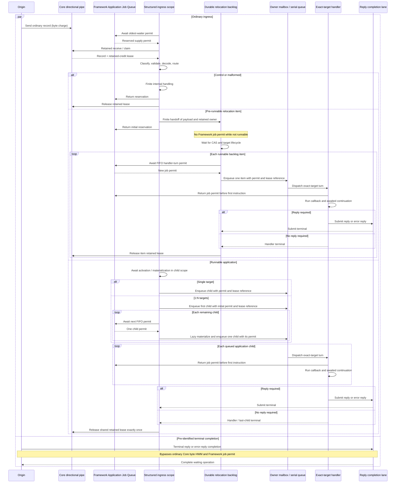

# Core Byte HWM And Application Job Flow

[Spec index](README.en.md) · [Previous: Framework Error Model](32-framework-error-model.en.md)

> **What this chapter defines** — the separation between Core byte-based backpressure and
> Framework job-count admission, and the demand-driven structured flow that carries ordinary
> ingress to handler start.

## 1. Scope

Core HWM and the Framework Application Job Queue limit different resources. They may use the same
profile labels, but they do not share values, units, owners, or release boundaries.

In this document, `flow` does not mean the Kotlin `Flow` public type. It means a language-neutral
execution model in which downstream demand limits upstream progress and cancellation and ownership
propagate structurally across all asynchronous stages, as they do in Kotlin `Flow`. Each language
runtime implements the same contract with its native tasks, coroutines, async queues, or promise
chains.

## 2. Two Separate Capacity Authorities

| Authority | Limited unit | Acquisition or accounting boundary | Release boundary |
|---|---|---|---|
| Core HWM | Sum of physical-frame charges held by each Core application-direction pipe and retained-credit lease charges transferred from that pipe | When a Core send or receive queue owns a frame | Release on ordinary removal; on retained receive, transfer the charge atomically to the lease and release it only at lease terminal |
| Framework Application Job Queue | Host-shared capacity permits: one per application handler turn, while unclassified ordinary ingress occupies one as a pre-receive reservation | Reserve immediately before ordinary ingress receive or claim, then convert it to a handler-turn permit after application classification | For application, the callback's first instruction or a pre-start terminal; for control or malformed, immediately after finite internal handling |

Core accounted bytes include payload bytes and the per-frame metadata charge defined by the Core
contract. The Framework does not weight a job by payload size. An empty-payload job and a
large-payload job each count as one job; the Core retained-credit lease continues to limit the
memory pressure of the large payload.

The Core context budget is an input for calculating and distributing directional pipe HWMs, not one
hard byte cap over the whole context. Each pipe sums only its physical-queue charges and retained
lease charges transferred from that pipe to the application.

The Framework job count is not the Core message or record count. When one record creates a 1:N
dispatch, each exact-target callback turn is one job. Conversely, a control or malformed ordinary
record creates no application job, but uses one shared permit for a finite interval before receive
or claim.

Only supply identifiable before receive as terminal reply or error-reply completion bypasses the
ordinary Core byte-HWM path and the Framework Application Job Queue permit. A runtime does not
classify a record after receive and apply the completion exemption retroactively.

## 3. Demand-Driven Structured Job Flow

Ordinary application ingress receives or claims only after securing a Framework job permit. A
structured ingress scope begins before receive and owns the reserved permit. When retained receive
succeeds, the scope incorporates the Core retained-credit lease as a second independent resource.
The scope carries both resources through these pre-handler stages while preserving their distinct
release boundaries:

1. receive or claim;
2. classification and validation;
3. decode and routing;
4. asynchronous activation or materialization;
5. runnable same-host relay and fanout;
6. owner-mailbox or serial-queue enqueue; and
7. exact-target callback start.

Each stage explicitly transfers ownership to the next stage or releases it at its own terminal. If
work continues after an asynchronous stage returns, that work is a child of the same scope. A stage
must not leave a detached continuation running after its parent scope has released the owner.

Pre-runnable durable relocation staging is an explicit scope boundary. An ordinary relocation
record is received under a shared receive reservation, then hands the payload and retained-byte
ownership off for a finite interval to the ordered durable backlog owner defined by the spec and
ends the initial reservation scope. A backlog item that is not runnable holds no Framework job
permit. After CAS and target lifecycle make the item runnable, each handler turn obtains a new job
permit in FIFO order and starts a new structured job scope.

Ingress of a relocation state chunk the source transmits directly to the target uses a boundary
different from this durable staging. A state chunk is also received under a shared receive
reservation, but the target runtime releases the Core retained lease immediately after copying the
payload into a Framework-owned assembly buffer — unlike the relocation record above, which
transfers retained-byte ownership to the durable backlog, the lease does not follow the assembly
buffer's lifetime. A state chunk holds no application job permit and creates no handler, and the
reservation is returned immediately after the finite copy handoff into the assembly buffer.

When downstream has no permit, upstream receive or child materialization suspends. A runtime does
not replace this behavior with any of the following:

- receiving first without a permit and incrementing a separate counter afterward;
- storing the record in an arbitrary unbounded or hidden side backlog not owned by the spec and
  reacquiring a permit later;
- converting saturation into reject, drop, fixed-delay polling, or busy spin; or
- synthesizing a new permit or reacquiring the same job's permit during asynchronous activation or
  materialization.

### 3.1 End-To-End Sequence

The following sequence is the common state transition implemented by the C++, .NET, JVM
(Java/Kotlin), and Node.js runtimes. Concrete task, coroutine, async-queue, and promise types may
differ, but the participants that own resources and the ordering of the arrows remain the same.

## 4. Ownership And Release Boundaries

An application job permit remains held while waiting in an executor, mailbox, owner serial gate, or
asynchronous pre-handler stage. The common invocation boundary releases it exactly once immediately
before executing the callback's first instruction. An `await`, coroutine suspension, continuation,
or reply wait after handler start does not reacquire the same queue permit. The durable relocation
staging boundary in §3 is the only explicit exception: it releases the initial receive reservation
immediately after backlog handoff, and a runnable handler turn obtains a new permit.

The Core retained-credit lease has a separate lifetime. When the handler or reply submission still
needs the payload, the lease remains held after callback start. A request that needs a reply releases
the lease after reply or error-reply submission reaches success, failure, or cancellation terminal.
A job that needs no reply releases it at handler terminal. A shared lease for a 1:N record follows
the last-child terminal rule in §5.

A flow that ends before callback start because of validation failure, routing failure, cancellation,
source close, or shutdown releases the job permit and retained lease exactly once each. Cleanup by
one owner must not cause early release or double release by the other owner.

## 5. Batch And 1:N Dispatch

When one record creates multiple exact-target callbacks, each child uses one Framework permit. A
runtime does not materialize or publish more children than the permits it has secured.

After enqueueing the first child, the runtime obtains the next permits one at a time in FIFO order
and lazily materializes the remaining children. It does not wait to collect all child permits first.
Children reference the record-level retained lease through a shared owner. The runtime releases the
Core lease exactly once after the last child terminal and any required record-level reply attempt
reach terminal.

## 6. Cancellation And Shutdown

Permit waits, pre-handler stages, and child materialization observe source close, caller
cancellation, and host shutdown. Cancellation propagates to children of the structured scope that
have not started. A job whose callback has started follows that execution policy's terminal rules.

Shutdown does not lose waiters, handoff permits, queued children, or retained leases. It does not
extend shutdown indefinitely to wait for detached work outside the scope.

## 7. Equivalent Language Implementations

Kotlin may use the structured cancellation and backpressure model of coroutines and `Flow`. Java,
C++, .NET, and Node.js do not need to introduce a Kotlin type as a public API or internal dependency.
An implementation is equivalent when it provides the same observable behavior and ownership
structure:

- without demand, upstream ordinary receive does not progress;
- a pre-handler asynchronous child remains inside the parent permit and retained-lease lifetime;
- the sum of reserved ordinary-supply permits and queued pre-handler application jobs never exceeds
  the effective Framework limit;
- Core accounted bytes and Framework job count are measured independently; and
- cancellation and terminal paths release both owners exactly once.

## 8. Contract Test Requirements

Unit or contract tests for each Framework runtime cover at least the following:

- with limit `1`, while the first job waits before callback start, the next ordinary record is not
  received first;
- an asynchronous activation or materialization that outlives its parent call retains both the
  permit and retained lease;
- the job permit is released at the callback's first instruction while the retained lease remains
  until the single-target/no-reply handler terminal, the last 1:N child terminal, or the
  reply/error-reply submission terminal for a reply-required record;
- 1:N dispatch does not materialize more children than secured permits;
- cancellation, validation failure, and shutdown release waiters, permits, and retained leases
  exactly once; and
- terminal reply/error completion progresses independently of ordinary job-flow saturation.

[Framework API](06-framework-api.en.md) defines configuration and profiles,
[Async Execution Policy](05-async-execution-policy.en.md) defines asynchronous callback terminals,
and [Runtime Status](24-runtime-monitoring.en.md) and
[Runtime Metrics](25-runtime-metrics.en.md) define status and metrics. Non-normative implementation
structure follows [Application And Infrastructure Progress Isolation](42-internal-progress-isolation.en.md),
[Receive And Dispatch Loop](46-internal-dispatch-loop.en.md), and
[Payload Ownership And Copying](50-internal-message-ownership.en.md).
