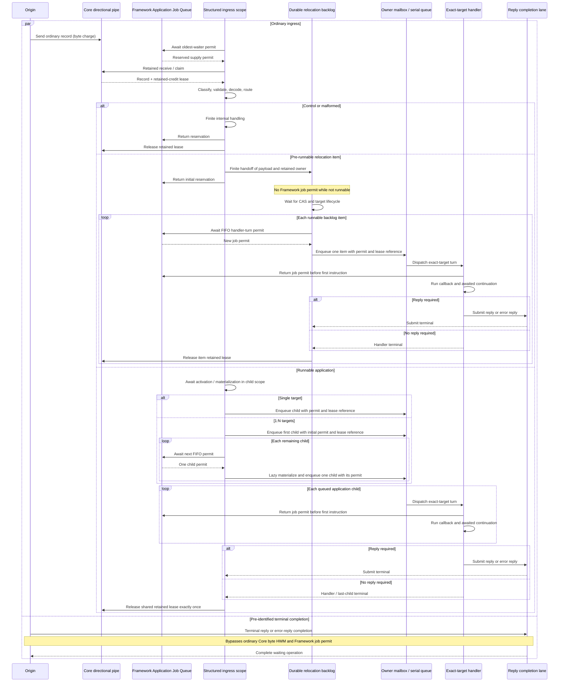

# Core byte HWM과 Application job flow

[스펙 목차](README.ko.md) · [이전: Framework 오류 모델](32-framework-error-model.ko.md)

> **이 장이 정의하는 것** — Core의 byte 기반 backpressure와 Framework의 job 개수 기반
> admission을 분리하고, ordinary ingress가 handler 시작까지 하나의 demand-driven structured
> flow로 진행되는 계약.

## 1. 범위

Core HWM과 Framework Application Job Queue는 서로 다른 자원을 제한한다. 두 한도는 같은
profile 이름을 사용할 수 있지만 값, 단위, owner와 반환 시점을 공유하지 않는다.

이 문서에서 `flow`는 Kotlin `Flow` public type을 뜻하지 않는다. Kotlin `Flow`처럼 downstream
demand가 upstream 진행을 제한하고 취소와 ownership이 비동기 단계 전체에 구조적으로 전파되는
언어 중립 실행 모델을 뜻한다. 각 언어 runtime은 그 언어에 맞는 task, coroutine, async queue 또는
promise chain으로 같은 계약을 구현한다.

## 2. 서로 다른 두 capacity authority

| Authority | 제한 단위 | 획득 또는 계상 경계 | 반환 경계 |
|---|---|---|---|
| Core HWM | 각 Core application-direction pipe가 보유한 physical-frame charge와 그 pipe에서 이전된 retained-credit lease charge의 합 | Core send/receive queue가 frame을 소유할 때 | ordinary removal이면 해제하고, retained receive이면 charge를 lease로 원자적으로 이전하여 lease terminal에서 해제 |
| Framework Application Job Queue | host-shared capacity permit. Application handler turn마다 하나이며 미분류 ordinary ingress는 receive 전에 하나를 reservation으로 점유 | ordinary ingress를 receive·claim하기 직전 reservation하고 application 분류 뒤 handler-turn permit으로 전환 | Application은 callback 첫 instruction 또는 pre-start terminal, control·malformed는 유한한 내부 처리 직후 |

Core accounted byte는 payload byte와 Core 계약이 정한 frame별 metadata charge를 포함한다. Framework는
payload 크기로 job을 가중하지 않는다. 빈 payload job과 큰 payload job은 각각 job 하나이며, 큰 payload의
memory pressure는 Core retained-credit lease가 계속 제한한다.

Core context budget은 방향별 pipe HWM을 계산하고 분배하는 입력이며 context 전체의 단일 hard byte cap이
아니다. 각 pipe는 자신의 physical queue charge와 그 pipe에서 application으로 이전한 retained lease
charge만 합산한다.

Framework job 개수는 Core message나 record 개수와도 같지 않다. 한 record가 1:N dispatch를 만들면 각
exact-target callback turn이 job 하나다. 반대로 control 또는 malformed ordinary record는 application job을
만들지 않지만 receive·claim 전에 shared permit 하나를 유한하게 사용한다.

Pre-receive에 terminal reply 또는 error reply completion으로 식별되는 supply만 ordinary Core byte-HWM
경로와 Framework Application Job Queue permit을 우회한다. Receive 뒤 분류한 record를 completion 예외로
소급해서 처리하지 않는다.

## 3. Demand-driven structured job flow

Ordinary application ingress는 Framework job permit을 확보한 뒤에만 receive·claim한다. Structured
ingress scope는 pre-receive에서 시작하여 reserved permit을 소유하고, retained receive가 성공하면 Core
retained-credit lease를 두 번째 독립 resource로 편입한다. Scope는 두 resource를 다음 pre-handler 단계로
운반하되 각각의 반환 경계를 유지한다.

1. receive 또는 claim
2. classification과 validation
3. decode와 routing
4. 비동기 activation 또는 materialization
5. runnable same-host relay와 fanout
6. owner mailbox 또는 serial queue enqueue
7. exact-target callback 시작

각 단계는 ownership을 다음 단계에 명시적으로 이전하거나 자신의 terminal에서 정리한다. 비동기 단계가
반환된 뒤에도 작업이 계속되면 그 작업은 같은 scope의 child여야 한다. Parent scope가 owner를 반환한 뒤
실행되는 detached continuation을 만들 수 없다.

Relocation의 pre-runnable durable staging은 명시적인 scope 경계다. Ordinary relocation record는 shared
receive reservation으로 receive한 뒤 spec이 정한 ordered durable backlog owner에 payload와 retained-byte
ownership을 유한하게 handoff하고 initial reservation scope를 끝낸다. 아직 runnable하지 않은 backlog
item은 Framework job permit을 유지하지 않는다. CAS와 target lifecycle이 완료되어 item이 runnable해지면
각 handler turn이 FIFO로 새 job permit을 하나씩 얻고 새 structured job scope를 시작한다.

Downstream에 permit이 없으면 upstream receive 또는 child materialization이 suspend한다. 다음 방식으로
대체하지 않는다.

- permit 없이 먼저 receive한 뒤 별도 counter를 증가시키는 방식
- record를 spec이 소유하지 않는 임의의 unbounded 또는 hidden side backlog에 보관한 뒤 permit을 다시 얻는 방식
- 포화를 reject, drop, fixed-delay polling 또는 busy spin으로 바꾸는 방식
- 비동기 activation·materialization에서 새 permit을 합성하거나 같은 job의 permit을 다시 얻는 방식

### 3.1 전체 시퀀스

다음 시퀀스는 C++, .NET, JVM(Java·Kotlin)과 Node.js runtime이 공통으로 구현하는 상태 전이다.
구체적인 task, coroutine, async queue와 promise type은 달라도 participant의 owner와 화살표의 순서는
같아야 한다.

## 4. Ownership과 반환 경계

Application job permit은 executor, mailbox, owner serial gate와 비동기 pre-handler stage에서 기다리는 동안
유지한다. 공통 invocation boundary가 callback의 첫 instruction을 실행하기 직전에 permit을 정확히 한 번
반환한다. Handler가 시작한 뒤의 `await`, coroutine suspension, continuation과 reply 대기는 같은 queue
permit을 다시 얻지 않는다. §3의 relocation durable staging boundary는 initial receive reservation을
backlog handoff 직후 반환하고, runnable handler turn이 새 permit을 얻는 유일한 명시적 예외다.

Core retained-credit lease는 별도 lifetime을 가진다. Payload가 handler나 reply submit에 필요하면 callback
시작 뒤에도 유지한다. Reply가 필요한 request는 reply 또는 error reply submit success, failure 또는
cancellation terminal 뒤에 반환한다. Reply가 필요 없는 job은 handler terminal에서 반환한다.
1:N record의 shared lease는 §5의 마지막 child terminal 규칙을 따른다.

Validation failure, routing failure, cancellation, source close 또는 shutdown처럼 callback 전에 끝난 flow는
job permit과 retained lease를 각각 정확히 한 번 반환한다. 한 owner의 정리가 다른 owner의 조기 반환이나
double release를 일으키지 않아야 한다.

## 5. Batch와 1:N dispatch

한 record가 여러 exact-target callback을 만들 때 child 하나마다 Framework permit 하나를 사용한다. Runtime은
확보한 permit 수보다 많은 child를 먼저 materialize하거나 publish하지 않는다.

첫 child를 enqueue한 뒤 다음 permit을 FIFO로 하나씩 얻어 다음 child를 lazy materialize한다. 모든 child
permit을 먼저 모아서 기다리지 않는다. Child들은 record-level retained lease를 shared owner로 참조하며,
마지막 child terminal과 필요한 record-level reply attempt가 terminal이 된 뒤 Core lease를 정확히 한 번
반환한다.

## 6. 취소와 shutdown

Permit wait, pre-handler stage와 child materialization은 source close, caller cancellation과 host shutdown을
관찰한다. 취소는 structured scope의 아직 시작하지 않은 child에 전파한다. 이미 callback을 시작한 job은
해당 execution policy의 terminal 규칙을 따른다.

Shutdown은 waiter, handoff 중인 permit, queued child와 retained lease를 유실하지 않는다. Scope 밖의 detached
작업을 기다리기 위해 shutdown을 무기한 연장하지 않는다.

## 7. 언어별 동등 구현

Kotlin은 coroutine과 `Flow`의 structured cancellation·backpressure 모델을 사용할 수 있다. Java, C++,
.NET과 Node.js는 Kotlin type을 public API나 내부 dependency로 도입할 필요가 없다. 다음 관찰 가능한
동작과 ownership 구조가 같으면 동등한 구현이다.

- demand가 없으면 upstream ordinary receive가 진행하지 않는다.
- pre-handler 비동기 child는 parent의 permit과 retained lease lifetime 안에 있다.
- reserved ordinary-supply permit과 queued pre-handler application job의 합은 effective Framework limit을
  넘지 않는다.
- Core accounted byte와 Framework job count는 서로 독립적으로 측정된다.
- cancellation과 terminal에서 두 owner가 정확히 한 번 정리된다.

## 8. Contract test 요구사항

각 Framework runtime의 unit 또는 contract test는 최소한 다음을 검증한다.

- limit `1`에서 첫 job이 callback 시작 전 대기할 때 다음 ordinary record를 먼저 receive하지 않는다.
- 비동기 activation 또는 materialization이 parent call 뒤까지 이어져도 permit과 retained lease가 유지된다.
- callback 첫 instruction에서 job permit은 반환되지만 retained lease는 single-target/no-reply handler
  terminal, 1:N 마지막 child terminal 또는 reply-required record의 reply/error-reply submit terminal까지 남는다.
- 1:N dispatch가 확보된 permit보다 많은 child를 미리 materialize하지 않는다.
- cancellation, validation failure와 shutdown에서 waiter, permit과 retained lease가 정확히 한 번 정리된다.
- terminal reply/error completion은 ordinary job flow 포화와 독립적으로 진행한다.

설정과 profile은 [Framework API](06-framework-api.ko.md), 비동기 callback terminal은
[비동기 실행 정책](05-async-execution-policy.ko.md), 상태와 metric은
[Runtime 상태](24-runtime-monitoring.ko.md)와 [Runtime metric](25-runtime-metrics.ko.md)이 정의한다.
비규범 구현 구조는 [application과 infrastructure 실행 분리](42-internal-progress-isolation.ko.md),
[수신과 dispatch loop](46-internal-dispatch-loop.ko.md),
[Payload 소유권과 복사](50-internal-message-ownership.ko.md)를 따른다.
