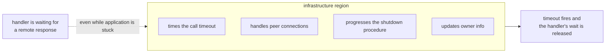
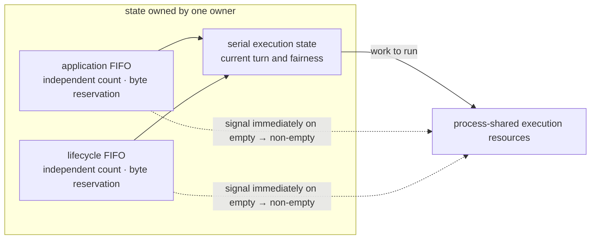

# 42. Application And Infrastructure Execution Separation

> **Document status — internal design, not normative public specification.** This chapter explains implementation structure used to satisfy the linked public contracts. It does not add or change application-visible behavior.

[Internal structure table of contents](README.en.md) · [Previous: 41. Spot · Actor Execution Serialization — splitting queue and execution gate](41-internal-serialization.en.md) · [Next: 43. Operation Completion Confirmation — Only One Finalizes](43-internal-completion.en.md)

> **What this chapter answers** — what must keep progressing while a
> handler is stuck.
>
> **Contract ownership** — the receive bound and backpressure contract
> is owned by [the Framework API](06-framework-api.en.md), and
> the meaning of async completion by
> [the Async Execution Policy](05-async-execution-policy.en.md).
> This chapter covers the **structure** that satisfies that contract and
> the failures that become visible when execution regions are mixed.

While an application handler is waiting for a remote response, who
times out that call? If the timeout also waits in the same line as
the stuck handler, the call never finishes. This document covers how
to prevent that self-deadlock structurally.

## 1. The Core Decision — Split Into Two Execution Regions

Runtime work splits into two groups of different character.

| Region | What it does | Progress condition |
|---|---|---|
| application | Handler execution, Spot · Actor message, timer callback, session callback | Keeps order per Spot owner |
| infrastructure | Peer accept, binding-operation completion, call-completion confirmation, owner-info update, move procedure, shutdown procedure | **Progresses regardless of what application is waiting on** |

The formal spec's requirement is stronger than "progresses
independently" — infrastructure work progresses in **an execution
region the application handler can't occupy**
([Framework API 「8.2 Handler Execution Object And Dependency Lifetime」](06-framework-api.en.md#82-handler-execution-object-and-dependency-lifetime)).

This diagram is the whole of this document. If the arrow breaks, the
handler ends up blocking the very timeout of the response it's
waiting for.

## 2. Why Separation, Not A Reserved Section

Reserving infrastructure slots inside one executor can leave queue room without an execution
agent. Terminal reply/error completion supply and ordinary ingress therefore use separate
progress regions. This separation does not grant ordinary control a shared-capacity bypass.
Only supply identifiable before receive as terminal completion bypasses; every application,
control, or malformed ordinary record first uses the shared permit owned by the
[dispatch loop](46-internal-dispatch-loop.en.md).

Bounds with different purposes are not merged. Core directional byte HWM creates transport
backpressure from bytes currently owned by Core queues; the host application job queue limits jobs before
callback start. Per-owner count/byte queues own ordering and structural isolation, and an
outbound admission waiter owns its send deadline. A shared profile label or unit does not
make their type, calculation, or error meaning the same.

## 3. Observation Doesn't Block Progress

A status subscriber and metric collector **occupy no region's progress
authority.** If a slow subscriber slowed down message processing, the
service would get slower simply because observation was turned on.

The slot sent to a subscriber has a bound, and when it overflows, it
catches up by **coalescing into the latest status per source**. The
stream isn't cut just because the slot filled up
([Runtime Status And Operational Diagnostics 「3. Querying Current State And Observing Changes」](24-runtime-monitoring.en.md#3-querying-current-state-and-observing-changes)).
Conversely, it doesn't slow down message processing either.

## 4. How Resources Are Split Between The Two Regions

§1 only says the two regions must progress independently. How much
resource to give each is the remaining decision, and both extremes are
a problem.

| Allocation | Problem |
|---|---|
| Only one resource for infrastructure | Completion processing, peer management, and moves all pass through that one resource. As peers grow, this becomes the bottleneck |
| Generous for infrastructure too | Conflicts with [41. Spot · Actor Execution Serialization](41-internal-serialization.en.md)'s resource constraint. Combining both allocations exceeds core count |

**Decision — resources are allocated per process, and don't grow with
topology or [Spot](01-glossary.en.md#spot) count.**
Infrastructure work is mostly short and non-blocking, so it's covered
by fewer resources than application.

### Dedicated Resource Doesn't Mean A Physical Thread

**Decision — the contract is not "a dedicated thread" but
"infrastructure progresses whenever application is entirely waiting."**
This is because the four languages' execution models differ.

| Language | Execution resource | How dedication is satisfied |
|---|---|---|
| C++ | OS worker pool | Keeps a dedicated worker for infrastructure |
| .NET | Serial drain over a thread pool | Submits infrastructure work to a separate lane |
| Java | Virtual thread per task | Attaches the infrastructure lane to a separate executor |
| Node | **A single event loop** | Physical separation is impossible. Only the lane is separated |

Node can't physically build a dedicated resource since it has a single
event loop. So the contract is split as follows.

- **Guaranteed** — after an application handler yields with `await`,
  infrastructure work progresses. This holds even when every
  application work item is waiting for a result.
- **Not guaranteed** — progress while an application handler holds the
  CPU without yielding. This isn't a contract violation but the
  application's own responsibility. The guidance is to move a
  long-running synchronous computation to a worker.

`Task`, `Promise`, and virtual thread are all recognized as execution
resources under this contract. The criterion isn't the data type but
**whether it progresses after yielding.**

The observation standard for this decision isn't resource count but
§1's progress condition. Put every application work item into a
waiting state (yielded) at once and confirm infrastructure still
progresses.

## 5. How Far Backpressure Propagates Upward

If the boundary for propagating "sending is blocked" is undefined, a
caller cannot predict whether the same situation waits or fails
immediately.

**Decision — these three steps apply only to the send · publish ·
one-way family.**

1. If the first submission is rejected, **wait for send space to open
   up until a fixed time.**
2. If space opens within the time, submit **once.**
3. If the time runs out first, end with `DeadlineExceeded`
   ([Async Execution Policy 「1.3 One-way submit」](05-async-execution-policy.en.md#13-one-way-submit)).

**The Request family doesn't wait.** If the same runtime's Spot · Actor
queue is full, it ends immediately with `CapacityExceeded`; if it's a
different node's queue, with `Unavailable`
([Spot Messaging 「5.3 Work Put On The Spot Application Queue」](12-spot-messaging.en.md#53-work-put-on-the-spot-application-queue)).
Request has no reason to wait since the caller can receive a result
and judge whether to retry. The send family, by contrast, has no
result to return, so the caller can't judge, and so it waits.

**These steps apply only to the span before the public result is
finalized.** A failure that happens after an already completed call
doesn't fall here — a skipped local target after publish has started,
a dropped one-way during a move, or a target admission failure of a
completed send are examples. These have no result to return to the
caller, so they're left only as observations.

While waiting, that work must not hold execution authority. Holding it
while waiting blocks another request to the same Spot for as long as
it waits for send space.

**Decision — the waiting slot itself also has a bound.** If the
waiting slots are full, it ends immediately with `DeadlineExceeded`
without waiting
([Asynchronous Execution Policy 「1.3 One-Way
Submit」](05-async-execution-policy.en.md#13-one-way-submit)).
The fact of being backpressured itself isn't a value the caller receives.
`Backpressured` isn't a public terminal result. Without a bound, when
the peer is slow, this side's memory would keep growing indefinitely,
following the peer's processing speed.

An ordinary source receives/claims after host-shared application job queue permit readiness.
An application job keeps the permit until actual callback start. After receive, a payload owner
manages native-storage lifetime but does not continue to occupy Core HWM budget. A control or
malformed ordinary record also acquires the permit and releases it immediately after internal
processing. A record received on an ordinary connection cannot gain terminal-completion bypass
after classification.

Terminal reply/error completion supply progresses on a separately identifiable pre-receive
completion path, so correlation and terminal result remain live while ordinary queues are
saturated. When a Core receive queue fills, directional byte HWM carries backpressure to the
sender. Batch and 1:N never publish more jobs than secured permits. [Receive And Dispatch
Loop](46-internal-dispatch-loop.en.md) owns fairness; [Payload Ownership](50-internal-message-ownership.en.md)
owns ordinary record-storage lifetime.

StreamNode client-to-server complete-message `MaxMessageSize` is an independent wire guard.
It checks header plus payload excluding the 6-byte prefix, defaults to `64 KiB`, and does
not apply to server-to-client outbound.

## 6. Don't Silently Drop On Exceeding A Bound

Terminal meaning depends on the kind of bound. Per-owner structural count/byte violations
and outbound admission deadline use the existing owner error or `DeadlineExceeded`.
Host-shared application job queue shortage, however, is a cancellable oldest-waiter wait,
not a public reject/drop reason. Core byte HWM creates transport backpressure. No path adds
an unbounded backlog, polling, busy-spin, silent drop, or replay.

| Bound | Measurement | Saturation meaning |
|---|---|---|
| Core HWM | Directional queued/accounted bytes | Backpressure from Core queue to sender |
| Application job queue | Host-instance reserved/queued/in-use permits | Cancellable shared-cap wait |
| Owner FIFO | Per-owner count and bytes | Structural owner-isolation error |
| Outbound admission waiter | Bounded waiter per operation family | Original send deadline/cancellation result |

## 7. The Implementation Constraint This Decision Produces

Splitting into two regions requires being able to **tell which region
is currently executing.** If infrastructure-only work is called from
an application context, or the reverse, the point of splitting them
disappears.

An execution-context marker identifies the active region, and a wrong
combination **ends in failure without waiting**. Treating it as a wait
would deadlock, and letting it pass would break the separation, so
failure is correct.

Each owner keeps the two regions in physically separate FIFOs. The application FIFO and
lifecycle FIFO do not share count/byte reservations or admission state. Already-accepted
lifecycle work must still be enqueued and run when the application FIFO is full. The
priority and starvation-prevention rule between the FIFOs is described in
[41. Spot And Actor Execution Serialization](41-internal-serialization.en.md).

Increasing the number of owners does not create one execution thread or executor per owner.
The owner holds its FIFOs and execution state, while the resources that run work are shared
by the process. The path that puts the first item into an empty FIFO immediately signals or
calls back into the shared execution resource. Starting the next turn therefore does not
depend on periodically scanning owners.

An execution-context marker distinguishes the active region. Tying this marker only to a
thread kind cannot represent Node's single event loop or a .NET path running over a thread
pool. The execution mechanism may differ by language, but a call from the wrong region must
fail without waiting in every runtime.

## 8. Result To Confirm

- With an application handler kept waiting, that call's timeout fires.
- With an application handler kept waiting, the shutdown procedure
  progresses.
- With an application handler kept waiting, a new peer connection is
  accepted.
- A slow status subscriber doesn't slow down message processing speed.
- When all shared permits are reserved, ordinary ingress waits cancellably while terminal
  completion progresses.
- A full Core receive byte HWM carries backpressure to the sender without dropping a record.
- Owner structural rejection and shared-cap wait have distinct errors and metrics.
- A failure after an already completed call (a skip after publish has
  started, a target failure of a completed send) doesn't change the
  caller's result and is left only as an observation.
- Calling infrastructure-only work from an application context fails
  without waiting.
- Infrastructure execution resources don't grow with topology count or
  Spot count.
- Each owner has separate application/lifecycle FIFOs and admission
  reservations.
- The first work entering an empty FIFO wakes execution resources
  without waiting for a periodic scan.
- Work waiting for send space doesn't hold execution authority.
- When the send-wait slot is full, it fails without waiting.

## Progress Isolation Under Saturation

Only terminal reply/error completion supply bypasses the shared permit. [Receive And Dispatch
Loop](46-internal-dispatch-loop.en.md) owns permit ordering for ordinary/completion progress
isolation. Post-receive storage follows [Payload Ownership](50-internal-message-ownership.en.md),
but it is not Core HWM credit or a separate progress authority.

## Pressure Transitions And Send Completion

The host queue owner evaluates 80% pause and 60% resume hysteresis in the same synchronization
boundary as permit-count changes. On a transition it applies the new absolute state to a snapshot
of supported sockets; a new socket receives the current state before registry publication. Socket
application is serialized per socket and skips stale sequences and an already-applied identical
state. Binding calls run outside queue, registry, and user locks, and close removes the socket from
the registry before proceeding. Because Core and the binding own HWM retry and per-operation
completion, the framework infrastructure domain has no separate `send_ready` waiter or retry
adapter.

---

[Internal structure table of contents](README.en.md) · [Previous: 41. Spot · Actor Execution Serialization](41-internal-serialization.en.md) · [Next: 43. Operation Completion Confirmation](43-internal-completion.en.md)
