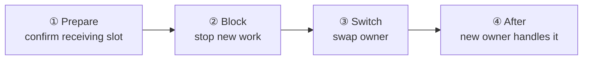

# 44. Message Continuity During A Move

> **Document status — internal design, not normative public specification.** This chapter explains implementation structure used to satisfy the linked public contracts. It does not add or change application-visible behavior.

[Internal structure table of contents](README.en.md) · [Previous: 43. Operation Completion Confirmation — Only One Finalizes](43-internal-completion.en.md) · [Next: 45. Target Selection And Route Cache](45-internal-routing-and-cache.en.md)

> **What this chapter answers** — where a message addressed to an
> object goes while that object is moving to another node.
>
> **Contract ownership** — the complete move sequence is owned by
> [Complete Actor And Spot Relocation Flow](28-relocation-flow.en.md),
> the host operation by
> [Complete Host Relocation Flow](30-host-relocation-flow.en.md),
> and the store contract by [Location Runtime](21-location-runtime.en.md). This
> chapter covers the **structure** that satisfies that contract and
> the failures that become visible when a move boundary is violated.

While a running object moves to another node, where does a message
addressed to it go? This document covers **how a message is handled at
each boundary**, rather than the move procedure itself. The formal spec owns the step
order and Store contract. [52. Relocation Handoff State Transitions](52-internal-relocation-handoff.en.md)
explains the complete state transition every runtime follows.

## 1. Four Boundaries

From a message's point of view, a move splits into four spans. Each span handles an
arriving message differently.

| Span | Arriving message | Reason |
|---|---|---|
| ① Prepare | **Handled as usual** | If there's no slot to receive it, the move doesn't even start. Blocking before this check leaves only wasted stopped time on failure |
| ② Block | **Held, then handed to the new owner** | Dropping it loses it; rejecting it exposes the move to the caller |
| ③ Switch | Held or fails | This span must be as short as possible |
| ④ After | **Delivered to the new owner even if it arrives at the old address** | The sender may still know the old location |

The order in ① is a design decision — **new work on the source isn't
blocked until the receiving slot is confirmed**
([Complete Host Relocation Flow 「8.2 The Common Order Every Actor And Spot Follows」](30-host-relocation-flow.en.md#82-the-common-order-every-actor-and-spot-follows)).
Reversed, if the move fails for lack of a slot, that object would have
been stopped for no reason at all.

## 2. Span ② — Holding And Order

A message arriving after the block is held in a relocation slot. The
queue has no relocation-specific bound on item count or stored size
([Complete Host Relocation Flow 「9. Moving Pending Messages, Timers, And Sessions」](30-host-relocation-flow.en.md#9-moving-pending-messages-timers-and-sessions)).
Limits on an individual message, transport, deadline, and cancellation remain in force.

There's one rule for order — **restored prior work runs before the
messages held during the move**
([Spot Model 「3.1 During Relocation, The Temporary Queue Is Checked First」](11-spot-model.en.md#31-during-relocation-the-temporary-queue-is-checked-first)).
Reversed, a request already in the queue before the move would be
processed after a newly arrived request during the move, flipping send
order against processing order.

The guarantee scope only reaches **acceptance order per target.**
There's no global order guarantee across messages arriving from
different paths.

### Where It Meets Execution Serialization

The structure from
[41. Spot · Actor Execution Serialization](41-internal-serialization.en.md)
comes into play here again. Holding and restoring must be **splittable
per Actor.** When the unit of a move is a single Actor, only that
Actor's remaining work must be picked out. If the per-Actor queue is
merged into one just because it's `SpotWide`, it can't be split at
this point — this is where the reason the queue must be per Actor
while only the execution authority is shared comes back up.

## 3. Span ④ — A Message Arriving At The Old Address

Even after a move finishes, the sender may still know the old location
for a while. Handing that message off to the new owner is
**[Message Follow](01-glossary.en.md#message-follow)**, and
its default active period is **30 seconds**
([Location Runtime 「6.3 Delivering A Message Arriving At A Previous Owner To The New Owner」](21-location-runtime.en.md#63-delivering-a-message-arriving-at-a-previous-owner-to-the-new-owner)).

| Limit | Value and scope |
|---|---|
| Active period | 30 seconds by default. Per move |
| Forwarding hops | Up to 8 chained forwards |
| Forwarding volume | No relocation-specific bound |

| Situation | Result the caller observes |
|---|---|
| The forwarding path forms a loop and returns to the first node | `Unavailable` |
| Object generation doesn't match | `InvalidOperation` |

When forwarding, the call identifier, object generation, payload, and
response path are kept exactly as-is. Not keeping them means
[43. Operation Completion Confirmation](43-internal-completion.en.md)'s
completion slot can't be found, and the call remains incomplete until timeout.

### This Isn't An Optional Feature

**Session connection and relay depend on this forwarding path**
([Session Actor Dispatch 「4. How A Session Holds An Actor Route」](20-session-actor-dispatch.en.md#4-how-a-session-holds-an-actor-route)).
Without it, a session connected to a moved Actor does not work correctly. Message Follow
is therefore a path required for session behavior, not an optional performance
optimization.

## 4. Span ③ — The Asymmetry Before And After Owner Switch

Even after stopping application dispatch, the source keeps relaying messages arriving at
the old address to the target. The target restores queue work and timers accepted before
Capture exactly once from the direct chunk transfer (command 52, sourced from source
memory); source doesn't relay them. Post-capture
relay preserves order within the same TCP connection.
After sending every message received before cutover, the source puts cutover as a
`[send]` on the same connection, letting the target know every earlier relay has arrived. Relocation
adds no per-message ACK, numeric high-water, separate journal, or capacity limit here.

The target's saved-work, relay, and temporary spans form an ordered durable backlog before
dispatch. An ordinary record entering one of these spans still acquires a shared
Application Job Queue reservation before receive and returns it immediately after a
finite handoff into a target retained-byte owner. A backlog item that isn't runnable yet
holds no live queued-job permit. The target sends relay-ready only after byte ownership
exists for every staged payload.

After factory, Restore, and temporary queue preparation, the target conditionally changes
the Location Store owner from source to target when cutover arrives or 1,000 ms elapses
after the relay-ready reply. Only the target performs this CAS. Neither the source nor
the Session owner changes owner based on a timeout or local mirror.

Failure handling changes across this one CAS.

| Timing | On failure |
|---|---|
| Explicit failure before relay-ready is accepted | The source remains owner. The target queue doesn't execute, and source restores its queue from its retained source-memory payload and ingress-hold original. |
| After relay-ready is accepted, before successful CAS | Removes the target object and queue without reopening source dispatch. Cutover-submit success or failure doesn't change this handling; Session cleans under its own seal timeout. |
| After CAS | It isn't rolled back to the source. The target queue opens, and Message Follow delivers messages arriving late at the old address. |

For a retryable Store failure or indeterminate response, the target repeats CAS and read
with the same fence and `RelocationId` until Restore validity expires. If target ownership
isn't confirmed by then, it records a `location_update_failed` Error and removes the
prepared Actor or Spot, temporary queue, and relocation state. It sends no Session route
update.

The target fixes a durable backlog of existing work first, relay before cutover next, and
work that entered the temporary queue last, then switches to the regular route. It
finishes required lifecycle callbacks, makes dispatch runnable, and acquires one shared
queued-job permit for each backlog handler turn before placing that turn on the live
queue. Actual handler start returns the permit, so permits aren't reserved for the whole
backlog at once. A payload waiting for a permit remains under the target retained-byte
owner. There's no global ordering promise
between source relay and messages arriving directly at the target over another TCP
connection. Only order after acceptance into the target queue is preserved.

After cutover submit reaches a success or failure terminal, the source waits for no target
completion response and changes to Message Follow. After CAS and queue opening, the target sends a Session route update for a bound
Actor. Neither cutover nor Session route update has a reply. A late or duplicate control
only records a Warning; it doesn't change owner, route, or queue again.

Once relay-ready is accepted, source restoration is forbidden. The source retains every
source queued-job permit and source payload byte owner until the subsequent one-way
cutover submit, attempted once, reaches a success or failure terminal. That terminal
permanently closes source dispatch and releases those owners exactly once. No target
completion ACK is added. Only an explicit abort before relay-ready keeps the source
owners and cleans target staged-byte ownership.

### Therefore Post-CAS Steps Must Be Repeatable

Because post-CAS work isn't rolled back to the source, opening the target queue and
sending the Session route update under the same relocation identity must not mutate current state a
second time. This doesn't require durably journaling every message or adding an
application ACK. Ordinary server delivery relies on TCP, while a request completes under
its existing correlation and deadline.

## 5. Don't Split The Move Path Into Multiple Branches

**Decision — one state-transition rule owns the move of one object or
bundle.**

The formal spec only decides the step order and progress-stage values,
not the component decomposition. But splitting into branches means
§4's asymmetric handling gets reimplemented per branch, and when a
failure happens in the middle, **which branch owns cleanup
responsibility** can't be read off.

Splitting a move path into several branches with unrelated stage-value
sets duplicates the same transitions. One transition rule owns the
move of one object or group. This internals decision fixes the component
boundary that the formal spec leaves undecided.

## 6. Result To Confirm

- New work on the source isn't blocked until the receiving-slot check
  finishes.
- A message arriving after the block isn't lost and is delivered to
  the new owner.
- Restored prior work runs before messages held during the move.
- A call is not rejected because of a relocation-specific record-count or byte bound.
- A message sent to the old address right after a move is delivered to
  the new owner within 30 seconds, with the call identifier and
  response path preserved.
- Exceeding 8 forwards ends in `Unavailable`.
- If the owner switch ends in `Conflict`, no value in the store
  changes.
- If it fails after the owner switch, the source doesn't become owner
  again.
- Receiving the same restore request twice produces the same result as
  once.
- When the move unit is a single Actor, only that Actor's remaining
  work is split out and moved.

---

[Internal structure table of contents](README.en.md) · [Previous: 43. Operation Completion Confirmation](43-internal-completion.en.md) · [Next: 45. Target Selection And Route Cache](45-internal-routing-and-cache.en.md)
