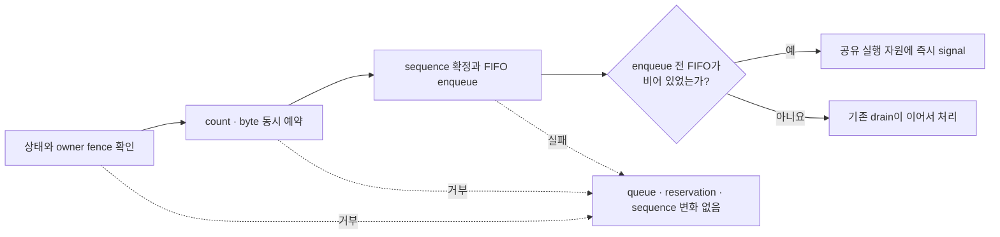
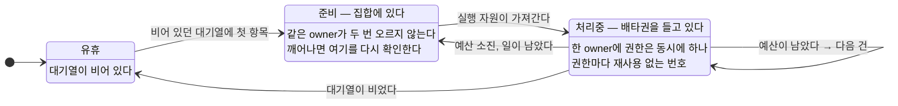
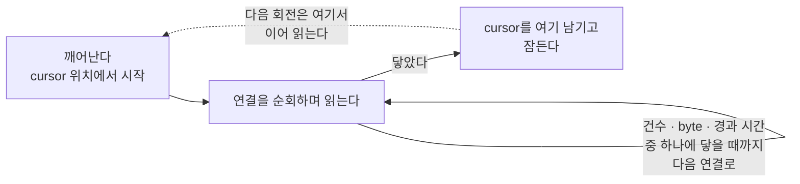

# 46. 수신과 dispatch 루프

> **문서 성격 — 공개 규범 스펙이 아닌 내부 설계 문서.** 이 장은 연결된 공개 계약을 만족시키는 구현 구조를 설명한다. Application이 관찰하는 동작을 추가하거나 변경하지 않는다.

[내부 구조 목차](README.ko.md) · [이전: 45. target 선택과 route cache](45-internal-routing-and-cache.ko.md) · [다음: 47. 객체 종류와 활성화](47-internal-object-lifecycle.ko.md)

> **이 장이 답하는 것** — 수신한 message를 execution gate까지 나르는 구간.
>
> **계약 소유** — 수신 공정성은 [Transport liveness](29-transport-liveness.ko.md)가,
> 대기열 한도는 [Framework API](06-framework-api.ko.md)가 소유한다.
> 이 장은 그 계약을 만족시키는 **구조**와, 수신·dispatch 경계에서 나타나는 실패를 다룬다.

수신한 message를 실행 gate까지 나르는 구간이다. message 하나마다 깨우느냐 모아서
처리하느냐가 처리량을 결정하고, 무엇으로 깨우느냐가 지연 하한을 결정한다.

## 1. 준비된 owner 집합을 상태로 유지한다

### 문제

message가 도착할 때마다 실행 자원을 깨우면, 깨우기 비용이 message 수에 비례한다.
그렇다고 알림을 한 번만 보내는 방식(변화 시점에만 알림)을 쓰면, 알림과 처리 사이에
도착한 message를 놓친다.

### 결정

**지금 처리할 일이 있는 owner가 무엇인지를 상태로 유지한다.** 이 상태는 "무엇이
바뀌었다"는 알림이 아니라 "지금 이 상태다"를 나타내며, 같은 owner가 중복해서 들어가지
않는다.

만족해야 하는 것은 **결과**이지 자료구조가 아니다 — 알림이 유실되어도 처리할 일이 남은
owner는 결국 처리된다(missed wakeup 없음), 그리고 같은 owner가 두 번 대기열에 오르지
않는다. 집합이든 비트맵이든 침입형 목록이든 이 둘을 만족하면 된다. 아래 설명은 집합을
예로 든 것이다.

- 비어 있던 queue에 첫 항목이 들어가면 owner를 집합에 넣는다.
- 실행 자원은 집합에서 owner를 하나 가져와 처리한다.
- 처리 뒤 일이 남아 있으면 다시 넣고, 비었으면 뺀다.
- **깨어난 뒤에는 항상 이 집합을 다시 확인한다.**

마지막 항목이 핵심이다. 알림을 놓쳤더라도 집합을 다시 보면 남은 일을 찾는다. 알림
유실이 곧 message 유실이 되지 않는다.

## 2. 넣을지 판단하는 것과 넣는 것을 쪼개지 않는다

message를 어느 owner의 대기열에 넣을지 정하려면 여러 조건을 본다 — 그 owner가 아직 이
node에 있는지, 자리가 있는지, 이동으로 봉인되지 않았는지.

**결정 — 이 확인들과 실제로 넣는 동작이 같은 구간 안에서 끝난다. 확인과 넣기 사이에
owner가 바뀌지 않는다.**

쪼개면 이런 일이 생긴다 — 확인할 때는 이 node가 owner였는데, 넣기 직전에 이동이 끝나
owner가 바뀐다. message는 **더 이상 owner가 아닌 node의 대기열**에 들어가고, 그 대기열은
아무도 처리하지 않는다. 보낸 쪽은 timeout까지 기다린다.

한 구간 안에서 다음을 하나의 commit으로 처리한다.

1. host와 topology가 지금 application 작업을 받는 상태인가
2. 대상 객체가 이 node에 있고 owner 정보가 유효한가
3. 이동 봉인·생성 대기·session 연결 대기 중이 아닌가
4. 해당 lane의 건수와 byte를 함께 예약할 수 있는가
   ([47. 객체 종류와 활성화 「6. 메모리 회계를 어느 단위로 하는가」](47-internal-object-lifecycle.ko.md#6-메모리-회계를-어느-단위로-하는가)의 byte 한도)
5. 수락 순서를 나타내는 sequence를 확정하고 FIFO 뒤에 넣는다
6. 비어 있던 FIFO가 채워졌으면 §1의 준비 상태를 만들고 실행 자원에 즉시 알린다

**결정 — 확인에 실패한 message는 대기열에 나타나지 않는다.** 일단 넣었다가 빼는 방식으로
만들지 않는다. 넣었다 빼면 그 사이에 실행될 수 있고, 뺐다는 사실을 관측에서 구분할 수도
없다. 응답을 기다리는 호출은 실패 이유를 결과로 받는다. 예약이나 enqueue에 실패한 경우에도
건수·byte 사용량과 수락 sequence는 이전 값 그대로다. 실패한 시도가 다음 정상 작업의
순서나 admission 가능 여부를 바꾸면 안 된다.

**언어별 재량.** 이 구간을 잠금으로 만들지 다른 방법으로 만들지는 자유다. 구간이 길면
그 자체가 병목이 되므로 **확인만 하고 넣는 것까지만** 넣는다 — 역직렬화나 handler 조회
같은 일은 이 구간 밖에서 한다([50. Payload 소유권과 복사 「6. 역직렬화를 언제 하는가」](50-internal-message-ownership.ko.md#6-역직렬화를-언제-하는가)).

## 3. owner를 가져올 때 배타권을 함께 가져온다

한 owner를 두 실행 자원이 동시에 가져가면 직렬 실행이 깨진다. 그래서 가져오기는
**배타권 획득을 겸한다** — 한 owner의 처리 권한은 동시에 하나만 존재한다.

여기에 함정이 하나 있다. 처리 권한을 반납하고 다시 가져오는 사이에 다른 실행 자원이
같은 owner를 가져갈 수 있고, 그 뒤에 도착한 늦은 완료가 **이전 권한의 것인지 지금
권한의 것인지 구분되지 않는다.** 값이 같아 보이지만 다른 시점인 상태다.

**결정 — 처리 권한마다 재사용하지 않는 번호를 붙인다.** 늦게 도착한 완료는 자기가 들고
있던 번호와 현재 번호를 비교해 자기 것인지 판단한다.

## 4. 한 번 가져오면 모아서 처리한다

owner를 가져오는 비용과 gate를 얻는 비용은 message 하나당 한 번씩 낼 필요가 없다.

이 한도가 막으려는 것은 **한 owner가 실행 자원을 너무 오래 잡고 있는 것**이다. 그러니
재야 하는 값은 **잡고 있던 시간**이다.

**결정 — 한 번 가져왔으면 정해진 시간 예산 안에서 여러 건을 이어서 처리한다.** 한 건을
끝낼 때마다 예산이 남았는지 보고, 남았으면 다음 건을 처리하고 아니면 남은 일을 집합에
되돌리고 권한을 놓는다.

건수를 기준으로 삼지 않는다 — [47. 객체 종류와 활성화 「6. 메모리 회계를 어느 단위로 하는가」](47-internal-object-lifecycle.ko.md#6-메모리-회계를-어느-단위로-하는가)과
같은 이유다. 같은 100건이라도 어떤 handler는 1 ms에 끝나고 어떤 handler는 1초를 쓴다.
건수는 점유 시간을 예측하지 못한다.

시간 예산은 **한 건이 끝난 경계에서만** 확인할 수 있다. 실행 중인 handler를 중간에 끊지
않으므로, handler 하나가 예산보다 오래 걸리면 그만큼은 넘긴다. 이것은 이 한도가 막는
대상이 아니다 — 그건 handler 작성의 문제이고, 여기서 막는 것은 **짧은 작업 여러 건이
쌓여 한 owner가 계속 점유하는 것**이다.

시계를 읽는 비용이 부담되면 byte 합계를 보조로 쓸 수 있다 — handler 처리 시간이 payload
크기에 대체로 비례하는 경우에 한해서다. 그 관계가 성립하지 않는 handler가 섞여 있으면
byte도 예측하지 못하므로, 보조는 보조로만 두고 시간 예산을 없애지 않는다.

### §1~4를 한 그림으로

owner 하나가 지나는 상태다. **집합에 있음**과 **처리 권한을 들고 있음**은 다른 상태이며,
같은 owner가 두 상태에 동시에 있지 않는다.

**`유휴 → 준비`는 §2의 확인·넣기 구간 안에서 일어난다.** 밖으로 빼면 확인과 넣기 사이에
owner가 바뀌어, 더 이상 owner가 아닌 node의 대기열에 message가 들어간다.

**`준비 → 처리중`이 배타권 획득을 겸한다(§3).** 권한마다 재사용하지 않는 번호를 붙이는
이유는 `처리중 → 준비 → 처리중`을 돈 뒤 도착한 늦은 완료가 어느 권한의 것인지 구분해야
하기 때문이다.

**`처리중 → 준비` 화살표가 §4의 시간 예산이 하는 일이다.** 이 화살표가 없으면 짧은 작업이
계속 도착하는 owner가 실행 자원을 놓지 않는다.

## 5. 비어 있던 FIFO가 채워지면 즉시 깨운다

**결정 — 작업 도착이 실행을 직접 깨운다.** Owner의 application 또는 lifecycle FIFO가
비어 있다가 채워지는 순간, enqueue를 commit한 경로가 process 공유 실행 자원에 signal이나
callback을 보낸다. C++처럼 대기 중인 worker를 깨우거나, .NET·JVM처럼 drain을 executor에
예약하거나, Node처럼 다음 event-loop turn을 예약하는 차이는 허용한다. 네 방식 모두 새
작업이 도착한 사건을 원인으로 실행을 시작한다.

주기적 polling은 정상 처리의 시작 조건이 아니다. Polling은 유휴 상태에서도 계속 실행
자원을 사용하며, poll 주기만큼 지연 하한을 만든다. 장애 진단이나 누락된 wakeup을 검출하는
감시 절차가 있더라도, 그 절차가 message 처리의 정확성과 정상 지연을 담당하면 안 된다.

깨운 뒤에는 §1의 마지막 규칙대로 준비된 owner 상태를 다시 확인한다. Signal은 처리할
작업 자체가 아니라 상태를 다시 확인하게 만드는 계기이므로, 여러 signal을 하나로 합쳐도
작업을 잃지 않는다.

### MeshNode socket option은 송·수신 방향을 따로 전달한다

RouteMesh MeshNode의 socket 설정은 하나의 HWM이나 timeout으로 합치지 않는다.
`SendHighWaterMark`는 송신 queue에, `ReceiveHighWaterMark`는 수신 queue에 적용한다.
`SendTimeout`과 `ReceiveTimeout`도 같은 방향 규칙으로 각각의 socket option에 전달한다.
Mailbox 두 상한은 이 방향별 socket option과 별도의 설정이다. RouteMesh SS에는
Framework-level `MaxMessageSize` 설정이나 complete-message 상한을 추가하지 않는다.

이 값들은 MeshNode가 시작되기 전에 확정되어 bind 경로에 전달된다. 따라서 수신 HWM을
송신 HWM에서 추론하거나 수신 timeout을 send timeout의 별칭으로 처리하면 안 된다. 이
구조는 [RouteMesh topology](07-channel-topology.ko.md)와
[MeshNode startup](13-mesh-node.ko.md)이 정한 public 설정을 runtime 경계에서
보존하기 위한 것이다.

## 6. 소켓에서 한 번에 여러 건을 읽는다

§3은 owner를 가져온 뒤 모아서 처리하는 이야기였다. 그 앞 단계 — **소켓에서 꺼내는
단계**에도 같은 문제가 있다.

한 번 깨어났을 때 소켓에서 한 건만 읽고 돌아가면, 쌓여 있는 message 수만큼 깨우기와
읽기 호출이 반복된다. 부하가 높을수록 비용이 커지는 방향이라 정확히 반대로 동작한다.

**결정 — 한 번 깨어났을 때 한도 안에서 여러 건을 이어서 읽는다.** 한도가 필요한 이유는
§3과 같다. 상대가 계속 보내는 동안 무한정 읽으면 그 연결 하나가 수신 단계를 독점하고,
다른 연결과 binding operation completion 처리가 밀린다.

**결정 — 한도는 건수·byte·경과 시간 셋을 함께 두고 먼저 닿는 것을 적용한다.** 건수만
두면 큰 message에서 시간이 길어지고, 시간만 두면 작은 message에서 시계를 너무 자주 읽는다.

**결정 — 다음 회전은 이번에 멈춘 연결의 다음부터 시작한다.** 항상 처음부터 순회하면
앞쪽 연결이 계속 먼저 처리되어, 상한을 두어도 뒤쪽 연결이 밀린다.

이 규칙은 **모든 multi-connection 수신 경로**에 적용한다 — fanout뿐 아니라
node 여럿이 이름으로 서로를 찾는 [RouteMesh](01-glossary.ko.md#routemesh),
ClientServer, service connection, STREAM이 모두 대상이다
([Transport liveness](29-transport-liveness.ko.md)).

한도에 걸려 남은 것이 있으면 다시 깨어날 때 이어서 읽는다. §1의 규칙이 여기서도
적용된다 — 남았는지는 상태를 다시 확인해서 안다.

한 번 깨어났을 때 연결 셋을 도는 모양이다. 회전 cursor가 **이번에 멈춘 자리**를 기억하는
것이 이 그림의 요점이다.

세 조건(건수·byte·경과 시간) 중 하나에 닿아야만 멈추고 cursor를 남긴다 — 그 전까지는
연결을 옮겨 가며 계속 읽는다. **cursor를 남기지 않으면** 다음 회전이 항상 앞쪽 연결부터
다시 시작해, 상한을 두어도 뒤쪽 연결이 밀린다.

## 7. Timer 자원을 등록 수에 비례시키지 않는다

Spot마다 timer를 여러 개 등록할 수 있으므로 timer 수는 Spot 수보다 빠르게 늘어난다.
Spot 10,000개에 timer를 두 개씩 등록하면 timer가 20,000개다.

**결정 — timer는 공유 scheduler 하나가 관리한다. 등록마다 전용 자원을 만들지 않는다.**

등록한 timer마다 자원을 만드는 방식과 하나의 scheduler가 모두 관리하는 방식은 필요한
자원 수가 다르다.

| 방식 | 1만 Spot × timer 2개 |
|---|---|
| 등록마다 전용 자원(OS timer, 대기 루프, 지연 호출) | 그 자원이 **2만 개** |
| **공유 scheduler + 마감 시각 우선순위 대기열** | 스레드 하나와 대기열 항목 2만 개 |

공유 scheduler 방식이 공통 기준이다. Queue 항목 수는 같지만 scheduler와 core thread는
하나만 필요하다. Scheduler는 모든 Spot의 timer를 마감 시각 우선순위 queue에서 관리한다.

### 늦은 tick 처리는 application이 고른다

주기를 넘겨 늦게 실행될 때 지나간 tick을 어떻게 할지는 **공개 option**이다 — 건너뛰고
현재 것만, 정해진 개수까지 따라잡기, 다음 예정을 완료 시점 기준으로 다시 계산하기
([Stage wrapper on Spot 「5. Timer」](17-stage-wrapper-on-spot.ko.md#5-timer)). 이 option은 세
동작과 각 이름을 공개 계약으로 고정한다.

internals가 이 중 하나를 골라 고정하지 않는다. 특히 **"다음 예약을 처리 완료 뒤에 한다"는
셋 중 하나(고정 지연)일 뿐이며, 고정 주기를 없애는 규칙이 아니다.**

**결정 — 기본 동작은 밀린 tick을 하나로 합치는 것이다.** spec이 "중복 만료를 한 번의
pending record로 합칠 수 있다"고 허용한다
([비동기 실행 정책 「5. Spot timer」](05-async-execution-policy.ko.md#5-spot-timer)). 다만 application이
따라잡기를 골랐다면 **그 option이 정한 개수까지가 상한**이며, internals가 하나로 줄이지
않는다.

**결정 — tick 통계를 무한정 쌓지 않는다.** 전달한 tick과 실패 기록을 timer 수명 동안
계속 누적하면 오래 실행되는 timer가 사용하는 메모리도 계속 증가한다.

### tick이 실행 권한으로 들어가는 경로

timer callback은 그 Spot의 실행 권한을 거쳐 실행된다. `SpotWide`에서는 공유 권한을,
`PerActor`에서는 **timer 이름별 권한**을 쓴다([41. Spot·Actor 실행 직렬화](41-internal-serialization.ko.md)).
timer가 자기 권한을 얻지 못하면 그 tick은 보관 자리에 남았다가 다음에 다시 시도한다.

## 8. 수신 처리와 상태 변경을 분리한다

수신 콜백은 받은 데이터의 소유권을 runtime 쪽 값으로 옮기고 **바로 반환한다.** 그
안에서 handler를 부르거나 [Spot](01-glossary.ko.md#spot) 상태를 바꾸지 않는다.

수신 문맥은 대개 전송 계층이 소유하므로 여기서 오래 머물면 그 연결의 다른 수신이
밀린다. 또한 [41. Spot·Actor 실행 직렬화](41-internal-serialization.ko.md)의 실행 권한을 거치지
않고 상태를 바꾸는 경로가 생긴다.

형식 검사는 handler를 부르기 전에 끝낸다. 형식이 맞지 않는 입력은 handler에 도달하지
않고, 응답을 기다리는 호출은 `ProtocolError`로([Framework 오류 모델 「5. `Request` 완료와 실패」](32-framework-error-model.ko.md#5-request-완료와-실패)),
기다리지 않는 호출은 기록만 남기고 끝난다.

## 9. 확인할 결과

- message가 연속으로 도착할 때 깨우기 횟수가 message 수보다 적다.
- 확인을 통과하지 못한 message가 대기열에 나타나지 않는다.
- 확인 시점과 넣는 시점 사이에 owner가 바뀐 message가 옛 owner의 대기열에 들어가지 않는다.
- 한 owner의 처리 권한이 동시에 하나만 존재한다.
- 처리 권한을 반납했다가 다시 얻은 뒤, 이전 권한 시점의 늦은 완료가 현재 처리에 섞이지
  않는다.
- 한 owner가 시간 예산을 소진하면 남은 일을 두고 다른 owner가 진행한다.
- 짧은 작업이 계속 도착해도 한 owner가 실행 자원을 무한정 점유하지 않는다.
- 깨어난 뒤 준비된 owner 집합을 다시 확인하므로, 알림이 유실되어도 남은 message가
  처리된다.
- 한 번 깨어났을 때 소켓에서 여러 건을 읽고, 한도에 걸리면 남은 것을 다음에 이어 읽는다.
- 한 연결이 계속 보내는 동안에도 다른 연결의 수신이 진행된다.
- 수신 한도가 건수·byte·경과 시간 셋 중 먼저 닿는 것으로 끊긴다.
- 다음 수신 회전이 이번에 멈춘 연결의 다음부터 시작한다.
- 한 socket이 여러 peer를 대표할 때 회계가 peer 단위로 이루어진다.
- 수신 콜백 안에서 handler가 실행되지 않는다.
- 형식이 맞지 않는 입력이 handler에 도달하지 않는다.
- timer 자원 수가 등록된 timer 수에 비례해 늘지 않는다.
- 기본 option에서 주기보다 처리가 오래 걸리면 밀린 tick이 하나로 합쳐진다.
- 따라잡기 option을 고른 timer는 그 option이 정한 개수까지 밀린 tick을 전달한다.
- 오래 도는 timer가 tick 통계로 메모리를 계속 늘리지 않는다.

## Shared supply permit, readiness와 fairness

Pre-receive에 terminal reply/error completion으로 식별되는 supply만 shared permit과 ordinary Core HWM 경로를
우회한다. Ordinary connection에서 먼저 receive한 뒤 classify한 record에는 이 우회를 적용하지 않는다.
그 밖의 application, control, malformed ordinary record는 receive/claim 전에 같은 host-instance permit을
얻는다. Source마다 outstanding waiter는 하나이며 oldest waiter 순서로 handoff한다. Batch를 처리한 source는
tail로 이동하고 batch·1:N은 확보한 permit 수보다 많은 application job을 게시하지 않는다.

Application permit은 실제 exact-target callback 첫 instruction에서 반환하고 control·malformed permit은
내부 처리 직후 반환한다. Cancellation, source close와 shutdown은 waiter와 handoff permit을 정확히 한 번
정리한다. Same-host relay, fanout, serial owner와 relocation 경로는 permit 반환에 필요한 gate·execution
authority·resource를 쥔 채 같은 authority의 새 permit acquire를 기다려서는 안 된다. 지속 wait/capacity
cycle은 우회 근거가 아니라 protocol/runtime bug다. Ordinary record storage 수명은
[Payload 소유권](50-internal-message-ownership.ko.md)이 소유한다.

## Permit 변경과 pressure 평가

Reserved permit 획득·queued 전환·release는 permits in use와 pressure 상태를 같은 queue owner 경계에서
갱신한다. Reserved에서 queued로 이동할 때 합계가 같으면 전이를 다시 만들지 않는다. `running`은
pause permit count 이상, `paused`는 resume permit count 이하에서만 바뀐다. Shutdown은 마지막 상태 적용을
기다리느라 무기한 지연되지 않으며 관측 counter를 정리해도 현재 상태와 current pause duration은 유지한다.

---

[내부 구조 목차](README.ko.md) · [이전: 45. target 선택과 route cache](45-internal-routing-and-cache.ko.md) · [다음: 47. 객체 종류와 활성화](47-internal-object-lifecycle.ko.md)
