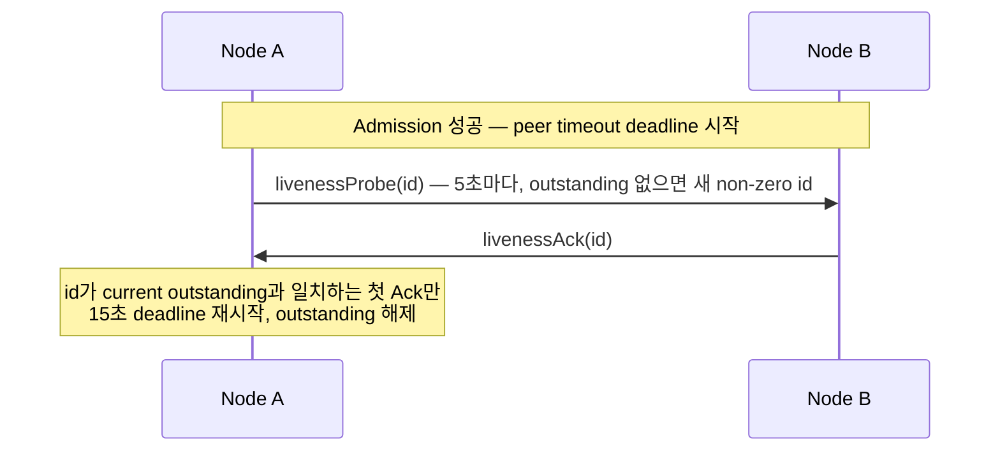

# 51. Service wire protocol

> **문서 성격 — 공개 규범 스펙이 아닌 내부 설계 문서.** 이 장은 연결된 공개 계약을 만족시키는 구현 구조를 설명한다. Application이 관찰하는 동작을 추가하거나 변경하지 않는다.

[내부 구조 목차](README.ko.md) · [이전: 50. Payload 소유권과 복사](50-internal-message-ownership.ko.md) · [다음: 52. Relocation handoff 상태 전이](52-internal-relocation-handoff.ko.md)

> **이 장이 답하는 것** — node 사이에 오가는 byte 형식과 command 목록.
>
> **계약 소유** — `framework/runtime/protocol/service-wire-v1.schema.json`이 정본이다.
> 이 장은 schema가 정한 field 관계와 검증 순서를 설명하며, 다른 장과 달리
> 결정·재량·확인할 결과 구분을 적용하지 않는다.
>
> **함께 보는 계약** — [계층 경계와 식별자](40-internal-layering.ko.md) ·
> [Location runtime](21-location-runtime.ko.md) ·
> [Redis Relocation Store](23-relocation-store-redis.ko.md) ·
> [Transport liveness](29-transport-liveness.ko.md) ·
> [Relocation handoff 상태 전이](52-internal-relocation-handoff.ko.md)

| 절 | 다루는 내용 |
|---|---|
| [1. Schema와 생성 경계](#1-schema와-생성-경계) | 규범 generated-codec 정본, 계층별 형식 소유, schema 관례, validator, Location Store authority key 형식 |
| [2. Record framing과 decode](#2-record-framing과-decode) | multipart frame 구성, decode 검증, payload 크기 상한 |
| [3. Command space](#3-command-space) | 40개 command 목록과 역할, Message Follow와 session 교체 notification |
| [4. Admission과 connection fence](#4-admission과-connection-fence) | hello/admit/reject 절차, DescriptorRevision ordering, ClientServer 방향 |
| [5. Service liveness](#5-service-liveness) | livenessProbe/Ack 주기, Classic fanout beacon, subscriber ready 판정 |
| [6. Typed application message JSON](#6-typed-application-message-json) | `framework-json-v1` profile 규칙 |
| [7. Durable authority와 explicit creation](#7-durable-authority와-explicit-creation) | generation 분리, creation record, factory 실패 처리 |
| [8. Instance Spot cold activation recovery](#8-instance-spot-cold-activation-recovery) | Missing+Instance intent envelope, 동일 target의 최초 activation recovery, User Spot terminal service operation |
| [9. Maintenance capture와 relocation envelope](#9-maintenance-capture와-relocation-envelope) | Retiring seal, byte reservation gate, relocation envelope encode |
| [10. Relocation, Actor membership과 Ready](#10-relocation-actor-membership과-ready) | authority phase state machine, aggregate relocation commit, Ready 시점 |
| [11. Request terminal identity](#11-request-terminal-identity) | OperationId·ReplyRouteId, terminal completion 추적, root replacement |
| [12. 구현 검증](#12-구현-검증) | 구현이 지켜야 할 불변식 checklist |

## 1. Schema와 생성 경계

### 규범 생성 정본

`framework/runtime/protocol/service-wire-v1.schema.json`은 Framework service wire의 유일한 규범 wire
정본이다. 이 schema가 command ID, frame·logical stream layout, enum 값, field bound, durable format과
semantic constraint를 고정한다. C++·.NET·JVM·Node.js의 각 codec과 상수 surface는 이 schema에서
생성해야 한다. W-2가 surface별 생성된 구현으로 교체를 완료할 때까지는 기존에 손으로 작성한 codec을
전환 구현으로 유지한다. 새 wire surface 또는 변경한 wire surface는 반드시 생성을 거쳐야 하며 새 손작성
encode/decode 경로를 추가해서는 안 된다.

따라서 wire 차이는 review를 거친 schema 변경으로만 생길 수 있다. Runtime은 source에서 layout을 갈라
정의하거나, local compatibility encoding을 추가하거나, schema field를 다르게 해석해서는 안 된다. Schema
self-test, generated-asset check, decoder-fixture check와 schema의 golden fixture가 언어 간 conformance
수단이다. 생성된 모든 codec과 교체 전의 전환 손작성 codec은 선언한 같은 bytes와 failure를 만들고
받아들여야 한다.

### 계층별 규범 형식

| 계층 | 규범 형식 | 소유자와 해석 |
|---|---|---|
| Location Store record | canonical JSON envelope | [Location runtime §2.4](21-location-runtime.ko.md)가 byte-exact JSON record를 정의하며 provider는 opaque bytes로 취급한다. |
| ClientServer application record | JSON `0xF2` channel envelope | ClientServer application-record 계약이 이 envelope와 JSON 의미를 소유한다. |
| Internal mesh command와 relocation 직접 전송 stream | `service-wire-v1.schema.json` binary format | 생성된 codec이 command frame을 소유하며 `relocation-envelope-v1`은 그 big-endian logical stream이다. |
| Application payload bytes | opaque, application 소유 bytes | Framework는 선언한 envelope 경계만 검증하며 bytes에 업무 의미를 부여하지 않는다. |

### Machine-readable schema 관례

생성기 입력은 언어별 추론 모델이 아니라 현재 schema다. `types` array가 이름 있는 layout을 선언한다.
Primitive와 enum은 `encoding`과 `values`를 쓰고, 순서가 고정된 field는 `kind: "struct"`의 선언 순서
`fields`를 쓰며, count가 있는 sequence는 `kind: "vector"`의 `countType`과 `item`을 쓴다. Length-delimited,
conditional, tagged layout은 각각 `lengthType`, `layout`, `cases`, `fields`, `encodingOrder`를 선언한다.
`$ref`는 선언한 type을, `$bound`는 선언한 limit을 가리킨다. `constraints`, `trailingBytes`, `when`,
`otherwise`는 encoder와 decoder 모두가 지켜야 하는 검증을 선언한다. Command body는 `commands`의 선언 순서
`body` array에, durable envelope은 `durableFormats`에, relocation 직접 stream은
`relocationLogicalStreamFormat`에 있다.

현재 schema에는 모든 기존 layout을 같은 방식으로 generator가 내릴 규칙이나 언어별 output mapping이
완전하게 선언되어 있지는 않다. W-2는 모든 layout kind의 완전한 lowering 범위, conditional·semantic
constraint 처리, generated asset과 fixture mapping을 포함한 이 generator-input 빈틈을 채워야 한다. Private
syntax나 손으로 작성한 codec 예외를 도입하지 말고 schema를 확장해야 한다.

### Validator

생성기와 fixture builder는 파일을 만들기 전에 validator를 실행한다.

```bash
node framework/runtime/protocol/validate-service-wire-schema.mjs \
  --self-test framework/runtime/protocol/service-wire-v1.schema.json
```

Wire major는 `1`이고 required capability는 `framework-service-v13`이다. Schema와 golden fixture가 다르거나
validator가 undefined type, 중복 ID, 잘못된 enum·bound·conditional field를 발견하면 build를 중단한다.

### Location Store authority key 형식

객체가 지금 어느 node에 있는지 기록하는 저장소를
[Location Store](01-glossary.ko.md#location-store)라고 한다. 그 authority key를 만드는 규칙도 같은
schema와 golden fixture가 고정한다.

| 객체 | key 형식 |
|---|---|
| Actor | `zla1:a:<byte-length>:<encoded-ActorId>` |
| [Spot](01-glossary.ko.md#spot) | `zla1:s:<byte-length>:<encoded-SpotRid>` |

- MeshName은 key에 포함하지 않으며 authority payload의 current placement attribute로만 저장한다.
- Percent encoding은 RFC 3986 unreserved byte만 그대로 두고 나머지는 uppercase hex로 표현한다.

## 2. Record framing과 decode

### Frame 구성

ROUTER routing identity는 raw binding이 소비하는 transport envelope다. Service codec은 이를 application frame에
복사하지 않는다. Service record는 다음 순서의 multipart로 구성한다.

```text
+------------------------------------------+
| Frame 0: Head Prefix and Command Body    |
+------------------------------------------+
| Frame 1: Metadata when flag 0x01         |
+------------------------------------------+
| Next: Typed Payload Envelope if allowed  |
+------------------------------------------+
```

- Frame 0의 prefix는 `Z`, `M`, wire major, command ID, flags 순서다. Multi-byte integer는 network byte order다.
- Metadata, bound session, source Spot RID와 extension flag는 schema가 허용하거나 요구한 command에서만 사용할 수 있다.
- 정의하지 않은 flag, frame 수, conditional tail 또는 trailing byte가 있으면 application dispatch 전에 protocol error로 거부한다.

### Decode 검증과 크기 상한

- Decoder는 allocation 전에 complete record 길이, item count, UTF-8 validity와 모든 bound를 검사한다.
- Metadata frame은 1,024 byte를 넘을 수 없다.
- Application payload의 schema 절대 상한은 `applicationPayloadAbsoluteBytes`인 4,294,966,774 byte다.
- RouteMesh ServerServer에서는 schema·wire 표현 절대 상한만 적용하고 Framework-level message-size 상한은 두지 않는다.
- ClientServer에서 실제로 허용하는 payload 크기는 schema 절대 상한과 `normalizedEffectiveMaxMessageBytes`에서 실제 envelope overhead를 뺀 값 중 작은 값이다.
- Application payload에는 별도의 숨은 16 MiB 고정 상한을 적용하지 않는다.

ClientServer complete-message 상한은 startup admission에서 정한다.

- Sender는 local과 remote의 `normalizedEffectiveMaxMessageBytes` 중 작은 값을 사용하고 receiver는 자신의 admitted 상한을 사용한다.
- 이 값은 admitted connection lifetime 동안 바꿀 수 없으며, allocation 전에 적용한다.
- 양쪽 상한이 32 MiB이면 complete message가 32 MiB 이내인 17 MiB payload를 허용한다.
- RouteMesh admission에는 이 field를 싣지 않으며 SS sender·receiver는 이 값으로 message를 거절하지 않는다. HWM, mailbox byte budget과 protocol 표현 한계는 별도 자원·wire guard로 유지한다.

### Typed payload envelope

Typed payload는 packet name, contract 정보와 serializer payload를 하나의 envelope로 보존한다. Application code에
raw frame 조합, codec table 또는 maintenance field를 노출하지 않는다.

### Framework multipart application profile

여러 Framework message part를 하나의 application payload로 전달하는 service messaging command에서는 outer
application envelope에 공통 profile을 사용한다. 이 envelope의 packet name은 `ZLinkFrameworkMultipart`이고 content type은
`application/x-zlink-multipart`로 고정한다. 실제 application message의 packet name과 bytes는 envelope의
payload 안에 있는 part 순서로 보존한다.

Actor creation처럼 command 자체가 별도의 application-payload envelope를 정의한 operation은 이 profile의
대상이 아니다. 그 operation의 packet name과 content type은 해당 operation 계약을 따른다.

Payload는 다음 순서로 encoding한다.

1. 4-byte big-endian part count
2. 각 part의 4-byte big-endian byte length
3. length만큼의 opaque bytes

Part count는 1 이상이어야 한다. Decoder는 결과 list를 만들기 전에 count가 남은 bytes로 표현할 수 있는지
확인하고, 각 length가 남은 범위를 넘지 않는지 확인한다. 모든 part를 읽은 뒤 남은 bytes가 있으면 거부한다.
Framework는 part의 내용을 업무 의미로 해석하지 않고 원래 bytes를 각 Message로 복원한다.

이 profile의 count·length, outer envelope, content-type frame과 Framework metadata를 Framework의 별도
Application byte HWM으로 다시 계산하지 않는다. Core receive에서 retain한 complete message의 credit lease가
payload 소유권이 끝날 때까지 byte backpressure를 유지한다.

## 3. Command space

Wire v1은 다음 ID를 사용한다. `7..15`, `32`, `35`, `41`, `45`와 `54..255`는 reserved이며
다른 의미로 재사용하지 않는다. 괄호 안의 이전 command 이름은 호환 진단용 이름일 뿐 decode하거나
전송하는 command가 아니다.

| ID | Command | 역할 |
|---:|---|---|
| 1 | `hello` | 이 연결을 받아 달라고 자기 descriptor를 제안한다 |
| 2 | `admit` | selected connection 승인 |
| 3 | `reject` | admission 거부 |
| 4 | `update` | admitted descriptor revision 갱신 |
| 5 | `livenessProbe` | 현재 connection의 round-trip 확인 |
| 6 | `livenessAck` | 같은 probe ID 응답 |
| 16 | `nodeSend` | node one-way |
| 17 | `nodeRequest` | node request |
| 18 | `channelSend` | channel one-way (RouteMesh connection 전용) |
| 19 | `channelRequest` | channel request (RouteMesh connection 전용) |
| 20 | `reply` | request terminal result (RouteMesh connection 전용) |
| 21 | `spotSend` | Spot one-way |
| 22 | `spotRequest` | Spot request |
| 23 | `logicalMulticast` | logical multicast |
| 24 | `actorSend` | Actor one-way |
| 25 | `actorRequest` | Actor request |
| 26 | `actorLookup` | Actor route lookup |
| 27 | `actorDestroy` | Actor destroy coordination |
| 28 | `actorJoin` | Actor membership proposal |
| 29 | `actorLeft` | Actor leave commit |
| 30 | `relocationReady` | temporary queue·Restore와 relay 수신 준비 reply |
| 31 | `relocationData` | capture 뒤 ingress-hold relay record 전달 |
| 32 | reserved (`relocationAck`) | 제거된 per-message ACK·numeric high-water command |
| 33 | `replyRelay` | terminal completion relay |
| 34 | `relocationCutover` | boundary 전 relay 전송 완료를 알리는 one-way control |
| 35 | reserved (`relocationComplete`) | 제거된 target completion reply command |
| 36 | `boundSessionSend` | bound STREAM session egress |
| 37 | `actorJoined` | Actor join commit |
| 38 | `boundSessionBind` | session binding commit |
| 39 | `instanceSpot` | logical Instance Spot operation |
| 40 | `relocationPrepare` | temporary queue 설치·final-stage(과 선택적 base-stage) payload manifest 선언·relay 준비 request |
| 41 | reserved (`relocationReserved`) | 제거된 relocation별 capacity reservation ACK |
| 42 | `sessionRelocationSeal` | session ingress seal 요청 |
| 43 | `sessionRelocationSealed` | Session seal 응답 |
| 44 | `sessionRelocationRoute` | target route switch 또는 source의 relay-ready accepted 전 abort를 적용하는 one-way Session route update control |
| 45 | reserved (`sessionRelocationRouted`) | 제거된 Session route 적용 응답 command |
| 46 | `replyRelayAck` | relayed terminal result ACK |
| 47 | `userSpotCreate` | 미리 확보한 자리에 remote User Spot을 만든다 |
| 48 | `userSpotClose` | 지정한 세대의 remote User Spot만 닫는다 |
| 49 | `actorCreate` | 미리 확보한 자리에 remote Actor를 만든다 |
| 50 | `messageFollow` | relay 성공 뒤 source runtime에 보내는 위치 cache 무효화 통지 |
| 51 | `boundSessionReplaced` | 새 binding 확정 뒤 이전 exact session에 보내는 교체 통지 |
| 52 | `relocationState` | source memory에서 target으로 직접 전달하는 payload chunk 전송(base·final stage) |
| 53 | `relocationFailed` | 대응하는 `relocationPrepare`에 대한 assembly·준비 실패 명시 reply |

Command별 body, metadata·payload 허용 여부와 direction은 schema의 closed definition을 따른다. 알 수 없는 command,
반대 direction의 infrastructure command와 topology에서 허용하지 않은 command는 application queue에 넣지 않는다.

### 3.1 Message Follow notification

#### Body 구성

`messageFollow`는 응답을 기다리지 않는 infrastructure record다. flags와 application payload를 허용하지 않으며,
service record 하나에 version `1`과 길이로 닫힌 body를 담는다. body에는 source route, target route, hop count,
relay 시점의 queue count·byte, 원래 operation ID와 원래 reply route ID가 들어간다. 두 queue 값은
포화 방식으로 기록하는 `u32` 진단 snapshot이다. `UINT32_MAX`는 실제 건수 또는 보관 byte가 이 값
이상이라는 뜻이며, 이 snapshot을 payload admission 판단에 사용하지 않는다.

#### Route 검증

- source와 target route는 같은 object kind와 object identity를 가져야 한다.
- 각 route에는 object generation, target node RID와 generation, authority owner generation, owner lease generation이 들어가며, 수신자는 source route의 target node가 현재 admitted peer인지 먼저 확인한다.
- hop count는 1..8만 허용한다. Control envelope 하나는 최대 16 MiB다. 이 envelope 상한과 포화
  진단값은 보관한 payload queue의 message 수 또는 저장 byte 상한으로 사용하지 않는다.
- 다른 object를 가리키거나 route fence가 맞지 않는 record는 application dispatch 전에 protocol error로 끝낸다.

#### 통지 중복 억제

Relay에 성공한 runtime은 source runtime에 `messageFollow`를 보낼 수 있다. Source runtime은 현재 cache
항목이 source route와 동일한 exact route fence를 가리킬 때만 그 항목을 무효화한다. 이미 더 새로운
route가 있으면 지우지 않는다. 통지가 유실되어도 cache lifetime이 지난 stale route는 반드시 만료된다.

보내는 쪽의 전용 suppression registry는 source와 target의 exact route fence 전체를 key로 사용한다.
상태는 `idle → inFlight → sentUntilExpiry`로 전이하며, 전송 실패 때만 `inFlight → idle`로 전이한다.
Route cache 만료·교체가 marker도 함께 지운다. Registry는 원래 operation의 payload, reply route와
terminal completion을 소유하지 않는다. 자세한 상태 흐름은
[45. target 선택과 route cache](45-internal-routing-and-cache.ko.md#2-이동과-캐시가-만나는-지점--성능-절벽)가 설명한다.

### 3.2 Bound session 교체 notification

`boundSessionReplaced`는 새 Actor binding을 current로 확정한 뒤 이전 session owner에 보내는 one-way
infrastructure record다. Actor authority source fence와 이전 session owner의 exact lifecycle·binding identity를
전달하며 flags, application payload와 ACK를 사용하지 않는다. 보내는 node가 Actor authority target과 일치하는지
확인하고, 받는 node에서는 이전 session owner identity를 local target fence로 검사한다. 전송과 이전 owner의
callback·연결 종료는 새 bind terminal을 지연시키거나 되돌리지 않는다. 이전 owner는 exact retired identity와
일치하는 record만 적용한다. Callback이 성공 또는 실패로 terminal이 되면 Framework가 `100 ms` 뒤 connection을
닫으며 outbound queue가 먼저 비어도 이 시간을 줄이지 않는다.

## 4. Admission과 connection fence

### Admission 절차

- RouteMesh와 ClientServer는 `hello → admit|reject`로 current physical connection을 service route로 승인한다.
- Manual 구성의 lifecycle token은 CSPRNG로 만든 non-zero opaque equality token이다.
- 숫자 크기로 새 값을 판단하지 않으며 current physical connection의 handover와 liveness로 이전 token을 차단한다.
- 저장소에 owner가 기록되는 peer는 그 host가 지금도 owner인지, lease가 유효한지까지 함께 검사한다.

### DescriptorRevision ordering

- `DescriptorRevision`만 같은 lifecycle에서 strictly increasing ordering을 가진다.
- 같은 revision의 같은 bytes는 idempotent하고, 같은 revision의 다른 bytes나 낮은 revision은 protocol error다.
- `update`가 바꿀 수 있는 값은 기존 channel weight, runtime state, placement capacity와 maintenance wave뿐이다.
- RID, topology, security identity, capability, application version과 normalized message 상한은 connection을 다시 admit해야 바뀐다.

### Physical connection replacement

Descriptor admission과 physical transport replacement는 같은 fence를 사용한다.
완전한 descriptor 기대값이 있으면 generation이 0인 endpoint-only manual intent는
그 값을 덮어쓰지 못한다. Runtime은 monitor event에서 얻은
`transportPairId`·`transportPairGeneration`을 사용해 현재 pair의 모든 lane을
종료 대상으로 지정하고, 해당 pair의 close snapshot 또는 disconnect event를
받기 전에는 같은 endpoint에 새 connection을 만들지 않는다. Pair identity가
없는 초기 transport는 endpoint-level disconnect를 fallback으로 사용할 수 있지만,
호출 성공은 physical close의 관찰을 대신하지 않는다. 늦게 도착한 이전 pair
event는 pair identity로 fence되어 새 connection의 admission이나 ready 상태를
바꾸지 못한다.

### ClientServer 방향

- ClientServer connection은 application이 붙인 채널 이름인 [ChannelName](01-glossary.ko.md#channelname) 하나와 client-to-server 방향을 고정한다.
- ClientServer connection에서 service wire record는 infrastructure command에만 쓴다. client는 `hello`를 Core request로 시작하고 liveness 쌍을 주고받으며, server는 그 hello request의 reply leg로만 `admit`/`reject`를 돌려주고 `update`와 liveness를 push한다.
- ClientServer connection의 application record는 service wire command를 쓰지 않는다. 네 runtime이 channel messaging에 공유하는 channel envelope — `[JSON header (formatMarker 0xF2; kind request/response/command/error), payload]` 두 frame record — 를 탄다. request는 Core request envelope을 타고 response/error는 그 reply leg로 돌아오며, one-way command는 plain send다. `channelSend`(18)/`channelRequest`(19)와 command 20 reply는 RouteMesh connection에서만 오간다.
- node 여럿이 이름으로 서로를 찾는 [RouteMesh](01-glossary.ko.md#routemesh)의 record를 ClientServer connection에 재사용하거나 반대로 재사용하면 protocol error다.

## 5. Service liveness

### Probe와 Ack 주기



- Connection마다 outstanding ID는 하나뿐이며, 이미 있으면 같은 ID를 다시 보낸다.
- 이전 ID, 중복 ACK, 다른 connection의 ACK와 다른 inbound traffic은 diagnostic activity로만 기록하며 deadline을 연장하지 않는다.
- Orderly disconnect와 raw transport failure는 deadline을 기다리지 않고 즉시 not-ready로 전환한다.
- Probe, ACK와 timer는 infrastructure reserve에서 처리하며 application queue나 handler에 전달하지 않는다.
- **admitted된 양쪽 peer가 모두 probe한다.** 5초 probe 의무는 양방향이며, 어느 쪽이 dial했는지와 무관하게 connection이 admitted되는 순간 시작한다. peer의 probe에 ACK만 응답하고 자신의 probe는 절대 originate하지 않는 node는 비준수다 — 상대는 그 node를 live로 판정하지만 그 node는 역방향을 확인하지 않는다. 다이어그램은 간결성을 위해 한 방향만 보이나, admitted된 각 peer는 상대를 향해 full probe/ACK cycle을 돌린다.
- **probe와 ACK는 admitted 물리 connection의 현재 epoch를 타며, 그 epoch는 connection lifetime 동안 안정적이다.** `livenessProbe`와 그 `livenessAck`은 admission이 확립한 peer identity와 connection generation으로 보낸다(`scope: admitted-physical-connection-lifetime`). 이미 live 물리 connection에서 admitted된 peer에 대한 중복 re-dial이나 반복 `hello`/`admit`은 idempotent다 — admitted connection을 supersede하지도, connection generation을 회전시키지도 않는다. superseded되었거나 아직 전달되지 않은 generation(상대의 live pipe가 인식하지 못하는 값)으로 stamp된 probe·ACK를 보내는 것은 결함이며, 상대는 이를 "다른 connection의 ACK"로 조용히 버리고 어느 쪽 deadline도 갱신되지 않는다. 새 connection generation은 admitted connection을 실제로 대체하는 진짜 새 물리 connection이 생길 때만([13. Mesh Node](13-mesh-node.ko.md)의 중복 connection 선택 규칙) 발급하며, 변경 없는 descriptor로 이미 admitted된 peer의 매 inbound admission record마다 발급하지 않는다.

### Classic fanout beacon

받는 쪽이 응답하지 않는 단방향 배포 방식을
[Classic fanout](01-glossary.ko.md#classic-fanout)이라고 한다. 이 publisher는 ACK를 받을 수 없으므로
별도 beacon을 5초마다 보낸다. Beacon은 application publish traffic과 관계없이 주기적으로 전송한다.

```text
Topic:   01 5A 4C 46 31
Payload: 5A 46 01 01
```

### Subscriber ready 판정

- Subscriber는 publisher마다 전용 SUB socket을 사용한다.
- 첫 유효한 application record 또는 그 publisher가 보낸 beacon에서 Ready가 되고, 마지막 valid receive 뒤 15초가 지나면 해당 publisher만 not-ready로 바꾼다.
- Reserved topic의 frame 수나 payload가 정확하지 않으면 즉시 protocol error다.
- 공개 topic을 유도한 결과가 예약된 topic과 그대로 일치하면 transport 전 application argument 또는 configuration error로 거부한다.

## 6. Typed application message JSON

### `framework-json-v1` profile 규칙

Framework의 기본 typed application message가 사용하는 `framework-json-v1`의 공개 encoding·validation
규칙은 [Message model §2.3](04-message-model.ko.md#23-framework-json-v1-typed-payload-profile)이 단독으로
소유한다. Runtime은 그 profile로 payload를 검증하고 typed value로 변환한다. 이 문서는 별도 규칙 집합을
정의하지 않으며 parser 선택, buffer 재사용과 원본 UTF-8 bytes의 transport 전달 방식만 내부 구현으로 둔다.

### Relocation adapter state는 profile 밖

Actor·Spot relocation adapter가 반환하는 application state는 이 profile의 적용 대상이 아니다. Framework는 relocation
state를 opaque bytes로 저장하며 JSON parsing, state contract ID와 application-specific version 비교를 수행하지
않는다.

## 7. Durable authority와 explicit creation

### Generation과 Authority

- Store-backed authority는 provider가 발급한 `StoreVersion`, `ObjectGeneration`, `AuthorityOwnerGeneration`과 current host의 `OwnerId`, `OwnerLeaseGeneration`을 분리해 보존한다.
- Object generation은 delete 뒤 같은 key로 새 object를 만들 때만 바뀐다.
- 저장소가 기록한 현재 owner와 그 자격을 [Authority](01-glossary.ko.md#authority)라고 하며, authority owner generation은 같은 object의 owner가 바뀔 때마다 올라가 낡은 owner의 변경을 막는다.
- Host owner lease token은 process 전체가 공유한다.

### Creation record

Actor와 User Spot manager create와 target-owned Instance activation은 generic reservation으로 final object·owner generation과
`Creating` row를 만든다.

- Creation record는 object kind, global key, stable type, target descriptor, capacity delta, provider-issued fence와 최대 1 MiB complete request envelope의 content reference·hash를 보존한다.
- Pending current row에 보존된 이 값을 `stored creation intent`, 즉 저장된 생성 의도 기록이라고 한다. 복구할 때는 이 기록을 훑어 fence 값과 receipt가 그대로 일치하는지 확인한 뒤 복원할 수 있다.
- 객체를 실제로 만드는 application 코드를 [Factory](01-glossary.ko.md#factory)라고 한다. Factory, initialize와 initial membership이 끝나면 같은 fence로 reservation commit과 `Ready` CAS를 수행한다.
- Target-owned Instance cold activation만 commit 전에 durable activation inbox first record도 확정한다.
- Manager `Find`와 ID-only messaging은 `Ready`만 사용한다.
- Entry Spot은 startup initialization 뒤 host가 `Serving`이 되기 전에 publish하며 caller가 생성하지 않는다.

### Factory 실패 처리

- Factory 실패는 local barrier를 failed 상태로 seal하고 waiting request를 한 번만 terminal 처리한다.
- One-way operation은 drop event를 기록한다.
- Runtime은 읽어 둔 Store version, object·owner generation과 owner lease가 모두 그대로일 때만 row를 삭제하고 ambiguous 결과를 read로 reconcile한다.
- Local registry는 `Missing`을 확인할 때까지 failed 상태를 유지하며, 그 다음 caller만 새 `NewObject`를 시작할 수 있다.

### Object role

Object `Client`와 `Server` role은 Location Store를 요구한다. Object `None` role은 authority와 hidden local
runtime을 만들지 않는다.

## 8. Instance Spot cold activation recovery

Recovery 적용 범위와 caller에게 보이는 결과는
[장애 대응과 failover 범위 §4.4](31-failure-failover-policy.ko.md#44-instance-spot-cold-activation과-owner-장애를-구분한다)가
정의한다. 이 절은 그 범위를 wire record, durable root와 scan으로 구현하는 구조만 설명한다.

이 절의 recovery는 일반적인 owner-loss reactivation이 아니다. 최초 cold activation이 Ready를
publish했지만 첫 operation의 terminal completion과 recovery pointer 제거를 끝내지 못한 경우에만,
authority가 가리키는 동일 target node와 lifecycle generation에서 그 operation을 재개한다. Steady
`Ready` owner process 종료나 owner lease 만료에는 이 root를 사용하지 않으며, 다른 node를 선택하거나
factory를 실행하지 않는다.

### Missing+Instance intent envelope

Normal Instance send·request는 global SpotRid만 포함하며 create command가 아니다. Missing+Instance intent의 target은
command 39의 optional metadata presence·frame까지 보존한 complete `instance-activation-recovery-v1` envelope를
Relocation Store에 저장하고 receipt를 Reserve에 연결한다. 이 format과 durable activation inbox는 target-owned
Instance cold activation에만 사용하며 Actor·User Spot generic create에는 사용하지 않는다.

### Command 39 route kind

Command 39 route는 첫 byte와 `u16` body length로 닫힌 union을 이룬다.

| Kind | 용도 | 내용 |
|---|---|---|
| `1` | 기존 [Ready](01-glossary.ko.md#ready) authority로 전달 | 새 작업을 받을 수 있는 상태인 object·owner·lease generation과 StoreVersion |
| `2` | Missing cold activation 전용 | target Mesh·node RID·lifecycle, Spot RID, stable type, descriptor version, deadline — authority fence는 금지 |

Kind `2` route와 ZLIA의 target Mesh·stable type·descriptor version·deadline, operation identity와
metadata presence·bytes가 다르면 reservation 전에 protocol error로 거부한다.

### Target host의 scan과 recovery

- Target host는 startup 첫 scan과 한 번에 도는 양을 제한한 background scan에서 자신이 소유한 Pending 기록 또는 미완료 최초 operation을 가리키는 Ready Instance activation recovery root를 재개한다. Authority의 target node RID와 lifecycle generation이 현재 host와 정확히 같아야 한다.
- Scan과 late control record는 object key, object·owner generation과 owner lease로 key를 정한 local barrier 하나로 수렴한다.
- Ready 전 durable inbox first record를 확정하고 handler는 barrier로 막으며, startup은 queue head를 복원하기 전에 Serving을 게시하지 않는다.
- 첫 handler terminal completion을 durable하게 기록하고 replay cursor를 inbox sequence까지 갱신한 뒤에만 recovery pointer를 Preserve CAS로 제거한다.
- Queue admission만으로 pointer를 제거하지 않는다.

### Cold activation recovery 실패 처리

- Cold activation recovery 실패는 local barrier를 seal하고 request를 한 번만 terminal 처리한 뒤 one-way drop event를 기록한다.
- 그 다음 fence 값이 일치할 때만 지우고, 지운 결과를 다시 읽어 맞추는 순서로 진행한다.
- Delete 전 process가 종료되면 target scan은 retry-safe factory를 다시 실행할 수 있다.
- `Missing`이 확인되기 전에는 새 activation을 시작하지 않는다.

### 8.1 User Spot terminal service operation

#### Command 47 — remote create

- User Spot remote create는 command 47을 사용한다.
- Source는 generic Reserve 이후 correlation·operation ID와 source node lifecycle, global Spot RID·stable type, provider가 발급한 reservation fence와 deadline을 지정한 대상 하나로 보낸다.
- Reservation fence가 expected StoreVersion, object·owner generation, target node lifecycle·owner lease와 pending capacity를 함께 보존한다.
- Target은 Pending creation projection의 immutable content를 Location Store에서 읽으므로 command 47에는 application payload나 metadata가 없다.

#### Command 48 — remote close

- User Spot remote close는 command 48을 사용한다.
- Source node lifecycle과 operation identity 외에 닫을 대상을 정확히 가리키는 `SpotRef`, target node lifecycle, AuthorityOwnerGeneration과 StoreVersion을 보낸다.
- Target은 current authority와 active Actor가 어느 Spot에 속하는지를 나타내는 [Actor membership](01-glossary.ko.md#actor-membership)과 relocation state를 수용 판단 전에 검사한다.
- 두 command는 RouteMesh infrastructure command이며 flags와 payload를 허용하지 않는다.

#### Reply envelope

두 operation의 결과는 command 20 reply envelope로 전달한다.

- Create 성공 tail은 `Existing`·`Created`·`Rejected` discriminator와 그 대상을 가리키는 `SpotRef`이고, Close 성공 tail은 `closed` bool 하나다.
- Create의 application reply는 `Existing`에서 금지하고 `Created` 또는 `Rejected`에서만 선택적으로 허용한다.
- Source operation table은 source RID·lifecycle과 operation ID로 terminal-once를 보장한다.
- Location row polling과 application packet으로 만든 control message는 reply를 대신하지 않는다.

## 9. Maintenance capture와 relocation envelope

### Actor join 요청 envelope

`actorJoin`(28)의 요청 body — correlation, actor route fence, `entry` flag와 target spot
route fence — 는 이 operation의 완전한 cross-language 계약이다. 이 body 외에 wire로 전달되는
필드는 없다. 특히 runtime이 진행 중인 이동을 내부에서 추적하기 위해 사용하는 transfer 단위
bookkeeping identifier(예: transfer id)는 language-internal일 뿐 이 body에 나타나지 않는다.
이런 id가 필요한 runtime은 local에서 생성하고 유지하며 wire에 싣지 않는다.
[15. Spot과 Actor 모델 §4.2](15-spot-actor.ko.md#42-다른-node의-spot으로-actor를-join하는-순서)에
설명한 기존 준비 뒤에서 대기하는 동작과 later-attempt-wins 규칙을 포함한 수신 측 admission
semantics는 language-internal id가 아니라 이 body에 실린 actor identity를 key로 삼는다.

#### 수신자 stable-type 해석

`actorJoin`(28) body는 Actor stable type을 의도적으로 싣지 않으므로, 수신자는 factory type을
wire field나 사전 local record가 아니라 canonical Location Store에서 해석한다. Actor의 Authority
row가 per-Actor 단일 진실 원천이며(canonical key `authority\0actor\0{ActorId}`,
[21. Location Runtime §2.4](21-location-runtime.ko.md) 참조) 이미 `allocation.stableType`을
가진다. admission 시 수신자는 body의 `ActorId`에 해당하는 그 row를 **반드시 읽고**, row가 actor
route fence와 정확히 일치할 때만 join을 수용한다.

- `allocation.state == active`이고 `allocation.objectKind == actor`;
- row의 `objectGeneration`이 fence의 `ObjectGeneration`과 일치;
- row의 owner node RID·descriptor lifecycle generation이 fence의 target node RID·node generation과 일치;
- row의 `authorityOwnerGeneration`이 fence의 `expectedAuthorityOwnerGeneration`과 일치;
- row의 `ownerLeaseGeneration`이 fence의 `expectedOwnerLeaseGeneration`과 일치.

그 뒤 row의 `allocation.stableType`으로 local factory registry에서 factory를 해석한다. 이는
relocation 경로가 `relocationState`(52)(마찬가지로 wire object에서 type 생략)에서 이미 수행하는
Authority 유도 stable-type 검증과 동일하며, 28 admission 경로는 sender가 준 type을 신뢰하는 대신
이 검증을 첫 target 준비 단계로 확장한다. 모든 실패는 command 20 reply의 typed terminal이고 조용한
drop이 아니다: 없거나 읽을 수 없는 row는 `Unavailable`(Store unavailable) 또는 `NotFound`(미생성/
이미 retire); 불일치하는 fence field는 stale/mismatch protocol terminal; 미지의 `stableType`(local
factory 부재)은 typed rejection. 여기서 비교하는 generation은 bounded generation이며 정확 equality로만
대조하고 숫자 크기 순서로 판정하지 않는다(§12).

source가 fence의 `expectedOwnerLeaseGeneration`에 넣는 lease 값은 bound-Session token이 아니라
Actor의 현재 Location owner lease다. unbound Actor도 자기 owner lease를 실으며, bound Session은
seal/route-update leg만 추가하므로, 수신자는 canonical `actorJoin`(28) 수용에 bound Session을
요구해서는 안 된다.

#### admission 수명주기와 포기 정리

canonical `actorJoin`(28) admission과 뒤이을 state 전송(command 40 `relocationPrepare` leg)은
**두 개의 독립된 트랙**이며, 서로 identity로 묶이지 않는다. 이 분리가 admission을 포기(abandon)했을
때의 정리 책임을 규정한다.

- **admission은 relocation reservation을 만들지 않는다.** 28 수용이 target에서 하는 일은 (a) Store
  Actor Authority row로 stable type을 해석하고 (b) 그 type의 Actor를 provisional하게 확보(같은
  actor identity에 idempotent한 get-or-create)하는 것뿐이다. 이어질 state 전송을 위한
  reservation·stage·byte budget은 command 40 leg가 relocation identity(relocation·
  targetAttemptGeneration·coordinator)로 key하여 소유한다. 따라서 canonical 경로에는 28↔40
  identity binding이 존재하지 않으며, 수신자는 그런 binding을 만들어서는 안 된다.
- **source-side pre-commit 실패는 source seal만 정리한다.** source가 28 admission을 받은 뒤
  command 40을 보내기 전(또는 40 이후 target CAS 이전)에 자기 capture/precommit이 실패하면, source는
  자신의 seal만 rollback한다. target에는 지시하여 정리할 relocation reservation이 없으므로 source는
  target admission 상태에 abort를 보내지 않는다. pre-commit 실패의 정리 범위는 source seal에
  한정된다.
- **target은 자기 provisional 상태를 target-local로 회수한다.** target이 28로 provisional하게
  확보한 Actor 상태는, 대응하는 command 40이 결코 도착하지 않아도 target이 자체적으로 회수한다.
  이 provisional Actor는 (a) 같은 actor identity에 대한 이후 재시도의 idempotent 확보로 재사용되고,
  (b) 정상 Actor lifecycle(spot close·node teardown·target-local 회수)로 정리된다. target의
  정확성은 command 40 도착을 필요로 하지 않는다. 즉 28 수용은 correctness-bearing durable
  commitment가 아니라 회수 가능한 준비이며, source-driven abort 없이도 안전하다.
- **28은 abort 채널을 갖지 않는다.** source는 28 admission을 원격 취소해서는 안 되며, correlation을
  key로 하는 cross-message abort control도 없다(그것은 이 절이 배제한 28↔40 cross-message addressing을
  재도입한다). canonical 경로의 abort는 오직 relocation identity를 실은 command 40 계열
  (예: 53 `relocationFailed`)로만 target에 도달한다.

따라서 각 runtime의 canonical 28 수신은 admission(type 해석 + provisional Actor 확보)과 relocation
reservation을 **융합해서는 안 된다**. 28 수용 시점에 상위 relocation reservation·seal·즉시 전달을
설치하는 구현은 이 규칙 위반이며, reservation은 command 40 트랙으로 분리해 두어야 한다.

### Session seal과 source relay

- Relocation coordinator는 source application dispatch를 멈추기 전에 command 42로 bound Session
  binding을 seal한다. Command 43은 seal 설치 결과를 알린다.
- Session owner는 current Session identity, binding generation, ActorId·ObjectGeneration과
  relocation identity만 확인한다. Numeric high-water를 만들거나 Actor authority를 다시 조회하지
  않는다.
- Seal 뒤 들어온 Session request와 push는 route 변경 또는 abort까지 Session owner가 보관한다.
  Relocation 전용 record 수 또는 byte 상한은 두지 않는다.
- Source object route로 들어온 일반 server message는 target temporary queue로 계속 relay한다.
  같은 TCP connection의 순서와 재전송을 사용하며 message별 ACK나 durable journal을 추가하지
  않는다.

### Relocation manifest와 direct chunk transfer

- Source는 command 40 `relocationPrepare`을 `[request]`로 보내 temporary queue 설치와 뒤이을
  전송의 payload manifest 선언을 요청한다. Body에는 object identity, source node RID·generation과
  payload를 설명하는 `payloadTotalLength`, `payloadChunkCount`, `payloadChecksumCrc32c`가
  들어간다. relocation-root pointer나 Relocation Store lookup key는 싣지 않는다 —
  Prepare 하나로 이어질 direct transfer(source memory 원본)를 완전히 설명한다. Target은 temporary
  queue가 수신 준비되었을 때만 command 30 `relocationReady`를 `[reply]`로 보낸다. 이 pair는
  선언한 manifest 외의 message·byte allowance나 participant reservation을 협상하지 않는다.
- Source는 payload를 같은 ordered connection 위에서 하나 이상의 command 52 `relocationState`
  `[send]` record로 보낸다. 각 record는 relocation·targetAttemptGeneration·coordinator fence,
  object identity, `senderRole`과 0-base `chunkOrdinal`을 담는다. chunk bytes는 기존
  `relocation-data-chunk-v1` format을 재사용한다. Target은 각 chunk를 assembly buffer로 즉시
  복사하고 Core receive lease를 곧바로 반환한다 — state chunk를 backlog queue에 보관하거나
  lease를 이전하지 않는다.
- Target은 payload를 조립한 뒤 그 길이와 CRC-32C를 Prepare가 선언한 값과 비교한다. 불일치는
  명시적 실패이며, target은 부분 조립 복원을 시도하지 않고 checksum 불일치에서 투명하게
  재시도하지 않는다. 실패하면 target은 자신의 부분 chunk와 준비 자원을 정리한 뒤 대응하는
  Prepare에 command 53 `relocationFailed`를 reply로 보낸다. source memory에서 capture한
  payload를 복원하고 operation을 실패로 끝내는 조건은 이 명시적 실패 수신뿐이다 — 연결
  단절 같은 불확정 결과는 source 관점에서 비가역이다.
- Command 31 `relocationData`는 capture 뒤 ingress hold의 application record만 같은 ordered
  connection으로 운반한다. Saved queue 작업이나 timer는 결코 담지 않으며 그것들은 오직 command
  52 chunk로만 이동한다. Saved queue prefix와 timer를 포함하지 않으며 record별 ACK나
  numeric high-water를 만들지 않는다.
- Source는 현재 ingress-hold relay prefix 뒤에 command 34 `relocationCutover`를 `[send]`로
  넣는다. Body에는 그 boundary가 마감하는 정확한 relay batch를 설명하는 `boundaryRecordCount`와
  `boundaryChecksumCrc32c`가 추가된다. Target은 response를 보내지 않는다. Reserved ID 32, 35와
  41은 보내거나 accept하지 않는다.
- Source가 이미 보낸 cutover가 target에 도달하지 못했음을(연결 단절) 확인하고 source instance가
  여전히 살아 있으면, 새 connection을 열어 pending batch 전체와 새 cutover를 함께 재전송한다 —
  꼬리만 보내지 않는다. Target은 부분적으로 staging된 batch를 이어붙이지 않고 통째로 교체한다.
  재전송 창은 `RelocationCutoverWaitTimeout`(기본 1,000 ms, 설정 가능)과 같다. 이 창이 지나면
  다음 항의 CAS fallback이 적용되며 Warning과 counter 증가 외의 추가 blind retry는 없다.
- Source는 application state, relocation 시작 전에 실행하지 않은 queue와 timer 정보를 direct
  transfer용으로 저장한다. Native timer handle과 callback continuation은 encode하지 않는다.
- Target은 temporary queue를 등록한 뒤 factory와 chunk 조립을 실행한다. 이 작업을 마칠 때까지
  application handler를 실행하지 않는다.
- Source는 cutover 전에 받은 message를 모두 relay한 뒤 같은 ordered connection에 cutover를
  `[send]`로 보낸다. 이 message는 그 connection에서 앞선 relay가 모두 target에 도착했다는
  경계다. Reply는 사용하지 않는다.
- 일반 server 간 `send`에는 relocation 전용 application ACK를 추가하지 않는다. `request`는
  기존 operation identity, correlation, deadline과 caller retry를 유지한다.

### CRC-32C 규약과 capability

- `relocationTransferChecksumProfile`이 나열하는 모든 checksum(`payloadChecksumCrc32c`,
  `boundaryChecksumCrc32c`, 그리고 아래 남은 Store 경로가 쓰는
  chunk·manifest checksum)은 같은 CRC-32C(Castagnoli) 규약을 사용한다: polynomial
  `0x1EDC6F41`, initial value `0xFFFFFFFF`, reflected input·output, XOR output
  `0xFFFFFFFF`, `check("123456789") == 0xE3069283`.
- Wire major는 `1`이고 required capability는 `framework-service-v13`이다 — command 52·53과
  Prepare·Cutover manifest field 때문에 v12에서 올렸으며 네 runtime을 동시에 승급했다.
- Target의 유효 수신 chunk-byte 상한은 admission-accept reply의 `receiveChunkLimitBytes`
  field로 협상하거나, 그 reply가 없으면 host preflight로 협상한다. 협상 경로가 없는
  `JoinEntrySpot`은 32 KiB — Compact 일반 data 하한 — 를 유효 상한으로 쓴다. 이 형태와 상한은
  `actor-join-reply-tail` golden fixture
  (`framework/runtime/protocol/golden/actor-join-reply-v1.json`)가 고정하며 네 runtime(cpp,
  dotnet, java, node) 모두 동일하게 decode한다. **네 runtime 모두** target의 canonical
  capability(observed authority fence + 그 generation에 admitted된 peer)가 확인되면 canonical
  `actorJoin`(28)을 originate하고 admission reply에 `receiveChunkLimitBytes`를 실어 보낸다.
  capability가 확인되지 않으면 각 runtime은 언어-내부 admission 경로를 유지한다(과도기 폴백).
  수신측은 stable type을 wire가 아니라 §9대로 Store Actor Authority row에서 해석한다.
  (이전 개정에서 C++·.NET은 originate하지 않는다고 명시했으나, 네 runtime의 Store-backed
  canonical 수신자가 완성되어 네 runtime 모두 originate로 통일한다.)

### Target CAS와 남은 Store 역할

- Chunk 조립과 temporary queue 등록을 마친 뒤 cutover를 받으면 target은 Location Store owner와
  membership을 source에서 target으로 CAS한다. Restore 준비 reply를 보낸 뒤
  `RelocationCutoverWaitTimeout`(기본 1,000 ms) 안에 cutover가 오지 않아도 `cutover_timeout`
  Warning을 기록하고 같은 CAS를 시작한다. 이 CAS는 target만 실행한다.
- Source와 Session owner는 timeout, local mirror 또는 Session route 결과로 Location Store를
  변경하지 않는다.
- Relocation Store는 더 이상 Actor·Spot relocation payload를 보관하지 않는다 — 위 direct chunk
  transfer가 유일한 handoff 경로이며 두 Store는 이를 위해 distributed transaction이나 2PC를
  사용한 적이 없다. Relocation Store에 남은 책임은 Instance Spot cold activation envelope(§8)와
  relocation 후 pending request terminal record뿐이며, 이 두 경로는 이 절과 무관하게 Store 자체의
  `relocation-manifest-v1`·`relocation-root-pointer` format과 CAS 규율을 그대로 사용한다.
- CAS가 실패하면 target queue를 열지 않고 Restore operation이 가진 유효시간(Relocation Store
  보존과 무관한, target의 absolute deadline)까지 같은 CAS를 retry한다. 응답이 불확정이면 Store를
  다시 읽어 exact target owner인지 먼저 확인한다. 다른 valid owner나 generation이 확인되면 stale
  relocation으로 즉시 종료한다.
- 그 deadline까지 target owner를 확인하지 못하면 `location_update_failed` Error를 기록하고
  target에 준비한 Actor 또는 Spot, temporary queue와 relocation state를 제거한다. Session route는
  갱신하지 않는다. 늦은 Store 응답은 종료한 `RelocationId`를 다시 활성화하지 않는다.
- CAS가 성공하면 source로 rollback하지 않는다.

## 10. Relocation, Actor membership과 Ready

### `RelocationId`

`RelocationId`는 runtime이 만든 non-zero 128-bit 값이다. 같은 relocation의 중복 control
message를 구분하는 데 사용한다. Application에 노출하지 않는다.

### Authority와 target-only CAS

CAS 전에는 source가 owner다. Target은 Restore를 끝내고 cutover 또는 1,000 ms fallback을 기다리는
준비된 instance일 뿐 application message를 실행하지 않는다. Target-only CAS가 성공한 시점부터
target이 owner다. 같은 Actor나 Spot의 `ObjectGeneration`은 유지하고 owner generation만 증가시킨다.

Actor 하나, `PerActor` Spot authority, `SpotWide` aggregate와 Instance Spot은 같은
원칙을 따른다. 여러 owner와 membership을 함께 바꿔야 하면 target이 조건부 batch 한 번으로
모두 바꾸거나 아무것도 바꾸지 않는다. Relocation은 participant 수, relay record 수 또는 byte
수에 별도 runtime capacity gate를 추가하지 않는다. Store provider와 transport의 기존 frame·page
크기 제한은 그대로 적용한다.

### Commit 뒤 queue와 Ready

Target은 CAS가 성공하면 다음 순서로 queue와 lifecycle을 연다.

1. 저장된 기존 작업과 timer를 target execution queue에 넣는다.
2. Cutover 앞까지 relay된 작업을 그 뒤에 넣는다.
3. Temporary queue에 추가로 들어온 작업을 넣고 dispatch 경로를 전환한다.
4. 필요한 lifecycle callback을 끝내고 application dispatch를 연다.
5. Target runtime이 Session owner에게 command 44 route update를 `[send]`로 전달한다.

서로 다른 TCP connection에서 온 message 사이의 전역 순서는 보장하지 않는다. Target queue가
수락한 순서만 유지한다. Owner 전환 뒤 이전 주소로 도착한 message는 Message Follow가 target에
전달한다.

Source는 cutover `[send]` submit이 성공 또는 실패 terminal에 도달한 뒤 target 완료 응답을 기다리지
않는다. Relay-ready reply가 accepted 상태가 되기 전 명시적인 target 실패만 abort하고 source queue와
Session seal을 복원한다. 그 뒤 submit 실패는 source를 복원하지 않는다. Cutover가 늦거나 중복되면 target은
`late_cutover` Warning만 기록하고 state를 다시 변경하지 않는다. 1,000 ms fallback으로 queue를
연 경우에는 늦은 relay가 새 target direct message보다 먼저 실행된다고 보장하지 않는다.

### Session route

- Session route는 Session owner의 current Session과 binding에서만 검증한다.
- Command 42는 current binding을 seal하고 command 43은 exact seal 설치 결과만 반환한다.
  Command 43은 Session message sequence나 high-water를 전달하지 않는다.
- Command 44는 session-route update이면 target runtime이, relay-ready reply가 accepted 상태가 되기 전 abort이면 source coordinator가 `[send]`로
  전달한다. Route update는 relocation identity, current binding generation,
  ActorId·ObjectGeneration과 target route를 포함한다. Session owner는 Location Store나 Actor
  authority mirror를 다시 읽지 않는다.
- Session owner는 route와 current `ActorRef` snapshot을 target으로 바꾸고, seal 중 보관한
  message를 target route로 제출한 뒤 seal을 해제한다.
- Command 44에는 reply가 없고 reserved command 45를 보내거나 accept하지 않는다.
- `SessionRelocationSealTimeout`의 기본값은 3,000 ms다. Exact command 44가 그 안에 오지 않으면
  Session owner는 physical Session을 닫고 binding, held message와 seal state를 정리한다.
- Timeout 뒤 늦은 command 44나 exact duplicate는 Warning만 남기며 route, seal 또는 authority를
  다시 변경하지 않는다.
- Target이 relay-ready reply가 accepted 상태가 되기 전에 명시적으로 실패하면 matching seal만
  해제하고 보관한 Session message를 source route로 제출한다. 그 뒤 failure와 cutover submit 실패는
  source route를 다시 열지 않는다.

Transport adapter의 authenticated peer·node generation·frame 검증, target의 owner CAS,
Session owner의 binding route 검증은 각각 한 번만 수행한다. Actor join, host relocation,
Message Follow와 callback 경로는 이 판정을 다시 수행하지 않는다.

## 11. Request terminal identity

### `OperationId`와 `ReplyRouteId`

- `OperationId`는 두 `u64` word(`high`, `low`)로 이루어진 non-zero identity다. `ReplyRouteId`는
  별도 non-zero `u64`다. 둘 다 source owner lifecycle 안에서 unique하며 wrap과 reuse는
  terminal runtime error다.
- Operation ID는 deduplication identity이고 reply route를 대신하지 않는다. Registry와
  durable record는 `OperationId`를 한 word로 줄이지 않는다.
- Durable terminal identity는 바뀌지 않는 `RelocationId`, 요청을 시작한 쪽의 fence와 `OperationId` 조합이다.

### Terminal completion 추적

- Target은 terminal completion과 delivery state를 새 immutable relocation root에 쓴 뒤 authority CAS로 `TerminalCompletionCount`와 `PendingRelayCount`를 함께 갱신한다.
- `replyRelay`는 원래 reply route와 그 요청을 가리키는 source lease fence를 사용한다.
- Source는 terminal result를 수락하거나 이미 terminal임을 확인한 뒤 authenticated `replyRelayAck`을 보낸다.
- Physical connection close는 terminal delivery의 증거가 아니다.

### `Completed` 조건

`Completed`는 accepted request count와 terminal completion count가 같고 pending relay가 0일 때만 허용한다. Source
lease가 유효한 동안 ACK를 확인하지 못하면 Retire는 relocation root와 reply bytes를 retention 동안 보존한 채
`ForceStopped`로 끝난다.

### Root replacement

- Root replacement는 새 immutable root의 reference·checksum·inventory digest를 검증한 뒤 authority CAS로 연결한다.
- Conflict loser root는 orphan으로 정리한다.
- Cleanup은 Location authority에서 reference를 release한 뒤 Relocation Store delete를 수행한다.
- Published reference의 permanent missing, checksum mismatch 또는 inventory digest mismatch는 non-retriable `RelocationDataLost`이며 commit된 owner·membership을 source로 rollback하지 않는다.

## 12. 구현 검증

- 생성 결과와 checked-in codec table이 schema와 일치한다.
- 모든 decoder가 allocation 전에 complete length, count, enum, flag와 topology direction을 검사한다.
- Manual lifecycle token을 숫자 순서로 비교하지 않고 `DescriptorRevision`만 ordering에 사용한다.
- Application traffic이 probe round-trip deadline을 연장하지 않는다.
- Connection-bound accepted work가 relocation envelope에 들어가지 않는다.
- 조립한 `relocationState` stage의 checksum 불일치는 명시적 실패다 — blind retry나 부분 조립
  복원은 하지 않는다.
- 남은 pending request terminal record 경로(§11 Root replacement)에서는 `Captured` CAS 전
  crash를 durable replay로 처리하지 않는다. 최상위 record를 쓰고 검증하는 일이 authority CAS보다
  먼저이고, authority가 그 참조를 놓는 일이 record 삭제보다 먼저다.
- 저장소가 아는 참여 대상 목록과 relocation이 기록한 목록의 digest가 다르면 `RelocationDataLost`로 끝난다.
- Actor relocation commit이 owner와 target Entry Spot membership을 atomic하게 바꾼다.
- Owner commit, restore·replay와 timer 복원, queue 병합과 dispatch 전환을 마치기 전에는 Ready를 publish하지 않는다.
- 모든 runtime은 typed application message의 `framework-json-v1` golden fixture에서 같은 value와 failure를 만들어야 한다.
- Relocation adapter bytes를 JSON이나 typed state contract로 해석하지 않는다.
- `replyRelayAck` 없이 physical disconnect만으로 pending relay를 완료하지 않는다.

## Wire record와 shared capacity

Wire command 자체는 우회 권한이 아니며 ordinary control·malformed record도 shared permit을 쓴다. 분류 전 permit은 [수신과 dispatch loop](46-internal-dispatch-loop.ko.md), retained record 수명은 [Payload 소유권](50-internal-message-ownership.ko.md)이 소유한다.

---

[내부 구조 목차](README.ko.md) · [이전: 50. Payload 소유권과 복사](50-internal-message-ownership.ko.md)
