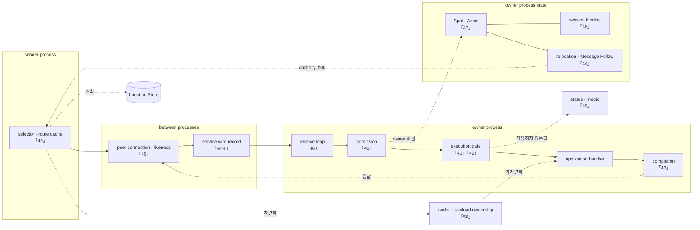

# Framework 공통 스펙

이 디렉터리의 문서는 Framework의 공통 공개 계약을 설명한다. 각 문서는 구현과
contract test에 필요한 입력, 상태, 정상 흐름, 실패와 완료 조건을 자체적으로
정의한다.

이 디렉터리와 언어별 exact interface가 Framework 공개 계약의 단일 정본이다.
이 디렉터리의 `40`~`52` 문서는 계약을 구현하는 상태와 component 구조를 설명하는 내부 설계
문서이며 새 공개 동작을 추가하지 않는다. 같은 디렉터리에 두어도 이 문서가 규범 계약으로
바뀌지는 않는다. 공개 동작이 다르면 `00`~`33` 문서와 언어별 exact interface가 우선한다.

## 검증 runner 격리

같은 계약을 구현한 여러 언어의 sample과 E2E는 한 host에서 동시에 검증할 수 있어야 한다. 이
조건은 public API 동작이 아니라 contract 검증 환경의 실행 규칙이다. Redis가 필요한 실행은 언어별
공유 인스턴스나 Redis DB 번호를 나누어 쓰지 않고, 실행마다 별도 Docker Redis container와 key
prefix를 만든다.

Sample은 [sample runner 격리 기준](../../sample/README.ko.md#샘플-실행-스크립트와-redis-격리-기준)의
언어별 `20000-29999` 구간을 사용한다. E2E는
[E2E runner 실행 계약](../../e2e/README.ko.md#27-run_e2e-실행-계약)의 언어별
`30000-39999` 구간을 사용한다. 각 문서의 표는 Redis host port와 application listener port를
겹치지 않게 나눈 정확한 범위를 소유한다.

같은 언어의 standalone config runner와 통합 runner가 호출한 config runner는 language-wide
whole-run lock을 공유하므로 실제 config E2E process를 순차 실행한다. 통합 runner 자체는 lock을
획득하지 않으므로 두 통합 실행이 config 경계에서 번갈아 진행될 수 있지만, 실제 config process는
겹치지 않는다. 서로 다른 언어의 같은 E2E는
언어별 port 구간, 실행별 Redis endpoint, 임시 설정, log directory와 cleanup 대상을 분리한 상태에서
병렬 실행할 수 있다. Java와 Kotlin은 Gradle output 일부를 공유하므로 sample과 E2E가 함께 사용하는
build-only lock으로 Gradle 실행만 직렬화한다. 이 lock은 같은 runner 실행 환경 안에서 공유한다.
동일 checkout을 WSL Bash와 Windows PowerShell에서 동시에 실행하는 조합은 서로 다른 OS lock
namespace를 사용하므로 지원하지 않는다.

## 작성 기준과 공통 용어

- [스펙 문서 작성 가이드](../../../../../../doc/principal/documentation/spec-writing-guide.ko.md)

## 주제별 탐색 목차

`40`~`52` 항목은 공개 계약을 추가하지 않는 비규범 내부 설계 문서다. 아래 목차는 공개 spec과
내부 설계를 주제별로 함께 찾기 위한 것이며, 각 문서를 한 번만 싣는다.

### Foundation과 configuration

- [00 공개 계약 관리](00-public-contract-governance.ko.md)
- [01 Framework 메시징 용어집](01-glossary.ko.md)
- [02 Framework 개요](02-overview.ko.md)
- [03 상호작용 모델](03-interaction-model.ko.md)
- [05 비동기 실행 정책](05-async-execution-policy.ko.md)
- [06 Framework API](06-framework-api.ko.md)
- [10 Network listener identity](10-network-listener-identity.ko.md)

### Messaging, HWM과 backpressure

- [04 메시지 모델](04-message-model.ko.md)
- [07 RouteMesh topology](07-channel-topology.ko.md)
- [08 Channel 메시징](08-channel-messaging.ko.md)
- [09 ClientServer Channel](09-client-server-channel.ko.md)
- [12 Spot 메시징](12-spot-messaging.ko.md)
- [17 Stage wrapper on Spot](17-stage-wrapper-on-spot.ko.md)
- [32 Framework 오류 모델](32-framework-error-model.ko.md) — 공통 `ErrorKind`, Send·Request 완료 조건과 Application의 재시도 판단 경계를 정의한다.
- [33 Core byte HWM과 Application job flow](33-core-hwm-application-job-flow.ko.md) — Core의 byte 예산과 Framework의 job 개수 예산을 분리하고 pre-handler 비동기 단계를 하나의 structured flow로 묶는다.
- [46. 수신과 dispatch 루프](46-internal-dispatch-loop.ko.md) — 비규범 내부 설계. message마다 깨울 것인가 모아서 처리할 것인가. 무엇으로 깨우는가

### Spot, Actor와 Session

- [11 Spot 모델](11-spot-model.ko.md)
- [13 MeshNode](13-mesh-node.ko.md)
- [14 Actor 모델](14-actor-model.ko.md)
- [15 Spot과 Actor membership](15-spot-actor.ko.md)
- [16 Spot 주소 메시징](16-spot-address-messaging.ko.md)
- [18 Spot·Actor routing](18-object-routing.ko.md)
- [19 STREAM 서버 session](19-stream-session.ko.md)
- [20 Session Actor dispatch](20-session-actor-dispatch.ko.md)
- [41. Spot·Actor 실행 직렬화](41-internal-serialization.ko.md) — 비규범 내부 설계. 줄 서는 곳과 실행 권한을 왜 나누는가. 실행 자원이 Spot 수에 비례하면 왜 안 되는가
- [47. 객체 종류와 활성화](47-internal-object-lifecycle.ko.md) — 비규범 내부 설계. 세 Spot 종류를 어떻게 구분하는가. 없는 객체를 언제 만들고 Ready owner 장애를 어떻게 처리하는가
- [48. Session과 Actor 연결](48-internal-session-binding.ko.md) — 비규범 내부 설계. 연결을 교체하는 동안 두 곳이 같은 Actor를 가리키지 않게 하는 법

### Location, relocation과 handoff

- [21 Location runtime](21-location-runtime.ko.md) — Framework가 object 위치, authority와 두 Store를 사용하는 순서를 정의한다.
- [22 Location Store provider SPI와 공식 Redis 구현](22-location-store-redis.ko.md) — Provider가 구현할 atomic key/value와 scan 계약을 정의한다.
- [23 Relocation Store provider SPI와 공식 Redis 구현](23-relocation-store-redis.ko.md) — Provider가 구현할 immutable payload 저장 계약을 정의한다.
- [28 Actor와 Spot relocation 전체 흐름](28-relocation-flow.ko.md) — 네 runtime이 공통으로 따르는 owner 전환, queue 병합, Location Store CAS와 Session route 순서를 정의한다.
- [30 Host relocation 전체 흐름](30-host-relocation-flow.ko.md) — Host가 relocation unit을 확정하고 batch 순서로 이전한 뒤 `Relocated`, Message Follow와 `Shutdown`으로 정리하는 전체 lifecycle을 정의한다.
- [31 장애 대응과 failover 범위](31-failure-failover-policy.ko.md) — target 재선택, reconnect, 생성 recovery와 stateful relocation의 자동 복구 경계를 정의한다.
- [44. 이동 중 message 연속성](44-internal-relocation-continuity.ko.md) — 비규범 내부 설계. 객체가 옮겨 가는 동안 message는 어디로 가는가
- [45. target 선택과 route cache](45-internal-routing-and-cache.ko.md) — 비규범 내부 설계. 위치 조회를 얼마나 자주 하는가. `Missing`과 owner를 사용할 수 없는 `Ready`를 어떻게 구분하는가
- [52. Relocation handoff 상태 전이](52-internal-relocation-handoff.ko.md) — 비규범 내부 설계. 네 runtime이 같은 source·target·Session 상태 전이와 queue 순서를 구현하는 방법

### Monitoring과 operations

- [24 Runtime 상태와 운영 진단](24-runtime-monitoring.ko.md) — Application이 읽는 health, topology status와 structured log를 정의한다.
- [25 Runtime metric 이름과 label](25-runtime-metrics.ko.md) — Metric 이름, 단위와 bounded label만 정의한다.
- [26 Message flow tracing](26-message-flow-tracing.ko.md) — Message 한 건의 phase, outcome과 trace attribute를 정의한다.
- [27 Request correlation과 causal flow](27-flow-correlation.ko.md) — Correlation ID와 flow ID의 생성·전파를 정의한다.
- [29 Transport liveness](29-transport-liveness.ko.md)
- [49. Liveness와 상태 공개](49-internal-liveness-and-state.ko.md) — 비규범 내부 설계. peer와 계속 통신할 수 있는지 어떻게 판단하는가. 그 판정이 authority를 변경하지 않게 하는 방법

### Runtime ownership과 wire protocol

- [40. 계층 경계와 식별자](40-internal-layering.ko.md) — 비규범 내부 설계. binding 경계를 어디에 긋는가. 어떤 값을 합치면 안 되는가
- [42. application과 infrastructure 실행 분리](42-internal-progress-isolation.ko.md) — 비규범 내부 설계. handler가 멈춰 있어도 무엇이 진행해야 하는가. 왜 예약 구획이 아니라 영역 분리인가
- [43. operation 완료 확정](43-internal-completion.ko.md) — 비규범 내부 설계. 여러 경로가 동시에 끝내려 할 때 하나만 이기게 만드는 법. 응답을 잃지 않는 법
- [50. Payload 소유권과 복사](50-internal-message-ownership.ko.md) — 비규범 내부 설계. socket에서 handler까지 byte를 몇 번 복사하는가. 역직렬화는 언제 하는가
- [51. Service wire protocol](51-internal-service-wire-protocol.ko.md) — 비규범 내부 설계. node 사이에 오가는 byte 형식과 command

## 내부 설계 문서(비규범)

> **문서 성격 — 공개 규범 스펙이 아닌 내부 설계 문서.** 아래 `40`~`52` 문서는 `00`~`33`의 공개 계약을 만족시키는 구현 구조를 설명한다. Application이 관찰하는 동작을 추가하거나 변경하지 않는다.

C++·.NET·JVM·Node.js service runtime은 서로 다른 언어로 구현된다. 이 문서 묶음은 네
runtime이 application에 같은 결과를 제공하려면 **공통으로 따라야 하는 내부 설계 결정**을
설명한다.

### 이 문서 묶음이 답하는 것

정식 spec은 "무엇을 만들어야 하는가"를 정한다. 이 문서 묶음은 spec을 읽어도 알 수 없는 것에
답한다.

- 여러 spec 요구를 **동시에 만족하려면 어떤 구조가 필요한가.** 예를 들어 Actor별 queue와
  `SpotWide` 전체 직렬 실행을 함께 보장하는 구조를 설명한다.
- spec이 정하지 않은 내부 구현을 **어떤 기준으로 선택하는가.**
- 구현이 서로 달라지기 쉬운 경계는 어디이며, **무엇을 확인해야 하는가.**

spec이 이미 정한 내용은 다시 적지 않고 링크만 둔다.

이 문서 묶음의 `결정`은 공개 계약이 아니라 그 계약을 만족시키는 내부 구조 결정이다. `확인할 결과`는
spec의 공개 결과와 내부 불변 조건을 구현에서 확인하는 기준이며 새 사용자 보장을 만들지 않는다.
공개 동작, 오류 의미나 failover 범위가 spec과 다르면 spec이 우선한다. 이 경우 internals를 spec에
맞추거나, 공개 계약 자체를 바꿔야 하면 [공개 계약 절차](00-public-contract-governance.ko.md#4-공개-계약-절차)를
먼저 따른다.

결정에서 벗어난 상태와 검증 진행 상황은 이 공개 internals 문서에 기록하지 않는다. 이
문서는 구현 구조와 결정만 설명한다.

### Component와 담당 장

각 장은 아래 그림에 표시한 component 하나를 자세히 설명한다. 찾으려는 component에서
표시한 장 번호를 따라가면 된다.

**이 그림은 계층도가 아니라 장 찾기용 지도다.** 왼쪽 묶음과 오른쪽 묶음은 **서로 다른
process**이며, 한 host가 두 역할을 모두 하더라도 그림의 두 자리는 각각 다른 호출에서
동작한다.



**실선이 message가 실제로 지나는 축이고 점선은 참조·조회·통지다.** 「1. 계층 경계와
식별자」는 이 그림 전체에 걸친다 — 어느 component가 binding type을 알아도 되는가를 정하므로
한 자리에 놓이지 않는다.

`codec`과 `Location Store`를 묶음 밖에 둔 이유는 두 process가 모두 쓰기 때문이다. codec은
보내는 쪽에서 직렬화하고 받는 쪽에서 소유권을 옮긴 뒤 역직렬화하며, Location Store는 두
process가 각각 조회하고 기록한다. 한 묶음 안에 넣으면 그 process만 쓰는 것으로 읽힌다.

점선 둘은 장을 따로 읽으면 놓치기 쉬운 연결이라 특히 표시했다.

- `execution gate → status · metric`의 **"점유하지 않는다"** — 관측이 실행 권한을 비켜 가야 한다는
  [49](49-internal-liveness-and-state.ko.md)의 결정이다. 관측을 켰다는 이유로 처리가 느려지면 안 된다.
- `relocation → selector`의 **"cache 무효화"** — [44](44-internal-relocation-continuity.ko.md)와
  [45](45-internal-routing-and-cache.ko.md)이 만나는 지점이다. 이 선이 없으면 이동 뒤 캐시 수명이
  끝날 때까지 모든 트래픽이 우회한다.

성능에 직결되는 결정은 [50](50-internal-message-ownership.ko.md)의 복사 횟수, [45](45-internal-routing-and-cache.ko.md)의
위치 캐시, [46](46-internal-dispatch-loop.ko.md)의 모아서 처리하기·깨우는 방식·timer 자원,
[41](41-internal-serialization.ko.md)의 실행 자원 제약, [47](47-internal-object-lifecycle.ko.md)의 메모리 회계에 모여 있다.

### 여러 장이 연결되는 구조 결정

같은 주제를 여러 문서가 다루는 자리가 있다. 공개 동작은 spec을 정본으로 삼고, 내부 구조는 아래
문서를 기준으로 맞춘다.

| 주제 | 기준 문서 |
|---|---|
| 대기열 포화 시 공개 결과 | [Spot 메시징 「5.3 Spot application queue에 들어가는 작업」](12-spot-messaging.ko.md#53-spot-application-queue에-들어가는-작업)의 계열×위치 표 |
| owner 점유 상한과 lifecycle 연속 실행 상한 | [Actor 모델 「3. Actor queue」](14-actor-model.ko.md#3-actor-queue) |
| 대상 선택 절차와 tiebreak | [Channel 메시징 「선택 순서」](08-channel-messaging.ko.md#선택-순서) |
| 관찰자 합치기와 유실 | [Runtime 상태와 운영 진단](24-runtime-monitoring.ko.md) |
| `ObjectGeneration`을 쓰는 자리와 쓰지 않는 자리 | [Spot·Actor routing 「2.5」](18-object-routing.ko.md#25-objectgeneration을-어디에-쓰고-어디에-쓰지-않는가) |

### 디버깅 원칙

간헐 실패를 쫓을 때는 **이미 있는 message tracking과 파일 log를 먼저 켜고 읽는다.**
임시 log를 새로 넣고 재현을 반복하는 방식은 금지한다. 그 방식은 예외 하나를 보려고
재현 주기를 통째로 다시 돌리게 만들고, 정작 원인이 기존 log에 이미 찍혀 있어도 놓친다.

#### 1. 무엇을 먼저 켜는가

| 대상 | 켜는 방법 |
|---|---|
| Message flow(`flow`, `corr` 포함 전 구간 추적) | runtime diagnostics의 message flow mode |
| C++ / .NET spot discovery trace | `ZLINK_DEBUG_FRAMEWORK_SPOT_DISCOVERY` |
| Java / Kotlin stream trace | `ZLINK_JAVA_STREAM_TRACE=1` |
| Sample 서버 log 보존 | .NET `ZLINK_SAMPLE_EVIDENCE_DIR`, JVM `ZLINK_SAMPLE_KEEP_RUN_DIR=1`, Node는 실패 시 자동 |

Sample이 간헐 실패하면 **첫 재현부터** 서버 log를 보존한다. log 없이 돌린 재현은
실패 사실만 남기고 원인은 남기지 않으므로 그 주기는 버려진다.

#### 2. 어떻게 읽는가

먼저 `flow`로 정상 건과 실패 건을 나란히 놓고 **어느 전이에서 끊겼는지** 찾는다.
`flow`는 message 하나를 process 경계 너머까지 잇는 유일한 값이다. Trace 종류를
noise로 보고 grep에서 걸러내면 원인 줄을 그대로 지나친다.

#### 3. 실패는 반드시 flow에 남긴다

Application에 error kind만 돌려주고 원인을 버리는 종결은 만들지 않는다. 원인을 남기지
않은 실패는 재현으로만 추적할 수 있고, 재현 주기가 곧 조사 비용이 된다. 실패·거부·
abort 같은 종결은 `message_flow_outcome`의 `error`로, 원인 exception을 `errorType`·
`errorMessage`에 실어 **그 실패를 만든 message와 같은 `flow` 아래** 기록한다.

#### 4. Trace를 추가할 때의 비용 규칙

**결정**: Message flow tracing이 꺼져 있으면 log message를 만드는 비용 자체가 없어야
한다.

| 경로 | 방식 |
|---|---|
| Message마다 찍는 hot path | `if (enabled(outcome))`로 감싸 event도 lambda도 만들지 않는다 |
| 실패·abort 등 드문 전이 | lazy 형태(`trace(outcome, build)` / `traceLazy`)로 gate 통과 후에만 event를 만든다 |

Lazy 형태는 호출부에서 `if`를 없애 주지만 lambda 하나를 할당한다(C++는 인라인되어
할당이 없다). 그래서 hot path에서는 lazy 형태라도 `if`로 한 번 더 감싸 lambda 생성까지
막는다. 문자열 연결을 gate 앞에서 실행하는 호출부는 만들지 않는다.

**언어별 재량**: gate를 표현하는 방법. C++는 template lambda, .NET은 보간 문자열
handler와 `Func<>`, Java는 `Supplier<>`, Node는 thunk를 쓴다. 관찰되는 결과 — 꺼졌을
때 아무 비용도 발생하지 않는 것 — 이 같으면 된다.

**확인할 결과**: 새 trace를 넣은 뒤, tracing을 끈 상태에서 그 경로가 문자열·event·
lambda 중 어느 것도 만들지 않는지 호출부 코드로 확인한다.

### 읽는 방법

각 문서는 결정마다 다음을 밝힌다.

| 표시 | 뜻 |
|---|---|
| **결정** | 모든 service runtime이 따라야 하는 구조. 어기면 application이 보는 결과가 달라진다 |
| **언어별 재량** | 관찰 결과가 같으면 구현이 달라도 되는 것. 무리하게 맞추면 그 언어에서 부자연스러워진다 |
| **확인할 결과** | 구현이 만족해야 하는 조건. 확인 방법은 항목마다 다르다 |

**재량으로 쓰려면 두 가지를 함께 적는다.** 왜 관찰 결과가 같은지, 그리고 그것을 확인하는
기준이 무엇인지. 둘 중 하나라도 없으면 재량이 아니라 아직 정하지 않은 것이다. 지연 하한
같은 관찰 가능한 차이가 생기는 선택은 재량이 아니라 **제약이 있는 선택**으로 적는다
([46. 수신과 dispatch 루프 「5. 깨우는 방식을 하나만 고른다」](46-internal-dispatch-loop.ko.md#5-깨우는-방식을-하나만-고른다)가 그 예다).

**문서에 적지 않은 거부 조건·재시도·기록을 runtime이 임의로 만들면 안 된다.** 그런 동작이
application의 관찰 결과를 바꾼다면 공통 결정을 먼저 추가하고 모든 runtime이 그 결정을
따르게 한다.

Wire protocol 문서만 이 구분을 적용하지 않는다.
`framework/runtime/protocol/service-wire-v1.schema.json`과 짝이며, schema가 정한 field
관계와 검증 순서를 설명한다.

"확인할 결과"는 전부 contract test로 판정할 수 있는 것이 아니다. 항목마다 확인 방법이
다르며, 목록을 작업으로 옮길 때는 어느 방법으로 확인할지부터 정한다.

#### 인용 표기

인용은 **절 제목**으로 한다. 링크를 누르면 그 절로 바로 이동한다.

```markdown
[Actor 모델 「3. Actor queue」](14-actor-model.ko.md#3-actor-queue)
```

**줄 번호로 인용하지 않는다.** `§123` 형태는 문서 맨 위로만 이동해 독자가 그 자리를 다시
찾아야 하고, 인용한 문서가 한 줄만 바뀌어도 가리키는 곳이 틀어진다. 절 제목은 그 절이
사라지거나 이름이 바뀔 때만 깨지며, 그때는 링크 검사에서 드러난다.

anchor는 제목을 소문자로 바꾸고 공백을 `-`로 이은 값이다. 확인은 다음으로 한다.

```bash
mkdocs build --strict   # doc/site에서 실행
```

| 확인 방법 | 어떤 항목인가 |
|---|---|
| contract test | application이 관찰하는 결과 — 오류 kind, 순서, callback 호출 여부 |
| white-box 불변 조건 | runtime 내부 상태 — 대기열 점유량, 실행 권한 수, 상태 전이 |
| 정적 검사 | 코드 구조 — 타입 누수, 중복 구현, 금지한 include |
| 측정 | 비용 — 할당 횟수, lock 획득 횟수, 처리량. 임계값을 먼저 정해야 판정할 수 있다 |

예를 들어 "한 실행 권한에서 두 작업을 동시에 실행하지 않는다"는 결정이고, 그것을 promise
연결로 만들지 lock과 대기열로 만들지는 재량이다.

### 이 문서 묶음이 정의하지 않는 것

| 내용 | 소유 문서 |
|---|---|
| Application이 호출하는 API의 이름과 signature | [언어별 공개 계약](languages/README.ko.md) |
| 공개 동작의 의미와 완료 조건 | [정식 spec](README.ko.md) |
| Core가 제공하는 raw socket·transport 내부 | [Core raw runtime 내부 경계](https://zlink-systems.github.io/zlink/ko/internals/runtime-boundary/) |

각 runtime은 이 문서의 의미를 독립된 source로 구현하며 공통 native binary를 공유할 필요가
없다.

## Server 언어별 exact interface

공통 server 계약이 각 언어에서 사용하는 정확한 public type, signature와 비동기
표현은 다음 문서가 소유한다.

- [C++](languages/cpp/README.ko.md)
- [.NET](languages/dotnet/README.ko.md)
- [Java](languages/java/README.ko.md)
- [Kotlin](languages/kotlin/README.ko.md)
- [Node.js](languages/node/README.ko.md)

## HTTP client

- [HTTP client 스펙 목차](../http-client/README.ko.md)
- [12 HTTP client 통합 계약](../http-client/12-http-client.ko.md)
- [언어별 HTTP client 계약](../http-client/language-interfaces.ko.md)

`10-revision-candidates.ko.md`는 공개 계약이 아니라 다음 revision의 설계 후보를
관리하는 문서다.

## Stream connector

- [32 Stream connector](../stream-connector/32-stream-connector.ko.md)
- [언어별 Stream connector 계약](../stream-connector/README.ko.md#언어별-public-api)
