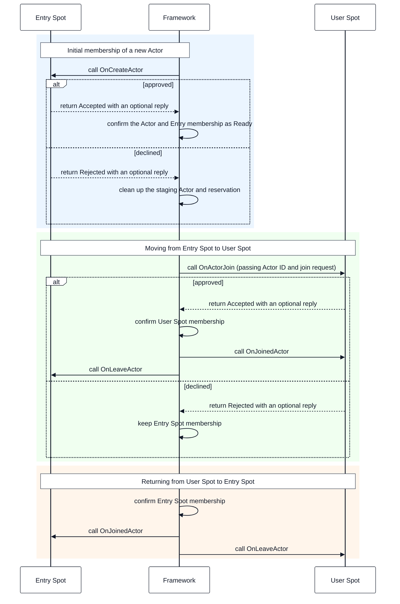
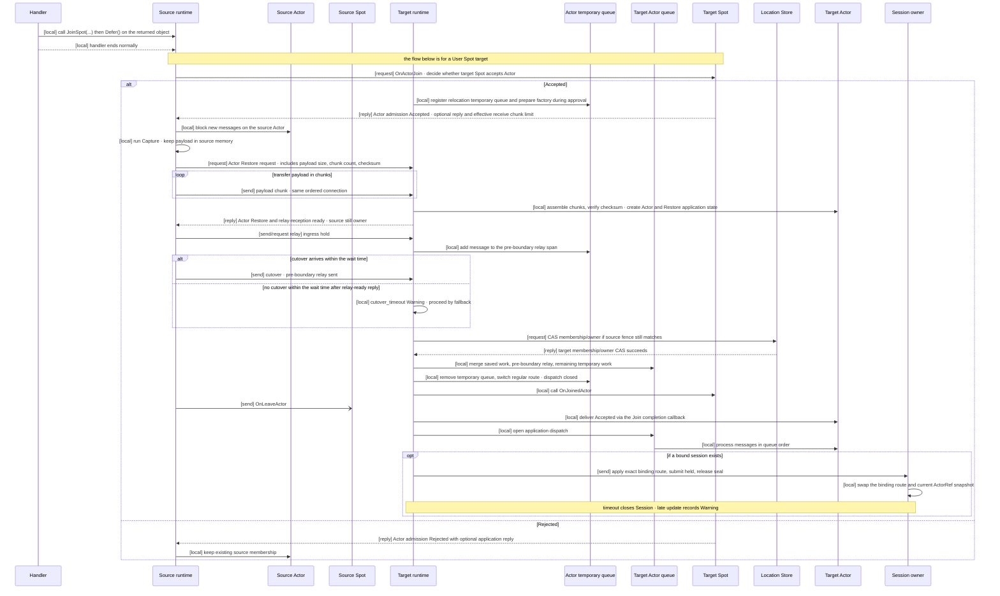
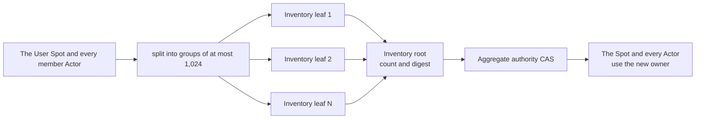

# Spot And Actor Membership

[Spec table of contents](../README.en.md) · [Previous: Actor Model](14-actor-model.en.md) · [Next: Spot Address Messaging](16-spot-address-messaging.en.md)

> **What this chapter defines** — Actor creation, Spot membership, relocation, and
> aggregate relocation. Automatic failover is out of scope.


This document defines Actor creation, Spot membership, relocation, and aggregate
relocation — moving several objects together — in ZLink Framework. Automatic failover,
where a different runtime takes over relocation after a process terminates, isn't part
of the contract.

Core only provides raw sockets and transport. An object's
[membership](01-glossary.en.md#membership), relocation state, and lifecycle are
managed by each language's framework runtime.

## 1. Identity And Authority

ActorId and Entry/User/Instance Spot ID are logical keys global across the whole
Location Store namespace. `MeshName` is an attribute used to decide where to initially
place an object, and isn't part of the authority key.

The [Location Store](01-glossary.en.md#location-store) records, for each logical key,
which node currently processes the object and which
[Spot](01-glossary.en.md#spot) an Actor belongs to. This current processing right and
location record is called authority. When an object moves to another node, the logical
key stays the same while only the current owner information changes to a new value.

`ActorRef`'s and `SpotRef`'s `ObjectGeneration` is a non-zero unsigned 63-bit
conceptual value. `ObjectGeneration` is kept even when membership or the
[owner](01-glossary.en.md#owner) MeshNode changes within the same incarnation.
Instead, the provider issues a larger `AuthorityOwnerGeneration` to distinguish the
new owner.

Authority recorded in the Location Store includes the following information.

| Item | Meaning |
|---|---|
| Current owner | Points to the owner currently processing the Actor/Spot. |
| Spot membership | Points to the Entry Spot or User Spot the Actor currently belongs to. |
| `ObjectGeneration` | Distinguishes an incarnation re-created under the same logical identity. |
| `AuthorityOwnerGeneration` | Distinguishes a previous owner's work when the owner changes within the same incarnation. |
| `StoreVersion` | Verified so CAS applies only when it matches the read authority's state. |
| Exact owner lease | Verifies whether the owner lifecycle recorded in authority is still valid. |

The runtime route cache is only a snapshot of the [authority](01-glossary.en.md#authority)
row — the cache alone doesn't determine current authority. Join, leave, relocation,
destroy, and close all only use a transaction that verifies the expected
`StoreVersion`, generation, and [owner lease](01-glossary.en.md#owner-lease).

The Object Client or Server role requires a Location Store. Without a Store, it's
rejected at startup, and a hidden local Store or a runtime-local object manager with a
reduced meaning under the same name isn't created. Manual topology with object role
`None` can only use Node direct and Channel operations.

## 2. The Process That Confirms Only One Object Is Created

Even if several nodes try to create the same Actor or Spot at the same time, the
factory must only start on the one place that obtained creation authority. The
framework confirms this authority as one by reserving, in the Location Store, both the
object to create and the target node's capacity together. This record is called a
placement reservation.

When creating an Actor and User Spot via manager, versus creating an
[Instance Spot](01-glossary.en.md#entry-user-instance-spot) from its first message, the
location requesting the reservation differs.

| Creation method | Who requests the reservation, and when |
|---|---|
| Actor/User Spot manager create | The coordinator requests the reservation before sending the request over target transport. |
| Instance Spot direct [cold activation](01-glossary.en.md#cold-activation) | The source first sends the first message and creation info to the target. If the target has no currently usable Spot, the target requests the Location Store for permission to create this Spot itself. |

The common result of both methods is the same. The Location Store grants creation
authority to only one target, and other targets don't start a separate
[factory](01-glossary.en.md#factory).

The unchanging name used when registering an object factory and comparing whether it's
the same type is called stable type.

Remote User Spot manager create sends a separate terminal service operation to the
exact target after reservation. This operation fixes the source and target node
lifecycle, global Spot key/[stable type](01-glossary.en.md#stable-type), the
provider-issued reservation, `StoreVersion`, and deadline. The target does an exact
read of the `Reserved` allocation's `pendingCreation` from the Location Store, then
runs factory/initialize/Commit. Location row polling or an application control packet
isn't the terminal result.

Remote User Spot close is also a separate terminal service operation carrying the
exact `SpotRef`, owner generation/`StoreVersion`, and target lifecycle. The target
checks active Actor membership and relocation state before admission.

1. The runtime fixes the global key, stable type, optional Mesh/placement, and
   durable creation input, then selects a positive-node-wide-weight candidate
   satisfying role, type capability, and typed population capacity.
2. For Actor/User Spot manager create, the coordinator calls `Reserve`. For Instance
   Spot, the source first submits a first-message activation envelope to a candidate
   target, and the target activation registry calls `Reserve`.
3. Store `Reserve` changes the object state from `Missing` to `Creating`, and fixes
   the allocation and typed capacity bundle needed to create that object on the
   target as `Reserved`, in the same transaction. This authority state change is
   called the `Missing → Creating` transition.
4. Only the target that succeeds in this reservation runs factory and initialize. A
   target that requested concurrently but failed the reservation doesn't separately
   create the same object.
5. If the creation callback approves, the Store's terminal `Commit` changes the same
   fence to `Ready`, transitions allocation and typed capacity bundle from
   `Reserved → Active`, and publishes a `Created` result.
   Instance Spot has no separate application creation approval — it submits the
   first message included in the envelope to the local queue once, after the
   activation barrier.
6. If the creation callback declines, the same terminal `Commit` doesn't create
   Ready or active capacity — it cleans up the Creating authority and reserved
   allocation/typed capacity bundle and publishes a `Rejected` result.
7. On node termination, timeout, or a callback exception, `Abort` cleans up the
   exact Creating authority and `Reserved` allocation/typed capacity bundle and
   publishes an `Aborted` failure.

The reservation carries which object to create on which target, and the information
needed to verify capacity and current owner. Precisely, it fixes object kind, global
key, stable type, target descriptor, typed capacity bundle, exact owner lease, and
`StoreVersion`. Creation authority isn't judged by a fixed expiration TTL. Recovery,
handoff to a different target, and cancellation are decided by checking the recorded
`Creating` state and target owner lease together. Actor and Spot share this common
reservation operation.

An encoded creation request is at most 1 MiB. The framework records an unchangeable
content reference and hash into the creation intent before reservation, and keeps it
until the object becomes Ready or a failed creation is cleaned up. Only the target
that obtained creation authority passes this request to the factory. Since factory and
initialize can run more than once per `(logical key, ObjectGeneration, attempt)`, they
must safely handle re-execution with the same input.

The staging instance an Actor factory builds is passed to the Entry Spot's
`OnCreateActor`. The callback returns approve/decline and an optional reply. If
approved, initial Entry membership/Ready authority/active capacity and a `Created`
terminal record are published together. If declined, Ready and message admission
aren't opened — the Creating authority/pending capacity are cleaned up and a
`Rejected` terminal record is published. A callback exception is a typed creation
failure that already exists — it isn't an application rejection.

A caller that requested concurrently but didn't obtain creation authority doesn't
start a separate factory. A different operation waits for the authority change. Once
authority becomes Ready, it receives `Existing`; if it becomes Missing via callback
rejection or failure cleanup, it competes for a new reservation to process its own
creation request. It doesn't share an earlier operation's `Rejected` state or
application reply.
One terminal call deadline applies across the whole of resolve, waiting, reservation,
factory, and [Ready](01-glossary.en.md#ready) preparation. Once the
[deadline](01-glossary.en.md#deadline) ends, it's `DeadlineExceeded`. The next call
re-checks the Store's current authority to clean up or continue an interrupted
attempt. `Missing`, `Creating`, and Store failure aren't stored in a negative cache.

If multiple processes concurrently call `GetOrCreate` for the same ActorId, only the
Location Store reservation CAS winner runs factory and `OnCreateActor`. If the same
Actor is Creating, other callers don't create a new reservation — they wait for the
authority change.

```text
Missing
  → Reserved(R1)
      ├─ Created(R1, ActorRef, ReplyRef?)
      ├─ Rejected(R1, ReplyRef?)
      └─ Aborted(R1, Failure)
```

`Created` and `Rejected` are normal
[terminal results](01-glossary.en.md#creation-terminal-result) of the reservation
winner operation. A callback exception is `Failed`; recovery cleanup is `Abort`, which
creates no terminal record. `Existing` is the lookup result of a different operation
that found a Ready Actor, and doesn't create a new reservation or callback.

A `Created` terminal publish also performs the Ready authority and active capacity
transition together. A `Rejected` terminal publish doesn't create Ready authority or
active capacity — it cleans up Creating authority and reserved capacity. A terminal
record is identified by the exact source Node RID/lifecycle generation/`OperationId`
and is only used for resends of the same operation. The
`creation-operation-terminal-v1` semantic envelope — with no request correlation or
reply route — and its SHA-256 are preserved up to 5 minutes after the original
deadline. On resend, the framework encodes a new command reply using the current
request's correlation and reply route.

An Entry Spot isn't published to descriptor and resolver before finishing startup
initialization. Actor creation completes initial Entry Spot membership and the Ready
barrier in the same lifecycle, without calling `OnActorJoin` or `OnJoinedActor`.

## 3. Actor Membership For Entry Spot And User Spot

The three Spot kinds' creation methods and functional differences, and the Entry
Spot's overall role, are defined by
[19 Spot Model](11-spot-model.en.md). This section only defines the order in which
Entry/User Spot handles Actor membership.

An Entry Spot's Actor uses a per-Actor execution gate. In a User Spot's default
`SpotWide` mode, the Spot handler, member Actor handlers, timer, and lifecycle
callbacks share the User Spot's common execution gate. Choosing `PerActor` at factory
registration separates a per-Actor gate, Spot lane, and per-timer gate — different
gates can run concurrently.

When an Actor is created, the Entry Spot of the selected owner
[MeshNode](01-glossary.en.md#meshnode) handles initial membership. Actor business
messages are delivered directly to the Actor queue, without going through an Entry
Spot or User Spot callback.

The location where Actor payload is put on the Actor queue and the gate deciding
handler execution authority are different contracts. `Yield` is only allowed in a
`SpotWide` User Spot, which uses a shared gate. In an Entry Spot Actor and `PerActor`
User Spot, only `Async`, which keeps the current turn, is used.

The Actor Join call only provides synchronous `Defer()`, regardless of execution
mode. A handler calls `Defer()` to schedule the Join and register a barrier. The
framework runs the actual Join once the handler's last continuation ends normally.
Join doesn't provide `Async`/`await`/`submit` or `Yield`. Unlike a request or worker's
`Yield`, `Defer()` doesn't return the Spot gate or Actor queue claim.

One handler can register at most 64 Joins. One Join request is encoded to at most
1 MiB, and the sum of every Join request registered by the same handler is at most
8 MiB. Exceeding the limit fails the current registration synchronously as a startup
configuration error, without leaving any partial record.

If timeout is omitted, 5 seconds is used. An explicit value must be a finite value in
`1..INT_MAX`, rounded up to milliseconds. The framework computes an absolute deadline
once, using the monotonic clock, at the moment `Defer()` is called. So time the
handler keeps running after `Defer()` is also included in the Join timeout.

A User Spot serializes Join request processing, joined, leave, and disconnected
lifecycle control on that Spot's control queue. The order of packet/timer turns and
callbacks on the same Spot is set by the Spot turn. Instance Spot isn't an Actor
membership target.

The Actor disconnected callback runs from either the current binding snapshot of a
physical Session disconnect, or an explicit logical notification from public
`NotifyDisconnected`. The framework runs it at most once per exact binding identity,
and doesn't interpret it as Actor destroy, leave, or a membership change. One Actor
callback's failure doesn't block other binding notifications or Session cleanup.

A regular User Spot Close returns public `false` and keeps admission and authority if
even one current Actor membership remains. It can only close once the caller finishes
an explicit leave or destroy. The framework doesn't secretly move or destroy an Actor.

## 4. Actor Join And Commit Order

`JoinSpot` takes the global Spot ID of the User Spot to move to. `JoinEntrySpot`
doesn't take a target node RID. The framework finds the target Spot and owner node to
use. If the Actor's and target Spot's owner node differ, Actor relocation is also
performed within the same Join operation.

The application doesn't directly specify relocation stage, target node, state
adapter, or owner token. The framework decides these values based on current
configuration and authority.

The following C# excerpt is a .NET expression to help understand the common join
behavior. It doesn't require the same signature in other languages; the exact full
contract is defined by the
[.NET Actor interface](../languages/dotnet/interfaces/06-actors.en.md).

```csharp
public interface IZLinkActorContext
{
    IZLinkActorJoinSpotCall JoinSpot(
        string spotId,
        ZLinkMessage request);

    IZLinkActorJoinEntrySpotCall JoinEntrySpot(
        ZLinkMessage request);
}

public interface IZLinkActorJoinSpotCall : IZLinkActorJoinCall
{
    IZLinkActorJoinSpotCall Timeout(TimeSpan timeout);
}

public interface IZLinkActorJoinCall
{
    void Defer();
}
```

A minimal example of an Actor handler joining a specific User Spot is as follows. The
application only specifies the [Spot ID](01-glossary.en.md#spot-id) and the request
needed for the admission decision. The framework finds the current owner, and if it's
on a different node, performs relocation within the same operation.

```csharp
Context
    .JoinSpot(targetSpotId, ZLinkMessage.From(joinRequest))
    .Timeout(TimeSpan.FromSeconds(5)) // applies to the whole of Join plus any needed relocation.
    .Defer(); // registers the Join to run once the current handler ends normally.
```

The Join request is optional. If omitted, an empty request is passed to the target
User Spot's `OnActorJoin` callback. Once `Defer()` is called, the framework stores an
unchangeable copy of the request and an absolute deadline. This request is only used
to judge Join admission — it isn't reused as a relocation state payload.

`Defer()` can only be called while the current handler's registration scope is open.
An awaited continuation the framework tracks also uses the same scope. Calling it
after the handler ends and the scope is closed is `InvalidOperation`. Calling it from
a background detached task, without waiting for work the handler started, is an
application contract violation. The framework doesn't guarantee catching such a call
before the scope closes, in every language.

Once the handler ends normally, the framework activates every registered barrier. If
the handler ends with an exception, cancellation, or request reply encoding failure,
every barrier is discarded. Once reply encoding finishes, Join isn't canceled even if
the caller closed the connection or transport couldn't accept the reply.

The framework notifies the application of the Join result via an Actor Join
completion callback, together with a non-zero 128-bit `OperationId`. This callback
delivers the final result of a Join that proceeded asynchronously after the handler
ended. `Accepted` is received by the target Actor that committed the location change.
`Rejected` and `Failed` before relay-ready is accepted are received by the existing
source Actor. If the target process terminates afterward, the completion callback isn't re-run on a
different runtime.

Before the target's `OnJoinedActor` callback finishes, the completion callback and
application payload waiting behind it aren't run. The source's `OnLeaveActor`
notification is sent one-way. This notification's completion or failure doesn't
block completion. A separate cleanup stage for resources left on the source isn't
added to the Join procedure.

Regardless of whether a bound Session exists, once the target's `OnJoinedActor`
callback ends, the target Actor receives the `Accepted` result via the Join
completion callback. Once this callback ends, the target Actor processes pending
messages. If there's a bound Session, the Session owner seals that binding before
relocation starts. After target preparation and the target-only Location Store CAS,
the Session owner changes the binding route and current `ActorRef` location snapshot
to the target and releases the seal. The Session neither selects the target nor
changes the Location Store. A message arriving on the pre-update route is delivered
to the target Actor by the source's Message Follow route.

The completion, `OperationId`, optional reply, and retry cursor of a same-node and
cross-node Join are preserved only while the current source and target processes are
running. The relocation payload is kept in source memory and used to deliver state and
queue directly to the target during a normal handoff, and isn't used as the basis to
automatically replay completion after process termination.

`OperationId` is the idempotency ID the application uses to distinguish completion
callback retries as the same work. It's a different value from `RelocationId`, which
identifies the whole relocation, the placement reservation ID, or an aggregate commit
ID confirming several Store entries together. It's also stored as a separate field in
a cross-node `Accepted`'s relocation manifest.

| Completion outcome | Actor that runs the callback | Information the application receives |
|---|---|---|
| `Accepted` | The target Actor that committed the location change receives it. For a same-target no-op, the current Actor receives it. | Receives the current `ActorRef` and the optional reply the target User Spot's `OnActorJoin` callback returned. |
| `Rejected` | The existing source Actor receives it. | Receives the optional reply the target User Spot's `OnActorJoin` callback returned. |
| `Failed` | Before relay-ready is accepted, the source Actor receives it. If it fails on the same target runtime afterward, the target Actor may receive it. If the process terminates, the callback isn't re-run on a different runtime. | Receives a typed framework error kind. |

After relay-ready, the source relays cached work and sends cutover one-way. It waits for
no relocation-completion reply and proceeds with Message Follow. An explicit target
failure before relay-ready is accepted keeps the source owner. After CAS and queue opening, the target sends
the Session route update one-way. A late or duplicate cutover or Session route update
only records a Warning and doesn't change owner, membership, or route again.

The error kind `Failed` delivers distinguishes the point of failure as follows. A
result where the target's `OnActorJoin` callback normally declines isn't an error, so
it's `Rejected`, not `Failed`.

| Point of failure | `Failed.Kind` |
|---|---|
| The requested User Spot can't be found. | `NotFound` |
| There's no Entry Spot to move to, or no compatible target node. | `Unavailable` |
| The target node's remaining capacity is insufficient. | `CapacityExceeded` |
| The Actor's relocation policy forbids cross-node moves. | `Rejected` |
| The location change wasn't committed by the deadline. | `DeadlineExceeded` |
| Capture/factory/restore/staging fails with an internal error. | `InternalFailure` |
| Chunk assembly or checksum verification of the transferred relocation payload fails. | `DataLost` |
| The Actor generation differs from the current value. | `InvalidOperation` |
| The owner or membership fence differs, or the Actor is moving. | `Unavailable` |
| Runtime shutdown started first and interrupted before relay-ready was accepted. | `ShuttingDown` |

`Accepted` means location and membership change was committed. It doesn't mean the
completion callback execution has finished too. The framework runs the completion
callback after processing the lifecycle callback and source membership cleanup. If
completion keeps failing, the Actor is kept sealed, and regular messages behind the
barrier aren't run.

A same-node join isn't relocation, so it's allowed even if the relocation policy is
`DisableRelocation`.

If the Actor already belongs to the requested User Spot, or an Entry Spot Actor calls
`JoinEntrySpot` again, the framework submits an `Accepted` completion with no actual
move. In this case the Location Store, membership, and capacity aren't changed. It
also doesn't call `OnActorJoin`, `OnJoinedActor`, or `OnLeaveActor`.

If Join and host maintenance start at the same time, whichever sealed or claimed the
work first takes priority. If the Join claim comes before `Relocate`, maintenance
waits until Join reaches a terminal state. If the `Relocate` seal comes first, Join
ends with `Unavailable`. If the Shutdown admission seal comes first, Join ends with
`ShuttingDown`.

If the same handler that registered a barrier sends a request to that Actor and
waits for the reply, a cycle can form where the request and handler each wait for the
other to finish. The framework rejects it with `InvalidOperation` before submitting
the request to the queue.

### 4.1 Comparing Entry Spot And User Spot Callbacks

Entry Spot and User Spot are different Spot instances. A User Spot decides whether to
accept an Actor in `OnActorJoin`. Entry Spot has no such callback. In a regular
same-node membership change, once committed, it runs the target Spot's
`OnJoinedActor` and the source Spot's `OnLeaveActor`. In a cross-node Join, it first
processes the restore request and source relay. After the target restore and
membership commit finish, it calls the target Spot's `OnJoinedActor`, and sends the
source Spot `OnLeaveActor` one-way.

When first placing a new Actor into an Entry Spot, the Entry Spot's `OnCreateActor`
is used. When moving from Entry Spot to User Spot, the target User Spot's
`OnActorJoin` decides admission. When returning from User Spot to Entry Spot,
membership is committed with no admission decision. Both regular moves use the
target's `OnJoinedActor` and the source's `OnLeaveActor` after commit.



So an Actor returning from a User Spot to an Entry Spot isn't a new Actor. The target
Entry Spot doesn't call `OnCreateActor` or `OnActorJoin` — it only runs
`OnJoinedActor`, while the source User Spot runs `OnLeaveActor`.

### 4.2 The Order For Joining An Actor To A Spot On A Different Node

The single source for the complete owner transition, ordered relay, target queue merge,
and Location Store CAS is
[Complete Actor And Spot Relocation Flow](28-relocation-flow.en.md). This section defines
only target admission, membership, and lifecycle callbacks specific to Actor Join within
that common flow.

Once an Actor handler calls `JoinSpot(...)` or `JoinEntrySpot(...)` and calls
`Defer()` on the returned call object, the framework runs the Join in the following
order after the handler ends normally.

1. The handler calls `JoinSpot(...)` or `JoinEntrySpot(...)` and executes `Defer()`.
   `Defer()` only registers the Join. Before the handler ends normally, no Actor is
   created and no message is sent.
2. Once the handler ends normally, the framework confirms the target. If the target
   is a User Spot, it passes `ActorId` and the join request to the target's
   `OnActorJoin`. While processing this approval request, and before returning
   `Accepted`, the target also finishes registering the
   [relocation temporary queue](01-glossary.en.md#relocation-temporary-queue) for the
   ActorId and `ObjectGeneration` and preparing factory execution. The factory's stable
   type is resolved from the Actor's Location Store Authority row (`allocation.stableType`,
   keyed by `ActorId`), matched against the join request's actor route fence, not from a
   type supplied on the wire; the cross-language wire form carries no Actor stable type
   (see [51 §9](51-internal-service-wire-protocol.en.md)). The later Restore
   request doesn't repeat this preparation, so the number of round trips stays the
   same and only the post-seal processing time shrinks. The approval reply also
   carries the target's effective receive limit for the
   [relocation state chunk](01-glossary.en.md#relocation-state-chunk) — the unit the
   relocation payload is split into for transfer — a conservative
   value based on a stable lower bound that doesn't drop on recomputation. If
   `Accepted`, it continues; if `Rejected`, the target removes the temporary queue it
   registered and the prepared factory resources within the same processing, and it
   ends while keeping source membership. If the target is an Entry Spot,
   `OnActorJoin` isn't called.
3. The framework checks the relocation policy and target capacity. If the move can
   proceed, it briefly blocks new message processing on the source Actor, captures
   application state and the current Actor queue, and keeps them in source memory.
   The relocation payload is delivered directly from source to target without going
   through a store. If it's `DisableRelocation`, it's rejected at this stage.
4. The source runtime **sends the Actor Restore request to the target runtime
   first**. The Restore request includes a manifest carrying the total payload size,
   chunk count, and checksum, and the payload follows in chunks on the same ordered
   connection — chunk size and checksum rules are defined by
   [Complete Actor And Spot Relocation Flow](28-relocation-flow.en.md). The target
   dispatcher uses the relocation temporary queue registered during approval
   processing; on an Entry Spot join, which has no approval round trip, it registers
   the temporary queue before dispatching the next packet. Afterward, a message
   arriving for the same Actor goes into the temporary queue without looking up the
   application instance. After verifying the assembled payload's checksum, the target
   creates the Actor and restores application state and the existing queue, but
   doesn't run application work yet.
5. A message arriving after the source seal is held in the source runtime's
   `ingress hold`. The hold has no record-count or byte bound defined specifically
   for relocation. Once target reports the temporary queue and Restore ready, source
   relays the hold over the same ordered TCP connection. The target dispatcher puts it
   in the temporary queue group's pre-boundary relay span.
6. After sending the relay lane's current prefix, source sends cutover one-way on that
   connection. Later arrivals enter the post-boundary span, so mailbox drain isn't
   required. After Actor Restore, target runs the
   target CAS membership, owner, capacity, and generation together in `LocationStore`.
   It does so on cutover, or, when neither the cutover nor a retransmission arrives within the cutover wait time (`RelocationCutoverWaitTimeout`, default 1,000ms) from the relay-ready reply, while
   recording a Warning. Only target performs this CAS. On success target becomes owner; on failure
   the target queue doesn't open.
7. After CAS, saved Actor work, pre-boundary relay, and remaining temporary work enter the
   real Actor queue in order, then the regular route is installed while dispatch stays
   closed. It calls the target Spot's `OnJoinedActor`, sends the source Spot
   `OnLeaveActor` one-way, and finishes the Actor's Join completion callback. Dispatch
   opens after this lifecycle. Target sends no completion reply to source.
8. For a bound Actor, after CAS and queue opening target runtime sends Session owner a
   one-way target-route update. On an exact update within the default 3,000ms
   `SessionRelocationSealTimeout`, Session owner changes route, submits held messages,
   and releases the seal. On timeout it closes the physical STREAM connection and cleans
   Session state.

Even after an `Accepted` approval, the move may not start due to the later relocation
policy check (`DisableRelocation`), a capacity conflict, or a state compatibility
failure. Prepared resources are identified by an exact identity including
`RelocationId` and target attempt, and if the move doesn't start, the target removes
them once the preparation validity period passes. There's no path where a
merely-prepared target becomes owner, and even with the temporary queue registered, no
application handler runs before the Location Store CAS.

Only one relocation temporary queue exists per object. If an approval or Restore with
a different exact identity arrives before the existing preparation is cleaned up, the
target first aborts and cleans up the existing preparation state, then builds the
preparation for the new identity — the later attempt wins, and late chunks and
Restores of the previous identity are discarded without being linked to assembly.

`JoinEntrySpot` doesn't call `OnActorJoin` on the target, so there's no approval round
trip to carry this preparation. An Entry Spot join performs preparation on the Restore
request, and since there's no negotiated chunk limit, it transfers with a conservative
chunk size of 32 KiB (the encoded size of one chunk) guaranteed in any deployment.

Since `Accepted` and `Rejected` are mutually exclusive results that don't happen at
the same time, they're split with `alt` in the diagram. Whether a bound Session
exists is optional, so only that part is marked `opt`.



This diagram shows only the path that ends normally. If `OnActorJoin` returns
`Rejected` or explicitly fails before relay-ready is accepted, source membership is kept.
`OnLeaveActor` is only sent after owner commit, so it isn't called on this source-restoration path. A User Spot target uses the
relocation temporary queue registered during approval processing; on an Entry Spot
join, the target that received the Restore request registers the temporary queue
first. Messages and
requests arriving in that time wait in the temporary queue and aren't run before
moving to the real Actor queue. If it fails after target commit, it isn't rolled back
to the source. Only while
the same target process is running is it retried within the deadline; if the process
terminates, relocation isn't automatically taken over.

If a reject, timeout, or `Capture`/`Restore` failure occurs explicitly before relay-ready
is accepted, the target application instance isn't exposed. The relay record the target
received is a staging copy, so it's discarded from the temporary queue without running
or creating a terminal result. The source restores the ingress hold's requests and
one-way messages to the original Actor queue in arrival order. Once the queue is empty,
that temporary queue registration is removed. Source owner, state, and membership are
kept unchanged throughout. A timeout, aggregate commit conflict, or cutover-submit
failure after relay-ready doesn't roll back to source. If the same target process is running, it
can retry within the deadline using the confirmed location information and a resend of
the payload the source keeps in memory. If the target process terminates, a different
runtime doesn't automatically
recover it.

[ObjectGeneration](01-glossary.en.md#objectgeneration) is kept unchanged. Since the
owner changes via a cross-node move, only `AuthorityOwnerGeneration` increases. The
target Context uses the existing `ObjectGeneration` and the new owner generation.
Once the Location Store CAS succeeds, it blocks the source Context from
executing any further operations.

A message arriving after `Defer()` but before the source seal is captured together
with the current Actor queue and included in the relocation payload kept in source
memory. A message arriving after the
source seal is temporarily held in a relocation ingress hold. This hold has no
relocation-specific record-count or byte bound.

The source runtime keeps relaying the hold's records and later records arriving on the
previous route to the target temporary queue. If explicitly interrupted before relay-ready
is accepted, the hold's records are restored to the source queue in arrival order and
the target temporary queue is discarded. After that boundary, source isn't restored
regardless of cutover-submit result. If owner commit succeeds, pre-boundary relay and remaining temporary
records move in order behind saved existing work. The source doesn't wait for target dispatch-switchover
completion. After sending cutover, it changes ingress hold to Message Follow relay and
removes the original when the defined Message Follow duration ends.

In an application-requested User Spot join, the target User Spot's `OnActorJoin`
first decides admission. In a cross-node Join, after the restore request and source
relay, the target restore and membership commit finish. Then the target's
`OnJoinedActor` is called, the source's `OnLeaveActor` is sent one-way, Join completion
finishes, and only then target dispatch opens.
When returning from User Spot to Entry Spot, `OnActorJoin` isn't called — membership
is committed directly. Afterward, the target Entry Spot's `OnJoinedActor` and source
User Spot's `OnLeaveActor` are called. These callbacks are only used for an
application-requested logical membership change.

The Entry Spot itself isn't a relocation participant, and it isn't addressable through
mesh spot routing — see [Complete Actor And Spot Relocation
Flow](28-relocation-flow.en.md#3-what-moves-as-one-unit). A framework notification
targeting a node's Entry Spot is delivered node-level and dispatched to the local Entry
Spot by the receiving node. When Host `Relocate` moves a
source Entry Spot's Actor to the target node's Entry Spot, the framework restores
state via the Actor adapter. Owner, membership, queue, timer, and session route also
move to the target. This infrastructure relocation doesn't call the target's
`OnJoinedActor` or the source's `OnLeaveActor`. A dedicated relocation application
callback also isn't provided. During target Actor dispatch, messages arriving during
Restore are held in the relocation temporary queue. After commit, saved queue and timers,
pre-boundary relay, and remaining temporary messages enter the real Actor queue in order.
After the switchover, Message Follow and
target direct messages use the existing Actor queue path.

A Spot's terminal lifecycle callback is `OnClosing(ClosingContext)`. Since an Actor
always belongs to an Entry or User Spot, a separate per-Actor closing callback isn't
provided. `ClosingContext` provides the following closed reasons and the operation's
absolute deadline.

| Value | Reason | Call condition |
|---:|---|---|
| 0 | `ExplicitClose` | The application starts a User/Instance Spot close, normally cleaning up that local instance. |
| 1 | `HostShutdown` | Host `Shutdown`, without relocation, cleans up a local Entry/User/Instance Spot. |
| 2 | `RelocationOut` | The source local instance is cleaned up after a User/Instance Spot owner commit. |

A standalone Actor move doesn't close the Entry Spot itself, so it doesn't call the
Entry Spot's `OnClosing`. Infrastructure relocation also doesn't call Actor
membership callbacks. If Actor membership remains on a User Spot and explicit close
is rejected, `OnClosing` isn't called. On host `Shutdown`, after bringing accepted
handler and timer turns to a terminal state, Spot `OnClosing` is called while Actor
membership and the local instance are still valid. After callback completion, the
Actor/Spot scope is disposed and Location authority and resources are cleaned up.

If the language runtime has a standard cooperative cancellation expression, the
remaining cleanup budget can be passed to the callback along with it. A separate
framework cancellation type just for Spot closing isn't created. In a language with
no standard expression, only `ClosingContext`'s deadline is passed, and the framework
ends the wait for callback completion at the deadline. The application doesn't keep
the context or cancellation signal after the callback. `HostShutdown` doesn't start
relocation or rollback due to callback failure. A callback exception ends as
`ForceStopped/TeardownFailed`; deadline expiry ends as
`ForceStopped/DeadlineExceeded`. Callback execution isn't guaranteed on process crash
or `SIGKILL`. The exact enum, context, and standard cancellation expression are set
by each language's interface document.

## 5. Relocation Policy Shared By Every Move Path

An Actor's/User Spot's/Instance Spot's
[Object Server](01-glossary.en.md#object-role) factory must register one of the
following policies.

| Policy | Meaning |
|---|---|
| `DisableRelocation` | Rejects cross-node relocation before capture and keeps the source owner and admission. |
| `RecreateOnRelocation` | Runs the target factory and keeps framework queue/timer information, but doesn't deliver an application state payload. `ObjectGeneration` is kept even though a new application object is built, since it's the same logical incarnation. |
| `PreserveStateWith` | Captures application state, at the boundary where the handler ended normally, into an opaque byte sequence via a relocation adapter matching the object kind, and restores it on the target. Framework queue/timer information is also kept. |

Actor uses `ActorRelocationAdapter`. `SpotWide` User Spot and Instance Spot use
`SpotRelocationAdapter`. Since a `PerActor` User Spot's Spot shell doesn't move
application state, only the `RecreateOnRelocation` policy is allowed, and
registering a Spot adapter is a startup configuration error.

Both adapters' operation names are `Capture` and `Restore`. `Capture` takes the
source instance and returns a byte sequence; `Restore` takes the instance the target
factory built and the byte sequence, and applies the state. It doesn't return an
instance.

The application manages byte format, version, compatibility, and migration. The
framework doesn't add a state contract ID, generic state type, serialization
profile, or message codec to the relocation adapter contract. The framework transfers
application bytes as-is, as an opaque payload, directly from source to target, and
only verifies the chunks the payload was split into and the whole-payload checksum.
Chunk size and checksum rules and the
[in-flight payload budget](01-glossary.en.md#in-flight-payload-budget), which limits
concurrent transfer volume, are defined by
[Complete Actor And Spot Relocation Flow](28-relocation-flow.en.md).

Relocation adds no separate size bound to the byte sequence returned by `Capture`.
Connection occupancy during transfer is limited by the chunk size and in-flight
budget, and even a payload larger than the budget can start and complete as chunks
flow through in order. An empty byte sequence is valid application state, and a null result is an
adapter contract violation. Once the callback succeeds, the framework immediately copies the result or
takes ownership of it, so the application doesn't change the result afterward. Bytes
passed to `Restore` are only valid until the callback completes — the callback must
copy them itself to keep them.

Join and host maintenance use the same factory relocation configuration and adapter
registration. The Actor adapter is called when an Actor that chose
`PreserveStateWith` joins a User Spot/Entry Spot on a different node, or moves via
maintenance. In User Spot aggregate relocation, the adapters of a Spot registered
with `PreserveStateWith` and each member Actor are called separately. The adapter
isn't called on a same-node join, a `DisableRelocation` rejection, or
`RecreateOnRelocation`. A per-operation policy, an omission overload, and a separate
adapter registry aren't provided.
Policy and adapter registration don't change after startup.

The exact stages and sequence diagrams for moving an Entry Spot Actor,
`PerActor`/`SpotWide` User Spot, and Instance Spot in host relocation are defined by
[Graceful Drain And Handoff §8](30-host-relocation-flow.en.md#8-the-order-for-relocating-one-unit).

## 6. Maintenance Aggregate Moving A User Spot And Member Actors Together

When host `Relocate` moves a User Spot, it treats that Spot and every current member
Actor at seal time as one aggregate. The application doesn't choose which
participant or relocation phase to include in the aggregate.

Once the host transitions to `Relocating`, the framework schedules an infrastructure
intent notification on the aggregate's Spot control queue. This notification isn't
an application callback. If a permit isn't obtained at the turn boundary where the
notification is processed, it doesn't seal — it schedules the next notification
instead, so the Spot and member Actors keep processing application messages and
timers.

Aggregate ID is a non-zero 128-bit value. There's no fixed cap on the total number
of Actors that can be included in an aggregate. The actual total is limited by the
membership existing on the source and the population capacity the target advertised.

The framework doesn't put every participant into one record. It sorts object kind,
global key, ObjectGeneration, owner fence, and policy, then stores it in the Location
Store as several immutable inventory chunks. One leaf chunk stores at most 1,024
entries, and its encoded size doesn't exceed 1 MiB. If the list doesn't fit in one
leaf, an index chunk is added to build a tree. Aggregate authority holds only the
following values.

| Value | Purpose |
|---|---|
| `AggregateId` and generation | Identifies the same User Spot move and its commit generation. |
| Participant count | The total number of Spot and Actors in the tree. |
| Inventory root and digest | Points to the whole list the Location Store uses as authority. |
| Owner | Points to the current owner. The payload to restore originates from source memory, not a store, so authority doesn't point to it. |



The current owner of an Actor belonging to a `SpotWide` User Spot follows the User
Spot aggregate authority. A per-Actor membership record points at that aggregate and
doesn't publish owner one at a time during relocation.

1. At a Spot queue turn boundary, the source User Spot's join/leave and every
   participant's application admission are reversibly sealed.
2. The exact participant inventory is stored as an immutable tree, and root/count/
   digest are verified.
3. Every relocation configuration and target type/state-preservation adapter
   capability is checked.
4. Every `PreserveStateWith` participant's state, not-yet-executed message queue,
   and timer logical registration/pending tick are captured, and target factory/restore
   are prepared with admission closed.
5. The prepared target uses one Location Store CAS to transition aggregate owner,
   generation, and inventory root. Once this CAS succeeds, the Spot and every member
   Actor use the new owner together.
6. After the authority commit, target lifecycle callbacks, saved-message replay,
   and automatic framework timer restore finish, and the target User Spot and member
   Actors start processing messages. For each bound Actor, target runtime sends the
   Session owner a one-way route update after CAS and queue opening. The Session owner
   changes that binding route and current Actor location snapshot to target and releases
   the seal. If the update doesn't arrive before `SessionRelocationSealTimeout`, it
   closes the physical Session. Routes of Actors outside the aggregate on the same
   Session are unaffected.

Step 4's restore must finish before step 5's aggregate commit. Since a `SpotWide`
User Spot aggregate moves logical membership as-is, it doesn't call application
membership callbacks for member Actors. Only the Spot/Actor adapters' restore and
Spot lifecycle callback finish before target admission.

Before commit, the new inventory tree and target staging aren't visible to the resolver.
If even one participant fails before relay-ready is accepted, target staging is discarded
and the whole aggregate's source state is kept. Afterward, it doesn't roll back
just some participants to the source — it keeps the same aggregate identity and
inventory root. Only while the same target process is running
is the whole aggregate continued; if the process terminates, a different runtime
doesn't take over.

A `PerActor` User Spot doesn't use an aggregate owner change. The framework prepares
a runtime-private Spot shell on the target, finishes the Spot queue's current turn
and in-progress Create/Join, then CASes the Location Store's Spot authority to the
target. The public SpotId and ObjectGeneration don't change — a temporary public
SpotId isn't created and the SpotId isn't reassigned after target activation.

After the Spot authority commit, new `ToSpot`, Actor Create, and Join go to the
target. The source shell only runs handler and relocation control for Actors still
left on the source. Each Actor is an independent relocation unit — after sealing the
Actor queue, it moves state, the not-yet-executed queue, timer,
session binding route, and bound-session current Actor location snapshot to the
target. The snapshot keeps the same ActorId/ObjectGeneration and provides the target
MeshName/NodeRid. Once a per-Actor owner CAS succeeds, a message arriving at the
previous owner is relayed to the target with the same operation identity,
ObjectGeneration, deadline, request correlation, and reply route.

Once the last Actor becomes a target owner and the source has finished all already-
accepted Spot work and relay, the source shell closes with `RelocationOut`. During
relocation, some Actors may be on the source and some on the target. This
distributed state is only allowed within the same relocation operation — in steady
state, Spot authority and every member Actor owner must be the same.

If a `SpotWide` User Spot uses the application-signaled relocation boundary,
`RelocationReady().Defer()` registers a framework-owned barrier after the current
turn. After aggregate CAS, queue merge, and the regular-route switch, the framework calls
the Spot's default no-op `OnRelocationReadyCompleted` callback on the target owner before
opening dispatch. This callback isn't an
Actor membership change callback and isn't delivered to member Actors. An
application that overrides the callback can start the next round or match here.

## 7. Failure-Handling Scope

A failure before relay-ready is accepted finishes an `Aborted` CAS, confirms route and
source location snapshot cancellation, cleans up the relocation reservation and target
staging, and restores
source state before reopening source admission. After that boundary, source isn't restored
regardless of cutover-submit result. After cutover, if a Location Store
change result isn't received, target doesn't guess; it re-reads the same authority. If
the exact target isn't owner, it retries with the same fence until Restore validity
expires. Failure to confirm owner transition by then records `location_update_failed`,
removes the target Actor or Spot and temporary queue, and sends no Session route update.

If `Capture` fails, no Restore request is sent and the source is kept. If
`Restore` fails, the target staging instance and temporary queue are discarded. If
the same source and target processes are still running and the deadline remains, a
new instance can be created to retry Restore with the same payload. The re-Restore's
payload origin is source memory, not a store — the source transfers the same payload
again. A different
target isn't automatically selected — if it doesn't succeed by the deadline, the
source is kept and it ends with `StateIncompatible` or a `Failed` result matching
the cause.

A failure after the owner and membership commit isn't a source-rollback condition.
While the same target process is running, lifecycle callback or dispatch switchover
can be retried within the deadline, with target admission closed. If the source or
target process terminates, a different runtime doesn't take over the relocation. If
the target terminates after commit, authority keeps the target, but the object
becomes unavailable. Automatic target replacement and relocation resumption after a
process restart are outside this contract.

Because of retries within the same process, factory, `Restore`, and lifecycle
callback can be called more than once. A callback must converge even when it
receives the same object generation and input again, and must not assume
exactly-once external side effects. A previous owner that resumes after a process
pause can't perform message, timer, phase update, or cleanup work, due to a stale
[AuthorityOwnerGeneration](01-glossary.en.md#authority-owner-generation), owner
lease, and local admission deadline.

## 8. Message Follow

After commit and within `MessageFollowDuration`, the source relays messages arriving at
the old address to the committed target. Relay doesn't read the Store or run an
application handler, and it preserves original operation identity, generation, payload,
and reply route. After route duration ends, a request arriving at the old address ends
with `Unavailable`.

Message Follow isn't a resend queue waiting for a Session route ACK. Even after the
one-way Session route update changes the route, it remains for the
defined period to handle server messages already sent to the old address. There's no
global ordering promise between messages from different connections.

## 9. Bound Session

The physical STREAM connection, Session identity, and ObjectGeneration remain when an
Actor moves. Before relocation starts, the Session owner seals that Actor binding and
holds Session requests and pushes.

After Actor/Spot preparation, target performs the Location Store CAS on cutover or after
the cutover-wait fallback. Once CAS, target queue opening, and lifecycle finish, target runtime
sends Session owner a one-way route update. On an exact update, Session owner changes the
binding route and current `ActorRef` location snapshot to target, submits held Session
messages, and releases the seal. `SessionRelocationSealTimeout` defaults to 3,000ms; on
timeout, Session owner closes the physical Session. The Session neither selects target nor changes the
Location Store.

The Session owner validates only current Session identity, binding generation,
ActorId/ObjectGeneration, and relocation identity. It doesn't revalidate
AuthorityOwnerGeneration, a numeric high-water, or an Actor Location mirror. The
transport boundary validates peer and node generation, and the target Location Store CAS
validates owner change, once each.

A late or duplicate cutover or Session route update only records a Warning and doesn't
change route, seal, or authority again. Other Actor routes on the same Session aren't
affected. The exact Session route contract is defined by
[Session-Actor Dispatch §5](20-session-actor-dispatch.en.md#5-actor-relocation-route-barrier).

## 10. Implementation And Contract-Test Verification Requirements

- An object role doesn't start up without a Store and doesn't create a hidden local
  manager.
- A creation reservation atomically fixes global key authority and pending
  capacity.
- Even when the same Actor creation is requested concurrently, only the reservation
  CAS winner runs factory and the creation callback, while the loser waits for the
  authority change.
- A different operation receives `Existing` once Ready, and competes for a new
  reservation after cleanup — only a resend with the same source lifecycle/
  `OperationId` replays the terminal.
- `Rejected` and `Aborted` don't create Ready authority or active capacity — they
  return pending capacity.
- A terminal record allows replay of the same operation for 5 minutes after the
  original deadline, and if there's no Ready authority after TTL, it can be
  re-created via a new reservation.
- The target User Spot's `OnActorJoin` runs before `Capture`, and an explicit failure
  before the relay-ready reply is accepted keeps the whole source. Source isn't restored
  afterward.
- Actor join doesn't provide `Yield`, regardless of execution mode.
- `Defer()` leaves only Join registration and an inactive barrier on the current
  handler, without a target lookup or Store I/O, and runs once the handler's last
  continuation ends normally.
- If the handler fails, every barrier that handler registered is discarded.
- Applies limits of 64 Joins per handler, 1 MiB per request, and 8 MiB total
  requests, and an exceeded registration fails synchronously with no partial
  record.
- If timeout is omitted, uses 5 seconds and fixes a monotonic absolute deadline at
  `Defer()` time.
- Rejects `Defer()` after the registration scope closes, and treats a call from a
  detached task as an application contract violation.
- A `SpotWide` member Actor's request/worker `Yield` keeps the Actor queue claim,
  so the continuation completes before the same Actor's next job.
- An awaited request, from the same handler, to an Actor with a barrier is rejected
  with `InvalidOperation`.
- In a race between Join and Relocate/Shutdown, whichever claim/seal is confirmed
  first decides wait, `Unavailable`, or `ShuttingDown`.
- A same-target User Spot Join and an Entry Spot Actor's `JoinEntrySpot` complete
  with `Accepted` and no Store mutation or lifecycle callback.
- A reply encoding failure discards the barrier, but a caller disconnect or
  transport admission failure after encoding doesn't cancel the Join.
- A cross-node join uses the shared factory policy, and a same-node join isn't
  blocked by `DisableRelocation`.
- Actor `ObjectGeneration` is kept in same-node Join, cross-node Join, and
  `RecreateOnRelocation`, and `AuthorityOwnerGeneration` only increases on a
  cross-node owner change.
- Actor authority, source/target membership, capacity, and aggregate generation
  are confirmed in one bounded aggregate commit, and the same aggregate isn't
  committed again for post-processing.
- Same-node and cross-node Join completion is only delivered while the source and
  target processes are running. Completion replay after a process restart isn't
  guaranteed.
- The public [Actor Join `OperationId`](01-glossary.en.md#actor-join-operation-id)
  is only used for completion idempotency, and `RelocationId`, reservation ID, and
  aggregate commit ID aren't reused.
- A message after `Defer()` but before the source seal goes in the Actor queue
  behind the barrier; only a post-seal message is held in the
  [relocation ingress hold](01-glossary.en.md#relocation-ingress-hold).
- A cross-node Join's target registers the relocation temporary queue before the
  Actor instance — on a User Spot join, during `OnActorJoin` approval processing; on
  an Entry Spot join, while processing the Restore request. A message in this queue
  during Restore doesn't run an application handler.
- If Join approval is `Rejected`, no temporary queue or prepared factory resources
  remain on the target.
- Even a target that finished preparation in the approval round trip doesn't run an
  application handler before the Location Store CAS, and if the move doesn't start,
  the prepared resources are removed after the preparation validity period.
- If an approval or Restore with a different exact identity arrives while an
  existing preparation remains, the existing preparation is cleaned up first and
  the later attempt wins.
- The approval reply carries the target's effective receive chunk limit, and
  `JoinEntrySpot`, which has no approval round trip, uses the conservative 32 KiB
  chunk size.
- A `Restore` retry's payload origin is a resend from source memory, not a store.
- Saved existing Actor work is put into the real Actor queue first, then the
  temporary queue's work moves in behind it, then it atomically switches to the
  existing dispatch path.
- Only on an abort before relay-ready is accepted is the target temporary queue discarded
  without running and the source original reprocessed.
- A duplicate Restore with the same `RelocationId`, target attempt, and owner
  generation doesn't restart the work — it uses the existing temporary queue and
  progress state.
- After the membership commit, the order of `OnJoinedActor`, one-way
  `OnLeaveActor`, and completion callback is kept, and regular messages run after
  the completion callback.
- `PreserveStateWith` restores application state at the handler-end boundary along
  with framework queue/timer; `RecreateOnRelocation` restores only framework
  queue/timer, without application state.
- A User Spot and member Actors switch together in one Location Store conditional
  batch CAS performed by the target.
- A post-commit failure doesn't roll back just some participants to the source.
- Message Follow only uses a committed route. Its relay queue has no
  relocation-specific item-count or byte bound, and it preserves
  [operation identity](01-glossary.en.md#operation-identity).
- A bound STREAM connection doesn't move. In one Session owner, current Session,
  binding generation, and relocation identity are checked, and only that Actor route
  and location snapshot change to the target. ActorId/ObjectGeneration are kept.
