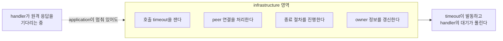
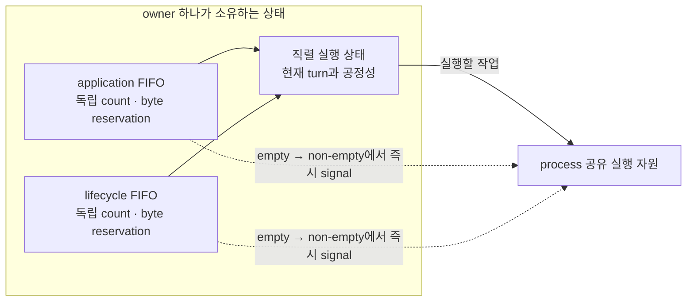

# 42. application과 infrastructure 실행 분리

> **문서 성격 — 공개 규범 스펙이 아닌 내부 설계 문서.** 이 장은 연결된 공개 계약을 만족시키는 구현 구조를 설명한다. Application이 관찰하는 동작을 추가하거나 변경하지 않는다.

[내부 구조 목차](../README.ko.md) · [이전: 41. Spot·Actor 실행 직렬화 — queue와 execution gate를 나눈다](41-internal-serialization.ko.md) · [다음: 43. operation 완료 확정 — 한 번만 확정한다](43-internal-completion.ko.md)

> **이 장이 답하는 것** — handler가 멈춰 있는 동안 무엇이 계속 진행해야 하는가.
>
> **계약 소유** — 수신 한도와 backpressure 계약은 [Framework API](06-framework-api.ko.md)가,
> 비동기 완료 의미는 [비동기 실행 정책](05-async-execution-policy.ko.md)이 소유한다.
> 이 장은 그 계약을 만족시키는 **구조**와, 실행 영역이 섞일 때 나타나는 실패를 다룬다.

Application handler가 원격 응답을 기다리는 동안, 그 호출의 timeout은 누가 재는가?
handler가 멈춰 있는데 timeout도 handler와 같은 줄에서 기다린다면 그 호출은 영원히
끝나지 않는다. 이 문서는 그런 자기 교착을 구조로 막는 방법을 다룬다.

## 1. 핵심 결정 — 두 실행 영역을 나눈다

runtime의 작업은 성격이 다른 두 무리로 나뉜다.

| 영역 | 하는 일 | 진행 조건 |
|---|---|---|
| application | handler 실행, Spot·Actor message, timer callback, session callback | Spot 소유자별 순서를 지킨다 |
| infrastructure | peer 수락, binding operation completion, 호출 완료 확정, owner 정보 갱신, 이동 절차, 종료 절차 | **application의 대기와 무관하게 진행한다** |

정식 spec의 요구는 "독립적으로 진행한다"보다 강하다 — infrastructure 작업은
**application handler가 점유할 수 없는 실행 영역**에서 진행한다
([Framework API 「8.2 Handler 실행 객체와 dependency 수명」](06-framework-api.ko.md#82-handler-실행-객체와-dependency-수명)).

이 그림이 이 문서의 전부다. 화살표가 끊기면 handler는 자기가 기다리는 응답의 timeout을
자기가 막는 상태가 된다.

## 2. 왜 예약 구획이 아니라 분리인가

같은 executor 안에 infrastructure 전용 자리만 떼어 두면 queue 자리는 남아도 실행 주체가 없을 수 있다.
따라서 terminal reply/error completion supply와 ordinary ingress는 실행 progress 영역을 분리한다. 이 분리는
ordinary control에 shared capacity 우회를 주는 규칙이 아니다. Pre-receive에 terminal completion으로
식별되는 supply만 우회하고, application·control·malformed ordinary record는 모두
[dispatch loop](46-internal-dispatch-loop.ko.md)의 shared permit을 먼저 얻는다.

서로 다른 목적의 한도는 합치지 않는다. Core 방향별 byte HWM은 Core queue가 현재 소유한 byte로
transport backpressure를 만들고, host Application job queue는 callback 시작 전 job 수를 제한한다. Owner별
count/byte queue는 ordering과 structural isolation을 소유하며, outbound admission waiter는 send deadline을
소유한다. 같은 profile label이나 단위가 있어도 type·계산·error 의미를 공유하지 않는다.

## 3. 관측이 진행을 막지 않는다

상태 구독자와 metric 수집기는 **어느 영역의 진행 권한도 점유하지 않는다.** 느린
구독자가 message 처리를 늦추면, 관측을 켰다는 이유로 서비스가 느려진다.

구독자에게 보내는 자리는 한도를 두고, 넘치면 **source별 최신 status로 합쳐서** 따라잡는다.
자리가 가득 찼다는 이유로 stream을 끊지는 않는다
([Runtime 상태와 운영 진단 「3. 현재 상태 조회와 변화 관찰」](24-runtime-monitoring.ko.md#3-현재-상태-조회와-변화-관찰)). 반대로
message 처리를 늦추지도 않는다.

## 4. 두 영역에 자원을 어떻게 나누는가

§1은 두 영역이 독립적으로 진행해야 한다고만 말한다. 자원을 얼마나 주는지는 남는
결정이고, 양쪽 극단이 모두 문제다.

| 배분 | 문제 |
|---|---|
| infrastructure에 자원 하나만 | 완료 처리·peer 관리·이동이 전부 그 하나를 통과한다. peer가 늘면 이것이 병목이 된다 |
| infrastructure에도 넉넉히 | [41. Spot·Actor 실행 직렬화](41-internal-serialization.ko.md)의 자원 제약과 충돌한다. 두 배분을 합치면 코어 수를 넘는다 |

**결정 — 자원은 process 하나를 기준으로 배분하고, topology나 [Spot](01-glossary.ko.md#spot) 수에 따라 늘리지
않는다.** infrastructure 작업은 대부분 짧고 대기가 없으므로 application보다 적은 자원으로
충분하다.

### 전용 자원은 물리 thread를 뜻하지 않는다

**결정 — 계약은 "전용 thread"가 아니라 "application이 전부 대기 중일 때 infrastructure가
진행한다"이다.** 네 언어의 실행 모델이 다르기 때문이다.

| 언어 | 실행 자원 | 전용을 만족하는 방법 |
|---|---|---|
| C++ | OS worker pool | infrastructure 전용 worker를 둔다 |
| .NET | thread pool 위의 직렬 drain | infrastructure 작업을 별도 lane으로 제출한다 |
| Java | virtual thread per task | infrastructure lane을 별도 executor에 붙인다 |
| Node | **event loop 하나** | 물리적 분리가 불가능하다. lane만 분리한다 |

Node는 event loop가 하나이므로 물리적으로 전용 자원을 만들 수 없다. 그래서 계약을 다음과
같이 나눈다.

- **보장한다** — application handler가 `await`로 양보한 뒤에는 infrastructure 작업이
  진행한다. application 작업 전부가 결과를 기다리는 상태여도 마찬가지다.
- **보장하지 않는다** — application handler가 양보 없이 CPU를 붙잡고 있는 동안의 진행.
  이것은 계약 위반이 아니라 application의 책임이다. 오래 걸리는 동기 계산은 worker로
  옮기라고 안내한다.

`Task`·`Promise`·virtual thread는 모두 이 계약에서 실행 자원으로 인정한다. 판정 기준은
자료형이 아니라 **양보한 뒤 진행하는가**이다.

이 결정의 관찰 기준은 자원 개수가 아니라 §1의 진행 조건이다. application 작업 전부를
동시에 (양보한 채) 대기시켜 놓고 infrastructure가 진행하는지 확인한다.

## 5. Backpressure를 어디까지 올려 보내는가

송신이 막혔다는 결과를 어디까지 전달할지 정하지 않으면, caller는 같은 상황에서 대기할지
즉시 실패할지 예측할 수 없다.

**결정 — 이 세 단계는 send·publish·one-way 계열에만 적용한다.**

1. 첫 제출이 거절되면 **정해진 시간까지 보낼 공간이 생기기를 기다린다.**
2. 시간 안에 공간이 생기면 **한 번** 제출한다.
3. 시간이 먼저 끝나면 `DeadlineExceeded`로 끝낸다([비동기 실행 정책 「1.3 One-way submit」](05-async-execution-policy.ko.md#13-one-way-submit)).

**Request 계열은 기다리지 않는다.** 같은 runtime의 Spot·Actor 대기열이 가득 차면 즉시
`CapacityExceeded`, 다른 node의 대기열이면 `Unavailable`로 끝낸다
([Spot 메시징 「5.3 Spot application queue에 들어가는 작업」](12-spot-messaging.ko.md#53-spot-application-queue에-들어가는-작업)). Request는 호출자가 결과를 받아
재시도 판단을 할 수 있으므로 기다릴 이유가 없다. 반면 send 계열은 돌려줄 결과가 없어
호출자가 판단할 수 없으므로 기다린다.

**이 단계들은 public 결과가 아직 확정되지 않은 구간에만 적용한다.** 이미 완료된 호출의
뒤에서 일어나는 실패는 여기 해당하지 않는다 — publish가 시작된 뒤의 local target 건너뜀,
이동 중 one-way 버림, 완료된 send의 target admission 실패가 그렇다. 이들은 호출자에게
돌려줄 결과가 없으므로 관측으로만 남긴다.

기다리는 동안 그 작업은 실행 권한을 쥐고 있으면 안 된다. 쥔 채로 기다리면 같은 Spot의
다른 요청이 송신 공간을 기다리는 시간만큼 막힌다.

**결정 — 기다리는 자리도 한도가 있다.** 대기 자리가 가득 차면 기다리지 않고 바로
`DeadlineExceeded`로 끝낸다
([비동기 실행 정책 「1.3 One-way submit」](05-async-execution-policy.ko.md#13-one-way-submit)).
밀렸다는 사실 자체는 caller가 받는 값이 아니다. `Backpressured`는 public terminal result가
아니다. 한도가 없으면 상대가 느릴 때 이쪽 메모리가 상대의 처리 속도에 따라 무한정 늘어난다.

Ordinary source는 host-shared Application Job Queue permit readiness 뒤 receive·claim하고, application
job은 actual callback start까지 permit을 유지한다. Receive 뒤의 payload owner는 native storage 수명을
관리하지만 Core HWM budget을 계속 점유하지 않는다. Control·malformed ordinary record도 같은 permit을
얻되 내부 처리 직후 반환한다. Ordinary connection에서 receive한 뒤 terminal completion으로 분류해
우회를 얻을 수 없다.

Terminal reply/error completion supply는 pre-receive에 별도 식별되는 completion 경로로 진행하므로 ordinary
queue가 포화돼도 correlation과 terminal 결과를 확정할 수 있다. Core receive queue가 차면 방향별 byte HWM이
sender까지 backpressure를 전달한다. Batch와 1:N은 확보한 permit보다 많은 job을 게시하지 않으며 자세한
fairness는 [수신과 dispatch loop](46-internal-dispatch-loop.ko.md), ordinary record storage 수명은
[Payload 소유권](50-internal-message-ownership.ko.md)이 소유한다.

StreamNode의 client→server complete-message `MaxMessageSize`는 이 capacity와 독립된 wire guard다.
6-byte prefix를 제외한 header+payload를 검사하고 기본값은 `64 KiB`이며 server→client outbound에는
적용하지 않는다.

## 6. 한도를 넘었을 때 조용히 버리지 않는다

한도 종류에 따라 terminal 의미를 구분한다. Owner별 structural count/byte 한도 위반과 outbound admission
deadline은 기존 owner error 또는 `DeadlineExceeded`로 끝난다. 반면 host shared Application job queue
capacity 부족은 public reject/drop 사유가 아니며 cancellable oldest-waiter wait다. Core byte HWM은
transport backpressure를 만든다. 어느 경로도 별도 unbounded backlog, polling, busy-spin이나 silent replay를
만들지 않는다.

| 한도 | 무엇으로 재는가 | 포화 의미 |
|---|---|---|
| Core HWM | 방향별 queued/accounted byte | Core queue에서 sender까지 backpressure |
| Application job queue | host instance의 reserved·queued·in-use permit | cancellable shared-cap wait |
| Owner FIFO | owner별 count와 byte | structural owner isolation error |
| Outbound admission waiter | operation family별 bounded waiter | 원래 send deadline/cancellation 결과 |

## 7. 이 결정이 만드는 구현 제약

두 영역을 나누면 **어느 영역에서 실행 중인지 알 수 있어야** 한다. application 문맥에서
infrastructure 전용 작업을 부르거나 그 반대가 되면, 나눈 의미가 사라진다.

실행 중인 영역은 문맥 표시로 확인하고, 잘못된 조합이면 **기다리지 않고 실패로 끝낸다.**
대기로 처리하면 교착이 되고, 통과시키면 분리가 무너지므로 실패가 맞다.

두 영역은 owner마다 물리적으로 다른 FIFO로 둔다. Application FIFO와 lifecycle FIFO는
건수·byte reservation과 admission 상태를 서로 공유하지 않는다. Application FIFO가 가득
차도 이미 수락한 lifecycle 작업을 넣고 실행할 수 있어야 하기 때문이다. 두 FIFO의
우선순위와 굶주림 방지 규칙은 [41. Spot·Actor 실행 직렬화](41-internal-serialization.ko.md)가 설명한다.

Owner가 늘어날 때 실행 thread나 executor를 owner마다 만들지는 않는다. FIFO와 실행 상태는
owner가 소유하지만, 실제 작업을 실행하는 자원은 process 단위로 공유한다. 비어 있던 FIFO에
첫 작업을 넣은 경로가 공유 실행 자원에 즉시 signal 또는 callback을 보낸다. 따라서 다음
처리를 시작하기 위해 주기적으로 owner들을 훑지 않는다.

현재 실행 영역은 문맥 표시로 구분한다. 이 표시를 thread 종류에만 연결하면 Node의 단일
event loop나 thread pool 위에서 실행되는 .NET 경로를 표현할 수 없다. 언어별 실행 수단은
달라도, 잘못된 영역 호출은 같은 방식으로 기다리지 않고 실패해야 한다.

## 8. 확인할 결과

- Application handler를 대기시킨 상태에서 그 호출의 timeout이 발동한다.
- Application handler를 대기시킨 상태에서 종료 절차가 진행된다.
- Application handler를 대기시킨 상태에서 새 peer 연결이 수락된다.
- 느린 상태 구독자가 message 처리 속도를 떨어뜨리지 않는다.
- Shared permit이 모두 예약되면 ordinary ingress가 cancellable wait하고 terminal completion은 계속된다.
- Core receive byte HWM이 찼을 때 sender까지 backpressure가 전달되며 record를 버리지 않는다.
- Owner structural reject와 shared-cap wait가 서로 다른 error/metric으로 관찰된다.
- 이미 완료된 호출 뒤의 실패(publish 시작 후 건너뜀, 완료된 send의 target 실패)는 caller
  결과를 바꾸지 않고 관측에만 남는다.
- application 문맥에서 infrastructure 전용 작업을 호출하면 기다리지 않고 실패한다.
- infrastructure 실행 자원이 topology 수나 Spot 수에 따라 늘지 않는다.
- owner마다 application·lifecycle FIFO와 admission reservation이 분리되어 있다.
- 비어 있던 FIFO에 첫 작업이 들어오면 주기적 확인을 기다리지 않고 실행 자원을 깨운다.
- 송신 공간을 기다리는 작업이 실행 권한을 쥐고 있지 않다.
- 송신 대기 자리가 가득 차면 기다리지 않고 실패한다.

## 포화 상태의 progress 분리

Terminal reply/error completion supply만 shared permit을 우회한다. Ordinary progress와 completion
격리의 permit 순서는 [수신과 dispatch loop](46-internal-dispatch-loop.ko.md)가 소유한다. Receive 뒤
payload storage는 [Payload 소유권](50-internal-message-ownership.ko.md)을 따르지만 Core HWM credit이나
별도 progress authority가 아니다.

## Pressure 전이와 송신 완료

Host queue owner는 permit count 변경과 같은 synchronization 경계에서 80% pause·60% resume
hysteresis를 평가한다. 상태가 바뀌면 지원 socket snapshot에 새 절대 상태를 적용하고, 새 socket은
현재 상태를 적용한 뒤 registry에 게시한다. Socket별 적용을 직렬화하고 stale sequence와 이미 적용한
같은 상태를 건너뛴다. Binding 호출은 queue·registry·user lock 밖에서 수행하고, close는 먼저
registry에서 제거한 뒤 진행한다. Core와 binding이 HWM 재시도와 operation별 completion을 소유하므로
Framework infrastructure domain은 별도 `send_ready` waiter나 retry adapter를 두지 않는다.

---

[내부 구조 목차](../README.ko.md) · [이전: 41. Spot·Actor 실행 직렬화](41-internal-serialization.ko.md) · [다음: 43. operation 완료 확정](43-internal-completion.ko.md)
