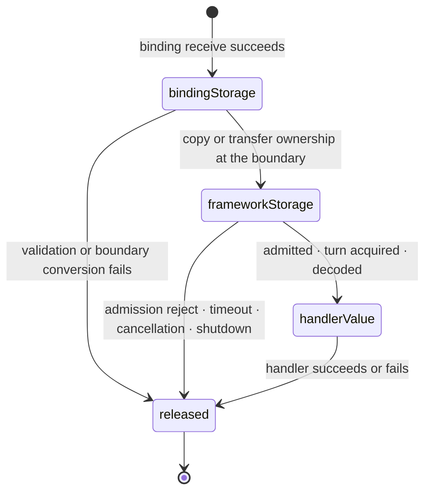
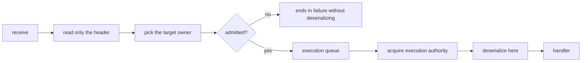

# 50. Payload Ownership And Copy

> **Document status — internal design, not normative public specification.** This chapter explains implementation structure used to satisfy the linked public contracts. It does not add or change application-visible behavior.

[Internal structure table of contents](../README.en.md) · [Previous: 49. Liveness And Status Publication](49-internal-liveness-and-state.en.md) · [Next: 51. Service Wire Protocol](51-internal-service-wire-protocol.en.md)

> **What this chapter answers** — how many times a byte is copied while
> one message travels from the socket to the handler.
>
> **Contract ownership** — payload-size accounting is owned by
> [the Framework API](06-framework-api.en.md), and the
> transfer format by
> [Channel Messaging](08-channel-messaging.en.md). This
> chapter covers the **structure** that satisfies that contract and
> the failures that become visible when payload ownership is violated.

This chapter determines **how many times bytes are copied** while one
message travels from the socket to the handler. Copy count directly
affects throughput. Copying the whole buffer at every ownership
boundary repeats payload-size memory work on the message path.

## 1. Distinguish Two Kinds Of Copy

There are two copies of different character.

| Kind | Example | Can it be eliminated |
|---|---|---|
| **A copy the binding forces** | A copy that moves data into managed memory because that language can't safely keep a native buffer alive | Can't be eliminated |
| **A copy framework creates** | A copy made to pass a queue, to change format, or built ahead of time just in case it's needed later | **Can be eliminated** |

A binding may **not offer a borrowed view** when the native queue's
lifetime can't be tied safely to that language object's reachability.
The first copy is forced for that language mapping.

**Decision — the copies framework adds on top target zero.** A copy
the binding forces is accepted as a per-language fact, and the
implementation is evaluated by how many more copies framework adds on
top of it.

## 2. Eliminable Copies

Framework internals do not create the following copies.

| Type | What it does | Why it can be eliminated |
|---|---|---|
| **Boundary round trip** | Converts `message → byte array → message` and back | Coming back to the same representation makes the middle step a pure waste |
| **Accessor copy** | An accessor returning a list builds a copy **every time it's called** | A read-only access needs no copy, and copy count otherwise grows with read count |
| **A copy to pass the queue** | Copies to secure ownership before enqueuing onto the execution queue | Ownership can be moved rather than copied |
| **Dual retention** | Holds the same payload in two different representations **at once** | Keep one owned representation |
| **A pre-built move record** | Covered separately in the next section | Can be built when the move actually starts |

## 3. Don't Build The Move Record On The Hot Path

**Pre-building a relocation-preparation record for every accepted route
message** adds this cost regardless of whether relocation occurs. A path
that also retains the original and intermediate representations can make
the same payload **reside four times at once.**

**Decision — the move record is built after sealing starts.** A move
is a rare event, and by sealing time, the remaining work in that
owner's queue is already fixed, so it can be built then.

If it must be pre-built, the reason must be that the original is
already released before sealing. In that case, fix **the release time
of the original** before adding an advance copy.

## 4. Ownership While In The Queue

**Decision — the payload of a message that entered the execution queue
is owned by framework.** While pending, neither the transport layer
nor the application touches that buffer.

**Decision — release happens after the handler finishes.** Releasing
the payload while the handler is running invalidates the view the
handler is using.

**What gets released** depends on how the binding represents ownership.
A runtime that keeps the native buffer releases that buffer; one that
moved it into managed memory releases the copy. In either case,
**release happens after handler completion.**

Ownership moves in one direction only. If the payload must outlive the binding receive
callback, the boundary copies it once or transfers ownership. After enqueue, the Framework
owns the encoded payload. The decoded value passed to a handler carries neither ownership of
native storage nor responsibility for releasing it.

Every terminal path converges on the same release point. Handler exceptions, timeout,
cancellation, shutdown, and relocation cleanup neither skip release nor perform it twice. In
C++ and .NET this transition is visible as `close`/`Dispose`. A mapping such as a JVM managed
object or Node `Buffer`, where garbage collection performs the physical release, still keeps
the same logical release point at which the queue and handler stop retaining the storage.

## 5. What's Passed To The Handler

**Decision — the handler receives a deserialized owned object. It
doesn't receive native storage or release responsibility.**

As a result of this decision, **one deserialization copy is
unavoidable** — as long as a
typed handler is offered, the wire representation must be turned into
that language's object.

So §1's "zero framework-created copies" is **a value excluding
deserialization.** The target is `binding-forced copy + one
deserialization`, and everything between is what's targeted for
reduction.

### Don't Mix Counting Units

**Decision — copy accounting counts three kinds separately.** Merging
them into one distorts comparison.

| Unit | What | Why counted separately |
|---|---|---|
| Full buffer copy | Building a whole new byte array | Cost proportional to size. Reducing it is a direct win |
| view · slice | Building a reference pointing at the same buffer | Nearly no cost. Counting it as a copy invents a problem that doesn't exist |
| Object construction | The string/array/object graph deserialization builds | Not one buffer copy. Depends on codec and payload shape |

"One deserialization" is **a value on the buffer-copy axis.** Counting
the object count deserialization produces with the same number as
buffer copies makes it impossible to distinguish the gain from
switching codec from the gain of eliminating a copy.

**Double-copy risk for immutable payloads.** An immutable payload type
can copy the array once at
construction and again every time the accessor is called. If every
accessor call copies, a handler simply reading the payload twice
doubles the copy count. Keep public-API immutability while providing a
separate no-copy path for internal runtime ownership transfer.

An API dealing with raw bytes is used **only for transport inspection
and codec extension implementation**
([Message Model 「1. Typed Messages」](04-message-model.en.md#1-typed-messages)).
Letting a business handler receive raw payload as an argument is a
contract violation.

## 6. When Deserialization Happens

**Decision — read the header first, and deserialize the payload only
right before the handler, after execution authority is acquired.**

Reading the header first isn't a choice — it's needed to decide which
owner to send to. The payload, on the other hand, is seen by no one
until the handler runs.

**Decision — a message that isn't admitted to the execution queue isn't
deserialized.** A message rejected by an object/channel admission rule or because the current
owner doesn't match never reaches the handler. Deserializing it first
**performs expensive work for a message that will be rejected, at the time
when load is highest.**

Application Job Queue saturation is not that rejection. Ordinary ingress waits cancellably for
its host-wide permit before receive or claim, without reject or drop. Once a permit exists, the
separate object/channel admission contract still decides whether the encoded message enters its
execution queue.

A message arriving after a relocation seal is not rejected. The Framework holds its
encoded payload and reply information. It resumes the message at source on an explicit
abort before the relay-ready reply is accepted; afterward, regardless of cutover-submit
result, it hands the message to target handoff or Message Follow. This message also
remains encoded until it acquires execution authority. The hold therefore preserves the
message while postponing deserialization until the handler can actually run.

Deserializing **before acquiring execution authority** spends that work
on a message later rejected inside the authority. Copying before the object/channel admission
decision likewise leaves copy cost on a rejection that contract permits.

**Decision — don't parse the whole thing twice to determine format.**
Test-parsing the payload once and then **parsing it again** for actual
processing duplicates both cost and failure points. Format is what the
header tells you, not something to discover by test-parsing the body.

**Decision — deserialize an admitted message's typed payload at most
once.** The message stores the value or failure produced by its first
typed access. A later access with either the same or a different type
doesn't call the codec again. If the stored value can't be used as the
requested type, the access ends in the language's type-mismatch result;
if the first access failed, it returns that same failure. Obtaining a
read-only raw view or an explicit byte copy doesn't create this typed
outcome.

## 7. Don't Compute Codec Selection On The Message Path

### The Contract — Selection Exists, And Send Differs From Receive

There isn't just one codec. **Several serializers being registered at
once is the premise**, so which one to use must be decided per
message.

The **API shape** expressing this selection **differs per language.**
.NET takes a content-type and a per-type predicate together
(`AddSerializer(contentType, serializer, canSerialize)`,
[.NET Serialization Contract](../languages/dotnet/interfaces/11-serialization.en.md)).
Node's concrete TypeScript representation is defined by the
[Node Foundation Contract](../languages/node/interfaces/01-foundation-configuration.en.md).
Internals doesn't fix one language's API shape as the common structure.
The decisions below apply only to **the meaning of the selection.**

And **send and receive are different boundaries.**

| Direction | Chosen by | If not found |
|---|---|---|
| Send | The **message type declared at the call site** | Uses the JSON codec |
| Receive | The canonical **content-type** carried in the envelope | Ends in `ProtocolError` without re-parsing as JSON |

The basis is
[Framework API 「9. Codec」](06-framework-api.en.md#9-codec),
which explicitly states "the default for choosing the send type and
the validation of the receive wire content-type are different
boundaries, so the same fallback rule doesn't apply to both."

The send selector receives the message type declared at the call site,
not the instance's concrete type. If multiple selectors match, the
later registration takes priority. On receive, the wire's canonical
content-type is compared exactly with the registry key. An unregistered
or noncanonical value completes with `ProtocolError`.

### So What's internals's Job

The same document states that "the internal registry, the **codec
selection cache**, and the dispatch implementation aren't this
document's contract." That is, **the fact that selection happens is
the contract, and its cost is decided by internals.**

### Work Not Repeated Per Message

Codec selection may perform a lookup, but it must not **rebuild strings,
arrays, and call objects on every message.**

| Repeated work | What it creates per message |
|---|---|
| Looks up by type as key and builds a call object | 2 lookups + 2 objects |
| Pulls content-type from the frame, turns it into a string, trims and normalizes it, and compares | Several strings |
| Builds the candidate list as an array and scans it | 2 arrays |
| Compares against the default format as a string | 1–2 comparisons |

Only the last comparison is inexpensive. The rest creates temporary
objects and strings in proportion to throughput.

### So What internals Decides

**Decision — since the registry doesn't change after startup, cache
the selection result.** However, the cache key differs between send
and receive.

| Direction | Cache key | When it's filled |
|---|---|---|
| Receive | The wire's canonical content-type | Since content-type kinds are finite, all of it can be precomputed at startup |
| Send | The message type declared at the call site | Types can't be enumerated in advance. Compute once on first encounter and cache |

The send cache **can't be fully fixed at startup.** The Channel API
takes an arbitrary type per call
([Channel Messaging](08-channel-messaging.en.md)), and the
selector predicate evaluates a declared-type descriptor first
encountered at runtime. Because the registry is immutable, the result
for a type that enters the cache is computed once and doesn't change
afterward.

The send cache stores selection results for up to 1,024 declared types.
Reaching the limit doesn't evict existing entries. Each type first seen
after the limit is evaluated against the registration list on every
send, and its result isn't cached. This keeps lookup cheap for the
already-frequent types while bounding cache size.

[40. Layer Boundary And Identifier 「5. Registration Declaration Is Validated Only Once, At Start」](40-internal-layering.en.md#5-registration-declaration-is-validated-only-once-at-start)'s
"registration declaration is validated only once at startup" applies
here exactly the same way — if it's immutable after startup, compute
it ahead of time and read it **without a lock.** Writing lookup results
at runtime into a dictionary that can't handle concurrent access adds
a race; precomputing removes the runtime write.

**Decision — don't build a new string to compare content-type.** If
trimming/normalizing is needed, do it at registration time, and
compare already-normalized values against each other on the message
path.

**Decision — don't build a new list or temporary object to pick a
candidate.** Even in a situation with only one registered codec,
building it every time attaches that allocation to every message.

**Decision — if the receive content-type isn't found, end in
`ProtocolError` rather than falling back to JSON.** This is a value the
spec already fixed. Falling back would try to parse a different
format's bytes as JSON and produce a bogus error.

### Required Input For Receive Codec Selection

The receive content-type is not pass-through metadata; it is **the
input that selects the codec.** Ignoring it prevents the runtime from
distinguishing a non-JSON payload and suppresses the required
`ProtocolError` for an unregistered content-type.

## 8. Result To Confirm

- The same payload isn't kept in two different representations at
  once.
- There's no `message → byte array → message` round trip.
- An accessor returning a list doesn't build a copy on every call.
- A move record isn't built for a message whose move hasn't started.
- A pending payload isn't touched by the transport layer or the
  application.
- Payload release happens after handler completion.
- Every terminal path—success, rejection, exception, timeout, cancellation, and shutdown—
  releases payload ownership exactly once.
- The handler doesn't receive native storage or release
  responsibility.
- A message rejected for queue-full or owner mismatch isn't deserialized.
- A message held during a move isn't deserialized before it acquires execution
  authority after commit replay or abort resumption.
- Payload deserialization happens after execution authority is
  acquired.
- The whole payload isn't parsed twice to determine format.
- The message stores the first typed access's value or failure, and its
  codec is called at most once.
- The receive codec table is fixed at startup.
- Send codec selection results are stored for up to 1,024 declared
  types without evicting existing entries.
- A type first seen after the send-cache limit isn't stored and is
  re-evaluated for every message.
- Codec-related processing doesn't create a new string, array, or call
  object per message.
- When no codec matches the receive content-type, it ends in
  `ProtocolError` instead of falling back to JSON.
- Reading codec info doesn't require a lock.

## Retained Core Leases And 1:N Child Ownership

A record retained from Core receive has one shared owner for its payload and Core
receive-credit lease. Each exact-target child releases its application permit at the actual
callback's first instruction; a pre-start terminal child returns its permit exactly once.
After enqueueing the first child, remaining child permits are acquired lazily through the
[dispatch loop](46-internal-dispatch-loop.en.md) FIFO, without copying unacquired child payloads into
a separate unbounded queue.

The shared retained owner returns the Core lease exactly once after every child terminal and
any required record-level reply attempt are terminal. If cancellation, decode failure, owner
close, or shutdown occurs during partial child acquire/enqueue, permits not yet enqueued are
returned immediately; enqueued children clean up at their pre-start or handler-start
boundary. For a one-way record requiring no reply attempt, all child terminals establish the
record terminal.

---

[Internal structure table of contents](../README.en.md) · [Previous: 49. Liveness And Status Publication](49-internal-liveness-and-state.en.md) · [Next: 51. Service Wire Protocol](51-internal-service-wire-protocol.en.md)
