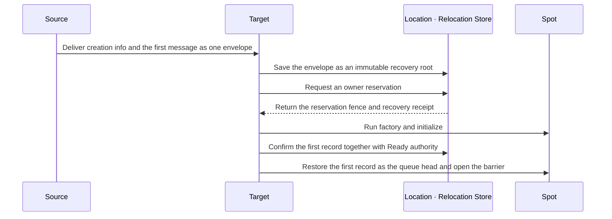

# C++ Spot Exact Interface

Spot relocation that includes an Actor bound to a Session restores
Spot/Actor state and queue at the target, commits owner and
membership, and then starts message processing. The target runtime
sends `sessionActorLocationUpdateReqMsg` to update the route and
location snapshot of each bound Actor. Even without a response,
message processing doesn't stop, and the same request is resent at a
fixed interval. Since relocation itself isn't a physical/logical
disconnect, it doesn't run the Actor disconnect callback. It doesn't
change the route and physical connection of a different Actor not
included in the relocation target.

[C++ exact interface table of contents](README.en.md)

## 1. Spot Identity And Relocation Registration

The User/Instance Spot factory configure callback specifies exactly
one of `disable_relocation()`, `recreate_on_relocation()`, or
`preserve_state_with<TAdapter>()`.

```cpp
namespace zlink::framework {

template <typename TSpot>
class spot_relocation_adapter_t {
public:
    virtual ~spot_relocation_adapter_t() = default;
    virtual task_t<std::vector<std::byte>> capture(
      TSpot &spot,
      std::stop_token operation_cancellation) = 0;
    virtual task_t<void> restore(
      TSpot &spot,
      std::vector<std::byte> payload,
      std::stop_token operation_cancellation) = 0;
};

template <typename TSpot>
class user_spot_factory_builder_t {
public:
    user_spot_factory_builder_t &set_stable_type_limit(std::int32_t limit);
    user_spot_factory_builder_t &set_execution_mode(user_spot_execution_mode_t mode);
    user_spot_factory_builder_t &set_relocation_readiness(
      spot_relocation_readiness_mode_t mode);
    void disable_relocation();
    void recreate_on_relocation();
    template <typename TAdapter>
      requires std::derived_from<TAdapter, spot_relocation_adapter_t<TSpot>>
    void preserve_state_with();
};

template <typename TSpot>
class instance_spot_factory_builder_t {
public:
    instance_spot_factory_builder_t &set_stable_type_limit(std::int32_t limit);
    void disable_relocation();
    void recreate_on_relocation();
    template <typename TAdapter>
      requires std::derived_from<TAdapter, spot_relocation_adapter_t<TSpot>>
    void preserve_state_with();
};

} // namespace zlink::framework
```

In `preserve_state_with<TAdapter>()`, `TAdapter` must implement
`spot_relocation_adapter_t<TSpot>`. Passing an Actor adapter, or an
adapter that doesn't match the [Spot](../../../../01-glossary.en.md#spot)
factory, fails as a configuration error before socket bind. The
adapter exchanges application state only as an opaque byte vector, and
doesn't expose typed state, a separate contract identifier, or a
message wrapper.

The exact declaration of the factory registration member is owned by
[Channel messaging](03-channel-messaging.en.md)'s
`mesh_node_builder_t`.

## 2. Spot Framework API

The Framework Spot surface is based on the owner MeshNode and
`zlink::framework::spot_t`.

```cpp
namespace zlink::framework {

enum class spot_kind_t {
    invalid = 0,
    entry = 1,
    user = 2,
    instance = 3
};

enum class spot_close_reason_t {
    explicit_close = 0,
    host_shutdown = 1,
    relocation_out = 2,
    idle_evicted = 3
};

struct spot_closing_context_t final {
    spot_close_reason_t reason;
    std::chrono::system_clock::time_point deadline;
};

using spot_id_t = std::string;

class spot_ref_t final {
public:
    spot_ref_t(spot_id_t spot_id,
      std::uint64_t object_generation,
      std::string mesh_name,
      node_rid_t node_rid);

    const spot_id_t &spot_id() const noexcept;
    std::uint64_t object_generation() const noexcept;
    std::string_view mesh_name() const noexcept;
    const node_rid_t &node_rid() const noexcept;
};

class spot_context_t;
class entry_spot_context_t;
class instance_spot_context_t;
class spot_handler_registry_t;
class instance_spot_handler_registry_t;
struct spot_actor_join_result_t;
struct actor_create_response_t;
struct spot_create_response_t;

enum class spot_relocation_ready_outcome_t : std::uint8_t {
    continued = 0,
    relocated = 1,
};

struct spot_relocation_ready_completion_t {
    spot_relocation_ready_outcome_t outcome;
};

class spot_relocation_ready_call_t {
public:
    spot_relocation_ready_call_t(spot_relocation_ready_call_t &&) noexcept;
    spot_relocation_ready_call_t(const spot_relocation_ready_call_t &) = delete;
    void defer();
};

template <typename TActor>
class spot_t {
public:
    using actor_type = TActor;

    virtual ~spot_t() = default;
    virtual spot_context_t &context() noexcept = 0;
    virtual const spot_context_t &context() const noexcept = 0;
    virtual void configure() = 0;
    virtual task_t<spot_create_response_t> on_create(
      const message_t &request);
    virtual task_t<void> on_initialize();
    virtual task_t<void> on_closing(
      const spot_closing_context_t &context,
      std::stop_token cleanup_cancellation);
    virtual task_t<void> on_relocation_ready_completed(
      const spot_relocation_ready_completion_t &completion);
    virtual task_t<spot_actor_join_result_t> on_actor_join(
      std::string_view actor_id,
      const message_t &request) = 0;
    virtual task_t<void> on_actor_joined(TActor &actor) = 0;
    virtual task_t<void> on_leave_actor(TActor &actor) = 0;
    virtual task_t<void> on_disconnect_actor(TActor &actor);
};

template <typename TActor>
class entry_spot_t {
public:
    using actor_type = TActor;

    virtual ~entry_spot_t() = default;
    virtual entry_spot_context_t &context() noexcept = 0;
    virtual const entry_spot_context_t &context() const noexcept = 0;
    virtual void configure() = 0;
    virtual task_t<void> on_initialize();
    virtual task_t<void> on_closing(
      const spot_closing_context_t &context,
      std::stop_token cleanup_cancellation);
    virtual task_t<actor_create_response_t> on_create_actor(
      TActor &actor,
      const message_t &create_request);
    virtual task_t<spot_actor_join_result_t> on_actor_join(
      std::string_view actor_id,
      const message_t &request) = 0;
    virtual task_t<void> on_actor_joined(TActor &actor) = 0;
    virtual task_t<void> on_leave_actor(TActor &actor) = 0;
    virtual task_t<void> on_disconnect_actor(TActor &actor);
};

class instance_spot_t {
public:
    virtual ~instance_spot_t() = default;
    virtual instance_spot_context_t &context() noexcept = 0;
    virtual const instance_spot_context_t &context() const noexcept = 0;
    virtual void configure() = 0;
    virtual task_t<void> on_initialize();
    virtual task_t<void> on_closing(
      const spot_closing_context_t &context,
      std::stop_token cleanup_cancellation);
};

class spot_common_context_t {
public:
    std::string_view mesh_name() const;
    node_rid_t node_rid() const;
    spot_id_t spot_id() const;
    std::uint64_t object_generation() const noexcept;
    channel_client_t outbound() const;

    template <typename TCommand>
    spot_send_call_t send_to_spot(spot_id_t target, TCommand command);

    template <typename TRequest>
    spot_request_call_t request_to_spot(
      spot_id_t target,
      TRequest request);

    template <typename TEvent>
    publish_call_t publish(
      std::string channel_name,
      std::string topic,
      TEvent event);

    template <typename THandler>
    timer_t add_timer(std::string name,
      std::chrono::milliseconds period,
      timer_options_t options = {});

    template <typename TWork>
    auto run_cpu_worker(TWork work);

    template <typename TWork>
    auto run_io_worker(TWork work);

};

class spot_context_t : public spot_common_context_t {
public:
    ~spot_context_t();
    spot_context_t(spot_context_t &&) noexcept;
    spot_context_t &operator=(spot_context_t &&) = delete;
    spot_context_t(const spot_context_t &) = delete;
    spot_context_t &operator=(const spot_context_t &) = delete;

    spot_handler_registry_t handlers();
    spot_relocation_ready_call_t relocation_ready();

    template <typename TActor>
    task_t<void> leave_actor(TActor &actor);

    task_t<bool> close();
};

class entry_spot_context_t : public spot_common_context_t {
public:
    ~entry_spot_context_t();
    entry_spot_context_t(entry_spot_context_t &&) noexcept;
    entry_spot_context_t &operator=(entry_spot_context_t &&) = delete;
    entry_spot_context_t(const entry_spot_context_t &) = delete;
    entry_spot_context_t &operator=(const entry_spot_context_t &) = delete;
    spot_handler_registry_t handlers();

    template <typename TActor>
    task_t<void> destroy_actor(TActor &actor);

    task_t<void> destroy_actor(const actor_ref_t &actor);
};

class instance_spot_context_t : public spot_common_context_t {
public:
    ~instance_spot_context_t();
    instance_spot_context_t(instance_spot_context_t &&) noexcept;
    instance_spot_context_t &operator=(instance_spot_context_t &&) = delete;
    instance_spot_context_t(const instance_spot_context_t &) = delete;
    instance_spot_context_t &operator=(const instance_spot_context_t &) = delete;

    instance_spot_handler_registry_t handlers();
    task_t<bool> close();
};

struct spot_actor_join_result_t {
    bool accepted = false;
    std::optional<zlink::framework::message_t> reply;

    static spot_actor_join_result_t accept(
      std::optional<message_t> reply = std::nullopt);

    template <typename TReply>
    static spot_actor_join_result_t accept(TReply reply);

    static spot_actor_join_result_t reject(
      std::optional<message_t> reply = std::nullopt);

    template <typename TReply>
    static spot_actor_join_result_t reject(TReply reply);
};

struct actor_create_response_t {
    bool accepted = true;
    std::optional<zlink::framework::message_t> reply;

    static actor_create_response_t accept(
      std::optional<message_t> reply = std::nullopt);

    template <typename TReply>
    static actor_create_response_t accept(TReply reply);

    static actor_create_response_t reject(
      std::optional<message_t> reply = std::nullopt);

    template <typename TReply>
    static actor_create_response_t reject(TReply reply);
};

enum class spot_create_state_t {
    existing = 0,
    created = 1,
    rejected = 2
};

struct spot_create_response_t {
    bool accepted = true;
    std::optional<zlink::framework::message_t> reply;

    static spot_create_response_t accept(
      std::optional<message_t> reply = std::nullopt);

    template <typename TReply>
    static spot_create_response_t accept(TReply reply);

    static spot_create_response_t reject(
      std::optional<message_t> reply = std::nullopt);

    template <typename TReply>
    static spot_create_response_t reject(TReply reply);
};

struct spot_create_result_t {
    spot_ref_t spot;
    spot_create_state_t state = spot_create_state_t::created;
    std::optional<zlink::framework::message_t> reply;
};

class spot_handler_registry_t {
public:
    template <auto Method>
    spot_handler_registry_t &add_handler(std::string packet_name = {});

    template <auto Method>
    spot_handler_registry_t &add_subscribe(
      std::string channel_name,
      std::string topic);

    template <auto Method>
    spot_handler_registry_t &add_actor_send(std::string packet_name = {});

    template <auto Method>
    spot_handler_registry_t &add_actor_request(std::string packet_name = {});
};

class instance_spot_handler_registry_t {
public:
    template <auto Method>
    instance_spot_handler_registry_t &add_handler(
      std::string packet_name = {});
};

class bound_session_t {
public:
    template <typename TMessage>
    bound_session_send_call_t send(const TMessage &message);

    task_t<void> disconnect();
};

class actor_join_call_t {
public:
    actor_join_call_t(actor_join_call_t &&) noexcept;
    actor_join_call_t &operator=(actor_join_call_t &&) noexcept;
    actor_join_call_t(const actor_join_call_t &) = delete;
    actor_join_call_t &operator=(const actor_join_call_t &) = delete;

    actor_join_call_t &timeout(std::chrono::milliseconds timeout);

    // registers the Join to start once the current handler ends normally.
    void defer();
};

class actor_context_t {
public:
    const actor_ref_t &actor_ref() const noexcept;
    const actor_id_t &actor_id() const noexcept;
    std::uint64_t object_generation() const noexcept;
    std::string_view mesh_name() const noexcept;
    std::optional<spot_id_t> spot_id() const;
    bound_session_t bound_session() const;

    actor_join_call_t join_spot(spot_id_t spot_id);

    actor_join_call_t join_spot(spot_id_t spot_id,
      const zlink::framework::message_t &request);

    actor_join_call_t join_entry_spot();

    actor_join_call_t join_entry_spot(
      const zlink::framework::message_t &request);

    template <typename TRequest>
    actor_join_call_t join_spot(spot_id_t spot_id,
      const TRequest &request);

    template <typename TRequest>
    actor_join_call_t join_entry_spot(const TRequest &request);
};

} // namespace zlink::framework
```

`spot_context_t::publish(...)` takes the target ChannelName and topic
together. Publish is submitted once per remote MeshNode through the
[MeshNode](../../../../01-glossary.en.md#meshname) ROUTER, and the
receiving node only checks the node-local subscription. Each remote
ROUTER and local mailbox admits per target, and one target's failure
doesn't cancel a previously accepted transmission. Spot/Actor
registration belongs to the
[owner](../../../../01-glossary.en.md#owner) `mesh_node_builder_t`.

`mesh_node_socket_config_t::max_message_size` is set only before
startup, and no runtime setter is provided. `0` is normalized to the
maximum complete message size the binding or transport can receive.
If the transport is unlimited, it uses the value obtained by
subtracting envelope overhead from the service wire's `uint32`
representation limit. A positive value can't exceed that
representation limit, and exceeding it is rejected as a startup
configuration error. The peer exchanges the normalized value through
an internal handshake, and the sender and receiver each apply the
smaller effective bound of the two before complete-message allocation.
A public option for this negotiation isn't provided.
If `send_timeout` isn't specified, the framework default of 1 second
is used. If `receive_timeout` isn't specified, there's no separate
bound on receive waiting. HWM must be 0 or greater.

The Spot Actor Join/Relocation-related interface is also a formal
contract recorded in this document, and its behavioral meaning follows
the [common spec](../../../../15-spot-actor.en.md). If an implementation
or contract test differs from this signature, it's treated as a
contract mismatch.
`join_entry_spot(...)` doesn't take a target node RID — the Framework
selects the current eligible Entry Spot.

`spot_close_reason_t`'s values are `explicit_close=0`,
`host_shutdown=1`, `relocation_out=2`, `idle_evicted=3`.
`idle_evicted` is an
[Instance Spot](../../../../01-glossary.en.md#entry-spot-user-spot-and-instance-spot)-only
reason and isn't delivered to Entry Spot or User Spot. The idle
judgment condition and the reactivation rule after cleanup are owned
by
[Spot Model §6.2](../../../../11-spot-model.en.md#62-cleaning-up-an-idle-instance-spot).
The context's `deadline` is the closing operation's absolute UTC time.
The Framework doesn't request stop on `cleanup_cancellation` before the
callback invocation, and requests it once the deadline ends. Only
Entry/User/[Instance Spot](../../../../01-glossary.en.md#entry-spot-user-spot-and-instance-spot)
receive the callback, and a per-Actor closing callback isn't provided.
Host Shutdown runs the callback while Actor membership and the local
instance are still valid, and cleans up scope and authority after
completion. Standalone Actor relocation doesn't close the Entry Spot,
so it doesn't call this callback.

`entry_spot_context_t::destroy_actor(...)` is only called from an
Entry Spot. An Actor on a user Spot must first complete
`leave_actor(...)` or an Entry Spot join. Since Destroy isn't a
[membership](../../../../01-glossary.en.md#membership) move, it doesn't
call `on_leave_actor` again, and a duplicate destroy of the same Actor
instance doesn't run an additional lifecycle callback and ends as
success. The full order follows
[Actor Model §6](../../../../14-actor-model.en.md#6-actor-lifecycle).

The cross-node materialization behavior of an Actor and a User/Instance
Spot is decided by the factory builder wired to the factory
registration. A separate relocation adapter registry or per-operation
adapter isn't provided. Only a Spot factory that selected
`preserve_state_with<TAdapter>()` captures/restores Spot application
state with `spot_relocation_adapter_t<TSpot>`. A whole User Spot
relocation uses a Spot adapter for the Spot root and
`actor_relocation_adapter_t<TActor>` for each Actor participant. A
same-node operation and `disable_relocation()`/
`recreate_on_relocation()` don't call the Spot adapter. A cross-node
operation that selected `disable_relocation()` is rejected before
capture.

A Spot adapter's `capture(...)` result is at most 64 MiB, and an empty
vector is valid. Ownership of the returned vector moves to the
Framework, and the vector passed to `restore(...)` is owned by that
async call. If capture throws or ends as a failed task, admission is
restored after durable abort and source normalization. A failed
restore's instance is discarded, and the same immutable payload is
applied to the instance the new attempt's factory built. If the
Framework cancels a callback due to the operation
[deadline](../../../../01-glossary.en.md#deadline), it's classified as
`deadline_exceeded`. Because recovery can call both methods at least
once and they can overlap between a stale attempt and its successor,
the adapter must be retry-safe. The Framework doesn't guarantee
exactly-once for the adapter's external side effect.

In C++, an ordinary Spot packet and Actor payload handler is
registered by `spot_context_t::handlers()`. An Actor handler is a
member of the containing Spot, uses the called Spot instance as
`this`, and takes a mutable Actor, a read-only `message_context_t`, and
a payload as arguments. A message that changes a different Spot's
state is submitted through a global `spot_id_t` direct call. Actor
lifecycle isn't a registry registration surface. Since a separate Actor
handler object isn't made, per-Actor mutable state is owned by the
Actor. A Spot member function of an Entry Spot or `PerActor` User Spot
can be called concurrently for different Actors, and per-Actor state
must not be stored in a Spot field. Per-Actor execution resource
belongs to Actor activation, is kept on a same-node Join, and is
rebuilt at target activation after cross-node Join and relocation. A
timer handler, a separate class, is built once per Spot activation and
reused. If a timer handler declares `dependency_types`, the dependency
is also resolved in the same Spot activation scope. On Spot close and
source relocation, the handler and scope are cleaned up. At target
activation, a new handler and scope are built. The application doesn't
separately register a timer handler as a singleton/scoped/transient
service or choose its lifetime. A public handler lifetime option isn't
provided.
A User Spot and Entry Spot return accept or reject in
`on_actor_join(...)`, which takes the actor ID and join request. After
commit, the callback directly receives the concrete Actor reference the
matching factory built. So a separate membership DTO isn't inserted
into the lifecycle callback. The Joined, leave, and disconnect
callbacks return `task_t<void>`, and the lifecycle callback is
considered complete only once the task completes. Using `yield()` to
wait for a channel round trip inside a `SpotWide` User Spot's or
Instance Spot's callback returns the shared Spot turn, and resumes the
callback with a new turn on the same Spot execution queue after the
response. `yield()` can't be used in an Entry Spot or a `PerActor`
User Spot.
An ordinary Spot type must inherit
`zlink::framework::spot_t<TActor>` specifying the concrete Actor type,
and an Entry Spot type must inherit
`zlink::framework::entry_spot_t<TActor>`. The two base classes fix the
virtual contract of the lifecycle callback, and `add_spot<TSpot>()` and
`add_entry_spot<TEntrySpot>()` confirm this contract at compile time.
The role isn't inferred from name, file location, or method presence
alone.

An Instance Spot inherits `instance_spot_t` and has no Actor callback.
The application instance exposes the `instance_spot_context_t` the
Framework wired in at creation through `context()`. The Framework uses
`configure()` with no argument, `on_initialize()` with no message, and
`on_closing(context, cleanup_cancellation)` as the actor-free lifecycle.
Only a direct packet and timer handler can be registered in
`configure(...)`. The instance context's dedicated registry has no
Actor handler or Logical Multicast
[subscription](../../../../01-glossary.en.md#subscription) registration
member. Duplicate-registering the same stable `instance_spot_type` or
the same Spot class in both a User Spot factory and an Instance factory
on the same MeshNode fails as a configuration error before socket
bind.

The process of building and initializing a new instance to make it
usable when no Instance Spot is running is called cold activation. The
factory builds a `TSpot` instance in the cold activation scope of a
direct call carrying an Instance Spot marker, or in the reactivation
scope of a stored creation intent, and then calls `configure()` and
`on_initialize()` in order. It doesn't pass an empty `message_t` to
`on_create(...)`. The Framework confirms the first work message as the
durable activation inbox's first record, and commits Location `Ready`
that includes the recovery root/cursor while keeping the handler
barrier. The runtime restores the first record as the local queue head
and then opens the activation barrier. Close calls
`on_closing(context, cleanup_cancellation)` once, and releases only the
location row that satisfies the fencing condition.

A User Spot starts a `Creating` reservation with the manager's explicit
Create/GetOrCreate. Only a direct call that selected `instance_spot()`
on `spot_send_call_t` or `spot_request_call_t` starts
[cold activation](../../../../01-glossary.en.md#cold-activation) of a
missing RID for an Instance Spot. For an ordinary send/request with no
marker, a missing RID ends with `not_found` without running a factory
or recording a creation intent.

Source and target split roles in the following order.

1. If the Source has `Ready`
   [authority](../../../../01-glossary.en.md#authority), it sends an
   ordinary message to the current owner.
2. If authority is `Missing`, the Source selects a target. The Source
   doesn't create a creation reservation.
3. The Source puts SpotId, stable type, creation intent, and the first
   message into one activation envelope and sends it to the target.
   This envelope is a Framework-internal message not delivered to the
   application handler.
4. The Target first saves the complete envelope, including metadata
   presence and frame, to the Relocation Store as an immutable recovery
   root.
5. Only when there's no local instance of the same Spot does the
   Target request a reservation to register itself as owner. The
   Reserved snapshot returns the provider-issued reservation fence and
   the recovery root receipt.
6. Only the target that secured the reservation first runs factory and
   initialize, and confirms the first message as the durable activation
   inbox's first record.
7. The Target commits the recovery root/cursor, `Ready`, and the
   pending-to-active capacity change together while keeping the handler
   barrier. The runtime restores the first record as the local queue
   head and then opens the barrier.



This diagram is the normal path where the selected target secures the
reservation first. If a competing target or a duplicate envelope
secured the reservation first, the current target doesn't build a
factory. Instead it reads the current authority and reroutes to the
owner, or joins the in-progress attempt. Since the Source doesn't resend
the same message after `Ready`, the first message enters the queue only
once. A local-only instance that doesn't match authority can't process
a message. Failure cleans up authority and reserved capacity together
through an exact Abort.
The recovery pointer is removed by Preserve CAS only after durably
recording the first handler's terminal completion and updating the
replay cursor to the inbox sequence. It isn't removed by queue
admission alone.

A `SpotWide` User Spot's and its member Actors' relocation is handled
as a generic aggregate. It doesn't block host relocation just because
active membership exists, and switches aggregate owner and membership
together in one commit. A `PerActor` User Spot switches Spot authority
first and moves each Actor separately.
`spot_context_t::close()` and `instance_spot_context_t::close()` use
the exact current SpotRef the context holds.

An ordinary User Spot close ends with `false` if even one active Actor
membership exists, and keeps admission and authority. The caller can
close only after completing leave or destroy of member Actors, and the
Framework doesn't hide-move or remove an Actor for close. In host
relocation, a `SpotWide` User Spot moves every current member Actor as
one aggregate, and doesn't put a fixed cap on the total participant
count. A `PerActor` User Spot only rebuilds the stateless shell at the
new target and moves the Actor as an independent unit.

An Instance Spot factory only implements the actor-free lifecycle. The
source runtime only sends a missing RID's
[activation envelope](../../../../01-glossary.en.md#activation-envelope)
to the target from a direct call carrying an Instance Spot marker. The
target runtime starts a creation claim to make itself owner based on
the envelope. `instance_spot()` is a marker that omits the
[stable type](../../../../01-glossary.en.md#stable-type), and
`instance_spot(stable_type)` is a marker that specifies the type.
`in_mesh(mesh_name)` selects the Mesh to first place a missing RID in.
If an authority row that's already `Ready` exists, it's delivered to
the same row through global SpotId lookup of the current owner even
without a marker and stable type.

A marker omitting stable type compares the Instance Spot capability the
selected Mesh's eligible descriptor published. If there's exactly one
distinct stable type, that type is used. With two or more, the caller
must specify the type with `instance_spot(stable_type)`, and it ends
as a call error before creating a reservation. With no registered type,
it ends with a missing result. An explicit stable type that differs
from the existing row is `type_mismatch`, and the caller doesn't need
to resend the existing row's type.

If `in_mesh(...)` is omitted and there's no eligible Object Mesh, it's
`not_configured`; with two or more, it's `invalid_operation`. With
exactly one, that Mesh is selected. If `in_mesh(...)` specifies a Mesh
that can't be found, it's `not_found`. After a Mesh is selected, if
stable type is omitted and there are 0 distinct Instance Spot types,
it's `not_found`; with two or more, it's `invalid_operation`. If
multiple MeshNodes register the same stable type, it counts as one
distinct type.

A one-way call heading to a Cold Instance includes resolve,
reservation, activation, and outbound admission in the same send
deadline, and completes at the admission result. A request waits
through activation, handler, and terminal reply. After owner loss, the
same instance is reactivated using the creation intent stored in
authority.

`spot_ref_t` is an immutable location snapshot holding the global
SpotId, an ObjectGeneration in the `1..9223372036854775807` range, and
the MeshName/NodeRid at lookup time. It isn't used as an ordinary
message target, and a separate handle, resolver, and address type
aren't provided.
SpotId and stable type are UTF-8 `1..255`-byte exact values, and don't
apply trim, case folding, or Unicode normalization. `spot_id_t` is a
case-sensitive exact `std::string` of UTF-8 encoded size 1..255 bytes.

```cpp
class player_actor_t;

class bingo_room_spot_t : public zlink::framework::spot_t<player_actor_t>,
                          public bingo_room_t {
public:
    explicit bingo_room_spot_t(
      zlink::framework::spot_context_t context)
      : context_(std::move(context)) {}

    zlink::framework::spot_context_t &context() noexcept override {
        return context_;
    }

    const zlink::framework::spot_context_t &context()
      const noexcept override {
        return context_;
    }

    void configure() override;

    zlink::framework::task_t<zlink::framework::spot_actor_join_result_t>
    on_actor_join(
      std::string_view actor_id,
      const zlink::framework::message_t &request) override;

    zlink::framework::task_t<void> on_actor_joined(
      player_actor_t &actor) override;

    zlink::framework::task_t<void> on_leave_actor(
      player_actor_t &actor) override;

    zlink::framework::task_t<void> on_disconnect_actor(
      player_actor_t &actor) override;

    start_bingo_game_res_t start_game(
      player_actor_t &actor,
      const zlink::framework::message_context_t &message_context,
      const start_bingo_game_req_t &request);

private:
    zlink::framework::spot_context_t context_;
};

class player_actor_t : public zlink::framework::actor_t {
};

class bingo_entry_spot_t
  : public zlink::framework::entry_spot_t<player_actor_t> {
public:
    explicit bingo_entry_spot_t(
      zlink::framework::entry_spot_context_t context)
      : context_(std::move(context)) {}

    zlink::framework::entry_spot_context_t &context() noexcept override {
        return context_;
    }

    const zlink::framework::entry_spot_context_t &context()
      const noexcept override {
        return context_;
    }

    void configure() override;

private:
    zlink::framework::entry_spot_context_t context_;
};
```

The three Contexts are move-only handles only the Framework can create.
The factory moves the passed-in handle into a read-only member of the
application object, and returns that handle from `context()`. Identity
can't be created or replaced through default construction, copy, or
assignment.

`route_mesh_runtime_options_t` is a public DI singleton. Looking up an
unregistered [ChannelName](../../../../01-glossary.en.md#channelname)
fails as a configuration error. Only the ChannelName weight can be
changed while running. The maximum message size can't be changed after
startup. [Weight](../../../../01-glossary.en.md#weight) is 0 through
10000, defaulting to 100. A value outside the range is a configuration
error in both startup config and runtime change. 0 excludes that
membership from a new select-one and Logical Multicast remote target.

A Spot and Entry Spot have their lifetime owned by the activation
scope. A default-constructible type registers only the type. A type
with a constructor dependency, or one whose application must decide
how to build it, is registered as a factory overload. The factory is
called by the framework when activating a Spot, and the returned
instance's lifetime is also managed in the same activation scope.

An ordinary Spot packet member receives a payload and
`message_context_t`, and a subscription member receives a payload and
`publish_message_context_t`.
A member handling actor join admission receives `std::string_view
actor_id` and a `zlink::framework::message_t` request, and returns
whether accepted and an optional reply `zlink::framework::message_t`
as `spot_actor_join_result_t`. Actor type and source/target Spot and
node information are only used for framework-internal routing and
validation.
Only when accepted is `true` does it commit the actor location to the
user Spot and call `on_actor_joined(TActor&)`. If accepted is `false`,
the actor location doesn't change and the post-joined callback also
isn't called. A post-commit result is distinguished by callback name.
When Maintenance materializes an Actor on the target Entry Spot,
Snapshot first completes the Actor adapter's `restore(...)`, and
Recreate completes factory materialization without payload restore.
It then restores queue/Actor timer, commits Location authority/Entry
membership, and starts Actor message processing. Bound Session
location update is performed with the
`sessionActorLocationUpdateReqMsg` and
`sessionActorLocationUpdateResMsg` send messages, and Actor processing
doesn't stop even without a response. Infrastructure relocation doesn't
call target joined, source leave, or a separate relocation callback.

Only an ordinary same-node/remote User/Entry Spot join uses the
existing `on_actor_join(...)`, `on_actor_joined(...)`, and source
`on_leave_actor(...)` contract. In a `SpotWide` User Spot aggregate's
or a `PerActor` User Spot's Actor relocation, the member Actor's
membership callback isn't called. A `PerActor` Spot policy only allows
`RecreateOnRelocation` and doesn't register a Spot adapter. A Spot
field and Spot-level schedule aren't moved. Shared state and schedule
that must be kept are placed in an external store the application
owns, such as Redis, a database, or a service.
The target runtime-private shell uses the same public Spot ID and
object generation, and isn't exposed to public lookup before Spot
authority. After the authority switch, `ToSpot`, Create, and Join use
the target, and `ToActor` uses the per-Actor current owner. A stale
source route is relayed while preserving operation identity,
generation, deadline, correlation, and reply route. The 1-second window
from Actor queue seal to target admission is an operational goal — 
exceeding it doesn't cancel or roll back the relocation.

`spot_context_t::relocation_ready().defer()` is only valid in a Spot
turn that registered both `spot_wide` and `application_signaled`. The
Framework delivers a `continued` completion from the source if it
didn't move or aborted before commit, and a `relocated` completion from
the target if it moved, to
`on_relocation_ready_completed(...)`. The default virtual
implementation is a no-op. Before callback completion, pending
application messages and timers aren't run.

A duplicate `defer()` in the default `any_turn_boundary`, `per_actor`,
Entry/Instance Spot, or outside a Spot turn on the same turn fails with
`invalid_operation` before queue mutation. A different Framework
operation on the same turn after `defer()` is the same error. Since a
callback can be re-run during recovery, an override must be
retry-safe.
An actor packet member is declared on the containing Spot, and receives
a mutable Actor, `message_context_t`, and DTO in that order. The
containing Spot being called is `this` in the member function. The
actor disconnected callback also receives the same concrete Actor
reference.
The runtime's private dispatch converts `message_t` to a DTO, finds the
current Spot instance and Actor, and calls the typed member function.
The application doesn't receive an invoker, service provider,
serializer registry, or
[descriptor](../../../../01-glossary.en.md#descriptor) lookup surface.
A sample is also considered to have verified framework behavior only
if it goes through the public registration and call path.
Even in Entry Spot membership state, an actor packet isn't registered
as an ordinary Spot packet.
It's registered with `add_actor_request<Method>()` or
`add_actor_send<Method>()` on `spot_context_t::handlers()`, and the
member takes a mutable Actor, message context, and DTO.
The whole stream header metadata isn't exposed to the actor handler
as is. The user declares an application metadata forwarding policy
like `options.metadata().allow_session_to_actor("trace-id")`, and the
framework puts only the allowed key into `message_context_t::metadata`.
A handler looks up a value with `metadata.find(...)` or
`metadata.contains(...)`. `values()` provides simple iteration, and
`find(...)` and `contains(...)` keep handler code from being tied
directly to a `std::map` structure. An empty metadata key and a
key of only whitespace have ambiguous meaning, so both allowlist
methods reject such a key. This policy is a boundary that keeps the
stream frame structure and ActorGateway-internal frame from being
exposed on the public handler surface.

`timer_t` is a public handle expressing the lifetime and cancellation
of a Framework timer registration, and the callback is submitted to
the owner Spot's serial execution queue. An Entry Spot timer also
doesn't globally serialize different Entry Spot instances.

Timer backend selection follows
[Async Execution Policy §5](../../../../05-async-execution-policy.en.md#5-spot-timer).
`timer_tick_t` only provides common timer dispatch metadata.

The public surface of ActorGateway session relay is
`session_actor_manager_t`, `session_actor_t`, `actor_context_t`, and
`bound_session_t`. MeshNode transport metadata isn't exposed on this
surface.
The actor context's `join_spot(...)` request is a DTO or
`zlink::framework::message_t`. A JSON DTO uses the default serializer,
so a per-message-type codec setting isn't needed. Only a type that
can't be expressed in default JSON, such as Protobuf, MessagePack, or a
custom binary payload, wires a serializer extension in startup/options,
and the work code keeps the same join call. The join result is the
accepted/rejected `variant` delivered to
`actor_t::on_join_completed(...)`. Only the accepted value has the
actor ref after the move, and both values carry an application reply
`zlink::framework::message_t`. Entry Spot join also uses the same
completion type. An overload that omits the request uses an empty
`message_t`.
Raw payload processing is handled by the framework-internal invoker,
and a separate raw join overload isn't put on the application public
actor context.

The call execution surface expresses the common async call contract in
C++ coroutine convention. `request(...)`, `send(...)`,
`join_spot(...)`, and `join_entry_spot(...)` return a call object. A
one-way call's `submit()` returns a `task_t` carrying the bounded
admission result up to the send timeout. Session Actor `relay(...)`
doesn't build a separate call object and returns a `task_t<void>` that
produces no normal completion value. For a request, `submit()` is the
point that waits for reply completion.
An ordinary channel `request_call_t` gathers metadata and request
timeout, and `send_call_t` gathers only metadata, before submit, and
hands them to the framework envelope policy at submit time. The typed
packet name is decided by the registration descriptor.

Actor Join has a different execution boundary from other messaging
calls. `defer()` doesn't look up a target or start Store I/O — it only
registers Join intent and an inactive queue barrier on the current
handler. If the handler ends normally, it activates the barrier and
starts Join; if the handler fails, the registration is discarded.
`defer()` doesn't return a value, and doesn't provide a `submit()`,
`async()`, or `yield()` terminal. The Join result is later reported
through `actor_t::on_join_completed(...)`. The default timeout is 5
seconds, and a specified value must be in the `1..INT_MAX` range in
milliseconds. The Framework fixes the absolute deadline using the
monotonic clock at `defer()` time.

`yield()` returns that turn only in a `SpotWide` User Spot's or
Instance Spot's shared turn. In any other context, it completes with
`invalid_operation` without submitting the operation or returning the
turn. A Worker call applies the same execution-context restriction.
A CPU worker takes synchronous work, and an I/O worker takes work that
returns `task_t<TResult>`. Starting a terminator twice on one call
object completes as a protocol error.

```cpp
auto reply = co_await client
  .request("profile", query) // selects the call target only by ChannelName.
  .submit<profile_reply_t>();

use_profile(reply);
```

The public framework async surface doesn't use `std::future`. A
blocking wait isn't allowed in a handler, timer, STREAM session
callback, or actor relay path.

The error kind projects `.NET` framework's `ZLinkFrameworkErrorKind`
into C++ naming. `submit()` throws `framework_exception_t` carrying the
same information on failure.

## 3. Timer

```cpp
enum class timer_overrun_policy_t {
    skip_late_ticks = 0,
    catch_up_bounded = 1,
    delay_next_tick = 2
};

struct timer_options_t {
    timer_overrun_policy_t overrun_policy =
      timer_overrun_policy_t::skip_late_ticks;
    std::uint64_t max_catch_up_ticks = 1;
    bool stop_on_unhandled_exception = false;
};

struct timer_tick_t {
    std::string name;
    std::uint64_t delivery_index = 0;
    std::uint64_t scheduled_index = 0;
    std::chrono::milliseconds period{0};
    std::chrono::milliseconds scheduled_elapsed{0};
    std::chrono::milliseconds started_elapsed{0};
    std::chrono::milliseconds delay{0};
    std::uint64_t skipped_ticks = 0;
};

struct timer_failure_event_t {
    std::string timer_name;
    std::type_index handler_type;
    std::uint64_t delivery_index = 0;
    bool stopped = false;
    std::string message;
};

class timer_t {
public:
    timer_t();
    ~timer_t();
    timer_t(timer_t &&) noexcept;
    timer_t &operator=(timer_t &&) noexcept;
    timer_t(const timer_t &) = default;
    timer_t &operator=(const timer_t &) = default;

    bool is_disposed() const noexcept;
    void cancel() noexcept;
};
```

Timer registration validation is owned by
[stage-wrapper §4.1](../../../../17-stage-wrapper-on-spot.en.md).

A Framework timer is a logical registration belonging to the owner
Actor/Spot. On cross-node relocation, timer name, handler type, period,
`timer_options_t`, scheduling cursor, and pending tick at seal time are
automatically included in the relocation payload. The application's
relocation adapter doesn't capture/restore a timer or re-register it at
the target. The target runtime restores the timer from the payload's
logical registration. After the source seals the queue, it doesn't
dispatch a new tick, and the target only submits the restored pending
tick and the next tick to the owner mailbox once restore and authority
commit finish and dispatch admission opens.

## 4. SPOT Surface

```cpp
class spot_create_call_t {
public:
    spot_create_call_t(spot_create_call_t &&) noexcept;
    spot_create_call_t &operator=(spot_create_call_t &&) noexcept;
    spot_create_call_t(const spot_create_call_t &) = delete;
    spot_create_call_t &operator=(const spot_create_call_t &) = delete;

    spot_create_call_t &in_mesh(std::string mesh_name);
    spot_create_call_t &creation_request(message_t request);

    template <typename TRequest>
    spot_create_call_t &creation_request(TRequest request);

    spot_create_call_t &timeout(std::chrono::milliseconds timeout);
    task_t<spot_create_result_t> submit();
    task_t<spot_create_result_t> yield();
};

class spot_manager_t {
public:
    virtual ~spot_manager_t() = default;
    virtual spot_create_call_t create(std::string stable_type) = 0;
    virtual spot_create_call_t get_or_create(
      spot_id_t spot_id,
      std::string stable_type) = 0;

    virtual task_t<std::optional<spot_ref_t>> find(spot_id_t spot_id) = 0;
    virtual task_t<bool> close(spot_ref_t spot) = 0;
};
```

`spot_manager_t` only creates a User Spot. `Create` has the Framework
generate the global SpotId, and `GetOrCreate` uses the global SpotId
the caller provided. An Instance Spot create/get-or-create member and
a kind argument aren't provided. A call option and submit can each be
used only once. If the existing authority is an Instance kind or a
different stable type, it's `type_mismatch`; with no eligible capacity,
it's `capacity_exceeded`.
A terminal `submit()` returns the exact `spot_ref_t`, the
`existing`/`created`/`rejected` state, and the creation callback reply
together as one `spot_create_result_t`.

`Find` only returns the current Ready User SpotRef and doesn't create
one. Instance authority isn't included in the manager's `Find` result.
`Close` only changes a User Spot's exact SpotRef. An Instance Spot
performs local close with the exact current SpotRef
`instance_spot_context_t::close()` holds in the context. If there's no
matching User Spot incarnation, the manager's `Close` is `false`; a
different generation is `invalid_operation`; while moving it's
`unavailable`. A public list, resolver, and handle aren't provided.

## 5. Public Trace Category

The declarations in this document belong to public trace's
`spot-instance` and `actor-relocation` category. The common meaning is
owned by
[Spot Address And Messaging](../../../../16-spot-address-messaging.en.md)
and
[Spot · Actor Membership](../../../../15-spot-actor.en.md).

**The lifecycle callback's call order is owned by
[MeshNode §7](../../../../13-mesh-node.en.md)** — handler
composition → creation callback → initialization **only if
accepted** → close once.
