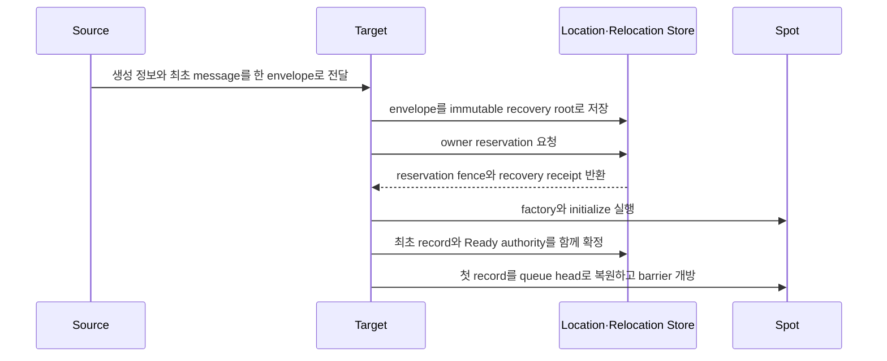

# C++ Spot exact interface

Session에 bind된 Actor를 포함한 Spot relocation은 target에서 Spot·Actor state와 queue를 복원하고
owner와 membership을 commit한 뒤 message 처리를 시작한다. Target runtime은
`sessionActorLocationUpdateReqMsg`를 send하여 각 bound Actor의 route와 위치 snapshot을
갱신한다. 응답이 없어도 message 처리를 멈추지 않으며 정해진 간격으로 같은 요청을 다시
보낸다. Relocation 자체는 physical·logical disconnect가
아니므로 Actor disconnect callback을 실행하지 않는다. relocation 대상에 포함되지 않은 다른 Actor의 route와 physical connection은
변경하지 않는다.

[C++ exact interface 목차](README.ko.md)

## 1. Spot identity와 relocation 등록

User·Instance Spot factory configure callback은 `disable_relocation()`, `recreate_on_relocation()` 또는
`preserve_state_with<TAdapter>()` 중 하나를 명시한다.

```cpp
namespace zlink::framework {

template <typename TSpot>
class spot_relocation_adapter_t {
public:
    virtual ~spot_relocation_adapter_t() = default;
    virtual task_t<std::vector<std::byte>> capture(
      TSpot &spot,
      std::stop_token operation_cancellation) = 0;
    virtual task_t<void> restore(
      TSpot &spot,
      std::vector<std::byte> payload,
      std::stop_token operation_cancellation) = 0;
};

template <typename TSpot>
class user_spot_factory_builder_t {
public:
    user_spot_factory_builder_t &set_stable_type_limit(std::int32_t limit);
    user_spot_factory_builder_t &set_execution_mode(user_spot_execution_mode_t mode);
    user_spot_factory_builder_t &set_relocation_readiness(
      spot_relocation_readiness_mode_t mode);
    void disable_relocation();
    void recreate_on_relocation();
    template <typename TAdapter>
      requires std::derived_from<TAdapter, spot_relocation_adapter_t<TSpot>>
    void preserve_state_with();
};

template <typename TSpot>
class instance_spot_factory_builder_t {
public:
    instance_spot_factory_builder_t &set_stable_type_limit(std::int32_t limit);
    void disable_relocation();
    void recreate_on_relocation();
    template <typename TAdapter>
      requires std::derived_from<TAdapter, spot_relocation_adapter_t<TSpot>>
    void preserve_state_with();
};

} // namespace zlink::framework
```

`preserve_state_with<TAdapter>()`에서 `TAdapter`는
`spot_relocation_adapter_t<TSpot>`를 구현해야 한다. Actor adapter를 전달하거나 [Spot](../../../../01-glossary.ko.md#spot) factory에 맞지 않는 adapter를
전달하면 socket bind 전에 configuration error로 실패한다. Adapter는 application state를 opaque byte vector로만
주고받으며 typed state, 별도 contract identifier와 message wrapper를 노출하지 않는다.

Factory 등록 member의 exact declaration은
[Channel messaging](03-channel-messaging.ko.md)의 `mesh_node_builder_t`가 소유한다.

## 2. Spot Framework API

Framework Spot 표면은 owner MeshNode와 `zlink::framework::spot_t`를 기반으로 한다.

```cpp
namespace zlink::framework {

enum class spot_kind_t {
    invalid = 0,
    entry = 1,
    user = 2,
    instance = 3
};

enum class spot_close_reason_t {
    explicit_close = 0,
    host_shutdown = 1,
    relocation_out = 2,
    idle_evicted = 3
};

struct spot_closing_context_t final {
    spot_close_reason_t reason;
    std::chrono::system_clock::time_point deadline;
};

using spot_id_t = std::string;

class spot_ref_t final {
public:
    spot_ref_t(spot_id_t spot_id,
      std::uint64_t object_generation,
      std::string mesh_name,
      node_rid_t node_rid);

    const spot_id_t &spot_id() const noexcept;
    std::uint64_t object_generation() const noexcept;
    std::string_view mesh_name() const noexcept;
    const node_rid_t &node_rid() const noexcept;
};

class spot_context_t;
class entry_spot_context_t;
class instance_spot_context_t;
class spot_handler_registry_t;
class instance_spot_handler_registry_t;
struct spot_actor_join_result_t;
struct actor_create_response_t;
struct spot_create_response_t;

enum class spot_relocation_ready_outcome_t : std::uint8_t {
    continued = 0,
    relocated = 1,
};

struct spot_relocation_ready_completion_t {
    spot_relocation_ready_outcome_t outcome;
};

class spot_relocation_ready_call_t {
public:
    spot_relocation_ready_call_t(spot_relocation_ready_call_t &&) noexcept;
    spot_relocation_ready_call_t(const spot_relocation_ready_call_t &) = delete;
    void defer();
};

template <typename TActor>
class spot_t {
public:
    using actor_type = TActor;

    virtual ~spot_t() = default;
    virtual spot_context_t &context() noexcept = 0;
    virtual const spot_context_t &context() const noexcept = 0;
    virtual void configure() = 0;
    virtual task_t<spot_create_response_t> on_create(
      const message_t &request);
    virtual task_t<void> on_initialize();
    virtual task_t<void> on_closing(
      const spot_closing_context_t &context,
      std::stop_token cleanup_cancellation);
    virtual task_t<void> on_relocation_ready_completed(
      const spot_relocation_ready_completion_t &completion);
    virtual task_t<spot_actor_join_result_t> on_actor_join(
      std::string_view actor_id,
      const message_t &request) = 0;
    virtual task_t<void> on_actor_joined(TActor &actor) = 0;
    virtual task_t<void> on_leave_actor(TActor &actor) = 0;
    virtual task_t<void> on_disconnect_actor(TActor &actor);
};

template <typename TActor>
class entry_spot_t {
public:
    using actor_type = TActor;

    virtual ~entry_spot_t() = default;
    virtual entry_spot_context_t &context() noexcept = 0;
    virtual const entry_spot_context_t &context() const noexcept = 0;
    virtual void configure() = 0;
    virtual task_t<void> on_initialize();
    virtual task_t<void> on_closing(
      const spot_closing_context_t &context,
      std::stop_token cleanup_cancellation);
    virtual task_t<actor_create_response_t> on_create_actor(
      TActor &actor,
      const message_t &create_request);
    virtual task_t<spot_actor_join_result_t> on_actor_join(
      std::string_view actor_id,
      const message_t &request) = 0;
    virtual task_t<void> on_actor_joined(TActor &actor) = 0;
    virtual task_t<void> on_leave_actor(TActor &actor) = 0;
    virtual task_t<void> on_disconnect_actor(TActor &actor);
};

class instance_spot_t {
public:
    virtual ~instance_spot_t() = default;
    virtual instance_spot_context_t &context() noexcept = 0;
    virtual const instance_spot_context_t &context() const noexcept = 0;
    virtual void configure() = 0;
    virtual task_t<void> on_initialize();
    virtual task_t<void> on_closing(
      const spot_closing_context_t &context,
      std::stop_token cleanup_cancellation);
};

class spot_common_context_t {
public:
    std::string_view mesh_name() const;
    node_rid_t node_rid() const;
    spot_id_t spot_id() const;
    std::uint64_t object_generation() const noexcept;
    channel_client_t outbound() const;

    template <typename TCommand>
    spot_send_call_t send_to_spot(spot_id_t target, TCommand command);

    template <typename TRequest>
    spot_request_call_t request_to_spot(
      spot_id_t target,
      TRequest request);

    template <typename TEvent>
    publish_call_t publish(
      std::string channel_name,
      std::string topic,
      TEvent event);

    template <typename THandler>
    timer_t add_timer(std::string name,
      std::chrono::milliseconds period,
      timer_options_t options = {});

    template <typename TWork>
    auto run_cpu_worker(TWork work);

    template <typename TWork>
    auto run_io_worker(TWork work);

};

class spot_context_t : public spot_common_context_t {
public:
    ~spot_context_t();
    spot_context_t(spot_context_t &&) noexcept;
    spot_context_t &operator=(spot_context_t &&) = delete;
    spot_context_t(const spot_context_t &) = delete;
    spot_context_t &operator=(const spot_context_t &) = delete;

    spot_handler_registry_t handlers();
    spot_relocation_ready_call_t relocation_ready();

    template <typename TActor>
    task_t<void> leave_actor(TActor &actor);

    task_t<bool> close();
};

class entry_spot_context_t : public spot_common_context_t {
public:
    ~entry_spot_context_t();
    entry_spot_context_t(entry_spot_context_t &&) noexcept;
    entry_spot_context_t &operator=(entry_spot_context_t &&) = delete;
    entry_spot_context_t(const entry_spot_context_t &) = delete;
    entry_spot_context_t &operator=(const entry_spot_context_t &) = delete;
    spot_handler_registry_t handlers();

    template <typename TActor>
    task_t<void> destroy_actor(TActor &actor);

    task_t<void> destroy_actor(const actor_ref_t &actor);
};

class instance_spot_context_t : public spot_common_context_t {
public:
    ~instance_spot_context_t();
    instance_spot_context_t(instance_spot_context_t &&) noexcept;
    instance_spot_context_t &operator=(instance_spot_context_t &&) = delete;
    instance_spot_context_t(const instance_spot_context_t &) = delete;
    instance_spot_context_t &operator=(const instance_spot_context_t &) = delete;

    instance_spot_handler_registry_t handlers();
    task_t<bool> close();
};

struct spot_actor_join_result_t {
    bool accepted = false;
    std::optional<zlink::framework::message_t> reply;

    static spot_actor_join_result_t accept(
      std::optional<message_t> reply = std::nullopt);

    template <typename TReply>
    static spot_actor_join_result_t accept(TReply reply);

    static spot_actor_join_result_t reject(
      std::optional<message_t> reply = std::nullopt);

    template <typename TReply>
    static spot_actor_join_result_t reject(TReply reply);
};

struct actor_create_response_t {
    bool accepted = true;
    std::optional<zlink::framework::message_t> reply;

    static actor_create_response_t accept(
      std::optional<message_t> reply = std::nullopt);

    template <typename TReply>
    static actor_create_response_t accept(TReply reply);

    static actor_create_response_t reject(
      std::optional<message_t> reply = std::nullopt);

    template <typename TReply>
    static actor_create_response_t reject(TReply reply);
};

enum class spot_create_state_t {
    existing = 0,
    created = 1,
    rejected = 2
};

struct spot_create_response_t {
    bool accepted = true;
    std::optional<zlink::framework::message_t> reply;

    static spot_create_response_t accept(
      std::optional<message_t> reply = std::nullopt);

    template <typename TReply>
    static spot_create_response_t accept(TReply reply);

    static spot_create_response_t reject(
      std::optional<message_t> reply = std::nullopt);

    template <typename TReply>
    static spot_create_response_t reject(TReply reply);
};

struct spot_create_result_t {
    spot_ref_t spot;
    spot_create_state_t state = spot_create_state_t::created;
    std::optional<zlink::framework::message_t> reply;
};

class spot_handler_registry_t {
public:
    template <auto Method>
    spot_handler_registry_t &add_handler(std::string packet_name = {});

    template <auto Method>
    spot_handler_registry_t &add_subscribe(
      std::string channel_name,
      std::string topic);

    template <auto Method>
    spot_handler_registry_t &add_actor_send(std::string packet_name = {});

    template <auto Method>
    spot_handler_registry_t &add_actor_request(std::string packet_name = {});
};

class instance_spot_handler_registry_t {
public:
    template <auto Method>
    instance_spot_handler_registry_t &add_handler(
      std::string packet_name = {});
};

class bound_session_t {
public:
    template <typename TMessage>
    bound_session_send_call_t send(const TMessage &message);

    task_t<void> disconnect();
};

class actor_join_call_t {
public:
    actor_join_call_t(actor_join_call_t &&) noexcept;
    actor_join_call_t &operator=(actor_join_call_t &&) noexcept;
    actor_join_call_t(const actor_join_call_t &) = delete;
    actor_join_call_t &operator=(const actor_join_call_t &) = delete;

    actor_join_call_t &timeout(std::chrono::milliseconds timeout);

    // 현재 handler가 정상 종료한 뒤 Join을 시작하도록 등록한다.
    void defer();
};

class actor_context_t {
public:
    const actor_ref_t &actor_ref() const noexcept;
    const actor_id_t &actor_id() const noexcept;
    std::uint64_t object_generation() const noexcept;
    std::string_view mesh_name() const noexcept;
    std::optional<spot_id_t> spot_id() const;
    bound_session_t bound_session() const;

    actor_join_call_t join_spot(spot_id_t spot_id);

    actor_join_call_t join_spot(spot_id_t spot_id,
      const zlink::framework::message_t &request);

    actor_join_call_t join_entry_spot();

    actor_join_call_t join_entry_spot(
      const zlink::framework::message_t &request);

    template <typename TRequest>
    actor_join_call_t join_spot(spot_id_t spot_id,
      const TRequest &request);

    template <typename TRequest>
    actor_join_call_t join_entry_spot(const TRequest &request);
};

} // namespace zlink::framework
```

`spot_context_t::publish(...)`는 target ChannelName과 topic을 함께 받는다. publish는
[MeshNode](../../../../01-glossary.ko.md#meshnode) ROUTER를 통해 remote MeshNode마다 한 번 제출하고, 수신 node는 node-local
subscription만 검사한다. 각 remote ROUTER와 local mailbox는 대상별로 수락하며, 한 대상의
실패가 앞에서 수락된 전송을 취소하지 않는다. Spot·Actor 등록은 [owner](../../../../01-glossary.ko.md#owner)
`mesh_node_builder_t`에 속한다.

`mesh_node_socket_config_t::max_message_size`는 startup 전에만 설정하며 실행 중 setter를 제공하지 않는다.
`0`은 binding 또는 transport가 수신할 수 있는 최대 complete message 크기로 정규화한다. Transport가
unlimited이면 service wire의 `uint32` 표현 한계에서 envelope overhead를 뺀 값을 사용한다. 양수는 그
표현 한계를 넘을 수 없으며 넘으면 startup 설정 오류로 거부한다. Peer는 정규화한 값을 내부 handshake로
교환하고 sender와 receiver는 두 값 중 작은 effective bound를 complete message allocation 전에 적용한다.
이 negotiation을 위한 public option은 제공하지 않는다.
`send_timeout`을 지정하지 않으면 framework 기본값 1초를 사용한다. `receive_timeout`을 지정하지 않으면
수신 대기 상한을 따로 두지 않는다. HWM은 0 이상이어야 한다.

Spot Actor Join / Relocation 관련 interface도 이 문서에 기록된 정식 계약이며,
그 동작 의미는 [공통 스펙](../../../../15-spot-actor.ko.md)을 따른다. 구현이나 contract test가
이 시그니처와 다르면 계약 불일치로 처리한다.
`join_entry_spot(...)`은 target node RID를 받지 않으며 Framework가 현재 eligible Entry Spot을 선택한다.

`spot_close_reason_t`의 값은 `explicit_close=0`, `host_shutdown=1`, `relocation_out=2`,
`idle_evicted=3`다. `idle_evicted`는 [Instance Spot](../../../../01-glossary.ko.md#entry-spot-user-spot과-instance-spot) 전용 이유이며 Entry Spot과 User Spot에는 전달하지
않는다. 유휴 판정 조건과 정리 뒤 재활성화 규칙은
[Spot 모델 §6.2](../../../../11-spot-model.ko.md#62-유휴-instance-spot-정리)가 소유한다.
Context의
`deadline`은 closing operation의 absolute UTC time이다. Framework는 callback invocation 전에는
`cleanup_cancellation`에 stop을 요청하지 않고 deadline이 끝날 때 요청한다. Entry·User·[Instance Spot](../../../../01-glossary.ko.md#entry-spot-user-spot과-instance-spot)만
callback을 받고 Actor별 closing callback은 제공하지 않는다. Host Shutdown은 Actor membership과 local instance가
유효한 상태에서 callback을 실행하고 completion 뒤 scope와 authority를 정리한다. Standalone Actor relocation은
Entry Spot을 닫지 않으므로 이 callback을 호출하지 않는다.

`entry_spot_context_t::destroy_actor(...)`는 Entry Spot에서만 호출한다. user Spot에 있는 Actor는
먼저 `leave_actor(...)` 또는 Entry Spot join을 완료해야 한다. Destroy는 [membership](../../../../01-glossary.ko.md#membership) 이동이 아니므로
`on_leave_actor`를 다시 호출하지 않으며, 같은 Actor instance의 중복 destroy는 lifecycle callback을
추가로 실행하지 않고 성공으로 끝난다. 전체 순서는 [Actor model §6](../../../../14-actor-model.ko.md#6-actor-lifecycle)을
따른다.

Actor와 User·Instance Spot의 cross-node materialization 동작은 factory 등록에 연결한
factory builder가 정한다. 별도 relocation adapter registry나 operation별 adapter는 제공하지 않는다.
`preserve_state_with<TAdapter>()`를 선택한 Spot factory만 `spot_relocation_adapter_t<TSpot>`로 Spot application state를 capture·restore한다. Whole
User Spot relocation은 Spot root에 Spot adapter를 사용하고 각 Actor participant에는
`actor_relocation_adapter_t<TActor>`를 사용한다. Same-node operation과 `disable_relocation()`·
`recreate_on_relocation()`은 Spot adapter를 호출하지 않는다. `disable_relocation()`을 선택한
cross-node operation은 capture 전에 거부한다.

Spot adapter의 `capture(...)` 결과는 최대 64 MiB이며 빈 vector는 유효하다. 반환한 vector의 소유권은
Framework로 이동하고 `restore(...)`에 전달한 vector는 해당 비동기 호출이 소유한다. Capture가 throw하거나
failed task로 끝나면 durable abort와 source normalization 뒤 admission을 복원한다. Restore가 실패한 instance는
폐기하고 새 attempt의 factory가 만든 instance에 같은 immutable payload를 적용한다. Framework가 operation
[deadline](../../../../01-glossary.ko.md#deadline) 때문에 callback을 취소하면 `deadline_exceeded`로 분류한다. Recovery 때문에 두 method가 at-least-once
호출되거나 stale attempt와 successor에서 겹칠 수 있으므로 adapter는 retry-safe해야 한다. Framework는 adapter의
external side effect에 exactly-once를 보장하지 않는다.

C++의 일반 Spot packet과 Actor payload handler는 `spot_context_t::handlers()`가 등록한다. Actor handler는
containing Spot의 member이며 호출 대상 Spot instance를 `this`로 사용하고, mutable Actor,
읽기 전용 `message_context_t`와 payload를 인자로 받는다. 다른 Spot의 상태를 바꾸는 message는 global
`spot_id_t` direct call로 제출한다. Actor lifecycle은 registry 등록 표면이 아니다.
별도 Actor handler object를 만들지 않으므로 Actor별 mutable state는 Actor가 소유한다.
Entry Spot과 `PerActor` User Spot의 Spot member function은 서로 다른 Actor에서 동시에
호출될 수 있으며 Spot field에 Actor별 state를 저장하면 안 된다. Actor별 실행 resource는
Actor activation에 귀속하고 Same-node Join에서는 유지하며 cross-node Join과 relocation
뒤 target activation에서 다시 만든다. 별도 class인 timer handler는 Spot activation마다
한 번 만들고 재사용한다. Timer handler가 `dependency_types`를 선언하면 dependency도
같은 Spot activation scope에서 resolve한다. Spot close와 source relocation에서는 handler와
scope를 정리한다. Target activation에서는 새 handler와 scope를 만든다. Application이 timer
handler를 singleton·scoped·transient service로 따로 등록하거나 lifetime을 선택하지 않는다.
Public handler lifetime option은 제공하지 않는다.
User Spot과 Entry
Spot은 actor ID와 join request를 받는 `on_actor_join(...)`에서 accept 또는 reject를 반환한다. Commit 이후
callback은 해당 factory가 만든 concrete Actor reference를 직접 받는다. 따라서 별도 membership DTO를
lifecycle callback에 끼워 넣지 않는다. Joined, leave와 disconnect callback은 `task_t<void>`를 반환하며
task가 완료되어야
lifecycle callback이 완료된 것으로 본다. `SpotWide` User Spot 또는 Instance Spot의 callback 안에서
channel 왕복을 기다릴 때 `yield()`를 사용하면 shared Spot turn을 반환하고, 응답 뒤 같은 Spot 실행
queue에서 새 turn으로 callback을 재개한다. Entry Spot과 `PerActor` User Spot에서는 `yield()`를 사용할 수 없다.
일반 Spot 타입은 concrete Actor type을 지정한 `zlink::framework::spot_t<TActor>`를 상속해야 하고,
Entry Spot 타입은 `zlink::framework::entry_spot_t<TActor>`를 상속해야 한다. 두 base class가 lifecycle
callback의 virtual contract를 고정하며, `add_spot<TSpot>()`와 `add_entry_spot<TEntrySpot>()`가 이 계약을
compile-time으로 확인한다. 이름이나 파일 위치와 method 존재 여부만으로 역할을 추론하지 않는다.

Instance Spot은 `instance_spot_t`를 상속하며 Actor callback을 갖지 않는다. Application
instance는 Framework가 생성할 때 결합한 `instance_spot_context_t`를 `context()`로
노출한다. Framework는 인자 없는 `configure()`, message를 받지 않는 `on_initialize()`,
`on_closing(context, cleanup_cancellation)`을 actor-free lifecycle로 사용한다. `configure(...)`에서는 direct
packet과 timer handler만 등록할 수 있다. Instance context의 전용 registry에는 Actor handler와 Logical
Multicast [subscription](../../../../01-glossary.ko.md#subscription) 등록 member가 존재하지 않는다. 같은 MeshNode에서 stable
`instance_spot_type`이나 같은 Spot class를 User Spot factory와 Instance factory에 중복 등록해도 socket bind
전에 설정 오류로 실패한다.

실행 중인 Instance Spot이 없을 때 새 instance를 만들고 초기화하여 사용할 수 있게 준비하는 과정을
cold activation이라 한다. Factory는 Instance Spot marker가 있는 direct call의 cold activation 또는 stored
creation intent의 reactivation scope에서 `TSpot` instance를 만든 뒤 `configure()`와
`on_initialize()`를 순서대로 호출한다. 빈 `message_t`를 `on_create(...)`에 넘기지 않는다. Framework는 첫
업무 message를 durable activation inbox의 첫 record로 확정하고 handler barrier를 유지한 상태에서 recovery
root·cursor를 포함한 Location `Ready`를 commit한다. Runtime은 첫 record를 local queue head로 복원한 뒤
activation barrier를 연다. Close에서는
`on_closing(context, cleanup_cancellation)`을 한 번 호출하고
fencing 조건을 만족하는 location row만 해제한다.

User Spot은 manager의 explicit Create·GetOrCreate가 `Creating` reservation을 시작한다. Instance Spot은
`spot_send_call_t` 또는 `spot_request_call_t`에서 `instance_spot()`을 선택한 direct call만 missing RID의
[cold activation](../../../../01-glossary.ko.md#cold-activation)을 시작한다. Marker가 없는 일반 send·request에서
RID가 없으면 `not_found`로 끝나며 factory를 실행하거나 creation intent를 기록하지 않는다.

Source와 target은 다음 순서로 역할을 나눈다.

1. Source는 `Ready` [authority](../../../../01-glossary.ko.md#authority)가 있으면 current owner에게 일반 message를 보낸다.
2. Authority가 `Missing`이면 Source가 target을 선택한다. Source는 creation reservation을 만들지 않는다.
3. Source는 SpotId, stable type, creation intent와 최초 message를 하나의 activation envelope에 넣어 target으로
   보낸다. 이 envelope는 application handler에 전달하지 않는 Framework 내부 message다.
4. Target은 metadata presence와 frame을 포함한 complete envelope를 Relocation Store에 immutable recovery
   root로 먼저 저장한다.
5. 같은 Spot의 local instance가 없을 때만 Target이 자신을 owner로 등록할 reservation을 요청한다. Reserved
   snapshot은 provider가 발급한 reservation fence와 recovery root receipt를 반환한다.
6. Reservation을 먼저 확보한 target만 factory와 initialize를 실행하고 최초 message를 durable activation
   inbox의 첫 record로 확정한다.
7. Target은 handler barrier를 유지한 채 recovery root·cursor, `Ready`와 pending-to-active capacity 변경을
   함께 commit한다. Runtime은 첫 record를 local queue head로 복원한 뒤 barrier를 연다.



이 다이어그램은 선택된 target이 reservation을 먼저 확보한 정상 경로다. 경쟁 target이나 중복 envelope가
먼저 reservation을 확보했다면 현재 target은 factory를 만들지 않는다. 대신 current authority를 읽어 owner로
reroute하거나 진행 중인 attempt에 합류한다. Source는 `Ready` 뒤 같은 message를 다시 보내지 않으므로 최초
message는 한 번만 queue에 들어간다. Authority와 일치하지 않는 local-only instance는 message를 처리할 수
없다. 실패는 exact Abort로 authority와 reserved capacity를 함께 정리한다.
Recovery pointer는 첫 handler terminal completion을 durable하게 기록하고 replay cursor를 inbox sequence까지
갱신한 뒤에만 Preserve CAS로 제거한다. Queue admission만으로 제거하지 않는다.

`SpotWide` User Spot과 member Actor의 relocation은 generic aggregate로 처리한다. Active membership이
있다는 이유만으로 host relocation을 차단하지 않으며 aggregate owner와 membership을 한 commit에서
전환한다. `PerActor` User Spot은 Spot authority를 먼저 전환하고 Actor를 각각 이전한다.
`spot_context_t::close()`와 `instance_spot_context_t::close()`는 context가 보유한 exact current
SpotRef를 사용한다.

일반 User Spot close는 active Actor membership이 하나라도 있으면 `false`로 끝나고 admission과 authority를
유지한다. Caller가 member Actor의 leave 또는 destroy를 완료한 뒤에만 close할 수 있으며, Framework가 close를
위해 Actor를 숨겨서 이동하거나 제거하지 않는다. Host relocation에서 `SpotWide` User Spot은 current
member Actor 전체를 하나의 aggregate로 이전하며 participant 총수에 고정 상한을 두지 않는다.
`PerActor` User Spot은 stateless shell만 새 target에 다시 만들고 Actor를 독립된 unit으로 이전한다.

Instance Spot factory는 actor-free lifecycle만 구현한다. Source runtime은 Instance Spot marker가 있는 direct
call에서만 missing RID의 [activation envelope](../../../../01-glossary.ko.md#activation-envelope)를 target에 보낸다. Target runtime은 envelope를 근거로 자신을
owner로 creation claim을 시작한다. `instance_spot()`은 [stable type](../../../../01-glossary.ko.md#stable-type)을 생략한 marker이고,
`instance_spot(stable_type)`은 type을 명시한 marker다. `in_mesh(mesh_name)`는 missing RID를 처음 배치할
Mesh를 선택한다. 이미 `Ready`인
authority row가 있으면 global SpotId로 현재 owner를 찾으므로 marker와 stable type이 없어도 같은 row로
전달한다.

Stable type을 생략한 marker는 선택된 Mesh의 eligible descriptor가 게시한 Instance Spot capability를 비교한다.
서로 다른 stable type이 정확히 하나이면 그 type을 사용한다. 둘 이상이면 caller가
`instance_spot(stable_type)`으로 type을 명시해야 하며 reservation을 만들기 전에 호출 오류로 끝난다. 등록된
type이 없으면 missing 결과로 끝난다. Explicit stable type이 existing row와 다르면 `type_mismatch`이며,
existing row의 type을 caller가 다시 전달할 필요는 없다.

`in_mesh(...)`를 생략했을 때 eligible Object Mesh가 없으면 `not_configured`, 둘 이상이면
`invalid_operation`이다. 하나이면 그 Mesh를 선택한다. `in_mesh(...)`가 지정한 Mesh를 찾지 못하면
`not_found`다. Mesh를 선택한 뒤 stable type을 생략했는데 distinct Instance Spot type이 0개이면
`not_found`, 둘 이상이면 `invalid_operation`이다. 여러 MeshNode가 같은 stable type을
등록한 경우 distinct type 하나로 계산한다.

Cold Instance로 향하는 one-way call은 resolve, reservation, activation과 outbound admission까지 같은 send
deadline에 포함하고 admission 결과에서 완료한다. Request는 activation, handler와 terminal reply까지 기다린다.
Owner loss 뒤에는 authority에 저장된 creation intent를 사용해 같은 instance를 reactivation한다.

`spot_ref_t`는 global SpotId, `1..9223372036854775807` 범위의 ObjectGeneration과 조회 시점
MeshName·NodeRid를 담은 immutable location snapshot이다. 일반 message target으로 사용하지 않으며 별도 handle,
resolver와 address type은 제공하지 않는다.
SpotId와 stable type은 UTF-8 `1..255` byte exact 값이며 trim, case folding과 Unicode normalization을 적용하지
않는다. `spot_id_t`는 UTF-8 encoded 크기 1..255 bytes의 case-sensitive exact `std::string`이다.

```cpp
class player_actor_t;

class bingo_room_spot_t : public zlink::framework::spot_t<player_actor_t>,
                          public bingo_room_t {
public:
    explicit bingo_room_spot_t(
      zlink::framework::spot_context_t context)
      : context_(std::move(context)) {}

    zlink::framework::spot_context_t &context() noexcept override {
        return context_;
    }

    const zlink::framework::spot_context_t &context()
      const noexcept override {
        return context_;
    }

    void configure() override;

    zlink::framework::task_t<zlink::framework::spot_actor_join_result_t>
    on_actor_join(
      std::string_view actor_id,
      const zlink::framework::message_t &request) override;

    zlink::framework::task_t<void> on_actor_joined(
      player_actor_t &actor) override;

    zlink::framework::task_t<void> on_leave_actor(
      player_actor_t &actor) override;

    zlink::framework::task_t<void> on_disconnect_actor(
      player_actor_t &actor) override;

    start_bingo_game_res_t start_game(
      player_actor_t &actor,
      const zlink::framework::message_context_t &message_context,
      const start_bingo_game_req_t &request);

private:
    zlink::framework::spot_context_t context_;
};

class player_actor_t : public zlink::framework::actor_t {
};

class bingo_entry_spot_t
  : public zlink::framework::entry_spot_t<player_actor_t> {
public:
    explicit bingo_entry_spot_t(
      zlink::framework::entry_spot_context_t context)
      : context_(std::move(context)) {}

    zlink::framework::entry_spot_context_t &context() noexcept override {
        return context_;
    }

    const zlink::framework::entry_spot_context_t &context()
      const noexcept override {
        return context_;
    }

    void configure() override;

private:
    zlink::framework::entry_spot_context_t context_;
};
```

세 Context는 Framework만 만들 수 있는 move-only handle이다. Factory는 전달받은 handle을 application
object의 read-only member로 move하고 `context()`에서 그 handle을 반환한다. Default construction, copy와
assignment로 identity를 만들거나 교체할 수 없다.

`route_mesh_runtime_options_t`는 public DI singleton이다. 등록되지 않은 [ChannelName](../../../../01-glossary.ko.md#channelname)을 조회하면 구성
오류로 실패한다. 실행 중에는 ChannelName weight만 변경할 수 있다. 최대 메시지 크기는 startup 뒤
변경할 수 없다. [Weight](../../../../01-glossary.ko.md#weight)는 0부터 10000까지이고 기본값은 100이다. 범위
밖 값은 startup 설정과 runtime 변경에서 configuration error다. 0은 해당 membership을 새 select-one과
Logical Multicast remote target에서 제외한다.

Spot과 Entry Spot은 activation scope가 수명을 소유한다. 기본 생성 가능한 타입은 타입만
등록한다. 생성자 의존성이 있거나 application이 생성 방법을 결정해야 하는 타입은 factory
overload로 등록한다. factory는 Spot을 활성화할 때 framework가 호출하며, 반환한 instance의
수명도 같은 activation scope에서 관리한다.

일반 Spot packet member는 payload와 `message_context_t`를 받고, subscription member는 payload와
`publish_message_context_t`를 받는다.
actor join admission을 처리하는 member는 `std::string_view actor_id`와
`zlink::framework::message_t` request를 받으며,
`spot_actor_join_result_t`로 accepted 여부와 optional reply `zlink::framework::message_t`를 반환한다.
actor type과 source/target Spot 및 node 정보는 framework 내부 routing과 검증에만 사용한다.
accepted가 `true`일 때만 actor 위치를 user Spot으로 commit하고
`on_actor_joined(TActor&)`를 호출한다. accepted가 `false`이면 actor 위치를 바꾸지 않고
    post-joined callback도 호출하지 않는다. Commit 이후 결과는 callback 이름으로 구분한다.
Maintenance가 Actor를 target Entry Spot에 materialize할 때 Snapshot은 Actor adapter
`restore(...)`를 먼저 완료하고 Recreate는 payload restore 없이 factory
materialization을 완료한다. 그 다음 queue·Actor timer를 복원하고 Location
authority·Entry membership을 commit한 뒤 Actor message 처리를 시작한다. Bound Session
위치 갱신은 `sessionActorLocationUpdateReqMsg`와 `sessionActorLocationUpdateResMsg` send
message로 수행하며 응답이 없어도 Actor 처리를 멈추지 않는다. Infrastructure relocation은
target joined, source leave 또는 별도 relocation callback을 호출하지 않는다.

일반 same-node·remote User·Entry Spot join만 기존 `on_actor_join(...)`,
`on_actor_joined(...)`와 source `on_leave_actor(...)` 계약을 사용한다. `SpotWide`
User Spot aggregate와 `PerActor` User Spot의 Actor relocation에서는 member Actor의
membership callback을 호출하지 않는다. `PerActor` Spot policy는 `RecreateOnRelocation`만
허용하고 Spot adapter를 등록하지 않는다. Spot field와 Spot-level schedule은
이전하지 않는다. 유지해야 하는 shared state와 schedule은 application의
Redis·database·service 같은 외부 저장소에 둔다.
Target runtime-private shell은 같은 public Spot ID와 object generation을 사용하며
Spot authority 전에는 public lookup에 노출하지 않는다. Authority 전환 뒤 `ToSpot`,
Create와 Join은 target, `ToActor`는 Actor별 current owner를 사용한다. Stale source
route는 operation identity, generation, deadline, correlation과 reply route를 보존해
relay한다. Actor queue seal부터 target admission까지 1초는 운영 목표이며 초과해도
relocation을 취소하거나 rollback하지 않는다.

`spot_context_t::relocation_ready().defer()`는 `spot_wide`와
`application_signaled`을 함께 등록한 Spot turn에서만 유효하다. Framework는 이동하지
않았거나 commit 전에 abort했으면 source에서 `continued`, 이동했으면 target에서
`relocated` completion을 `on_relocation_ready_completed(...)`에 전달한다. 기본
virtual 구현은 no-op이다. Callback 완료 전에는 보류한 application message와 timer를
실행하지 않는다.

기본 `any_turn_boundary`, `per_actor`, Entry·Instance Spot, Spot turn 밖과 같은 turn의
중복 `defer()`는 queue mutation 전에 `invalid_operation`으로 실패한다.
`defer()` 뒤 같은 turn의 다른 Framework operation도 같은 오류다. Recovery에서
callback이 다시 실행될 수 있으므로 override는 retry-safe해야 한다.
actor packet member는 containing Spot에 선언하며 mutable Actor, `message_context_t`, DTO 순서로 받는다.
호출 대상인 containing Spot은 member function의 `this`다. actor disconnected callback도 같은 concrete
Actor reference를 받는다.
Runtime의 private dispatch가 `message_t`를 DTO로 바꾸고 현재 Spot instance와 Actor를 찾아 typed member
function을 호출한다. Application은 invoker, service provider, serializer registry와 [descriptor](../../../../01-glossary.ko.md#descriptor) 조회 표면을
받지 않는다. 샘플도 public registration과 call 경로를 통과해야 framework 동작을 확인했다고 볼 수 있다.
Entry Spot membership 상태에서도 actor packet은 일반 Spot packet으로 등록하지 않는다.
`spot_context_t::handlers()`에서 `add_actor_request<Method>()` 또는 `add_actor_send<Method>()`로 등록하며,
member는 mutable Actor, message context와 DTO를 받는다.
stream header metadata 전체를 actor handler에 그대로 노출하지 않는다. 사용자는
`options.metadata().allow_session_to_actor("trace-id")`처럼 application metadata forwarding 정책을 선언하고,
framework는 허용된 key만 `message_context_t::metadata`에 넣는다.
handler는 `metadata.find(...)` 또는 `metadata.contains(...)`로 값을 조회한다. `values()`는 단순 반복을 제공하고,
`find(...)`와 `contains(...)`는 handler code가 `std::map` 구조에 직접 묶이지 않게 한다. 빈 metadata
key와 공백만 있는 key는 의미가 모호하므로 두 방향의 allowlist method 모두 이런 key를 거부한다.
이 정책은 stream frame 구조나 ActorGateway 내부 frame을 public handler 표면에 드러내지 않기
위한 경계다.

`timer_t`는 Framework timer registration의 lifetime과 취소를 표현하는 public handle이며 callback은 owner
Spot의 직렬 실행 queue에 제출된다. Entry Spot timer도
서로 다른 Entry Spot instance를 전역 직렬화하지 않는다.

Timer backend 선택은 [비동기 실행 정책](../../../../05-async-execution-policy.ko.md#5-spot-timer)을 따른다.
`timer_tick_t`는 공통 timer dispatch metadata만 제공한다.

ActorGateway session relay의 public 표면은 `session_actor_manager_t`, `session_actor_t`,
`actor_context_t`, `bound_session_t`다. MeshNode transport metadata는 이 표면에 노출하지 않는다.
actor context의 `join_spot(...)` request는 DTO 또는 `zlink::framework::message_t`다.
JSON DTO는 기본 serializer를 사용하므로 message type별 codec 설정이 필요 없다. Protobuf,
MessagePack, custom binary payload처럼 기본 JSON으로 표현할 수 없는 타입만 startup/options 에
serializer extension을 연결하고 업무 코드는 같은 join 호출을 유지한다. join 결과는
`actor_t::on_join_completed(...)`에 전달하는 승인과 거절 `variant`다. 승인 값만
이동 이후의 actor ref를 가지며 두 값 모두 application reply
`zlink::framework::message_t`를 담는다. Entry Spot join도 같은 completion 타입을 사용한다.
request를 생략한 overload는 빈 `message_t`를 사용한다.
raw payload 처리는 framework 내부 invoker가 맡으며 application public actor context에
별도 raw join overload를 두지 않는다.

호출 실행 표면은 공통 비동기 call 계약을 C++ coroutine 관례로 표현한다. `request(...)`, `send(...)`,
`join_spot(...)`과 `join_entry_spot(...)`은 call object를 반환한다. One-way call의 `submit()`은 send timeout까지
bounded admission 결과를 담은 `task_t`를 반환한다. Session Actor `relay(...)`는 별도 call object를 만들지 않고
정상 완료 값을 만들지 않는 `task_t<void>`를 반환한다. Request는 `submit()`이 reply 완료를
기다리는 지점이다.
일반 channel `request_call_t`는 metadata와 request timeout을, `send_call_t`는 metadata만 submit 전에 모으고,
submit 시점에 framework envelope 정책으로 넘긴다. typed packet name은 registration
descriptor가 결정한다.

Actor Join은 다른 messaging call과 실행 경계가 다르다. `defer()`는 target을 조회하거나
Store I/O를 시작하지 않고 현재 handler에 Join intent와 비활성 queue barrier만 등록한다.
handler가 정상 종료하면 barrier를 활성화하여 Join을 시작하고, handler가 실패하면 등록 내용을
폐기한다. `defer()`는 값을 반환하지 않으며 `submit()`, `async()`, `yield()` terminal을 제공하지 않는다.
Join 결과는 나중에 `actor_t::on_join_completed(...)`로 알린다. 기본 timeout은 5초이고,
명시하는 값은 millisecond 기준 `1..INT_MAX` 범위여야 한다. Framework는 `defer()` 시점의
monotonic clock으로 absolute deadline을 고정한다.

`yield()`는 `SpotWide` User Spot 또는 Instance Spot의 shared turn에서만 그 turn을 반환한다.
그 밖의 문맥에서는 operation을 제출하거나 turn을 반환하지 않고 `invalid_operation`으로 완료한다.
Worker call도 같은 실행 문맥 제한을 적용한다. CPU worker는 동기 작업, I/O worker는 `task_t<TResult>`를 반환하는
작업을 받는다. 한 call object에서 terminator를 두 번 시작하면 protocol error로 완료한다.

```cpp
auto reply = co_await client
  .request("profile", query) // ChannelName만으로 호출 대상을 선택한다.
  .submit<profile_reply_t>();

use_profile(reply);
```

public framework async 표면에 `std::future`를 사용하지 않는다. blocking wait는 handler,
timer, STREAM session callback, actor relay 경로에서 허용하지 않는다.

오류 종류는 `.NET` framework의 `ZLinkFrameworkErrorKind`를 C++ naming으로 투영한다.
`submit()`은 실패 시 같은 정보를 가진 `framework_exception_t`를 throw한다.

## 3. Timer

```cpp
enum class timer_overrun_policy_t {
    skip_late_ticks = 0,
    catch_up_bounded = 1,
    delay_next_tick = 2
};

struct timer_options_t {
    timer_overrun_policy_t overrun_policy =
      timer_overrun_policy_t::skip_late_ticks;
    std::uint64_t max_catch_up_ticks = 1;
    bool stop_on_unhandled_exception = false;
};

struct timer_tick_t {
    std::string name;
    std::uint64_t delivery_index = 0;
    std::uint64_t scheduled_index = 0;
    std::chrono::milliseconds period{0};
    std::chrono::milliseconds scheduled_elapsed{0};
    std::chrono::milliseconds started_elapsed{0};
    std::chrono::milliseconds delay{0};
    std::uint64_t skipped_ticks = 0;
};

struct timer_failure_event_t {
    std::string timer_name;
    std::type_index handler_type;
    std::uint64_t delivery_index = 0;
    bool stopped = false;
    std::string message;
};

class timer_t {
public:
    timer_t();
    ~timer_t();
    timer_t(timer_t &&) noexcept;
    timer_t &operator=(timer_t &&) noexcept;
    timer_t(const timer_t &) = default;
    timer_t &operator=(const timer_t &) = default;

    bool is_disposed() const noexcept;
    void cancel() noexcept;
};
```

timer 등록 검증은 [stage-wrapper §4.1](../../../../17-stage-wrapper-on-spot.ko.md)이 소유한다.

Framework timer는 owner Actor·Spot에 속한 logical registration이다. Cross-node relocation에서는 timer 이름,
handler type, period, `timer_options_t`, scheduling cursor와 seal 시점의 pending tick을 relocation payload에
자동으로 포함한다. Application의 relocation adapter는 timer를 capture·restore하거나 target에서 다시 등록하지
않는다. Target runtime은 payload의 logical registration으로 timer를 복원한다. Source는 queue를 seal한 뒤 새
tick을 dispatch하지 않으며 target은 restore와 authority commit을
마치고 dispatch admission이 열린 뒤에만 복원한 pending tick과 다음 tick을 owner mailbox에 제출한다.

## 4. SPOT 표면

```cpp
class spot_create_call_t {
public:
    spot_create_call_t(spot_create_call_t &&) noexcept;
    spot_create_call_t &operator=(spot_create_call_t &&) noexcept;
    spot_create_call_t(const spot_create_call_t &) = delete;
    spot_create_call_t &operator=(const spot_create_call_t &) = delete;

    spot_create_call_t &in_mesh(std::string mesh_name);
    spot_create_call_t &creation_request(message_t request);

    template <typename TRequest>
    spot_create_call_t &creation_request(TRequest request);

    spot_create_call_t &timeout(std::chrono::milliseconds timeout);
    task_t<spot_create_result_t> submit();
    task_t<spot_create_result_t> yield();
};

class spot_manager_t {
public:
    virtual ~spot_manager_t() = default;
    virtual spot_create_call_t create(std::string stable_type) = 0;
    virtual spot_create_call_t get_or_create(
      spot_id_t spot_id,
      std::string stable_type) = 0;

    virtual task_t<std::optional<spot_ref_t>> find(spot_id_t spot_id) = 0;
    virtual task_t<bool> close(spot_ref_t spot) = 0;
};
```

`spot_manager_t`는 User Spot만 생성한다. `Create`는 Framework가 global SpotId를 생성하고,
`GetOrCreate`는 caller가 제공한 global SpotId를 사용한다. Instance Spot create/get-or-create member와 kind
인자는 제공하지 않는다. Call option과 submit은 각각 한 번만 사용할 수 있다. Existing authority가 Instance
kind이거나 stable type이 다르면 `type_mismatch`, eligible capacity가 없으면
`capacity_exceeded`다.
Terminal `submit()`은 exact `spot_ref_t`, `existing`·`created`·`rejected` state와 creation callback reply를
`spot_create_result_t` 하나로 반환한다.

`Find`는 current Ready User SpotRef만 반환하고 생성하지 않는다. Instance authority는 manager의 `Find` 결과에
포함하지 않는다. `Close`는 User Spot의 exact SpotRef만 변경한다. Instance Spot은
`instance_spot_context_t::close()`가 context에 보관한 exact current SpotRef로 local close를 수행한다. 같은 User
Spot incarnation이 없으면 manager `Close`는 `false`, 다른 generation이면 `invalid_operation`, 이동 중이면
`unavailable`이다. Public list, resolver와 handle은 제공하지 않는다.

## 5. Public trace category

이 문서의 declaration은 public trace의 `spot-instance`와 `actor-relocation` category에 속한다. 공통 의미는
[Spot address와 messaging](../../../../16-spot-address-messaging.ko.md)과
[Spot·Actor membership](../../../../15-spot-actor.ko.md)이 소유한다.

**lifecycle callback의 호출 순서는 [MeshNode §7](../../../../13-mesh-node.ko.md)가 소유한다** —
handler 구성 → 생성 callback → **수락된 경우에만** 초기화 → 종료는 한 번.
