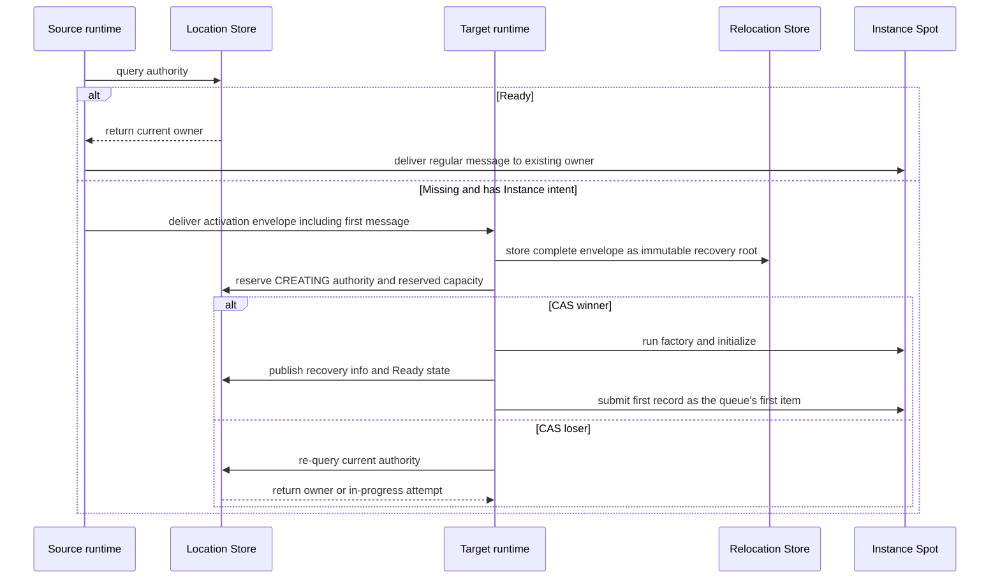

# Java Spot Public Interface

A Spot relocation, including an Actor bound to a session, restores
Spot/Actor state and queue on the target, commits owner and membership,
and then starts message processing. The target runtime sends
`sessionActorLocationUpdateReqMsg` to update the route and location
snapshot of each bound Actor. Even without a response, message
processing doesn't stop, and the same request is resent at a fixed
interval. Since relocation itself isn't a physical/logical disconnect, it
doesn't run the Actor disconnect callback. The route and physical
connection of a different Actor not included in the relocation target
aren't changed.

[Interface table of contents](README.en.md) · [Common Spot Contract](../../../../12-spot-messaging.en.md)

This document fixes the public interface expressing Spot identity,
lifecycle, messaging, manager, and relocation adapter in Java. A regular
message targets with the global SpotId, and only the operation that
closes a specific incarnation uses `SpotRef`.

Entry/User/Instance SpotId is a global logical ID that's a `String` of
UTF-8 encoded size 1..255 bytes, compared as a case-sensitive exact
value. Unicode normalization and case folding aren't applied.

The information the Location Store holds, fixing the current owner and
lifecycle state of a [Spot](../../../../01-glossary.en.md#spot), is
called authority. The process of preparing a new Instance Spot when
authority is Missing and the caller specified Instance intent is called
cold activation.

```java
public record SpotRef(
    String spotId,
    long objectGeneration,
    String meshName,
    RoutingId nodeRid) {}

public enum ZLinkSpotCloseReason {
    EXPLICIT_CLOSE(0), HOST_SHUTDOWN(1), RELOCATION_OUT(2), IDLE_EVICTED(3);
    private final int value;
    ZLinkSpotCloseReason(int value) { this.value = value; }
    public int value() { return value; }
}

public record ZLinkSpotClosingContext(
    ZLinkSpotCloseReason reason,
    Instant deadline) {}

public enum ZLinkSpotRelocationReadyOutcome {
    CONTINUED(0), RELOCATED(1);
    private final int value;
    ZLinkSpotRelocationReadyOutcome(int value) { this.value = value; }
    public int value() { return value; }
}

public record ZLinkSpotRelocationReadyCompletion(
    ZLinkSpotRelocationReadyOutcome outcome) {}

public interface ZLinkSpotRelocationReadyCall {
    void defer();
}

public interface ZLinkSpot<TActor extends ZLinkActor>
    extends ZLinkUserSpotActorLifecycle<TActor> {
    ZLinkSpotContext context();
    default void configure() {}
    default CompletionStage<ZLinkSpotCreateResponse> onCreate(
        ZLinkMessage request) {
        return CompletableFuture.completedFuture(
            ZLinkSpotCreateResponse.accept());
    }
    default CompletionStage<Void> onInitialize() {
        return CompletableFuture.completedFuture(null);
    }
    default CompletionStage<Void> onClosing(
        ZLinkSpotClosingContext context) {
        return CompletableFuture.completedFuture(null);
    }
    default CompletionStage<Void> onRelocationReadyCompleted(
        ZLinkSpotRelocationReadyCompletion completion) {
        return CompletableFuture.completedFuture(null);
    }
}

public interface ZLinkInstanceSpot {
    ZLinkInstanceSpotContext context();
    default void configure() {}
    default CompletionStage<Void> onInitialize() {
        return CompletableFuture.completedFuture(null);
    }
    default CompletionStage<Void> onClosing(
        ZLinkSpotClosingContext context) {
        return CompletableFuture.completedFuture(null);
    }
}

public interface ZLinkInstanceSpotHandlerRegistry {
    void addPacket(Class<?> handlerType);
}

public interface ZLinkInstanceSpotContext {
    String meshName();
    String spotId();
    long objectGeneration();
    RoutingId nodeRid();
    ZLinkInstanceSpotHandlerRegistry handlers();
    ZLinkSpotOutbound outbound();
    <T> ZLinkWorkerCall<T> runCpuWorker(ZLinkWorkerTask<T> work);
    <T> ZLinkWorkerCall<T> runIoWorker(ZLinkIoWorkerTask<T> work);
    CompletionStage<Boolean> close();
    CompletionStage<ZLinkTimer> addTimer(
        String name,
        Duration period,
        Class<?> handlerType,
        ZLinkTimerOptions options);
}

public interface ZLinkSpotRelocationAdapter<TSpot> {
    CompletionStage<byte[]> capture(
        TSpot spot, ZLinkRelocationCancellation cancellation);
    CompletionStage<Void> restore(
        TSpot spot, byte[] state, ZLinkRelocationCancellation cancellation);
}

public interface ZLinkSpotContext {
    String meshName();
    String spotId();
    long objectGeneration();
    RoutingId nodeRid();
    ZLinkSpotHandlerRegistry handlers();
    ZLinkSpotOutbound outbound();
    <T> ZLinkWorkerCall<T> runCpuWorker(ZLinkWorkerTask<T> work);
    <T> ZLinkWorkerCall<T> runIoWorker(ZLinkIoWorkerTask<T> work);
    ZLinkSpotRelocationReadyCall relocationReady();
    CompletionStage<Void> leaveActor(ZLinkActor actor);
    CompletionStage<Boolean> close();
    CompletionStage<ZLinkTimer> addTimer(
        String name,
        Duration period,
        Class<?> handlerType,
        ZLinkTimerOptions options);
}

public interface ZLinkEntrySpot<TActor extends ZLinkActor>
    extends ZLinkSpotActorMembershipLifecycle<TActor> {
    ZLinkEntrySpotContext context();
    default CompletionStage<ZLinkActorCreateResponse> onCreateActor(
        TActor actor,
        ZLinkMessage createRequest) {
        return CompletableFuture.completedFuture(
            ZLinkActorCreateResponse.accept());
    }
    default CompletionStage<Void> onClosing(
        ZLinkSpotClosingContext context) {
        return CompletableFuture.completedFuture(null);
    }
}

public interface ZLinkSpotSendCall extends ZLinkSendCall {
    ZLinkSpotSendCall instanceSpot();
    ZLinkSpotSendCall instanceSpot(String stableType);
    ZLinkSpotSendCall inMesh(String meshName);
    @Override ZLinkSpotSendCall metadata(String key, String value);
    @Override ZLinkSpotSendCall metadata(Map<String, String> metadata);
}

public interface ZLinkSpotRequestCall extends ZLinkRequestCall {
    ZLinkSpotRequestCall instanceSpot();
    ZLinkSpotRequestCall instanceSpot(String stableType);
    ZLinkSpotRequestCall inMesh(String meshName);
    @Override ZLinkSpotRequestCall metadata(String key, String value);
    @Override ZLinkSpotRequestCall metadata(Map<String, String> metadata);
    @Override ZLinkSpotRequestCall timeout(Duration timeout);
}

public interface ZLinkSpotManager {
    ZLinkSpotCreateCall create(String spotType);
    ZLinkSpotGetOrCreateCall getOrCreate(String spotId, String spotType);
    CompletionStage<Optional<SpotRef>> find(String spotId);
    CompletionStage<Boolean> close(SpotRef spot);
}

```

The Java runtime creates each Spot packet/request/subscription/timer
handler once per Spot activation and reuses it. An Actor send/request
handler is created once per Actor activation and reused. Different
Actors don't share a handler instance or activation-scoped dependency.
This rule can't be changed by the handler bean's Spring scope, and a
separate lifetime option isn't provided either.

A same-node Join keeps the Actor handler. A cross-node Join and
relocation clean up the source handler and re-create it in the target
activation. The handler instance isn't relocation payload — the
application state that must be recovered is owned by the Spot or Actor.

The exact builder member of factory registration is owned by
[Configuration And Host](configuration-host.en.md). The Actor/User Spot/
[Instance Spot](../../../../01-glossary.en.md#entry-user-instance-spot)
[factory](../../../../01-glossary.en.md#factory) selects exactly one
relocation behavior in the configure callback, and an overload that
omits the callback isn't provided. The Spot manager is User-Spot-only.
Only `create(spotType)` and `getOrCreate(spotId, spotType)` create a
User Spot creation intent — an Instance Spot create/get-or-create member
and a kind marker aren't provided.

The address of a regular Spot send/request is a single global SpotId.
The two operations return `ZLinkSpotSendCall` and `ZLinkSpotRequestCall`
respectively. Only an operation that called `instanceSpot()` or
`instanceSpot(stableType)` can start cold activation of a Missing
Instance Spot. An operation without the marker ends Missing
[authority](../../../../01-glossary.en.md#authority) with `NOT_FOUND`
and doesn't create a creation intent.

If existing authority exists, `instanceSpot()` uses the stable type
stored in authority regardless of the number of registered Instance
types. If authority is Missing, it only uses the type when exactly one
distinct Instance type serving on the Mesh placement selected. If
`inMesh` is specified, that Mesh becomes the type selection scope. With
two or more, the caller must use `instanceSpot(stableType)`. The type of
`instanceSpot(stableType)` is used for Missing cold activation. Type
isn't needed to resolve existing authority, but if the caller's
specified type differs from the stored type, or authority's kind is
User, it's a type-mismatch error.

`inMesh` selects the Mesh for Missing Instance cold activation. It
doesn't relocate existing authority to a different
[owner](../../../../01-glossary.en.md#owner), and doesn't apply to
regular User Spot messaging either. This option and the Instance marker
can each only be set once, and terminal `submit` can also only be called
once.

The User/Instance Spot factory's `preserveStateWith` registration takes a
`ZLinkSpotRelocationAdapter<TSpot>` class matching the factory type. The
adapter captures/restores application state as an opaque `byte[]` of at
most 64 MiB, and doesn't use `TState`, `stateContractId`, state class, or
`ZLinkMessage`. The framework immediately copies the capture result. The
capture array is still owned by the adapter — changing it after
completion doesn't change the stored payload. Restore is passed a fresh
defensive copy per call, and the adapter doesn't keep the array after the
stage finishes. A zero-length array is also valid application state — it
isn't interpreted as omitting Restore or as `recreateOnRelocation`. In a
whole User Spot relocation, the Spot adapter is used for the Spot itself,
and each Actor participant uses that Actor type's
`ZLinkActorRelocationAdapter`. Instance Spot relocation uses the Spot
adapter. The adapter isn't called for a same-node operation or a factory
that selected `disableRelocation()`, and a factory that selected
`recreateOnRelocation()` has no application state adapter.

A capture exception aborts relocation before authority publication and
keeps source admission. A restore exception keeps target admission
sealed while retrying with the same immutable payload or replacing the
target. The factory creates a fresh Spot instance per target attempt and
doesn't reuse the source or a previous attempt's instance. Restore can be
repeated within the same attempt. An exception isn't turned into an
empty payload or success. A null stage and null `byte[]` from capture,
and a null stage from restore, are contract violations. A precommit
adapter exception and contract violation where a deadline hasn't been
fixed yet in host relocation are `Blocked/StateIncompatible`; once a
[deadline](../../../../01-glossary.en.md#deadline) is fixed,
`Blocked/DeadlineExceeded`. Stale attempt cancellation can't commit a
terminal result. Capture and restore are at-least-once and can overlap
with a stale target attempt, so they must be retry-safe.

When maintenance moves an Actor to a target Entry Spot, it restores the
Actor adapter and queue/timer, commits Location authority/membership, and
then starts Actor message processing. The bound-session location update
is then performed with `sessionActorLocationUpdateReqMsg` and
`sessionActorLocationUpdateResMsg` send messages, and Actor processing
doesn't stop even without a response. Infrastructure relocation doesn't
call the target's `onJoinedActor(...)`, source's `onLeaveActor(...)`, or
a relocation-dedicated application callback.

A `PerActor` User Spot also uses the same per-Actor relocation unit. The
Spot policy only allows `recreateOnRelocation()` and doesn't register a
Spot adapter. After the Spot authority switch, `ToSpot`/Create/Join use
the target, and `ToActor` uses the current owner per Actor. Spot fields
and a Spot-level schedule aren't relocated. Shared state and schedules
that must be kept are placed in an external store the application owns,
such as Redis or a database. The target's runtime-private shell uses the
same public Spot ID and object generation, and isn't exposed to public
lookup before the authority switch. A stale source route is relayed while
preserving operation identity, generation, deadline, correlation, and
reply route. The 1-second window from Actor queue seal to target
admission is an operational goal — exceeding it doesn't cancel or roll
back the relocation.

`relocationReady().defer()` is only valid on a Spot turn that registered
`SPOT_WIDE` and `APPLICATION_SIGNALED` together. The framework delivers
`CONTINUED` from the source if it didn't move or aborted before commit,
and `RELOCATED` from the target if it moved, to
`onRelocationReadyCompleted(...)`'s completion. The default method is a
no-op. Held application messages and timers aren't run before the
callback completes.

A duplicate `defer()` on the default `ANY_TURN_BOUNDARY`, on
`PER_ACTOR`, on Entry/Instance Spot, outside the Spot turn, or in the
same turn fails with `INVALID_OPERATION` before any queue mutation. A
different Framework operation in the same turn after `defer()` is the
same error. Since the callback can run again during recovery, the
override must be retry-safe.

### Instance Spot Cold Activation And The First Message

For a User Spot, the manager operation starts a placement reservation.
An Instance Spot doesn't create a reservation on the source — it's
processed in the following order.

1. The source looks up authority. If Ready, it sends a regular message
   to the current owner.
2. If authority is Missing and there's
   [Instance intent](../../../../01-glossary.en.md#instance-intent), the
   source selects an eligible target. It then puts SpotId, stable type,
   creation intent, and the first message into an activation envelope
   and sends it to the target. This envelope is a Framework
   infrastructure message that can be delivered even before
   [Ready](../../../../01-glossary.en.md#ready), and isn't delivered to
   the application handler.
3. The target runtime first stores the complete envelope, including
   metadata presence and frame, as an immutable recovery root in the
   Relocation Store, then confirms whether a local instance matching the
   requested SpotId and
   [stable type](../../../../01-glossary.en.md#stable-type) exists.
4. Only when there's no instance does the target reserve `CREATING`
   authority and reserved capacity with itself as owner. The reserved
   [snapshot](../../../../01-glossary.en.md#snapshot) is returned with a
   reservation fence identifying which reservation it is, and a receipt
   proving the recovery root's storage is complete, both received from
   the provider.
5. Only the target that wins the authority reservation race (CAS winner)
   runs factory and initialize and confirms the first record of the
   durable activation inbox. A target that loses the race (CAS loser)
   doesn't start a factory — it re-reads current authority and either
   sends a message to the owner or joins the in-progress attempt.
6. The winner publishes the recovery root/cursor, Ready state, and active
   capacity while keeping the barrier that blocks handler execution
   closed.
7. The runtime restores the first record as the first item of the local
   queue and then opens the handler barrier. The source doesn't resend
   the same message after Ready. A local instance not matching authority
   is fenced from processing the message.
8. If target activation fails, that reservation is aborted.
9. The recovery pointer tracking recovery data is removed with a
   Preserve CAS only after durably recording the first handler's
   terminal completion and updating the replay cursor to the inbox
   sequence. It isn't removed merely because it was submitted to the
   queue.



This diagram only shows the first message that starts
[cold activation](../../../../01-glossary.en.md#cold-activation) and the
authority race. The handler's terminal completion or reply, activation
failure cleanup, and recovery pointer removal are defined in the later
steps of the numbered list.

In User/Instance Spot relocation, the framework includes, in the
relocation payload, the logical timer registration created by
`addTimer(...)`, the last completed tick sequence, the next scheduled
time, and pending ticks not yet run. The target restores the logical
timer registration, so the application doesn't re-register the timer.
Only the currently running timer callback finishes on the source, and the
restored tick isn't submitted to the application handler before target
Ready.

A User Spot's `close()` returns `false` if there's active Actor
membership. It doesn't change Spot state, admission, or authority, and
doesn't call `onClosing` or automatically leave/destroy an Actor. The
caller explicitly leaves or destroys the Actor and then closes again. It
also returns `false` when the Spot is missing from the manager, so the
caller doesn't distinguish the two cases without a prior read. Host
`Shutdown` performs Spot cleanup after finishing the Actor barrier. The
manager's `find` and `close` also only target User Spot. The public
surface for an Instance Spot to end its own lifecycle is
`ZLinkInstanceSpotContext.close()`, and the close contract inside this
context is kept.

In the following example, `spotClient` is a `ZLinkSpotOutbound`, and
`cartId` is the global SpotId to call. Since Instance intent is
specified, the stable type and initial Mesh needed for cold activation
are only used if the Spot doesn't exist.

```java
CompletionStage<CartReply> reply = spotClient
    .requestToSpot(cartId, request)
    .instanceSpot("shopping-cart") // if Missing, requests creation of an Instance Spot of this stable type.
    .inMesh("commerce")            // only restricts the Mesh selection scope for Missing cold activation.
    .timeout(Duration.ofSeconds(5))
    .submit(CartReply.class);       // waits for the reply the creation or the existing owner's handler returned.
```

`ZLinkSpotCloseReason`'s values are `EXPLICIT_CLOSE=0`,
`HOST_SHUTDOWN=1`, `RELOCATION_OUT=2`, `IDLE_EVICTED=3`.
`IDLE_EVICTED` is an Instance-Spot-only reason and isn't delivered to
Entry Spot or User Spot. The idle judgment condition and the
reactivation rule after cleanup are owned by
[Spot Model §6.2](../../../../11-spot-model.en.md#62-cleaning-up-an-idle-instance-spot).
The context's `deadline` is an absolute `Instant`. A separate Framework
cancellation argument isn't added to the Java Spot closing callback. The
framework ends the stage-completion wait at the deadline and proceeds
with bounded teardown. Only Entry/User/Instance Spot receive this
callback — a per-Actor closing callback isn't provided. Host
[Shutdown](../../../../01-glossary.en.md#shutdown) runs the callback
while Actor membership and the local instance are valid, and cleans up
scope and authority after completion. A standalone Actor relocation
doesn't close the Entry Spot, so it doesn't call this callback.

A regular message resolves the Ready owner. On a Missing RID, only a
call with the Instance marker above creates a target-owned
[activation envelope](../../../../01-glossary.en.md#activation-envelope).
Instance reactivation after owner loss uses the stable type and initial
Mesh stored in authority.

If a cold Instance factory/initialize fails, a durable public `FAILED`
state isn't published. The runtime keeps a local failed barrier, deletes
it with the exact authority fence, and reads to reconcile. A call to the
same address before the delete is confirmed returns the same typed
failure — hidden retry is 0. Only the next caller after `MISSING` is
confirmed starts a new `COLD_ACTIVATING` claim. There's no public API
that manipulates this recovery state.

SpotId is a global logical ID of UTF-8 encoded size 1..255 bytes.
`SpotRef.objectGeneration()` is `1..Long.MAX_VALUE`, and MeshName/NodeRid
are the location snapshot at query time. Typed JSON uses the required
properties `spotId`, `objectGeneration`, `meshName`, `nodeRid`, and
generation is encoded as a decimal string with no leading zero. A public
handle, resolver, and unbounded list aren't provided. The User Spot
Create/GetOrCreate call and Instance cold activation call end with
`INVALID_OPERATION` on duplicate option or duplicate submit.

An unknown property, duplicate property, missing required property, a
non-numeric generation token, and an out-of-range value in Ref JSON are
rejected.

## Exact Public Member Inventory

The declarations below fix this category's Java public types and
members.

```java
public final class systems.zlink.framework.spots.SpotRef extends java.lang.Record {
  public systems.zlink.framework.spots.SpotRef(java.lang.String, long, java.lang.String, systems.zlink.contracts.core.RoutingId);
  public final java.lang.String toString();
  public final int hashCode();
  public final boolean equals(java.lang.Object);
  public java.lang.String spotId();
  public long objectGeneration();
  public java.lang.String meshName();
  public systems.zlink.contracts.core.RoutingId nodeRid();
}
public final class systems.zlink.framework.spots.ZLinkSpotCloseReason extends java.lang.Enum<systems.zlink.framework.spots.ZLinkSpotCloseReason> {
  public static final systems.zlink.framework.spots.ZLinkSpotCloseReason EXPLICIT_CLOSE;
  public static final systems.zlink.framework.spots.ZLinkSpotCloseReason HOST_SHUTDOWN;
  public static final systems.zlink.framework.spots.ZLinkSpotCloseReason RELOCATION_OUT;
  public static final systems.zlink.framework.spots.ZLinkSpotCloseReason IDLE_EVICTED;
  public static systems.zlink.framework.spots.ZLinkSpotCloseReason[] values();
  public static systems.zlink.framework.spots.ZLinkSpotCloseReason valueOf(java.lang.String);
  public int value();
}
public final class systems.zlink.framework.spots.ZLinkSpotClosingContext extends java.lang.Record {
  public systems.zlink.framework.spots.ZLinkSpotClosingContext(systems.zlink.framework.spots.ZLinkSpotCloseReason, java.time.Instant);
  public final java.lang.String toString();
  public final int hashCode();
  public final boolean equals(java.lang.Object);
  public systems.zlink.framework.spots.ZLinkSpotCloseReason reason();
  public java.time.Instant deadline();
}
public final class systems.zlink.framework.spots.ZLinkSpotRelocationReadyOutcome extends java.lang.Enum<systems.zlink.framework.spots.ZLinkSpotRelocationReadyOutcome> {
  public static final systems.zlink.framework.spots.ZLinkSpotRelocationReadyOutcome CONTINUED;
  public static final systems.zlink.framework.spots.ZLinkSpotRelocationReadyOutcome RELOCATED;
  public static systems.zlink.framework.spots.ZLinkSpotRelocationReadyOutcome[] values();
  public static systems.zlink.framework.spots.ZLinkSpotRelocationReadyOutcome valueOf(java.lang.String);
  public int value();
}
public final class systems.zlink.framework.spots.ZLinkSpotRelocationReadyCompletion extends java.lang.Record {
  public systems.zlink.framework.spots.ZLinkSpotRelocationReadyCompletion(systems.zlink.framework.spots.ZLinkSpotRelocationReadyOutcome);
  public systems.zlink.framework.spots.ZLinkSpotRelocationReadyOutcome outcome();
}
public interface systems.zlink.framework.spots.ZLinkSpotRelocationReadyCall {
  public abstract void defer();
}
public interface systems.zlink.framework.spots.ZLinkInstanceSpot {
  public abstract systems.zlink.framework.spots.ZLinkInstanceSpotContext context();
  public default void configure();
  public default java.util.concurrent.CompletionStage<java.lang.Void> onInitialize();
  public default java.util.concurrent.CompletionStage<java.lang.Void> onClosing(systems.zlink.framework.spots.ZLinkSpotClosingContext);
}
public interface systems.zlink.framework.spots.ZLinkInstanceSpotContext {
  public abstract java.lang.String meshName();
  public abstract java.lang.String spotId();
  public abstract long objectGeneration();
  public abstract systems.zlink.contracts.core.RoutingId nodeRid();
  public abstract systems.zlink.framework.spots.ZLinkInstanceSpotHandlerRegistry handlers();
  public abstract systems.zlink.framework.spots.ZLinkSpotOutbound outbound();
  public default <T> systems.zlink.framework.spots.ZLinkWorkerCall<T> runCpuWorker(systems.zlink.framework.spots.ZLinkWorkerTask<T>);
  public default <T> systems.zlink.framework.spots.ZLinkWorkerCall<T> runIoWorker(systems.zlink.framework.spots.ZLinkIoWorkerTask<T>);
  public abstract java.util.concurrent.CompletionStage<java.lang.Boolean> close();
  public abstract java.util.concurrent.CompletionStage<systems.zlink.framework.spots.ZLinkTimer> addTimer(java.lang.String, java.time.Duration, java.lang.Class<?>, systems.zlink.framework.spots.ZLinkTimerOptions);
}
public interface systems.zlink.framework.spots.ZLinkInstanceSpotHandlerRegistry {
  public abstract void addPacket(java.lang.Class<?>);
}
public interface systems.zlink.framework.spots.ZLinkSpotRelocationAdapter<TSpot> {
  public abstract java.util.concurrent.CompletionStage<byte[]> capture(TSpot, systems.zlink.framework.actors.ZLinkRelocationCancellation);
  public abstract java.util.concurrent.CompletionStage<java.lang.Void> restore(TSpot, byte[], systems.zlink.framework.actors.ZLinkRelocationCancellation);
}
public interface systems.zlink.framework.spots.ZLinkEntrySpot<TActor extends systems.zlink.framework.actors.ZLinkActor> extends systems.zlink.framework.spots.ZLinkSpotActorMembershipLifecycle<TActor> {
  public abstract systems.zlink.framework.spots.ZLinkEntrySpotContext context();
  public default void configure();
  public default java.util.concurrent.CompletionStage<java.lang.Void> onInitialize();
  public default java.util.concurrent.CompletionStage<java.lang.Void> onClosing(systems.zlink.framework.spots.ZLinkSpotClosingContext);
  public default java.util.concurrent.CompletionStage<systems.zlink.framework.spots.ZLinkActorCreateResponse> onCreateActor(TActor, systems.zlink.framework.messaging.ZLinkMessage);
}
public interface systems.zlink.framework.spots.ZLinkEntrySpotActorRequestHandler<TEntrySpot extends systems.zlink.framework.spots.ZLinkEntrySpot<?>, TActor extends systems.zlink.framework.actors.ZLinkActor, TRequest, TReply> {
  public abstract java.util.concurrent.CompletionStage<TReply> handle(TEntrySpot, TActor, systems.zlink.framework.ZLinkMessageContext, TRequest);
}
public interface systems.zlink.framework.spots.ZLinkEntrySpotActorSendHandler<TEntrySpot extends systems.zlink.framework.spots.ZLinkEntrySpot<?>, TActor extends systems.zlink.framework.actors.ZLinkActor, TMessage> {
  public abstract java.util.concurrent.CompletionStage<java.lang.Void> handle(TEntrySpot, TActor, systems.zlink.framework.ZLinkMessageContext, TMessage);
}
public interface systems.zlink.framework.spots.ZLinkEntrySpotContext {
  public abstract java.lang.String meshName();
  public abstract java.lang.String spotId();
  public abstract long objectGeneration();
  public abstract systems.zlink.contracts.core.RoutingId nodeRid();
  public default systems.zlink.framework.spots.ZLinkSpotHandlerRegistry handlers();
  public abstract systems.zlink.framework.spots.ZLinkSpotOutbound outbound();
  public default <T> systems.zlink.framework.spots.ZLinkWorkerCall<T> runCpuWorker(systems.zlink.framework.spots.ZLinkWorkerTask<T>);
  public default <T> systems.zlink.framework.spots.ZLinkWorkerCall<T> runIoWorker(systems.zlink.framework.spots.ZLinkIoWorkerTask<T>);
  public abstract java.util.concurrent.CompletionStage<java.lang.Void> destroyActor(systems.zlink.framework.actors.ZLinkActor);
  public abstract java.util.concurrent.CompletionStage<systems.zlink.framework.spots.ZLinkTimer> addTimer(java.lang.String, java.time.Duration, java.lang.Class<?>, systems.zlink.framework.spots.ZLinkTimerOptions);
}
public interface systems.zlink.framework.spots.ZLinkIoWorkerTask<T> {
  public abstract java.util.concurrent.CompletionStage<T> run(systems.zlink.framework.spots.ZLinkWorkerCancellation) throws java.lang.Exception;
}
public interface systems.zlink.framework.spots.ZLinkSpot<TActor extends systems.zlink.framework.actors.ZLinkActor> extends systems.zlink.framework.spots.ZLinkUserSpotActorLifecycle<TActor> {
  public abstract systems.zlink.framework.spots.ZLinkSpotContext context();
  public default void configure();
  public default java.util.concurrent.CompletionStage<systems.zlink.framework.spots.ZLinkSpotCreateResponse> onCreate(systems.zlink.framework.messaging.ZLinkMessage);
  public default java.util.concurrent.CompletionStage<java.lang.Void> onInitialize();
  public default java.util.concurrent.CompletionStage<java.lang.Void> onClosing(systems.zlink.framework.spots.ZLinkSpotClosingContext);
  public default java.util.concurrent.CompletionStage<java.lang.Void> onRelocationReadyCompleted(systems.zlink.framework.spots.ZLinkSpotRelocationReadyCompletion);
}
public final class systems.zlink.framework.spots.ZLinkSpotActorJoinResult extends java.lang.Record {
  public systems.zlink.framework.spots.ZLinkSpotActorJoinResult(boolean, systems.zlink.framework.messaging.ZLinkMessage);
  public static systems.zlink.framework.spots.ZLinkSpotActorJoinResult accept();
  public static systems.zlink.framework.spots.ZLinkSpotActorJoinResult accept(systems.zlink.framework.messaging.ZLinkMessage);
  public static systems.zlink.framework.spots.ZLinkSpotActorJoinResult accept(java.lang.Object);
  public static systems.zlink.framework.spots.ZLinkSpotActorJoinResult reject();
  public static systems.zlink.framework.spots.ZLinkSpotActorJoinResult reject(systems.zlink.framework.messaging.ZLinkMessage);
  public static systems.zlink.framework.spots.ZLinkSpotActorJoinResult reject(java.lang.Object);
  public final java.lang.String toString();
  public final int hashCode();
  public final boolean equals(java.lang.Object);
  public boolean accepted();
  public systems.zlink.framework.messaging.ZLinkMessage reply();
}
public interface systems.zlink.framework.spots.ZLinkSpotActorMembershipLifecycle<TActor extends systems.zlink.framework.actors.ZLinkActor> {
  public abstract java.util.concurrent.CompletionStage<java.lang.Void> onJoinedActor(TActor);
  public abstract java.util.concurrent.CompletionStage<java.lang.Void> onLeaveActor(TActor);
  public default java.util.concurrent.CompletionStage<java.lang.Void> onDisconnectActor(TActor);
}
public interface systems.zlink.framework.spots.ZLinkUserSpotActorLifecycle<TActor extends systems.zlink.framework.actors.ZLinkActor> extends systems.zlink.framework.spots.ZLinkSpotActorMembershipLifecycle<TActor> {
  public default java.util.concurrent.CompletionStage<systems.zlink.framework.spots.ZLinkSpotActorJoinResult> onActorJoin(java.lang.String, systems.zlink.framework.messaging.ZLinkMessage);
}
public final class systems.zlink.framework.spots.ZLinkActorCreateResponse extends java.lang.Record {
  public systems.zlink.framework.spots.ZLinkActorCreateResponse(boolean, systems.zlink.framework.messaging.ZLinkMessage);
  public static systems.zlink.framework.spots.ZLinkActorCreateResponse accept();
  public static systems.zlink.framework.spots.ZLinkActorCreateResponse accept(systems.zlink.framework.messaging.ZLinkMessage);
  public static systems.zlink.framework.spots.ZLinkActorCreateResponse accept(java.lang.Object);
  public static systems.zlink.framework.spots.ZLinkActorCreateResponse reject();
  public static systems.zlink.framework.spots.ZLinkActorCreateResponse reject(systems.zlink.framework.messaging.ZLinkMessage);
  public static systems.zlink.framework.spots.ZLinkActorCreateResponse reject(java.lang.Object);
  public boolean accepted();
  public systems.zlink.framework.messaging.ZLinkMessage reply();
}
public interface systems.zlink.framework.spots.ZLinkSpotActorRequestHandler<TSpot extends systems.zlink.framework.spots.ZLinkSpot<?>, TActor extends systems.zlink.framework.actors.ZLinkActor, TRequest, TReply> {
  public abstract java.util.concurrent.CompletionStage<TReply> handle(TSpot, TActor, systems.zlink.framework.ZLinkMessageContext, TRequest);
}
public interface systems.zlink.framework.spots.ZLinkSpotActorSendHandler<TSpot extends systems.zlink.framework.spots.ZLinkSpot<?>, TActor extends systems.zlink.framework.actors.ZLinkActor, TMessage> {
  public abstract java.util.concurrent.CompletionStage<java.lang.Void> handle(TSpot, TActor, systems.zlink.framework.ZLinkMessageContext, TMessage);
}
public interface systems.zlink.framework.spots.ZLinkSpotContext {
  public abstract java.lang.String meshName();
  public abstract java.lang.String spotId();
  public abstract long objectGeneration();
  public abstract systems.zlink.contracts.core.RoutingId nodeRid();
  public default systems.zlink.framework.spots.ZLinkSpotHandlerRegistry handlers();
  public abstract systems.zlink.framework.spots.ZLinkSpotOutbound outbound();
  public abstract systems.zlink.framework.spots.ZLinkSpotRelocationReadyCall relocationReady();
  public default <T> systems.zlink.framework.spots.ZLinkWorkerCall<T> runCpuWorker(systems.zlink.framework.spots.ZLinkWorkerTask<T>);
  public default <T> systems.zlink.framework.spots.ZLinkWorkerCall<T> runIoWorker(systems.zlink.framework.spots.ZLinkIoWorkerTask<T>);
  public abstract java.util.concurrent.CompletionStage<java.lang.Void> leaveActor(systems.zlink.framework.actors.ZLinkActor);
  public abstract java.util.concurrent.CompletionStage<java.lang.Boolean> close();
  public abstract java.util.concurrent.CompletionStage<systems.zlink.framework.spots.ZLinkTimer> addTimer(java.lang.String, java.time.Duration, java.lang.Class<?>, systems.zlink.framework.spots.ZLinkTimerOptions);
}
public final class systems.zlink.framework.spots.ZLinkSpotCreateResult extends java.lang.Record {
  public systems.zlink.framework.spots.ZLinkSpotCreateResult(systems.zlink.framework.spots.SpotRef, systems.zlink.framework.spots.ZLinkSpotCreateState, systems.zlink.framework.messaging.ZLinkMessage);
  public final java.lang.String toString();
  public final int hashCode();
  public final boolean equals(java.lang.Object);
  public systems.zlink.framework.spots.SpotRef spot();
  public systems.zlink.framework.spots.ZLinkSpotCreateState state();
  public systems.zlink.framework.messaging.ZLinkMessage reply();
}
public final class systems.zlink.framework.spots.ZLinkSpotCreateState extends java.lang.Enum<systems.zlink.framework.spots.ZLinkSpotCreateState> {
  public static final systems.zlink.framework.spots.ZLinkSpotCreateState EXISTING;
  public static final systems.zlink.framework.spots.ZLinkSpotCreateState CREATED;
  public static final systems.zlink.framework.spots.ZLinkSpotCreateState REJECTED;
  public static systems.zlink.framework.spots.ZLinkSpotCreateState[] values();
  public static systems.zlink.framework.spots.ZLinkSpotCreateState valueOf(java.lang.String);
  public int value();
}
public interface systems.zlink.framework.spots.ZLinkSpotHandlerRegistry {
  public abstract void addHandler(java.lang.Class<?>);
}
public final class systems.zlink.framework.spots.ZLinkSpotKind extends java.lang.Enum<systems.zlink.framework.spots.ZLinkSpotKind> {
  public static final systems.zlink.framework.spots.ZLinkSpotKind INVALID;
  public static final systems.zlink.framework.spots.ZLinkSpotKind ENTRY;
  public static final systems.zlink.framework.spots.ZLinkSpotKind USER;
  public static final systems.zlink.framework.spots.ZLinkSpotKind INSTANCE;
  public static systems.zlink.framework.spots.ZLinkSpotKind[] values();
  public static systems.zlink.framework.spots.ZLinkSpotKind valueOf(java.lang.String);
  public int value();
  public static systems.zlink.framework.spots.ZLinkSpotKind fromValue(int);
}
public interface systems.zlink.framework.spots.ZLinkSpotManager {
  public abstract systems.zlink.framework.spots.ZLinkSpotCreateCall create(java.lang.String);
  public abstract systems.zlink.framework.spots.ZLinkSpotGetOrCreateCall getOrCreate(java.lang.String, java.lang.String);
  public abstract java.util.concurrent.CompletionStage<java.util.Optional<systems.zlink.framework.spots.SpotRef>> find(java.lang.String);
  public abstract java.util.concurrent.CompletionStage<java.lang.Boolean> close(systems.zlink.framework.spots.SpotRef);
}
public interface systems.zlink.framework.spots.ZLinkSpotCreateCall {
  public abstract systems.zlink.framework.spots.ZLinkSpotCreateCall inMesh(java.lang.String);
  public abstract systems.zlink.framework.spots.ZLinkSpotCreateCall request(java.lang.Object);
  public abstract systems.zlink.framework.spots.ZLinkSpotCreateCall request(systems.zlink.framework.messaging.ZLinkMessage);
  public abstract systems.zlink.framework.spots.ZLinkSpotCreateCall timeout(java.time.Duration);
  public abstract java.util.concurrent.CompletionStage<systems.zlink.framework.spots.ZLinkSpotCreateResult> submit();
  public abstract java.util.concurrent.CompletionStage<systems.zlink.framework.spots.ZLinkSpotCreateResult> yield();
}
public interface systems.zlink.framework.spots.ZLinkSpotGetOrCreateCall {
  public abstract systems.zlink.framework.spots.ZLinkSpotGetOrCreateCall inMesh(java.lang.String);
  public abstract systems.zlink.framework.spots.ZLinkSpotGetOrCreateCall request(java.lang.Object);
  public abstract systems.zlink.framework.spots.ZLinkSpotGetOrCreateCall request(systems.zlink.framework.messaging.ZLinkMessage);
  public abstract systems.zlink.framework.spots.ZLinkSpotGetOrCreateCall timeout(java.time.Duration);
  public abstract java.util.concurrent.CompletionStage<systems.zlink.framework.spots.ZLinkSpotCreateResult> submit();
  public abstract java.util.concurrent.CompletionStage<systems.zlink.framework.spots.ZLinkSpotCreateResult> yield();
}
public interface systems.zlink.framework.spots.ZLinkSpotRequestCall extends systems.zlink.framework.channels.ZLinkRequestCall {
  public abstract systems.zlink.framework.spots.ZLinkSpotRequestCall instanceSpot();
  public abstract systems.zlink.framework.spots.ZLinkSpotRequestCall instanceSpot(java.lang.String);
  public abstract systems.zlink.framework.spots.ZLinkSpotRequestCall inMesh(java.lang.String);
  public abstract systems.zlink.framework.spots.ZLinkSpotRequestCall metadata(java.lang.String, java.lang.String);
  public abstract systems.zlink.framework.spots.ZLinkSpotRequestCall metadata(java.util.Map<java.lang.String, java.lang.String>);
  public abstract systems.zlink.framework.spots.ZLinkSpotRequestCall timeout(java.time.Duration);
}
public interface systems.zlink.framework.spots.ZLinkSpotSendCall extends systems.zlink.framework.channels.ZLinkSendCall {
  public abstract systems.zlink.framework.spots.ZLinkSpotSendCall instanceSpot();
  public abstract systems.zlink.framework.spots.ZLinkSpotSendCall instanceSpot(java.lang.String);
  public abstract systems.zlink.framework.spots.ZLinkSpotSendCall inMesh(java.lang.String);
  public abstract systems.zlink.framework.spots.ZLinkSpotSendCall metadata(java.lang.String, java.lang.String);
  public abstract systems.zlink.framework.spots.ZLinkSpotSendCall metadata(java.util.Map<java.lang.String, java.lang.String>);
}
public interface systems.zlink.framework.spots.ZLinkSpotOutbound {
  public abstract systems.zlink.framework.spots.ZLinkSpotSendCall sendToSpot(java.lang.String, java.lang.Object);
  public abstract systems.zlink.framework.spots.ZLinkSpotRequestCall requestToSpot(java.lang.String, java.lang.Object);
  public abstract systems.zlink.framework.channels.ZLinkPublishCall publish(java.lang.String, java.lang.String, java.lang.Object);
  public abstract systems.zlink.framework.channels.ZLinkSendCall sendToChannel(java.lang.String, java.lang.Object);
  public abstract systems.zlink.framework.channels.ZLinkRequestCall requestToChannel(java.lang.String, java.lang.Object);
}
public interface systems.zlink.framework.spots.ZLinkSpotPacketHandler<TSpot, TMessage> {
  public abstract java.util.concurrent.CompletionStage<java.lang.Void> handle(TSpot, TMessage);
  public default java.util.concurrent.CompletionStage<java.lang.Void> handle(TSpot, TMessage, systems.zlink.framework.ZLinkMessageContext);
}
public interface systems.zlink.framework.spots.ZLinkSpotPublisherClient {
  public abstract systems.zlink.framework.channels.ZLinkPublishCall publish(java.lang.String, java.lang.String, java.lang.Object);
}
public interface systems.zlink.framework.spots.ZLinkSpotRequestHandler<TSpot, TRequest, TReply> {
  public abstract java.util.concurrent.CompletionStage<TReply> handle(TSpot, TRequest);
  public default java.util.concurrent.CompletionStage<TReply> handle(TSpot, TRequest, systems.zlink.framework.ZLinkMessageContext);
}
public interface systems.zlink.framework.spots.ZLinkSpotSubscriptionHandler<TSpot, TEvent> {
  public abstract java.util.concurrent.CompletionStage<java.lang.Void> handle(TSpot, TEvent);
  public default java.util.concurrent.CompletionStage<java.lang.Void> handle(TSpot, TEvent, systems.zlink.framework.channels.ZLinkPublishMessageContext);
}
public interface systems.zlink.framework.spots.ZLinkSpotTimerHandler<TSpot> {
  public abstract java.util.concurrent.CompletionStage<java.lang.Void> handle(TSpot, systems.zlink.framework.spots.ZLinkTimerTick);
}
public interface systems.zlink.framework.spots.ZLinkTimer extends java.lang.AutoCloseable {
  public abstract boolean isDisposed();
  public abstract java.util.concurrent.CompletionStage<java.lang.Void> cancel();
  public abstract void close();
}
public final class systems.zlink.framework.spots.ZLinkTimerOptions extends java.lang.Record {
  public systems.zlink.framework.spots.ZLinkTimerOptions(systems.zlink.framework.spots.ZLinkTimerOverrunPolicy, int, boolean);
  public final java.lang.String toString();
  public final int hashCode();
  public final boolean equals(java.lang.Object);
  public systems.zlink.framework.spots.ZLinkTimerOverrunPolicy overrunPolicy();
  public int maxCatchUpTicks();
  public boolean stopOnUnhandledException();
}
public final class systems.zlink.framework.spots.ZLinkTimerOverrunPolicy extends java.lang.Enum<systems.zlink.framework.spots.ZLinkTimerOverrunPolicy> {
  public static final systems.zlink.framework.spots.ZLinkTimerOverrunPolicy SKIP_LATE_TICKS;
  public static final systems.zlink.framework.spots.ZLinkTimerOverrunPolicy CATCH_UP_BOUNDED;
  public static final systems.zlink.framework.spots.ZLinkTimerOverrunPolicy DELAY_NEXT_TICK;
  public static systems.zlink.framework.spots.ZLinkTimerOverrunPolicy[] values();
  public static systems.zlink.framework.spots.ZLinkTimerOverrunPolicy valueOf(java.lang.String);
  public int value();
}
public final class systems.zlink.framework.spots.ZLinkTimerTick extends java.lang.Record {
  public systems.zlink.framework.spots.ZLinkTimerTick(java.lang.String, long, long, java.time.Duration, java.time.Instant, java.time.Instant, java.time.Duration, java.time.Duration, java.time.Duration, long);
  public final java.lang.String toString();
  public final int hashCode();
  public final boolean equals(java.lang.Object);
  public java.lang.String name();
  public long deliveryIndex();
  public long scheduledIndex();
  public java.time.Duration period();
  public java.time.Instant scheduledAt();
  public java.time.Instant startedAt();
  public java.time.Duration scheduledElapsed();
  public java.time.Duration startedElapsed();
  public java.time.Duration delay();
  public long skippedTicks();
}
public interface systems.zlink.framework.spots.ZLinkWorkerCall<T> {
  public abstract systems.zlink.framework.spots.ZLinkWorkerCall<T> timeout(java.time.Duration);
  public abstract java.util.concurrent.CompletionStage<T> submit();
  public default java.util.concurrent.CompletionStage<T> yield();
}
public interface systems.zlink.framework.spots.ZLinkWorkerCancellation {
  public abstract boolean isCancellationRequested();
  public abstract void throwIfCancellationRequested();
}
public interface systems.zlink.framework.spots.ZLinkWorkerTask<T> {
  public abstract T run(systems.zlink.framework.spots.ZLinkWorkerCancellation) throws java.lang.Exception;
}
```

## Spot Lifecycle Result Public Signature

```java
public final class systems.zlink.framework.spots.ZLinkSpotCreateResponse extends java.lang.Record {
  public systems.zlink.framework.spots.ZLinkSpotCreateResponse(boolean, systems.zlink.framework.messaging.ZLinkMessage);
  public static systems.zlink.framework.spots.ZLinkSpotCreateResponse accept();
  public static systems.zlink.framework.spots.ZLinkSpotCreateResponse accept(systems.zlink.framework.messaging.ZLinkMessage);
  public static systems.zlink.framework.spots.ZLinkSpotCreateResponse accept(java.lang.Object);
  public static systems.zlink.framework.spots.ZLinkSpotCreateResponse reject();
  public static systems.zlink.framework.spots.ZLinkSpotCreateResponse reject(systems.zlink.framework.messaging.ZLinkMessage);
  public static systems.zlink.framework.spots.ZLinkSpotCreateResponse reject(java.lang.Object);
  public final java.lang.String toString();
  public final int hashCode();
  public final boolean equals(java.lang.Object);
  public boolean accepted();
  public systems.zlink.framework.messaging.ZLinkMessage reply();
}
```

`yield()` declared in this document is only valid on the shared turn of
a `SpotWide` User Spot or Instance Spot. Called on an Entry Spot or
`PerActor` User Spot, it completes with `INVALID_OPERATION`, without
submitting the operation or returning the turn. `submit()` is the
common `Async` semantics that keeps the current turn.
