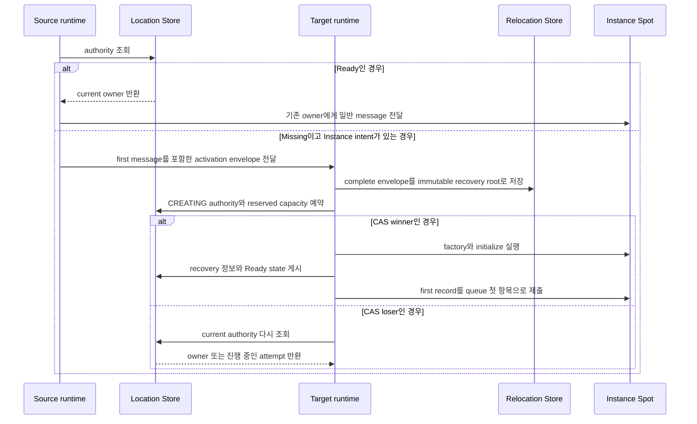

# Java Spot 공개 인터페이스

Session에 bind된 Actor를 포함한 Spot relocation은 target에서 Spot·Actor state와 queue를 복원하고
owner와 membership을 commit한 뒤 message 처리를 시작한다. Target runtime은
`sessionActorLocationUpdateReqMsg`를 send하여 각 bound Actor의 route와 위치 snapshot을
갱신한다. 응답이 없어도 message 처리를 멈추지 않으며 정해진 간격으로 같은 요청을 다시
보낸다. Relocation 자체는 physical·logical disconnect가
아니므로 Actor disconnect callback을 실행하지 않는다. relocation 대상에 포함되지 않은 다른 Actor의 route와 physical connection은
변경하지 않는다.

[인터페이스 목차](README.ko.md) · [Spot 공통 계약](../../../../12-spot-messaging.ko.md)

이 문서는 Java에서 Spot identity, lifecycle, messaging, manager와 relocation adapter를 표현하는 공개
인터페이스를 고정한다. 일반 message는 global SpotId로 대상을 지정하고, 특정 incarnation을 닫는
operation만 `SpotRef`를 사용한다.

Entry·User·Instance SpotId는 UTF-8 encoded 크기 1..255 bytes의 `String`인 global logical ID이며
case-sensitive exact value로 비교한다.
Unicode normalization과 case folding을 적용하지 않는다.

Location Store가 [Spot](../../../../01-glossary.ko.md#spot)의 current owner와 lifecycle state를 확정해 보관하는 정보를 authority라 한다.
Authority가 Missing이고 caller가 Instance intent를 지정했을 때 새 Instance Spot을 준비하는 과정을
cold activation이라 한다.

```java
public record SpotRef(
    String spotId,
    long objectGeneration,
    String meshName,
    RoutingId nodeRid) {}

public enum ZLinkSpotCloseReason {
    EXPLICIT_CLOSE(0), HOST_SHUTDOWN(1), RELOCATION_OUT(2), IDLE_EVICTED(3);
    private final int value;
    ZLinkSpotCloseReason(int value) { this.value = value; }
    public int value() { return value; }
}

public record ZLinkSpotClosingContext(
    ZLinkSpotCloseReason reason,
    Instant deadline) {}

public enum ZLinkSpotRelocationReadyOutcome {
    CONTINUED(0), RELOCATED(1);
    private final int value;
    ZLinkSpotRelocationReadyOutcome(int value) { this.value = value; }
    public int value() { return value; }
}

public record ZLinkSpotRelocationReadyCompletion(
    ZLinkSpotRelocationReadyOutcome outcome) {}

public interface ZLinkSpotRelocationReadyCall {
    void defer();
}

public interface ZLinkSpot<TActor extends ZLinkActor>
    extends ZLinkUserSpotActorLifecycle<TActor> {
    ZLinkSpotContext context();
    default void configure() {}
    default CompletionStage<ZLinkSpotCreateResponse> onCreate(
        ZLinkMessage request) {
        return CompletableFuture.completedFuture(
            ZLinkSpotCreateResponse.accept());
    }
    default CompletionStage<Void> onInitialize() {
        return CompletableFuture.completedFuture(null);
    }
    default CompletionStage<Void> onClosing(
        ZLinkSpotClosingContext context) {
        return CompletableFuture.completedFuture(null);
    }
    default CompletionStage<Void> onRelocationReadyCompleted(
        ZLinkSpotRelocationReadyCompletion completion) {
        return CompletableFuture.completedFuture(null);
    }
}

public interface ZLinkInstanceSpot {
    ZLinkInstanceSpotContext context();
    default void configure() {}
    default CompletionStage<Void> onInitialize() {
        return CompletableFuture.completedFuture(null);
    }
    default CompletionStage<Void> onClosing(
        ZLinkSpotClosingContext context) {
        return CompletableFuture.completedFuture(null);
    }
}

public interface ZLinkInstanceSpotHandlerRegistry {
    void addPacket(Class<?> handlerType);
}

public interface ZLinkInstanceSpotContext {
    String meshName();
    String spotId();
    long objectGeneration();
    RoutingId nodeRid();
    ZLinkInstanceSpotHandlerRegistry handlers();
    ZLinkSpotOutbound outbound();
    <T> ZLinkWorkerCall<T> runCpuWorker(ZLinkWorkerTask<T> work);
    <T> ZLinkWorkerCall<T> runIoWorker(ZLinkIoWorkerTask<T> work);
    CompletionStage<Boolean> close();
    CompletionStage<ZLinkTimer> addTimer(
        String name,
        Duration period,
        Class<?> handlerType,
        ZLinkTimerOptions options);
}

public interface ZLinkSpotRelocationAdapter<TSpot> {
    CompletionStage<byte[]> capture(
        TSpot spot, ZLinkRelocationCancellation cancellation);
    CompletionStage<Void> restore(
        TSpot spot, byte[] state, ZLinkRelocationCancellation cancellation);
}

public interface ZLinkSpotContext {
    String meshName();
    String spotId();
    long objectGeneration();
    RoutingId nodeRid();
    ZLinkSpotHandlerRegistry handlers();
    ZLinkSpotOutbound outbound();
    <T> ZLinkWorkerCall<T> runCpuWorker(ZLinkWorkerTask<T> work);
    <T> ZLinkWorkerCall<T> runIoWorker(ZLinkIoWorkerTask<T> work);
    ZLinkSpotRelocationReadyCall relocationReady();
    CompletionStage<Void> leaveActor(ZLinkActor actor);
    CompletionStage<Boolean> close();
    CompletionStage<ZLinkTimer> addTimer(
        String name,
        Duration period,
        Class<?> handlerType,
        ZLinkTimerOptions options);
}

public interface ZLinkEntrySpot<TActor extends ZLinkActor>
    extends ZLinkSpotActorMembershipLifecycle<TActor> {
    ZLinkEntrySpotContext context();
    default CompletionStage<ZLinkActorCreateResponse> onCreateActor(
        TActor actor,
        ZLinkMessage createRequest) {
        return CompletableFuture.completedFuture(
            ZLinkActorCreateResponse.accept());
    }
    default CompletionStage<Void> onClosing(
        ZLinkSpotClosingContext context) {
        return CompletableFuture.completedFuture(null);
    }
}

public interface ZLinkSpotSendCall extends ZLinkSendCall {
    ZLinkSpotSendCall instanceSpot();
    ZLinkSpotSendCall instanceSpot(String stableType);
    ZLinkSpotSendCall inMesh(String meshName);
    @Override ZLinkSpotSendCall metadata(String key, String value);
    @Override ZLinkSpotSendCall metadata(Map<String, String> metadata);
}

public interface ZLinkSpotRequestCall extends ZLinkRequestCall {
    ZLinkSpotRequestCall instanceSpot();
    ZLinkSpotRequestCall instanceSpot(String stableType);
    ZLinkSpotRequestCall inMesh(String meshName);
    @Override ZLinkSpotRequestCall metadata(String key, String value);
    @Override ZLinkSpotRequestCall metadata(Map<String, String> metadata);
    @Override ZLinkSpotRequestCall timeout(Duration timeout);
}

public interface ZLinkSpotManager {
    ZLinkSpotCreateCall create(String spotType);
    ZLinkSpotGetOrCreateCall getOrCreate(String spotId, String spotType);
    CompletionStage<Optional<SpotRef>> find(String spotId);
    CompletionStage<Boolean> close(SpotRef spot);
}

```

Java runtime은 Spot packet·request·subscription·timer handler를 Spot activation마다
한 번 만들고 재사용한다. Actor send·request handler는 Actor activation마다 한 번
만들고 재사용한다. 서로 다른 Actor는 handler instance와 activation-scoped dependency를
공유하지 않는다. Handler bean의 Spring scope로 이 규칙을 바꿀 수 없으며 별도 lifetime
option도 제공하지 않는다.

Same-node Join은 Actor handler를 유지한다. Cross-node Join과 relocation은 source
handler를 정리하고 target activation에서 다시 만든다. Handler instance는 relocation
payload가 아니며 복구할 application state는 Spot 또는 Actor가 소유한다.

Factory registration의 정확한 builder member는 [구성과 host](configuration-host.ko.md)가 소유한다.
Actor·User Spot·[Instance Spot](../../../../01-glossary.ko.md#entry-spot-user-spot과-instance-spot) [factory](../../../../01-glossary.ko.md#factory)는 configure callback에서 relocation 동작을 정확히 하나 선택하며 callback을 생략하는 overload는 제공하지 않는다.
Spot manager는 User Spot 전용이다. `create(spotType)`과 `getOrCreate(spotId, spotType)`만 User Spot의
creation intent를 만들며 Instance Spot create/get-or-create member와 kind marker를 제공하지 않는다.

일반 Spot send/request의 address는 global SpotId 하나다. 두 operation은 각각 `ZLinkSpotSendCall`과
`ZLinkSpotRequestCall`을 반환한다. `instanceSpot()` 또는 `instanceSpot(stableType)`을 호출한 operation만
Missing Instance Spot의 cold activation을 시작할 수 있다. Marker가 없는 operation은
Missing [authority](../../../../01-glossary.ko.md#authority)를
`NOT_FOUND`로 끝내며 creation intent를 만들지 않는다.

`instanceSpot()`은 existing authority가 있으면 등록된 Instance type 수와 관계없이 authority에 저장된 stable
type을 사용한다. Missing authority라면 placement가 선택한 Mesh에서 serving 가능한 distinct Instance type이
정확히 하나일 때만 그 type을 사용한다. `inMesh`를 지정하면 그 Mesh가 type 선택 범위가 된다. 두 개 이상이면 caller가
`instanceSpot(stableType)`을 사용해야 한다. `instanceSpot(stableType)`의 type은 Missing cold activation에
사용한다. Existing authority를 resolve하는 데 type은 필요하지 않지만 caller가 명시한 type이 stored type과
다르거나 authority의 kind가 User이면 type-mismatch 오류다.

`inMesh`는 Missing Instance cold activation의 Mesh를 선택한다. Existing authority를 다른
[owner](../../../../01-glossary.ko.md#owner)로 재배치하지 않으며 일반 User Spot messaging에도 적용하지 않는다. 이 option과
Instance marker는 한 번만 설정할 수 있고 terminal `submit`도 한 번만 호출할 수 있다.

User·Instance Spot factory의 `preserveStateWith` 등록은 factory type에 맞는
`ZLinkSpotRelocationAdapter<TSpot>` class를 받는다. Adapter는 application state를 최대 64 MiB의 opaque `byte[]`로
capture·restore하며 `TState`, `stateContractId`, state class와 `ZLinkMessage`를 사용하지 않는다. Framework는
capture 결과를 즉시 복사한다. Capture 배열은 adapter가 계속 소유하며 completion 뒤 변경해도 저장 payload가
바뀌지 않는다. Restore에는 호출마다 fresh defensive copy를 전달하고 adapter는 stage가 끝난 뒤 배열을 보관하지
않는다. 길이가 0인 배열도 유효한 application state이며 Restore를 생략하거나 `recreateOnRelocation`으로 해석하지 않는다.
Whole User Spot relocation에서는 Spot 자체에 Spot adapter를 사용하고 각 Actor participant에는 해당 Actor type의
`ZLinkActorRelocationAdapter`를 사용한다.
Instance Spot relocation에는 Spot adapter를 사용한다. Same-node operation과 `disableRelocation()`을 선택한 factory에서는 adapter를
호출하지 않고 `recreateOnRelocation()`을 선택한 factory에는 application state adapter가 없다.

Capture exception은 authority publication 전에 relocation을 abort하고 source admission을 유지한다. Restore
exception은 target admission을 sealed 상태로 유지한 채 같은 immutable payload를 retry하거나 target을 교체한다.
Factory는 target attempt마다 fresh Spot instance를 만들며 source나 이전 attempt instance를 재사용하지 않는다.
같은 attempt에서는 Restore가 반복될 수 있다. Exception을 빈 payload나 성공으로 바꾸지 않는다. Capture의 null
stage와 null `byte[]`, Restore의 null stage는 contract 위반이다. Host relocation에서 deadline이 먼저 확정되지 않은
precommit adapter exception과 contract 위반은 `Blocked/StateIncompatible`, [deadline](../../../../01-glossary.ko.md#deadline)이 먼저 확정되면
`Blocked/DeadlineExceeded`다. Stale attempt cancellation은 terminal result를 commit하지 못한다. Capture와
restore는 at-least-once이고 stale target attempt와 겹칠 수 있으므로 retry-safe해야 한다.

Maintenance가 Actor를 target Entry Spot으로 옮길 때는 Actor adapter와 queue·timer를
복원하고 Location authority·membership을 commit한 뒤 Actor message 처리를 시작한다.
Bound Session 위치 갱신은 그 뒤 `sessionActorLocationUpdateReqMsg`와
`sessionActorLocationUpdateResMsg` send message로 수행하며 응답이 없어도 Actor 처리를
멈추지 않는다. Infrastructure relocation은 target
`onJoinedActor(...)`, source `onLeaveActor(...)` 또는 relocation 전용 application
callback을 호출하지 않는다.

`PerActor` User Spot도 같은 Actor 단위 relocation을 사용한다. Spot policy는
`recreateOnRelocation()`만 허용하고 Spot adapter를 등록하지 않는다. Spot authority 전환 뒤
`ToSpot`·Create·Join은 target, `ToActor`는 Actor별 current owner를 사용한다.
Spot field와 Spot-level schedule은 이전하지 않는다. 유지해야 하는 shared state와
schedule은 application의 Redis·database·service 같은 외부 저장소에 둔다.
Target runtime-private shell은 같은 public Spot ID와 object generation을 사용하며
authority 전환 전에는 public lookup에 노출하지 않는다. Stale source route는 operation
identity, generation, deadline, correlation과 reply route를 보존해 relay한다. Actor
queue seal부터 target admission까지 1초는 운영 목표이며 초과해도 relocation을
취소하거나 rollback하지 않는다.

`relocationReady().defer()`는 `SPOT_WIDE`와 `APPLICATION_SIGNALED`을 함께 등록한
Spot turn에서만 유효하다. Framework는 이동하지 않았거나 commit 전에 abort했으면
source에서 `CONTINUED`, 이동했으면 target에서 `RELOCATED` completion을
`onRelocationReadyCompleted(...)`에 전달한다. 기본 method는 no-op이다. Callback
완료 전에는 보류한 application message와 timer를 실행하지 않는다.

기본 `ANY_TURN_BOUNDARY`, `PER_ACTOR`, Entry·Instance Spot, Spot turn 밖과 같은
turn의 중복 `defer()`는 queue mutation 전에 `INVALID_OPERATION`으로 실패한다.
`defer()` 뒤 같은 turn의 다른 Framework operation도 같은 오류다. Recovery에서
callback이 다시 실행될 수 있으므로 override는 retry-safe해야 한다.

### Instance Spot cold activation과 첫 message

User Spot은 manager operation이 placement reservation을 시작한다. Instance Spot은 source에서 reservation을
만들지 않고 다음 순서로 처리한다.

1. Source가 authority를 조회한다. Ready이면 current owner에게
   일반 message를 보낸다.
2. Authority가 Missing이고 [Instance intent](../../../../01-glossary.ko.md#instance-intent)가 있으면 source가 eligible target을 선택한다. 이어서 SpotId,
   stable type, creation intent와 first message를 activation envelope에 담아 target으로 보낸다. 이 envelope는
   [Ready](../../../../01-glossary.ko.md#ready) 전에도 전달할 수 있는 Framework infrastructure message이며 application handler에는 전달하지 않는다.
3. Target runtime은 metadata presence와 frame을 포함한 complete envelope를 Relocation Store에 immutable
   recovery root로 먼저 저장한 뒤, 요청한 SpotId와 [stable type](../../../../01-glossary.ko.md#stable-type)에 일치하는 local instance가 있는지
   확인한다.
4. Instance가 없을 때만 target이 자신을 owner로 하는 `CREATING` authority와 reserved capacity를 예약한다.
   Reserved [snapshot](../../../../01-glossary.ko.md#snapshot)은 어떤 예약인지 식별하는 reservation fence와 recovery root의 저장 완료를 증명하는
   receipt를 provider에서 받아 반환한다.
5. Authority reservation 경쟁에서 이긴 target(CAS winner)만 factory와 initialize를 실행하고 durable
   activation inbox의 first record를 확정한다. 경쟁에서 진 target(CAS loser)은 factory를 시작하지 않으며
   current authority를 다시 읽어 owner에게 message를 보내거나 진행 중인 attempt에 합류한다.
6. Winner는 handler 실행을 막는 barrier를 닫아 둔 상태에서 recovery root·cursor, Ready state와 active
   capacity를 게시한다.
7. Runtime은 first record를 local queue의 첫 항목으로 복원한 뒤 handler barrier를 연다. Source는 Ready
   뒤 같은 message를 다시 보내지 않는다. Authority와 일치하지 않는 local instance는 message를 처리하지
   못하도록 fence한다.
8. Target activation이 실패하면 해당 reservation을 abort한다.
9. Recovery data를 추적하는 recovery pointer는 첫 handler의 terminal completion을 durable하게 기록하고
   replay cursor를 inbox sequence까지 갱신한 뒤에만 Preserve CAS로 제거한다. Queue에 제출했다는 사실만으로
   제거하지 않는다.



이 그림은 [cold activation](../../../../01-glossary.ko.md#cold-activation)을 시작하는 첫 message와
authority 경쟁만 보여 준다. Handler의 terminal completion 또는 reply, activation 실패 cleanup과 recovery
pointer 제거는 번호 목록의 후반 단계에 정의한다.

User·Instance Spot relocation에서는 Framework가 `addTimer(...)`로 만든 logical timer registration, 마지막 완료
tick sequence, 다음 예정 시각과 아직 실행하지 않은 pending tick을 relocation payload에 포함한다. Target은
logical timer registration을 복원하므로 application이 timer를 다시 등록하지 않는다. 현재 실행 중인 timer callback만 source에서
완료하고, target Ready 전에는 복원한 tick을 application handler에 제출하지 않는다.

User Spot의 `close()`는 active Actor membership이 있으면 `false`를 반환한다. Spot state, admission과 authority는
바꾸지 않고 `onClosing`을 호출하거나 Actor를 자동 leave·destroy하지 않는다. Caller는 Actor를 명시적으로
leave 또는 destroy한 뒤 다시 close한다. Manager에서 Spot이 missing인 경우도 `false`이므로 caller는 사전 read
없이 두 경우를 구분하지 않는다. Host `Shutdown`은 Actor barrier를 끝낸 뒤 Spot cleanup을 수행한다.
Manager의 `find`와 `close`도 User Spot만 대상으로 한다. Instance Spot이 자신의 lifecycle을 끝내는 public 표면은
`ZLinkInstanceSpotContext.close()`이며 이 context 내부 close 계약은 유지한다.

다음 예제에서 `spotClient`는 `ZLinkSpotOutbound`이고 `cartId`는 호출할 global SpotId다. Instance
intent를 명시했으므로 Spot이 없을 때만 cold activation에 필요한 stable type과 최초 Mesh를 사용한다.

```java
CompletionStage<CartReply> reply = spotClient
    .requestToSpot(cartId, request)
    .instanceSpot("shopping-cart") // Missing이면 이 stable type의 Instance Spot 생성을 요청한다.
    .inMesh("commerce")            // Missing cold activation의 Mesh 선택 범위만 제한한다.
    .timeout(Duration.ofSeconds(5))
    .submit(CartReply.class);       // 생성 또는 기존 owner의 handler가 반환한 reply를 기다린다.
```

`ZLinkSpotCloseReason`의 값은 `EXPLICIT_CLOSE=0`, `HOST_SHUTDOWN=1`, `RELOCATION_OUT=2`,
`IDLE_EVICTED=3`이다. `IDLE_EVICTED`는 Instance Spot 전용 이유이며 Entry Spot과 User Spot에는 전달하지
않는다. 유휴 판정 조건과 정리 뒤 재활성화 규칙은
[Spot 모델 §6.2](../../../../11-spot-model.ko.md#62-유휴-instance-spot-정리)가 소유한다. Context의
`deadline`은 absolute `Instant`다. Java Spot closing callback에는 별도 Framework cancellation 인자를 추가하지
않는다. Framework는 deadline에 stage completion 대기를 끝내고 bounded teardown을 진행한다.
Entry·User·Instance Spot만 callback을 받고 Actor별 closing callback은 제공하지 않는다. Host [Shutdown](../../../../01-glossary.ko.md#shutdown)은 Actor
membership과 local instance가 유효한 상태에서 callback을 실행하고 completion 뒤 scope와 authority를 정리한다.
Standalone Actor relocation은 Entry Spot을 닫지 않으므로 이 callback을 호출하지 않는다.

일반 message는 Ready owner를 resolve한다. Missing RID에서는 위 Instance marker가 있는 call만 target-owned
[activation envelope](../../../../01-glossary.ko.md#activation-envelope)를 만든다. Owner loss 뒤 Instance reactivation은 authority에 저장된 stable type과 initial
Mesh를 사용한다.

Cold Instance factory·initialize가 실패하면 durable public `FAILED` state를 게시하지 않는다. Runtime은 local
failed barrier를 유지하고 exact authority fence로 delete한 뒤 read해 reconcile한다. Delete 확인 전 같은 address
호출은 같은 typed failure를 반환하며 hidden retry는 0이다. `MISSING` 확인 뒤 다음 caller만 새
`COLD_ACTIVATING` claim을 시작한다. 이 recovery 상태를 조작하는 public API는 없다.

SpotId는 UTF-8 encoded 크기 1..255 bytes의 global logical ID다. `SpotRef.objectGeneration()`은 `1..Long.MAX_VALUE`이고 MeshName·NodeRid는
조회 시점의 location snapshot이다. Typed JSON은 required property `spotId`, `objectGeneration`, `meshName`,
`nodeRid`를 사용하며 generation은 leading-zero 없는 decimal string으로 encode한다. Public handle, resolver와
unbounded list는 제공하지 않는다. User Spot Create/GetOrCreate call과 Instance cold activation call은 option
중복과 submit 중복을 `INVALID_OPERATION`으로 끝낸다.

Ref JSON의 unknown property, duplicate property, required property 누락, 숫자 generation token과
범위 밖 값은 거부한다.

## Exact public member inventory

아래 선언은 이 category의 Java public type과 member를 고정한다.

```java
public final class systems.zlink.framework.spots.SpotRef extends java.lang.Record {
  public systems.zlink.framework.spots.SpotRef(java.lang.String, long, java.lang.String, systems.zlink.contracts.core.RoutingId);
  public final java.lang.String toString();
  public final int hashCode();
  public final boolean equals(java.lang.Object);
  public java.lang.String spotId();
  public long objectGeneration();
  public java.lang.String meshName();
  public systems.zlink.contracts.core.RoutingId nodeRid();
}
public final class systems.zlink.framework.spots.ZLinkSpotCloseReason extends java.lang.Enum<systems.zlink.framework.spots.ZLinkSpotCloseReason> {
  public static final systems.zlink.framework.spots.ZLinkSpotCloseReason EXPLICIT_CLOSE;
  public static final systems.zlink.framework.spots.ZLinkSpotCloseReason HOST_SHUTDOWN;
  public static final systems.zlink.framework.spots.ZLinkSpotCloseReason RELOCATION_OUT;
  public static final systems.zlink.framework.spots.ZLinkSpotCloseReason IDLE_EVICTED;
  public static systems.zlink.framework.spots.ZLinkSpotCloseReason[] values();
  public static systems.zlink.framework.spots.ZLinkSpotCloseReason valueOf(java.lang.String);
  public int value();
}
public final class systems.zlink.framework.spots.ZLinkSpotClosingContext extends java.lang.Record {
  public systems.zlink.framework.spots.ZLinkSpotClosingContext(systems.zlink.framework.spots.ZLinkSpotCloseReason, java.time.Instant);
  public final java.lang.String toString();
  public final int hashCode();
  public final boolean equals(java.lang.Object);
  public systems.zlink.framework.spots.ZLinkSpotCloseReason reason();
  public java.time.Instant deadline();
}
public final class systems.zlink.framework.spots.ZLinkSpotRelocationReadyOutcome extends java.lang.Enum<systems.zlink.framework.spots.ZLinkSpotRelocationReadyOutcome> {
  public static final systems.zlink.framework.spots.ZLinkSpotRelocationReadyOutcome CONTINUED;
  public static final systems.zlink.framework.spots.ZLinkSpotRelocationReadyOutcome RELOCATED;
  public static systems.zlink.framework.spots.ZLinkSpotRelocationReadyOutcome[] values();
  public static systems.zlink.framework.spots.ZLinkSpotRelocationReadyOutcome valueOf(java.lang.String);
  public int value();
}
public final class systems.zlink.framework.spots.ZLinkSpotRelocationReadyCompletion extends java.lang.Record {
  public systems.zlink.framework.spots.ZLinkSpotRelocationReadyCompletion(systems.zlink.framework.spots.ZLinkSpotRelocationReadyOutcome);
  public systems.zlink.framework.spots.ZLinkSpotRelocationReadyOutcome outcome();
}
public interface systems.zlink.framework.spots.ZLinkSpotRelocationReadyCall {
  public abstract void defer();
}
public interface systems.zlink.framework.spots.ZLinkInstanceSpot {
  public abstract systems.zlink.framework.spots.ZLinkInstanceSpotContext context();
  public default void configure();
  public default java.util.concurrent.CompletionStage<java.lang.Void> onInitialize();
  public default java.util.concurrent.CompletionStage<java.lang.Void> onClosing(systems.zlink.framework.spots.ZLinkSpotClosingContext);
}
public interface systems.zlink.framework.spots.ZLinkInstanceSpotContext {
  public abstract java.lang.String meshName();
  public abstract java.lang.String spotId();
  public abstract long objectGeneration();
  public abstract systems.zlink.contracts.core.RoutingId nodeRid();
  public abstract systems.zlink.framework.spots.ZLinkInstanceSpotHandlerRegistry handlers();
  public abstract systems.zlink.framework.spots.ZLinkSpotOutbound outbound();
  public default <T> systems.zlink.framework.spots.ZLinkWorkerCall<T> runCpuWorker(systems.zlink.framework.spots.ZLinkWorkerTask<T>);
  public default <T> systems.zlink.framework.spots.ZLinkWorkerCall<T> runIoWorker(systems.zlink.framework.spots.ZLinkIoWorkerTask<T>);
  public abstract java.util.concurrent.CompletionStage<java.lang.Boolean> close();
  public abstract java.util.concurrent.CompletionStage<systems.zlink.framework.spots.ZLinkTimer> addTimer(java.lang.String, java.time.Duration, java.lang.Class<?>, systems.zlink.framework.spots.ZLinkTimerOptions);
}
public interface systems.zlink.framework.spots.ZLinkInstanceSpotHandlerRegistry {
  public abstract void addPacket(java.lang.Class<?>);
}
public interface systems.zlink.framework.spots.ZLinkSpotRelocationAdapter<TSpot> {
  public abstract java.util.concurrent.CompletionStage<byte[]> capture(TSpot, systems.zlink.framework.actors.ZLinkRelocationCancellation);
  public abstract java.util.concurrent.CompletionStage<java.lang.Void> restore(TSpot, byte[], systems.zlink.framework.actors.ZLinkRelocationCancellation);
}
public interface systems.zlink.framework.spots.ZLinkEntrySpot<TActor extends systems.zlink.framework.actors.ZLinkActor> extends systems.zlink.framework.spots.ZLinkSpotActorMembershipLifecycle<TActor> {
  public abstract systems.zlink.framework.spots.ZLinkEntrySpotContext context();
  public default void configure();
  public default java.util.concurrent.CompletionStage<java.lang.Void> onInitialize();
  public default java.util.concurrent.CompletionStage<java.lang.Void> onClosing(systems.zlink.framework.spots.ZLinkSpotClosingContext);
  public default java.util.concurrent.CompletionStage<systems.zlink.framework.spots.ZLinkActorCreateResponse> onCreateActor(TActor, systems.zlink.framework.messaging.ZLinkMessage);
}
public interface systems.zlink.framework.spots.ZLinkEntrySpotActorRequestHandler<TEntrySpot extends systems.zlink.framework.spots.ZLinkEntrySpot<?>, TActor extends systems.zlink.framework.actors.ZLinkActor, TRequest, TReply> {
  public abstract java.util.concurrent.CompletionStage<TReply> handle(TEntrySpot, TActor, systems.zlink.framework.ZLinkMessageContext, TRequest);
}
public interface systems.zlink.framework.spots.ZLinkEntrySpotActorSendHandler<TEntrySpot extends systems.zlink.framework.spots.ZLinkEntrySpot<?>, TActor extends systems.zlink.framework.actors.ZLinkActor, TMessage> {
  public abstract java.util.concurrent.CompletionStage<java.lang.Void> handle(TEntrySpot, TActor, systems.zlink.framework.ZLinkMessageContext, TMessage);
}
public interface systems.zlink.framework.spots.ZLinkEntrySpotContext {
  public abstract java.lang.String meshName();
  public abstract java.lang.String spotId();
  public abstract long objectGeneration();
  public abstract systems.zlink.contracts.core.RoutingId nodeRid();
  public default systems.zlink.framework.spots.ZLinkSpotHandlerRegistry handlers();
  public abstract systems.zlink.framework.spots.ZLinkSpotOutbound outbound();
  public default <T> systems.zlink.framework.spots.ZLinkWorkerCall<T> runCpuWorker(systems.zlink.framework.spots.ZLinkWorkerTask<T>);
  public default <T> systems.zlink.framework.spots.ZLinkWorkerCall<T> runIoWorker(systems.zlink.framework.spots.ZLinkIoWorkerTask<T>);
  public abstract java.util.concurrent.CompletionStage<java.lang.Void> destroyActor(systems.zlink.framework.actors.ZLinkActor);
  public abstract java.util.concurrent.CompletionStage<systems.zlink.framework.spots.ZLinkTimer> addTimer(java.lang.String, java.time.Duration, java.lang.Class<?>, systems.zlink.framework.spots.ZLinkTimerOptions);
}
public interface systems.zlink.framework.spots.ZLinkIoWorkerTask<T> {
  public abstract java.util.concurrent.CompletionStage<T> run(systems.zlink.framework.spots.ZLinkWorkerCancellation) throws java.lang.Exception;
}
public interface systems.zlink.framework.spots.ZLinkSpot<TActor extends systems.zlink.framework.actors.ZLinkActor> extends systems.zlink.framework.spots.ZLinkUserSpotActorLifecycle<TActor> {
  public abstract systems.zlink.framework.spots.ZLinkSpotContext context();
  public default void configure();
  public default java.util.concurrent.CompletionStage<systems.zlink.framework.spots.ZLinkSpotCreateResponse> onCreate(systems.zlink.framework.messaging.ZLinkMessage);
  public default java.util.concurrent.CompletionStage<java.lang.Void> onInitialize();
  public default java.util.concurrent.CompletionStage<java.lang.Void> onClosing(systems.zlink.framework.spots.ZLinkSpotClosingContext);
  public default java.util.concurrent.CompletionStage<java.lang.Void> onRelocationReadyCompleted(systems.zlink.framework.spots.ZLinkSpotRelocationReadyCompletion);
}
public final class systems.zlink.framework.spots.ZLinkSpotActorJoinResult extends java.lang.Record {
  public systems.zlink.framework.spots.ZLinkSpotActorJoinResult(boolean, systems.zlink.framework.messaging.ZLinkMessage);
  public static systems.zlink.framework.spots.ZLinkSpotActorJoinResult accept();
  public static systems.zlink.framework.spots.ZLinkSpotActorJoinResult accept(systems.zlink.framework.messaging.ZLinkMessage);
  public static systems.zlink.framework.spots.ZLinkSpotActorJoinResult accept(java.lang.Object);
  public static systems.zlink.framework.spots.ZLinkSpotActorJoinResult reject();
  public static systems.zlink.framework.spots.ZLinkSpotActorJoinResult reject(systems.zlink.framework.messaging.ZLinkMessage);
  public static systems.zlink.framework.spots.ZLinkSpotActorJoinResult reject(java.lang.Object);
  public final java.lang.String toString();
  public final int hashCode();
  public final boolean equals(java.lang.Object);
  public boolean accepted();
  public systems.zlink.framework.messaging.ZLinkMessage reply();
}
public interface systems.zlink.framework.spots.ZLinkSpotActorMembershipLifecycle<TActor extends systems.zlink.framework.actors.ZLinkActor> {
  public abstract java.util.concurrent.CompletionStage<java.lang.Void> onJoinedActor(TActor);
  public abstract java.util.concurrent.CompletionStage<java.lang.Void> onLeaveActor(TActor);
  public default java.util.concurrent.CompletionStage<java.lang.Void> onDisconnectActor(TActor);
}
public interface systems.zlink.framework.spots.ZLinkUserSpotActorLifecycle<TActor extends systems.zlink.framework.actors.ZLinkActor> extends systems.zlink.framework.spots.ZLinkSpotActorMembershipLifecycle<TActor> {
  public default java.util.concurrent.CompletionStage<systems.zlink.framework.spots.ZLinkSpotActorJoinResult> onActorJoin(java.lang.String, systems.zlink.framework.messaging.ZLinkMessage);
}
public final class systems.zlink.framework.spots.ZLinkActorCreateResponse extends java.lang.Record {
  public systems.zlink.framework.spots.ZLinkActorCreateResponse(boolean, systems.zlink.framework.messaging.ZLinkMessage);
  public static systems.zlink.framework.spots.ZLinkActorCreateResponse accept();
  public static systems.zlink.framework.spots.ZLinkActorCreateResponse accept(systems.zlink.framework.messaging.ZLinkMessage);
  public static systems.zlink.framework.spots.ZLinkActorCreateResponse accept(java.lang.Object);
  public static systems.zlink.framework.spots.ZLinkActorCreateResponse reject();
  public static systems.zlink.framework.spots.ZLinkActorCreateResponse reject(systems.zlink.framework.messaging.ZLinkMessage);
  public static systems.zlink.framework.spots.ZLinkActorCreateResponse reject(java.lang.Object);
  public boolean accepted();
  public systems.zlink.framework.messaging.ZLinkMessage reply();
}
public interface systems.zlink.framework.spots.ZLinkSpotActorRequestHandler<TSpot extends systems.zlink.framework.spots.ZLinkSpot<?>, TActor extends systems.zlink.framework.actors.ZLinkActor, TRequest, TReply> {
  public abstract java.util.concurrent.CompletionStage<TReply> handle(TSpot, TActor, systems.zlink.framework.ZLinkMessageContext, TRequest);
}
public interface systems.zlink.framework.spots.ZLinkSpotActorSendHandler<TSpot extends systems.zlink.framework.spots.ZLinkSpot<?>, TActor extends systems.zlink.framework.actors.ZLinkActor, TMessage> {
  public abstract java.util.concurrent.CompletionStage<java.lang.Void> handle(TSpot, TActor, systems.zlink.framework.ZLinkMessageContext, TMessage);
}
public interface systems.zlink.framework.spots.ZLinkSpotContext {
  public abstract java.lang.String meshName();
  public abstract java.lang.String spotId();
  public abstract long objectGeneration();
  public abstract systems.zlink.contracts.core.RoutingId nodeRid();
  public default systems.zlink.framework.spots.ZLinkSpotHandlerRegistry handlers();
  public abstract systems.zlink.framework.spots.ZLinkSpotOutbound outbound();
  public abstract systems.zlink.framework.spots.ZLinkSpotRelocationReadyCall relocationReady();
  public default <T> systems.zlink.framework.spots.ZLinkWorkerCall<T> runCpuWorker(systems.zlink.framework.spots.ZLinkWorkerTask<T>);
  public default <T> systems.zlink.framework.spots.ZLinkWorkerCall<T> runIoWorker(systems.zlink.framework.spots.ZLinkIoWorkerTask<T>);
  public abstract java.util.concurrent.CompletionStage<java.lang.Void> leaveActor(systems.zlink.framework.actors.ZLinkActor);
  public abstract java.util.concurrent.CompletionStage<java.lang.Boolean> close();
  public abstract java.util.concurrent.CompletionStage<systems.zlink.framework.spots.ZLinkTimer> addTimer(java.lang.String, java.time.Duration, java.lang.Class<?>, systems.zlink.framework.spots.ZLinkTimerOptions);
}
public final class systems.zlink.framework.spots.ZLinkSpotCreateResult extends java.lang.Record {
  public systems.zlink.framework.spots.ZLinkSpotCreateResult(systems.zlink.framework.spots.SpotRef, systems.zlink.framework.spots.ZLinkSpotCreateState, systems.zlink.framework.messaging.ZLinkMessage);
  public final java.lang.String toString();
  public final int hashCode();
  public final boolean equals(java.lang.Object);
  public systems.zlink.framework.spots.SpotRef spot();
  public systems.zlink.framework.spots.ZLinkSpotCreateState state();
  public systems.zlink.framework.messaging.ZLinkMessage reply();
}
public final class systems.zlink.framework.spots.ZLinkSpotCreateState extends java.lang.Enum<systems.zlink.framework.spots.ZLinkSpotCreateState> {
  public static final systems.zlink.framework.spots.ZLinkSpotCreateState EXISTING;
  public static final systems.zlink.framework.spots.ZLinkSpotCreateState CREATED;
  public static final systems.zlink.framework.spots.ZLinkSpotCreateState REJECTED;
  public static systems.zlink.framework.spots.ZLinkSpotCreateState[] values();
  public static systems.zlink.framework.spots.ZLinkSpotCreateState valueOf(java.lang.String);
  public int value();
}
public interface systems.zlink.framework.spots.ZLinkSpotHandlerRegistry {
  public abstract void addHandler(java.lang.Class<?>);
}
public final class systems.zlink.framework.spots.ZLinkSpotKind extends java.lang.Enum<systems.zlink.framework.spots.ZLinkSpotKind> {
  public static final systems.zlink.framework.spots.ZLinkSpotKind INVALID;
  public static final systems.zlink.framework.spots.ZLinkSpotKind ENTRY;
  public static final systems.zlink.framework.spots.ZLinkSpotKind USER;
  public static final systems.zlink.framework.spots.ZLinkSpotKind INSTANCE;
  public static systems.zlink.framework.spots.ZLinkSpotKind[] values();
  public static systems.zlink.framework.spots.ZLinkSpotKind valueOf(java.lang.String);
  public int value();
  public static systems.zlink.framework.spots.ZLinkSpotKind fromValue(int);
}
public interface systems.zlink.framework.spots.ZLinkSpotManager {
  public abstract systems.zlink.framework.spots.ZLinkSpotCreateCall create(java.lang.String);
  public abstract systems.zlink.framework.spots.ZLinkSpotGetOrCreateCall getOrCreate(java.lang.String, java.lang.String);
  public abstract java.util.concurrent.CompletionStage<java.util.Optional<systems.zlink.framework.spots.SpotRef>> find(java.lang.String);
  public abstract java.util.concurrent.CompletionStage<java.lang.Boolean> close(systems.zlink.framework.spots.SpotRef);
}
public interface systems.zlink.framework.spots.ZLinkSpotCreateCall {
  public abstract systems.zlink.framework.spots.ZLinkSpotCreateCall inMesh(java.lang.String);
  public abstract systems.zlink.framework.spots.ZLinkSpotCreateCall request(java.lang.Object);
  public abstract systems.zlink.framework.spots.ZLinkSpotCreateCall request(systems.zlink.framework.messaging.ZLinkMessage);
  public abstract systems.zlink.framework.spots.ZLinkSpotCreateCall timeout(java.time.Duration);
  public abstract java.util.concurrent.CompletionStage<systems.zlink.framework.spots.ZLinkSpotCreateResult> submit();
  public abstract java.util.concurrent.CompletionStage<systems.zlink.framework.spots.ZLinkSpotCreateResult> yield();
}
public interface systems.zlink.framework.spots.ZLinkSpotGetOrCreateCall {
  public abstract systems.zlink.framework.spots.ZLinkSpotGetOrCreateCall inMesh(java.lang.String);
  public abstract systems.zlink.framework.spots.ZLinkSpotGetOrCreateCall request(java.lang.Object);
  public abstract systems.zlink.framework.spots.ZLinkSpotGetOrCreateCall request(systems.zlink.framework.messaging.ZLinkMessage);
  public abstract systems.zlink.framework.spots.ZLinkSpotGetOrCreateCall timeout(java.time.Duration);
  public abstract java.util.concurrent.CompletionStage<systems.zlink.framework.spots.ZLinkSpotCreateResult> submit();
  public abstract java.util.concurrent.CompletionStage<systems.zlink.framework.spots.ZLinkSpotCreateResult> yield();
}
public interface systems.zlink.framework.spots.ZLinkSpotRequestCall extends systems.zlink.framework.channels.ZLinkRequestCall {
  public abstract systems.zlink.framework.spots.ZLinkSpotRequestCall instanceSpot();
  public abstract systems.zlink.framework.spots.ZLinkSpotRequestCall instanceSpot(java.lang.String);
  public abstract systems.zlink.framework.spots.ZLinkSpotRequestCall inMesh(java.lang.String);
  public abstract systems.zlink.framework.spots.ZLinkSpotRequestCall metadata(java.lang.String, java.lang.String);
  public abstract systems.zlink.framework.spots.ZLinkSpotRequestCall metadata(java.util.Map<java.lang.String, java.lang.String>);
  public abstract systems.zlink.framework.spots.ZLinkSpotRequestCall timeout(java.time.Duration);
}
public interface systems.zlink.framework.spots.ZLinkSpotSendCall extends systems.zlink.framework.channels.ZLinkSendCall {
  public abstract systems.zlink.framework.spots.ZLinkSpotSendCall instanceSpot();
  public abstract systems.zlink.framework.spots.ZLinkSpotSendCall instanceSpot(java.lang.String);
  public abstract systems.zlink.framework.spots.ZLinkSpotSendCall inMesh(java.lang.String);
  public abstract systems.zlink.framework.spots.ZLinkSpotSendCall metadata(java.lang.String, java.lang.String);
  public abstract systems.zlink.framework.spots.ZLinkSpotSendCall metadata(java.util.Map<java.lang.String, java.lang.String>);
}
public interface systems.zlink.framework.spots.ZLinkSpotOutbound {
  public abstract systems.zlink.framework.spots.ZLinkSpotSendCall sendToSpot(java.lang.String, java.lang.Object);
  public abstract systems.zlink.framework.spots.ZLinkSpotRequestCall requestToSpot(java.lang.String, java.lang.Object);
  public abstract systems.zlink.framework.channels.ZLinkPublishCall publish(java.lang.String, java.lang.String, java.lang.Object);
  public abstract systems.zlink.framework.channels.ZLinkSendCall sendToChannel(java.lang.String, java.lang.Object);
  public abstract systems.zlink.framework.channels.ZLinkRequestCall requestToChannel(java.lang.String, java.lang.Object);
}
public interface systems.zlink.framework.spots.ZLinkSpotPacketHandler<TSpot, TMessage> {
  public abstract java.util.concurrent.CompletionStage<java.lang.Void> handle(TSpot, TMessage);
  public default java.util.concurrent.CompletionStage<java.lang.Void> handle(TSpot, TMessage, systems.zlink.framework.ZLinkMessageContext);
}
public interface systems.zlink.framework.spots.ZLinkSpotPublisherClient {
  public abstract systems.zlink.framework.channels.ZLinkPublishCall publish(java.lang.String, java.lang.String, java.lang.Object);
}
public interface systems.zlink.framework.spots.ZLinkSpotRequestHandler<TSpot, TRequest, TReply> {
  public abstract java.util.concurrent.CompletionStage<TReply> handle(TSpot, TRequest);
  public default java.util.concurrent.CompletionStage<TReply> handle(TSpot, TRequest, systems.zlink.framework.ZLinkMessageContext);
}
public interface systems.zlink.framework.spots.ZLinkSpotSubscriptionHandler<TSpot, TEvent> {
  public abstract java.util.concurrent.CompletionStage<java.lang.Void> handle(TSpot, TEvent);
  public default java.util.concurrent.CompletionStage<java.lang.Void> handle(TSpot, TEvent, systems.zlink.framework.channels.ZLinkPublishMessageContext);
}
public interface systems.zlink.framework.spots.ZLinkSpotTimerHandler<TSpot> {
  public abstract java.util.concurrent.CompletionStage<java.lang.Void> handle(TSpot, systems.zlink.framework.spots.ZLinkTimerTick);
}
public interface systems.zlink.framework.spots.ZLinkTimer extends java.lang.AutoCloseable {
  public abstract boolean isDisposed();
  public abstract java.util.concurrent.CompletionStage<java.lang.Void> cancel();
  public abstract void close();
}
public final class systems.zlink.framework.spots.ZLinkTimerOptions extends java.lang.Record {
  public systems.zlink.framework.spots.ZLinkTimerOptions(systems.zlink.framework.spots.ZLinkTimerOverrunPolicy, int, boolean);
  public final java.lang.String toString();
  public final int hashCode();
  public final boolean equals(java.lang.Object);
  public systems.zlink.framework.spots.ZLinkTimerOverrunPolicy overrunPolicy();
  public int maxCatchUpTicks();
  public boolean stopOnUnhandledException();
}
public final class systems.zlink.framework.spots.ZLinkTimerOverrunPolicy extends java.lang.Enum<systems.zlink.framework.spots.ZLinkTimerOverrunPolicy> {
  public static final systems.zlink.framework.spots.ZLinkTimerOverrunPolicy SKIP_LATE_TICKS;
  public static final systems.zlink.framework.spots.ZLinkTimerOverrunPolicy CATCH_UP_BOUNDED;
  public static final systems.zlink.framework.spots.ZLinkTimerOverrunPolicy DELAY_NEXT_TICK;
  public static systems.zlink.framework.spots.ZLinkTimerOverrunPolicy[] values();
  public static systems.zlink.framework.spots.ZLinkTimerOverrunPolicy valueOf(java.lang.String);
  public int value();
}
public final class systems.zlink.framework.spots.ZLinkTimerTick extends java.lang.Record {
  public systems.zlink.framework.spots.ZLinkTimerTick(java.lang.String, long, long, java.time.Duration, java.time.Instant, java.time.Instant, java.time.Duration, java.time.Duration, java.time.Duration, long);
  public final java.lang.String toString();
  public final int hashCode();
  public final boolean equals(java.lang.Object);
  public java.lang.String name();
  public long deliveryIndex();
  public long scheduledIndex();
  public java.time.Duration period();
  public java.time.Instant scheduledAt();
  public java.time.Instant startedAt();
  public java.time.Duration scheduledElapsed();
  public java.time.Duration startedElapsed();
  public java.time.Duration delay();
  public long skippedTicks();
}
public interface systems.zlink.framework.spots.ZLinkWorkerCall<T> {
  public abstract systems.zlink.framework.spots.ZLinkWorkerCall<T> timeout(java.time.Duration);
  public abstract java.util.concurrent.CompletionStage<T> submit();
  public default java.util.concurrent.CompletionStage<T> yield();
}
public interface systems.zlink.framework.spots.ZLinkWorkerCancellation {
  public abstract boolean isCancellationRequested();
  public abstract void throwIfCancellationRequested();
}
public interface systems.zlink.framework.spots.ZLinkWorkerTask<T> {
  public abstract T run(systems.zlink.framework.spots.ZLinkWorkerCancellation) throws java.lang.Exception;
}
```

## Spot lifecycle result public signature

```java
public final class systems.zlink.framework.spots.ZLinkSpotCreateResponse extends java.lang.Record {
  public systems.zlink.framework.spots.ZLinkSpotCreateResponse(boolean, systems.zlink.framework.messaging.ZLinkMessage);
  public static systems.zlink.framework.spots.ZLinkSpotCreateResponse accept();
  public static systems.zlink.framework.spots.ZLinkSpotCreateResponse accept(systems.zlink.framework.messaging.ZLinkMessage);
  public static systems.zlink.framework.spots.ZLinkSpotCreateResponse accept(java.lang.Object);
  public static systems.zlink.framework.spots.ZLinkSpotCreateResponse reject();
  public static systems.zlink.framework.spots.ZLinkSpotCreateResponse reject(systems.zlink.framework.messaging.ZLinkMessage);
  public static systems.zlink.framework.spots.ZLinkSpotCreateResponse reject(java.lang.Object);
  public final java.lang.String toString();
  public final int hashCode();
  public final boolean equals(java.lang.Object);
  public boolean accepted();
  public systems.zlink.framework.messaging.ZLinkMessage reply();
}
```

이 문서에 선언된 `yield()`는 `SpotWide` User Spot 또는 Instance Spot의 shared turn에서만 유효하다.
Entry Spot과 `PerActor` User Spot에서 호출하면 operation을 제출하거나 turn을 반환하지 않고
`INVALID_OPERATION`으로 완료한다. `submit()`은 현재 turn을 유지하는 공통 `Async` 의미다.
