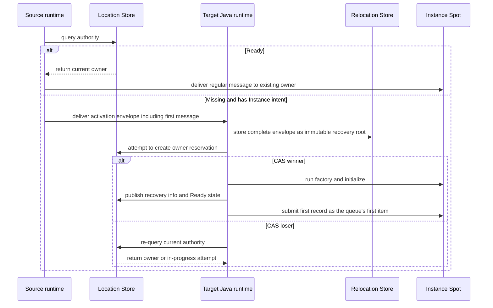

# Kotlin Spot Public Interface

A Spot relocation, including an Actor bound to a session, restores
Spot/Actor state and queue on the target, commits owner and membership,
and then starts message processing. The target runtime sends
`sessionActorLocationUpdateReqMsg` to update the route and location
snapshot of each bound Actor. Even without a response, message
processing doesn't stop, and the same request is resent at a fixed
interval. Since relocation itself isn't a physical/logical disconnect,
it doesn't run the Actor disconnect callback. The route and physical
connection of a different Actor not included in the relocation target
aren't changed.

[Interface table of contents](README.en.md) · [Java Spot](../../java/interfaces/spots.en.md) ·
[Common Spot Contract](../../../../15-spot-actor.en.md)

The information the Location Store holds, fixing the current owner and
lifecycle state of a Spot, is called authority. The process of
preparing a new Instance Spot when authority is Missing and the caller
specified Instance intent is called cold activation.

SpotId is a `String` of UTF-8 encoded size 1..255 bytes, a logical ID
unique across the whole [Location Store](../../../../01-glossary.en.md#location-store)
transaction domain. Comparison is case-sensitive exact match, with no
Unicode normalization or case folding applied. A regular
[Spot](../../../../01-glossary.en.md#spot) send/request only takes
SpotId. `SpotRef(spotId, objectGeneration, meshName, nodeRid)` is an
immutable snapshot only used when closing an exact incarnation.
`objectGeneration` is `1..Long.MAX_VALUE`, and a decimal string in
JSON. User and [Instance Spot](../../../../01-glossary.en.md#entry-user-instance-spot)
type is a stable exact value of UTF-8 1..255 bytes. The Java enum's
numeric value is `ZLinkSpotKind.INVALID=0`, `ENTRY=1`, `USER=2`,
`INSTANCE=3`, and Kotlin doesn't use ordinal as the contract value — it
uses `value()`. A creatable-kind enum isn't provided.

`ZLinkSpotManager.create(spotType)` generates a User Spot ID, and
`getOrCreate(spotId, spotType)` uses a caller-specified User
[Spot ID](../../../../01-glossary.en.md#spot-id). The manager doesn't
provide Instance Spot create/get-or-create. Both operations return a
Kotlin-only single-use wrapper that preserves `inMesh`, `request`,
`timeout`. Terminal `await()` or `yield()` is called exactly once. The
rules for duplicate option and duplicate terminal, Mesh selection, type
conflict, and deadline are the same as the Actor operation. The Entry
Spot ID is created by the framework and isn't a public create target.

A Spot send/request only takes the global SpotId as address and returns
a Kotlin-only Spot call wrapper. Only a call that called `instanceSpot()`
or `instanceSpot(stableType)` creates a Missing Instance Spot's
cold-activation intent. Without the marker, Missing
[authority](../../../../01-glossary.en.md#authority) is not-found. If
existing authority exists, it uses the stored stable type regardless of
the number of registered types, so it doesn't require the type again.

Using `instanceSpot()` on Missing authority only auto-selects the type
when the Mesh placement selected has exactly one distinct serving
Instance type. If `inMesh` is specified, that Mesh becomes the type
selection scope, and with two or more,
`instanceSpot(stableType)` is required. The
[stable type](../../../../01-glossary.en.md#stable-type) argument is
only used for Missing cold activation, and isn't needed to resolve
existing authority. If the caller-specified type differs from the
stored type, it's `TypeMismatch`. `inMesh` only applies when selecting
the Mesh for Missing cold activation, and doesn't relocate an existing
[owner](../../../../01-glossary.en.md#owner). The wrapper keeps this
fluent state and ends the Java call at `await()` or `yield()`.

### Instance Spot Cold Activation And The First Message

Even using the Kotlin API, Instance Spot creation is processed by the
Java runtime in the following order.

1. The source looks up authority. If Ready, it sends a regular message
   to the current owner.
2. If authority is Missing and there's
   [Instance intent](../../../../01-glossary.en.md#instance-intent), the
   source selects an eligible target. It then puts SpotId, stable type,
   creation intent, and the first message into an activation envelope
   and sends it to the target. The source doesn't create a placement
   reservation. This envelope is a Framework infrastructure message
   that can be delivered even before the
   [Ready](../../../../01-glossary.en.md#ready) CAS, and isn't
   delivered to the application handler.
3. The target Java runtime first stores the complete envelope,
   including metadata presence and frame, as an immutable recovery root
   in the Relocation Store.
4. Only when there's no local Instance matching the requested SpotId
   and stable type does the target reserve itself as owner. The
   reserved [snapshot](../../../../01-glossary.en.md#snapshot) is
   returned with a reservation fence identifying which reservation it
   is, and a receipt proving the recovery root's storage is complete,
   both received from the provider.
5. Only the target that wins the authority reservation race (CAS
   winner) runs factory and initialize and confirms the first record of
   the durable activation inbox. A target that loses the race (CAS
   loser) doesn't start a [factory](../../../../01-glossary.en.md#factory) —
   it re-reads current authority and either sends a message to the
   owner or joins the in-progress attempt.
6. The winner publishes the recovery root/cursor and Ready state while
   keeping the barrier that blocks handler execution closed.
7. The runtime restores the first record as the first item of the local
   queue and then opens the handler barrier. The source doesn't resend
   the same message after Ready. A local instance not matching
   authority is fenced from processing the message.
8. The recovery pointer tracking recovery data is removed with a
   Preserve CAS only after durably recording the first handler's
   terminal completion and updating the replay cursor to the inbox
   sequence. It isn't removed merely because it was submitted to the
   queue.



This diagram only shows the first message that starts
[cold activation](../../../../01-glossary.en.md#cold-activation) and the
authority race. The handler's terminal completion or reply, and recovery
pointer removal, are defined in the later steps of the numbered list.

Kotlin implements Java's `ZLinkSpotRelocationAdapter<TSpot>` unchanged.
The opaque `byte[]` appears as `ByteArray`, and `capture` and `restore`
return the same `CompletionStage` as the Java contract. A separate
suspending Spot adapter, `TState`, `stateContractId`, state class, or
`ZLinkMessage` relocation surface isn't provided. A state-preservation
factory uses `preserveStateWith(SpotAdapter::class.java)`, and the
factory target and adapter type are validated before socket bind.

A state-preserving whole User Spot relocation uses the Spot adapter for
the Spot itself and an Actor adapter for each member Actor. A
state-preserving Instance Spot relocation uses the Spot adapter. The
adapter isn't called for a same-node operation, `disableRelocation()`,
or `recreateOnRelocation()`. The capture `ByteArray` is at most 64 MiB,
and the adapter owns it until completion. The Java runtime copies it at
completion. Restore receives a fresh defensive copy per call and doesn't
keep it after completion. An empty `ByteArray` is also a valid
preserved state. The factory creates a fresh Spot instance per target
attempt and doesn't reuse the source or a previous attempt's instance.
Restore of the same attempt can be repeated. A capture exception keeps
source authority and admission, and a restore exception keeps the
target sealed while allowing a retry with the same payload on the same
target process. A different target isn't automatically selected. A
null stage and null capture payload are contract violations. Host
relocation's precommit adapter exception/contract violation is
`Blocked/StateIncompatible` if a [deadline](../../../../01-glossary.en.md#deadline)
hasn't been fixed yet, and `Blocked/DeadlineExceeded` once the deadline
is fixed. Stale attempt cancellation can't commit a terminal result. The
callback is at-least-once and can overlap with a stale attempt, so it
must be retry-safe.

The Spot closing reason uses Java's `ZLinkSpotCloseReason`, with values
`EXPLICIT_CLOSE=0`, `HOST_SHUTDOWN=1`, `RELOCATION_OUT=2`,
`IDLE_EVICTED=3`. `ZLinkSpotClosingContext.deadline` is an absolute
`Instant`. The Java lifecycle interface only takes a context and doesn't
use a separate Framework cancellation type. The suspending projection
cancels the bridge coroutine at the cleanup deadline, and the callback
follows coroutine cancellation unchanged. A per-Actor closing callback
isn't provided.

## Kotlin Source Signature

```kotlin
interface ZLinkSuspendingSpotPacketHandler<TSpot : ZLinkSpot<*>, TMessage> {
    suspend fun handle(spot: TSpot, message: TMessage)
    suspend fun handle(
        spot: TSpot,
        message: TMessage,
        context: ZLinkMessageContext,
    )
}

interface ZLinkSuspendingSpotRequestHandler<TSpot : Any, TRequest, TReply> {
    suspend fun handle(spot: TSpot, request: TRequest): TReply
    suspend fun handle(
        spot: TSpot,
        request: TRequest,
        context: ZLinkMessageContext,
    ): TReply
}

interface ZLinkSuspendingSpotSubscriptionHandler<TSpot : Any, TEvent> {
    suspend fun handle(spot: TSpot, event: TEvent)
    suspend fun handle(
        spot: TSpot,
        event: TEvent,
        context: ZLinkPublishMessageContext,
    )
}

interface ZLinkSuspendingSpotTimerHandler<TSpot : Any> {
    suspend fun handle(spot: TSpot, tick: ZLinkTimerTick)
}

// Relocation restores the logical timer and pending tick as framework payload.

abstract class ZLinkSuspendingSpot<TActor : ZLinkActor> : ZLinkSpot<TActor> {
    abstract val context: ZLinkSpotContext
    final override fun context(): ZLinkSpotContext = context
    protected open suspend fun onCreateSuspending(
        request: ZLinkMessage,
    ): ZLinkSpotCreateResponse
    protected open suspend fun onInitializeSuspending()
    protected open suspend fun onClosingSuspending(
        context: ZLinkSpotClosingContext,
    )
    protected open suspend fun onRelocationReadyCompletedSuspending(
        completion: ZLinkSpotRelocationReadyCompletion,
    )
    protected abstract suspend fun onActorJoinSuspending(
        actorId: String,
        request: ZLinkMessage,
    ): ZLinkSpotActorJoinResult
    protected abstract suspend fun onJoinedActorSuspending(actor: TActor)
    protected abstract suspend fun onLeaveActorSuspending(actor: TActor)
    protected open suspend fun onDisconnectActorSuspending(actor: TActor)
}

abstract class ZLinkSuspendingEntrySpot<TActor : ZLinkActor> :
    ZLinkEntrySpot<TActor> {
    abstract val context: ZLinkEntrySpotContext
    final override fun context(): ZLinkEntrySpotContext = context
    protected open suspend fun onInitializeSuspending()
    protected open suspend fun onClosingSuspending(
        context: ZLinkSpotClosingContext,
    )
    protected open suspend fun onCreateActorSuspending(
        actor: TActor,
        createRequest: ZLinkMessage,
    ): ZLinkActorCreateResponse
    protected abstract suspend fun onJoinedActorSuspending(actor: TActor)
    protected abstract suspend fun onLeaveActorSuspending(actor: TActor)
    protected open suspend fun onDisconnectActorSuspending(actor: TActor)
}

abstract class ZLinkSuspendingInstanceSpot : ZLinkInstanceSpot {
    abstract val context: ZLinkInstanceSpotContext
    final override fun context(): ZLinkInstanceSpotContext = context
    protected open suspend fun onInitializeSuspending()
    protected open suspend fun onClosingSuspending(
        context: ZLinkSpotClosingContext,
    )
}

inline fun <reified THandler : Any> ZLinkSpotHandlerRegistry.addHandler()

interface ZLinkKotlinSpotSendCall {
    fun metadata(key: String, value: String): ZLinkKotlinSpotSendCall
    fun instanceSpot(): ZLinkKotlinSpotSendCall
    fun instanceSpot(stableType: String): ZLinkKotlinSpotSendCall
    fun inMesh(meshName: String): ZLinkKotlinSpotSendCall
    suspend fun await()
}

interface ZLinkKotlinSpotRequestCall<TReply> {
    fun metadata(key: String, value: String): ZLinkKotlinSpotRequestCall<TReply>
    fun instanceSpot(): ZLinkKotlinSpotRequestCall<TReply>
    fun instanceSpot(stableType: String): ZLinkKotlinSpotRequestCall<TReply>
    fun inMesh(meshName: String): ZLinkKotlinSpotRequestCall<TReply>
    fun timeout(timeout: Duration): ZLinkKotlinSpotRequestCall<TReply>
    suspend fun await(): TReply
    suspend fun yield(): TReply
}

interface ZLinkKotlinSpotCreateCall {
    fun inMesh(meshName: String): ZLinkKotlinSpotCreateCall
    fun request(request: Any): ZLinkKotlinSpotCreateCall
    fun timeout(timeout: Duration): ZLinkKotlinSpotCreateCall
    suspend fun await(): ZLinkSpotCreateResult
    suspend fun yield(): ZLinkSpotCreateResult
}

interface ZLinkKotlinSpotManager {
    fun create(spotType: String): ZLinkKotlinSpotCreateCall
    fun getOrCreate(
        spotId: String,
        spotType: String,
    ): ZLinkKotlinSpotCreateCall
}

fun ZLinkKotlinRouteClient.sendToSpot(
    spotId: String,
    message: Any,
): ZLinkKotlinSpotSendCall

inline fun <reified TReply> ZLinkKotlinRouteClient.requestToSpot(
    spotId: String,
    request: Any,
): ZLinkKotlinSpotRequestCall<TReply>
```

In User/Instance Spot relocation, the Java runtime includes the logical
timer registration, the last completed tick sequence, the next
scheduled time, and pending ticks not yet run in the relocation payload.
The target restores the logical timer registration, so the application
doesn't re-register the timer. Only the currently running suspending
timer handler finishes on the source, and the restored tick isn't run
before target Ready.

## Exact Generated JVM Signature

```java
public final class systems.zlink.framework.kotlin.ZLinkSpotHandlerRegistryExtensionsKt {
  public static final <THandler> void addHandler(systems.zlink.framework.spots.ZLinkSpotHandlerRegistry);
  public static final void addTypedHandler(systems.zlink.framework.spots.ZLinkSpotHandlerRegistry, java.lang.Class<?>);
}
public interface systems.zlink.framework.kotlin.ZLinkSuspendingSpotPacketHandler<TSpot extends systems.zlink.framework.spots.ZLinkSpot<?>, TMessage> {
  public abstract java.lang.Object handle(TSpot, TMessage, kotlin.coroutines.Continuation<? super kotlin.Unit>);
  public abstract java.lang.Object handle(TSpot, TMessage, systems.zlink.framework.messaging.ZLinkMessageContext, kotlin.coroutines.Continuation<? super kotlin.Unit>);
}
public interface systems.zlink.framework.kotlin.ZLinkSuspendingSpotRequestHandler<TSpot, TRequest, TReply> {
  public abstract java.lang.Object handle(TSpot, TRequest, kotlin.coroutines.Continuation<? super TReply>);
  public abstract java.lang.Object handle(TSpot, TRequest, systems.zlink.framework.messaging.ZLinkMessageContext, kotlin.coroutines.Continuation<? super TReply>);
}
public interface systems.zlink.framework.kotlin.ZLinkSuspendingSpotSubscriptionHandler<TSpot, TEvent> {
  public abstract java.lang.Object handle(TSpot, TEvent, kotlin.coroutines.Continuation<? super kotlin.Unit>);
  public abstract java.lang.Object handle(TSpot, TEvent, systems.zlink.framework.messaging.ZLinkPublishMessageContext, kotlin.coroutines.Continuation<? super kotlin.Unit>);
}
public interface systems.zlink.framework.kotlin.ZLinkSuspendingSpotTimerHandler<TSpot> {
  public abstract java.lang.Object handle(TSpot, systems.zlink.framework.spots.ZLinkTimerTick, kotlin.coroutines.Continuation<? super kotlin.Unit>);
}
public abstract class systems.zlink.framework.kotlin.ZLinkSuspendingEntrySpot<TActor extends systems.zlink.framework.actors.ZLinkActor> implements systems.zlink.framework.spots.ZLinkEntrySpot<TActor> {
  public systems.zlink.framework.kotlin.ZLinkSuspendingEntrySpot();
  public abstract systems.zlink.framework.spots.ZLinkEntrySpotContext getContext();
  public final systems.zlink.framework.spots.ZLinkEntrySpotContext context();
  public final java.util.concurrent.CompletionStage<java.lang.Void> onInitialize();
  public final java.util.concurrent.CompletionStage<java.lang.Void> onClosing(systems.zlink.framework.spots.ZLinkSpotClosingContext);
  public final java.util.concurrent.CompletionStage<java.lang.Void> onCreateActor(TActor, systems.zlink.framework.messaging.ZLinkMessage);
  public final java.util.concurrent.CompletionStage<java.lang.Void> onJoinedActor(TActor);
  public final java.util.concurrent.CompletionStage<java.lang.Void> onLeaveActor(TActor);
  public final java.util.concurrent.CompletionStage<java.lang.Void> onDisconnectActor(TActor);
}
public abstract class systems.zlink.framework.kotlin.ZLinkSuspendingSpot<TActor extends systems.zlink.framework.actors.ZLinkActor> implements systems.zlink.framework.spots.ZLinkSpot<TActor> {
  public systems.zlink.framework.kotlin.ZLinkSuspendingSpot();
  public abstract systems.zlink.framework.spots.ZLinkSpotContext getContext();
  public final systems.zlink.framework.spots.ZLinkSpotContext context();
  public final java.util.concurrent.CompletionStage<systems.zlink.framework.spots.ZLinkSpotCreateResponse> onCreate(systems.zlink.framework.messaging.ZLinkMessage);
  public final java.util.concurrent.CompletionStage<java.lang.Void> onInitialize();
  public final java.util.concurrent.CompletionStage<java.lang.Void> onClosing(systems.zlink.framework.spots.ZLinkSpotClosingContext);
  public final java.util.concurrent.CompletionStage<java.lang.Void> onRelocationReadyCompleted(systems.zlink.framework.spots.ZLinkSpotRelocationReadyCompletion);
  public final java.util.concurrent.CompletionStage<systems.zlink.framework.spots.ZLinkSpotActorJoinResult> onActorJoin(java.lang.String, systems.zlink.framework.messaging.ZLinkMessage);
  public final java.util.concurrent.CompletionStage<java.lang.Void> onJoinedActor(TActor);
  public final java.util.concurrent.CompletionStage<java.lang.Void> onLeaveActor(TActor);
  public final java.util.concurrent.CompletionStage<java.lang.Void> onDisconnectActor(TActor);
}
public abstract class systems.zlink.framework.kotlin.ZLinkSuspendingInstanceSpot implements systems.zlink.framework.spots.ZLinkInstanceSpot {
  public systems.zlink.framework.kotlin.ZLinkSuspendingInstanceSpot();
  public abstract systems.zlink.framework.spots.ZLinkInstanceSpotContext getContext();
  public final systems.zlink.framework.spots.ZLinkInstanceSpotContext context();
  public final java.util.concurrent.CompletionStage<java.lang.Void> onInitialize();
  public final java.util.concurrent.CompletionStage<java.lang.Void> onClosing(systems.zlink.framework.spots.ZLinkSpotClosingContext);
}
public final class systems.zlink.framework.kotlin.ZLinkFrameworkExtensionsKt {
  public static final systems.zlink.framework.kotlin.ZLinkKotlinSpotSendCall sendToSpot(systems.zlink.framework.kotlin.ZLinkKotlinRouteClient, java.lang.String, java.lang.Object);
  public static final <TReply> systems.zlink.framework.kotlin.ZLinkKotlinSpotRequestCall<TReply> requestToSpot(systems.zlink.framework.kotlin.ZLinkKotlinRouteClient, java.lang.String, java.lang.Object);
}
public interface systems.zlink.framework.kotlin.ZLinkKotlinSpotSendCall {
  public abstract systems.zlink.framework.kotlin.ZLinkKotlinSpotSendCall metadata(java.lang.String, java.lang.String);
  public abstract systems.zlink.framework.kotlin.ZLinkKotlinSpotSendCall instanceSpot();
  public abstract systems.zlink.framework.kotlin.ZLinkKotlinSpotSendCall instanceSpot(java.lang.String);
  public abstract systems.zlink.framework.kotlin.ZLinkKotlinSpotSendCall inMesh(java.lang.String);
  public abstract java.lang.Object await(kotlin.coroutines.Continuation<? super kotlin.Unit>);
}
public interface systems.zlink.framework.kotlin.ZLinkKotlinSpotRequestCall<TReply> {
  public abstract systems.zlink.framework.kotlin.ZLinkKotlinSpotRequestCall<TReply> metadata(java.lang.String, java.lang.String);
  public abstract systems.zlink.framework.kotlin.ZLinkKotlinSpotRequestCall<TReply> instanceSpot();
  public abstract systems.zlink.framework.kotlin.ZLinkKotlinSpotRequestCall<TReply> instanceSpot(java.lang.String);
  public abstract systems.zlink.framework.kotlin.ZLinkKotlinSpotRequestCall<TReply> inMesh(java.lang.String);
  public abstract systems.zlink.framework.kotlin.ZLinkKotlinSpotRequestCall<TReply> timeout-LRDsOJo(long);
  public abstract java.lang.Object await(kotlin.coroutines.Continuation<? super TReply>);
  public abstract java.lang.Object yield(kotlin.coroutines.Continuation<? super TReply>);
}
public interface systems.zlink.framework.kotlin.ZLinkKotlinSpotCreateCall {
  public abstract systems.zlink.framework.kotlin.ZLinkKotlinSpotCreateCall inMesh(java.lang.String);
  public abstract systems.zlink.framework.kotlin.ZLinkKotlinSpotCreateCall request(java.lang.Object);
  public abstract systems.zlink.framework.kotlin.ZLinkKotlinSpotCreateCall timeout-LRDsOJo(long);
  public abstract java.lang.Object await(kotlin.coroutines.Continuation<? super systems.zlink.framework.spots.ZLinkSpotCreateResult>);
  public abstract java.lang.Object yield(kotlin.coroutines.Continuation<? super systems.zlink.framework.spots.ZLinkSpotCreateResult>);
}
public interface systems.zlink.framework.kotlin.ZLinkKotlinSpotManager {
  public abstract systems.zlink.framework.kotlin.ZLinkKotlinSpotCreateCall create(java.lang.String);
  public abstract systems.zlink.framework.kotlin.ZLinkKotlinSpotCreateCall getOrCreate(java.lang.String, java.lang.String);
}
```

A Kotlin suspending handler uses the same activation ownership as the
Java runtime. A Spot handler is created once per Spot activation, and
an Actor handler once per Actor activation — different Actors don't
share a handler instance or scoped dependency. A same-node Join keeps
the Actor handler, and a cross-node Join and relocation re-create it in
the target activation. Coroutine continuation doesn't extend the
handler instance lifetime or get included in the relocation payload.

Kotlin doesn't provide an address DTO, process-local handle, resolver,
or unbounded directory. The Kotlin-facing route client and manager
return a dedicated wrapper that preserves fluent options and single-use
state, and doesn't expose the Java call, `CompletionStage`, or
`Class<T>` to the application. `close(SpotRef)` handles Missing as
`false`, a generation mismatch as `InvalidOperation`, and a sealed
handoff window as `Unavailable`, only targeting User Spot. An Instance
Spot's self-close uses Java's `ZLinkInstanceSpotContext.close()`
unchanged.

The maintenance target restores the Actor adapter and queue/timer,
commits Location authority/membership, and then starts Actor message
processing. The Bound Session location update is then performed with
`sessionActorLocationUpdateReqMsg` and `sessionActorLocationUpdateResMsg`
send messages, and Actor processing doesn't stop even without a
response. Infrastructure relocation doesn't call
`onJoinedActorSuspending`, `onLeaveActorSuspending`, or a separate
relocation callback. Only a regular User Spot application join uses
`onActorJoinSuspending` and `onJoinedActorSuspending`. A new Actor's
first creation only uses `onCreateActorSuspending`'s approval and
optional reply, without calling the join/joined callback. Returning
from a User Spot to an Entry Spot calls the target's
`onJoinedActorSuspending` and the source's `onLeaveActorSuspending`.
Neither the `SpotWide` User Spot aggregate nor the `PerActor` User
Spot's Actor relocation calls any of the member's Entry/User Spot
[membership](../../../../01-glossary.en.md#membership) callbacks.

The default User Spot factory mode is `SPOT_WIDE`. In this mode, the
suspending Spot/Actor/timer/lifecycle callback keeps the User Spot gate
during a regular suspension. A member Actor also keeps the Actor FIFO
claim together. Only the `yield()` of a request/worker/Actor/Spot
create wrapper returns the gate and, after terminal completion,
re-acquires the same gate to run the coroutine continuation. In
`PER_ACTOR`, per-Actor lanes, the Spot direct/lifecycle lane, and
per-timer lanes are independent, and suspension only holds that lane's
permit. Different Actors and different timers can run concurrently.
`SPOT_WIDE`'s Close/relocation/snapshot seals new admission and only
proceeds after an all-lane barrier where every active lane, including
coroutine continuations, reaches a safe turn boundary. A barrier failure
aborts the whole seal of the same generation and restores application
admission exactly.

A `PER_ACTOR` User Spot only allows `recreateOnRelocation()`. The Spot
adapter, Spot fields, and a Spot-level application timer aren't
relocation targets. Shared state and schedules that must be kept are
placed in an external store the application owns, such as Redis or a
database. The framework prepares a stateless shell on the target with
the same public Spot ID and ObjectGeneration, and switches Spot
authority first. Each Actor is independently relocated, together with
its queue/accepted journal/Actor timer, in the order it finishes its
current turn. The target shell isn't exposed to public lookup before
authority. A stale source route is relayed while preserving operation
identity, generation, deadline, correlation, and reply route. The
1-second window from Actor queue seal to target admission is an
operational goal — exceeding it doesn't cancel or roll back the
relocation.

If `relocationReadiness(...)` is omitted in the factory configure
callback, it's `ANY_TURN_BOUNDARY`. `APPLICATION_SIGNALED` is only
allowed with `SPOT_WIDE`. On a Spot turn in this mode,
`context.relocationReady().defer()` registers a boundary right after
the current turn. The framework delivers the source's `CONTINUED` or
the target's `RELOCATED` completion to
`onRelocationReadyCompletedSuspending(...)`, whose default
implementation is a no-op. Held messages and timers aren't run before
the callback completes.

A duplicate `defer()` on the default mode, `PER_ACTOR`, Entry/Instance
Spot, outside the Spot turn, or in the same turn is
`INVALID_OPERATION` before any queue mutation. Since the callback can
run again during recovery, the override must be retry-safe.

Yield is only provided for Channel/Spot/Actor request, I/O/CPU worker,
and Actor/Spot create/get-or-create. Outside Entry Spot/Entry Actor/
`PER_ACTOR`/Node/Channel/the owner context, it completes with
`InvalidOperation` before coroutine suspension, operation submission,
queue mutation, and gate return.
