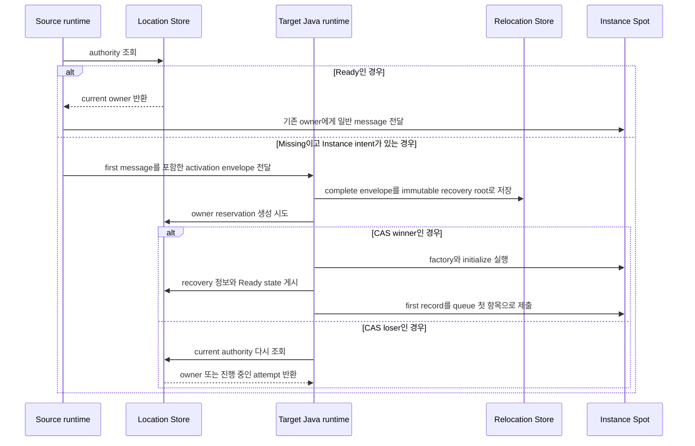

# Kotlin Spot 공개 인터페이스

Session에 bind된 Actor를 포함한 Spot relocation은 target에서 Spot·Actor state와 queue를 복원하고
owner와 membership을 commit한 뒤 message 처리를 시작한다. Target runtime은
`sessionActorLocationUpdateReqMsg`를 send하여 각 bound Actor의 route와 위치 snapshot을
갱신한다. 응답이 없어도 message 처리를 멈추지 않으며 정해진 간격으로 같은 요청을 다시
보낸다. Relocation 자체는 physical·logical disconnect가
아니므로 Actor disconnect callback을 실행하지 않는다. relocation 대상에 포함되지 않은 다른 Actor의 route와 physical connection은
변경하지 않는다.

[인터페이스 목차](README.ko.md) · [Java Spot](../../java/interfaces/spots.ko.md) ·
[Spot 공통 계약](../../../../15-spot-actor.ko.md)

Location Store가 Spot의 current owner와 lifecycle state를 확정해 보관하는 정보를 authority라 한다.
Authority가 Missing이고 caller가 Instance intent를 지정했을 때 새 Instance Spot을 준비하는 과정을
cold activation이라 한다.

SpotId는 UTF-8 encoded 크기 1..255 bytes의 `String`이며 [Location Store](../../../../01-glossary.ko.md#location-store) transaction domain 전체에서 유일한 logical ID다.
비교는 case-sensitive exact match이고 Unicode normalization과 case folding을 적용하지 않는다. 일반 [Spot](../../../../01-glossary.ko.md#spot) send/request는
SpotId만 받는다. `SpotRef(spotId, objectGeneration, meshName, nodeRid)`는 exact incarnation을 close할 때만
사용하는 immutable snapshot이다. `objectGeneration`은 `1..Long.MAX_VALUE`이고 JSON에서는 decimal string이다.
User와 [Instance Spot](../../../../01-glossary.ko.md#entry-spot-user-spot과-instance-spot) type은 UTF-8 1..255 bytes의 stable exact value다.
Java enum의 numeric value는 `ZLinkSpotKind.INVALID=0`, `ENTRY=1`, `USER=2`, `INSTANCE=3`이고
Kotlin은 ordinal을 계약 값으로 사용하지 않고 `value()`를 사용한다. Creatable kind enum은 제공하지 않는다.

`ZLinkSpotManager.create(spotType)`은 User Spot ID를 생성하고,
`getOrCreate(spotId, spotType)`은 caller가 정한 User [Spot ID](../../../../01-glossary.ko.md#spot-id)를 사용한다. Manager는 Instance Spot
create/get-or-create를 제공하지 않는다. 두 operation은 `inMesh`, `request`, `timeout`을 보존하는 Kotlin
전용 single-use wrapper를 반환한다. Terminal `await()` 또는
`yield()`를 정확히 한 번 호출한다. 중복 option과 중복 terminal, Mesh 선택, type 충돌과 deadline 규칙은
Actor operation과 같다. Entry Spot ID는
Framework가 만들며 public create 대상이 아니다.

Spot send/request는 global SpotId만 address로 받고 Kotlin 전용 Spot call wrapper를 반환한다.
`instanceSpot()`이나 `instanceSpot(stableType)`을 호출한 call만 Missing Instance Spot의 cold
activation intent를 만든다. Marker가 없으면 Missing
[authority](../../../../01-glossary.ko.md#authority)는 not-found다. Existing authority가 있으면
등록 type 수와 관계없이 저장된 stable type을 사용하므로 type을 다시 요구하지 않는다.

Missing authority에 `instanceSpot()`을 사용하면 placement가 선택한 Mesh의 serving Instance type이 distinct
value 하나일 때만 그 type을 자동 선택한다. `inMesh`를 지정하면 그 Mesh가 type 선택 범위가 되며, 두 개
이상이면 `instanceSpot(stableType)`이 필요하다. [Stable type](../../../../01-glossary.ko.md#stable-type) 인자는 Missing cold activation에만 사용하고
existing authority를 resolve하는 데는 필요하지 않다. Caller가 명시한 type과 stored type이 다르면
`TypeMismatch`다.
`inMesh`는 Missing cold activation에서 Mesh를 선택할 때만 적용하며 existing [owner](../../../../01-glossary.ko.md#owner)를
재배치하지 않는다. Wrapper가 이 fluent state를 유지한 채 `await()` 또는 `yield()`에서 Java call을
종료한다.

### Instance Spot cold activation과 첫 message

Kotlin API를 사용해도 Instance Spot 생성은 Java runtime이 다음 순서로 처리한다.

1. Source가 authority를 조회한다. Ready이면 current owner에게
   일반 message를 보낸다.
2. Authority가 Missing이고 [Instance intent](../../../../01-glossary.ko.md#instance-intent)가 있으면 source가 eligible target을 선택한다. 이어서 SpotId,
   stable type, creation intent와 first message를 activation envelope에 담아 target으로 보낸다. Source는
   placement reservation을 만들지 않는다. 이 envelope는 [Ready](../../../../01-glossary.ko.md#ready) CAS 전에도 전달할 수 있는 Framework
   infrastructure message이며 application handler에는 전달하지 않는다.
3. Target Java runtime은 metadata presence와 frame을 포함한 complete envelope를 Relocation Store에
   immutable recovery root로 먼저 저장한다.
4. 요청한 SpotId와 stable type에 일치하는 Instance가 local에 없을 때만 target이 자신을 owner로
   예약한다. Reserved [snapshot](../../../../01-glossary.ko.md#snapshot)은 어떤 예약인지 식별하는 reservation fence와 recovery root의 저장 완료를
   증명하는 receipt를 provider에서 받아 반환한다.
5. Authority reservation 경쟁에서 이긴 target(CAS winner)만 factory와 initialize를 실행하고 durable
   activation inbox의 first record를 확정한다. 경쟁에서 진 target(CAS loser)은 [factory](../../../../01-glossary.ko.md#factory)를 시작하지 않으며
   current authority를 다시 읽어 owner에게 message를 보내거나 진행 중인 attempt에 합류한다.
6. Winner는 handler 실행을 막는 barrier를 닫아 둔 상태에서 recovery root·cursor와 Ready state를
   게시한다.
7. Runtime은 first record를 local queue의 첫 항목으로 복원한 뒤 handler barrier를 연다. Source는 Ready
   뒤 같은 message를 다시 보내지 않는다. Authority와 일치하지 않는 local instance는 message를 처리하지
   못하도록 fence한다.
8. Recovery data를 추적하는 recovery pointer는 첫 handler의 terminal completion을 durable하게 기록하고
   replay cursor를 inbox sequence까지 갱신한 뒤에만 Preserve CAS로 제거한다. Queue에 제출했다는 사실만으로
   제거하지 않는다.



이 그림은 [cold activation](../../../../01-glossary.ko.md#cold-activation)을 시작하는 첫 message와
authority 경쟁만 보여 준다. Handler의 terminal completion 또는 reply와 recovery pointer 제거는 번호
목록의 후반 단계에 정의한다.

Kotlin은 Java `ZLinkSpotRelocationAdapter<TSpot>`를 그대로 구현한다. Opaque `byte[]`는 `ByteArray`로 보이고
`capture`와 `restore`는 Java 계약과 같은 `CompletionStage`를 반환한다. 별도 suspending Spot adapter,
`TState`, `stateContractId`, state class와 `ZLinkMessage` relocation surface는 제공하지 않는다. State 보존 factory는
`preserveStateWith(SpotAdapter::class.java)`를 사용하고 factory target과 adapter type은 socket bind
전에 검증한다.

State를 보존하는 whole User Spot relocation은 Spot 자체에 Spot adapter를, member Actor마다 Actor adapter를 사용한다.
State를 보존하는 Instance Spot relocation은 Spot adapter를 사용한다. Same-node operation, `disableRelocation()`과 `recreateOnRelocation()`에서는
adapter를 호출하지 않는다. Capture `ByteArray`는 최대 64 MiB이며 adapter가 completion까지 소유한다. Java
runtime은 completion에서 복사한다.
Restore는 호출마다 fresh defensive copy를 받고 completion 뒤 보관하지 않는다. Empty `ByteArray`도 유효한
보존 state다. Factory는 target attempt마다 fresh Spot instance를 만들며 source나 이전 attempt instance를
재사용하지 않는다. 같은 attempt의 restore는 반복될 수 있다. Capture exception은 source authority와 admission을
유지하고 restore exception은 target을 sealed 상태로 유지한 채 같은 target process에서 동일한 payload로 다시
시도할 수 있다. 다른 target을 자동 선택하지 않는다. Null stage와 null capture payload는 contract 위반이다. Host relocation의 precommit adapter
exception·contract violation은 [deadline](../../../../01-glossary.ko.md#deadline)이 먼저 확정되지 않았으면 `Blocked/StateIncompatible`, deadline이 먼저
확정되면 `Blocked/DeadlineExceeded`다. Stale attempt cancellation은 terminal result를 commit하지 못한다.
Callback은 at-least-once이고 stale attempt와 겹칠 수 있으므로 retry-safe해야 한다.

Spot closing reason은 Java의 `ZLinkSpotCloseReason`을 사용하며 값은 `EXPLICIT_CLOSE=0`, `HOST_SHUTDOWN=1`,
`RELOCATION_OUT=2`, `IDLE_EVICTED=3`이다. `ZLinkSpotClosingContext.deadline`은 absolute `Instant`다. Java lifecycle interface는
context만 받고 별도 Framework cancellation 타입을 사용하지 않는다. Suspending projection은 cleanup deadline에
bridge coroutine을 cancel하며 callback은 coroutine cancellation을 그대로 따른다. Actor별 closing callback은
제공하지 않는다.

## Kotlin source signature

```kotlin
interface ZLinkSuspendingSpotPacketHandler<TSpot : ZLinkSpot<*>, TMessage> {
    suspend fun handle(spot: TSpot, message: TMessage)
    suspend fun handle(
        spot: TSpot,
        message: TMessage,
        context: ZLinkMessageContext,
    )
}

interface ZLinkSuspendingSpotRequestHandler<TSpot : Any, TRequest, TReply> {
    suspend fun handle(spot: TSpot, request: TRequest): TReply
    suspend fun handle(
        spot: TSpot,
        request: TRequest,
        context: ZLinkMessageContext,
    ): TReply
}

interface ZLinkSuspendingSpotSubscriptionHandler<TSpot : Any, TEvent> {
    suspend fun handle(spot: TSpot, event: TEvent)
    suspend fun handle(
        spot: TSpot,
        event: TEvent,
        context: ZLinkPublishMessageContext,
    )
}

interface ZLinkSuspendingSpotTimerHandler<TSpot : Any> {
    suspend fun handle(spot: TSpot, tick: ZLinkTimerTick)
}

// Relocation은 logical timer와 pending tick을 Framework payload로 복원한다.

abstract class ZLinkSuspendingSpot<TActor : ZLinkActor> : ZLinkSpot<TActor> {
    abstract val context: ZLinkSpotContext
    final override fun context(): ZLinkSpotContext = context
    protected open suspend fun onCreateSuspending(
        request: ZLinkMessage,
    ): ZLinkSpotCreateResponse
    protected open suspend fun onInitializeSuspending()
    protected open suspend fun onClosingSuspending(
        context: ZLinkSpotClosingContext,
    )
    protected open suspend fun onRelocationReadyCompletedSuspending(
        completion: ZLinkSpotRelocationReadyCompletion,
    )
    protected abstract suspend fun onActorJoinSuspending(
        actorId: String,
        request: ZLinkMessage,
    ): ZLinkSpotActorJoinResult
    protected abstract suspend fun onJoinedActorSuspending(actor: TActor)
    protected abstract suspend fun onLeaveActorSuspending(actor: TActor)
    protected open suspend fun onDisconnectActorSuspending(actor: TActor)
}

abstract class ZLinkSuspendingEntrySpot<TActor : ZLinkActor> :
    ZLinkEntrySpot<TActor> {
    abstract val context: ZLinkEntrySpotContext
    final override fun context(): ZLinkEntrySpotContext = context
    protected open suspend fun onInitializeSuspending()
    protected open suspend fun onClosingSuspending(
        context: ZLinkSpotClosingContext,
    )
    protected open suspend fun onCreateActorSuspending(
        actor: TActor,
        createRequest: ZLinkMessage,
    ): ZLinkActorCreateResponse
    protected abstract suspend fun onJoinedActorSuspending(actor: TActor)
    protected abstract suspend fun onLeaveActorSuspending(actor: TActor)
    protected open suspend fun onDisconnectActorSuspending(actor: TActor)
}

abstract class ZLinkSuspendingInstanceSpot : ZLinkInstanceSpot {
    abstract val context: ZLinkInstanceSpotContext
    final override fun context(): ZLinkInstanceSpotContext = context
    protected open suspend fun onInitializeSuspending()
    protected open suspend fun onClosingSuspending(
        context: ZLinkSpotClosingContext,
    )
}

inline fun <reified THandler : Any> ZLinkSpotHandlerRegistry.addHandler()

interface ZLinkKotlinSpotSendCall {
    fun metadata(key: String, value: String): ZLinkKotlinSpotSendCall
    fun instanceSpot(): ZLinkKotlinSpotSendCall
    fun instanceSpot(stableType: String): ZLinkKotlinSpotSendCall
    fun inMesh(meshName: String): ZLinkKotlinSpotSendCall
    suspend fun await()
}

interface ZLinkKotlinSpotRequestCall<TReply> {
    fun metadata(key: String, value: String): ZLinkKotlinSpotRequestCall<TReply>
    fun instanceSpot(): ZLinkKotlinSpotRequestCall<TReply>
    fun instanceSpot(stableType: String): ZLinkKotlinSpotRequestCall<TReply>
    fun inMesh(meshName: String): ZLinkKotlinSpotRequestCall<TReply>
    fun timeout(timeout: Duration): ZLinkKotlinSpotRequestCall<TReply>
    suspend fun await(): TReply
    suspend fun yield(): TReply
}

interface ZLinkKotlinSpotCreateCall {
    fun inMesh(meshName: String): ZLinkKotlinSpotCreateCall
    fun request(request: Any): ZLinkKotlinSpotCreateCall
    fun timeout(timeout: Duration): ZLinkKotlinSpotCreateCall
    suspend fun await(): ZLinkSpotCreateResult
    suspend fun yield(): ZLinkSpotCreateResult
}

interface ZLinkKotlinSpotManager {
    fun create(spotType: String): ZLinkKotlinSpotCreateCall
    fun getOrCreate(
        spotId: String,
        spotType: String,
    ): ZLinkKotlinSpotCreateCall
}

fun ZLinkKotlinRouteClient.sendToSpot(
    spotId: String,
    message: Any,
): ZLinkKotlinSpotSendCall

inline fun <reified TReply> ZLinkKotlinRouteClient.requestToSpot(
    spotId: String,
    request: Any,
): ZLinkKotlinSpotRequestCall<TReply>
```

User·Instance Spot relocation에서는 Java runtime이 logical timer registration, 마지막 완료 tick sequence, 다음 예정
시각과 아직 실행하지 않은 pending tick을 relocation payload에 포함한다. Target은 logical timer registration을
복원하므로 application이 timer를 다시 등록하지 않는다. 현재 실행 중인 suspending timer handler만 source에서 완료하고 target
Ready 전에는 복원한 tick을 실행하지 않는다.

## Exact generated JVM signature

```java
public final class systems.zlink.framework.kotlin.ZLinkSpotHandlerRegistryExtensionsKt {
  public static final <THandler> void addHandler(systems.zlink.framework.spots.ZLinkSpotHandlerRegistry);
  public static final void addTypedHandler(systems.zlink.framework.spots.ZLinkSpotHandlerRegistry, java.lang.Class<?>);
}
public interface systems.zlink.framework.kotlin.ZLinkSuspendingSpotPacketHandler<TSpot extends systems.zlink.framework.spots.ZLinkSpot<?>, TMessage> {
  public abstract java.lang.Object handle(TSpot, TMessage, kotlin.coroutines.Continuation<? super kotlin.Unit>);
  public abstract java.lang.Object handle(TSpot, TMessage, systems.zlink.framework.messaging.ZLinkMessageContext, kotlin.coroutines.Continuation<? super kotlin.Unit>);
}
public interface systems.zlink.framework.kotlin.ZLinkSuspendingSpotRequestHandler<TSpot, TRequest, TReply> {
  public abstract java.lang.Object handle(TSpot, TRequest, kotlin.coroutines.Continuation<? super TReply>);
  public abstract java.lang.Object handle(TSpot, TRequest, systems.zlink.framework.messaging.ZLinkMessageContext, kotlin.coroutines.Continuation<? super TReply>);
}
public interface systems.zlink.framework.kotlin.ZLinkSuspendingSpotSubscriptionHandler<TSpot, TEvent> {
  public abstract java.lang.Object handle(TSpot, TEvent, kotlin.coroutines.Continuation<? super kotlin.Unit>);
  public abstract java.lang.Object handle(TSpot, TEvent, systems.zlink.framework.messaging.ZLinkPublishMessageContext, kotlin.coroutines.Continuation<? super kotlin.Unit>);
}
public interface systems.zlink.framework.kotlin.ZLinkSuspendingSpotTimerHandler<TSpot> {
  public abstract java.lang.Object handle(TSpot, systems.zlink.framework.spots.ZLinkTimerTick, kotlin.coroutines.Continuation<? super kotlin.Unit>);
}
public abstract class systems.zlink.framework.kotlin.ZLinkSuspendingEntrySpot<TActor extends systems.zlink.framework.actors.ZLinkActor> implements systems.zlink.framework.spots.ZLinkEntrySpot<TActor> {
  public systems.zlink.framework.kotlin.ZLinkSuspendingEntrySpot();
  public abstract systems.zlink.framework.spots.ZLinkEntrySpotContext getContext();
  public final systems.zlink.framework.spots.ZLinkEntrySpotContext context();
  public final java.util.concurrent.CompletionStage<java.lang.Void> onInitialize();
  public final java.util.concurrent.CompletionStage<java.lang.Void> onClosing(systems.zlink.framework.spots.ZLinkSpotClosingContext);
  public final java.util.concurrent.CompletionStage<java.lang.Void> onCreateActor(TActor, systems.zlink.framework.messaging.ZLinkMessage);
  public final java.util.concurrent.CompletionStage<java.lang.Void> onJoinedActor(TActor);
  public final java.util.concurrent.CompletionStage<java.lang.Void> onLeaveActor(TActor);
  public final java.util.concurrent.CompletionStage<java.lang.Void> onDisconnectActor(TActor);
}
public abstract class systems.zlink.framework.kotlin.ZLinkSuspendingSpot<TActor extends systems.zlink.framework.actors.ZLinkActor> implements systems.zlink.framework.spots.ZLinkSpot<TActor> {
  public systems.zlink.framework.kotlin.ZLinkSuspendingSpot();
  public abstract systems.zlink.framework.spots.ZLinkSpotContext getContext();
  public final systems.zlink.framework.spots.ZLinkSpotContext context();
  public final java.util.concurrent.CompletionStage<systems.zlink.framework.spots.ZLinkSpotCreateResponse> onCreate(systems.zlink.framework.messaging.ZLinkMessage);
  public final java.util.concurrent.CompletionStage<java.lang.Void> onInitialize();
  public final java.util.concurrent.CompletionStage<java.lang.Void> onClosing(systems.zlink.framework.spots.ZLinkSpotClosingContext);
  public final java.util.concurrent.CompletionStage<java.lang.Void> onRelocationReadyCompleted(systems.zlink.framework.spots.ZLinkSpotRelocationReadyCompletion);
  public final java.util.concurrent.CompletionStage<systems.zlink.framework.spots.ZLinkSpotActorJoinResult> onActorJoin(java.lang.String, systems.zlink.framework.messaging.ZLinkMessage);
  public final java.util.concurrent.CompletionStage<java.lang.Void> onJoinedActor(TActor);
  public final java.util.concurrent.CompletionStage<java.lang.Void> onLeaveActor(TActor);
  public final java.util.concurrent.CompletionStage<java.lang.Void> onDisconnectActor(TActor);
}
public abstract class systems.zlink.framework.kotlin.ZLinkSuspendingInstanceSpot implements systems.zlink.framework.spots.ZLinkInstanceSpot {
  public systems.zlink.framework.kotlin.ZLinkSuspendingInstanceSpot();
  public abstract systems.zlink.framework.spots.ZLinkInstanceSpotContext getContext();
  public final systems.zlink.framework.spots.ZLinkInstanceSpotContext context();
  public final java.util.concurrent.CompletionStage<java.lang.Void> onInitialize();
  public final java.util.concurrent.CompletionStage<java.lang.Void> onClosing(systems.zlink.framework.spots.ZLinkSpotClosingContext);
}
public final class systems.zlink.framework.kotlin.ZLinkFrameworkExtensionsKt {
  public static final systems.zlink.framework.kotlin.ZLinkKotlinSpotSendCall sendToSpot(systems.zlink.framework.kotlin.ZLinkKotlinRouteClient, java.lang.String, java.lang.Object);
  public static final <TReply> systems.zlink.framework.kotlin.ZLinkKotlinSpotRequestCall<TReply> requestToSpot(systems.zlink.framework.kotlin.ZLinkKotlinRouteClient, java.lang.String, java.lang.Object);
}
public interface systems.zlink.framework.kotlin.ZLinkKotlinSpotSendCall {
  public abstract systems.zlink.framework.kotlin.ZLinkKotlinSpotSendCall metadata(java.lang.String, java.lang.String);
  public abstract systems.zlink.framework.kotlin.ZLinkKotlinSpotSendCall instanceSpot();
  public abstract systems.zlink.framework.kotlin.ZLinkKotlinSpotSendCall instanceSpot(java.lang.String);
  public abstract systems.zlink.framework.kotlin.ZLinkKotlinSpotSendCall inMesh(java.lang.String);
  public abstract java.lang.Object await(kotlin.coroutines.Continuation<? super kotlin.Unit>);
}
public interface systems.zlink.framework.kotlin.ZLinkKotlinSpotRequestCall<TReply> {
  public abstract systems.zlink.framework.kotlin.ZLinkKotlinSpotRequestCall<TReply> metadata(java.lang.String, java.lang.String);
  public abstract systems.zlink.framework.kotlin.ZLinkKotlinSpotRequestCall<TReply> instanceSpot();
  public abstract systems.zlink.framework.kotlin.ZLinkKotlinSpotRequestCall<TReply> instanceSpot(java.lang.String);
  public abstract systems.zlink.framework.kotlin.ZLinkKotlinSpotRequestCall<TReply> inMesh(java.lang.String);
  public abstract systems.zlink.framework.kotlin.ZLinkKotlinSpotRequestCall<TReply> timeout-LRDsOJo(long);
  public abstract java.lang.Object await(kotlin.coroutines.Continuation<? super TReply>);
  public abstract java.lang.Object yield(kotlin.coroutines.Continuation<? super TReply>);
}
public interface systems.zlink.framework.kotlin.ZLinkKotlinSpotCreateCall {
  public abstract systems.zlink.framework.kotlin.ZLinkKotlinSpotCreateCall inMesh(java.lang.String);
  public abstract systems.zlink.framework.kotlin.ZLinkKotlinSpotCreateCall request(java.lang.Object);
  public abstract systems.zlink.framework.kotlin.ZLinkKotlinSpotCreateCall timeout-LRDsOJo(long);
  public abstract java.lang.Object await(kotlin.coroutines.Continuation<? super systems.zlink.framework.spots.ZLinkSpotCreateResult>);
  public abstract java.lang.Object yield(kotlin.coroutines.Continuation<? super systems.zlink.framework.spots.ZLinkSpotCreateResult>);
}
public interface systems.zlink.framework.kotlin.ZLinkKotlinSpotManager {
  public abstract systems.zlink.framework.kotlin.ZLinkKotlinSpotCreateCall create(java.lang.String);
  public abstract systems.zlink.framework.kotlin.ZLinkKotlinSpotCreateCall getOrCreate(java.lang.String, java.lang.String);
}
```

Kotlin suspending handler는 Java runtime과 같은 activation ownership을 사용한다. Spot
handler는 Spot activation, Actor handler는 Actor activation마다 한 번 만들며 서로 다른
Actor가 handler instance나 scoped dependency를 공유하지 않는다. Same-node Join은
Actor handler를 유지하고 cross-node Join과 relocation은 target activation에서 다시
만든다. Coroutine continuation은 handler instance 수명을 늘리거나 relocation payload에
포함하지 않는다.

Kotlin은 address DTO, process-local handle, resolver와 unbounded directory를 제공하지 않는다. Kotlin-facing
route client와 manager는 fluent option과 single-use state를 보존하는 전용 wrapper를 반환하며 Java call,
`CompletionStage`와 `Class<T>`를 application에 노출하지 않는다.
`close(SpotRef)`는 Missing이면 `false`, generation 불일치는 `InvalidOperation`, seal된 이관 구간은
`Unavailable`로 처리하며 User Spot만 대상으로 한다. Instance Spot의 self-close는 Java
`ZLinkInstanceSpotContext.close()`를 그대로 사용한다.

Maintenance target은 Actor adapter와 queue·timer를 복원하고 Location authority·membership을
commit한 뒤 Actor message 처리를 시작한다. Bound Session 위치 갱신은 그 뒤
`sessionActorLocationUpdateReqMsg`와 `sessionActorLocationUpdateResMsg` send message로
수행하며 응답이 없어도 Actor 처리를 멈추지 않는다. Infrastructure relocation은
`onJoinedActorSuspending`, `onLeaveActorSuspending` 또는 별도 relocation callback을
호출하지 않는다. User Spot application join만
`onActorJoinSuspending`과 `onJoinedActorSuspending`을 사용한다. 새 Actor의 첫 생성은
`onCreateActorSuspending`의 승인과 선택적 reply만 사용하며 join/joined callback을 호출하지 않는다.
User Spot에서 Entry Spot으로 돌아갈 때는 target의 `onJoinedActorSuspending`과 source의
`onLeaveActorSuspending`을 호출한다. `SpotWide` User Spot aggregate와 `PerActor`
User Spot의 Actor relocation에서는 member의 Entry/User Spot
[membership](../../../../01-glossary.ko.md#membership) callback을 모두 호출하지 않는다.

User Spot factory mode의 기본값은 `SPOT_WIDE`다. 이 mode에서 suspending Spot·Actor·timer·lifecycle callback은
일반 suspension 동안 User Spot gate를 유지한다. Member Actor는 Actor FIFO claim도 함께 유지한다.
Request·worker·Actor·Spot create wrapper의 `yield()`만 gate를 반환하고 terminal completion 뒤 같은 gate를
다시 얻어 coroutine continuation을 실행한다. `PER_ACTOR`에서는 Actor별 lane, Spot direct·lifecycle lane과 timer별 lane이
독립적이며 suspension은 해당 lane permit만 유지한다. 서로 다른 Actor와 서로 다른 timer는 동시에 실행할 수
있다. `SPOT_WIDE`의 Close·relocation·snapshot은 새 admission을 seal하고 모든 coroutine continuation을
포함한 active lane이 안전한 turn 경계에 도달한 all-lane barrier 뒤에만 진행한다. Barrier 실패는 같은
generation의 seal 전체를 abort하고 application admission을 정확히 복원한다.

`PER_ACTOR` User Spot은 `recreateOnRelocation()`만 허용한다. Spot adapter,
Spot field와 Spot-level application timer는 relocation 대상이 아니다. 유지해야 하는 공유 state와
schedule은 application의 Redis·database·service 같은 외부 저장소에 둔다. Framework는 target에 같은
public Spot ID와 ObjectGeneration의 stateless shell을 준비하고 Spot authority를 먼저 바꾼다. 각 Actor는
자기 current turn을 끝낸 순서대로 queue·accepted journal·Actor timer와 함께 독립적으로 이전한다.
Target shell은 authority 전에는 public lookup에 노출하지 않는다. Stale source route는 operation identity,
generation, deadline, correlation과 reply route를 보존해 relay한다. Actor queue seal부터 target
admission까지 1초는 운영 목표이며 초과해도 relocation을 취소하거나 rollback하지 않는다.

Factory configure callback에서 `relocationReadiness(...)`를 생략하면
`ANY_TURN_BOUNDARY`다. `APPLICATION_SIGNALED`은 `SPOT_WIDE`에서만 허용한다.
이 mode의 Spot turn에서는 `context.relocationReady().defer()`로 현재 turn 뒤의
경계를 등록한다. Framework는 source의 `CONTINUED` 또는 target의 `RELOCATED`
completion을 `onRelocationReadyCompletedSuspending(...)`에 전달하며 기본 구현은
no-op이다. Callback 완료 전에는 보류한 message와 timer를 실행하지 않는다.

기본 mode, `PER_ACTOR`, Entry·Instance Spot, Spot turn 밖과 같은 turn의 중복
`defer()`는 queue mutation 전에 `INVALID_OPERATION`이다. Recovery에서 callback이
다시 실행될 수 있으므로 override는 retry-safe해야 한다.

Yield는 Channel·Spot·Actor request, I/O·CPU worker와 Actor·Spot create/get-or-create에만 제공한다.
Entry Spot·Entry Actor·`PER_ACTOR`·Node·
Channel·owner context 밖에서는 coroutine suspension, operation submission, queue mutation과 gate 반환 전에
`InvalidOperation`으로 완료한다.
