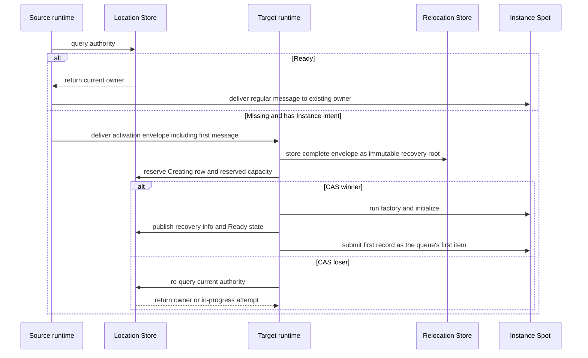

# Node.js Spot And Instance Spot Public Interface

A Spot relocation, including an Actor bound to a session, restores
Spot/Actor state and queue on the target, commits owner and membership,
and then starts message processing. The target runtime sends
`sessionActorLocationUpdateReqMsg` to update the route and location
snapshot of each bound Actor. Even without a response, message
processing doesn't stop, and the same request is resent at a fixed
interval. Since relocation itself isn't a physical/logical disconnect,
it doesn't run the Actor disconnect callback. The route and physical
connection of a different Actor not included in the relocation target
aren't changed.

[Interface table of contents](README.en.md) · [Spot Address And Messaging](../../../../16-spot-address-messaging.en.md) ·
[Spot/Actor Membership](../../../../15-spot-actor.en.md)

This document fixes the exact TypeScript declarations related to Spot
that `@zlink-systems/framework` and `@zlink-systems/nestjs` export in
ZLink Framework.

The information the Location Store holds, fixing the current owner and
lifecycle state of a [Spot](../../../../01-glossary.en.md#spot), is
called authority. The process of preparing a new Instance Spot when
authority is Missing and the caller specified Instance intent is called
cold activation.

## 1. Global Identity And Lifecycle

`SpotId` is a `string` of UTF-8 encoded size 1..255 bytes, a logical ID
unique across the whole [Location Store](../../../../01-glossary.en.md#location-store)
transaction domain. Comparison is case-sensitive exact match, with no
Unicode normalization or case folding applied. A regular message only
takes SpotId and resolves current
[authority](../../../../01-glossary.en.md#authority). `SpotRef` is the
immutable location snapshot used to close an exact incarnation.

```ts
export declare enum ZLinkSpotKind {
    Invalid = "invalid",
    Entry = "entry",
    User = "user",
    Instance = "instance"
}

export declare enum ZLinkSpotCloseReason {
    ExplicitClose = 0,
    HostShutdown = 1,
    RelocationOut = 2,
    IdleEvicted = 3
}

export interface ZLinkSpotClosingContext {
    readonly reason: ZLinkSpotCloseReason;
    readonly deadline: Date;
}

export declare enum ZLinkSpotRelocationReadyOutcome {
    Continued = 0,
    Relocated = 1
}

export interface ZLinkSpotRelocationReadyCompletion {
    readonly outcome: ZLinkSpotRelocationReadyOutcome;
}

export interface ZLinkSpotRelocationReadyCall {
    defer(): void;
}

export interface ZLinkSpotAcceptRejectResponse {
    readonly accepted: boolean;
    readonly reply?: unknown;
}

export interface ZLinkSpotActorJoinResult extends ZLinkSpotAcceptRejectResponse {}

export interface ZLinkSpotCreateResponse extends ZLinkSpotAcceptRejectResponse {}

export interface ZLinkActorCreateResponse extends ZLinkSpotAcceptRejectResponse {}

export interface ZLinkSpotActorMembershipLifecycle<TActor extends ZLinkActor = ZLinkActor> {
    onJoinedActor(actor: TActor): Promise<void>;
    onLeaveActor(actor: TActor): Promise<void>;
    onDisconnectActor?(actor: TActor): Promise<void>;
}

export interface ZLinkUserSpotActorLifecycle<TActor extends ZLinkActor = ZLinkActor>
    extends ZLinkSpotActorMembershipLifecycle<TActor> {
    onActorJoin(actorId: string, request: ZLinkMessage): Promise<ZLinkSpotActorJoinResult>;
}

export interface ZLinkSpot<TActor extends ZLinkActor = ZLinkActor>
    extends ZLinkUserSpotActorLifecycle<TActor> {
    readonly context: ZLinkSpotContext<TActor>;
    configure?(): void;
    onCreate?(request: ZLinkMessage): Promise<ZLinkSpotCreateResponse>;
    onInitialize?(): Promise<void>;
    onClosing?(
        context: ZLinkSpotClosingContext,
        cleanupSignal: AbortSignal): Promise<void>;
    onRelocationReadyCompleted?(
        completion: ZLinkSpotRelocationReadyCompletion): Promise<void>;
}

export interface ZLinkInstanceSpot {
    readonly context: ZLinkInstanceSpotContext;
    configure?(): void;
    onInitialize?(): Promise<void>;
    onClosing?(
        context: ZLinkSpotClosingContext,
        cleanupSignal: AbortSignal): Promise<void>;
}

export interface ZLinkSpotCommonContext<TSpot> {
    readonly meshName: string;
    readonly spotId: SpotId;
    readonly objectGeneration: bigint;
    readonly nodeRid: RoutingId;
    readonly outbound: ZLinkSpotOutbound;
    addTimer<THandler extends ZLinkSpotTimerHandler<TSpot>>(
        name: string,
        periodMs: number,
        handlerType: Type<THandler>,
        options?: ZLinkTimerOptions,
        signal?: AbortSignal): Promise<ZLinkTimer>;
    runCpuWorker<T>(work: (signal: AbortSignal) => T): ZLinkWorkerCall<T>;
    runIoWorker<T>(work: (signal: AbortSignal) => Promise<T>): ZLinkWorkerCall<T>;
}

export interface ZLinkSpotContext<
    TActor extends ZLinkActor = ZLinkActor,
    TSpot extends ZLinkSpot<TActor> = ZLinkSpot<TActor>>
    extends ZLinkSpotCommonContext<TSpot> {
    readonly handlers: ZLinkSpotHandlerRegistry;
    relocationReady(): ZLinkSpotRelocationReadyCall;
    leaveActor(actor: TActor, signal?: AbortSignal): Promise<void>;
    close(signal?: AbortSignal): Promise<boolean>;
}

export interface ZLinkInstanceSpotContext
    extends ZLinkSpotCommonContext<ZLinkInstanceSpot> {
    readonly handlers: ZLinkInstanceSpotHandlerRegistry;
    close(signal?: AbortSignal): Promise<boolean>;
}
```

The canonical declaration of `SpotId` and `SpotRef` is owned by
[Foundation Types And Configuration](01-foundation-configuration.en.md).
This document doesn't redeclare that type — it only fixes where it's
used in the Spot lifecycle.

`ZLinkSpotCloseReason`'s numeric values are `ExplicitClose=0`,
`HostShutdown=1`, `RelocationOut=2`, `IdleEvicted=3`. `IdleEvicted` is an
Instance-Spot-only reason and isn't delivered to Entry Spot or User
Spot. The idle judgment condition and the reactivation rule after
cleanup are owned by
[Spot Model §6.2](../../../../11-spot-model.en.md#62-cleaning-up-an-idle-instance-spot).
`deadline` is the closing operation's absolute UTC instant. The
framework doesn't abort `cleanupSignal` before the callback invocation,
and aborts it when the deadline ends. Only Entry/User/
[Instance Spot](../../../../01-glossary.en.md#entry-user-instance-spot)
receive this callback — a per-Actor closing callback isn't provided.
Host Shutdown runs the callback while Actor membership and the local
instance are valid, and cleans up scope and authority after fulfillment.
A standalone Actor relocation doesn't close the Entry Spot, so it
doesn't call this callback.

`relocationReady().defer()` is only valid on a Spot turn that
registered `SpotWide` and `ApplicationSignaled` together. The framework
delivers `Continued` from the source if it didn't move or aborted
before commit, and `Relocated` from the target if it moved, to the
optional `onRelocationReadyCompleted(...)`. If there's no callback, it
completes as a no-op. Held application messages and timers aren't run
before the callback completes.

A duplicate `defer()` on the default `AnyTurnBoundary`, on `PerActor`,
on Entry/Instance Spot, outside the Spot turn, or in the same turn fails
with `InvalidOperation` before any queue mutation. A different
Framework operation in the same turn after `defer()` is the same error.
Since the callback can run again during recovery, the implemented
callback must be retry-safe.

## 2. Handler And Outbound

```ts
export interface ZLinkSpotHandlerRegistry {
    addPacket<THandler>(handlerType: Type<THandler>): this;
    addSubscribe<THandler>(handlerType: Type<THandler>, channelName: string, topic: string): this;
}

export interface ZLinkInstanceSpotHandlerRegistry {
    addPacket<THandler>(handlerType: Type<THandler>): this;
}

export interface ZLinkSpotOutbound {
    sendToSpot(spotId: SpotId, message: unknown): ZLinkSpotSendCall;
    requestToSpot(spotId: SpotId, request: unknown): ZLinkSpotRequestCall;
    publish(channelName: string, topic: string, event: unknown): ZLinkPublishCall;
    sendToChannel(channelName: string, message: unknown): ZLinkSendCall;
    requestToChannel(channelName: string, request: unknown): ZLinkChannelRequestCall;
}

export interface ZLinkSpotSendCall {
    metadata(key: string, value: string): this;
    metadata(metadata: ZLinkMessageMetadata): this;
    instanceSpot(): this;
    instanceSpot(instanceSpotType: string): this;
    inMesh(meshName: string): this;
    submit(signal?: AbortSignal): Promise<void>;
}

export interface ZLinkSpotRequestCall {
    metadata(key: string, value: string): this;
    metadata(metadata: ZLinkMessageMetadata): this;
    instanceSpot(): this;
    instanceSpot(instanceSpotType: string): this;
    inMesh(meshName: string): this;
    timeout(timeoutMs: number): this;
    submit<TReply>(signal?: AbortSignal): Promise<TReply>;
    yield<TReply>(signal?: AbortSignal): Promise<TReply>;
}

export interface ZLinkSpotPacketHandler<TSpot, TMessage> {
    handle(spot: TSpot, message: TMessage, context: ZLinkMessageContext): Promise<void>;
}

export declare function ZLinkSpotActorRequest(packetName?: string): MethodDecorator;
export declare function ZLinkSpotActorSend(packetName?: string): MethodDecorator;

export interface ZLinkSpotActorSendHandler<TSpot, TActor extends ZLinkActor, TMessage> {
    handle(spot: TSpot, actor: TActor, context: ZLinkMessageContext, message: TMessage): Promise<void>;
}

export interface ZLinkSpotActorRequestHandler<TSpot, TActor extends ZLinkActor, TRequest, TReply> {
    handle(spot: TSpot, actor: TActor, context: ZLinkMessageContext, request: TRequest): Promise<TReply>;
}
```

The Node runtime creates each Spot packet/request/subscription/timer
handler class once per Spot activation and reuses it. An Actor send/
request handler class is created once per Actor activation and reused.
Different Actors don't share a handler instance or activation-scoped
provider. Nest provider's singleton/request/transient configuration
doesn't change this lifetime, and a handler lifetime option isn't
added.

A same-node Join keeps the Actor handler. A cross-node Join and
relocation clean up the source handler and re-create it in the target
activation. State that must be recovered isn't put in a handler field —
it's owned by the Spot or Actor.

## 3. Manager And Single-Use Create Call

```ts
export interface ZLinkSpotCreateResult {
    readonly spot: SpotRef;
    readonly state: ZLinkSpotCreateState;
    readonly reply?: unknown;
}

export declare enum ZLinkSpotCreateState {
    Existing = "existing",
    Created = "created",
    Rejected = "rejected"
}

export interface ZLinkSpotManager {
    create(spotType: string): ZLinkSpotCreateCall;
    getOrCreate(
        spotId: SpotId,
        spotType: string): ZLinkSpotGetOrCreateCall;
    find(spotId: SpotId, signal?: AbortSignal): Promise<SpotRef | undefined>;
    close(spot: SpotRef, signal?: AbortSignal): Promise<boolean>;
}

export interface ZLinkSpotCreateCall {
    inMesh(meshName: string): this;
    request(request: unknown): this;
    timeout(timeoutMs: number): this;
    submit(signal?: AbortSignal): Promise<ZLinkSpotCreateResult>;
    yield(signal?: AbortSignal): Promise<ZLinkSpotCreateResult>;
}

export interface ZLinkSpotGetOrCreateCall {
    inMesh(meshName: string): this;
    request(request: unknown): this;
    timeout(timeoutMs: number): this;
    submit(signal?: AbortSignal): Promise<ZLinkSpotCreateResult>;
    yield(signal?: AbortSignal): Promise<ZLinkSpotCreateResult>;
}
```

Entry/User/Instance SpotId is a global string key of UTF-8 encoded
size 1..255 bytes. Stable type is UTF-8 1..255 bytes, compared as a
case-sensitive exact value with no normalization. Object generation is
a positive signed-63-bit value. MeshName and NodeRid are the route
[snapshot](../../../../01-glossary.en.md#snapshot) at query time, and
aren't included in the identity key.

The Create and GetOrCreate calls are single-use. Setting the same
option twice, or calling terminal `submit(...)` twice, is
`InvalidOperation`. User Spot's `create` has the framework issue a new
global Spot ID. `getOrCreate` returns a ready Spot of the same User
kind/[stable type](../../../../01-glossary.en.md#stable-type) as
`existing`. If Creating, it waits for the authority change; once Ready,
`existing`; if it becomes Missing through cleanup, it competes for a
new reservation. If kind or type differs, `TypeMismatch`; if the
terminal state isn't reached within the
[deadline](../../../../01-glossary.en.md#deadline), `DeadlineExceeded`.

`close(spotRef)` only closes the exact incarnation. If the generation
differs, `InvalidOperation`; while moving, `Unavailable`. The framework
doesn't find the current ref again and close a different incarnation.

Manager create/get-or-create isn't provided for Instance Spot.
`sendToSpot` and `requestToSpot` only take SpotId and return a
Spot-dedicated call. A call that didn't set
[Instance intent](../../../../01-glossary.en.md#instance-intent) is
existing-only, and `NotFound` on Missing. `instanceSpot()`
auto-selects the type when the selected Mesh's serving descriptor has
one distinct Instance type, and requires the overload taking stable
type when there are multiple types. The same type registered by
multiple MeshNodes is one distinct type. `inMesh` is only used to
select the initial Mesh for Missing cold activation, and doesn't
restrict the current Mesh of an existing
[owner](../../../../01-glossary.en.md#owner).

If the selected Mesh has no Instance type, both send and request end
with `NotFound`. If there are multiple distinct types and type is
omitted, `InvalidOperation`. If a
[Ready](../../../../01-glossary.en.md#ready) Instance authority exists,
it uses the stored stable type, so the caller doesn't need to provide
the type again. If the Instance marker is used but the existing
authority is a User Spot, or the specified type differs from the
authority type, it's `TypeMismatch`.

### Instance Spot Cold Activation And The First Message

The terminal call uses an existing Instance Spot or prepares a new one
in the following order.

1. The source looks up authority. If `Ready`, it sends a regular
   message to the current owner.
2. If authority is Missing and there's Instance intent, the source
   selects an eligible target. It then puts SpotId, stable type,
   creation intent, and the first message into an activation envelope
   and sends it to the target. The source doesn't create a Store
   reservation. This envelope is a Framework infrastructure message
   that can be delivered even before `Ready`, and isn't delivered to
   the application handler.
3. The target runtime first stores the complete envelope, including
   metadata presence and frame, as an immutable recovery root in the
   Relocation Store, then confirms whether a local Instance matching
   the requested SpotId and stable type exists.
4. Only when there's no Instance does the target reserve a Creating row
   and reserved capacity with itself as owner. The reserved snapshot is
   returned with a reservation fence identifying which reservation it
   is, and a receipt proving the recovery root's storage is complete,
   both received from the provider.
5. Only the target that wins the authority reservation race (CAS
   winner) runs factory and initialize and confirms the first record of
   the durable activation inbox. A target that loses the race (CAS
   loser) doesn't start a [factory](../../../../01-glossary.en.md#factory) —
   it re-reads current authority and either sends a message to the
   owner or joins the in-progress attempt.
6. The winner publishes the recovery root/cursor, Ready state, and
   active capacity while keeping the barrier that blocks handler
   execution closed.
7. The runtime restores the first record as the first item of the local
   queue and then opens the handler barrier. The source doesn't resend
   the same message after Ready. A local instance not matching
   authority is fenced from processing the message. An existing User
   kind or a different Instance type is `TypeMismatch`.
8. The recovery pointer tracking recovery data is removed with a
   Preserve CAS only after durably recording the first handler's
   terminal completion and updating the replay cursor to the inbox
   sequence. It isn't removed merely because it was submitted to the
   queue.



This diagram only shows the first message that starts
[cold activation](../../../../01-glossary.en.md#cold-activation) and the
authority race. The handler's terminal completion or reply, and
recovery pointer removal, are defined in the later steps of the
numbered list.

A User Spot's `close(spotRef)` returns `false` if active Actor
[membership](../../../../01-glossary.en.md#membership) remains. The
framework doesn't automatically leave/destroy the Actor. A one-way Spot
message only waits until local outbound admission, and doesn't
hidden-retry an operation that failed after target queue admission to a
new owner.

An Instance Spot factory only creates an actor-free lifecycle. An
Actor handler, Actor membership, and Logical Multicast subscription
can't be registered — it only processes direct packets and timers. An
Instance Spot closes when its handler or timer calls its own context's
`close(...)`. A regular message doesn't create a new intent or directly
start a factory for a missing RID.

In the following example, `spotClient` is a `ZLinkSpotOutbound`, and
`cartId` is the global SpotId to call. Since Instance intent is
specified, the stable type and initial Mesh needed for cold activation
are only used if the Spot doesn't exist.

```ts
const reply = await spotClient
    .requestToSpot(cartId, request)
    .instanceSpot("shopping-cart") // if Missing, requests creation of an Instance Spot of this stable type.
    .inMesh("commerce")            // only restricts the Mesh selection scope for Missing cold activation.
    .timeout(5_000)
    .submit<CartReply>();           // waits for the reply the creation or the existing owner's handler returned.
```

In User/Instance Spot relocation, the framework includes, in the
relocation payload, the logical timer registration created by
`addTimer(...)`, the last completed tick sequence, the next scheduled
time, and pending ticks not yet run. The target restores the logical
timer registration, so the application doesn't re-register the timer.
Only the currently running timer handler finishes on the source, and
the restored tick isn't run before target Ready.

The public trace categories are `spot-instance`, `actor-relocation`.
The meaning and verification criteria are owned by
[Spot Address And Messaging](../../../../16-spot-address-messaging.en.md)
and [Spot/Actor Membership](../../../../15-spot-actor.en.md).

`yield(...)` declared in this document is only valid on the shared turn
of a `SpotWide` User Spot or Instance Spot. Called on an Entry Spot or
`PerActor` User Spot, it completes with `invalidConfiguration`, without
submitting the operation or returning the turn. `submit(...)` is the
common `Async` semantics that keeps the current turn.
