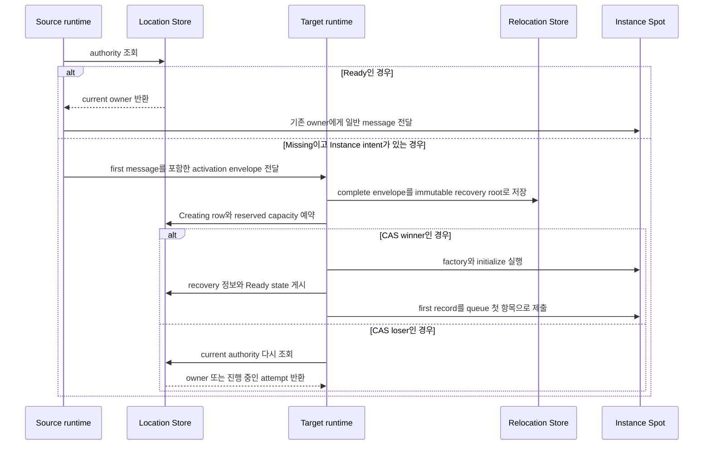

# Node.js Spot과 Instance Spot 공개 인터페이스

Session에 bind된 Actor를 포함한 Spot relocation은 target에서 Spot·Actor state와 queue를 복원하고
owner와 membership을 commit한 뒤 message 처리를 시작한다. Target runtime은
`sessionActorLocationUpdateReqMsg`를 send하여 각 bound Actor의 route와 위치 snapshot을
갱신한다. 응답이 없어도 message 처리를 멈추지 않으며 정해진 간격으로 같은 요청을 다시
보낸다. Relocation 자체는 physical·logical disconnect가
아니므로 Actor disconnect callback을 실행하지 않는다. relocation 대상에 포함되지 않은 다른 Actor의 route와 physical connection은
변경하지 않는다.

[인터페이스 목차](README.ko.md) · [Spot address와 messaging](../../../../16-spot-address-messaging.ko.md) ·
[Spot·Actor membership](../../../../15-spot-actor.ko.md)

이 문서는 ZLink Framework에서 `@zlink-systems/framework`와
`@zlink-systems/nestjs`가 내보내는 Spot 관련 정확한 TypeScript declaration을 고정한다.

Location Store가 [Spot](../../../../01-glossary.ko.md#spot)의 current owner와 lifecycle state를 확정해 보관하는 정보를 authority라 한다.
Authority가 Missing이고 caller가 Instance intent를 지정했을 때 새 Instance Spot을 준비하는 과정을
cold activation이라 한다.

## 1. Global identity와 lifecycle

`SpotId`는 UTF-8 encoded 크기 1..255 bytes의 `string`이며 [Location Store](../../../../01-glossary.ko.md#location-store) transaction domain 전체에서
유일한 logical ID다. 비교는 case-sensitive exact match이고 Unicode normalization과 case folding을 적용하지 않는다. 일반 message는 SpotId만 받고
current [authority](../../../../01-glossary.ko.md#authority)를 resolve한다. `SpotRef`는 exact incarnation을 닫을 때 사용하는 immutable location
snapshot이다.

```ts
export declare enum ZLinkSpotKind {
    Invalid = "invalid",
    Entry = "entry",
    User = "user",
    Instance = "instance"
}

export declare enum ZLinkSpotCloseReason {
    ExplicitClose = 0,
    HostShutdown = 1,
    RelocationOut = 2,
    IdleEvicted = 3
}

export interface ZLinkSpotClosingContext {
    readonly reason: ZLinkSpotCloseReason;
    readonly deadline: Date;
}

export declare enum ZLinkSpotRelocationReadyOutcome {
    Continued = 0,
    Relocated = 1
}

export interface ZLinkSpotRelocationReadyCompletion {
    readonly outcome: ZLinkSpotRelocationReadyOutcome;
}

export interface ZLinkSpotRelocationReadyCall {
    defer(): void;
}

export interface ZLinkSpotAcceptRejectResponse {
    readonly accepted: boolean;
    readonly reply?: unknown;
}

export interface ZLinkSpotActorJoinResult extends ZLinkSpotAcceptRejectResponse {}

export interface ZLinkSpotCreateResponse extends ZLinkSpotAcceptRejectResponse {}

export interface ZLinkActorCreateResponse extends ZLinkSpotAcceptRejectResponse {}

export interface ZLinkSpotActorMembershipLifecycle<TActor extends ZLinkActor = ZLinkActor> {
    onJoinedActor(actor: TActor): Promise<void>;
    onLeaveActor(actor: TActor): Promise<void>;
    onDisconnectActor?(actor: TActor): Promise<void>;
}

export interface ZLinkUserSpotActorLifecycle<TActor extends ZLinkActor = ZLinkActor>
    extends ZLinkSpotActorMembershipLifecycle<TActor> {
    onActorJoin(actorId: string, request: ZLinkMessage): Promise<ZLinkSpotActorJoinResult>;
}

export interface ZLinkSpot<TActor extends ZLinkActor = ZLinkActor>
    extends ZLinkUserSpotActorLifecycle<TActor> {
    readonly context: ZLinkSpotContext<TActor>;
    configure?(): void;
    onCreate?(request: ZLinkMessage): Promise<ZLinkSpotCreateResponse>;
    onInitialize?(): Promise<void>;
    onClosing?(
        context: ZLinkSpotClosingContext,
        cleanupSignal: AbortSignal): Promise<void>;
    onRelocationReadyCompleted?(
        completion: ZLinkSpotRelocationReadyCompletion): Promise<void>;
}

export interface ZLinkInstanceSpot {
    readonly context: ZLinkInstanceSpotContext;
    configure?(): void;
    onInitialize?(): Promise<void>;
    onClosing?(
        context: ZLinkSpotClosingContext,
        cleanupSignal: AbortSignal): Promise<void>;
}

export interface ZLinkSpotCommonContext<TSpot> {
    readonly meshName: string;
    readonly spotId: SpotId;
    readonly objectGeneration: bigint;
    readonly nodeRid: RoutingId;
    readonly outbound: ZLinkSpotOutbound;
    addTimer<THandler extends ZLinkSpotTimerHandler<TSpot>>(
        name: string,
        periodMs: number,
        handlerType: Type<THandler>,
        options?: ZLinkTimerOptions,
        signal?: AbortSignal): Promise<ZLinkTimer>;
    runCpuWorker<T>(work: (signal: AbortSignal) => T): ZLinkWorkerCall<T>;
    runIoWorker<T>(work: (signal: AbortSignal) => Promise<T>): ZLinkWorkerCall<T>;
}

export interface ZLinkSpotContext<
    TActor extends ZLinkActor = ZLinkActor,
    TSpot extends ZLinkSpot<TActor> = ZLinkSpot<TActor>>
    extends ZLinkSpotCommonContext<TSpot> {
    readonly handlers: ZLinkSpotHandlerRegistry;
    relocationReady(): ZLinkSpotRelocationReadyCall;
    leaveActor(actor: TActor, signal?: AbortSignal): Promise<void>;
    close(signal?: AbortSignal): Promise<boolean>;
}

export interface ZLinkInstanceSpotContext
    extends ZLinkSpotCommonContext<ZLinkInstanceSpot> {
    readonly handlers: ZLinkInstanceSpotHandlerRegistry;
    close(signal?: AbortSignal): Promise<boolean>;
}
```

`SpotId`와 `SpotRef`의 canonical declaration은
[기초 타입과 구성](01-foundation-configuration.ko.md)이 소유한다. 이 문서는 해당 타입을 다시 선언하지 않고
Spot lifecycle에서 사용하는 위치만 고정한다.

`ZLinkSpotCloseReason`의 numeric 값은 `ExplicitClose=0`, `HostShutdown=1`, `RelocationOut=2`,
`IdleEvicted=3`이다. `IdleEvicted`는 Instance Spot 전용 이유이며 Entry Spot과 User Spot에는 전달하지
않는다. 유휴 판정 조건과 정리 뒤 재활성화 규칙은
[Spot 모델 §6.2](../../../../11-spot-model.ko.md#62-유휴-instance-spot-정리)가 소유한다.
`deadline`은 closing operation의 absolute UTC instant다. Framework는 callback invocation 전에는
`cleanupSignal`을 abort하지 않고 deadline이 끝날 때 abort한다. Entry·User·[Instance Spot](../../../../01-glossary.ko.md#entry-spot-user-spot과-instance-spot)만 callback을 받고
Actor별 closing callback은 제공하지 않는다. Host Shutdown은 Actor membership과 local instance가 유효한
상태에서 callback을 실행하고 fulfillment 뒤 scope와 authority를 정리한다. Standalone Actor relocation은 Entry
Spot을 닫지 않으므로 이 callback을 호출하지 않는다.

`relocationReady().defer()`는 `SpotWide`와 `ApplicationSignaled`를 함께 등록한
Spot turn에서만 유효하다. Framework는 이동하지 않았거나 commit 전에 abort했으면
source에서 `Continued`, 이동했으면 target에서 `Relocated` completion을 optional
`onRelocationReadyCompleted(...)`에 전달한다. Callback이 없으면 no-op으로 완료한다.
Callback 완료 전에는 보류한 application message와 timer를 실행하지 않는다.

기본 `AnyTurnBoundary`, `PerActor`, Entry·Instance Spot, Spot turn 밖과 같은 turn의
중복 `defer()`는 queue mutation 전에 `InvalidOperation`으로 실패한다. `defer()`
뒤 같은 turn의 다른 Framework operation도 같은 오류다. Recovery에서 callback이
다시 실행될 수 있으므로 구현한 callback은 retry-safe해야 한다.

## 2. Handler와 outbound

```ts
export interface ZLinkSpotHandlerRegistry {
    addPacket<THandler>(handlerType: Type<THandler>): this;
    addSubscribe<THandler>(handlerType: Type<THandler>, channelName: string, topic: string): this;
}

export interface ZLinkInstanceSpotHandlerRegistry {
    addPacket<THandler>(handlerType: Type<THandler>): this;
}

export interface ZLinkSpotOutbound {
    sendToSpot(spotId: SpotId, message: unknown): ZLinkSpotSendCall;
    requestToSpot(spotId: SpotId, request: unknown): ZLinkSpotRequestCall;
    publish(channelName: string, topic: string, event: unknown): ZLinkPublishCall;
    sendToChannel(channelName: string, message: unknown): ZLinkSendCall;
    requestToChannel(channelName: string, request: unknown): ZLinkChannelRequestCall;
}

export interface ZLinkSpotSendCall {
    metadata(key: string, value: string): this;
    metadata(metadata: ZLinkMessageMetadata): this;
    instanceSpot(): this;
    instanceSpot(instanceSpotType: string): this;
    inMesh(meshName: string): this;
    submit(signal?: AbortSignal): Promise<void>;
}

export interface ZLinkSpotRequestCall {
    metadata(key: string, value: string): this;
    metadata(metadata: ZLinkMessageMetadata): this;
    instanceSpot(): this;
    instanceSpot(instanceSpotType: string): this;
    inMesh(meshName: string): this;
    timeout(timeoutMs: number): this;
    submit<TReply>(signal?: AbortSignal): Promise<TReply>;
    yield<TReply>(signal?: AbortSignal): Promise<TReply>;
}

export interface ZLinkSpotPacketHandler<TSpot, TMessage> {
    handle(spot: TSpot, message: TMessage, context: ZLinkMessageContext): Promise<void>;
}

export declare function ZLinkSpotActorRequest(packetName?: string): MethodDecorator;
export declare function ZLinkSpotActorSend(packetName?: string): MethodDecorator;

export interface ZLinkSpotActorSendHandler<TSpot, TActor extends ZLinkActor, TMessage> {
    handle(spot: TSpot, actor: TActor, context: ZLinkMessageContext, message: TMessage): Promise<void>;
}

export interface ZLinkSpotActorRequestHandler<TSpot, TActor extends ZLinkActor, TRequest, TReply> {
    handle(spot: TSpot, actor: TActor, context: ZLinkMessageContext, request: TRequest): Promise<TReply>;
}
```

Node runtime은 Spot packet·request·subscription·timer handler class를 Spot activation마다
한 번 만들고 재사용한다. Actor send·request handler class는 Actor activation마다 한
번 만들고 재사용한다. 서로 다른 Actor는 handler instance와 activation-scoped provider를
공유하지 않는다. Nest provider의 singleton·request·transient 설정으로 이 수명을
바꾸거나 handler lifetime option을 추가하지 않는다.

Same-node Join은 Actor handler를 유지한다. Cross-node Join과 relocation은 source
handler를 정리하고 target activation에서 다시 만든다. Handler field에 복구해야 하는
state를 두지 않으며 Spot 또는 Actor가 소유한다.

## 3. Manager와 single-use create call

```ts
export interface ZLinkSpotCreateResult {
    readonly spot: SpotRef;
    readonly state: ZLinkSpotCreateState;
    readonly reply?: unknown;
}

export declare enum ZLinkSpotCreateState {
    Existing = "existing",
    Created = "created",
    Rejected = "rejected"
}

export interface ZLinkSpotManager {
    create(spotType: string): ZLinkSpotCreateCall;
    getOrCreate(
        spotId: SpotId,
        spotType: string): ZLinkSpotGetOrCreateCall;
    find(spotId: SpotId, signal?: AbortSignal): Promise<SpotRef | undefined>;
    close(spot: SpotRef, signal?: AbortSignal): Promise<boolean>;
}

export interface ZLinkSpotCreateCall {
    inMesh(meshName: string): this;
    request(request: unknown): this;
    timeout(timeoutMs: number): this;
    submit(signal?: AbortSignal): Promise<ZLinkSpotCreateResult>;
    yield(signal?: AbortSignal): Promise<ZLinkSpotCreateResult>;
}

export interface ZLinkSpotGetOrCreateCall {
    inMesh(meshName: string): this;
    request(request: unknown): this;
    timeout(timeoutMs: number): this;
    submit(signal?: AbortSignal): Promise<ZLinkSpotCreateResult>;
    yield(signal?: AbortSignal): Promise<ZLinkSpotCreateResult>;
}
```

Entry·User·Instance SpotId는 UTF-8 encoded 크기 1..255 bytes의 global string key다. Stable type은 UTF-8 1..255 bytes이며 case-sensitive exact value로
비교하고 normalization하지 않는다. Object generation은 positive signed-63-bit 값이다. MeshName과 NodeRid는
조회 시점의 route [snapshot](../../../../01-glossary.ko.md#snapshot)이며 identity key에 포함하지 않는다.

Create와 GetOrCreate call은 single-use다. 같은 option을 두 번 설정하거나 terminal
`submit(...)`을 두 번 호출하면 `InvalidOperation`이다. User Spot `create`는 Framework가 새 global Spot ID를 발급한다.
`getOrCreate`는 같은 User kind·[stable type](../../../../01-glossary.ko.md#stable-type)의
ready Spot을 `existing`으로 반환한다. Creating이면 authority 변경을 기다리고, Ready가
되면 `existing`, cleanup으로 Missing이 되면 새 reservation을 경쟁한다. Kind나 type이 다르면
`TypeMismatch`, [deadline](../../../../01-glossary.ko.md#deadline) 안에 terminal state가 되지 않으면 `DeadlineExceeded`다.

`close(spotRef)`는 exact incarnation만 닫는다. Generation이 다르면 `InvalidOperation`, 이동 중이면
`Unavailable`이다. Framework는 current ref를 다시 찾아 다른 incarnation을 닫지 않는다.

Instance Spot에는 manager create·get-or-create를 제공하지 않는다. `sendToSpot`과 `requestToSpot`은 SpotId만
받고 Spot 전용 call을 반환한다. [Instance intent](../../../../01-glossary.ko.md#instance-intent)를 설정하지 않은 call은 existing-only이며 Missing에서
`NotFound`다. `instanceSpot()`은 선택한 Mesh의 serving descriptor에 distinct Instance type이 하나일 때
그 type을 자동 선택하고, 여러 type이면 stable type을 받는 overload를 요구한다. 같은 type을 여러 MeshNode가
등록한 것은 distinct type 하나다. `inMesh`는 Missing cold activation의 최초 Mesh를
선택할 때만 사용하고 existing [owner](../../../../01-glossary.ko.md#owner)의 current Mesh를 제한하지 않는다.

선택한 Mesh에 Instance type이 없으면 send와 request 모두 `NotFound`로 끝난다.
Distinct type이 여러 개인데 type을 생략하면 `InvalidOperation`이다. [Ready](../../../../01-glossary.ko.md#ready) Instance authority가 있으면 저장된
stable type을 사용하므로 caller가 type을 다시 제공하지 않아도 된다. Instance marker를 사용했는데 existing
authority가 User Spot이거나 명시한 type과 authority type이 다르면 `TypeMismatch`다.

### Instance Spot cold activation과 첫 message

Terminal call은 다음 순서로 기존 Instance Spot을 사용하거나 새 Instance Spot을 준비한다.

1. Source가 authority를 조회한다. `Ready`이면 current owner에게
   일반 message를 보낸다.
2. Authority가 Missing이고 Instance intent가 있으면 source가 eligible target을 선택한다. 이어서 SpotId,
   stable type, creation intent와 first message를 activation envelope에 담아 target으로 보낸다. Source는
   Store reservation을 만들지 않는다. 이 envelope는 `Ready` 전에도 전달할 수 있는 Framework
   infrastructure message이며 application handler에는 전달하지 않는다.
3. Target runtime은 metadata presence와 frame을 포함한 complete envelope를 Relocation Store에 immutable
   recovery root로 먼저 저장한 뒤, 요청한 SpotId와 stable type에 일치하는 Instance가 local에 있는지
   확인한다.
4. Instance가 없을 때만 target이 자신을 owner로 하는 Creating row와 reserved capacity를 예약한다. Reserved
   snapshot은 어떤 예약인지 식별하는 reservation fence와 recovery root의 저장 완료를 증명하는 receipt를
   provider에서 받아 반환한다.
5. Authority reservation 경쟁에서 이긴 target(CAS winner)만 factory와 initialize를 실행하고 durable
   activation inbox의 first record를 확정한다. 경쟁에서 진 target(CAS loser)은 [factory](../../../../01-glossary.ko.md#factory)를 시작하지 않으며
   current authority를 다시 읽어 owner에게 message를 보내거나 진행 중인 attempt에 합류한다.
6. Winner는 handler 실행을 막는 barrier를 닫아 둔 상태에서 recovery root·cursor, Ready state와 active
   capacity를 게시한다.
7. Runtime은 first record를 local queue의 첫 항목으로 복원한 뒤 handler barrier를 연다. Source는 Ready
   뒤 같은 message를 다시 보내지 않는다. Authority와 일치하지 않는 local instance는 message를 처리하지
   못하도록 fence한다. Existing User kind나 다른 Instance type은 `TypeMismatch`다.
8. Recovery data를 추적하는 recovery pointer는 첫 handler의 terminal completion을 durable하게 기록하고
   replay cursor를 inbox sequence까지 갱신한 뒤에만 Preserve CAS로 제거한다. Queue에 제출했다는 사실만으로
   제거하지 않는다.



이 그림은 [cold activation](../../../../01-glossary.ko.md#cold-activation)을 시작하는 첫 message와
authority 경쟁만 보여 준다. Handler의 terminal completion 또는 reply와 recovery pointer 제거는 번호
목록의 후반 단계에 정의한다.

User Spot의 `close(spotRef)`는 active Actor [membership](../../../../01-glossary.ko.md#membership)이 남아 있으면 `false`를 반환한다. Framework는 Actor를
자동으로 leave·destroy하지 않는다. One-way Spot message는 local outbound admission까지만 기다리며, target
queue admission 이후 실패한 operation을 새 owner에게 hidden retry하지 않는다.

Instance Spot factory는 actor-free lifecycle만 만든다. Actor handler, Actor membership과 Logical Multicast
subscription을 등록할 수 없으며 direct packet과 timer만 처리한다. Instance Spot은 handler나 timer가 자신의
context `close(...)`를 호출해 종료한다. 일반 message는 missing RID에 새 intent를 만들거나 factory를 직접
시작하지 않는다.

다음 예제에서 `spotClient`는 `ZLinkSpotOutbound`이고 `cartId`는 호출할 global SpotId다. Instance
intent를 명시했으므로 Spot이 없을 때만 cold activation에 필요한 stable type과 최초 Mesh를 사용한다.

```ts
const reply = await spotClient
    .requestToSpot(cartId, request)
    .instanceSpot("shopping-cart") // Missing이면 이 stable type의 Instance Spot 생성을 요청한다.
    .inMesh("commerce")            // Missing cold activation의 Mesh 선택 범위만 제한한다.
    .timeout(5_000)
    .submit<CartReply>();           // 생성 또는 기존 owner의 handler가 반환한 reply를 기다린다.
```

User·Instance Spot relocation에서는 Framework가 `addTimer(...)`로 만든 logical timer registration, 마지막 완료
tick sequence, 다음 예정 시각과 아직 실행하지 않은 pending tick을 relocation payload에 포함한다. Target은
logical timer registration을 복원하므로 application이 timer를 다시 등록하지 않는다. 현재 실행 중인 timer handler만 source에서
완료하고 target Ready 전에는 복원한 tick을 실행하지 않는다.

Public trace category는 `spot-instance`, `actor-relocation`다. 의미와 검증 기준은
[Spot address와 messaging](../../../../16-spot-address-messaging.ko.md)과
[Spot·Actor membership](../../../../15-spot-actor.ko.md)이 소유한다.

이 문서에 선언된 `yield(...)`는 `SpotWide` User Spot 또는 Instance Spot의 shared turn에서만 유효하다.
Entry Spot과 `PerActor` User Spot에서 호출하면 operation을 제출하거나 turn을 반환하지 않고
`invalidConfiguration`으로 완료한다. `submit(...)`은 현재 turn을 유지하는 공통 `Async` 의미다.
