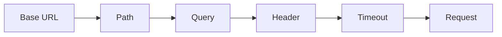

<!-- generated:start -->
<!-- 이 파일은 `common/guide/http-client/03-making-requests.ko.md`에서 생성한다. 직접 고치지 않는다.
     고칠 곳은 공통 소스이고, `python3 doc/site/scripts/generate_language_guides.py`로 다시 만든다. -->
<!-- generated:end -->

# 요청 만들기

<!-- framework-adapter-nav:start -->
[목차](README.ko.md) | [이전: 설치와 첫 요청](02-getting-started.ko.md) | [다음: 요청 본문](04-request-body.ko.md)
<!-- framework-adapter-nav:end -->

<!-- language-switch:start -->
다른 언어로 보기 — **C++** · [C#/.NET](../../../dotnet/guide/http-client/03-making-requests.ko.md) · [Java](../../../java/guide/http-client/03-making-requests.ko.md) · [Kotlin](../../../kotlin/guide/http-client/03-making-requests.ko.md) · [Node/TypeScript](../../../node/guide/http-client/03-making-requests.ko.md)
{ .zlink-langswitch }
<!-- language-switch:end -->

!!! info "이 장을 읽고 나면"

    HTTP method와 path를 고르고, query·header·요청별 timeout으로 한 요청을
    외부 API의 요구에 맞게 구성할 수 있다.

request builder는 client에서 method를 선택할 때 생기며, 종결자로 응답을 요청하기 전까지 요청의 모양을 누적한다. path는 base URL 뒤에 붙는 `/`로 시작하는 경로다.

## 1. method와 path 선택

HTTP client는 GET, POST, PUT, DELETE, PATCH, HEAD, OPTIONS의 일곱 method를 제공한다. GET은 읽기에, POST는 새 작업이나 resource 생성에 사용한다. C++에서는 keyword와 겹치는 DELETE를 `delete_`로 표기한다.

path가 `/`로 시작하지 않으면 요청을 보내지 않고 `ProtocolError`로 끝난다. base URL과 path를 한 요청 안에서 섞지 않고, 다른 base URL이 필요하면 별도 client 또는 one-shot을 사용한다.

## 2. query·header·timeout 추가

query는 name과 value를 URL-encoding하여 누적한다. header는 그 요청에만 적용되며 같은 이름의 client 기본 header보다 우선한다. 요청별 timeout은 client의 기본 timeout을 그 요청에서만 대체한다.

<!-- diagram: http-client-request-shaping -->


```cpp
--8<-- "framework/languages/cpp/tutorial/HttpClient/main.cpp:http-request-shaping"
```

## 3. 요청마다 달라지는 값

요청마다 달라지는 인증 정보, 추적 ID, query와 timeout은 request builder에 둔다. 여러 요청에서 항상 같은 header나 인증 정보는 client를 만들 때 설정한다. timeout은 한 요청을 끝내는 시간 경계이며, 재시도와 응답 상태 규칙은 [redirect·retry·cookie](09-redirect-retry-cookie.ko.md)와 [응답 처리 규칙](10-response-rules.ko.md)에서 다룬다.

## 다음 장

[요청 본문](04-request-body.ko.md)에서 JSON, form, multipart body를 붙인다.
