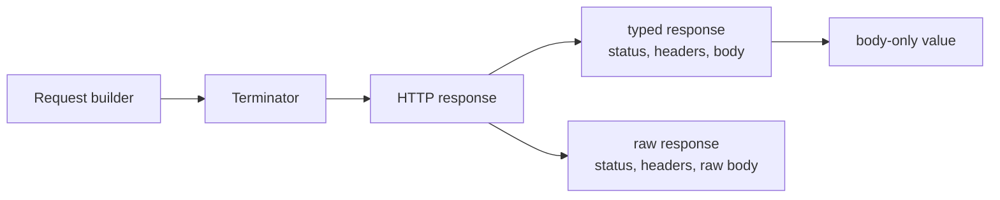

<!-- generated:start -->
<!-- 이 파일은 `common/guide/http-client/05-handling-responses.ko.md`에서 생성한다. 직접 고치지 않는다.
     고칠 곳은 공통 소스이고, `python3 doc/site/scripts/generate_language_guides.py`로 다시 만든다. -->
<!-- generated:end -->

# 응답 받기

<!-- framework-adapter-nav:start -->
[목차](README.ko.md) | [이전: 요청 본문](04-request-body.ko.md) | [다음: 인증·TLS·Proxy](06-auth-tls-proxy.ko.md)
<!-- framework-adapter-nav:end -->

<!-- language-switch:start -->
다른 언어로 보기 — **C++** · [C#/.NET](../../../dotnet/guide/http-client/05-handling-responses.ko.md) · [Java](../../../java/guide/http-client/05-handling-responses.ko.md) · [Kotlin](../../../kotlin/guide/http-client/05-handling-responses.ko.md) · [Node/TypeScript](../../../node/guide/http-client/05-handling-responses.ko.md)
{ .zlink-langswitch }
<!-- language-switch:end -->

!!! info "이 장을 읽고 나면"

    typed 응답, raw 응답, body만 받는 응답을 목적에 맞게 고를 수 있다. 이 장의 코드는 각 언어의 `HttpClient` tutorial에서 가져왔다.

HTTP client는 같은 요청 builder에서 응답을 받는 형태만 바꾼다. 기본 선택은 JSON body를 형식으로 읽는 typed 응답이며, 상태 코드와 헤더를 직접 판단해야 하면 raw 응답을 사용한다. status별 처리 규칙은 [응답 처리 규칙](10-response-rules.ko.md)에서 다룬다.

## 1. Typed 응답을 기본으로 사용한다

typed 응답은 status, header, JSON으로 읽은 body를 함께 담는 응답이다. 성공한 JSON API를 호출할 때 이 형태를 사용한다. HTTP status가 400 이상이면 typed 응답은 예외로 끝나므로 오류 body가 필요하면 raw 응답을 선택한다.

<!-- diagram: http-client-request-response -->


응답 형태는 전송한 요청을 바꾸지 않는다. 호출자가 status와 header를 보존할지, JSON body만 남길지를 정한다.

```cpp
--8<-- "framework/languages/cpp/tutorial/HttpClient/main.cpp:http-response-kinds"
```

## 2. Raw 응답으로 HTTP 정보를 읽는다

raw 응답은 status, header, 아직 JSON으로 해석하지 않은 body를 담는다. 4xx와 5xx도 전송이 성공하면 raw 응답으로 반환하므로, API의 오류 body나 상태 코드에 따라 분기할 때 사용한다.

body만 필요하면 body만 받는 종결자를 사용한다. 이 형태는 성공 JSON의 값만 호출 흐름에 남기며 status와 header는 반환하지 않는다.

!!! note "응답 형태를 먼저 고른다"

    typed 응답은 일반 JSON API에, raw 응답은 HTTP 상태와 오류 body를 직접 처리하는 경로에, body만 받는 응답은 body 외 정보가 필요 없는 성공 경로에 맞는다.

## 3. 압축 응답을 투명하게 읽는다

`compression`은 `gzip`과 `deflate`를 요청하고, 성공 응답의 body를 해제한다. 해제된 응답에서는 `content-encoding` header도 제거되므로 호출 코드는 압축되지 않은 body처럼 처리한다. 해제 후 크기도 body 제한을 넘으면 실패한다.

```cpp
--8<-- "framework/languages/cpp/tutorial/HttpClient/main.cpp:http-compressed-response"
```

## 4. 다음 장

인증 정보, 인증서, proxy 설정은 [인증·TLS·Proxy](06-auth-tls-proxy.ko.md)에서 다룬다.
