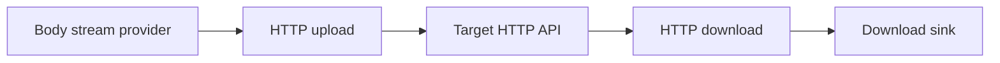

<!-- generated:start -->
<!-- 이 파일은 `common/guide/http-client/07-streaming.ko.md`에서 생성한다. 직접 고치지 않는다.
     고칠 곳은 공통 소스이고, `python3 doc/site/scripts/generate_language_guides.py`로 다시 만든다. -->
<!-- generated:end -->

# Streaming

<!-- framework-adapter-nav:start -->
[목차](README.ko.md) | [이전: 인증·TLS·Proxy](06-auth-tls-proxy.ko.md) | [다음: Client와 요청의 생애](08-client-lifecycle.ko.md)
<!-- framework-adapter-nav:end -->

<!-- language-switch:start -->
다른 언어로 보기 — **C++** · [C#/.NET](../../../dotnet/guide/http-client/07-streaming.ko.md) · [Java](../../../java/guide/http-client/07-streaming.ko.md) · [Kotlin](../../../kotlin/guide/http-client/07-streaming.ko.md) · [Node/TypeScript](../../../node/guide/http-client/07-streaming.ko.md)
{ .zlink-langswitch }
<!-- language-switch:end -->

!!! info "이 장을 읽고 나면"

    download sink로 응답 chunk를 처리하고 body stream provider로 요청 body를 보낼 수 있다. 이 장의 코드는 각 언어의 `HttpClient` tutorial에서 가져왔다.

Streaming은 큰 body를 호출자 쪽 callback 또는 provider로 옮기는 경로다. JSON body와 달리 body 전체를 직렬화하거나 누적하지 않는다. status와 압축 규칙은 [응답 처리 규칙](10-response-rules.ko.md)에서 확인한다.

<!-- diagram: http-client-streaming -->


provider와 sink는 body가 이동하는 동안 한 번씩만 소비된다. 이 특성 때문에 streaming 경로에는 재전송과 투명 압축 해제가 적용되지 않는다.

## 1. Download sink로 응답을 받는다

download sink는 수신한 body chunk마다 호출되는 callback이다. 최종 응답의 status와 header는 raw 응답으로 받으며, redirect 중간 응답 body는 sink로 전달하지 않는다.

```cpp
--8<-- "framework/languages/cpp/tutorial/HttpClient/main.cpp:http-download-stream"
```

## 2. Body stream provider로 요청을 보낸다

body stream provider는 전송할 다음 chunk를 반환하고, 언어의 빈 값으로 끝을 알린다. content type은 provider와 함께 지정한다.

```cpp
--8<-- "framework/languages/cpp/tutorial/HttpClient/main.cpp:http-upload-stream"
```

## 3. 재시도와 압축을 기대하지 않는다

download sink와 body stream provider는 한 번 소비하면 같은 body를 다시 만들 수 없다. 따라서 streaming 요청은 retry 대상이 아니며 redirect 재전송에도 사용하지 않는다. download sink에는 압축 해제가 적용되지 않아 압축된 응답의 원시 바이트를 받는다.

## 4. 다음 장

client 재사용, close 시점, 종결자와 timeout 경계는 [Client와 요청의 생애](08-client-lifecycle.ko.md)에서 다룬다.
