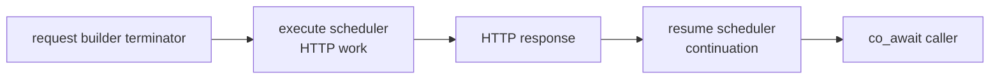

# C++ Coroutine Integration

<!-- framework-adapter-nav:start -->
[Contents](README.en.md) | [Previous: Error Handling](11-error-handling.en.md)
<!-- framework-adapter-nav:end -->

!!! info "After reading this chapter"

    You can configure the scheduler that executes HTTP work separately from the scheduler that resumes a coroutine.
    The response-shape example comes from the C++ `HttpClient` tutorial; execution placement is verified against the C++ HTTP client interface.

`task_t` represents a value that completes later, and `co_await` suspends only the current coroutine until that value is ready.
The HTTP client's asynchronous terminators return `task_t`. This chapter covers where that work runs and where
its continuation resumes. [Client and Request Lifecycle](08-client-lifecycle.en.md) covers request and response shapes.

## 1. Separate execution from resumption

<!-- diagram: http-client-cpp-coroutines -->


`async_raw`, `async<T>`, `fetch<T>`, and `download` register HTTP work with the selected execute scheduler.
When the response is ready, the caller continuation and any callback run on the resume scheduler. This separates
the worker that performs HTTP I/O from the worker that continues framework work.

A `body_stream` provider and a `download` sink run on the execute worker. Directly changing server handler state
from either callback can cross execution lanes. Send necessary work through a thread-safe queue or the server
scheduler instead.

## 2. Choose a coroutine scheduler

The `.coroutines()` setting changes only execution and resumption placement; it does not make an operation asynchronous.

| Client setting | HTTP work | Continuation and callback |
| --- | --- | --- |
| No setting | Default execute scheduler | Default resume scheduler |
| `.coroutines()` | HTTP client internal scheduler | Same internal scheduler |
| `.coroutines(resume)` | HTTP client internal scheduler | Supplied resume scheduler |
| `.coroutines(execute, resume)` | Supplied execute scheduler | Supplied resume scheduler |

Use `framework_resume_scheduler_t` as the resume scheduler when execution must return to a framework lane.
The adapter posts the continuation to the framework queue, so an HTTP worker does not execute framework state directly.
Passing a `nullptr` scheduler fails client creation or the request with `invalid_operation`.

## 3. Receive a response with an asynchronous terminator

Typed, raw, body-only, and download responses are all asynchronous operations. The following tutorial shows the
response shapes in the currently distributed package.

```cpp title="framework/languages/cpp/tutorial/HttpClient/main.cpp"
--8<-- "framework/languages/cpp/tutorial/HttpClient/main.cpp:http-response-kinds"
```

!!! note "0.19.0 API transition"

    This tutorial uses the 0.18.x package names and blocking calls. In 0.19.0, typed, raw, and body-only response terminators combine with `co_await` as asynchronous operations.

Use `co_await` to wait for a `task_t` in runtime code. Although `fetch<T>` returns the body directly, it is an
asynchronous operation and does not keep the current worker waiting.

## 4. Keep blocking terminators in CLI code

`submit_raw` and `submit<T>` wait on the calling thread and return `result_t`. They are for a CLI and client
scenario where occupying that thread is acceptable. In a framework runtime execution context, they fail immediately
with `invalid_operation`.

Waiting for a blocking result in an HTTP callback or coroutine can prevent the execute worker from starting the next
HTTP operation. Runtime code combines an asynchronous terminator with `co_await`.

## 5. Next chapters

- Client defaults and the complete execution model — [Client and Request Lifecycle](08-client-lifecycle.en.md)
- Error kinds and retry decisions — [Error Handling](11-error-handling.en.md)
