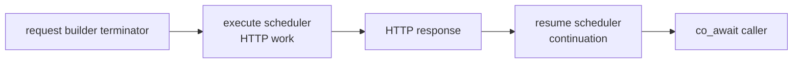

# C++ 코루틴 통합

<!-- framework-adapter-nav:start -->
[목차](README.ko.md) | [이전: 오류 처리](11-error-handling.ko.md)
<!-- framework-adapter-nav:end -->

!!! info "이 장을 읽고 나면"

    HTTP 작업을 실행할 scheduler와 coroutine을 재개할 scheduler를 구분해 설정할 수 있다.
    응답 형태 예제는 C++ `HttpClient` tutorial에서, 실행 위치의 설명은 HTTP client의 C++ 공개 인터페이스에서 확인했다.

`task_t`는 나중에 완료될 값을 나타내고 `co_await`는 그 값이 준비될 때까지 현재 coroutine만 중단한다.
HTTP client의 비동기 종결자는 `task_t`를 반환한다. 이 장은 그 작업이 실행되는 위치와
continuation이 다시 시작되는 위치를 다룬다. 요청과 응답의 종류는 [Client와 요청의 생애](08-client-lifecycle.ko.md)에서 다룬다.

## 1. 작업 실행과 재개를 구분한다

<!-- diagram: http-client-cpp-coroutines -->


`async_raw`·`async<T>`·`fetch<T>`·`download`는 선택된 execute scheduler에 HTTP 작업을 등록한다.
응답이 준비되면 caller의 continuation과 callback은 resume scheduler에서 다시 실행된다. 따라서
HTTP I/O를 수행하는 worker와 framework 작업을 계속할 worker를 분리할 수 있다.

`body_stream` provider와 `download` sink는 execute worker에서 호출된다. 이 callback에서 server
handler 상태를 직접 변경하면 실행 줄이 달라질 수 있다. 필요한 작업은 thread-safe queue나 server
scheduler를 통해 넘긴다.

## 2. Coroutine scheduler를 고른다

`.coroutines()` 설정은 비동기 여부를 바꾸지 않고 execute와 resume 위치만 정한다.

| Client 설정 | HTTP 작업 | Continuation과 callback |
| --- | --- | --- |
| 설정 없음 | 기본 execute scheduler | 기본 resume scheduler |
| `.coroutines()` | HTTP client 내부 scheduler | 같은 내부 scheduler |
| `.coroutines(resume)` | HTTP client 내부 scheduler | 지정한 resume scheduler |
| `.coroutines(execute, resume)` | 지정한 execute scheduler | 지정한 resume scheduler |

framework 실행 줄에 복귀해야 하면 `framework_resume_scheduler_t`를 resume scheduler로 사용한다.
이 adapter는 framework queue에 continuation을 게시하므로, HTTP worker가 framework 상태를 직접 실행하지 않는다.
`nullptr` scheduler를 전달하면 client 생성 또는 요청이 `invalid_operation`으로 실패한다.

## 3. 비동기 종결자로 응답을 받는다

typed 응답, raw 응답, body만 받는 응답, download는 모두 비동기 작업이다. 다음 tutorial은 현재 배포 패키지의
응답 형태를 함께 보인다.

```cpp title="framework/languages/cpp/tutorial/HttpClient/main.cpp"
--8<-- "framework/languages/cpp/tutorial/HttpClient/main.cpp:http-response-kinds"
```

!!! note "0.19.0 API 전환"

    위 tutorial은 0.18.x 패키지의 이름과 blocking 호출을 사용한다. 0.19.0에서는 typed·raw·body 응답을 받는 비동기 종결자와 `co_await` 조합으로 전환한다.

`task_t`를 runtime에서 기다릴 때는 `co_await`를 사용한다. `fetch<T>`도 body를 직접 돌려주지만
비동기 작업이므로 현재 worker를 기다리게 하지 않는다.

## 4. Blocking 종결자는 CLI에만 둔다

`submit_raw`와 `submit<T>`는 호출 thread에서 완료될 때까지 기다리고 `result_t`를 반환한다. 이 경로는
CLI와 client scenario처럼 호출 thread를 점유해도 되는 곳만을 위한 것이다. framework runtime 실행 문맥에서
호출하면 `invalid_operation`으로 즉시 실패한다.

HTTP callback 또는 coroutine 안에서 blocking 결과를 기다리면 execute worker가 다음 HTTP 작업을 시작하지 못할 수 있다.
runtime code에서는 비동기 종결자와 `co_await`를 결합한다.

## 5. 다음 장

- client 기본값과 실행 모델 전체 — [Client와 요청의 생애](08-client-lifecycle.ko.md)
- 오류 kind와 재시도 판단 — [오류 처리](11-error-handling.ko.md)
