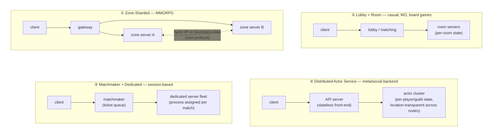
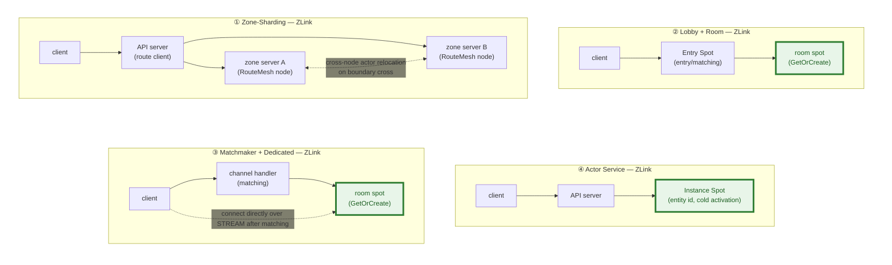
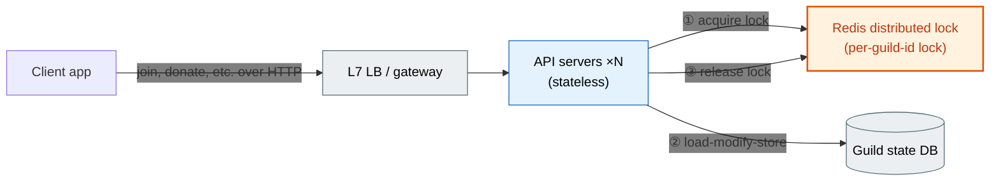
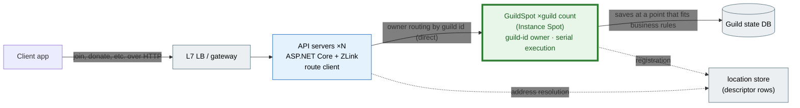
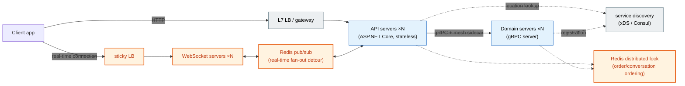
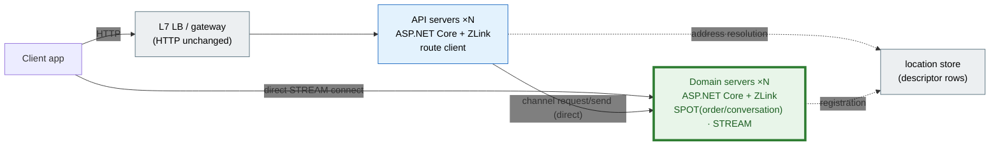
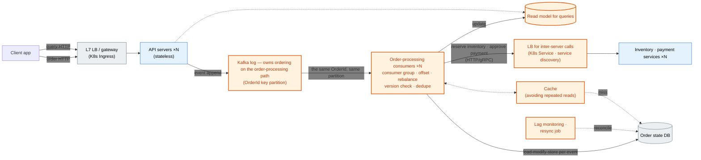
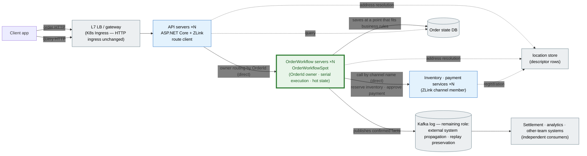
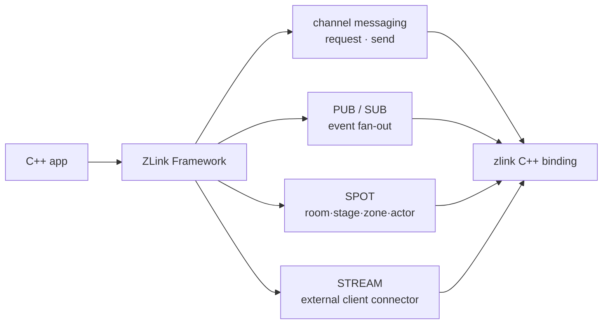
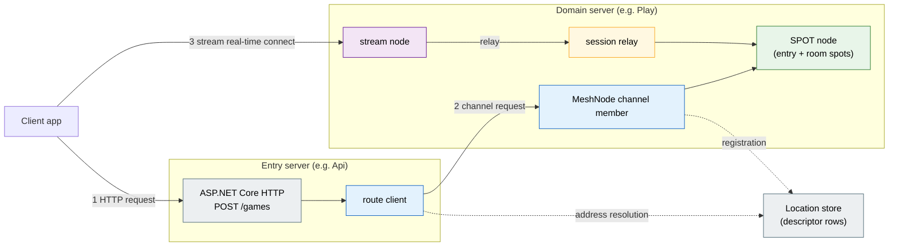

<!-- generated:start -->
<!-- This file is generated from `common/guide/server/01-overview.en.md`. Do not edit directly.
     Edit the common source instead, then regenerate with `python3 doc/site/scripts/generate_language_guides.py`. -->
<!-- generated:end -->

<!-- framework-adapter-nav:start -->
[Guide Home](README.en.md) | [Next: 2. Getting Started](02-getting-started.en.md)
<!-- framework-adapter-nav:end -->

<!-- language-switch:start -->
View in another language — [C#/.NET](../../../dotnet/guide/server/01-overview.en.md) · **C++** · [Java](../../../java/guide/server/01-overview.en.md) · [Kotlin](../../../kotlin/guide/server/01-overview.en.md) · [Node/TypeScript](../../../node/guide/server/01-overview.en.md)
<!-- language-switch:end -->

# 1. Overview

> **The documents that own this chapter's contract** — owned by the
> [Framework Overview](../../../common/spec/02-overview.ko.md) and the
> [per-language public contract index](../../../common/spec/server/languages/README.ko.md).

> This document is the entry point of the `C++` guide. The guide explains the concepts
> and usage of ZLink Framework directly so a C++ developer can **read it and start
> writing code right away.** The **language-neutral formal definition** of a concept is
> owned by the [common spec
> overview](../../../common/spec/02-overview.ko.md), and the **formal contract** of the
> `C++` public API is owned by the
> [C++ exact interface index](../../../common/spec/server/languages/cpp/interfaces/README.ko.md)
> document. If the two disagree, the spec wins.

## 1. One-Line Definition

`ZLink Framework` is a **real-time messaging framework.** In other languages it sits as a
layer on `ASP.NET Core` or Spring Boot, but **C++ has no such standard application
framework.** So the C++ framework also provides DI, configuration, and HTTP hosting, and
composes the process itself. Instead of dropping into a model you already have, it gives
you that model too.

This layer provides inter-server calls, pub/sub, and real-time state units. Inter-server
calls and pub/sub find their target purely by a logical `channel name`, with **no separate
gateway or dedicated load balancer.** The real-time state units are `SPOT` (room · stage ·
zone), an actor (a stateful object representing one connection/user), and `STREAM` (an
external client connection) — if these terms are unfamiliar, see the concept walkthrough in
[03-concepts](03-concepts.ko.md) first. A developer writes a **handler, client, and filter**
with the same feel as using HTTP/gRPC, and the framework handles connection, location lookup,
routing, reconnect, and correlation.

> **ZLink is a framework used under the same contract across several languages.** The same
> layer sits identically on Spring (Java/Kotlin) and NestJS (Node) too, and because the call
> contract is a language-neutral wire protocol (ZMP) + codec + logical channel/packet,
> services implemented in different languages call each other over the same channel (e.g., a
> room server in C++, an API server in .NET/Java). This guide is `.NET`-based and treats the
> `.NET` implementation as the reference implementation. The detailed cross-language model is
> covered by [17-alternative §2.1](17-alternative.ko.md).

## 2. Situations Where You Need It

### Building A Real-Time Game Server

**What makes it hard.** Game servers have no standardized framework like the web's
`ASP.NET Core`/Spring. This isn't an accident — there's a reason.

- **The network topology each genre needs is different.** Any web service is shaped the same
  way — "client request → server response" — which is why a framework could standardize
  around it. Games aren't. A board game needs room-based matching and turn progression, an
  MORPG needs a split between room/stage servers and matching/lobby, an MMORPG needs a
  zone/field server mesh and large-scale broadcast, an FPS needs a low-latency tick loop for
  a small session. **Genre decides the topology, so there's no one fixed shape**, and every
  team re-builds its own topology on top of raw sockets.
- **State stays in memory.** The web can put state in a DB and scale out statelessly, but a
  game keeps room/participant state **in-memory** for fast processing and runs its logic
  across multiple threads. That's the moment locks, contention, deadlocks, and the
  synchronization question "which thread is touching this room" seep into business logic.
- **The connection itself is something to manage.** Users keep long-lived connections. You
  handle socket framing and session lifetime directly, have to reconnect a user to whichever
  server and room they were in, and have to keep connected users and in-progress game state
  alive during a deployment or scale-down.

So up to now there were two choices — build all of this yourself, or **move to a separate
runtime**, a game server engine, and relearn how you write logic, configure, deploy, and
operate, on the engine's terms.

**How it's actually been built.** Grouped by the names the industry commonly uses, it's
roughly four patterns. Boxes like login/auth, gateway, and DB cache show up repeatedly no
matter which pattern — but since there's no common framework backing them, a team picks its
genre's pattern and rebuilds that structure from the socket up.



- **① Zone-sharding.** The world is split into geographic regions, one server (node) owns
  each region, and when a character crosses a boundary the simulation hands off to the
  adjacent region's server. This is the representative scaling approach for an MMORPG
  handling a large open world. Sharding (replicating the whole world and splitting players
  across copies) and instancing (spinning up several independent copies of the same region)
  are also common world-distribution approaches used together to handle a large number of
  concurrent players.
- **② Lobby + room.** Users are received in the lobby/matching stage and assigned to a room,
  which owns participant state until that match ends. A room is usually a logical unit, with
  several running together inside one process. Common in casual, mobile MO, and board games.
- **③ Session-based dedicated fleet.** Once matching tickets accumulate, the fleet assigns
  one dedicated server process for that match, and the client connects directly to that
  server. The process is returned once the match ends. Unlike ②, **one match = one process**
  is the base unit. The standard configuration for session-based games like competitive FPS
  and battle royale.
- **④ Stateful actor.** Entity state, like a player or guild, is kept as an actor in server
  memory, and the DB only serves as periodic storage. It reduces read-heavy load and removes
  the need for a separate caching layer, so it's commonly used for meta/social backends. The
  representative frameworks are Orleans and Akka. **One conceptual difference** — Akka's
  actor isn't one user, it's a general-purpose concurrency unit used anywhere, and ZLink
  splits this into Spot (an execution-isolation unit) and Actor (a domain entity). What's
  closer to Orleans's virtual actor/grain isn't ZLink's Actor — it's the **Instance Spot**
  this approach uses. The detailed comparison is covered in
  [Chapter 17 §6](17-alternative.ko.md).

**What ZLink provides.** A feature answers each difficulty, one by one.

| Difficulty | ZLink feature | Details |
| --- | --- | --- |
| Building a genre's topology from raw sockets | **Declare topology by combining channels** — 1:N request/response, fan-out, a node-addressed route mesh, a room-scoped spot mesh, all composed in a few lines of registration; the location store keeps connections up automatically | [§3 Architecture](#아키텍처--계층-구조와-등록-지점) · [05](05-channel-messaging.ko.md)·[06](06-spot.ko.md)·[10](10-location.ko.md) |
| Locks/contention on in-memory state | **SPOT serial execution** — every message for one room lines up on a single execution line and runs in order. Locks disappear from business logic | The code below · [06](06-spot.ko.md) |
| Implementing socket framing/session lifetime directly | **STREAM** — the framework owns connection lifetime, framing, and packet codec (TCP/TLS/WS/WSS) | [09](09-stream.ko.md) |
| Tracking a reconnected user's location | **Actor binding** — a new connection after reconnect picks up the same actor | [08](08-actor-session.ko.md) |
| Users dropped during deployment | **Graceful drain** — blocks new admission, hands off actors, finishes in-progress work, then shuts down. 0 lines of app code | [12](12-operations.ko.md) |

And the **four patterns above all become combinations on the same declarative model.**
There's no need to rebuild from the socket for each one.

- **① Zone-sharding** — set up a zone with `add_route_mesh` + a node-addressed route mesh. A
  player crossing a boundary is handed off by **cross-node actor relocation**
  ([07](07-actor-spot.ko.md)) instead. [ZoneWorld](../../../common/sample/zoneworld/README.en.md)
  is exactly this approach.
- **② Lobby + room** — entry/matching is the Entry Spot, and a room is a room spot created
  with `get_or_create`. [Bingo](../../../common/sample/bingo/README.en.md) is exactly this
  approach.
- **③ Matchmaker + dedicated** — matching is implemented as a channel handler (HTTP, etc.).
  **Instead of spinning up a new process per match**, the client connects over STREAM to the
  room spot that was `get_or_create`d as the matching result.
  [TicTacToe](../../../common/sample/tictactoe/README.en.md) is closest to this flow —
  matching request → room/connection info response → connect to the already-prepared room
  spot.
- **④ Actor service** — an **Instance Spot** is cold-activated by entity ID, processing an
  entity's state — one several users touch at the same time — serially, with no Redis
  distributed lock. Continued in the
  [guild service example](#하나의-엔티티에-대한-동시-접근).

Where the "existing approaches" diagram above split into four, here's how each approach
assembles with ZLink, in the same spots.



Green (bold border) is the SPOT-family primitive. This is exactly where it contrasts with
the "existing approaches" diagram above — each approach used to need its own infrastructure
(a dedicated fleet orchestrator, sticky routing, an actor cluster), but in ZLink, all four
are implemented with the same RouteMesh/Spot/Instance Spot combination. Switching approaches
means no new runtime to learn.

> A Twitch-scale FPS's **ultra-low-latency snapshot netcode** uses unreliable transport that
> tolerates loss. STREAM currently provides TCP/TLS/WS/WSS as transport, and **unreliable
> transport (QUIC datagram/WebTransport) is planned.** Even for that kind of game, though,
> matching/lobby/meta/social are handled just fine today by these four approaches. Exactly
> where the line falls is covered in [Chapter 17](17-alternative.ko.md) §4.

**How is this different from a game server engine or service?** The path that avoids
building it yourself includes engines and managed services. Laying out what each provides,
by area, makes ZLink's spot clear.

| Area provided | Representative product | Form provided |
| --- | --- | --- |
| Connection/transport optimization — socket/session management, encryption/compression, TCP/UDP in parallel, splitting network I/O from logic threads | [ProudNet](https://docs.proudnet.com/proudnet.eng) | Dedicated server module + client SDK |
| Room/lobby/matching — creating/finding a room, lobby, match invites | [Photon](https://www.photonengine.com/)·[SmartFoxServer](https://docs2x.smartfoxserver.com/Overview/zones-room-architecture) | A room model on its own runtime |
| Hosting/fleet — dedicated server allocation, autoscaling, a matchmaking rules engine (FlexMatch) | [AWS GameLift](https://aws.amazon.com/gamelift/servers/)·Agones | A cloud-managed service |
| Social/meta features — friends, leaderboards, groups, chat | [Nakama](https://heroiclabs.com/nakama-gamelift/) | A backend server product |

ZLink provides **connections/sessions (STREAM), rooms/state units (SPOT), inter-server
messaging (channel), participant state (actor), and zero-downtime termination (drain)** among
these — but not as a dedicated runtime or managed service, as a **library layer on the major
framework you already use.**

- **Hosting/fleet isn't ZLink's job.** Whether K8s or GameLift, a ZLink server just runs on
  top of it — it doesn't compete with a hosting service, it composes with one.
- **Matchmaking rules and social features are app logic, not product features.** You write
  them directly with a channel handler and spot. There's less pre-built for you, but the
  ownership and freedom over the logic stays with the app.

And all of this stays inside the framework you already use — the opposite direction from
bringing in a new engine and moving to a separate ecosystem.

```text
+-----------------------------------------------------------+
|  ASP.NET Core / Spring / NestJS                           |
|  DI, config, logging, deployment unchanged                |
+-----------------------------------------------------------+
|  ZLink Framework                                          |
|  SPOT · actor · STREAM · drain                            |
+-----------------------------------------------------------+
```

**As code.** Declare one room, and write that room's progression logic.

```cpp
// Registration — one room mesh and a room type
auto node = options.add_route_mesh ("game.room");
node.listen ("tcp://0.0.0.0:9001");
node.channel_name ("game.room").server ();  // A mesh has at least 1 logical membership
node.add_spot_factory<bingo_room_spot_t> (
  "room",
  [] (spot_context_t context) { return std::make_shared<bingo_room_spot_t> (std::move (context)); },
  [] (auto &factory) { factory.recreate_on_relocation (); });
```

```cpp
// Bingo room progression code — no concurrency exists inside this.
// A C++ Spot handler is a Spot member function. The Spot arrives as `this`.
task_t<mark_result_t> bingo_room_spot_t::mark_number (const mark_number_t &request)
{
    _board.mark (request.number);           // No lock
    _last_activity = std::chrono::system_clock::now ();
    co_return mark_result_t{_board.has_bingo ()};
}
```

Several players send requests at the same time and a timer runs in this room, yet there's no
`lock`, no `Interlocked`, no Redis distributed lock. That's because the framework lines up
every message for one room (requests, subscription events, timer ticks, actor packets) on
**a single execution line and runs them in order.** Here, "serial" isn't codec serialization
— it's **serialization of execution order** ([06 §3](06-spot.ko.md)).

Runnable reference samples: [TicTacToe](../../../common/sample/tictactoe/README.en.md) ·
[Bingo](../../../common/sample/bingo/README.en.md) · [GameQuest](../../../common/sample/event/gamequest.en.md)

### Concurrent Access To One Entity

**Why it's hard.** There are cases, like a guild, where **several different users need to
modify the same entity at the same time.** Just like two users applying to join at the same
time can exceed the roster cap, or two donations landing at once can lose one of them,
several stateless API servers touching the same row at the same time creates a race
condition.

- **Concurrent modifications collide.** If several API instances read-modify-write the same
  guild row at the same time, a lost update happens.
- **You have to assemble your own serialization mechanism.** A Redis distributed lock or DB
  row lock has to build a per-guild critical section.
- **The lock itself is a new failure mode.** Lock acquisition failure, timeout, deadlock, and
  a stale write after lock expiry all land on the app to handle.

**What ZLink provides.** Instead of assembling a lock, it turns that entity into a serial
execution unit.

| What you used to assemble | ZLink feature | Details |
| --- | --- | --- |
| A Redis distributed lock per guild id | **Instance Spot** — one spot, cold-activated by guild id, processes every request for that guild serially | [06](06-spot.ko.md) |
| Lock acquire/release/timeout handling | **Serial execution** — the lock concept disappears entirely; everything is always processed in spot queue order | [06 §3](06-spot.ko.md) |
| Inter-server calls/LB to find the guild spot | **channel name + location store** | [05](05-channel-messaging.ko.md)·[10](10-location.ko.md) |
| Pre-provisioning a new guild | Cold-activated on the spot when the first request arrives — no separate preparation needed | |

**The existing approach** — lock acquire/release makes a round trip on every request.



**The ZLink approach** — the lock disappears, and the guild id itself becomes the spot
address the request will arrive at.



A request for the same guild always passes through the same GuildSpot's queue, so the second
request is only processed once the first finishes — it's not that another request is blocked
for as long as the lock is held; two requests simply can never touch the same state at the
same time in the first place.

**As code.** Where lock acquire/release used to sit, one call remains.

```cpp
// Applying to join a guild — request directly by guild id. No prior lock, no prior creation.
co_await spots.request_to_spot (guild_id, join_guild_req_t{user_id})
  .instance_spot ("guild")
  .in_mesh ("social")
  .submit<join_guild_res_t> ();
```

There's no runnable reference sample for this scenario yet — the code above applies the same
API surface as GameQuest's `PlayerQuestSpot` registration/call approach to a guild.

### Adding Real-Time Features To An Existing Web Service

**Why complexity goes up.** The standard shape of a large web service — Spring/`ASP.NET
Core` + Redis (cache) + Kafka (events) + LB/K8s — is optimized for **stateless
request/response.** The moment you add a real-time feature like chat, notifications, or
order tracking, these assumptions stop fitting one by one, and complexity rises.

- **The connection becomes state.** An HTTP request can land on any instance, but a
  WebSocket connection is pinned to one specific instance. That's how you end up with a
  sticky LB that pins connections, and the app starts managing "which instance is this user
  connected to right now" in Redis.
  - **Real-time delivery between servers has to take a detour.** Since connections are
  scattered across instances, server-to-server delivery routes through a broker (Redis
  pub/sub, or even Kafka when you don't actually need replay) — one more piece of
  infrastructure to operate.
- **Order-sensitive units appear.** For an order or a conversation, the order events are
  processed in is correctness itself. Since several instances could touch the same order at
  the same time, you serialize with a distributed lock.

One feature bolted on, and you've grown a whole assembly kit — a WebSocket server, sticky
LB, broker detour, distributed lock — plus the operational burden of running it.

**What ZLink provides.** A feature answers each piece of the kit.

| What you used to assemble | ZLink feature | Details |
| --- | --- | --- |
| A WebSocket server + sticky LB | **STREAM** — the app server receives client connections directly | [09](09-stream.ko.md) |
| A distributed lock for ordering | **SPOT owner routing** — the same order/conversation always executes serially in its own one Spot | [06](06-spot.ko.md) |
| Real-time delivery through a broker | **channel/fanout** — inter-server delivery and fan-out go through transport directly | [05](05-channel-messaging.ko.md) |
| Managing "who's connected where" | **Actor binding + location store** — the framework owns reconnect portability and location lookup | [08](08-actor-session.ko.md)·[10](10-location.ko.md) |

Drawing the same system — a web API + real-time features (chat/order tracking) — both ways
shows the difference right in the picture.

**The existing approach** — the components for the real-time feature (orange) add up to as
much as the main body.



**The ZLink approach** — every orange piece disappears, leaving one location store that
provides node/actor/spot location information.



Sticky LB, WebSocket server, pub/sub detour, distributed lock, mesh/discovery — five pieces
shrink down to **one location store.** Inter-server calls and real-time delivery all connect
directly, runtime to runtime.

**This doesn't replace your existing stack.** Kafka stays exactly where it is, as a durable
event stream, and Redis stays as cache/persistence support, in both pictures (which is why
they're left out of the diagram). What ZLink cuts is the **complexity of connection,
routing, and state management** you used to assemble by hand in between, for real-time
delivery.

**As code.** Where the distributed lock and sticky routing used to sit, the following code
remains.

```cpp
// Inside an HTTP handler — route an order event to that order's workflow Spot.
// The first request cold-activates the spot keyed on order_id, and later requests arrive
// at the same already-created spot, always processed serially in one place (no distributed lock).
co_await spots.request_to_spot (request.order_id, request)  // request is already a start_order_workflow_req_t body.
  .instance_spot ("order-workflow")
  .in_mesh ("commerce")
  .submit<start_order_workflow_res_t> ();

// Inside an actor handler — push to a client that's still tied to the same actor after reconnect (no sticky LB).
co_await actor.context ().bound_session ().send (order_status_changed_t{order_id, status}).submit ();
```

Runnable reference samples: [SupportChat](../../../common/sample/supportchat/README.en.md) ·
[DeliveryDispatch](../../../common/sample/deliverydispatch/README.en.md)

### Simplifying Event-Driven Business Processing

Where ZLink applies isn't limited to real-time features. Business processes like order
handling, settlement, and inventory — where **the same entity's events must be processed in
order, without duplication** — run into the same complexity problem even with zero real-time
push on screen.

**Why it gets complicated.** The standard answer for this kind of work is a log-based
pipeline like Kafka (an event-sourcing setup is usually built on top of this too). But what
the log actually solves is "gather the same key in one place, in order," and a whole train
of pieces follows just to get that one thing.

- **Order is tied to a partition.** To process the same order's events in order, you have to
  gather them by key partition, consumer count is tied to partition count, and consumer
  group rebalance and offset management follow as operational items.
- **Consumers are stateless, so state means a DB round trip every time.** Processing one
  event means reading, modifying, and writing current state in the DB every time. Adding a
  cache to cut repeated reads brings an invalidation problem along with it.
- **At-least-once delivery pushes idempotency onto the app.** Redelivery, rebalance, and
  reprocessing can bring the same event twice, so without a version check or a dedupe
  policy, it gets applied twice.
- You build a separate read model to query the processing result, and once the pipeline
  falls behind, lag monitoring and a resync job stay as leftover work.

Keeping state next to the consumer with a stateful stream processor (Kafka Streams/Flink)
cuts the DB round trips, but partition design, state-store recovery, and rebalance remain
your operational responsibility — the detailed comparison is covered by
[GameQuest common scenario §3](../../../common/sample/event/gamequest.en.md).

Drawing the same business process — an order workflow — both ways shows the difference in
pieces right in the picture.

**The existing approach** — the pipeline pieces for ordered processing (orange) add up to as
much as the main body.



**The ZLink approach** — this doesn't replace Kafka. **On the order-processing path**, the
pipeline pieces (orange) disappear, and Kafka stays in its natural role (gray) — propagating
confirmed facts to independent systems and preserving events that need replay, as a durable
log.



The key thing across the two pictures is that Kafka's color changes. Kafka (orange), which
used to own ordering **inside** the processing path, moves **outside** the processing path
and only handles propagation/preservation (gray). And with that, the pieces assembled just
for ordering — the order-processing consumer group (offset/rebalance/dedupe), the cache, the
read model for queries, the resync job — disappear. Since the same `OrderId` is always
processed serially by the same owner, there's no longer a need to assemble the ordering and
duplicate-prevention a pipeline used to provide.

**The inter-server-call LB disappears too.** Order processing calls other services like
inventory and payment synchronously, and the existing approach has to find and distribute to
the peer on every one of those paths via a K8s Service or service discovery (you can't
hardcode the address in code). In ZLink, you call by **channel name**, like `"inventory"`,
**and the location store tells you the currently available peer**, so there's no separate LB
layer needed for inter-server calls — that's why the orange "LB for inter-server calls" is
gone in the after picture.

**What stays, stays.** Client HTTP ingress is still stateless, so an L7 LB/Ingress
distributes to API servers as usual (gray), and order state is still stored in the DB.
Unlike gRPC, this HTTP ingress path also doesn't **additionally** require an L7 distribution
device (the reason is covered in [Chapter 17 §5.1](17-alternative.ko.md)).

**What ZLink provides.** Solving "gather the same key in one place, in order" with **owner
routing** instead of a log means most of the pieces above simply never need to be assembled.

| What you used to assemble | ZLink feature | Details |
| --- | --- | --- |
| Key partition + consumer group | **SPOT owner routing** — the same `OrderId` always executes serially on the same Spot. Whichever API instance receives it, it's routed to the same owner | [06](06-spot.ko.md) |
| DB load-modify-store per event | **The owner spot's hot state** — state lives in the owner's memory, and the app decides when to persist based on business rules | [06](06-spot.ko.md) |
| Version check/distributed lock against redelivery | **Serial execution** — no concurrent writer for the same unit, so there's no lock/version contention on the normal path | [06 §3](06-spot.ko.md) |
| LB/service discovery for inter-server calls | **channel name + location store** — call by the name `"inventory"` and it sends directly to a currently available peer | [05](05-channel-messaging.ko.md)·[10](10-location.ko.md) |
| Operating offset/lag/resync jobs | With no consumption pipeline, that operational item doesn't exist at all | |

**The boundary stays where it is.** Where a durable log is genuinely needed — event replay,
long-term retention, broad fan-out to independent systems — Kafka is the right fit and stays
exactly there ([Chapter 17 §4](17-alternative.ko.md)). What ZLink cuts is the case where a
log pipeline was assembled **only** for entity-scoped ordered processing. If order and
consistency were the entire goal, owner routing achieves that goal directly, with no
pipeline.

**As code.** Where the partition consumer used to sit, an owner Spot handler comes instead.

```cpp
// Processing for the same order_id always executes serially inside this Spot —
// no partition, no offset, no distributed lock, no idempotency retry policy to assemble.
// A C++ Spot handler is a Spot member function.
task_t<start_order_workflow_res_t>
order_workflow_spot_t::start_order_workflow (const start_order_workflow_req_t &request)
{
    co_return co_await start_workflow (request);   // Accesses spot state without a lock
}
```

Runnable reference sample: [ShoppingMall](../../../common/sample/event/shoppingmall.en.md) —
the reference sample for this exact situation, built with no real-time push at all, just an
HTTP API + order workflow. It verifies order state transitions, compensation flow, duplicate
prevention, and projection rebuild, all on top of owner routing.

The three situations differ only in entry point — the surface you use is the same. Products
exist that provide one feature each — gRPC for RPC, Orleans for actors, a game engine for
connections — but ZLink's spot is the **combination that bundles major-framework
integration + serial-execution state units + auto-connect topology into one.**

## 3. Surface And Structure

### The Call Unit — MeshName And ChannelName

An inter-server call in ZLink Framework picks its target by **`MeshName` and
`ChannelName`.** In the application, you use it like "send a request over the `orders`
channel in the `services` mesh." Which node handles that channel is decided by the framework,
which checks the membership registered in the location store.

The framework handles what you'd otherwise have written by hand to build one server.

| What you used to build yourself | How the framework handles it |
| --- | --- |
| Opening an endpoint, managing peer connections | Declare a MeshNode and STREAM node, and the hosted service connects them |
| Message serialization/deserialization | Codec registration and the handler contract exchange DTOs directly |
| Request routing/dispatch | Registering a typed handler on a `ChannelName` delivers the message to the right handler |
| Repeating common processing like logging/validation/authorization | An HTTP route uses middleware; a ZLink handler separates this into a handler filter |
| Protecting state under concurrent requests | SPOT's serial execution manages state with no lock |
| Creating services, managing dependencies | The framework's DI container creates the handler, client, and filter |
| Managing server addresses, deciding connections | Tracks the currently active endpoint through the location store |
| Configuration, logging, monitoring | The framework's built-in config/logging/hosted service |

### The Felt Difficulty Versus The Existing Approach

The difference in the amount of code needed to wire up the same "inter-server
request/response."

**Directly with raw bindings (conceptual):**

```cpp
// Location-store lookup, connecting the endpoint, reconnect management,
// correlation id matching, serialization, receive loop ... dozens of lines of connection/setup code
```

**ZLink Framework:**

```cpp
// Server: one handler
class get_price_handler_t
{
  public:
    using request_type = price_request_t;
    using reply_type = price_reply_t;

    reply_type handle (const price_request_t &request)
    {
        return price_reply_t{request.symbol, 187.42};   // 187.42 is a fixed demo value (a real lookup result in practice)
    }
};

// Registration — declares the MeshNode endpoint and the price membership's handler together.
app.add_zlink_framework ([] (zlink_framework_options_t &options) {
    options.add_route_mesh ("services")                 // Scopes the communication range by MeshName.
      .listen ("tcp://0.0.0.0:7301")                    // Opens this MeshNode's endpoint.
      .set_routing_id (routing_id_t::from ("price-1"))
      .channel_name ("price")                           // Registers the price-handling membership.
      .server ()
      .add_request_handler<get_price_handler_t, price_request_t, price_reply_t> ();
});

// Client: inject the route client and call by ChannelName.
auto reply = co_await client
  .request_to_channel (
    "price",                                            // The ChannelName to look up process-locally
    price_request_t{"AAPL"})
  .submit<price_reply_t> ();                            // Sends, then waits for the reply asynchronously.
```

The connection/setup code disappears, leaving a handler and a few lines of channel
registration.

### Architecture — Layering And Registration Points

```text
+-----------------------------------------------------------+
|  C++ application                                          |
|  DI, configuration, logging, hosted services              |
+-----------------------------------------------------------+
|  ZLink Framework for C++ (includes DI/config/HTTP)         |
|  RouteMesh, SPOT, actor, STREAM, location, monitoring     |
+-----------------------------------------------------------+
|  bindings/cpp (backend adapter)                           |
|  raw DEALER/ROUTER/PUB/SUB/STREAM socket API               |
+-----------------------------------------------------------+
|  Core (C API, native)                                      |
+-----------------------------------------------------------+
```

The code the application writes lives in the top two layers. The Framework exposes its own
functionality through the **DI · hosted service · handler · attribute** model, and the
bottom two layers (`bindings/dotnet`, the Core C API) are used only as a backend hidden
behind the framework — never directly exposed on the public API, and application code
doesn't change even if they're replaced later. This backend boundary and data flow are
explained separately by
[internals/backend-dependency-policy](../../internals/backend-dependency-policy.ko.md).

The point where the application meets this stack is **one registration spot.** This is where
you declare the MeshNode, fanout, and STREAM node.

```cpp
app.add_zlink_framework ([] (zlink_framework_options_t &options) {
    options.add_location_store (std::make_shared<redis_location_store_t> (...));  // Provides node/actor/spot location info — connections between nodes are automatic on top of this

    options.add_route_mesh ("services")                     // MeshNode for inter-server request/send
      .listen ("tcp://0.0.0.0:7301")
      .set_routing_id (routing_id_t::from ("service-a"))
      .channel_name ("orders").server ();                   // The logical membership to handle
    options.add_fanout_channel ("events")
      .enable_publisher ("tcp://0.0.0.0:7302");             // classic event fan-out
    options.add_route_mesh ("game.room")                    // SPOT/actor are also owned by a MeshNode
      .listen ("tcp://0.0.0.0:7304")
      .set_routing_id (routing_id_t::from ("room-a"))
      .channel_name ("game.room").server ();
    options.add_stream_node ("gateway")
      .bind ("tcp://0.0.0.0:7400");                         // The external client endpoint
});
```

Topologies you used to assemble separately with gRPC+LB, a broker, and a WebSocket server all
collapse down to **one declarative model.** Once the location store is registered,
connections auto-connect and auto-clean-up as servers scale up or down — nothing to edit in
a config file, no LB to reconfigure.
([05](05-channel-messaging.ko.md)·[06](06-spot.ko.md)·[09](09-stream.ko.md)·[10](10-location.ko.md))

What you declare, and where, comes down to three spots.

| Surface | Role | Chapter that covers it |
| --- | --- | --- |
| `builder.Services.AddZLinkFramework(...)` | Declare channel/SPOT/STREAM | [Chapter 5](05-channel-messaging.ko.md)~[Chapter 9](09-stream.ko.md) |
| `options.AddRouteMesh(...)` / `add_fanout_channel(...)` | Declare RouteMesh/fanout | [Chapter 5](05-channel-messaging.ko.md) |
| `IZLink*Runtime` status | Status observation and diagnostics | [Chapter 11](11-monitoring.ko.md) |

Every option settable at each surface, with its default, is collected in
[16-options](16-options.ko.md).

## 4. The Four Integration Axes, Summarized



| Axis | What the user sees | Guide chapter |
| --- | --- | --- |
| channel messaging | Request handler, send handler, `request_client_t`, handler filter | [05-channel-messaging](05-channel-messaging.ko.md) |
| fanout | `add_fanout_channel`, fanout handler | [05-channel-messaging](05-channel-messaging.ko.md) |
| SPOT | Typed spot factory, Spot context outbound, timer | [06-spot](06-spot.ko.md) |
| actor / session | Actor factory, Entry Spot, `bound_session_t`, session actor dispatch | [07-actor-spot](07-actor-spot.ko.md) · [08-actor-session](08-actor-session.ko.md) |
| STREAM | Framework session packet, Stream Connector | [09-stream](09-stream.ko.md) |
| Infrastructure | Location-based auto-connect/operational queries, runtime monitoring | [10-location](10-location.ko.md), [11-monitoring](11-monitoring.ko.md) |
| Operations | Runtime metrics (one registration line), graceful drain, readiness probe | [12-operations](12-operations.ko.md) |

## 5. The Overall Topology

An example showing how each feature fits together. Each feature's own chapter zooms into
part of this map.



- **Entry server** — receives an external request over ASP.NET Core HTTP and delegates to
  the domain server.
- **Domain server** — MeshNode channel membership + SPOT (state unit) + session relay +
  stream node.
- **Location store** — manages server address information. The dotted lines are connections
  that find an endpoint through a store lookup.
- **Client app** — sends requests over HTTP, and receives real-time state over stream.

## 6. Who This Guide Is For, And Its Scope

This guide focuses on when to reach for channel, handler, SPOT, STREAM, and the location
store, rather than the runtime's internal structure.

The main readers are:

- **A backend API developer**: someone sending a request to another internal service from
  inside an HTTP endpoint, or looking to replace an existing gRPC call with a logical
  `channel name`-based request/response.
- **A microservices operations developer**: someone who wants server instances to scale up
  and down while auto-connecting through the current server list the location store
  manages, without hardcoding addresses in code.
- **A real-time service developer**: someone who wants to bundle a stateful unit — a game
  room, stage, zone, or an order workflow — into a SPOT, and process packets arriving at the
  same state in one execution flow.
- **A gateway/connector developer**: someone who wants to receive an external client over
  STREAM — TCP, TLS, WebSocket — and hand internal processing off to a channel or an actor.
- **A tech lead or reviewer**: someone judging whether a problem is worth adopting ZLink
  for, and checking which responsibilities ZLink should own versus which should stay with
  the DB, broker, or domain service.

To see ZLink's use concretely, as a business flow, look at the
[common samples](../../../common/sample/README.en.md). See the real-time game server shape
in [TicTacToe](../../../common/sample/tictactoe/README.en.md) and
[Bingo](../../../common/sample/bingo/README.en.md).
[ShoppingMall](../../../common/sample/event/shoppingmall.en.md),
[DeliveryDispatch](../../../common/sample/deliverydispatch/README.en.md),
[GameQuest](../../../common/sample/event/gamequest.en.md), and
[SupportChat](../../../common/sample/supportchat/README.en.md) are end-to-end samples that
go all the way to the business domain — order workflow, assignment/status tracking, game
progress, support/chat.

**What this layer doesn't do is also clear.** ZLink Framework isn't a layer that exposes a
transport implementation to the application

code. An application developer uses the public feature set through the DI, hosted
service, handler, and location store model. Anyone reviewing the formal public API
contract should also read the
[spec/interfaces index](../../../common/spec/server/languages/cpp/interfaces/README.ko.md);
anyone changing the runtime's internal structure should also read
[internals/](../../internals/backend-dependency-policy.ko.md).

## 7. Naming Convention

The guide uses the following notation consistently throughout.

- C++ framework public types and functions live in the `zlink::framework` namespace.
- Type names use the `_t` suffix. e.g. `spot_context_t`, `message_context_t`.
- The facade header is `#include <zlink/framework.hpp>`; the CMake target is
  `zlink::framework`.
- A client-side HTTP request is owned not by the framework but by the separate
  `zlink::http_client` deliverable.
- The underlying zlink core C API is `zlink_*` snake_case.

## 8. Guide Reading Order

- [02-getting-started](02-getting-started.ko.md) — From install to your first working check
- [03-concepts](03-concepts.ko.md) — Core concepts (channel, roles, DI)
- [05-channel-messaging](05-channel-messaging.ko.md) — request/send/pub-sub in detail
- [06-spot](06-spot.ko.md) — room/stage/zone, timer, routed Spot calls
- [07-actor-spot](07-actor-spot.ko.md) — Actor lifecycle, Spot hosting/callbacks
- [08-actor-session](08-actor-session.ko.md) — session↔actor binding/dispatch, client push
- [09-stream](09-stream.ko.md) — The external-client (STREAM) server + Stream Connector
- [10-location](10-location.ko.md) — Location-store-based auto-connect and operational queries
- [11-monitoring](11-monitoring.ko.md) — Status observation and diagnostics
- [13-interface-catalog](13-interface-catalog.ko.md) — The key public surface as code
- [14-samples](14-samples.ko.md) — Checking it against runnable samples
- [16-options](16-options.ko.md) — The option list and defaults, what changes when
- [17-alternative](17-alternative.ko.md) — **Where ZLink fits**
- [18-di-container](18-di-container.ko.md) — The DI container
- [19-configuration](19-configuration.ko.md) — Configuration binding
- [20-http-hosting](20-http-hosting.ko.md) — An HTTP endpoint inside the process
- [21-execution-model](21-execution-model.ko.md) — The coroutine execution model
- [Common samples](../../../common/sample/README.en.md) — Representative business scenarios and verification criteria
- [C++ exact interface index](../../../common/spec/server/languages/cpp/interfaces/README.ko.md) — The formal contract
