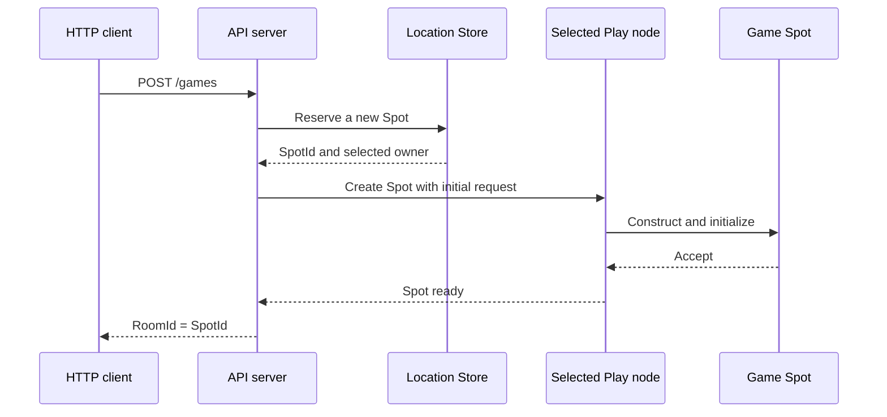

<!-- generated:start -->
<!-- This file is generated from `common/guide/server/02-getting-started.en.md`. Do not edit directly.
     Edit the common source instead, then regenerate with `python3 doc/site/scripts/generate_language_guides.py`. -->
<!-- generated:end -->

<!-- framework-adapter-nav:start -->
[Guide Home](README.en.md) | [Previous: 1. Overview](01-overview.en.md) | [Next: 3. Core Concepts](03-concepts.en.md)
<!-- framework-adapter-nav:end -->

<!-- language-switch:start -->
View in another language — [C#/.NET](../../../dotnet/guide/server/02-getting-started.en.md) · **C++** · [Java](../../../java/guide/server/02-getting-started.en.md) · [Kotlin](../../../kotlin/guide/server/02-getting-started.en.md) · [Node/TypeScript](../../../node/guide/server/02-getting-started.en.md)
<!-- language-switch:end -->

# 2. Getting Started

> **The document that owns this chapter's contract** — none. This is a walkthrough for
> installing and confirming your first working setup.

> First install the package and run a minimal example of two processes calling each
> other (§1-§2), then follow the actual
> [TicTacToe sample](../../../../../languages/cpp/samples/TicTacToe) through the flow of
> creating one room (§3-§11).

## 1. Installation

Get it via a vcpkg manifest or CMake `find_package`. The minimal combination needed to
build one server is:

```cmake
find_package(zlink CONFIG REQUIRED)
target_link_libraries(my_server PRIVATE zlink::framework)
```

Targets to add when you need them:

| Target | When to add it |
| --- | --- |
| `zlink::framework_locations_redis` | When using the Redis location store for auto-connect ([10-location](10-location.ko.md)) |
| `zlink::framework_codec_protobuf` · `_msgpack` | To use instead of the default JSON codec ([05-channel-messaging §7](05-channel-messaging.ko.md#7-직렬화-codec)) |
| stream connector | When building an external client (a game client, mobile) ([09-stream](09-stream.ko.md)) |
| `zlink::http_client` | When the server calls out over HTTP ([HTTP Client guide](../http-client/README.ko.md)) |

It uses C++20 coroutines, so a compiler that supports at least that is required.

The license differs by layer — core/binding is MPL-2.0, framework is FSL-1.1-ALv2, and
`zlink::http_client` is Apache-2.0. There's no cost to building and selling a service
([17-alternative §7](17-alternative.ko.md#7-라이선스--쓰는-데-드는-비용)).

## 2. A Minimal Example — Two Processes Calling Each Other

With no location store and no Redis, try one request/reply over a manual connection where
you write the endpoint directly. This is the point where you confirm "installation is
done."

**The shared contract.** Both processes reference the same record.

```cpp
struct hello_t { std::string name; };
struct greeting_t { std::string text; };
```

**The server process.** Owns the `greeting` channel and registers a handler.

```cpp
int main (int argc, char **argv)
{
    auto app = zlink::framework::app_t::create ();
    app.add_zlink_framework ([] (zlink_framework_options_t &options) {
        auto mesh = options.add_route_mesh ("services")     // Names the mesh.
          .listen ("tcp://0.0.0.0:7101");                   // Its own endpoint for other processes to connect to.
        mesh.channel_name ("greeting").server ()            // This process handles "greeting".
          .add_request_handler<hello_handler_t, hello_t, greeting_t> ();
    });
    return app.run (argc, argv);
}

// A handler that processes one request.
class hello_handler_t
{
  public:
    using request_type = hello_t;
    using reply_type = greeting_t;

    greeting_t handle (const hello_t &request)
    {
        return greeting_t{"hello, " + request.name};
    }
};
```

**The client process.** Joins the same mesh and calls `greeting`.

```cpp
app.add_zlink_framework ([] (zlink_framework_options_t &options) {
    auto mesh = options.add_route_mesh ("services")
      .listen ("tcp://0.0.0.0:7102");                       // It also needs its own endpoint.
    mesh.channel_name ("greeting").client ();               // The call-only side is client.
    mesh.peer_connections ().connect ("tcp://127.0.0.1:7101"); // Manual connection — write the server endpoint directly.

    options.http ()
      .listen ("http://0.0.0.0:5000")
      .map_get<hello_http_handler_t> ("/hello/{name}");
});

// The target is just one ChannelName. Which node handles it isn't specified.
task_t<std::string> hello_http_handler_t::handle (const std::string &name)
{
    auto reply = co_await _route.request_to_channel ("greeting", hello_t{name})
                   .submit<greeting_t> ();
    co_return reply.text;
}
```

Start the server first, then the client, and call `curl http://localhost:5000/hello/world`
— it returns `hello, world`.

Three things are confirmed here — the package is wired up, the two processes are connected
through the mesh, and the call was routed by logical name (`greeting`) alone. This example
has no Redis and no location store. For the calling code to stay the same as servers scale
up and down, you need auto-connect, which is covered by
[10-location](10-location.ko.md).

## 3. TicTacToe — The Flow Of Creating One Room

From here on, we move to an actual sample. The API server doesn't pick a specific Play node
— it only passes the room's stable type and its initial settings. The Framework selects one
of the Object Servers that registered that type, and issues a globally unique `SpotId`.

### 3.1 Execution Flow



The API code never carries the Play node's `NodeRid` or endpoint. The same creation code is
used even as Play nodes are added or replaced.

### 3.2 Sample Locations

| What to check | File |
| --- | --- |
| Full run | `samples/TicTacToe/run_sample.sh` |
| API entry point | `samples/TicTacToe/Server/Api/main.cpp` |
| Play entry point | `samples/TicTacToe/Server/Play/main.cpp` |
| HTTP handler | `samples/TicTacToe/Server/Api/Handlers/create_game_http_handler.hpp` |
| Game Spot | `samples/TicTacToe/Server/Play/Infrastructure/ZLink/Spots/TicTacToeGameSpot/tictactoe_game_spot.hpp` |
| Shared messages | `samples/TicTacToe/Shared/Contracts/messages.hpp` |

The table's relative paths are rooted at `framework/languages/cpp`.

## 4. API Server Configuration

The API server registers a Location Store and an Object Client role. The Object Client role
is used to create or call an Actor and Spot on another Object Server.

```cpp
app.add_zlink_framework ([&] (zlink_framework_options_t &options) {
    // Registers a shared Store so every process queries the same location information.
    options.add_location_store (
      std::make_shared<redis_location_store_t> (settings.redis_endpoint,
                                                settings.redis_key_prefix));

    auto mesh = options.add_route_mesh (sample_nodes_t::mesh)
      .listen (settings.mesh_endpoint)
      .set_routing_id (routing_id_t::from ("tictactoe-api-1"));

    // The API process doesn't hold any Object — it only initiates remote Object calls.
    mesh.objects ().client ();
});
```

The sample reads the peer endpoint from a config file for reproducible local runs. This
endpoint only sets up the connection — it doesn't specify which Play node the new Game Spot
gets placed on.

## 5. Creating A Spot From An HTTP Request

The HTTP handler uses the spot manager it received through DI.

```cpp
// The HTTP handler uses the spot manager it received through DI.
task_t<create_game_http_res_t>
create_game_http_handler_t::handle (const create_game_http_req_t &request)
{
    const auto game_name = request.game_name.empty ()
                             ? std::string (sample_defaults_t::game_name)
                             : request.game_name;

    auto created = co_await _spots
      .create (sample_types_t::game_spot)     // A node that provides this stable type becomes a candidate.
      .in_mesh (sample_nodes_t::mesh)         // Selects the RouteMesh to create the Object on.
      .creation_request (tictactoe_game_create_req_t{
        game_name, sample_defaults_t::required_level})  // The initial settings passed to the new Spot's on_create.
      .submit ();

    co_return create_game_http_res_t{
      created.spot.spot_id (),                // Uses the Framework-issued SpotId as the room id.
      _settings.play_endpoints,
      _settings.play_nodes,
      game_name,
      sample_defaults_t::required_level};
}
```

Use `create` for creating a new User Spot where the caller doesn't decide the `SpotId`. To
look up or create the same `SpotId` again, use `GetOrCreate(spotId, spotType)`.

## 6. Registering A Stable Type On The Play Server

The Framework only uses a Serving Object Server that registered the requested stable type as
a creation candidate. The Play server registers the `TicTacToeGame` factory as follows.

```cpp
auto mesh = options.add_route_mesh (sample_nodes_t::mesh)
  .listen (settings.mesh_endpoint)
  .set_routing_id (routing_id_t::from ("tictactoe-play-1"));

mesh.add_spot_factory<tictactoe_game_t> (
  sample_types_t::game_spot,          // The same stable type the API passed to create.
  [] (spot_context_t context) { return std::make_shared<tictactoe_game_t> (std::move (context)); },
  [] (auto &factory) { factory.disable_relocation (); });
```

There's no sample contract for preferring a specific Play node or placing by `NodeRid`. The
Framework and Location Store decide the placement candidate and capacity.

## 7. Validating The Initial Settings

The selected Play node creates the Spot, then hands the initial request to `on_create`. The
Spot validates the settings and returns whether it accepts creation.

```cpp
task_t<spot_create_response_t> tictactoe_game_t::on_create (const message_t &request)
{
    const auto settings = request.decode<tictactoe_game_create_req_t> ();

    if (settings.game_name.empty ())
        co_return spot_create_response_t::reject ("GameName is required.");

    _game_name = settings.game_name;
    _required_level = settings.required_level;

    // Only after accept is this Spot published as Ready in the Location Store.
    co_return spot_create_response_t::accept ();
}
```

If creation is rejected, that reservation is never published as a Ready Spot. The caller
receives the completion result as a typed failure.

## 8. What The ClientServer Channel Is For

TicTacToe's `tictactoe.api` ClientServer channel is used when a Play session requests user
authentication from the API server. It isn't used for Game Spot creation.

```cpp
// API process: handles the authentication request.
options.add_client_server_channel (sample_channels_t::api)
  .server ()
  .listen ()
  .add_request_handler<authenticate_player_handler_t,
                       authenticate_player_req_t,
                       authenticate_player_res_t> ();

// Play process: sends the authentication request.
options.add_client_server_channel (sample_channels_t::api)
  .client ();
```

Object creation and a ClientServer call are different features. No dedicated
room-creation channel or `CreateGameHandler` is added.

## 9. Building And Running

```cmake
# Build the sample first.
cmake --build framework/languages/cpp/build --target sample_cpp_framework_tictactoe_api

# Prepares Redis and 4 processes, and verifies the whole scenario.
framework/languages/cpp/samples/TicTacToe/run_sample.sh
```

The runner runs 2 APIs and 2 Plays. After creating a Game Spot, it verifies that
participants connected to different Play endpoints join the same room, and verifies game
messages and end-of-game cleanup.

## 10. What To Check When It Fails

| Symptom | What to check |
| --- | --- |
| No creation candidate | Check whether the Play process registered an Object Server and the `GameSpot` stable type on the same `MeshName`. |
| Startup fails | Check the Redis connection, `MeshName`, listen endpoint, and any duplicate-registration error. |
| Creation is rejected | Check the initial settings `on_create` received and the reject reason. |
| The client can't join the room | Check whether the HTTP response's `RoomId` was passed to the Actor join request as-is. |

The next chapters each explain the role of the channel, Spot, Actor, Stream, and Location
Store used here.

---
