<!-- generated:start -->
<!-- This file is generated from `common/guide/server/04-backpressure.en.md`. Do not edit directly.
     Edit the common source instead, then regenerate with `python3 doc/site/scripts/generate_language_guides.py`. -->
<!-- generated:end -->

<!-- framework-adapter-nav:start -->
[Guide Home](README.en.md) | [Previous: 3. Core Concepts](03-concepts.en.md) | [Next: 5. Channel Messaging — request · send · pub/sub](05-channel-messaging.en.md)
<!-- framework-adapter-nav:end -->

<!-- language-switch:start -->
View in another language — [C#/.NET](../../../dotnet/guide/server/04-backpressure.en.md) · **C++** · [Java](../../../java/guide/server/04-backpressure.en.md) · [Kotlin](../../../kotlin/guide/server/04-backpressure.en.md) · [Node/TypeScript](../../../node/guide/server/04-backpressure.en.md)
<!-- language-switch:end -->

# 4. Backpressure — When Arrival Outpaces Processing

> **The documents that own this chapter's contract** — covered by the
> [Async Execution Policy](../../../common/spec/05-async-execution-policy.ko.md) and the
> [per-language topology public contract](../../../common/spec/server/languages/README.ko.md).
> This chapter explains that behavior as concepts and principles, and covers which options
> affect it. Option defaults and when they can change are owned by the `16. Options`
> chapter. Any part of the contract this chapter uses that isn't yet reflected in the
> runtime is disclosed in
> [What Isn't Yet Applied To The Framework Runtime](#6-framework-runtime-coverage).

## 0. Options When Inflow Exceeds Processing Capacity

One of the following happens.

- **Drop it** — throughput is preserved, but the message disappears, with no way to check
  what was lost.
- **Queue it indefinitely** — nothing is lost, but memory usage keeps growing until the
  process eventually dies.
- **Make the sender wait** — the receiver's processing delay comes back as the sender's send
  delay.

ZLink uses the third approach. **The flow control that turns the receiver's processing delay
back into the sender's send wait is called backpressure.** An application message that has
already been accepted is never dropped because of load. So under load, what shows up on the
application isn't "the message vanished" — it's "`send` got slow" or "`DeadlineExceeded`
happened."

## 1. Send/Receive Queues And The High-Water Mark

A message sent with `send_to_channel(...)` or `publish(...)` first goes into the **send
queue** this process keeps per peer, and leaves through the connection from that queue in
order. The receiving side also has a **receive queue** that holds a message it hasn't
processed yet. Both queues have a ceiling, called the high-water mark (HWM).

**The HWM counts the bytes the queue actually holds, not the message count.** Counting by
message count means the memory held varies by tens of times at the same ceiling depending on
payload size, making process memory unpredictable from the configured value. Counting by
byte fixes how much memory one queue can occupy to the configured value.

The bytes the two queues count aren't the payload size. It's the payload plus the routing
frame and fixed metadata the runtime carries alongside the message, and a **minimum
charge** applies per message even when that sum is small. This exists to keep sending a
huge number of near-zero-size messages from inflating only the queue metadata. So the
ceiling is reached slightly earlier than a value computed from the payload sum alone.

```mermaid
%%{init: {'themeVariables': {'edgeLabelBackground':'transparent'}}}%%
flowchart LR
    H1["sending handler<br/>SendToChannel(...)"]:::app
    SQ["send queue<br/>SendHighWaterMark (byte)"]:::queue
    AC(["Application connection"]):::net
    RQ["receive queue<br/>ReceiveHighWaterMark (byte)"]:::queue
    BUD["host application backlog<br/>payload bytes waiting for dispatch"]:::budget
    H2["receiving handler"]:::app
    CC(["Completion connection"]):::net

    H1 --> SQ --> AC --> RQ --> BUD --> H2
    H2 -. "reply · runtime control" .-> CC
    CC -.-> H1

    classDef app fill:#e3f2fd,stroke:#1565c0,color:#0d47a1
    classDef queue fill:#fff3e0,stroke:#e65100,color:#bf360c
    classDef budget fill:#f3e5f5,stroke:#6a1b9a,color:#4a148c
    classDef net fill:#eceff1,stroke:#546e7a,color:#000000
```



On the receiving side, a message passes through the receive queue and enters the
Framework's **application backlog.** The backlog is the sum of payload bytes the Framework
has received but **hasn't yet started handler execution for.** It applies as one value
across the whole host, not split per connection or per node, and drops out of the backlog
the instant a handler starts processing that message. Once the backlog hits its ceiling, the
Framework stops receiving new messages, which fills the receive queue by that much, and that
pressure carries all the way to the sender. **At no stage is an already-accepted message
dropped** — what the ceiling does isn't drop, it's wait.

## 2. How It Works

### 2.1 The Basis For Locking Sends

Whether to stop sending is judged from **one value inside your own process.** It doesn't ask
the peer how much it's OK to send — once the byte sum of messages the peer hasn't yet taken
reaches the send queue's ceiling, sending to that peer locks. There are several reasons the
ceiling gets reached.

- Sent far more than usual in a short time.
- Sent the usual count, but the payload was larger, filling the same byte total faster.
- The network is slow, so the queue isn't draining as fast as usual.
- The receiver can't keep up processing, so the send path is blocked.
- The connection dropped and there's nowhere to send while reconnecting.

### 2.2 How Receive-Side Delay Propagates To Sends

It passes through three stages. The first two are handled by the receiving side's runtime
and TCP; only in the last stage does the sending application actually experience the wait.

**Stage 1 — the receiver stops receiving.** If arrival outpaces the speed the handler
processes at, the message waiting for dispatch piles up and the host's application backlog
hits its ceiling first. From that point, the Framework stops accepting new application
messages on that host. A message that already arrived isn't dropped — it stays in the
receive queue.

**Stage 2 — TCP flow control lowers the send rate.** Once the receiver stops receiving, the
receive queue fills to its ceiling, and then the receive buffer fills too. TCP tells the
sender how much room is left (the receive window), and once there's no room, the sender's
TCP stops sending more and waits until the peer reads some off. The net effect is that
**the send rate matches the receiver's processing rate.** This stage is a slowdown, not a
failure, so nothing has changed yet from the sending application's point of view.

**Stage 3 — once the send queue hits its ceiling, `send` waits.** As transmission slows, the
send queue also drains more slowly. If the application keeps putting messages in faster than
that, they pile up in the queue, and the moment the bytes held reach
`send_high_water_mark`, sending to that peer locks. From this point, a `send` call doesn't
return immediately — it waits for room to open up. This is the first point where the
receiver's delay shows up as the application's wait.

```text
The receiving handler can't keep up with the processing speed
  → the receiving side's application backlog fills and receiving stops   (stage 1: the receiver stops)
  → the receive queue fills to its byte ceiling and the receive window shrinks
  → TCP lowers the send rate                                             (stage 2: sending slows)
  → the sending side's send queue also drains more slowly
  → if bytes going in outpace bytes draining, it fills to the ceiling
  → send waits for room                                                  (stage 3: the application waits)
```

**In other words, backpressure is an extension of TCP flow control.** TCP stops at lowering
the send rate, and the HWM carries that effect all the way up to the application call. So
all the sender can know is the fact "I have no room" — it never gets the information "the
peer is slow." `DeadlineExceeded` doesn't tell you the peer's status either, so to
distinguish the cause, check the peer node's processing metrics together
([12-operations](12-operations.ko.md) §1).

### 2.3 Lock And Release Thresholds

Once the ceiling is hit, sending locks, but it doesn't unlock the instant one message
leaves. It becomes sendable again **once roughly half the ceiling has drained.**

This is to avoid repeatedly locking and unlocking one message at a time. If you let one in
every time one leaves from a full state, both sides just keep waking each other up and
throughput never rises. Conversely, keeping it locked until the queue is completely empty
stalls longer than necessary. **So the ceiling is both "the point where it locks" and "the
amount that must drain before it unlocks, at half"** — the larger you set the value, the
more bytes have to drain before it flows again once locked.

There's one exception. **If the queue is completely empty, even a message larger than the
ceiling is let through, one at a time.** Otherwise, that message could never be sent under
any condition. Even so, it's not allowed without limit — it's let through only if it's at or
under that direction's `max_message_size`, and this exception doesn't apply while sending a
message split across multiple parts. So the instantaneous amount held can exceed the
ceiling — when computing the worst-case memory one queue can occupy, use whichever is
larger, the ceiling or `max_message_size`.

### 2.4 Splitting The Application Connection And Completion Connection

Connecting to one peer creates two paths. The **Application connection** carries ordinary
messages and requests, and the **Completion connection** carries the reply to an
already-sent request and the control the runtime needs to make progress.

The reason for splitting the path is that if the reply were on the same path when the
backlog fills and receiving stops, an already-sent request could never complete, its handler
could never finish, and there'd be no way for the backlog to shrink. The Completion
connection keeps reading even while application receiving is stopped, so an in-flight
request finishes normally, and the backlog drops as the next job starts executing.

There's no shared arrival order between the two paths. Even from the same peer, control on
the Completion connection can overtake a message on the Application connection, so a handler
never judges before/after by arrival order.

## 3. Backpressure Visible In The API

### 3.1 Why send Is async

`send` doesn't wait for a response, but there's one thing it does have to wait for — **a
slot to send into.**

```cpp
co_await client.send_to_channel ("orders", cancel_order_t{"order-1042"}).submit ();
// This co_await finishing means only "my runtime accepted the submission."
// It doesn't mean the peer received it or the handler finished.
```

If there's no room, it doesn't fail immediately — it waits up to `DefaultSocketSendTimeout`
(1 second by default). If room opens up within that time, it submits exactly once and
completes normally; if room never opens up, it ends in a `DeadlineExceeded` exception.
**It's never auto-resent** — whether to retry, drop it, or tell the user it failed is up to
the application.

```cpp
try {
    co_await client.send_to_channel ("orders", command).submit ();
} catch (const framework_exception_t &ex) {
    if (ex.kind () != framework_error_kind_t::deadline_exceeded)
        throw;
    // The one thing certain at this point is "it wasn't submitted." The peer's state is unknown.
    // can_safely_retry is an application-owned predicate that checks whether the command tolerates duplication.
    if (!can_safely_retry (command))
        throw;
    _pending.push_back (command);
}
```

Whether it's OK to resend is judged by the application's business rules. Retry is safe
**only when the same command arriving twice produces the same result** — canceling an order
twice still ends in one canceled state, but approving a payment twice can approve it twice.
For the latter, either surface the failure to the caller instead of retrying, or carry a
unique id on the command so the receiver can filter duplicates before you retry. Even when
retrying, sending again immediately just piles the request back onto a queue that hasn't
drained yet and grows the congestion, so leave a gap between retries.

Only that call waits during the wait — the execution thread handles other work
([05-channel-messaging](05-channel-messaging.ko.md#비동기-실행)).

**There's one case that fails immediately instead of waiting until the ceiling.** When even
the space that holds calls waiting for a slot is full. In that case, the payload isn't held
at all — it ends immediately in `DeadlineExceeded`. If the configured ceiling is 1 second and
`send` failed instantly, that means the queue isn't full — **too many calls are waiting** —
so look at the sender's concurrency first.

**Whether the target can change during the wait splits calls into two kinds.** A call that
directly names a node, or sends by Spot/Actor ID, keeps that same target throughout the
wait. A call sent by channel name, on the other hand, **can re-pick that channel's current
candidate until the slot is secured**, and the target is fixed only once the send queue
accepts it. This is why a channel call flows to a different node when one node is slow —
a call with a fixed target has no such buffer.

### 3.2 request's Timeout Boundary

A request waits for both a slot to send into and the peer's reply, so in a congested
stretch, `timeout(...)` is the real ceiling. In particular, **always give a finite timeout
to a flow that sends another request from inside a handler.**

```cpp
task_t<place_order_reply_t> handle (const place_order_t &request)
{
    // While the handler waits for the reply, this handler's execution slot stays occupied.
    // If both nodes' processing is delayed at the same time, a finite timeout is the only place recovery starts.
    auto reserved = co_await _client
                      .request_to_channel ("inventory",
                                           reserve_stock_t{request.sku, request.quantity})
                      .timeout (std::chrono::seconds (3))
                      .submit<stock_reserved_t> ();

    co_return place_order_reply_t{request.order_id, reserved.reservation_id};
}
```

A timeout isn't a knob to tune backpressure — it's **the boundary where you stop waiting.**
Even when the caller ends on a timeout, the remote handler's execution, if already started,
is neither cancelled nor rolled back.

## 4. Options That Affect This

| Option | What it sets | Where it's configured |
| --- | --- | --- |
| `DefaultSocketSendTimeout` | The ceiling to wait when there's no slot to send into (1 second by default) | Root option |
| — | The value actually applied **differs by send path** (below) | — |
| `send_high_water_mark` | Bytes that can be held **to send**, per peer. `0` means unlimited | `configure_router_socket()` |
| `receive_high_water_mark` | Bytes that can be held **after receiving**, per peer. `0` means unlimited | `configure_router_socket()` |
| `max_message_size` | The max size of one message that will be accepted | `configure_router_socket()` |
| `send_high_water_mark` · `linger` | The pub/sub publish socket's ceiling and how long a pending publish waits at shutdown | `ConfigureSpotPublisher()` |

**"The ceiling for waiting on a send slot" isn't a single global value.** The value actually
used is owned by the socket that call uses.

| Send path | Which ceiling it uses |
| --- | --- |
| RouteMesh node/channel, Spot, Actor | The chosen MeshNode's send ceiling. **Includes the time spent finding the location** |
| ClientServer | The client-side send ceiling |
| Logical Multicast | The chosen MeshNode's send ceiling, applied per target |
| classic pub/sub | The publish socket's send ceiling |
| session relay / bound session send | The Framework socket's send ceiling |
| STREAM send / reply | That STREAM socket's send ceiling |

The last row is an especially easy place to get confused. **A reply doesn't use the request
timeout the caller specified.** Just because the client decided to wait 5 seconds doesn't
mean the server's reply submission waits 5 seconds.

If unspecified, each path uses 1 second. The value is rounded up to milliseconds and must be
`1` or greater — `0`, a negative number, or infinity are **rejected at host startup** —
they're never silently swapped for the default.

The two HWMs differ only in direction, not in character. Each sets **how many bytes your own
node will hold**, and that limit carries through to the peer's flow. When deciding a value,
check the following.

- **Raising it** absorbs more of a momentary burst; **lowering it** surfaces congestion
  sooner.
- **Keep `max_message_size` finite.** If it's unlimited, one message can exceed the ceiling by
  any amount, making it impossible to compute the worst-case memory a queue can occupy.
- **This value is a ceiling that applies to one connection.** It isn't a process-wide
  ceiling, so check whether the result of multiplying it by your target peer count fits your
  process memory budget.
- **Raising the high-water mark isn't the default response.** A larger ceiling absorbs
  congestion into memory, which makes `DeadlineExceeded` show up later — and that delays
  diagnosing the cause just as much. If processing delay keeps happening, check the
  processing side (receiving node count, handler execution time) instead of the ceiling.

Neither HWM needs to be specified. If unspecified, the value the runtime plans is applied;
if specified, that value is applied as-is — the next two sections cover the difference
between the two cases. Per-option defaults and whether they can change at runtime are
covered by [16. Options](16-options.en.md) §3.2.

### 4.1 Auto HWM — Automatic Calculation For An Unspecified Socket

The two high-water marks don't become unlimited just because they're unspecified. The
runtime computes a ceiling byte value directly, per socket, and applies it — this
calculation is called **Auto HWM.** It's on by default, and applies only to a socket the
application hasn't set a value for.

The result is bytes. There's no step that converts to message count along the way. The
inputs that decide the value are:

- **Profile** — the disposition that decides how much slack this process gives its queues.
  The default is balanced.
- **The connection count on that socket** — as connections grow, **the bytes given per
  connection shrink.**

The second one is the key point. Because the ceiling applies separately per connection,
fixing a per-connection value means the memory this socket can hold grows right along with
the peer count. So the connection count is bucketed into ranges, and the ceiling per
connection drops as the bucket goes up.

| Connections on that socket | balanced (default) | compact | low-latency | throughput |
| --- | --- | --- | --- | --- |
| ≤ 64 | 1,048,576 bytes (1 MiB) | 262,144 (256 KiB) | 524,288 (512 KiB) | 2,097,152 (2 MiB) |
| 65 - 128 | 524,288 (512 KiB) | 262,144 (256 KiB) | 262,144 (256 KiB) | 1,048,576 (1 MiB) |
| 129 - 512 | 262,144 (256 KiB) | 131,072 (128 KiB) | 131,072 (128 KiB) | 524,288 (512 KiB) |
| 513 - 2,048 | 131,072 (128 KiB) | 65,536 (64 KiB) | 65,536 (64 KiB) | 262,144 (256 KiB) |
| > 2,048 | 65,536 (64 KiB) | 32,768 (32 KiB) | 32,768 (32 KiB) | 131,072 (128 KiB) |

The value applies to one one-directional queue. At balanced, if there are 100 peers, the
bytes this socket can hold in the receive direction is `512 KiB × 100`. As connections grow,
the per-connection ceiling drops, but the total still keeps growing — compare this product
against the effective memory budget.

Recalculation happens when connections grow or shrink. There's slack in the threshold for
switching buckets so the ceiling doesn't keep flipping as the count hovers at a boundary, and
it never recalculates again within 3 seconds even if connections change several times in a
short span.

The profile used here **shares the same name** as `ApplicationHwmProfile` in
[§4.3](#43-application-hwm--the-host-wide-cap). Changing the profile moves the host-wide
ceiling and this per-connection ceiling together. The formulas differ, though — this one
picks bytes from the connection-count bucket, the other multiplies the effective memory
budget by a ratio. If no profile is specified, both use balanced.

A STREAM socket uses a smaller value than this even at the same profile
([09-stream](09-stream.ko.md)).

Don't guess the computed result — read the value the monitor status provides. It gives the
planned bytes, the actually applied bytes, bytes with a shrink held back, the current
in-flight bytes, and the count and max size of a message let through over the ceiling,
separately ([12-operations](12-operations.ko.md) §1).

### 4.2 Setting An HWM Directly

If you specify `send_high_water_mark` or `receive_high_water_mark`, that socket uses the specified
value as-is, and the runtime never recalculates that socket's ceiling. **Because the value
doesn't shrink as connections grow**, when setting it directly, plug in a value computed for
your target peer count.

- **`0` means unlimited.** It removes the ceiling, so don't use `0` to mean "leave it at the
  default." Leave the value unspecified to hand it to auto calculation.
- **Each direction applies separately.** If you only specify `send_high_water_mark`, the
  receive direction keeps using the auto-calculated value.
- **Lowering the ceiling may not take effect immediately.** Even if the bytes already held
  exceed the new ceiling, the runtime never drops a message it's already holding. It only
  blocks new entries, and applies the lowered ceiling once the held amount comes back down.
  Raising the ceiling, by contrast, takes effect immediately.

### 4.3 Application HWM — The Host-Wide Cap

The two previous sections cover the ceiling for **one connection.** As connections grow, the
total also grows, so this value alone doesn't fix how much message waiting for dispatch can
pile up. So the Framework has one more ceiling with a different character — one that applies
to **the sum of payload for a message that hasn't yet started handler execution.** This is
called the Application HWM.

| | The per-connection ceiling | The host-wide Application HWM |
| --- | --- | --- |
| Scope | One direction's queue on a socket | Every application job on this host |
| Count | One per connection | One |
| What it counts | In-flight bytes the peer hasn't taken yet (including routing frame, metadata, minimum charge) | **Only payload bytes** waiting for dispatch |
| When it drops out | When the peer reads it | The moment the handler **starts** executing that job |
| When the ceiling is hit | Sending to that peer locks | This host stops starting application receiving |
| Setting name | `send_high_water_mark` · `receive_high_water_mark` | `application_hwm_bytes` · `ApplicationHwmProfile` |

**Neither value substitutes for the other.** The Framework doesn't copy the Application HWM
into each connection's ceiling, or divide it by connection count. The reason it isn't kept
separately per MeshNode, Channel, or Spot is that splitting it up would mean the allowed
total automatically grows along with node or connection count.

What it counts being payload only is also different from the per-connection ceiling. It
doesn't add the envelope, routing information, metadata, allocator overhead, or the minimum
charge. A message split across multiple parts sums the length of every application payload
part. A message an executing handler is referencing, the Core pipe, and the OS socket
buffer aren't included here — the Application HWM limits **the amount waiting for
dispatch**, not the entire process memory.

#### How To Read The Value

| Setting | Applied result |
| --- | --- |
| Unspecified | Auto-calculated from `ApplicationHwmProfile` |
| `0` | The Application HWM isn't applied (unlimited) |
| A positive number | The specified bytes are applied as-is |

The auto calculation multiplies the process's usable effective memory budget by the
profile's ratio. This value isn't memory the Framework pre-allocates or reserves — it's a
reference point for deciding when to briefly pause receiving.

```text
Application HWM = floor(effective memory budget bytes × profile ratio)
```

| profile | Ratio | When to pick it |
| --- | ---: | --- |
| `COMPACT` | 2% | Backlog memory must be capped as small as possible |
| `LOW_LATENCY` | 5% | Short queue delay matters more than absorbing bursts |
| **`BALANCED`** (default) | **10%** | No other priority condition |
| `THROUGHPUT` | 20% | Absorb bursts, accepting extra memory and queue delay |

The effective memory budget is decided by the following rule.

1. If `process_memory_limit_bytes` is specified, that value is used as-is.
2. If unspecified, the finite OS ceiling and the language runtime's managed heap ceiling
   applied to the process are each checked. If both exist, the smaller value is used; if only
   one exists, the confirmed value is used.
3. If neither the OS nor the managed heap ceiling can be confirmed, the total system physical
   memory is used.

Java and Kotlin use the JVM heap ceiling reported by `Runtime.maxMemory()`. .NET uses
`GC.GetGCMemoryInfo().TotalAvailableMemoryBytes`, and Node.js uses V8's `heap_size_limit`.
C++ has no managed heap, so it uses only the OS ceiling and physical memory. Because a
managed heap isn't the whole process's memory, room is left over for areas like Metaspace,
native memory, thread stacks, and direct buffers.

For example, if the container ceiling is `1 GiB` and Java's `-Xmx` is `768 MiB`, the
effective memory budget is `768 MiB`. The default `BALANCED` profile uses 10% of that, about
`76 MiB`, as the Application HWM. This calculation applies even when the application
specifies neither `application_hwm_bytes` nor `process_memory_limit_bytes`.

The host's total physical memory, currently free OS memory, process RSS, CPU usage, and
throughput are not used in this calculation. The calculation runs once before ingress
starts, and only runs again when the memory limit or profile is explicitly changed.

If setting the profile directly isn't enough, measure sustained throughput under a
production-like workload and specify a positive value. Sustained throughput is the payload
bytes a handler finished processing while there was backlog, divided by execution time — not
the arriving bytes or an instantaneous peak.

```text
candidate value = measured sustained processing bytes/sec × max acceptable queue wait seconds
```

If sustained throughput is 200 MiB/sec and you'll tolerate up to 2 seconds of queue wait, the
candidate value is 400 MiB. Confirm under the same workload that filling the backlog up to
this value still doesn't exceed the process memory limit, then use it as the production
value.

#### What Happens When The Ceiling Is Hit

The Framework can't know the next message's size ahead of time, so it **never reserves
bytes in advance.** The decision is based on comparing the backlog to the ceiling — if the
backlog is smaller than the ceiling, it starts receiving something new.

- Receiving that starts from a backlog smaller than the ceiling is received **to the end**
  even if that message turns out to be larger than the ceiling. So exceeding the ceiling
  doesn't fail a receive already in progress, and even one message larger than the ceiling
  can be processed if the backlog was empty.
- Once the ceiling is hit or exceeded, **only a new receive fails to start.** A message
  isn't removed or ended in error just because the ceiling was exceeded.
- A job already waiting in the Framework queue keeps being dispatched, and the reply to an
  already-sent request, along with control needed for progress, keeps being received too.
- Once a handler starts executing a job and the backlog drops below the ceiling, receiving
  resumes.

A positive value smaller than `max_message_size` isn't a configuration error. The Application
HWM doesn't set the allowed size of one message — that's `max_message_size`'s job.

The current scope of the per-language runtime implementation and packaged E2E verification
is checked separately in [§6](#6-framework-runtime-coverage).

## 5. How To Confirm Congestion Is Happening

```cpp
// C++ sets the level as a message flow log mode.
options.configure_dispatch ()
  .message_flow (message_flow_log_mode_t::errors_only); // Default — records errors and backpressure.
```

If `backpressured` shows up in the message flow record, it means waiting for a send slot
genuinely happened. The metric to check alongside it is
`zlink.mesh_node.request.timeouts` (how many times a request hit the boundary), and which
execution target is causing the delay is narrowed down using handler execution time and
per-node processing metrics (the [11. Monitoring](11-monitoring.en.md) ·
[12-operations](12-operations.ko.md)).

`zlink.mesh_node.messages.dropped` isn't a backpressure indicator. If this value rises, a
message was dropped for a separately confirmed reason, not load, so check the `reason`
attribute first.

## 6. Framework Runtime Coverage

The sections above describe the common public contract. Whether the actual package provides
this contract in full has to be checked separately against each language's exact interface,
runtime tests, and packaged E2E results. This section doesn't treat the common contract as
fully implemented — it records only the runtime integration items still outstanding in
current verification.

- **A receive path that splits the two connections apart** — the behavior where only the
  Application connection's receiving stops while the Completion connection keeps reading
  ([§2.4](#24-splitting-the-application-connection-and-completion-connection)).
- **Held-byte attribution observability** — querying which execution target is holding
  backlog bytes while receiving is stopped. Here, an execution target is a
  [Spot](03-concepts.ko.md#2-spot--상태를-소유하고-순서대로-처리하는-단위) or an
  [Actor](03-concepts.ko.md#3-actor--id로-식별되는-상태-객체), which processes the
  messages addressed to it one at a time, in a single line. A message with no target decided
  yet, a message caught between two owners as in relocation, and bytes held by a handler
  whose execution has already started, are each tallied separately.

## 7. Common Problems

- **`send` ends in `DeadlineExceeded`** → a send slot never opened up. Before raising the
  ceiling, check the receiving handler's execution time and node count.
- **The count is the same as usual, but it waits sooner** → the ceiling counts bytes. If the
  payload grows, the same count hits the ceiling sooner. Check whether the average payload
  size has changed too.
- **It waits even though the payload sum is well under the ceiling** → what a connection
  queue counts isn't the payload — it's the payload plus the routing frame and metadata, and
  a minimum charge applies to a small message. The gap grows the more small messages you
  send. The host-wide ceiling, conversely, counts only payload, so don't compare the two
  values on the same basis ([§4.3](#43-application-hwm--the-host-wide-cap)).
- **A message larger than the host ceiling was sent, and it got processed** → this is
  normal. The only decision criterion is whether the backlog before receiving is smaller
  than the ceiling, so even a message larger than the ceiling is received to the end if the
  backlog was empty. As a result it briefly exceeds the ceiling, and only new receiving
  stops from that point.
- **The ceiling kicks in even though you never set an HWM** → an unspecified socket gets the
  runtime's computed value. At the default profile, if there are 64 or fewer connections,
  it's 1 MiB per direction per peer, and the per-connection value shrinks as connections grow
  ([§4.1](#41-auto-hwm--automatic-calculation-for-an-unspecified-socket)).
- **Setting it to `0` made memory keep growing** → `0` isn't the default — it's unlimited.
  To hand it to the default calculation, leave the value unspecified
  ([§4.2](#42-setting-an-hwm-directly)).
- **Lowering the ceiling didn't take effect right away** → if the bytes already held exceed
  the new ceiling, it applies only after that queue shrinks. This is because an
  already-received message is never dropped.
- **Raising the ceiling made the symptom show up later** → this is normal. Once congestion
  is absorbed into memory, the failure surfaces later. To fail fast and switch to a
  different path, lower the ceiling and shrink `DefaultSocketSendTimeout`.
- **`publish` completed normally, but the subscriber never received it** → publish's
  completion means only that it was ready to send and the runtime accepted the submission.
  Delivery, resend, and ack aren't provided
  ([05-channel-messaging](05-channel-messaging.ko.md#13-pubsub의-두-갈래)).
- **A request inside a handler hangs for a long time** → if both sides' processing is
  delayed at the same time, a finite timeout is where recovery starts. Give a nested request
  a `timeout(...)`.
- **One slow node is also delaying other calls** → the send queue is separate per peer, but
  waiting inside the same handler also occupies that handler's execution slot the whole
  time. Don't put a call to a slow-responding target in the same handler as other calls.

## 8. Related Documents

- Option defaults and when they can change: [16. Options](16-options.en.md) §3
- The formal contract for one-way submit and the completion boundary:
  [Async Execution Policy](../../../common/spec/05-async-execution-policy.ko.md)
- The socket configuration surface:
  [per-language topology public contract](../../../common/spec/server/languages/README.ko.md)
- The byte-unit contract for a socket option: [the core guide's socket option](https://kairos-code-dev.github.io/zlink/guide/12-socket-options/)
- Next axis: [05-channel-messaging](05-channel-messaging.ko.md)
