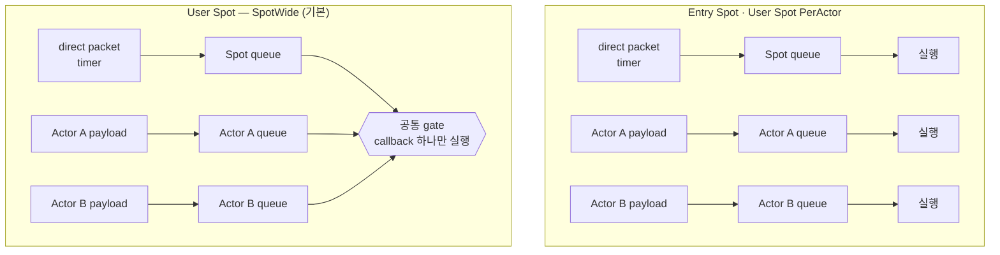

<!-- generated:start -->
<!-- 이 파일은 `common/guide/server/06-spot.ko.md`에서 생성한다. 직접 고치지 않는다.
     고칠 곳은 공통 소스이고, `python3 doc/site/scripts/generate_language_guides.py`로 다시 만든다. -->
<!-- generated:end -->

<!-- framework-adapter-nav:start -->
[가이드 홈](README.ko.md) | [이전: 5. Channel Messaging — request · send · pub/sub](05-channel-messaging.ko.md) | [다음: 7. Actor와 Spot](07-actor-spot.ko.md)
<!-- framework-adapter-nav:end -->

<!-- language-switch:start -->
다른 언어로 보기 — [C#/.NET](../../../dotnet/guide/server/06-spot.ko.md) · **C++** · [Java](../../../java/guide/server/06-spot.ko.md) · [Kotlin](../../../kotlin/guide/server/06-spot.ko.md) · [Node/TypeScript](../../../node/guide/server/06-spot.ko.md)
<!-- language-switch:end -->

# 6. Spot

> **이 장의 계약 소유 문서** — [Spot 모델](../../../common/spec/11-spot-model.ko.md)과
> [SPOT 메시징](../../../common/spec/12-spot-messaging.ko.md)이 동작을,
> [언어별 Spot 공개 계약](../../../common/spec/server/languages/README.ko.md)이 정확한
> 시그니처를 소유한다. Actor와 Spot membership은
> [Actor & Spot 호스팅](07-actor-spot.ko.md)에서 설명한다.

Spot은 room, stage, zone처럼 문자열 ID로 찾는 실행 단위다. `SpotId`는 Location Store 전체에서
유일하며, 대소문자를 구분한다. Application은 Spot이 존재하는 `NodeRid`를 선택하거나 보관하지 않는다.
Framework가 현재 위치와 generation을 조회한다.

## 1. 세 가지 Spot

세 종류 모두 ID와 상태를 가지고 순서대로 callback을 실행하는 Spot이지만, 생성 시점,
Actor membership과 종료 계약이 다르다.

| | Entry Spot | User Spot | Instance Spot |
| --- | --- | --- | --- |
| 생성 시점 | Object Server startup에서 Framework가 생성한다 | Application이 spot manager로 명시적으로 생성한다 | 해당 ID로 첫 direct message가 도착할 때 생성한다(cold activation) |
| Spot ID | Framework가 발급한다 | `create`는 Framework가, `get_or_create`는 caller가 지정한다 | Caller가 message의 target ID로 지정한다 |
| Stable type | 등록하지 않는다 | 필수 | 필수 |
| Actor membership | 지원한다. Actor 생성 직후의 기본 실행 위치다 | 지원한다. Actor가 join·leave로 이동한다 | 지원하지 않는다 |
| Application close | 제공하지 않는다 | `close` 또는 local context에서 close한다 | 자신의 handler·timer context에서 close한다 |
| 주요 용도 | 아직 User Spot에 속하지 않은 Actor의 기본 위치 | room, stage, zone | matchmaking worker처럼 ID 기반 요청 처리 단위 |

**어떤 lifecycle callback을 받는지도 종류마다 다르다.** 이름은 언어를 따르고 호출 조건과
순서는 같다.

| callback | Entry | User | Instance | 언제 |
| --- | :---: | :---: | :---: | --- |
| `configure` | O | O | O | handler를 등록하는 구성 단계 |
| `on_create` | X | O | X | 새 User Spot 생성 요청을 확인하고 수락 여부를 정한다. 기존 Spot을 찾은 경우에는 부르지 않는다 |
| `on_initialize` | O | O | O | 만들어진 instance의 초기화. Instance Spot은 `on_create` 없이 이것만 받는다 |
| `on_closing` | O | O | O | 아직 유효한 local instance가 정리되기 전(§4.1 아래) |
| `on_actor_join` | X | O※ | X | 이미 있는 Actor가 이 User Spot으로 오려 할 때 승인·거부 |
| `on_create_actor` | O※ | X | X | 새 Actor의 최초 Entry Spot membership 승인·거부 |
| `OnJoinedActor` | O※ | O※ | X | join commit이 끝났음을 **간 쪽** Spot에 알린다 |
| `on_leave_actor` | O※ | O※ | X | commit 뒤 **떠난 쪽** Spot에 알린다. Actor가 사라졌다는 뜻이 아니다 |
| `on_disconnect_actor` | O※ | O※ | X | 그 Spot 소속 Actor의 연결이 끊겼을 때 |

※ Actor type을 지정해 Actor membership을 지원하는 Spot에만 해당한다.

**membership callback은 떠난 Spot과 간 Spot에서 나뉘어 실행된다.** 그래서 User Spot에
있던 Actor가 Entry Spot으로 돌아가도 **Entry Spot의 `on_create_actor`와 `on_actor_join`은
불리지 않는다** — Entry Spot 복귀는 기본 membership이라 승인 절차가 없다. 양쪽 모두
commit 뒤 간 쪽의 `OnJoinedActor`와 떠난 쪽의 `on_leave_actor`만 실행된다.

User Spot과 Instance Spot은 역할이 다르다. User Spot은 caller가 ID를 지정하거나 Framework가 새 ID를
발급한다. Instance Spot은 별도 create API를 사용하지 않는다. 첫 메시지에 instance type을 지정하면
Framework가 기존 instance를 선택하거나 필요한 위치에 생성한 뒤 같은 메시지를 처리한다.

### 1.1 실제 샘플에서 보기

[Bingo 샘플](../../../common/sample/bingo/README.ko.md)은 세 종류를 모두 사용한다. Play
서버가 Entry Spot과 방을 담을 User Spot을, Matchmaking 서버가 매칭 대기열을 담을
Instance Spot을 등록한다.

```cpp
// Play 서버 — Entry Spot과 방을 담을 User Spot.
mesh.set_object_role (object_role_t::server)
  .add_entry_spot<bingo_entry_spot_t> (              // Entry Spot은 stable type이 없다.
    [] (entry_spot_context_t c) { return std::make_shared<bingo_entry_spot_t> (std::move (c)); })
  .add_spot_factory<bingo_room_t> (
    sample_names_t::room_spot_type,                  // stable type — 생성할 때 이 이름으로 선택한다.
    [] (spot_context_t c) { return std::make_shared<bingo_room_t> (std::move (c)); },
    [] (auto &factory) {
        factory.execution_mode (user_spot_execution_mode_t::spot_wide);
        factory.template preserve_state_with<bingo_room_relocation_adapter_t> ();
    });

// Matchmaking 서버 — 매칭 대기열을 담을 Instance Spot.
options.add_route_mesh (sample_names_t::matchmaking_mesh_name)
  .set_routing_id (zlink::routing_id_t::from (std::string ("matchmaking")))
  .listen (configuration.node.mesh_endpoint)
  .set_object_role (object_role_t::server)
  .add_instance_spot_factory<bingo_matchmaker_t> (
    sample_names_t::matchmaker_spot_type,
    [] (instance_spot_context_t c) {
        return std::make_shared<bingo_matchmaker_t> (std::move (c));
    },
    [] (auto &factory) { factory.recreate_on_relocation (); });
```

차이는 **호출하는 쪽**에서 드러난다. Entry Spot은 호출 대상이 아니고(server가 시작하며
이미 준비된다), User Spot은 생성 호출이 따로 있으며, Instance Spot은 그 호출이 없다.
Bingo의 매칭 handler 하나에 뒤의 둘이 함께 나온다.

```cpp
// Instance Spot — 생성 호출이 없다. 해당 ID로 보내면 없을 때 생성된다.
auto allocated = co_await spot_client
                   .request_to_spot ("match:" + level_bucket, reserve_bingo_room_req_t{})
                   .instance_spot (sample_names_t::matchmaker_spot_type) // 없으면 생성해도 된다는 intent.
                   .in_mesh (sample_names_t::matchmaking_mesh_name)
                   .submit<reserve_bingo_room_res_t> ();

// User Spot — 생성 호출이 따로 있다.
auto created = co_await spots
                 .get_or_create (allocated.room_id, sample_names_t::room_spot_type)
                 .in_mesh (sample_names_t::play_mesh_name)
                 .request (allocated.settings) // 새 Spot의 on_create로 전달된다.
                 .submit ();
```

User·Instance Spot은 factory 등록에서 relocation policy도 함께 지정한다. 생략할 수
없으며, 무엇을 선택하는지는 [Actor & Spot 호스팅](07-actor-spot.ko.md)이 다룬다.

## 2. Object Server 등록

Spot을 실행할 MeshNode는 Object Server role과 factory를 등록한다. 고정 `NodeRid`를 사용해 배치 대상을
선택하지 않는다. 같은 stable type을 등록한 `Serving` node가 배치 후보가 된다.

```cpp
auto mesh = options.add_route_mesh ("play");
mesh.listen ("tcp://0.0.0.0:9001")
  .set_routing_id (zlink::routing_id_t::from (std::string ("play")));

mesh.set_object_role (object_role_t::server)
  // Actor가 처음 배치될 Entry Spot을 등록한다.
  .add_entry_spot<play_entry_spot_t> (
    [] (entry_spot_context_t c) { return std::make_shared<play_entry_spot_t> (std::move (c)); })
  .add_spot_factory<game_room_t> (
    "game-room",
    [] (spot_context_t c) { return std::make_shared<game_room_t> (std::move (c)); },
    [] (auto &factory) {
        factory.execution_mode (user_spot_execution_mode_t::spot_wide);
        factory.disable_relocation ();
    })
  .add_instance_spot_factory<matchmaker_t> (
    "matchmaker",
    [] (instance_spot_context_t c) { return std::make_shared<matchmaker_t> (std::move (c)); },
    [] (auto &factory) { factory.recreate_on_relocation (); });
```

### 2.1 실행 모델 — 동시 실행 범위

Spot에 들어오는 작업은 두 queue로 나뉘어 대기한다. Spot 자신에게 온 direct packet과
timer는 **Spot queue**에, 그 Spot에 속한 Actor 앞으로 온 payload는 **Actor queue**에
넣는다. 서로 다른 queue의 작업을 동시에 실행할 수 있는지는 Spot 종류와 execution
mode가 정한다.

| | 직렬화 범위 | 상태 소유 |
| --- | --- | --- |
| Entry Spot | Spot queue와 Actor queue를 각각 직렬화한다. 서로 다른 queue는 동시에 실행할 수 있다 | Actor가 각자 소유한다. Actor 사이에 공유하는 상태는 외부 저장소에 둔다 |
| User Spot `SpotWide`(기본) | Spot handler, member Actor handler, timer, lifecycle callback 전체를 공통 gate 하나로 직렬화한다 | Spot instance가 소유한다. Actor와 공유하는 상태에도 별도 동기화가 필요하지 않다 |
| User Spot `PerActor` | Actor별, Spot lane별로 각각 직렬화한다. 서로 다른 lane은 동시에 실행할 수 있다 | Actor가 각자 소유한다. lane 사이에 공유하는 상태는 외부 저장소에 둔다 |
| Instance Spot | Spot queue의 direct handler와 timer를 직렬화한다. Actor queue가 없다 | Spot instance가 소유한다 |



기본값은 **`SpotWide`**이며 대부분의 경우 이 mode를 사용한다. 해당 Spot의 모든
callback을 공통 gate 하나로 직렬화하므로, Spot instance와 member Actor가 같은 상태를
함께 사용해도 별도 동기화가 필요하지 않다. Relocation에서도 Spot과 소속 Actor가 하나의
단위로 함께 이동한다. 반면 오래 걸리는 callback 하나가 해당 Spot의 다음 callback
전체를 지연시킨다.

**`PerActor`**는 Actor마다 독립적으로 실행해야 처리량을 확보할 수 있을 때 선택한다.
Spot 자체는 stateless shell로 사용한다. 서로 다른 lane이 동시에 실행되므로 여러
Actor가 함께 변경하는 상태와 Spot-level schedule은 Redis나 database 같은 외부
저장소에 둔다. Factory relocation 방식은 `RecreateOnRelocation()`만 사용할 수 있다.
**Entry Spot도 같은 모델**이므로 같은 제약을 받는다.

직렬 실행은 스레드 하나를 계속 점유한다는 뜻이 아니다. Handler가 `await`에 도달하면
실행 스레드는 다른 일을 처리할 수 있지만, 해당 turn은 handler가 완료될 때까지 유지된다.
`SpotWide`에서는 그동안 같은 Spot의 다음 callback을 시작하지 않는다. 오래 걸리는 I/O를
기다리는 동안 다음 turn을 실행해야 한다면
[Timer와 worker](#6-timer와-worker)의 `Yield` 계약을 사용한다.

Execution mode는 factory 등록에서 고정하며 실행 중에는 변경하지 않는다.

**어느 queue에 무엇이 들어가는지도 정해져 있다.** 특히 **Actor 앞으로 온 업무 message는
Spot queue를 거치지 않고 Actor queue로 바로 간다.** Spot callback이 그 message를 받아
넘겨주는 구조가 아니다.

| queue | 들어간다 | 들어가지 않는다 |
| --- | --- | --- |
| Spot application queue | Spot 앞 payload, 일치한 Logical Multicast payload, timer callback, Actor join · leave와 lifecycle callback | **Actor 업무 payload** |
| Instance Spot의 queue | Spot 앞 payload와 timer callback | Actor 관련 전부. **등록 시점에 거부한다** |
| Actor queue | Actor 업무 payload | — |

Instance Spot에 Actor membership이나 Logical Multicast 구독을 등록하려 하면 실행 중이
아니라 **등록하거나 Spot을 준비하는 시점에** 거부된다.

## 3. User Spot 만들기

두 호출은 목적이 다르다. **`create`는 새 Spot을 만드는 호출**이고, **`get_or_create`는 그
ID로 쓸 Spot을 확보하는 호출**이다. 어느 쪽을 쓸지는 "이미 있으면 어떻게 되기를 바라는가"로
정한다.

| | `create` | `get_or_create` |
| --- | --- | --- |
| 목적 | 새 Spot 하나를 만든다 | 그 ID의 Spot을 쓸 수 있게 한다 |
| 결과 `State` | `Created` 또는 `Rejected` | `Existing` · `Created` · `Rejected` |
| 이미 있을 때 | Framework가 SpotId를 새로 발급하므로 해당 없음 | `Existing`으로 끝나며 factory와 `on_create`를 실행하지 않는다 |
| SpotId | Framework가 발급한다 | caller가 지정한다 |
| 실패하면 | 쓸 수 있는 Spot이 없다 | 쓸 수 있는 Spot이 없다 |

**`create` — 만들어졌는지가 곧 업무 결과일 때.** 방을 새로 여는 것처럼 생성 자체가 목적인
자리에 쓴다. 결과는 만들어졌거나(`Created`) 생성 callback이 거절했거나(`Rejected`) 둘 중
하나다.

```cpp
auto created = co_await spots
                 .create ("game-room")            // stable type으로 factory와 배치 후보를 선택한다.
                 .in_mesh ("play")
                 .request (create_game_t{"ranked"}) // on_create에 전달할 생성 요청이다.
                 .timeout (std::chrono::seconds (10))
                 .submit ();

if (created.state == spot_create_state_t::rejected)
    throw std::runtime_error ("Game creation was rejected.");

auto spot_id = created.spot.spot_id (); // 이후 메시징에는 전역 SpotId만 사용한다.
```

> **샘플에서 보기 — [TicTacToe](../../../common/sample/tictactoe/README.ko.md).** API 서버가
> `POST /games`를 받아 Play 서버에 방을 만드는 자리다. 아래는 그 호출을 저장소의 실제
> 샘플에서 그대로 가져온 것이다.

```cpp
--8<-- "framework/languages/cpp/samples/TicTacToe/Server/Api/Handlers/create_game_http_handler.hpp:doc-create"
```

**`get_or_create` — 그 ID를 쓸 수 있으면 되는 때.** "있으면 그걸 쓰고 없으면 만든다"가 필요한
자리에 쓴다. 이미 있었는지(`Existing`)와 방금 만들었는지(`Created`)는 결과로 구분할 수 있고,
둘 다 바로 쓸 수 있는 `SpotRef`를 준다. 여러 caller가 같은 ID를 동시에 요청해도 Framework가
생성 시도를 한 번만 실행하므로 application이 경쟁을 직접 막지 않는다.

```cpp
auto result = co_await spots
                .get_or_create ("lobby-eu-1", "lobby")
                .in_mesh ("play")
                .request (create_lobby_t{"eu"}) // existing으로 끝나면 이 요청은 전달되지 않는다.
                .submit ();

switch (result.state) {
case spot_create_state_t::existing: // 이미 있던 lobby를 그대로 쓴다.
case spot_create_state_t::created:  // 이 호출이 만들었다.
    break;
case spot_create_state_t::rejected: // 생성 callback이 거절해 Ready Spot이 없다.
    throw std::runtime_error ("Lobby creation was rejected.");
}
```

`SpotRef`는 조회 시점의 exact incarnation이다. 일반 메시징에는 사용하지 않는다. 같은 incarnation을
닫을 때만 사용한다.

```cpp
auto current = co_await spots.find ("lobby-eu-1");
if (current) {
    // 다른 generation을 실수로 닫지 않는다.
    co_await spots.close (current.value ());
}
```

## 4. Spot 작성

Spot handler는 [05-channel-messaging](05-channel-messaging.ko.md)의 channel handler와
작성 규칙이 다르다. 주소·수명·실행·상태가 모두 갈린다.

| 구분 | channel handler | spot handler |
| --- | --- | --- |
| 주소 | `ChannelName` — 처리할 수 있는 node 중 하나 | spot id — 그 상태를 가진 객체 하나 |
| handler 수명 | message dispatch마다 새로 만든다 | Spot activation 동안 같은 instance를 재사용한다 |
| 실행 | 서로 다른 dispatch는 동시에 실행될 수 있다 | 같은 실행 queue의 작업은 한 번에 하나씩 실행한다 |
| application state | handler field에 보관하지 않는다 | Spot 또는 member Actor가 소유한다 |

Spot handler는 Spot class의 메서드가 아니라 그 Spot에 바인딩된 **별도 class**다. 첫
제네릭 인자로 대상 Spot 타입을 받고, `handle`의 첫 인자로 그 Spot instance를 받는다.
Framework는 Spot activation에서 handler를 한 번 만들고 Spot이 닫히거나 relocation될 때
정리한다. Actor handler도 같은 방식으로 해당 Actor activation에 묶인다.

### 4.1 handler 종류와 구현할 interface

무엇을 받느냐에 따라 구현할 interface가 다르다. 어느 것이든 `configure()`에서 등록한
것과 짝이 맞아야 한다.

받는 것마다 짝이 되는 interface와 등록 호출이 하나씩 있다.

| 받는 것 | 짝이 되는 등록 |
| --- | --- |
| Spot 앞 one-way packet | packet 등록 |
| Spot 앞 request | packet 등록 |
| Logical Multicast 구독 이벤트 | 구독 등록(channel과 topic 지정) |
| timer tick | timer 등록(이름과 주기 지정, §6.1) |
| member Actor 앞 one-way packet | actor packet 등록 |
| member Actor 앞 request | actor packet 등록 |

언어별 interface 이름과 등록 메서드는 다음과 같다.

C++은 handler class 대신 Spot member 함수를 등록한다. 등록 호출이 곧 종류다.

| 받는 것 | 등록 |
| --- | --- |
| Spot 앞 one-way packet | `add_handler<&TSpot::method> ()` |
| Spot 앞 request | `add_handler<&TSpot::method> ()`(반환값이 reply) |
| Logical Multicast 구독 이벤트 | `add_subscribe<&TSpot::method> (channel_name, topic)` |
| timer tick | `add_timer<THandler> (name, period, options)`(§6.1) |
| member Actor 앞 one-way packet | `add_actor_send<&TSpot::method> ()` |
| member Actor 앞 request | `add_actor_request<&TSpot::method> ()` |

handler는 대상 Spot instance를 첫 인자로 받는다. Spot 안에서 실행되므로 상태를 락 없이
직접 만진다.

> **샘플에서 보기 — [TicTacToe](../../../common/sample/tictactoe/README.ko.md).** 방 안의
> player가 수를 두는 handler다. member Actor 앞 request를 Spot과 Actor를 함께 받아
> 처리한다. 저장소의 실제 코드다.

```cpp
--8<-- "framework/languages/cpp/samples/TicTacToe/Server/Play/Infrastructure/ZLink/Spots/TicTacToeGameSpot/Handlers/play_actor_place_mark_handler.hpp:doc-actor-packet-handler"
```

네 갈래를 최소 형태로 보면 이렇다.

```cpp
// C++은 handler class 대신 Spot member 함수를 등록한다. 첫 인자가 대상 Spot이다.
class game_room_t : public spot_t<player_actor_t>
{
  public:
    // Spot 앞 packet.
    task_t<void> chat (const chat_t &message)
    {
        append_chat (message.text); // Spot 상태를 직접 만진다. 락은 필요 없다.
        co_return;
    }

    // Spot 앞 request — 반환값이 reply다.
    room_state_t get_room_state (const get_room_state_t &) { return snapshot (); }

    // 구독 이벤트 — add_subscribe로 등록한 channel·topic으로 들어온다.
    task_t<void> score (const score_changed_t &event)
    {
        apply_score (event);
        co_return;
    }

    // member Actor 앞 packet — Spot과 Actor를 함께 받는다.
    task_t<void> place_mark (player_actor_t &actor,   // 이 메시지를 받은 Actor다.
                             message_context_t &,
                             const place_mark_t &message)
    {
        place (actor.actor_id, message.cell);
        co_return;
    }
};
```

Actor 앞 request는 actor request handler이며
같은 인자에 반환값이 reply라는 점만 다르다.

`configure()`에서 handler를 등록하고 lifecycle callback에서 초기화와 정리를 수행한다.

```cpp
class game_room_t : public spot_t<player_actor_t>
{
  public:
    spot_context_t &context () noexcept override { return _context; }

    void configure () override
    {
        _context.handlers ().add_handler<&game_room_t::chat> (); // Spot send handler를 등록한다.
        _context.handlers ().add_subscribe<&game_room_t::score> (
          "game-events", "score.changed"); // Logical Multicast 구독을 등록한다.
    }

    task_t<spot_create_response_t> on_create (const message_t &request) override
    {
        const auto create = request.decode<create_game_t> ();
        co_return (create.mode == "ranked" || create.mode == "casual")
                  ? spot_create_response_t::accept (game_created_t{create.mode})
                  : spot_create_response_t::reject (invalid_mode_t{create.mode});
    }

    task_t<void> on_initialize () override
    {
        // 생성 승인 뒤 메시지를 받기 전에 필요한 준비를 끝낸다.
        co_return;
    }

    task_t<void> on_closing (const spot_closing_context_t &) override
    {
        // Deadline까지 application resource를 정리한다.
        co_return;
    }

  private:
    spot_context_t _context;
};
```

`on_closing`의 reason은 explicit close, host shutdown, relocation out을 구분한다.
Framework는 `Deadline`이 끝날 때 cleanup token을 취소한다.

**세 이유가 Spot 종류마다 다 오는 것은 아니다.**

| 종료 이유 | Entry | User | Instance | 언제 |
| --- | :---: | :---: | :---: | --- |
| explicit close | X | O | O | application이 close를 시작해 local instance를 정상 정리할 때 |
| host shutdown | O | O | O | relocation 없이 host가 local Spot을 정리할 때 |
| relocation out | X | O | O | owner를 target으로 commit한 뒤 source instance를 정리할 때 |

**불리지 않는 두 자리를 기억한다.**

- **close가 실패하면 부르지 않는다.** User Spot에 Actor membership이 남아 있어 explicit
  close가 실패로 끝나면 `on_closing`은 실행되지 않는다. close 결과를 확인하지 않고
  "정리됐겠지" 하고 넘어가면 안 되는 이유다.
- **Actor가 떠나도 Entry Spot은 닫히지 않는다.** Actor 하나가 다른 Entry Spot으로
  옮겨가는 것은 Spot instance의 종료가 아니므로 Entry Spot의 `on_closing`을 부르지 않는다.

**Entry Spot 자체는 옮겨가지 않는다.** relocation out이 Entry Spot에 오지 않는 이유가
여기 있다. host를 옮길 때 Framework가 옮기는 것은 **Entry Spot에 속한 Actor**이고,
target 쪽 Entry Spot은 그 host가 시작할 때 새 ID와 수명으로 이미 만들어져 있다. 그래서
Entry Spot에 담아 둔 상태는 host를 옮겨도 따라가지 않는다 — **옮겨야 하는 상태는 Actor나
User Spot에 둔다.**

host shutdown에서는 **Actor membership과 local instance가 아직 살아 있는 상태로**
callback이 실행된다. 정리는 callback이 끝난 뒤에 이뤄지므로, 이 안에서 member Actor를
읽는 코드가 성립한다.

### 4.2 Spot과 Actor의 activation scope

Framework는 Spot을 활성화할 때 DI scope를 하나 만들고 Spot 본체와 Spot handler의
dependency를 이 scope에서 resolve한다. Scope는 Spot이 닫히거나 다른 node로 이전할
때 함께 정리된다. 따라서
**`Scoped`로 등록한 서비스는 그 Spot이 살아 있는 동안 인스턴스 하나**다. HTTP 요청마다
새로 만들어지는 것과 다르다.

Actor handler는 별도의 Actor activation scope를 사용한다. 서로 다른 Actor는 handler나
scoped dependency를 공유하지 않는다. Actor가 leave·destroy되거나 relocation되면 source
scope를 정리하고 target에서 다시 만든다.

그래도 `DbContext` 같은 ORM context를 Spot이나 Spot handler의 생성자로 주입하면
문제가 생긴다. 방 하나가 몇 시간 유지되면 그 context도 몇 시간 산다.

| 증상 | 내용 |
| --- | --- |
| 메모리 증가 | change tracker가 조회한 entity를 계속 추적한다 |
| 오래된 값 조회 | 같은 키를 다시 조회해도 추적 중인 이전 instance를 반환한다 |
| 오류 상태 고착 | 저장 실패로 context가 오염되면 Spot 수명 내내 복구되지 않는다 |

Handler type을 `Transient`나 `Singleton`으로 등록해도 Framework가 정한 수명은 바뀌지
않는다. Framework가 handler를 만들고 dependency만 activation scope에서 resolve한다.

**첫 번째 선택은 Spot에서 저장소에 직접 접근하지 않는 것이다.** 저장·조회는 channel
handler가 있는 서비스에 요청하고, Spot은 in-memory 상태와 실행 순서만 소유한다. Channel
handler는 dispatch마다 scope를 가지므로 ORM을 생성자로 받아도 된다.

```cpp
// 저장은 그 일을 담당하는 channel의 handler에 맡긴다.
task_t<save_score_reply_t> game_room_t::save_score (const save_score_t &request)
{
    auto saved = co_await _context.outbound ()
                   .request_to_channel ("score",
                                        persist_score_t{_context.spot_id (), request.value})
                   .submit<persist_score_reply_t> ();

    co_return save_score_reply_t{saved.version};
}
```

**Spot 안에서 직접 써야 한다면 그 호출에만 사는 scope를 연다.** 생성자 주입 대신
scope factory를 받고, 사용하는 자리에서 scope를 만들고 닫는다.

**C++만 모양이 다르다.** Spot packet · request handler가 handler class가 아니라 Spot
member 함수이고, 호출마다 여는 scope 표면도 없다. 짧게 살아야 하는 자원은 그 함수 안에서
직접 열고 닫는다.

```cpp
// C++에는 호출마다 여는 scope 표면이 없다. Spot packet·request handler는
// Spot member 함수이고 DI handler class로 등록하지 않는다. 짧게 살아야 하는
// 자원은 이 함수 안에서 열고 닫는다.
task_t<save_score_reply_t> game_room_t::save_score (const save_score_t &request)
{
    auto session = _store.open_session (); // 이 호출이 끝나면 함께 닫힌다.
    co_await session.append (_context.spot_id (), request.value);
    co_return save_score_reply_t{request.value};
}
```

Spot 수명 동안 유지해도 되는 의존성(설정, 싱글톤 client, 순수 계산 서비스)은 생성자로
받아도 된다. 판단 기준은 "이 의존성을 Spot이 닫힐 때까지 붙잡고 있어도 되는가"다.

상태를 두는 자리도 같은 기준으로 나뉜다. 변하는 도메인 상태(방의 좌석·점수 등)는
**Spot 또는 member Actor**가 소유하고, 변하지 않는 구성은 싱글톤 서비스에, 여러 Spot이
함께 쓰는 인프라(캐시·카운터)는 싱글톤에 두고 자체 동기화한다. Handler field는 어느
경우에도 상태를 두는 자리가 아니다.

## 5. Spot으로 메시지 보내기

일반 User Spot 메시징은 SpotId만 필요하다. 위치와 generation은 Framework가 현재 authority에서 찾는다.

```cpp
co_await spot_outbound.send_to_spot ("room-42", chat_t{"hello"}).submit ();

auto state = co_await spot_client
               .request_to_spot ("room-42", get_room_state_t{})
               .timeout (std::chrono::seconds (3))
               .submit<room_state_t> ();
```

Instance Spot은 같은 호출 표면에 intent를 추가한다. `instance_spot(...)`의 인자는 **어느
factory로 준비할지 고르는 stable type**이다. 그 mesh에 Instance Spot type이 여럿 등록되어
있으면 반드시 명시하고, 하나뿐이면 생략할 수 있다.

```cpp
// type이 여럿 등록된 mesh — 어느 factory로 만들지 stable type으로 지정한다.
auto match = co_await spot_client
               .request_to_spot ("bronze", find_match_t{player_id})
               .instance_spot ("matchmaker") // 대상이 없으면 이 stable type의 factory로 준비한다.
               .in_mesh ("matchmaking")      // 처음 배치할 mesh를 고른다.
               .submit<match_result_t> ();

// type이 하나만 등록된 mesh — 생략하면 Framework가 그 유일한 type을 고른다.
auto single = co_await spot_client
                .request_to_spot ("bronze", find_match_t{player_id})
                .instance_spot ()            // 대상 node에 등록된 유일한 type으로 준비한다.
                .in_mesh ("matchmaking")
                .submit<match_result_t> ();
```

`instance_spot(...)`을 붙이지 않은 호출은 이미 실행 중인 Spot만 찾고, 없으면 생성하지
않고 실패한다. `find`도 생성을 시작하지 않는다. 즉 cold activation은 호출하는
쪽이 intent로 명시적으로 허용해야 일어난다.

`send_to_spot`은 source-local admission까지 기다리는 one-way operation이다. Target handler 완료를
기다리지 않는다. `request_to_spot`은 reply 또는 typed error까지 기다린다.

**첫 message는 cold activation 중에도 잃지 않는다.** intent를 붙인 호출은 그 message를
activation과 함께 보내고, target은 handler를 열기 전에 그것을 durable하게 기록한 뒤 큐
맨 앞으로 복원한다. **생성을 지시하는 별도 request로 바뀌지 않고** 그대로 application
payload로 처리된다. 보내는 쪽이 같은 message를 두 번 보내지 않는다.

**실패해도 다른 Spot으로 자동 재전송하지 않는다.** 실패 결과를 받은 뒤 같은 ID나 다른
ID로 다시 보내는 것은 application의 새 operation이다. 이전 target이 이미 실행했을 수
있으므로 **중복 실행 처리는 보내는 쪽 책임**이다.

### 5.1 Spot handler에서 channel 호출하기

Spot handler와 timer는 channel send · request를 시작할 수 있다. **그 Spot을 소유한
MeshNode에 해당 ChannelName이 없어도 된다** — 같은 process에 그 이름의 송신 경로가
하나라도 등록되어 있으면 쓸 수 있다. 다른 RouteMesh의 경로여도, ClientServer client의
경로여도 된다.

**같은 process에 없으면 거기서 끝난다.** 다른 process나 다른 MeshNode를 중계로 삼아
찾아 주지 않으며 `NotFound`로 끝난다. 그래서 Spot을 배치할 node를 정할 때 **그 Spot이
호출할 channel의 송신 경로가 같은 process에 등록되어 있는지**를 함께 본다.

## 6. Timer와 worker

둘 다 Spot context에서 시작하지만 목적이 다르다. **Timer는 주기적으로 실행할 작업**을
등록하고, **worker는 오래 걸리는 단발 작업**을 Spot queue 밖에서 실행한다.

### 6.1 Timer — 주기 실행

Timer는 이름·주기·handler를 Spot context에 등록한다. tick은 그 Spot의 실행 queue에 들어가므로
handler 안에서 Spot 상태를 그대로 만질 수 있다. 등록은 timer 핸들을 돌려주며, 이것으로
나중에 취소한다.

```cpp
// Spot 안에서 — 반환된 timer_t를 필드에 보관해 두었다가 취소에 쓴다.
timer_options_t options;
options.overrun_policy = timer_overrun_policy_t::skip_late_ticks;
options.max_catch_up_ticks = 1;
options.stop_on_unhandled_exception = false;

// handler는 Spot이 아니라 별도 타입이다 — handle (spot, tick) 두 인자를 받는다.
_game_tick = _context.add_timer<game_tick_handler_t> (
  "game-tick",                              // 같은 Spot 안에서 유일한 이름이다.
  std::chrono::seconds (1),                 // 주기. 0 이하이면 구성 오류다.
  options);

co_await _game_tick.cancel (); // 더 이상 필요 없을 때. Spot이 닫히면 Framework가 함께 정리한다.
```

Handler는 Spot과 tick 정보를 받는 별도 class다.

> **샘플에서 보기 — [TicTacToe](../../../common/sample/tictactoe/README.ko.md).** 매 초
> 판을 진행시키는 timer handler다. 저장소의 실제 코드를 그대로 가져왔다.

```cpp
--8<-- "framework/languages/cpp/samples/TicTacToe/Server/Play/Infrastructure/ZLink/Spots/TicTacToeGameSpot/tictactoe_game_spot.hpp:doc-timer-handler"
```

최소 형태로 보면 이렇다.
```cpp
// C++ timer handler는 별도 class다. handle이 대상 Spot과 tick을 함께 받는다.
class game_tick_handler_t
{
  public:
    task_t<void> handle (game_room_t &spot, const timer_tick_t &tick) const
    {
        co_await spot.tick_once ();
    }
};
```

#### 예정 시각을 지난 tick의 처리 정책

Spot queue에 작업이 쌓이거나 handler 실행이 길어지면 tick이 예정 시각보다 늦게 실행된다.
이때 지나간 tick을 어떻게 처리할지가 `overrun_policy`다.

| 값 | 예정 시각을 지났을 때 | 선택 기준 |
| --- | --- | --- |
| `SkipLateTicks`(기본) | 지나간 tick을 버리고 **현재 시각에 해당하는 tick 하나만** 전달한다 | 최신 상태만 의미 있을 때 — 상태 broadcast, 만료 검사 |
| `CatchUpBounded` | 지나간 tick을 **최대 `max_catch_up_ticks`개까지** 전달하고 초과분은 버린다 | tick 횟수 자체가 의미 있을 때 — 회복량 누적, 시뮬레이션 step |
| `DelayNextTick` | 고정 주기를 유지하지 않고 **직전 tick 완료 시각 + 주기**로 다음 예정을 다시 계산한다 | 실행 간 최소 간격을 보장해야 할 때 — 외부 API polling |

`max_catch_up_ticks`는 `CatchUpBounded`에서만 쓰이며 기본값은 `1`이다. `0` 이하이면 등록 시점에
설정 오류다. 앞의 두 정책은 timer 시작 시각 기준의 고정 rate를 유지하므로, 한 tick이 늦게 실행되어도
다음 tick의 예정 시각은 변하지 않는다.

timer handler가 받는 tick 값은 예정 대비 지연과 건너뛴 tick 수를 필드로 제공한다.

| 필드 | 뜻 |
| --- | --- |
| `Name` | 등록할 때 준 이름 |
| `ScheduledIndex` · `delivery_index` | 몇 번째 예정 tick인지 · 실제 전달 순번. 두 값의 차이가 지금까지 버려진 tick 수다 |
| `ScheduledAt` · `StartedAt` | 예정 시각 · 실제 실행 시작 시각 |
| `ScheduledElapsed` · `StartedElapsed` | 타이머 시작 이후 경과(예정 기준 · 실제 기준) |
| `Delay` | `StartedElapsed - ScheduledElapsed` — 이 tick의 예정 대비 지연 |
| `SkippedTicks` | 이번 tick 직전에 건너뛴 tick 수 |
| `Period` | 등록한 주기 |

```cpp
task_t<void> game_tick_handler_t::handle (game_room_t &spot,
                                          const timer_tick_t &tick) const
{
    if (tick.delay > std::chrono::milliseconds (500))
        spot.report_lag (tick.delay, tick.skipped_ticks); // 지연이 크면 부하를 보고한다.

    co_await spot.tick_once ();
}
```

#### handler가 예외를 던졌을 때

`stop_on_unhandled_exception`이 기본값 `false`면 그 tick만 실패로 끝나고 timer는 계속 돈다. `true`로
두면 그 timer가 멈춘다 — 같은 실패가 매 주기 반복되는 상황을 막아야 할 때 쓴다. 어느 쪽이든
실패는 진단으로 기록되므로 로그·trace에서 확인한다([11. Monitoring](11-monitoring.ko.md) §3).

#### relocation과 timer

Spot이 다른 node로 옮겨갈 때 Framework가 timer 이름·handler type·주기·timer 옵션·
스케줄 커서·아직 실행하지 않은 tick을 함께 옮긴다. 그래서 relocation adapter가 timer를
저장하거나 target에서 다시 등록하지 않는다([§7](#7-relocation을-시작해도-되는-시점-알리기)).

### 6.2 Worker — 긴 작업을 Spot queue 밖에서 실행

Spot의 실행 queue는 한 번에 하나만 실행한다. 무거운 계산이나 외부 I/O를 handler 안에서 그대로
기다리면 그동안 그 Spot의 다른 작업이 전부 멈춘다. 이런 작업은 worker call로 위임한다.

**선택 기준.** 위임할 작업이 **스레드를 점유하는 동기 코드**면 `RunCpuWorker`, **await로
완료를 기다리는 비동기 코드**면 `RunIoWorker`다.

| | `RunCpuWorker` | `RunIoWorker` |
| --- | --- | --- |
| 넘기는 것 | 동기 계산 함수 | 비동기 호출 함수 |
| 쓰는 자리 | 직렬화·압축·경로 탐색·이미지 처리처럼 CPU를 계속 쓰는 작업 | DB·파일·HTTP처럼 응답을 기다리는 작업 |

```cpp
// CPU worker — 동기 계산을 worker 스레드에서 실행한다.
task_t<snapshot_reply_t> game_room_t::build_snapshot (const build_snapshot_t &)
{
    auto board = copy_board (); // Spot 상태는 turn 안에서 먼저 복사해 둔다.

    auto packed = co_await _context
                    .run_cpu_worker ([board] (std::stop_token) {
                        return snapshot_codec_t::compress (board); // 무거운 동기 계산.
                    })
                    .yield ();

    co_return snapshot_reply_t{packed};
}
```

I/O를 기다리는 작업은 `RunIoWorker`로 넘긴다.

```cpp
// I/O worker — 외부 저장소 호출을 worker에서 실행한다.
task_t<save_score_reply_t> game_room_t::save_score (const save_score_t &request)
{
    auto version = co_await _context
                     .run_io_worker ([this, request] (std::stop_token token) {
                         return _store.save (request.value, token);
                     })
                     .timeout (std::chrono::seconds (3)) // 이 worker 호출의 상한.
                     .yield ();

    co_return save_score_reply_t{version};
}
```

**결과를 받는 세 가지 종결자.**

| 종결자 | Spot 실행권 | 쓰는 자리 |
| --- | --- | --- |
| `Yield(ct)` | 기다리는 동안 **반납한다** | 기본 선택. 그 사이 같은 Spot의 다른 작업이 실행된다 |
| `Async(ct)` | 기다리는 동안 **유지한다** | 작업이 짧고, 기다리는 동안 Spot 상태가 바뀌면 안 될 때 |
| `Submit(ct)` | 즉시 반환 | 결과를 기다리지 않고 제출만 할 때 |

`Yield`를 쓰면 반납한 사이에 같은 Spot의 다른 작업이 실행되므로, **`Yield` 전후로 Spot 상태가
바뀌었을 수 있다고 보고 코드를 쓴다.** 위 CPU worker 예제가 board를 먼저 복사하는 이유다.
`Yield`는 `SpotWide` User Spot과 Instance Spot에서만 쓸 수 있다 — Entry Spot과 `PerActor`에는
공유 Spot turn이 없어 반납할 실행권 자체가 없다.

Worker 스레드 풀 자체(최소·최대 스레드, 유휴 시간, 대기열 길이)는 루트 옵션의 `Worker`에서
정한다([16. Options](16-options.ko.md) §2).

## 7. Relocation을 시작해도 되는 시점 알리기

Relocation은 Spot을 다른 node로 옮기는 절차다([03-concepts](03-concepts.ko.md#5-relocation--다른-node로-옮겨가기)).
Framework는 source에서 새 turn 수락을 닫고, adapter의 `capture`로 application state를
직렬화하고, target에서 `Restore`로 복원한 뒤 authority를 commit한다. `capture`를
호출하는 시점을 relocation **safe point**라 하며, 이 시점을 누가 정하는지를 factory 등록에서
고른다.

| 모드 | safe point 결정 주체 | 적용 대상 |
| --- | --- | --- |
| `AnyTurnBoundary`(기본) | Framework — 완료된 turn과 다음 turn 사이 | 대부분의 Spot |
| `ApplicationSignaled` | Application — `defer()`를 호출한 turn의 끝 | 상태 일관성 단위가 여러 turn에 걸치는 Spot |

**기본 모드가 성립하는 조건.** Framework는 실행 중인 turn을 중단하지 않는다. handler 하나와
tick 하나는 완료된 뒤에야 `capture`가 호출되므로, 상태 변경이 한 turn 안에서 끝나면 turn
경계에서 직렬화한 state는 항상 일관된다.

**기본 모드가 성립하지 않는 조건.** 상태 일관성 단위가 여러 turn에 걸쳐 있으면 turn 경계에서
직렬화한 state가 불완전할 수 있다. FPS 라운드가 그런 예다 — 라운드는 시작 tick, 입력 packet
다수, 정산 tick으로 이뤄지고 그 중간 state는 복원해도 라운드를 이어서 진행할 수 없다.
Framework는 turn 경계는 알지만 application이 정의한 일관성 단위는 알지 못한다.
`ApplicationSignaled`를 등록하면 Framework는 `capture`를 스스로 호출하지 않고 application이
신호한 시점까지 대기한다.

```cpp
mesh.set_object_role (object_role_t::server)
  .add_spot_factory<game_room_t> (
    "game-room",
    [] (spot_context_t c) { return std::make_shared<game_room_t> (std::move (c)); },
    [] (auto &factory) {
        // 이 모드에서만 쓸 수 있다.
        factory.execution_mode (user_spot_execution_mode_t::spot_wide);
        factory.relocation_readiness (spot_relocation_readiness_mode_t::application_signaled);
        factory.template preserve_state_with<game_room_relocation_adapter_t> ();
    });
```

Application은 상태가 일관된 turn에서 `defer()`를 호출한다. 이 호출은 relocation을 그 자리에서
수행하지 않는다. 현재 turn이 끝난 뒤 대기 중인 relocation이 있으면 Framework가 그 지점에서
`capture`를 호출한다.

```cpp
task_t<void> round_tick_handler_t::handle (game_room_t &spot,
                                           const timer_tick_t &) const
{
    if (!spot.try_finish_round ()) // 라운드 진행 중이면 신호하지 않는다.
        co_return;

    // 라운드가 끝나 상태가 정산된 지점이다. 이 turn의 마지막 Framework 호출이어야 한다.
    spot.context ().relocation_ready ().defer ();
    co_return;
}
```

신호한 뒤 실제로 어떻게 됐는지는 Spot의 `on_relocation_ready_completed`로 돌아온다. 이
callback은 **두 경우 모두** 호출되므로, 다음 라운드를 여는 코드를 여기 한 곳에 둔다.

```cpp
task_t<void> game_room_t::on_relocation_ready_completed (
  const spot_relocation_ready_completion_t &completion)
{
    // continued — 대기 중인 relocation이 없었거나 commit 전에 중단됐다. 이 node에서 계속한다.
    // relocated — 이동이 끝났고, 이 callback은 target node의 새 instance에서 실행된다.
    start_next_round (completion.outcome == spot_relocation_ready_outcome_t::relocated);
    co_return;
}
```

다음 규칙을 지킨다.

- **`defer()`는 그 turn의 마지막 Framework 호출이다.** 이후 같은 turn에서 다른 Framework
  operation(send, request, close 등)을 시작하면 오류다.
- **한 turn에 한 번만 호출한다.** 같은 turn에서 두 번째 `defer()`는 오류다.
- **`SpotWide` User Spot 전용이다.** Entry Spot, `PerActor` User Spot, Instance Spot과 기본
  `AnyTurnBoundary` 모드에서는 호출할 수 없다.

## 8. 관련 문서

- 이 챕터 계약의 실행 검증 예문: [13. Interface 카탈로그](13-interface-catalog.ko.md) §3 — 검증 클래스 `SpotContracts`
- Actor 생성과 Spot 이동: [Actor & Spot 호스팅](07-actor-spot.ko.md)
- Session binding: [Session Actor Dispatch](08-actor-session.ko.md)
- Location Store 설정: [Location](10-location.ko.md)
