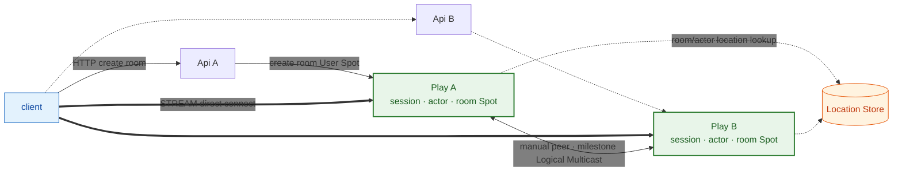
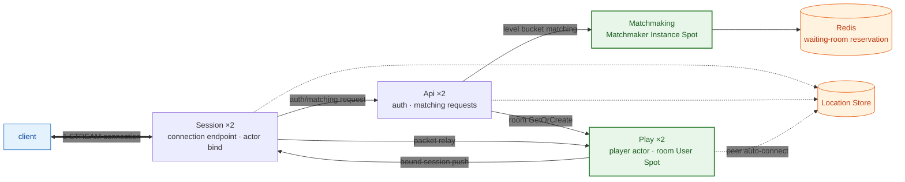
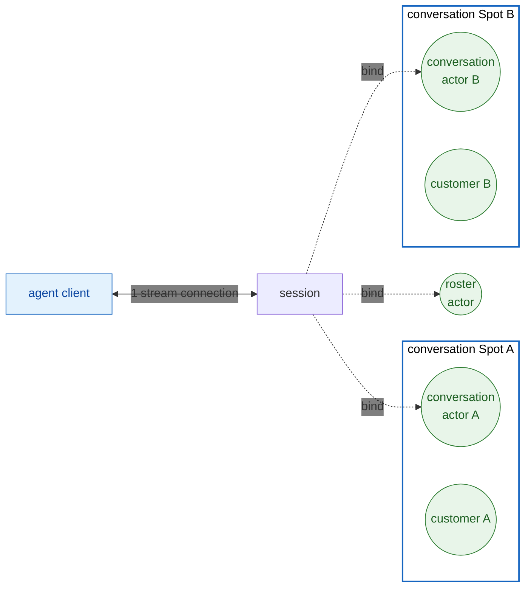
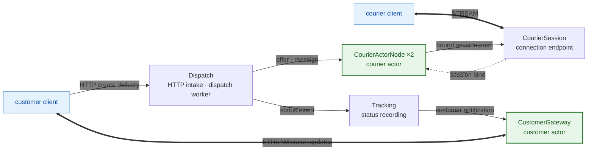
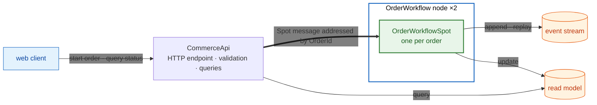
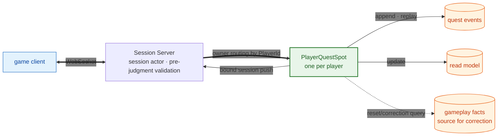
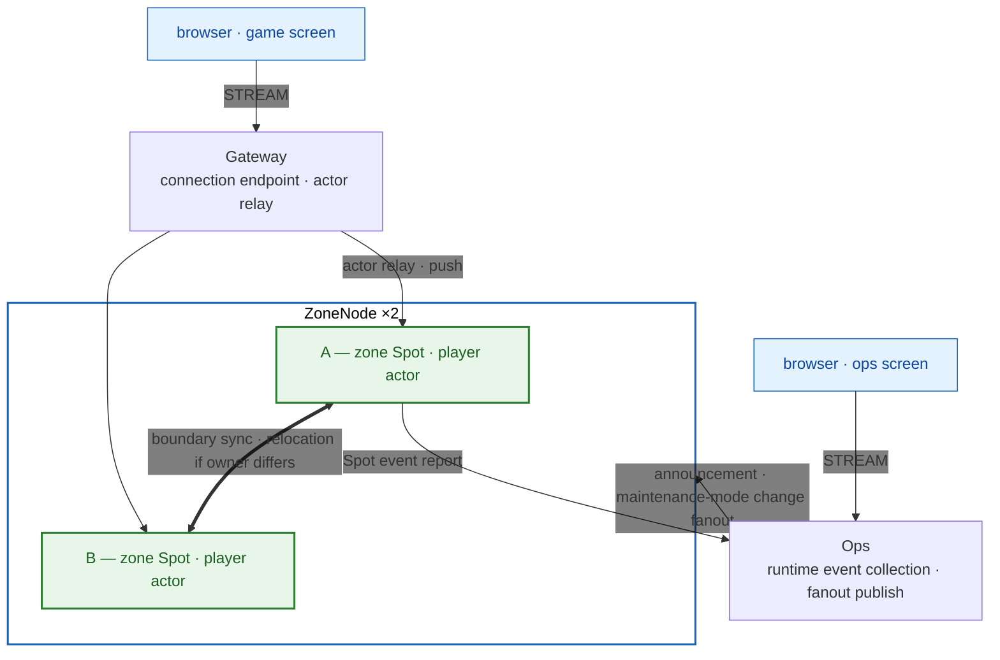

<!-- generated:start -->
<!-- This file is generated from `common/guide/server/14-samples.en.md`. Do not edit directly.
     Edit the common source instead, then regenerate with `python3 doc/site/scripts/generate_language_guides.py`. -->
<!-- generated:end -->

<!-- framework-adapter-nav:start -->
[Guide Home](README.en.md) | [Previous: 13. Key Type Usage Index](13-interface-catalog.en.md) | [Next: 15. E2E Testing — Verifying The Whole System With A Client](15-e2e-testing.en.md)
<!-- framework-adapter-nav:end -->

<!-- language-switch:start -->
View in another language — [C#/.NET](../../../dotnet/guide/server/14-samples.en.md) · **C++** · [Java](../../../java/guide/server/14-samples.en.md) · [Kotlin](../../../kotlin/guide/server/14-samples.en.md) · [Node/TypeScript](../../../node/guide/server/14-samples.en.md)
<!-- language-switch:end -->

# 14. Picking A Sample — Start With The Example Closest To Your Problem

> **This chapter has no spec document that owns a contract.** It's guidance for choosing
> which sample to look at. Each sample's language-neutral scenario, message contract, and
> verification criteria are defined by the
> [common sample document](../../../common/sample/README.en.md). This document lays out
> **which sample helps first** and how to run it.

The samples are split so each one owns a different bundle of features. You don't need to
read all of them — it's faster to pick the one closest to what you're building and follow its
registration code and handlers.

**If you don't know where to start, look at [Bingo](#3-bingo--building-an-online-game-server).**
It's where the most framework features show up, and its shape is exactly a typical online
game server.

## 1. Choosing By What You're Building

| System you're building | Sample | What this sample covers |
| --- | --- | --- |
| A real-time head-to-head game server | [TicTacToe](#2-tictactoe--building-a-real-time-head-to-head-game-server) | The smallest configuration, with auto-connect and auto-registration stripped away |
| A full online game server — where the most framework features show up | [Bingo](#3-bingo--building-an-online-game-server) | A conventional game server split into a connection gateway, auth/matchmaking, and room servers |
| A live chat support system | [SupportChat](#4-supportchat--building-a-live-chat-support-system) | An actor/routing setup where one agent handles several conversations at once |
| A dispatch system | [DeliveryDispatch](#5-deliverydispatch--building-a-dispatch-system) | Create a request → pick a fulfiller → reassign on no response → deliver to the party involved |
| An order-processing system | [ShoppingMall](#6-shoppingmall--building-an-order-processing-system) | Lossless event sourcing written as sequential code, with no orchestration layer |
| A quest/mission progression system | [GameQuest](#7-gamequest--building-a-quest-progression-system) | Owner processing that trades loss tolerance for real-time-ness |
| A zone-sharded MMORPG with ops control | [ZoneWorld](#8-zoneworld--building-a-zone-sharded-mmorpg-and-ops-control) — provided in `.NET` and Node.js only | Which surface to pick when doing something across multiple nodes |

To pick by feature instead, look at the [01. Overview](01-overview.en.md)'s introduction order first.

Two pairs are built to contrast with each other, and looking at them together makes the
decision criteria clear.

- **TicTacToe ↔ Bingo** — the same real-time game shown once with manual connect/manual
  registration, and once with auto-connect/auto-registration; once with Play owning the
  session directly, and once with a separate gateway.
- **ShoppingMall ↔ GameQuest** — the same owner Spot/event sourcing shown once for a domain
  that needs zero loss, and once for a domain that tolerates loss and corrects for it.

## 2. TicTacToe — Building A Real-Time Head-To-Head Game Server

**The smallest real-time game server configuration**, handling a two-player match with 2
`Api`s and 2 `Play`s. It's also **the only sample that writes endpoints directly instead of
handing peer connections to the location store.** Even so, the Location Store still resolves
which node a room and actor currently live on here too — what's manual is **the connection
between nodes**, not **object location lookup.** It's also the only sample that registers
handlers directly in configuration code without scanning, which makes it a good place to see
how the rest fits together once you strip away the part the framework normally automates.



With no separate Session server, each `Play` owns the stream session, actor, Entry Spot, and
room Spot together. The client connects directly to a Play from the list of Play endpoints
it got from `Api`. When the move count reaches 100, the room Spot publishes a milestone by
Logical Multicast, and an observer handler registered on another Play server's Entry Spot
receives it and pushes it to spectating clients.

- Paired chapters: [05-channel-messaging](05-channel-messaging.ko.md) (ClientServer channel),
  [06-spot](06-spot.ko.md) (creating a User Spot), [09-stream](09-stream.ko.md)
- Scenario: [TicTacToe](../../../common/sample/tictactoe/README.en.md) · payload JSON
- The [02. Getting Started](02-getting-started.en.md) follows this sample. If this is your first read, start
  here.

## 3. Bingo — Building An Online Game Server

**If you pick only one, pick this sample.** Everything an online game server needs —
authentication, matchmaking, game progress, real-time push — is all in here, and it's where
the most framework features show up. Three kinds of Spot, actor-to-session binding, remote
Spot join, Spot timers, Logical Multicast, and location-store auto-connect all appear in
sequence within one flow.

At the same time, this shape isn't specific to Bingo — it's exactly **a typical online
game's server configuration.** The client connects to only one connection server;
authentication and matchmaking are handled by a separate server; and game progress is
processed by the server that owns the room. Even building a different genre, the role split
and connection shape rarely stray far from this, so it's a good starting point for a new
service.



`Session` owns the client connection and actor binding; `Play` owns the player actor and the
room User Spot; `Api` handles auth and matching requests; `Matchmaking` owns a Matchmaker
Instance Spot per level. The client keeps **only one connection, to `Session`**, and the
shared Location Store resolves server-to-server connections. `Session`, `Api`, and `Play`
each run 2 instances, to confirm scale-out still holds even in a gateway shape.

There are two things you can only see here. The Matchmaker Instance Spot atomically decides
waiting-room reservations against Redis, and even when the player actor and the room Spot
**live on different Play servers**, the framework finds the current owner and executes a
remote Spot join. After that, the room Spot draws a number on a timer, pushes it to the
bound session, and if a rare reward comes up, delivers it to spectators on other Play
servers via Logical Multicast.

This is the only sample where the payload is Protobuf. Because it's a gateway-shaped game
with many roles and contracts, the schema is used as the anchor so each language's sample
keeps the same field and wire names.

- Paired chapters: [06-spot](06-spot.ko.md) (all three Spot kinds appear),
  [07-actor-spot](07-actor-spot.ko.md), [08-actor-session](08-actor-session.ko.md),
  [10-location](10-location.ko.md)
- Scenario: [Bingo](../../../common/sample/bingo/README.en.md) · payload Protobuf
- The registration-code examples in chapters 06 and 07 come from this sample.

## 4. SupportChat — Building A Live Chat Support System

A system where a customer requests support, an agent is assigned, and they chat in real
time. One conversation maps to a conversation Spot, which owns the participants, message
order, typing state, and closed state.

The technical difficulty in this domain comes from **one agent handling several customers at
the same time.** A customer has only one conversation, so their own actor is directly that
conversation's participant. An agent can't work that way — in the framework, **one actor
belongs to only one Spot at a time**, and joining a new Spot means leaving the previous one.
One agent actor can't be inside three conversations at once.

So the agent side splits its actor into two kinds.

| actor | Belongs to | Responsibility |
| --- | --- | --- |
| roster actor | Entry Spot | Owns the agent's identity and availability, and receives assignment notifications. Created once at authentication |
| conversation actor | Each conversation Spot | The participant in one conversation. One more is created per conversation joined |

**One connection, but several actors.** The agent client keeps only one stream connection,
and that session has the roster actor and each per-conversation actor bound to it together.



The inbound direction is disambiguated by **carrying `ConversationId` in the stream
message's metadata.** The Session server reads only the metadata to pick the target actor
and **never parses the payload.** This keeps the connection server decoupled from the
support domain's schema. On the outbound side, pushes from each conversation Spot converge
onto the same single connection through the session bound to that actor.

Assignment is capacity-based. If no agent has capacity left, the request stays pending
rather than erroring; once an agent's capacity fills up, they drop out of the assignment
list and rejoin once a conversation closes. On reconnect, a new session binds to the same
actor and the conversation state picks up right where it left off, and if no message arrives
for a while, a Spot timer moves the conversation into its closing flow.

This shape isn't specific to support. **Any system where one user participates in several
rooms/tasks at once** ends up in the same shape.

- Paired chapters: [08-actor-session](08-actor-session.ko.md), [06-spot](06-spot.ko.md)
  (timer), [09-stream](09-stream.ko.md)
- Scenario: [SupportChat](../../../common/sample/supportchat/README.en.md) · payload JSON

## 5. DeliveryDispatch — Building A Dispatch System

Create a delivery, offer it to a courier, reassign it if there's no response within a set
time, and deliver status updates to the customer. This sample's point isn't delivery
business rules — it's showing **which framework feature the common requirement "create a
request, pick a fulfiller, deliver to a specific user's connection, retry on no response"
maps to.** Ride-hailing, field dispatch, and on-site service requests share the same shape.



The external boundary uses ordinary web technology as-is. The customer creates a delivery
over HTTP and receives status over a stream. What changes is what's inside — instead of
keeping a session map or socket registry directly, the session bound to the customer actor
stands in for it, and courier selection and reassignment are owned by the dispatch worker
and the courier actor route. The client scenario verifies both the normal-dispatch and the
timeout-reassignment flows.

- Paired chapters: [05-channel-messaging](05-channel-messaging.ko.md),
  [07-actor-spot](07-actor-spot.ko.md), [09-stream](09-stream.ko.md)
- Scenario: [DeliveryDispatch](../../../common/sample/deliverydispatch/README.en.md) · payload JSON

## 6. ShoppingMall — Building An Order-Processing System

One order is owned by an `OrderWorkflow` owner Spot, which runs reserve-inventory → approve-
payment → confirm, and compensates on failure. The outer HTTP boundary is terminated by
`CommerceApi`, which never changes order state directly.



The payoff of an owner Spot in this sample isn't throughput. The key point is **writing a
multi-step process that's safe under retry and interruption as sequential code, with no
separate orchestration layer — no saga orchestrator, no coordination state, no scheduler, no
outbox.** What a web setup usually assembles from outside infrastructure — "save the
progress point, coordinate the next step, resume a stalled task" — collapses into a single
event stream. Duplicate clicks are handled with an idempotency key, a moment where the
previous owner is still lingering with an expected version, and a stalled order with an
explicit resume command. If the read model breaks, it's rebuilt by replaying the events.

- Paired chapters: [06-spot](06-spot.ko.md), [12-operations](12-operations.ko.md)
- Scenario: [ShoppingMall](../../../common/sample/event/shoppingmall.en.md) · payload JSON
- Event sourcing itself isn't a framework feature — it's a shape the application builds on
  top of a Spot.

## 7. GameQuest — Building A Quest Progression System

Gathers per-player play events from a game and has **the server** judge quest progress and
completion. Letting the client say "I finished the quest, give me the reward" invites
cheating, so all judging and reward decisions happen inside the `PlayerId` owner Spot. One
owner processes the same player's events in order, and progress is pushed to the connection
through a projection.



Placed next to ShoppingMall, the decision criteria become clear. Game progress can tolerate
getting tangled because there's a resync safety valve, so **it trades loss tolerance for
real-time-ness.** That's why it doesn't have zero-loss mechanisms like blocking the previous
owner or requiring an explicit resume — a gap is absorbed by snapshot-based correction
instead. Anything that genuinely needs zero loss, like an actual currency payout, is split
into a separate tier.

- Paired chapters: [06-spot](06-spot.ko.md), [08-actor-session](08-actor-session.ko.md)
- Scenario: [GameQuest](../../../common/sample/event/gamequest.en.md) · payload JSON

## 8. ZoneWorld — Building A Zone-Sharded MMORPG And Ops Control

> Unlike the previous seven samples, ZoneWorld exists only in `.NET` and Node.js. The other
> six are shared across all five languages. To see the same topic in another language, read
> this chapter's explanation and the common scenario document, and refer to the code in one
> of these two languages.

The world is split into zones, shared across several `ZoneNode`s, and which node owns which
zone is decided by the Location Store together with the framework. When a player crosses a
boundary, their actor joins the adjacent zone Spot, and if the owner differs, relocation
happens — but the client connection stays intact. A bot actor with no bound session makes
the same boundary crossing on a Spot timer.



This sample's teaching point is that **"doing something across multiple nodes" calls for a
different surface depending on the situation.**

| What you're trying to do | Surface used |
| --- | --- |
| See which nodes are registered/connected | runtime event — a change notification, not a request; a terminated node has no target to request from |
| Announce to every node | classic fanout — the publisher never holds a node list |
| Switch a specific node into maintenance mode | desired state + fanout — each node applies only its own `NodeId`'s share |
| Send to every player in one zone | zone Spot → its actors → each one's bound session |
| Send to one specific player | that actor → its own bound session |

State near a boundary is delivered by Logical Multicast on a per-adjacent-zone topic. If one
topic were shared by several zones, unrelated players would receive it too, so the topic
name carries both the sending and receiving zone. It's **the only sample with a browser
UI**, so you can watch the boundary crossing and node maintenance-mode switch happen visually.

- Paired chapters: [07-actor-spot](07-actor-spot.ko.md) (relocation),
  [11. Monitoring](11-monitoring.en.md), [12-operations](12-operations.ko.md)
- Scenario: [ZoneWorld](../../../common/sample/zoneworld/README.en.md) · payload JSON
- The server is provided in multiple languages sharing one browser client.

## 9. Running It

One runner per sample directory brings up several servers together with a client scenario,
and runs verification too. For a sample that needs a location store, the runner brings up
its own Redis container and cleans it up when done, so all you need is `docker`.

```bash
# Run one sample
framework/languages/cpp/samples/Bingo/run_sample.sh

# Run several in sequence (omit the arguments to run all)
framework/languages/cpp/samples/run_samples.sh TicTacToe Bingo
```

`run_samples.sh` handles the 6 server samples. ZoneWorld, which needs a browser UI, runs
separately via `ZoneWorld/run_sample.sh`.

## 10. Related Documents

- Each sample's language-neutral scenario and verification criteria:
  [Common sample](../../../common/sample/README.en.md)
- Per-language sample directory layout: the `README` at each language's sample root
- Per-feature usage: [05-channel-messaging](05-channel-messaging.ko.md) through
  [12-operations](12-operations.ko.md)
