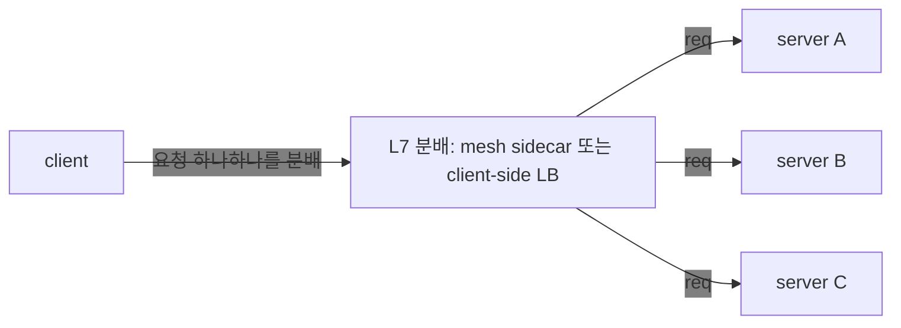
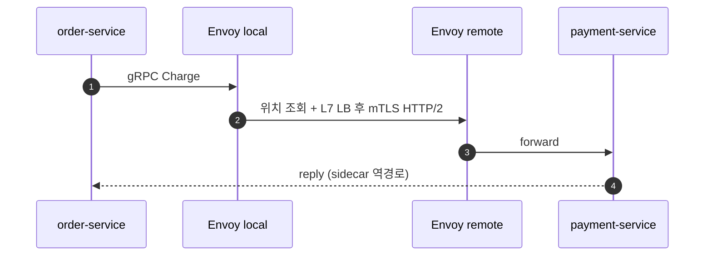
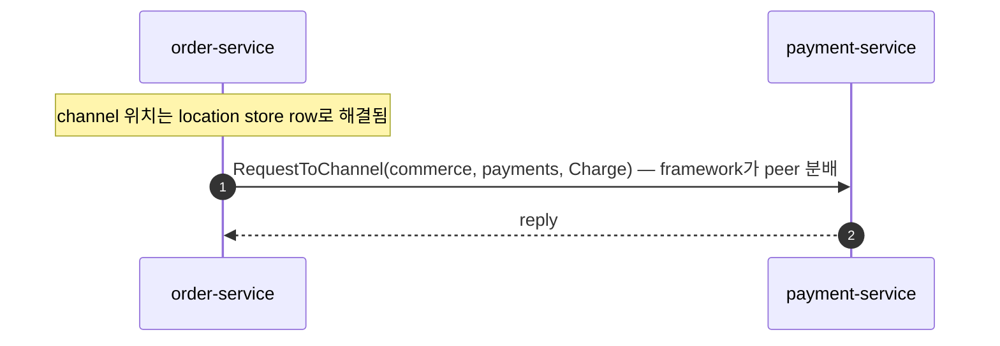

<!-- generated:start -->
<!-- 이 파일은 `common/guide/server/17-alternative.ko.md`에서 생성한다. 직접 고치지 않는다.
     고칠 곳은 공통 소스이고, `python3 doc/site/scripts/generate_language_guides.py`로 다시 만든다. -->
<!-- generated:end -->

<!-- framework-adapter-nav:start -->
[가이드 홈](README.ko.md) | [이전: 16. Options — 설정 목록과 기본값](16-options.ko.md) | [다음: 18. DI 컨테이너](18-di-container.ko.md)
<!-- framework-adapter-nav:end -->

<!-- language-switch:start -->
다른 언어로 보기 — [C#/.NET](../../../dotnet/guide/server/17-alternative.ko.md) · **C++** · [Java](../../../java/guide/server/17-alternative.ko.md) · [Kotlin](../../../kotlin/guide/server/17-alternative.ko.md) · [Node/TypeScript](../../../node/guide/server/17-alternative.ko.md)
<!-- language-switch:end -->

# 17. ZLink를 어디에 쓰나 — 내부 서비스 통신과 실시간 상태 서버 패턴

> **이 장에는 계약을 소유하는 스펙 문서가 없다.** 무엇을 고를지 판단하는 도입 서술이기
> 때문이다.
>
> **내부 서비스 통신이나 실시간 상태 서버를 만들면서 gRPC나 Akka/Orleans를 고민하고
> 있다면, ZLink가 그 자리를 대체할 후보다.**
>
> ZLink는 단순 RPC 라이브러리가 아니라, 백엔드에서 **논리 channel, 연결
> 수명, 동적 상태 단위(SPOT), pub/sub, 위치 기반 자동 연결을 한 framework 안에서 묶어 주는
> 서버 간·실시간 메시징 계층**이다. 특히 "서비스가 어디 있는지", "client가
> 어디에 연결돼 있는지", "room/zone/symbol 같은 상태 단위를 어떻게 직렬 처리할지" 가
> **반복 문제로 나올 때** 효과가 크다.
>
> [01. Overview](01-overview.ko.md) §2의 세 상황(실시간 게임 서버, 웹 서비스에
> 실시간 기능 추가, 이벤트 중심 업무 처리 단순화)이 "왜 필요한가"였다면, 이 챕터는
> 그 판단을 기술 선택 수준까지 내려서 확인하는 도입 판단 문서다. 실행 가능한 업무 흐름은 샘플 챕터가,
> 기능별 사용법은 05~12 챕터가 다룬다.

## 1. 한눈에 보는 사용처

먼저 경계를 잡는다. **모노리스나 모듈러 모노리스로 충분하면 ZLink를 먼저 적용하지
않는다.** 같은 프로세스 안의 모듈 호출은 함수 호출이면 되고, 서버 간 transport가
필요 없다. ZLink는 여러 프로세스/서버로 나뉘어야 하는 이유가 생겼을 때, 그 사이의
통신·연결·라우팅·상태 dispatch 복잡도를 줄이는 도구다.

| 상황 | ZLink이 좋은 이유 | 쓰는 기능 |
|------|--------------------|-----------|
| 내부 서비스끼리 자주 호출 | host/port/stub 대신 **channel name** 으로 호출 | channel + location store |
| 이벤트를 실시간으로 여러 서비스에 뿌림 | 별도 broker 없이 **transport fan-out** | fanout pub/sub |
| 게임 room·채팅 room·ride zone 같은 동적 상태 단위 | **단일 실행 큐**로 lock 없는 직렬 상태 처리 | SPOT |
| 모바일·게임 client와 장기 연결 | 연결 수명·framing·재접속 흐름을 framework가 소유 | STREAM |
| 연결 서버와 로직 서버를 분리 | actor id 기준 binding으로 **재접속 이전성** | session actor dispatch |
| **서로 다른 언어로 구현된 서비스끼리 호출** | 언어 중립 wire protocol + codec 위 같은 channel 계약으로 **상호 호출** | cross-language binding |
| 초저지연 HFT·durable queue·외부 공개 API | **ZLink 주 영역 아님** | gRPC/REST/Kafka/FIX 유지 |

## 2. 무엇을 덜 고민하게 되나 — 개발 모델

ZLink의 체감 장점은 인프라 구성 요소가 사라지는 데 있지 않고, **"개발자가 덜 고민한다"** 에 있다.
어플리케이션은 도메인 단위(channel/spot/session)만 다루고, 나머지는 framework가 처리한다.

- **channel name만 알고 호출한다** — 대상 host/port/stub를 모른다.
- **service location과 peer 분배**는 location store 기반 자동 연결이 맡는다([10-location](10-location.ko.md)).
- **request correlation과 reply 대기**는 framework가 맡는다.
- **client 연결 수명과 packet framing** 은 STREAM이 맡는다.
- **room/zone/symbol 상태 직렬성**은 SPOT 실행 큐가 맡는다.
- **재접속 후 actor/session binding** 은 framework가 이어 준다.
- **handler/filter/DI 모델**이 기존 웹 프레임워크 방식과 맞아 익숙하게 쓴다.

> ZLink는 이 문제들을 **없애는 게 아니라 호출자 밖으로 밀어낸다.** 위치·연결·
> correlation·dispatch 직렬성을 framework가 처리하므로, 어플리케이션 코드가 transport
> 설정이 아니라 **업무 흐름처럼** 보인다.

### 2.1 여러 언어가 한 channel 위에서 (cross-language)

ZLink는 한 언어 전용이 아니다. 호출 계약이 **언어 중립 wire protocol(ZMP) +
codec(protobuf/json/messagepack) + 논리 channel/packet 이름** 이라, 서로 다른
언어로 구현된 서비스가 **같은 channel 위에서 상호 호출**한다. 예를 들어 게임
시스템에서 **room 서버는 C++, API·매치메이킹 서버는 .NET 또는 Java** 로 두고 같은
channel/spot 계약으로 메시징할 수 있다.

- 언어 간 계약 = **packet 이름 + codec으로 인코딩된 DTO**(교차 언어는 protobuf
  권장, 또는 합의된 JSON/MessagePack 스키마). gRPC처럼 service-stub 코드 생성이나
  HTTP/2를 강제하지 않는다 — payload 스키마만 공유한다.
- 각 언어 binding은 같은 core(C ABI, ZMP) 위에 handler/SPOT/STREAM 표면을 올린다.
  그래서 handler 작성 언어가 달라도 wire 상으로는 같은 channel·packet 이다.

> **다른 언어 binding.** 같은 channel/packet 계약을 언어별 binding이 자기 언어로
> 구현한다. 이 가이드의 예제는 언어 탭으로 나뉘며, 어느 탭을 보든 같은 계약을
> 설명한다. cross-language는 ZLink의 **설계 목표**다 — 호출 계약이 binding 구현
> 언어와 무관하기 때문이다.

## 3. 이런 문제가 반복되면 ZLink 후보

기술명보다 **증상**으로 판단한다. 아래가 반복되면 ZLink가 후보다.

- 서비스마다 gRPC stub·channel factory·deadline·서비스 위치 조회 설정이 반복된다.
- Kubernetes L4 LB로 gRPC 부하가 고르게 안 퍼져 mesh를 고민한다.
- 게임 room·채팅 room·ride zone처럼 상태 단위를 lock으로 보호하고 있다.
- 재접속 때 client가 어느 서버에 연결돼 있었는지 Redis로 따로 관리한다.
- 실시간 이벤트 fan-out 때문에 Kafka를 쓰는데, 실제로는 replay가 필요 없다.
- 외부 client 연결·내부 서비스 호출·room 상태 처리가 서로 다른 framework로 흩어져
  있다.

## 4. ZLink이 하지 않는 것 — 경계

장점이 선명하려면 경계도 분명해야 한다. 다음은 그대로 두는 게 맞다.

| 요구 | ZLink 판단 |
|------|------------|
| 외부 공개 HTTP API | REST/gRPC 유지 |
| durable queue·replay·consumer offset | Kafka/NATS 유지 |
| DB 조회·geo-index·audit trail | DB/Redis/event store 유지 |
| HFT 마이크로초 matching loop | Disruptor/Aeron/FIX 유지 |
| 내부 서비스 통신 + 실시간 상태 dispatch | **ZLink 적합** |

요지: ZLink는 transport·dispatch 계층이지 **datastore·durable log·HFT 버스가
아니다.** 분산 데이터 일관성(saga·outbox·idempotency)·영속·중복 제어 같은
도메인 난제는 그대로 어플리케이션과 인프라가 책임진다.

## 5. 참고 — gRPC·service mesh 스택과의 비교

§1의 "내부 서비스끼리 자주 호출" 이 왜 ZLink 후보인지, gRPC 스택과 비교해
근거를 본다.

### 5.1 gRPC 단독 구성의 한계

gRPC 자체의 성능은 우수하다. 문제는 이런 류의 서비스를 **"프로덕션급"** 으로 만들려면
공식 베스트프랙티스가 곧바로 추가 인프라를 요구한다는 점이다.

- **channel/stub 재사용 강제.** "Always re-use stubs and channels when possible" —
  호출마다 channel을 만들면 지연이 크게 늘어 channel factory/pool로 수명을 직접
  관리한다. ([grpc.io performance](https://grpc.io/docs/guides/performance/))
- **deadline을 매 호출에.** 단일 느린 RPC가 상위 서비스를 막지 않도록 deadline을
  건다. ([Microsoft Learn](https://learn.microsoft.com/en-us/aspnet/core/grpc/performance))
- **기본 로드밸런서(L4, connection 단위 분배)로는 gRPC 부하가 고르게 안 흩어진다.**
  gRPC는 HTTP/2 위에서 연결 하나를 오래 유지한 채 여러 요청을 multiplex하므로, L4
  로드밸런서에는 연결이 1개로만 보여 그 연결이 처음 붙은 서버로 요청이 몰린다.
  HTTP/2 기반인 이상 요청 단위로 분배하는 L7 분배가 사실상 필수라, 보통 아래 중
  하나를 추가로 도입한다.
  - **client-side LB**: 클라이언트가 서버 목록을 보관하고 직접 번갈아 호출하는 방식.
  - **headless service**(Kubernetes): 서비스를 단일 가상 IP 하나가 아니라 **뒤에
    있는 각 파드의 IP 목록**으로 노출해, 클라이언트가 직접 골고루 분배하게 하는
    방식.
  - **Envoy/Istio service mesh sidecar**: 각 서비스와 함께 자동 배치되는 **프록시**가
    요청 단위(L7) 분배와 암호화(mTLS)를 대신 처리하는 방식.
  ([Kubernetes 블로그](https://kubernetes.io/blog/2018/11/07/grpc-load-balancing-on-kubernetes-without-tears/))
- **그 밖에** 서비스 위치 조회(Eureka/Consul/xDS), retry·hedging, `.proto` 파이프
  라인, mTLS, 그리고 **이벤트 fan-out은 또 별도 broker**(Kafka/NATS)로 간다.

L7 분배는 연결이 아니라 요청 하나하나를 보고 나누는 방식이다 — mesh sidecar나
client-side LB가 이 역할을 한다.



즉 "gRPC를 쓴다"는 실제로 **gRPC + L7 LB(보통 mesh) + 서비스 위치 조회 + event broker +
proto 파이프라인**을 함께 운영한다는 뜻이다.

### 5.2 배치 구조 비교

```text
[classic] gRPC + service mesh + broker + WS edge

  +------------------+          +------------------+
  | order-service    |          | payment-service  |
  | app + gRPC stub  |          | app + gRPC server|
  | Envoy sidecar    +--mTLS--->| Envoy sidecar    |
  +--------+---------+          +---------+--------+
           |                              |
           +-------------+----------------+
                         |
                +--------v---------+
                | service mesh ctl |
                | discovery + L7   |
                +------------------+

  +------------------+          +------------------+
  | event broker     |          | WS edge gateway  |
  +------------------+          +------------------+
```

```text
[ZLink] ZLink Framework  + location store

  +------------------+          +------------------+
  | order-service    |          | payment-service  |
  | app              | channel  | app              |
  | ZLink Framework  +--------->| ZLink Framework  |
  | channel client   | name     | channel server   |
  +--------+---------+          +---------+--------+
           |                              |
           +-------------+----------------+
                         |
                +--------v---------+
                | location store   |
                | descriptor rows  |
                +------------------+

  +------------------+          +------------------+
  | fanout channel   |          | STREAM session   |
  +------------------+          +------------------+
```

Envoy sidecar와 mesh control plane(서비스 위치 조회·L7 LB·mTLS) 자리가 framework와
location store 한 겹으로 들어온다. broker와 WS edge는 요구가 단순한 실시간 전파·연결
수용이면 fanout channel·STREAM으로 흡수할 수 있고, 영속 큐·replay 나 HTTP edge
정책이 필요하면 그대로 둔다.

### 5.3 한 번의 호출이 지나는 경로





### 5.4 접히는 항목 요약

| gRPC 베스트프랙티스/필요 인프라 | ZLink에서 | 비고 |
| --- | --- | --- |
| "stub/channel을 재사용하라" | route client가 DI singleton이고 MeshNode 연결 수명은 framework가 관리 | 호출마다 만들 일 없음 |
| RPC deadline | `RequestToChannel(...).Timeout(...)` | reply 대기 시간 |
| L7 로드밸런싱(Envoy/Istio) | channel name + store 자동 연결이 peer 분배 | sidecar 불필요 |
| interceptor | handler filter | [5](05-channel-messaging.ko.md) §5 |
| 이벤트 broker(Kafka/NATS) | fanout channel pub/sub | 실시간 fan-out 한정. 영속/replay는 broker 유지 |
| 통합 관측(mesh telemetry) | 상태 status stream과 표준 진단 | [11. Monitoring](11-monitoring.ko.md) |
| 양방향 streaming | STREAM session | 외부 client 수용. HTTP edge 정책은 별도 |

이 비교는 우열을 일반화하려는 것이 아니다. gRPC는 외부 공개 API, 표준 RPC 계약, 조직
표준 tooling이 중요할 때 여전히 좋은 선택이다. 성능도 payload 크기·codec·네트워크·peer
수·배포 방식에 따라 달라지므로 수치로 단정하지 않는다. 여기서 말하는 이득은 **호출 경로와
운영 컴포넌트가 줄어든다**는 것이다 — HTTP/2 프록시·stub·별도 broker를 지나던 구성이
framework와 location store 한 겹으로 접힌다. 조직 보안 정책이나 외부 ingress가 필요하면
기존 mesh·LB를 그대로 함께 둔다.

## 6. 참고 — 분산 actor 프레임워크(Orleans/Akka)와의 비교

[01. Overview](01-overview.ko.md) §2의 ④ stateful actor 패턴에 실제로 쓰이는 대표
프레임워크가 Microsoft Orleans와 Akka다. ZLink의 SPOT/actor는 같은 프리미티브
(mailbox 직렬화 + 위치 투명)를 제공하므로, 이 워크로드에서 후보가 겹친다.

### 6.1 Orleans/Akka 단독 구성의 한계

Orleans·Akka는 **actor 프리미티브 하나에** 깊이 집중한다. 그런데 이 가이드가 다루는
"실시간 상태 서버 하나"를 만들려면 actor 밖의 것들을 여전히 따로 조립해야 한다.

- **외부 client 연결이 없다.** 둘 다 client가 직접 grain/actor를 호출하는 프로토콜을
  내장하지 않는다. 웹 client는 보통 SignalR이나 별도 WebSocket 서버를 앞에 두고,
  그 서버가 actor를 호출하는 구조로 조립한다.
- **폴리글랏이 아니다.** Orleans는 `.NET` 전용, Akka는 JVM 전용이다(Akka.NET은 별도
  포트 구현). C++ room 서버와 `.NET` API 서버를 같은 계약으로 묶는 조합은 설계
  범위 밖이다.
- **서비스 간 메시징은 actor 호출과 별개다.** grain-to-grain 호출은 있지만, channel
  이름 기반 요청/응답이나 fanout 같은 일반 서비스 메시징 표면은 없다 — 필요하면
  gRPC나 메시지 브로커를 별도로 추가한다.

### 6.2 배치 구조 비교

```text
[Orleans/Akka] actor cluster with separate edge

  +------------------+     +------------------+
  | web framework    |     | SignalR /        |
  | edge             +---->| WebSocket edge   |  (client gateway)
  +--------+---------+     +------------------+
           |
  +--------v---------+
  | Orleans/Akka     |
  | actor cluster    |
  | storage provider |
  | persistence      |
  +------------------+
```

```text
[ZLink] integrated stack

  +-----------------------------------------------+
  | web framework (ASP.NET Core / Spring / …)     |
  | STREAM clients / SPOT and actor state         |
  | channel messaging / location store            |
  +-----------------------------------------------+
```

client 연결·서비스 메시징·actor 상태가 서로 다른 세 계층에서 하나로 내려온다.
다만 이 그림이 감추지 않는 것도 있다 — Orleans/Akka가 오랜 기간에 걸쳐 미리
구현해 둔 persistence 커넥터·reminder 스케줄러 같은 부가 도구까지 하나로 내려오는
건 아니다. 아래 표에서 어디까지가 원시 기능 차이고 어디부터가 이런 미리 구현된
도구의 유무 차이인지 나눠서 본다.

### 6.3 기능 비교 — 유리한 점과 불리한 점

| 항목 | Orleans / Akka | ZLink |
| --- | --- | --- |
| actor 프리미티브(mailbox 직렬화 + 위치 투명) | ✅ | ✅ (SPOT/actor) |
| 외부 client 연결 내장 | ❌ SignalR/WS 별도 조립 | ✅ STREAM |
| 폴리글랏 | ❌ 단일 언어(.NET 또는 JVM) | ✅ |
| 서비스 간 typed 메시징 + 토폴로지 선언 | ❌ 별도 조립(gRPC 등) | ✅ channel + location store |
| actor 상태 persistence | ✅ 성숙한 provider 생태계 | ⚠️ lifecycle 훅은 있고 미리 구현된 storage 커넥터는 없다(아래 ①) |
| relocation 뒤 Spot timer 복원 | ✅ | ✅ 등록과 pending tick을 payload에 포함해 자동 복원한다 |
| 없는 Actor를 만들거나 기존 Actor를 사용 | ✅ | ✅ `get_or_create`가 같은 ActorId의 동시 생성을 조정한다 |
| dormant actor를 예정 시각에 깨움(reminder) | ✅ API 한 콜(Orleans Reminder) | ❌ 전용 API 없음 — 분산 scheduler로 구성한다(아래 ②) |
| 분산 트랜잭션 | Orleans 실험적 지원 | ❌ 없음(saga는 앱이 구성) — 이는 실제 프로토콜 난이도의 문제라 기존 primitive로 우회할 수 없다 |
| 라이선스 | Orleans MIT / Akka BSL(연매출 기준 유료 트리거) | framework는 FSL-1.1-ALv2, core·binding은 MPL-2.0 — 매출 기준 유료 트리거가 없다(§7) |
| 실전 검증 기간 | 10년 이상(Halo, Microsoft 365, Skype) | 짧음 — 이 프로젝트 자체가 진행 중 |

① **actor 상태 persistence** — `on_create`·`on_closing` 같은 lifecycle 훅은
제공하지만, 어느 DB에 어떻게 저장할지는 application이 정한다. 미리 구현된 storage
커넥터 모음이 없다는 뜻이다([ShoppingMall](../../../common/sample/event/shoppingmall.ko.md)이 그 예다).

② **reminder** — Quartz.NET Clustered·Hangfire 같은 분산 scheduler가 정해진 시각에 Actor
`get_or_create`나 message를 실행하도록 application이 구성한다.

**결론.** "실시간 상태 서버 하나를 조립 없이 만든다"는 이 가이드의 워크로드에는
ZLink가 대체 후보다. Actor·Spot lifecycle과 relocation timer 복원은 Framework가 제공한다.
영속 상태 provider와 예정 시각 reminder는 application이 별도 저장소와 scheduler로 구성해야 한다.
분산 transaction도 제공하지 않는다. 기존 Orleans/Akka 시스템의 전환 여부는 이 차이와 운영 경험을
함께 비교해 결정한다.

## 7. 라이선스 — 쓰는 데 드는 비용

기술 선택에는 라이선스 조건이 함께 들어간다. Akka는 연매출이 기준선을 넘으면 상용 계약이
필요한 BSL이고, Orleans는 MIT다. ZLink는 계층마다 라이선스가 다르다.

| 계층 | 라이선스 |
| --- | --- |
| `core`, `bindings` — 메시징 엔진과 언어별 native binding | [Mozilla Public License 2.0](../../../../../../LICENSE) |
| `framework` — 이 가이드가 다루는 SPOT/actor·channel messaging·STREAM·drain | [Functional Source License 1.1, ALv2 Future License](../../../../../LICENSE) |
| 각 언어의 `http-client` 패키지 | Apache License 2.0 |

**FSL-1.1-ALv2는 한 줄로 이렇다.** ZLink와 경쟁하는 제품으로 파는 것만 막고, 나머지는 다
허용하며, 각 릴리스는 공개 2년 뒤 Apache-2.0이 된다.

| | |
| --- | --- |
| 쓸 수 있다 | 자기 제품·서비스를 만들어 배포하고 판매하는 것, 사내 시스템, 교육·연구 |
| 쓸 수 없다 | ZLink 자체를 대체하거나 실질적으로 같은 기능을 제공하는 상용 제품·서비스 |
| 비용 | 없다. 사용료도, 연매출 같은 유료 전환 기준선도 없다 |
| 2년 뒤 | 그 릴리스가 Apache-2.0으로 자동 전환된다 |

**결론.** 게임 서버든 업무 서버든 만들어서 서비스하고 판매하는 데 비용도 제약도 없다. Akka
BSL처럼 매출이 커지면 유료로 바뀌는 트리거가 없다.

`core`와 `bindings`가 MPL-2.0인 이유는 `core`가 MPL-2.0인 [libzmq](https://github.com/zeromq/libzmq)
v4.3.5에서 출발했기 때문이다. `http-client`는 각 플랫폼의 통상적인 HTTP client 라이브러리를
감싼 얇은 계층이라 Apache-2.0이다.

정확한 조건은 [framework/LICENSE](../../../../../LICENSE)가, 정책 배경은
[doc/license/README.md](https://github.com/zlink-systems/zlink/blob/main/doc/license/README.md)가 소유한다.

## 8. 관련 문서

- 공통 업무 시나리오: [Framework Common Sample Scenarios](../../../common/sample/README.ko.md)
- 사용 방법: [Channel Messaging](05-channel-messaging.ko.md)
- 표면 매핑: [05-channel-messaging](05-channel-messaging.ko.md) §0, [13. Interface 카탈로그](13-interface-catalog.ko.md) §1.6
- 실행 코드로 보는 샘플: [14-samples](14-samples.ko.md)

### 참고 자료

- [gRPC Performance Best Practices](https://grpc.io/docs/guides/performance/)
- [Performance best practices with gRPC (.NET)](https://learn.microsoft.com/en-us/aspnet/core/grpc/performance)
- [gRPC Load Balancing on Kubernetes without Tears](https://kubernetes.io/blog/2018/11/07/grpc-load-balancing-on-kubernetes-without-tears/)
- [System Design Study: Netflix's adoption of Service Mesh](https://vivekbansal.substack.com/p/system-design-study-netflixs-adoption)
- [Scaling Microservices: Lessons from Netflix, Uber, Amazon, and Spotify](https://www.netguru.com/blog/scaling-microservices)
- [Orleans overview (Microsoft Learn)](https://learn.microsoft.com/en-us/dotnet/orleans/overview)
- [Akka License Change의 영향 (Coralogix)](https://coralogix.com/blog/akka-license-change/)
