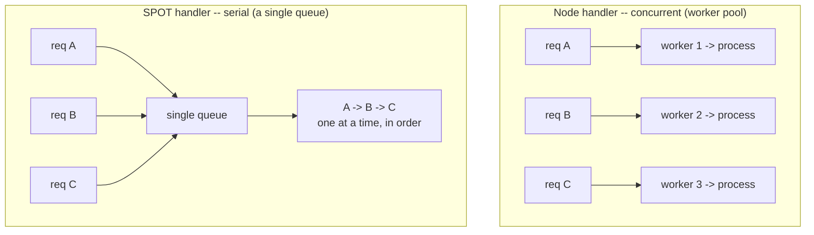
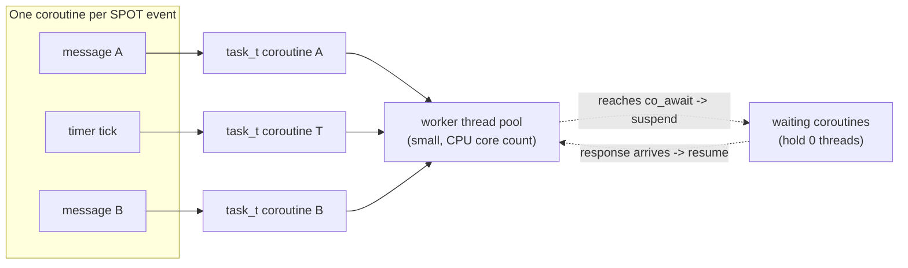
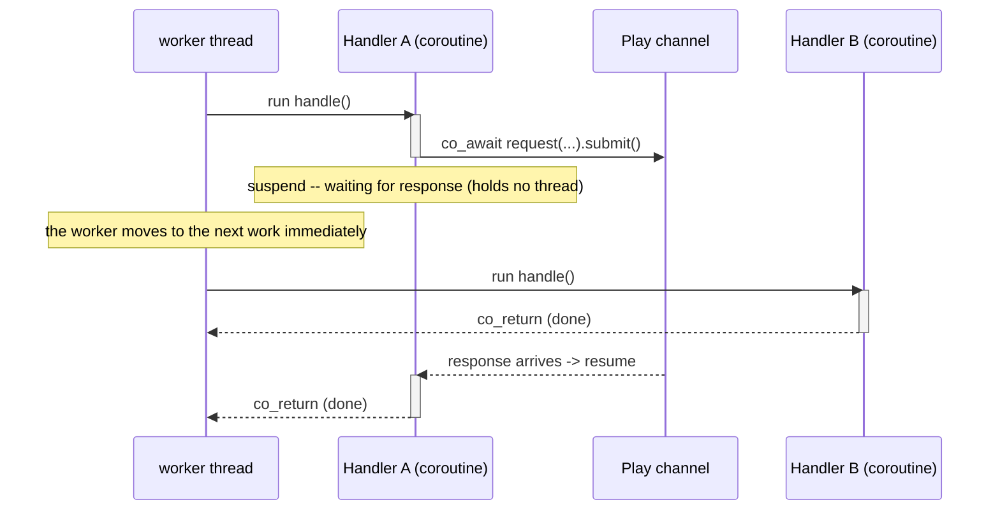
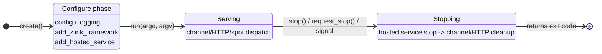

<!-- framework-adapter-nav:start -->
[Guide Home](../../../index.en.md) | [Previous: 3. Core Concepts](03-concepts.en.md) | [Next: 18. DI Container](18-di-container.en.md)
<!-- framework-adapter-nav:end -->

# 21. Execution & Configuration Model

> **The document that owns this chapter's contract** — covered by the
> [C++ common runtime public contract](../../../common/spec/server/languages/cpp/interfaces/01-common-runtime.en.md)
> and the [Async Execution Policy](../../../common/spec/05-async-execution-policy.ko.md).
> This chapter explains how the C++ framework actually executes and configures those
> concepts.

How the C++ framework actually executes and configures the concepts. The concepts
themselves are covered by [3. Core Concepts](03-concepts.en.md); this chapter explains what
execution model and lifecycle they take in C++ code.

This is the common behavior underpinning the five concepts above. It's covered once here;
the details are owned by each chapter.

## 1. The Handler Model — Node Handler vs. SPOT Handler

Handlers split into two kinds by execution context, and their structure and lifetime are
completely different.

- **A node handler (channel/HTTP)** — an independent class. `request_type` /
  `reply_type` / `topic_name` members are the contract, and it receives dependencies
  through `dependency_types` + constructor injection. Its lifetime is **transient** (fresh
  per request), and its execution is **concurrent** (worker pool). That's why you don't put
  mutable domain state in a handler member.
- **A Spot handler** — inherits `spot_t` or `entry_spot_t` and registers with
  `add_handler<&T::method>()` or `add_subscribe<&T::method>()` in `configure()`. An Actor
  payload also registers a containing Spot member in the same registry, with
  `add_actor_send<&T::method>()` or `add_actor_request<&T::method>()`.

| | Node handler (channel/HTTP) | Entry spot | Room spot |
|---|---|---|---|
| Base | An independent class | Inherits `entry_spot_t` | Inherits `spot_t` |
| Lifetime | Transient (per request) | Same as the node (persistent) | Same as the state unit (persistent) |
| Execution | Concurrent (worker pool) | Lifecycle on the Entry Spot queue, Actor payload on each Actor's queue | Serial on the Spot application queue |
| Shared state | Not kept in the handler | Splits ownership between Entry lifecycle state and per-Actor state | Safe within the same Spot turn |
| Role | Process/delegate the request | Assignment, matching, allocation | Owns and processes domain state |
| Contract | `request_type`/`reply_type`/`topic_name` | Lifecycle members + Actor-member registration in the Spot registry | `configure()` + Spot handler registry + lifecycle members |
| Outbound | DI's `request_client_t` / `route_client_t` | The owner MeshNode's context | The owner MeshNode's context |

**Comparing the execution models** — how the same 3 requests run through each handler:



A node handler is processed **concurrently** by a different worker per request, so
mutable state in the handler causes contention. A SPOT handler is processed **one at a
time** through a single queue, so its state needs no lock.

Put mutable domain state (a game room, etc.) in a **SPOT**, immutable configuration
(topology) in a singleton service, and shared infrastructure (cache, counter) in a
singleton with its own synchronization. Writing a SPOT handler and its serial-execution
guarantee are covered in [Chapter 6](06-spot.en.md); exposing a channel handler in
[Chapter 5](05-channel-messaging.en.md).

**Handler exposure is explicit** — put it in a group with
`options.handlers().group("api").add<T>()`, then attach it via
`use_handler_group("api")` in channel registration. At the startup phase, duplicate
packets within the same handler group, duplicate registry handlers, a missing connection
route for a client/subscriber, and disallowed return types are all rejected.

## 2. The Execution Model — `task_t` / `result_t`, `co_await`

Async values across the framework are expressed as `task_t<T>`, and success/failure as
`result_t<T>`. There's one rule -- **`co_await` on the runtime (handler) thread, blocking
(`.result()`) only in test/client scenarios.** A failure is thrown as
`framework_exception_t` (`kind()`/`is_retriable()`) on the `co_await` path, and read via
`error()` on the `result_t` path.

```cpp
zlink::framework::task_t<create_game_http_res_t>
handle (const create_game_http_req_t &request)
{
    auto room = co_await _client
                  .request ("tictactoe.application", "tictactoe.play",
                            create_game_req_t{request.game_name})
                  .submit<create_game_res_t> ();
    co_return create_game_http_res_t{room.room_id,
                                     room.game_name,
                                     room.owner_play_endpoint,
                                     room.play_endpoints,
                                     room.play_nodes,
                                     room.required_level};
}
```

A channel/HTTP handler runs on the **worker pool.** The worker pool is configured from
`min_threads`, `max_threads`, `idle_timeout`, and `max_queue_length` in the settings
`options.configure_worker()` returns. When a handler reaches `co_await`, only the
coroutine pauses (suspends) -- the execution thread goes to process another queue item.
The same Spot queue doesn't start the next callback until that handler completes.

The core idea is **one coroutine per event, threads shared** -- each of a SPOT's events
(message, timer) becomes its own `task_t` coroutine, multiplexed onto a small pool of
worker threads, and a coroutine stuck at `co_await` **releases** its thread (it's not
blocking). So a handful of threads carry thousands of waiting coroutines.



The timeline below views the same flow chronologically -- when A suspends via `co_await`,
the same thread processes B right away, and A resumes once its response arrives.



So async calls are written **top to bottom, like synchronous code**, with no callbacks,
while a handful of workers handle huge numbers of concurrent requests. Writing the same
code with `.result()` puts an entire thread to sleep, so it's forbidden inside a handler.

## 3. The `app_t` Lifecycle

`app_t` owns the host lifecycle -- configure -> serving -> shutdown. `run(argc, argv)` is
blocking, and its return value is the exit code.



- **Configure phase** — finish every declaration before `run`. An invalid configuration
  is rejected with an exception at configuration time or at the start of `run`.
- **Shutdown** — `request_stop()` is an async request (e.g., a signal handler);
  `stop()` is a synchronous stop. On shutdown, **registered hosted services are `stop()`ed
  in reverse order** (channel/stream/HTTP are also folded into hosted services and cleaned
  up through the same path).
- Fold background work into the lifecycle via `hosted_service_t`.

## 4. Configuration: DI Container / Entry Points / module_t

- **DI container** — register with `add_singleton/scoped/transient` on
  `options.services()`, and the consuming side receives it via `dependency_types` +
  constructor injection (or `get_required<T>()`). The full API is in
  [Chapter 18, DI Container](18-di-container.en.md).
- **Map of configuration surfaces** — the `app_t` entry points split by role:

  | Entry point | Role | Covered by |
  |--------|------|-----------|
  | `app.config()` / `app.logging()` | Config, logging | [Chapter 19](19-configuration.en.md) / Chapter 12 |
  | `app.monitoring()` / `app.metrics()` / `app.health()` | Observation, status | Chapter 12 |
  | `app.add_zlink_framework(lambda)` | **Declares the zlink topology** (channel/SPOT/stream/registry) | Chapters 6-11 |
  | `app.add_module(...)` / `add_zlink_framework<TModule>()` | Configuration packaging | Below |
  | `app.advanced()` | Direct access to the services/handlers/zlink builder (an escape hatch) | — |

- **module_t** — bundles feature-scoped configuration (services, zlink topology,
  handlers) into one reusable unit. Implement `configure_services` /
  `configure_zlink` / `configure_handlers` / `configure_monitoring` and attach it with
  `app.add_zlink_framework<TModule>()`.

[Next: DI Container ->](18-di-container.en.md)

## 5. Related Documents

- The formal contract: [C++ common runtime public contract](../../../common/spec/server/languages/cpp/interfaces/01-common-runtime.en.md)
- The async terminal convention: [Async Execution Policy](../../../common/spec/05-async-execution-policy.ko.md)
- DI injection rules: [18. DI Container](18-di-container.en.md)
