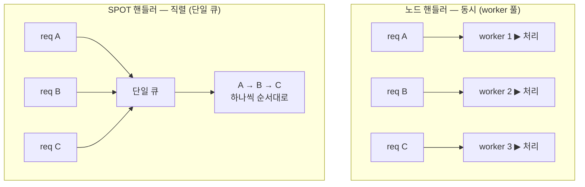
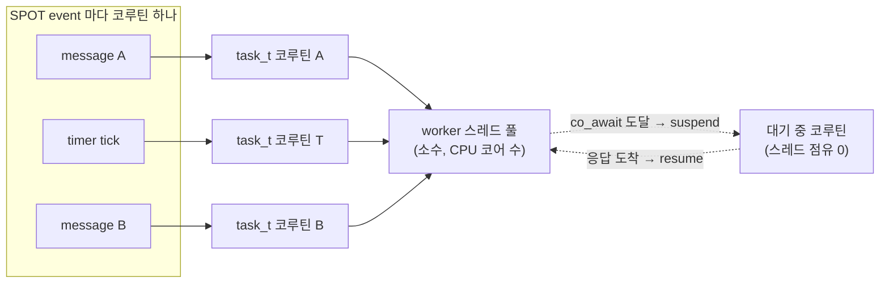
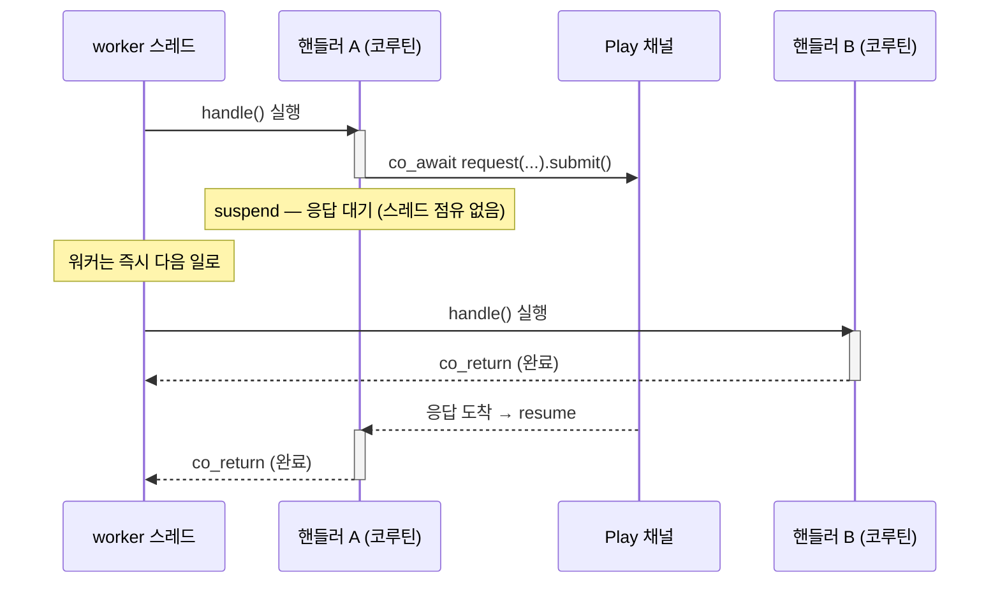
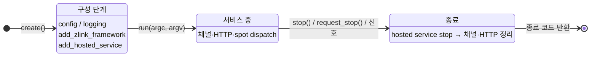

<!-- framework-adapter-nav:start -->
[가이드 홈](../../../index.ko.md) | [이전: 3. 핵심 개념](03-concepts.ko.md) | [다음: 18. DI 컨테이너](18-di-container.ko.md)
<!-- framework-adapter-nav:end -->

# 21. 실행·구성 모델

> **이 장의 계약 소유 문서** — [C++ 공통 runtime 공개 계약](../../../common/spec/server/languages/cpp/interfaces/01-common-runtime.ko.md)과
> [비동기 실행 정책](../../../common/spec/05-async-execution-policy.ko.md)이 다룬다. 이
> 챕터는 C++ framework가 그 개념을 실제로 실행하고 구성하는 방식을 설명한다.

C++ framework가 개념을 실제로 실행하고 구성하는 방식이다. 개념 자체는
[3. 핵심 개념](03-concepts.ko.md)이 다루고, 이 장은 그것이
C++ 코드에서 어떤 실행 모델과 수명주기로 나타나는지 설명한다.


위 다섯 개념을 받치는 공통 동작이다. 여기서 한 번 짚고, 상세는 각 챕터가 소유한다.

## 1. 핸들러 모델 — 노드 핸들러 vs SPOT 핸들러

핸들러는 실행 컨텍스트에 따라 두 종류로 나뉘고, 구조와 수명이 완전히 다르다.

- **노드 핸들러(채널·HTTP)** — 독립 클래스. `request_type` / `reply_type` /
  `topic_name` 멤버가 계약이고, `dependency_types` + 생성자 주입으로 의존성을 받는다.
  수명은 **transient**(요청마다 새로), 실행은 **동시**(worker 풀). 그래서 가변
  도메인 상태를 핸들러 멤버에 두지 않는다.
- **Spot 핸들러** — `spot_t` 또는 `entry_spot_t`를 상속하고 `configure()`에서
  `add_handler<&T::method>()`나 `add_subscribe<&T::method>()`로 등록한다. Actor payload도
  같은 registry에서 `add_actor_send<&T::method>()` 또는
  `add_actor_request<&T::method>()`로 containing Spot member를 등록한다.

| | 노드 핸들러 (채널·HTTP) | entry spot | room spot |
|---|---|---|---|
| 기반 | 독립 클래스 | `entry_spot_t` 상속 | `spot_t` 상속 |
| 수명 | transient (요청마다) | 노드와 동일 (영속) | 상태 단위와 동일 (영속) |
| 실행 | 동시 (worker pool) | lifecycle은 Entry Spot queue, Actor payload는 각 Actor queue | Spot application queue에서 직렬 |
| 공유 상태 | 핸들러에 두지 않음 | Entry lifecycle 상태와 Actor별 상태의 owner를 구분 | 같은 Spot turn에서 안전 |
| 역할 | 요청 처리·위임 | 배정·매칭·할당 | 도메인 상태 소유·처리 |
| 계약 | `request_type`/`reply_type`/`topic_name` | lifecycle member + Spot registry의 Actor member 등록 | `configure()` + Spot handler registry + lifecycle member |
| outbound | DI의 `request_client_t` / `route_client_t` | owner MeshNode context | owner MeshNode context |

**실행 모델 비교** — 같은 3개 요청이 두 핸들러에서 어떻게 도는가:



노드 핸들러는 요청마다 다른 worker 가 **동시에** 처리하니 핸들러에 가변 상태를 두면
경합이 난다. SPOT 핸들러는 단일 큐로 **한 번에 하나씩** 처리하니 상태에 lock 이
필요 없다.

가변 도메인 상태(게임 룸 등)는 **SPOT**, 불변 구성(topology)은 싱글톤 서비스, 공유
인프라(캐시·카운터)는 싱글톤 + 자체 동기화에 둔다. SPOT 핸들러 작성과 직렬 실행
보장은 [6장](06-spot.ko.md), 채널 핸들러 노출은 [5장](05-channel-messaging.ko.md).

**handler 노출은 명시적이다** — `options.handlers().group("api").add<T>()` 로 group 에 넣고,
channel 등록에서 `use_handler_group("api")` 로 붙인다. 시작 단계에서 같은 handler
group 안 packet 중복, registry handler 중복, client/subscriber 의 연결 경로 누락,
허용되지 않는 반환형 등이 거부된다.

## 2. 실행 모델 — `task_t` / `result_t`, `co_await`

프레임워크 전반의 비동기 값은 `task_t<T>`, 성공/실패는 `result_t<T>` 로 표현된다.
규칙은 하나다 — **런타임(핸들러) 스레드에서는 `co_await`, blocking(`.result()`)은
테스트·클라이언트 시나리오에서만.** 실패는 `co_await` 경로에서
`framework_exception_t`(`kind()`/`is_retriable()`)로 던져지고, `result_t` 경로에서는
`error()` 로 조회한다.

```cpp
zlink::framework::task_t<create_game_http_res_t>
handle (const create_game_http_req_t &request)
{
    auto room = co_await _client
                  .request ("tictactoe.application", "tictactoe.play",
                            create_game_req_t{request.game_name})
                  .submit<create_game_res_t> ();
    co_return create_game_http_res_t{room.room_id,
                                     room.game_name,
                                     room.owner_play_endpoint,
                                     room.play_endpoints,
                                     room.play_nodes,
                                     room.required_level};
}
```

채널·HTTP 핸들러는 **worker 풀**에서 실행된다. `options.configure_worker()`가 반환하는
설정의 `min_threads`, `max_threads`, `idle_timeout`, `max_queue_length`로 worker 풀을
구성한다. 핸들러가 `co_await` 에 도달하면
코루틴만 멈추고(suspend) 실행 스레드는 다른 큐 항목을 처리한다. 같은 Spot 큐는 그
handler 완료 전까지 다음 callback 을 시작하지 않는다.

핵심은 **이벤트마다 코루틴 하나, 스레드는 공유**다 — SPOT 의 event(message·timer)는
각각 `task_t` 코루틴이 되어 소수의 worker 스레드에 다중화되고, `co_await` 에 걸린
코루틴은 스레드를 **놓는다**(blocking 아님). 그래서 스레드 몇 개로 대기 중인 코루틴
수천 개를 떠받친다.



아래 타임라인은 같은 흐름을 시간순으로 본 것이다 — A 가 `co_await` 로 suspend 되면
같은 스레드가 즉시 B 를 처리하고, A 는 응답이 오면 resume 된다.



그래서 비동기 호출을 콜백 없이 **동기식 코드처럼 위에서 아래로** 쓰면서도, worker
몇 개로 수많은 동시 요청을 처리한다. 같은 코드를 `.result()` 로 쓰면 스레드 하나가
통째로 잠들기 때문에 핸들러 안에서 금지한다.

## 3. app_t 수명주기

`app_t` 는 구성 → 서비스 → 종료의 호스트 수명주기를 소유한다. `run(argc, argv)` 는
블로킹이고 반환값이 종료 코드다.



- **구성 단계** — `run` 전에 모든 선언을 끝낸다. 잘못된 구성은 구성 시점이나 `run`
  시작에서 예외로 거부된다.
- **종료** — `request_stop()` 은 비동기 요청(신호 핸들러 등), `stop()` 은 동기 정지.
  종료 시 **등록된 hosted service 를 역순으로 `stop()`** 한다(채널·stream·HTTP 도
  hosted service 로 편입돼 같은 경로로 정리된다).
- 백그라운드 작업은 `hosted_service_t` 로 수명주기에 편입시킨다.

## 4. 구성: DI 컨테이너 · 진입점 · module_t

- **DI 컨테이너** — `options.services()` 에 `add_singleton/scoped/transient` 로
  등록하고, 소비 측은 `dependency_types` + 생성자 주입(또는 `get_required<T>()`)으로
  받는다. 전체 API 는 [18장 DI 컨테이너](18-di-container.ko.md).
- **구성 표면 지도** — `app_t` 진입점이 역할별로 나뉜다:

  | 진입점 | 역할 | 다루는 장 |
  |--------|------|-----------|
  | `app.config()` / `app.logging()` | 설정·로그 | [19장](19-configuration.ko.md) · 12장 |
  | `app.monitoring()` / `app.metrics()` / `app.health()` | 관측·상태 | 12장 |
  | `app.add_zlink_framework(람다)` | **zlink 토폴로지 선언** (채널/SPOT/stream/registry) | 6~11장 |
  | `app.add_module(...)` / `add_zlink_framework<TModule>()` | 구성 패키징 | 아래 |
  | `app.advanced()` | services/handlers/zlink builder 직접 접근 (탈출구) | — |

- **module_t** — 기능 단위 구성(서비스·zlink 토폴로지·핸들러)을 한 단위로 묶어
  재사용한다. `configure_services / configure_zlink / configure_handlers /
  configure_monitoring` 을 구현하고 `app.add_zlink_framework<TModule>()` 로 붙인다.

[다음: DI 컨테이너 →](18-di-container.ko.md)

## 5. 관련 문서

- 정식 계약: [C++ 공통 runtime 공개 계약](../../../common/spec/server/languages/cpp/interfaces/01-common-runtime.ko.md)
- 비동기 terminal 규약: [비동기 실행 정책](../../../common/spec/05-async-execution-policy.ko.md)
- DI 주입 규칙: [18. DI 컨테이너](18-di-container.ko.md)
