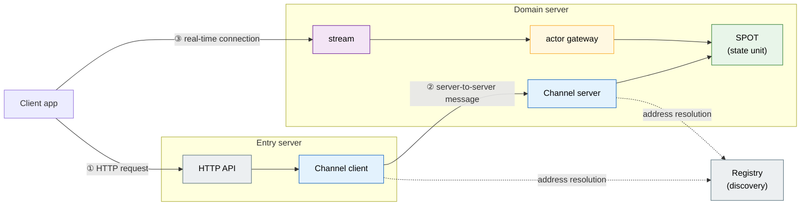
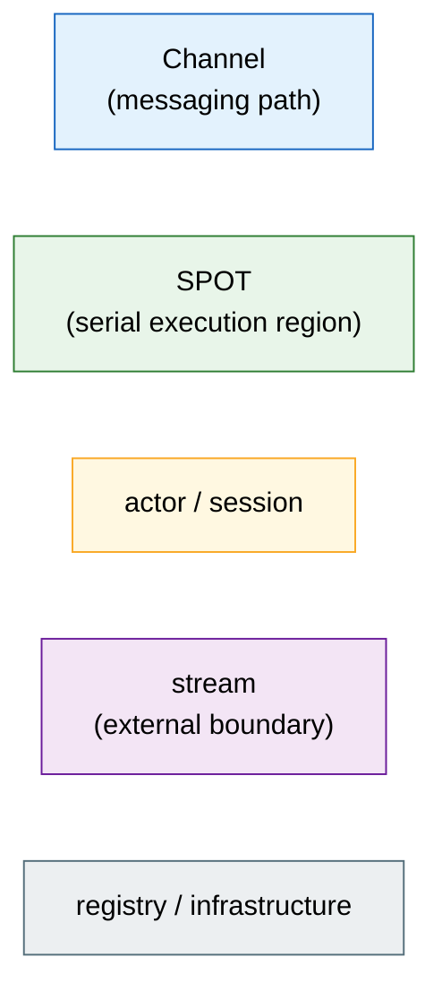

# ZLink Framework C++ — User Guide

A C++ application framework for building **server systems where real-time messaging
matters** out of several cooperating processes.

```cpp
#include <zlink/framework.hpp>

int main (int argc, char **argv)
{
    auto app = zlink::framework::app_t::create ();
    app.add_zlink_framework ([] (zlink::framework::zlink_framework_options_t &options) {
        options.http ()
          .listen ("http://0.0.0.0:8080")
          .map_post<open_conversation_http_handler_t> ("/conversations");
    });
    return app.run (argc, argv);
}
```

Register one handler class and the framework handles message decoding, routing, and
encoding.

---

## What This Framework Builds

It's designed for systems where several server processes split responsibilities and
cooperate, and where a state change must reach the client in real time.

| Domain | Core scenario |
|--------|--------------|
| **Real-time games** | Create room → player joins → game state updates → push to client |
| **Customer support chat** | Open conversation → assign agent → relay messages → push conversation state |
| **Order workflow** | Accept order → process in stages → change state → notify client |
| **Delivery/dispatch** | Request dispatch → assign/accept a driver → track state → push in real time |

There's one common shape — role-specific server processes talk in typed messages, and the
client receives state changes over a real-time connection (stream).



Each server process is an independent executable connected to the others over TCP. HTTP
ingress, the communication path to other servers, client connections, and state-unit
management all live inside one server. `samples/TicTacToe` (2 servers) and `samples/Bingo`
(4 servers) are complete working examples.

---

## Core Capabilities

### Channel Messaging — typed request-reply between servers

A channel is a name given to a communication path between servers. One side sends a request
by channel name, and the other side processes it and replies. `struct`s are exchanged
directly, and the framework handles serialization (JSON / MessagePack / Protobuf).

```cpp
// Sending side (channel client)
auto result = co_await _client
    .request ("support.core", open_conversation_req_t{user_id})
    .submit<open_conversation_res_t> ();

// Receiving side (channel server handler)
class open_conversation_handler_t {
  public:
    using request_type = open_conversation_req_t;
    using reply_type   = open_conversation_res_t;
    static constexpr const char *topic_name = "OpenConversation";
    open_conversation_res_t handle (const open_conversation_req_t &req) { ... }
};
```

Besides request-reply, it also provides fanout (pub/sub) and route mesh (address routing)
patterns. [Chapter 5 →](05-channel-messaging.en.md)

---

### SPOT — managing a state unit without locks

A SPOT is an execution unit that binds **"one state region"** — a game room, a support
conversation, an order-processing unit — together with its participants. Everything that
happens inside one SPOT — participant packets, timers, join/leave — is processed
**serially**. State can be accessed without `std::mutex`, and even with coroutine-based
async processing, two requests never overlap within the same SPOT.

```cpp
class conversation_spot_t : public zlink::framework::spot_t,
                             public conversation_t   // owns conversation state directly
{
  public:
    void configure (zlink::framework::spot_context_t &context)
    {
        context.handlers ().add_actor_packet<&conversation_spot_t::send_message> ();
    }

    send_message_res_t send_message (const user_actor_t &actor,
                                     const zlink::framework::message_context_t &,
                                     const send_message_req_t &request)
    {
        return append (actor.user_id, request.text);   // safe without std::mutex
    }
};
```

It splits into the entry spot (one per node), responsible for assignment/placement, and the
room spot (one per unit), the state body itself. Periodic work is registered as a timer.
[Chapter 6 →](06-spot.en.md)

---

### Stream + Actor — real-time client connections

A client's real-time bidirectional connection is called a **stream**, and the server-side
object that represents one connection is an **actor**. When a client connects, the session
creates an actor, and the actor joins a SPOT to participate in state processing.

```cpp
class support_session_t : public zlink::framework::packet_stream_session_t {
  public:
    task_t<void> on_packet (stream_t &stream,
                            const stream_dispatch_context_t &dispatch,
                            const zlink::message_t &payload) override
    {
        auto actor = co_await _actors.find (actor_id);
        co_await actor.value ().relay (payload);   // forward the current dispatch's packet to the actor
    }
};
```

The client-side connection is handled by a separate deliverable, the stream connector.
[Chapter 8 →](08-actor-session.en.md) · [Chapter 9 →](09-stream.en.md)

---

### HTTP Hosting — a REST API embedded inside the server process

Host REST endpoints in the same process without a separate web server. You can implement
path parameters and authentication logic in middleware/handlers, TLS is supported, and
readiness / liveness / health-check endpoints register in one line.

```cpp
options.http ()
  .listen ("https://0.0.0.0:8443")
  .configure_tls ([] (auto &tls) {
      tls.certificate_file (cert_path).private_key_file (key_path);
  })
  .map_post<create_game_http_handler_t> ("/games")
  .map_get<get_room_http_handler_t> ("/rooms/{room_id}")
  .map_readiness ("/ready");
```

[Chapter 20 →](20-http-hosting.en.md)

---

### Configuration · DI · Logging · Monitoring

Built-in support for what a production server needs.

- **Configuration** — composes CLI arguments, environment variables, and a JSON file in
  priority order. One call to `bind<T>()` maps a settings section onto a struct.
- **DI container** — declaring `dependency_types` alone gets services auto-injected into a
  handler's constructor. Supports singleton / scoped / transient lifetimes.
- **Logging** — inject a `logger_t<TOwner>` via DI and get logs auto-tagged with the source
  name.
- **Monitoring / Health** — receive socket, discovery, spot, and timer events as typed
  subscriptions. Wire health checks to `/ready` and `/healthz` endpoints.

[Chapter 18 →](18-di-container.en.md) · [Chapter 19 →](19-configuration.en.md) · `11. Monitoring` chapter

---

### Registry / Discovery — automatic server address wiring

When several Play server instances come up, you don't hardcode which server to connect to or
its endpoint. The Registry server manages addresses, and each server discovers them
dynamically with `use_discovery()`.

```cpp
options.use_discovery ()    // fetches node addresses automatically from the registry
  .add_registry_endpoint (topology.registry_endpoint);

options.add_spot_mesh ("bingo.room.discovery")
  .add_node ("bingo.room.node")
  .set_routing_id (topology.rid).enable_router (topology.router_endpoint)
  .add_entry_spot<bingo_entry_spot_t> ()
  .add_spot<bingo_room_spot_t> ("bingo.room");
```

[Chapter 10 →](10-location.en.md)

---

## Table Of Contents

| Order | Document | Content |
|----|------|------|
| 1 | [1. Overview](01-overview.en.md) | A map of the full feature set, the four integration axes, and the overall topology |
| 2 | [2. Getting Started](02-getting-started.en.md) | CMake integration, the first app, writing a handler, running and checking it |
| 3 | [3. Core Concepts](03-concepts.en.md) | Channel · Spot · Actor · stream · relocation |
| 4 | [4. Backpressure](04-backpressure.en.md) | How the system behaves when arrival outpaces processing, and the options that affect it |
| 5 | [5. Channel Messaging](05-channel-messaging.en.md) | Request-reply, fanout, route mesh, channel client |
| 6 | [6. SPOT](06-spot.en.md) | room/stage/zone, serial execution, timer |
| 7 | [7. Actor And Spot](07-actor-spot.en.md) | Actor hosting, membership, relocation |
| 8 | [8. Actor · Session](08-actor-session.en.md) | Actor manager, session actor, gateway relay |
| 9 | [9. Stream](09-stream.en.md) | Stream session, stream connector |
| 10 | [10. Location](10-location.en.md) | Location store, auto-connect, operational queries |
| 11 | [11. Monitoring](11-monitoring.en.md) | State observation, message flow, health |
| 12 | [12. Operations](12-operations.en.md) | Runtime metrics, graceful drain, readiness |
| 13 | [13. Key Type Usage Index](13-interface-catalog.en.md) | An index of public types by feature and how to obtain them |
| 14 | [14. Picking A Sample](14-samples.en.md) | TicTacToe · Bingo samples mapped to features |
| 15 | [15. E2E Testing](15-e2e-testing.en.md) | How to verify the whole system with the client |
| 16 | [16. Options](16-options.en.md) | The option list, defaults, and when they can change |
| 17 | [17. Where ZLink Fits](17-alternative.en.md) | Internal service communication/real-time state patterns, comparison to gRPC/mesh |
| 18 | [18. DI Container](18-di-container.en.md) | The three lifetimes, how to register, handler auto-injection, captive dependency |
| 19 | [19. Configuration](19-configuration.en.md) | Config sources (cli/env/json), priority, section/bind |
| 20 | [20. HTTP Hosting](20-http-hosting.en.md) | Embedded HTTP server, route handler |
| 21 | [21. Execution/Composition Model](21-execution-model.en.md) | The handler model, `task_t`/`co_await`, app lifecycle, module |

The file number identifies the same chapter regardless of language. Chapters 1–17 are shared
across all five languages, and chapters 18–21 are C++-only — DI, configuration, and HTTP
hosting, which .NET gets from its runtime, are provided directly by the framework in C++, as
is the execution model.

These four are foundational, so after reading chapters 2 and 3 you can jump straight to 18–21
and come back to chapter 4.

---

## How To Read The Diagrams

Every diagram in this guide uses the same visual language — color maps to concept.



Several chapters draw the same TicTacToe/Bingo topology, and only the zoomed-in location
changes per chapter.

## Related Documents

- The HTTP **client** (the side that sends requests) is a separate deliverable —
  [zlink::http_client user guide](../http-client/README.ko.md)
- The design contract (draft) lives in [doc/spec/](../../README.ko.md). When it conflicts
  with the guide, the code and the spec are authoritative.
