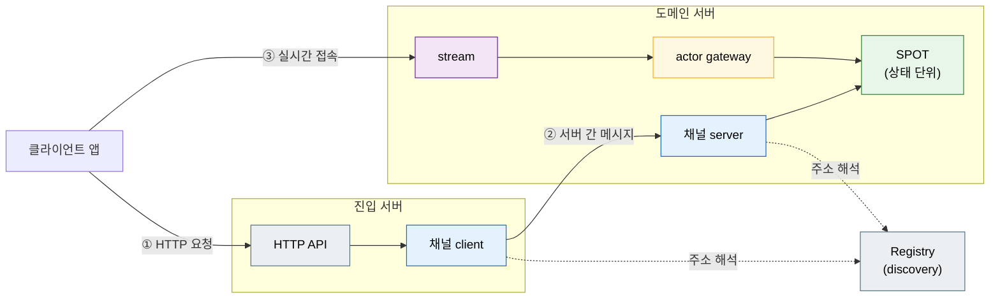
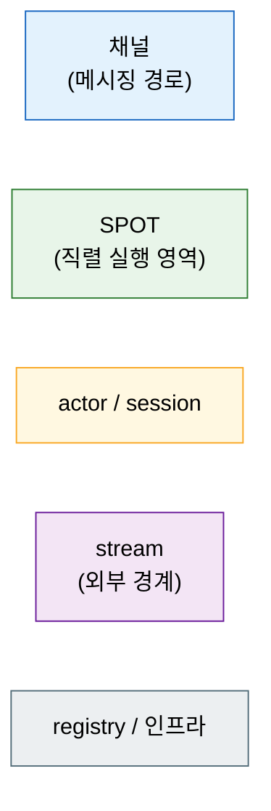

# ZLink Framework C++ — 사용자 가이드

**실시간 메시징이 중요한 서버 시스템**을 여러 프로세스로 나눠 만드는 C++
애플리케이션 프레임워크다.

```cpp
#include <zlink/framework.hpp>

int main (int argc, char **argv)
{
    auto app = zlink::framework::app_t::create ();
    app.add_zlink_framework ([] (zlink::framework::zlink_framework_options_t &options) {
        options.http ()
          .listen ("http://0.0.0.0:8080")
          .map_post<open_conversation_http_handler_t> ("/conversations");
    });
    return app.run (argc, argv);
}
```

핸들러 클래스 하나를 등록하면 메시지 디코딩·routing·인코딩은 프레임워크가 처리한다.

---

## 이 프레임워크로 무엇을 만드는가

여러 서버 프로세스가 역할을 나눠 협력하고, 상태 변화를 실시간으로 클라이언트에
전달해야 하는 시스템에 맞게 설계됐다.

| 도메인 | 핵심 시나리오 |
|--------|--------------|
| **실시간 게임** | 룸 생성 → 플레이어 입장 → 게임 상태 갱신 → 클라이언트 push |
| **고객 지원 채팅** | 대화 개설 → 상담원 배정 → 메시지 중계 → 대화 상태 push |
| **주문 워크플로** | 주문 접수 → 단계별 처리 → 상태 변경 → 클라이언트 알림 |
| **배송·배차** | 배차 요청 → 수행자 배정·수락 → 상태 추적 → 실시간 push |

공통 구조는 하나다 — 역할별 서버 프로세스가 typed 메시지로 통신하고, 클라이언트는
실시간 연결(stream)로 상태 변화를 받는다.



각 서버 프로세스는 독립 실행 파일이고 서로 TCP로 연결된다. 하나의 서버 안에
HTTP 입구, 다른 서버와의 통신 경로, 클라이언트 연결, 상태 단위 관리가 모두
동거한다. `samples/TicTacToe`(2개 서버)와 `samples/Bingo`(4개 서버)가 동작하는
완전한 예제다.

---

## 핵심 기능

### 채널 메시징 — 서버 간 typed 요청-응답

채널은 서버 사이의 통신 경로에 이름을 붙인 것이다. 한쪽이 채널 이름으로 요청을
보내면 반대편이 처리해 응답한다. struct를 그대로 주고받으며 직렬화(JSON /
MessagePack / Protobuf)는 프레임워크가 처리한다.

```cpp
// 보내는 쪽 (채널 클라이언트)
auto result = co_await _client
    .request ("support.core", open_conversation_req_t{user_id})
    .submit<open_conversation_res_t> ();

// 받는 쪽 (채널 서버의 핸들러)
class open_conversation_handler_t {
  public:
    using request_type = open_conversation_req_t;
    using reply_type   = open_conversation_res_t;
    static constexpr const char *topic_name = "OpenConversation";
    open_conversation_res_t handle (const open_conversation_req_t &req) { ... }
};
```

request-reply 외에 fanout(pub/sub)과 route mesh(주소 라우팅) 패턴도 제공한다.
[5장 →](05-channel-messaging.ko.md)

---

### SPOT — 상태 단위를 락 없이 관리

SPOT은 게임 룸, 지원 대화, 주문 처리 단위처럼 **"하나의 상태 영역"** 과 그 참여자를
묶는 실행 단위다. 한 SPOT 안에서 일어나는 모든 것 — 참여자 패킷, 타이머, 입퇴장 —
은 **직렬로** 처리된다. std::mutex 없이 상태에 접근할 수 있고, 코루틴으로 비동기
처리를 써도 같은 SPOT에 두 요청이 겹치지 않는다.

```cpp
class conversation_spot_t : public zlink::framework::spot_t,
                             public conversation_t   // 대화 상태 직접 소유
{
  public:
    void configure (zlink::framework::spot_context_t &context)
    {
        context.handlers ().add_actor_packet<&conversation_spot_t::send_message> ();
    }

    send_message_res_t send_message (const user_actor_t &actor,
                                     const zlink::framework::message_context_t &,
                                     const send_message_req_t &request)
    {
        return append (actor.user_id, request.text);   // std::mutex 없이 안전
    }
};
```

배정·할당을 담당하는 entry spot(노드당 1개)과 상태 본체인 room spot(단위마다 1개)으로
나뉜다. 주기 작업은 timer로 등록한다. [6장 →](06-spot.ko.md)

---

### Stream + Actor — 클라이언트 실시간 연결

클라이언트의 실시간 양방향 연결을 **stream**이라 하고, 연결 하나를 대표하는
서버 쪽 객체가 **actor**다. 클라이언트가 접속하면 session이 actor를 생성하고,
actor는 SPOT에 입장해 상태 처리에 참여한다.

```cpp
class support_session_t : public zlink::framework::packet_stream_session_t {
  public:
    task_t<void> on_packet (stream_t &stream,
                            const stream_dispatch_context_t &dispatch,
                            const zlink::message_t &payload) override
    {
        auto actor = co_await _actors.find (actor_id);
        co_await actor.value ().relay (payload);   // 현재 dispatch의 packet을 actor로 전달
    }
};
```

클라이언트 쪽 접속은 별도 산출물인 stream connector가 담당한다.
[8장 →](08-actor-session.ko.md) · [9장 →](09-stream.ko.md)

---

### HTTP Hosting — 서버 프로세스 안에 REST API 내장

별도 웹 서버 없이 같은 프로세스 안에 REST endpoint를 올린다. 경로 파라미터,
middleware/handler에서 인증 로직을 구현할 수 있고 TLS를 지원하며 readiness / liveness / health check endpoint도 한 줄로
등록한다.

```cpp
options.http ()
  .listen ("https://0.0.0.0:8443")
  .configure_tls ([] (auto &tls) {
      tls.certificate_file (cert_path).private_key_file (key_path);
  })
  .map_post<create_game_http_handler_t> ("/games")
  .map_get<get_room_http_handler_t> ("/rooms/{room_id}")
  .map_readiness ("/ready");
```

[20장 →](20-http-hosting.ko.md)

---

### Configuration · DI · Logging · Monitoring

운영 서버에 필요한 부속을 내장한다.

- **Configuration** — CLI 인자, 환경 변수, JSON 파일을 우선순위 순서로 합성.
  `bind<T>()` 한 번으로 설정 섹션을 struct에 매핑한다.
- **DI 컨테이너** — `dependency_types` 선언만으로 핸들러 생성자에 서비스가
  자동 주입된다. singleton / scoped / transient 수명을 지원한다.
- **Logging** — `logger_t<TOwner>` DI로 받아 소스 이름이 자동 태그된 로그를
  남긴다.
- **Monitoring / Health** — socket·discovery·spot·타이머 이벤트를 typed 구독으로
  받는다. `/ready`, `/healthz` endpoint에 health check를 연결한다.

[18장 →](18-di-container.ko.md) · [19장 →](19-configuration.ko.md) · `11. Monitoring` 장

---

### Registry / Discovery — 서버 주소 자동 연결

여러 Play 서버 인스턴스가 뜰 때 어느 서버로 연결할지, endpoint를 코드에
하드코딩하지 않는다. Registry 서버가 주소를 관리하고, 각 서버는
`use_discovery()`로 동적으로 찾는다.

```cpp
options.use_discovery ()    // registry에서 노드 주소를 자동으로 받아온다
  .add_registry_endpoint (topology.registry_endpoint);

options.add_spot_mesh ("bingo.room.discovery")
  .add_node ("bingo.room.node")
  .set_routing_id (topology.rid).enable_router (topology.router_endpoint)
  .add_entry_spot<bingo_entry_spot_t> ()
  .add_spot<bingo_room_spot_t> ("bingo.room");
```

[10장 →](10-location.ko.md)

---

## 목차

| 순서 | 문서 | 내용 |
|----|------|------|
| 1 | [1. 개요](01-overview.ko.md) | 전체 기능 지도, 통합 4축과 전체 topology |
| 2 | [2. 시작하기](02-getting-started.ko.md) | CMake 연동, 첫 앱, 핸들러 작성, 실행과 확인 |
| 3 | [3. 핵심 개념](03-concepts.ko.md) | channel · Spot · Actor · stream · relocation |
| 4 | [4. Backpressure](04-backpressure.ko.md) | 처리보다 도착이 빠를 때의 동작과 영향을 주는 옵션 |
| 5 | [5. 채널 메시징](05-channel-messaging.ko.md) | request-reply, fanout, route mesh, channel client |
| 6 | [6. SPOT](06-spot.ko.md) | room/stage/zone, 직렬 실행, timer |
| 7 | [7. Actor와 Spot](07-actor-spot.ko.md) | actor 호스팅, membership, relocation |
| 8 | [8. Actor · Session](08-actor-session.ko.md) | actor manager, session actor, gateway relay |
| 9 | [9. Stream](09-stream.ko.md) | stream session, stream connector |
| 10 | [10. Location](10-location.ko.md) | location store, 자동 연결, 운영 조회 |
| 11 | [11. Monitoring](11-monitoring.ko.md) | 상태 관측, 메시지 흐름, health |
| 12 | [12. 운영](12-operations.ko.md) | 런타임 메트릭, graceful drain, readiness |
| 13 | [13. 주요 타입 사용 색인](13-interface-catalog.ko.md) | 기능별 public 타입 색인과 얻는 방법 |
| 14 | [14. 샘플 고르기](14-samples.ko.md) | TicTacToe · Bingo 샘플과 기능 매핑 |
| 15 | [15. E2E 테스트](15-e2e-testing.ko.md) | client로 시스템 전체를 검증하는 방법 |
| 16 | [16. Options](16-options.ko.md) | 옵션 목록, 기본값과 변경 시점 |
| 17 | [17. ZLink를 어디에 쓰나](17-alternative.ko.md) | 내부 서비스 통신·실시간 상태 패턴, gRPC/mesh 비교 |
| 18 | [18. DI 컨테이너](18-di-container.ko.md) | 수명 3종, 등록 방법, 핸들러 자동 주입, captive dependency |
| 19 | [19. Configuration](19-configuration.ko.md) | 설정 소스(cli/env/json), 우선순위, section/bind |
| 20 | [20. HTTP Hosting](20-http-hosting.ko.md) | embedded HTTP server, route handler |
| 21 | [21. 실행·구성 모델](21-execution-model.ko.md) | 핸들러 모델, `task_t`/`co_await`, app 수명주기, module |

파일 번호는 언어에 상관없이 같은 장을 가리키는 식별자다. 1~17장은 다섯 언어가 공유하고,
18~21장은 C++에만 있다 — DI·configuration·HTTP hosting·실행 모델은 .NET이 런타임에서
받는 것을 C++은 프레임워크가 직접 제공하기 때문이다.

이 넷은 기초에 해당하므로, 2·3장을 읽은 뒤 바로 18~21장을 먼저 보고 4장으로 돌아와도 좋다.

---

## 다이어그램 읽는 법

이 가이드의 모든 다이어그램은 같은 시각 언어를 쓴다 — 색이 곧 개념이다.



여러 장이 같은 TicTacToe/Bingo 토폴로지를 그리며, 장마다 확대 위치만 바뀐다.

## 관련 문서

- HTTP **client**(요청을 보내는 쪽)는 별도 산출물이다 —
  [zlink::http_client 사용자 가이드](../http-client/README.ko.md)
- 설계 계약(초안)은 [doc/spec/](../../README.ko.md)에 있다.
  가이드와 어긋나면 코드와 spec이 정답이다.
