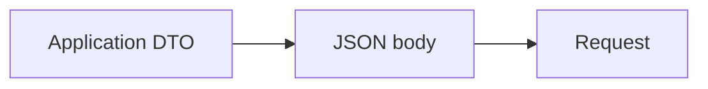

<!-- generated:start -->
<!-- This file is generated from `common/guide/http-client/04-request-body.en.md`. Do not edit directly.
     Edit the common source instead, then regenerate with `python3 doc/site/scripts/generate_language_guides.py`. -->
<!-- generated:end -->

# Request Bodies

<!-- framework-adapter-nav:start -->
[Contents](README.en.md) | [Previous: Making Requests](03-making-requests.en.md) | [Next: Handling Responses](05-handling-responses.en.md)
<!-- framework-adapter-nav:end -->

<!-- language-switch:start -->
View in another language — [C++](../../../cpp/guide/http-client/04-request-body.en.md) · **C#/.NET** · [Java](../../../java/guide/http-client/04-request-body.en.md) · [Kotlin](../../../kotlin/guide/http-client/04-request-body.en.md) · [Node/TypeScript](../../../node/guide/http-client/04-request-body.en.md)
{ .zlink-langswitch }
<!-- language-switch:end -->

!!! info "After reading this chapter"

    You can send JSON as the usual request body and select the appropriate body form when an API
    requires form or multipart data.

A request body is attached to a request that sends content, such as POST, PUT, or PATCH. The HTTP client uses a typed JSON body as the default path for serializing an application DTO.

## 1. Send a JSON Body

A typed JSON body sends an application DTO as `application/json`. The response form is independent of the body format, so choose a typed response, raw response, or a body-only response as needed.

<!-- diagram: http-client-request-body -->


```csharp
--8<-- "framework/languages/dotnet/tutorial/HttpClient/Program.cs:http-json-body"
```

## 2. Choose Form or Multipart

A form suits an API that accepts short name and value pairs as `application/x-www-form-urlencoded`. Multipart is `multipart/form-data` for sending text fields and file fields in one request. Form fields accumulate, and multipart fields and files accumulate into one body.

!!! info "Choose one body source"

    Mixing typed JSON, raw content, a stream, a form, or multipart in one request ends with
    `ProtocolError` before the request is sent.

## 3. Boundary for Raw and Streaming Bodies

A raw body with an arbitrary content type and a streaming upload that supplies byte chunks are separate paths from JSON, form, and multipart. [Response Rules](10-response-rules.en.md) covers raw-body response handling, and [Streaming](07-streaming.en.md) covers streaming uploads.

## Next Chapter

[Handling Responses](05-handling-responses.en.md) chooses a JSON-decoded response, a raw response, or a body-only response.
