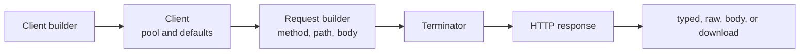

<!-- generated:start -->
<!-- 이 파일은 `common/guide/http-client/08-client-lifecycle.ko.md`에서 생성한다. 직접 고치지 않는다.
     고칠 곳은 공통 소스이고, `python3 doc/site/scripts/generate_language_guides.py`로 다시 만든다. -->
<!-- generated:end -->

# Client와 요청의 생애

<!-- framework-adapter-nav:start -->
[목차](README.ko.md) | [이전: Streaming](07-streaming.ko.md) | [다음: Redirect·Retry·Cookie](09-redirect-retry-cookie.ko.md)
<!-- framework-adapter-nav:end -->

<!-- language-switch:start -->
다른 언어로 보기 — [C++](../../../cpp/guide/http-client/08-client-lifecycle.ko.md) · **C#/.NET** · [Java](../../../java/guide/http-client/08-client-lifecycle.ko.md) · [Kotlin](../../../kotlin/guide/http-client/08-client-lifecycle.ko.md) · [Node/TypeScript](../../../node/guide/http-client/08-client-lifecycle.ko.md)
{ .zlink-langswitch }
<!-- language-switch:end -->

!!! info "이 장을 읽고 나면"

    client를 재사용하고 닫는 시점, 요청 builder를 끝내는 방법, timeout과 옵션의 적용 범위를 판단할 수 있다. 생성 코드는 각 언어의 `HttpClient` tutorial에서 가져왔다.

client는 base URL과 전송 옵션을 가진 재사용 단위다. builder는 client를 만들고, client가 만든 request builder는 HTTP method·path·body를 모은다. 종결자(terminator)는 모은 요청을 제출하고 응답 형태를 결정하는 마지막 호출이다.

## 1. Builder에서 응답까지 흐른다

<!-- diagram: http-client-client-lifecycle -->


client는 같은 대상 서비스에 보내는 요청의 connection pool과 기본값을 유지한다. request builder는 요청 하나에만 속하며, 종결자를 호출하면 그 요청을 제출한다.

## 2. Client 하나를 만들고 재사용한다

서비스마다 client 하나를 만들고 여러 요청에 재사용한다. 요청마다 build하면 keep-alive와 connection pool을 다시 만들게 된다. 사용이 끝난 client는 해당 언어의 resource 관리 방식으로 닫는다.

```csharp
--8<-- "framework/languages/dotnet/tutorial/HttpClient/Program.cs:http-client-create"
```

## 3. 응답 형태에 맞는 종결자를 고른다

종결자는 request builder를 실제 HTTP 요청으로 제출한다. 같은 응답 형태라도 언어마다 표기만 다르며, 표의 이름은 호출 위치의 실행 모델과 별개로 응답을 받는 역할을 나타낸다.

| 응답 형태 | C++ | C#/.NET | Java | Kotlin | Node/TypeScript |
| --- | --- | --- | --- | --- | --- |
| typed 응답 | `async<T>()` | `Async<T>()` | `submit(Class<T>)` | `await<T>()` | `submit<T>()` |
| raw 응답 | `async_raw()` | `AsyncRaw()` | `submitRaw()` | `awaitRaw()` | `submitRaw()` |
| body만 | `fetch<T>()` | `Fetch<T>()` | `fetch(Class<T>)` | `fetch<T>()` | `fetch<T>()` |
| streaming download | `download(sink)` | `DownloadAsync(sink)` | `download(sink)` | `awaitDownload(sink)` | `download(sink)` |
| callback 완료 | `async<T>(callback)` | `Async<T>(callback)` | `submit(Class<T>, callback)` | suspend 함수로 대체 | `submit<T>(callback)` |
| gate 반납 | `yield<T>()` | `Yield<T>()` | `yield(Class<T>)` | `yield<T>()` | `yield<T>()` |
| blocking CLI | `submit<T>()` / `submit_raw()` | 제공하지 않음 | 제공하지 않음 | 제공하지 않음 | 제공하지 않음 |

## 4. Timeout의 두 경계를 구분한다

client `Timeout` 기본값은 3000ms이며, 요청 builder의 `Timeout`은 그 요청의 시도당 timeout만 바꾼다. retry를 켠 요청도 각 시도에 이 timeout을 적용한다. 전체 retry 시간을 하나로 제한하는 옵션은 없다.

## 5. 비동기 완료를 기다린다

비동기 종결자는 네트워크 대기 중 호출 thread나 event loop를 점유하지 않는다. 언어의 비동기 조합 방식으로 완료를 기다린다. blocking 종결자는 C++ CLI와 client 시나리오에만 있으며 framework runtime 실행 문맥에서는 사용할 수 없다.

## 6. Client 옵션을 한곳에서 정한다

| 옵션 | 기본값 | 의미 |
| --- | --- | --- |
| `baseUrl` | 필수 | 모든 요청 path의 기준 URL |
| `timeout` | 3000ms | 시도당 timeout |
| `defaultHeader` | 없음, 누적 | 모든 요청에 붙는 기본 header |
| `basicAuth` | off | Basic 인증 |
| `bearerToken` | off | Bearer 인증 |
| `maxResponseBodySize` | 16 MiB | 압축 해제 후에도 적용되는 body 상한 |
| `trustCertificateFile` | 시스템 root | 신뢰 PEM 인증서를 추가 |
| `clientCertificateFile` | off | mTLS client 인증서와 key |
| `followRedirects` | off, 무인자 설정 시 5회 | redirect 자동 추적 한도 |
| `retry` | off, 0회 | 추가 재시도 횟수 |
| `cookies` | off | cookie jar 활성화 |
| `proxy` | off | `http://` proxy URL |
| `proxyBasicAuth` | off | proxy Basic 인증 |
| `compression` | off | gzip·deflate 요청과 투명 해제 |

인증과 proxy 옵션은 [인증·TLS·Proxy](06-auth-tls-proxy.ko.md), streaming의 예외는 [Streaming](07-streaming.ko.md), redirect·retry의 세부 규칙은 [Redirect·Retry·Cookie](09-redirect-retry-cookie.ko.md)에서 다룬다.

## 7. One-shot은 한 번의 편의 경로다

client builder에서도 method를 바로 시작할 수 있다. 이 one-shot 경로는 제출할 때 client를 만들고 완료 후 닫으므로 connection pool을 재사용하지 않는다. 한 번뿐인 관리 작업에는 사용할 수 있지만, 반복 호출과 고부하 경로에는 재사용 client를 둔다.

## 8. 다음 장

redirect, retry, cookie jar의 자동 처리 규칙은 [Redirect·Retry·Cookie](09-redirect-retry-cookie.ko.md)에서 다룬다.
