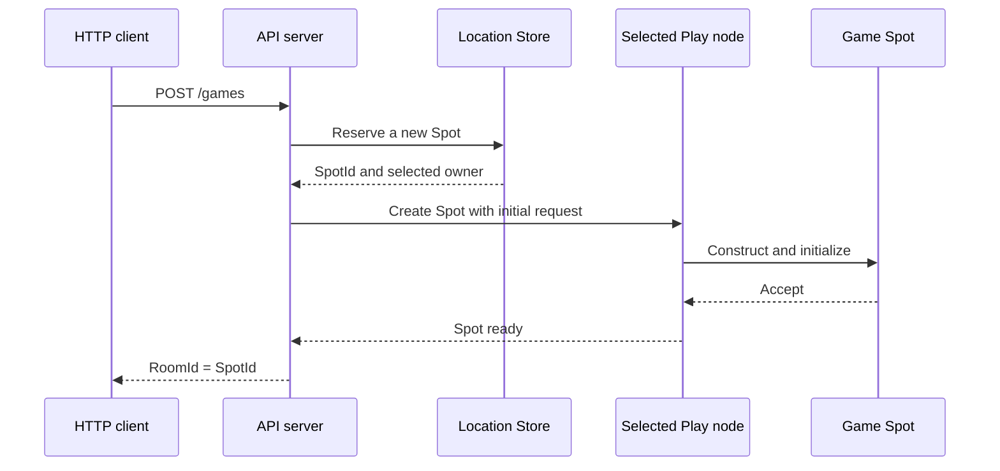

<!-- generated:start -->
<!-- This file is generated from `common/guide/server/02-getting-started.en.md`. Do not edit directly.
     Edit the common source instead, then regenerate with `python3 doc/site/scripts/generate_language_guides.py`. -->
<!-- generated:end -->

<!-- framework-adapter-nav:start -->
[Guide Home](README.en.md) | [Previous: 1. Overview](01-overview.en.md) | [Next: 3. Core Concepts](03-concepts.en.md)
<!-- framework-adapter-nav:end -->

<!-- language-switch:start -->
View in another language — **C#/.NET** · [C++](../../../cpp/guide/server/02-getting-started.en.md) · [Java](../../../java/guide/server/02-getting-started.en.md) · [Kotlin](../../../kotlin/guide/server/02-getting-started.en.md) · [Node/TypeScript](../../../node/guide/server/02-getting-started.en.md)
<!-- language-switch:end -->

# 2. Getting Started

> **The document that owns this chapter's contract** — none. This is a walkthrough for
> installing and confirming your first working setup.

> First install the package and run a minimal example of two processes calling each
> other (§1-§2), then follow the actual
> [TicTacToe sample](../../../../../languages/dotnet/samples/TicTacToe) through the flow
> of creating one room (§3-§11).

## 1. Installation

Get it from NuGet. The minimal combination needed to build one server is these three.

```bash
dotnet add package Systems.Zlink                 # The core messaging engine (.NET binding)
dotnet add package Zlink.Framework                # The contract and runtime
dotnet add package Zlink.Framework.AspNetCore     # DI/hosted service registration (AddZLinkFramework)
```

Packages to add when you need them:

| Package | When to add it |
| --- | --- |
| `Zlink.Framework.Locations.Redis` | When using the Redis location store for auto-connect ([10-location](10-location.ko.md)) |
| `Zlink.Framework.Codecs.Protobuf` · `.MessagePack` | To use instead of the default JSON codec ([05-channel-messaging §7](05-channel-messaging.ko.md#7-직렬화-codec)) |
| `Systems.Zlink.Stream.Connector` | When building an external client (a game client, mobile) ([09-stream](09-stream.ko.md)) |
| `Zlink.HttpClient` | When the server calls out over HTTP ([HTTP Client guide](../http-client/README.ko.md)) |

Framework packages ship starting at **0.9**. `Systems.Zlink` (the core binding) and
`Zlink.HttpClient` follow their own version tracks, so the three packages' version
numbers differ. `net8.0` or later is required.

The license differs by layer — core/binding is MPL-2.0, framework is FSL-1.1-ALv2, and
`Zlink.HttpClient` is Apache-2.0. There's no cost to building and selling a service
([17-alternative §7](17-alternative.ko.md#7-라이선스--쓰는-데-드는-비용)).

## 2. A Minimal Example — Two Processes Calling Each Other

With no location store and no Redis, try one request/reply over a manual connection where
you write the endpoint directly. This is the point where you confirm "installation is
done."

**The shared contract.** Both processes reference the same record.

```csharp
public sealed record Hello(string Name);
public sealed record Greeting(string Text);
```

**The server process.** Owns the `greeting` channel and registers a handler.

```csharp
var builder = WebApplication.CreateBuilder(args);

builder.Services.AddZLinkFramework(options =>
{
    options.AddHandlersFromAssemblyOf<Program>();          // Finds handler types.

    var mesh = options.AddRouteMesh("services")            // Names the mesh.
        .Listen("tcp://0.0.0.0:7101");                     // Its own endpoint for other processes to connect to.
    mesh.Channel("greeting").Server();                     // This process handles "greeting".
});

var app = builder.Build();
await app.RunAsync();

// A handler that processes one request.
public sealed class HelloHandler : IZLinkRequestHandler<Hello, Greeting>
{
    public ValueTask<Greeting> HandleAsync(
        Hello request,
        IZLinkMessageContext context,
        CancellationToken cancellationToken)
        => ValueTask.FromResult(new Greeting($"hello, {request.Name}"));
}
```

**The client process.** Joins the same mesh and calls `greeting`.

```csharp
var builder = WebApplication.CreateBuilder(args);

builder.Services.AddZLinkFramework(options =>
{
    var mesh = options.AddRouteMesh("services")
        .Listen("tcp://0.0.0.0:7102");                     // It also needs its own endpoint.
    mesh.Channel("greeting").Client();                     // The call-only side is Client.
    mesh.PeerConnections.Connect("tcp://127.0.0.1:7101");  // Manual connection — write the server endpoint directly.
});

var app = builder.Build();

app.MapGet("/hello/{name}", async (
    string name,
    IZLinkRouteClient route,
    CancellationToken cancellationToken) =>
{
    // The target is just one ChannelName. Which node handles it isn't specified.
    var reply = await route
        .RequestToChannel("greeting", new Hello(name))
        .Async<Greeting>(cancellationToken);

    return Results.Ok(reply.Text);
});

await app.RunAsync();
```

Start the server first, then the client, and call `curl http://localhost:5000/hello/world`
— it returns `hello, world`.

Three things are confirmed here — the package is wired up, the two processes are connected
through the mesh, and the call was routed by logical name (`greeting`) alone. This example
has no Redis and no location store. For the calling code to stay the same as servers scale
up and down, you need auto-connect, which is covered by
[10-location](10-location.ko.md).

## 3. TicTacToe — The Flow Of Creating One Room

From here on, we move to an actual sample. The API server doesn't pick a specific Play node
— it only passes the room's stable type and its initial settings. The Framework selects one
of the Object Servers that registered that type, and issues a globally unique `SpotId`.

### 3.1 Execution Flow



The API code never carries the Play node's `NodeRid` or endpoint. The same creation code is
used even as Play nodes are added or replaced.

### 3.2 Sample Locations

| What to check | File |
| --- | --- |
| Full run | `samples/TicTacToe/run_sample.sh` |
| API run project | `samples/TicTacToe/Server/Api/TicTacToe.Server.Api.csproj` |
| Play run project | `samples/TicTacToe/Server/Play/TicTacToe.Server.Play.csproj` |
| HTTP handler | `samples/TicTacToe/Server/Api/Handlers/CreateGameHttpHandler.cs` |
| API Framework config | `samples/TicTacToe/Server/Api/ApiServer.cs` |
| Play Framework config | `samples/TicTacToe/Server/Play/PlayServer.cs` |
| Game Spot | `samples/TicTacToe/Server/Play/Infrastructure/ZLink/Spots/TicTacToeGameSpot/TicTacToeGame.cs` |
| Shared messages | `samples/TicTacToe/Shared/Contracts/Messages.cs` |

The table's relative paths are rooted at `framework/languages/dotnet`.

## 4. API Server Configuration

The API server registers a Location Store and an Object Client role. The Object Client role
is used to create or call an Actor and Spot on another Object Server.

```csharp
builder.Services.AddZLinkFramework(options =>
{
    // Registers a shared Store so every process queries the same location information.
    options.AddLocationStore(new ZLinkRedisLocationStore(redis =>
    {
        redis.ConnectionString = settings.RedisEndpoint;
        redis.KeyPrefix = settings.RedisKeyPrefix;
    }));

    var mesh = options.AddRouteMesh(SampleNodes.Mesh)
        .Listen(settings.MeshEndpoint)
        .SetRoutingIdPrefix("tictactoe-api");

    // The API process doesn't hold any Object — it only initiates remote Object calls.
    mesh.Objects().Client();
});
```

The sample reads the peer endpoint from a config file for reproducible local runs. This
endpoint only sets up the connection — it doesn't specify which Play node the new Game Spot
gets placed on.

## 5. Creating A Spot From An HTTP Request

The HTTP handler uses the spot manager it received through DI.

```csharp
internal static async Task<IResult> HandleAsync(
    CreateGameHttpReq request,
    IZLinkSpotManager spots,
    SampleSettings settings,
    ILoggerFactory loggerFactory,
    CancellationToken cancellationToken)
{
    var gameName = !string.IsNullOrWhiteSpace(request.GameName)
        ? request.GameName
        : SampleDefaults.GameName;

    var created = await spots
        .Create(SampleTypes.GameSpot)      // A node that provides this stable type becomes a candidate.
        .InMesh(SampleNodes.Mesh)          // Selects the RouteMesh to create the Object on.
        .Request(new TicTacToeGameCreateReq(
            gameName,
            SampleDefaults.RequiredLevel)) // The initial settings passed to the new Spot's OnCreateAsync.
        .Async(cancellationToken);

    return Results.Ok(new CreateGameHttpRes(
        created.Spot.SpotId,               // Uses the Framework-issued SpotId as the room id.
        settings.PlayEndpoints,
        settings.PlayNodes,
        gameName,
        SampleDefaults.RequiredLevel));
}
```

Use `Create` for creating a new User Spot where the caller doesn't decide the `SpotId`. To
look up or create the same `SpotId` again, use `GetOrCreate(spotId, spotType)`.

## 6. Registering A Stable Type On The Play Server

The Framework only uses a Serving Object Server that registered the requested stable type as
a creation candidate. The Play server registers the `TicTacToeGame` factory as follows.

```csharp
var mesh = options.AddRouteMesh(SampleNodes.Mesh)
    .Listen(settings.MeshEndpoint)
    .SetRoutingIdPrefix("tictactoe-play");

mesh.Objects().Server()
    .AddSpotFactory<TicTacToeGame>(
        SampleTypes.GameSpot,               // The same stable type the API passed to Create.
        factory => factory.DisableRelocation());
```

There's no sample contract for preferring a specific Play node or placing by `NodeRid`. The
Framework and Location Store decide the placement candidate and capacity.

## 7. Validating The Initial Settings

The selected Play node creates the Spot, then hands the initial request to `OnCreateAsync`. The
Spot validates the settings and returns whether it accepts creation.

```csharp
public ValueTask<ZLinkSpotCreateResponse> OnCreateAsync(
    ZLinkMessage request,
    CancellationToken cancellationToken)
{
    var settings = request.Decode<TicTacToeGameCreateReq>();

    if (string.IsNullOrWhiteSpace(settings.GameName))
        return ValueTask.FromResult(
            ZLinkSpotCreateResponse.Reject("GameName is required."));

    _gameName = settings.GameName;
    _requiredLevel = settings.RequiredLevel;

    // Only after Accept is this Spot published as Ready in the Location Store.
    return ValueTask.FromResult(ZLinkSpotCreateResponse.Accept());
}
```

If creation is rejected, that reservation is never published as a Ready Spot. The caller
receives the completion result as a typed failure.

## 8. What The ClientServer Channel Is For

TicTacToe's `tictactoe.api` ClientServer channel is used when a Play session requests user
authentication from the API server. It isn't used for Game Spot creation.

```csharp
// API process: handles the authentication request.
options.AddClientServerChannel(SampleChannels.Api)
    .Server()
    .Listen()
    .AddRequestHandler<
        AuthenticatePlayerHandler,
        AuthenticatePlayerReq,
        AuthenticatePlayerRes>();

// Play process: sends the authentication request.
options.AddClientServerChannel(SampleChannels.Api)
    .Client();
```

Object creation and a ClientServer call are different features. No dedicated
room-creation channel or `CreateGameHandler` is added.

## 9. Building And Running

```bash
# Build the sample solution first.
dotnet build framework/languages/dotnet/samples/TicTacToe/TicTacToe.sln

# Prepares Redis and 4 processes, and verifies the whole scenario.
framework/languages/dotnet/samples/TicTacToe/run_sample.sh
```

The runner runs 2 APIs and 2 Plays. After creating a Game Spot, it verifies that
participants connected to different Play endpoints join the same room, and verifies game
messages and end-of-game cleanup.

## 10. What To Check When It Fails

| Symptom | What to check |
| --- | --- |
| No creation candidate | Check whether the Play process registered an Object Server and the `GameSpot` stable type on the same `MeshName`. |
| Startup fails | Check the Redis connection, `MeshName`, listen endpoint, and any duplicate-registration error. |
| Creation is rejected | Check the initial settings `OnCreateAsync` received and the reject reason. |
| The client can't join the room | Check whether the HTTP response's `RoomId` was passed to the Actor join request as-is. |

The next chapters each explain the role of the channel, Spot, Actor, Stream, and Location
Store used here.

---
