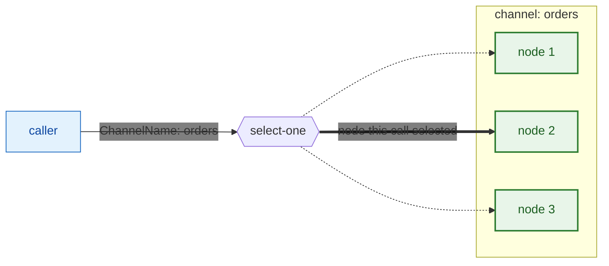
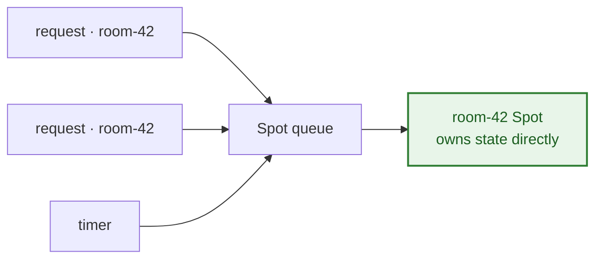
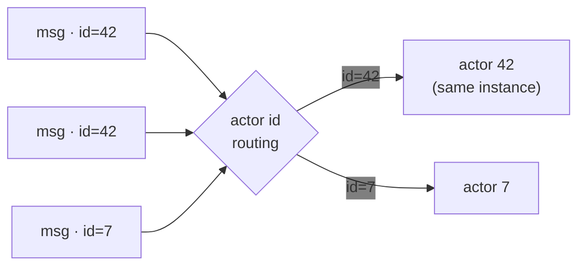
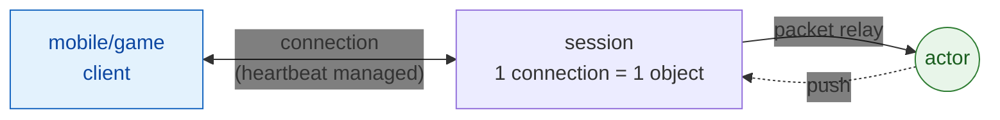
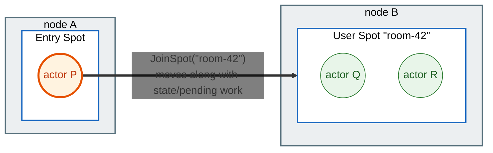
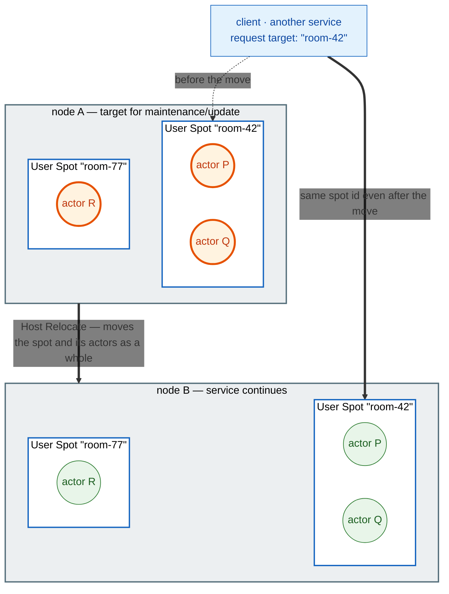

<!-- generated:start -->
<!-- This file is generated from `common/guide/server/03-concepts.en.md`. Do not edit directly.
     Edit the common source instead, then regenerate with `python3 doc/site/scripts/generate_language_guides.py`. -->
<!-- generated:end -->

<!-- framework-adapter-nav:start -->
[Guide Home](README.en.md) | [Previous: 2. Getting Started](02-getting-started.en.md) | [Next: 4. Backpressure — When Arrival Outpaces Processing](04-backpressure.en.md)
<!-- framework-adapter-nav:end -->

<!-- language-switch:start -->
View in another language — **C#/.NET** · [C++](../../../cpp/guide/server/03-concepts.en.md) · [Java](../../../java/guide/server/03-concepts.en.md) · [Kotlin](../../../kotlin/guide/server/03-concepts.en.md) · [Node/TypeScript](../../../node/guide/server/03-concepts.en.md)
<!-- language-switch:end -->

# 3. Core Concepts

> **The documents that own this chapter's contract** — [Framework Overview](../../../common/spec/02-overview.ko.md)
> and the [Interaction Model](../../../common/spec/03-interaction-model.ko.md) own the
> formal meaning of the concepts, and the
> [per-language handler interface contracts](../../../common/spec/server/languages/README.ko.md)
> own the formal definition of the interfaces. This document lays out what that meaning
> looks like in code.

The ZLink framework provides **channel · spot · actor · stream · location** as its core
concepts. Every other chapter is a variation on these. We'll go through them in order below,
and cover [relocation](#5-relocation--moving-to-another-node) — an actor or spot moving to
another node partway through — along the way. Writing and operating each concept in practice
is owned by its own dedicated chapter later.

## 1. channel — a connection between servers

**MeshNode** is the basic unit of a connection between servers. One MeshNode adds two
independent roles on top of itself.

- **Object role** — the spot where spots and actors are placed. Covered separately in
  [spot](#2-spot--a-unit-that-owns-state-and-processes-it-in-order) and
  [actor](#3-actor--a-state-object-identified-by-id).
- **Channel role** — the spot where request/send/publish are exchanged. Covered in this
  document.

`ChannelName` is a logical name that groups together the nodes in that mesh sharing the same
function — instead of an address (`host:port`), you pick a call target by a name like
`"orders"`. The caller passes only the `ChannelName` to the route client — `MeshName` is
fixed at registration and never appears in the call arguments.

The caller doesn't need to know which node is currently handling that request. Pass only a
logical name — not an address, not a node number — (`ChannelName`, a spot id, an actor id),
and the framework finds and delivers to it wherever that name currently lives. This property
— **the caller doesn't need to know where the target is** — is called location
transparency. channel, spot, and actor all work this way. That's why the calling code stays
the same whether you scale servers out or in.

Sending a message by `ChannelName` has the framework pick one of the nodes currently able to
receive the request at that moment and deliver to it — this selection is called
**select-one**.



If three nodes own the same `orders` channel, one of them is selected per call. The caller
doesn't know — and doesn't need to know — which node was selected.

Here's what it looks like to lay both roles onto one MeshNode.

```csharp
var mesh = options.AddRouteMesh("services")     // One MeshNode joins the mesh "services".
    .Listen("tcp://0.0.0.0:7101");              // Its own endpoint for other nodes to connect to.

mesh.Objects().Server();                        // Object role — this node places spots/actors.
mesh.Channel("orders").Server();                // Channel role — this node handles "orders" requests.
mesh.Channel("billing").Client();               // A call-only channel is Client.
```

Auto-connect, which doesn't hardcode peer addresses in code and tracks servers scaling up or
down, is covered by [10-location](10-location.ko.md).

> **Note:** `MeshName` and `ChannelName` are different names. You can register several
> `ChannelName`s on one mesh, and the same `ChannelName` can be used across different
> meshes.

There are a few registrations that use the name "channel," and what differs is whether they
share a socket.

| Kind | Socket |
| --- | --- |
| route mesh channel | Shares the already-open MeshNode socket |
| ClientServer channel | Opens its own socket, separate from the MeshNode |
| fanout channel | Opens its own dedicated PUB/SUB socket |

pub/sub also splits two ways. **Logical Multicast**, exchanged between Spots over a route
mesh channel, uses the mesh socket as-is, and a **fanout channel** delivers to every
connected subscriber over its own socket. The structural comparison of the three and how to
use them is covered by
[05-channel-messaging §1](05-channel-messaging.ko.md#1-channel-종류).

## 2. spot — a unit that owns state and processes it in order

There's a recurring shape — a game room, a guild, an auction item — where **several
requests touch the same state at the same time.**
Building this yourself means handling both finding which process currently holds that state
and routing the request there, and keeping arriving requests from touching the state at the
same time. Keep the state in process memory and you have to manage the routing above
yourself; keep it in a DB or Redis and you have to read, write, and lock on every request.

A spot has the framework own both of these. It keeps the target as **one object alive in
memory**, and processes the requests that arrive for it **one at a time, in a single line.**
Since two requests can never touch the same state at the same time, no lock is needed.

Addressing by id is what differs from channel. Send to the `"orders"` channel and any node
capable of doing that work handles it. Send a request to a spot id like `"room-42"`,
though, and the node where that spot actually lives receives the message and hands it to
that spot to process. Which node that is gets found by the framework through the same
location transparency [seen earlier](#1-channel--a-connection-between-servers).



A spot registers on the MeshNode's **Object role**. It's a separate surface from the same
MeshNode's Channel role.

A spot splits into three kinds — **Entry Spot · User Spot · Instance Spot** — based on when
it's created, and **execution mode** determines which work runs concurrently. The
differences between the three kinds, choosing an execution mode, and
registration/lifecycle/timer/outbound are covered by [06-spot](06-spot.ko.md).

## 3. actor — a state object identified by ID

An actor is a **stateful object identified by an ID.** A message that arrives with the same
ID is always handled by the same instance. An actor always belongs to some spot, and how it
binds to an external client connection continues in the
[next section](#4-stream--external-client-connections).



Details in [07-actor-spot](07-actor-spot.ko.md).

## 4. stream — external client connections

A stream is a **connection-oriented, bidirectional channel to an external client** such as
mobile or a game. Unlike a server-to-server
[channel](#1-channel--a-connection-between-servers), the server manages connection lifecycle
and heartbeat, and one connection maps to a server-side **session** object. Reconnecting
after a disconnect is the client connector's job.

**Bind** a session to an [actor](#3-actor--a-state-object-identified-by-id) and the session
stops handling messages that arrive over that connection itself, relaying them to the bound
actor instead. The reverse direction works the same way — a push the actor sends goes out to
the client through the session bound to that actor.



So **the node that accepts the connection and the node that runs domain logic can be split.**
Even if the session lives on a gateway node and the actor lives on a different node, the
framework keeps the relay path alive. Even if the actor moves via
[relocation](#5-relocation--moving-to-another-node), the same session continues at the new
location.

Details in [09-stream](09-stream.ko.md); how to bind a session to an actor is covered by
[08-actor-session](08-actor-session.ko.md).

## 5. relocation — moving to another node

Relocation is when an actor or spot leaves its current owner node and keeps running on
another node. It starts from two distinct triggers.

An actor belongs to a spot, and a spot belongs to a node. Relocation keeps this
belongs-to relationship exactly as it is — only the node it runs on changes.

**When an actor joins a spot on another node.** If an actor requests to join a User Spot
that lives on a different node, the moment the join is accepted the actor moves to that node
carrying its state and pending work along with it. This is a move the application triggers by
request.



The only thing the join call specifies is the **spot id `room-42`** — there's no argument
that names a target node. The framework looks up which node currently holds that spot in the
location store and moves actor P to that node. So the names "node A" and "node B" never
appear anywhere in the application code. Once the move finishes, actor P belongs to node B's
`room-42` spot and follows the same execution rules as Q and R.

**When an operator moves a host for maintenance or deployment without downtime.** An
operator moves the spots and actors on one host to another host. The framework handles it
even without the application requesting individual joins, and once it's done, the original
host can be shut down.



A server holding state can't just be taken down because of that state, so maintenance or a
deployment usually means dropping the connection and making clients wait. Host Relocate keeps
the spot's and actor's state exactly as it is while moving it to another node, freeing up
node A. The caller still sends requests to the same id, `room-42`, so it never needs to know
the move happened. The net effect is that **a stateful service can be replaced with zero
downtime, the way a stateless service would be.**

Both paths follow **the same relocation policy.** What happens to application state during
the move (not moved, recreated, or restored as-is) is fixed once at spot/actor factory
registration, and doesn't change while running.

The kinds of policy and how to choose one are covered by
[07-actor-spot §1](07-actor-spot.ko.md); making an actor join call and receiving the
completion result by [07-actor-spot §5](07-actor-spot.ko.md); and Host Relocate as
zero-downtime maintenance/deployment, along with how a relocation unit is scoped, by
[12-operations §2](12-operations.ko.md).

## 6. location — address resolution

Application code uses only logical names like a channel name, and the actual peer address
(`host:port`) is resolved by a **location store** shared across the whole deployment. Each
server registers its own location as a descriptor in the store on startup, and the calling
side looks up the target in the store by logical name and connects. When the server topology
changes, connections update accordingly.

Usage is covered by [10-location](10-location.ko.md); the contract is defined by the
[common spec](../../../common/spec/21-location-runtime.ko.md).

Manual connections — specifying an endpoint directly at registration without a store — are
also supported, for development/testing and small fixed deployments
([05-channel-messaging §6](05-channel-messaging.ko.md)). You can't use both approaches
together on the same MeshNode.

> **See it in a sample — [TicTacToe](../../../common/sample/tictactoe/README.en.md).** This
> is the smallest example where all of these concepts show up in one sample. They all meet
> in one place: the Play server's registration code.
>
> | Concept | In TicTacToe |
> | --- | --- |
> | channel | The Play server looks up credentials over an independent `tictactoe.api` ClientServer Channel |
> | spot | One match is one `TicTacToeGame` spot — both players' moves are processed serially inside it |
> | actor | A player is an actor, and even after a reconnect the same actor picks up the ongoing match |
> | stream | The client connects directly to the Play STREAM endpoint from the API response to make moves and receive pushes |
> | location | The Redis location store automatically picks which Play node will create a new `TicTacToeGame` spot — the API code has no specific Play node address |
>
> You've seen what problem each concept solves above; this sample shows **what it looks like
> when they're put together.**

## 7. Where To Start For What You're Trying To Do

Once you have the concepts, the next question is "so which surface do I use." There are
**eight starting points**, all obtained from DI or the current handler context.
**The application never picks a transport socket or endpoint directly.**

| What you're trying to do | Starting surface | What you specify |
| --- | --- | --- |
| Send directly to a node, or by channel name | route client | Node-direct is MeshName + target RID; channel is ChannelName |
| Send to a Spot | spot client | Global Spot ID |
| Send to an Actor | actor client | Global Actor ID |
| Create or find a User Spot | spot manager | Spot type, and a global Spot ID if needed |
| Create or find an Actor | actor manager | Global Actor ID and Actor type |
| Publish a Logical Multicast | spot publisher client | ChannelName and topic |
| Publish classic pub/sub | fanout client | fanout ChannelName, and topic if needed |
| Send to or reply to a STREAM client | session client | The current session |

The exact type names follow the language — owned by the [13. Interface Catalog](13-interface-catalog.en.md).

**The meaning of completion is unified into two shapes.** A send-family call finishes with
no return value once **the send slot accepts it**, and a request-family call finishes with
one of **reply · timeout · route error**. This holds no matter which surface you use
([04-backpressure §3](04-backpressure.ko.md#3-api에-드러나는-backpressure)).

## 8. What The Framework Owns And What It Doesn't

**Everything below is handled internally by the framework.** None of it appears in
application code.

| Owned |
| --- |
| Transport address selection and peer reconnect |
| Multipart framing and packet codec |
| Reply correlation |
| Backpressure queue |

**These, by contrast, are outside this framework's contract scope.** They're handled by the
external edge.

| Not owned |
| --- |
| External client authentication and quota |
| WAF |
| Public API versioning |
| Billing |

Server-to-server communication and a real-time state server are this framework's territory.
Policy for an edge exposed directly to the internet is owned by whatever sits in front of it.

## 9. Related Documents

- Full usage of request/send/pub-sub, writing a handler, and the `async` execution model:
  [05-channel-messaging](05-channel-messaging.ko.md)
- Spot kinds, execution model, handler lifetime, and DI scope: [06-spot](06-spot.ko.md)
- Host lifecycle and operations: [12-operations](12-operations.ko.md)
- Registration points and layering: the [01. Overview](01-overview.en.md)
- The full interface/attribute/context set:
  [per-language handler interface contracts](../../../common/spec/server/languages/README.ko.md)
- A sample to pick when you want to see it as runnable code: [14-samples](14-samples.ko.md)
