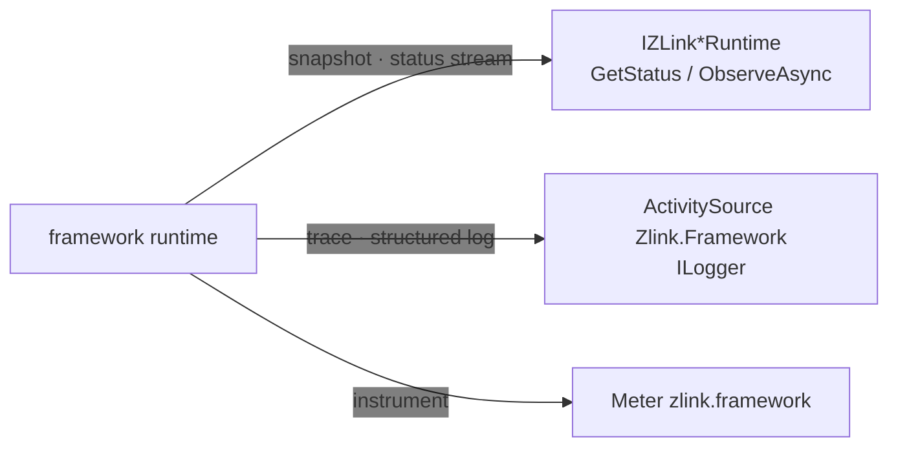

<!-- framework-adapter-nav:start -->
[Guide Home](../../../index.en.md) | [Previous: Location](10-location.en.md) | [Next: Operations — metrics · drain · readiness](12-operations.en.md)
<!-- framework-adapter-nav:end -->

# 11. Monitoring — Status Observation And Diagnostics

> **The document that owns this chapter's contract** — covered by
> [.NET topology and host monitoring public interfaces](../../../common/spec/server/languages/dotnet/interfaces/10-topology-monitoring.en.md).
> This chapter explains the four observation surfaces that contract exposes, focused on
> usage.

Handler calls alone can't show you all of operations. Whether a connection is ready, which
peer dropped, where a message failed — you also have to read this from the framework
surface. The framework exposes this through **three channels** — a status snapshot and
status stream, standard diagnostics (trace/log), and a standard meter.

There's no surface that receives a runtime event as a DI handler. Observation always goes
through one of the three channels below.

## 1. Observation Surfaces

| What you're watching | Surface | Where it's covered |
|---|---|---|
| Host lifecycle (relocate/drain/readiness) | `IZLinkFrameworkRuntime.Status` · `ObserveAsync` | [12-operations](12-operations.ko.md) §6.1 |
| A MeshNode's node/peer/channel readiness | `IZLinkRouteMeshRuntime.GetStatus` · `ObserveAsync` | [12-operations](12-operations.ko.md) §5 |
| A ClientServer channel's target status | `IZLinkClientServerRuntime.GetStatus` · `ObserveAsync` | This chapter §2 |
| A pub/sub channel's publisher status | `IZLinkFanoutRuntime.GetStatus` · `ObserveAsync` | This chapter §2 |
| Location store status and topology | `IZLinkLocationRuntimeQuery` | [10-location](10-location.ko.md) §4 |
| Message receive/dispatch/failure and flow | Diagnostics level + `ActivitySource`·`ILogger` | This chapter §3 |
| Numbers like CCU and queue depth | `Meter` `zlink.framework` | [12-operations](12-operations.ko.md) §1 |



The three channels are consumed differently. Use the **status surface** to read the current
value or receive changes in order; use **diagnostics** to trace where and how an individual
message ended; use the **meter** to collect numbers for a dashboard.

## 2. Status Snapshot And Status Stream

Every status surface has the same shape — `GetStatus(name)` gives one immutable snapshot,
and `ObserveAsync(name, ct)` gives every change after that, in order.

```csharp
var fanout = app.Services.GetRequiredService<IZLinkFanoutRuntime>();

var status = fanout.GetStatus("user.events");   // One snapshot of the current value
if (!status.IsReady)
    logger.LogWarning("fanout not ready: {Channel} {State}", status.ChannelName, status.State);

await foreach (var observed in fanout.ObserveAsync("user.events", cancellationToken: ct))
{
    // Arrives in Sequence order every time a publisher attaches or drops.
    var update = observed.Status;
    logger.LogInformation("publishers={Count} state={State} seq={Seq}",
        update.ReadyPublisherCount, update.State, update.Sequence);

    // How many this subscription missed. Splits out what was skipped by coalescing versus what's gone for good.
    if (observed.Loss.DiscardedTerminalCount > 0)
        logger.LogWarning("lost terminal statuses: {Count}", observed.Loss.DiscardedTerminalCount);
}
```

A ClientServer channel works the same way. `IZLinkClientServerRuntime` gives you the role
this process holds on that channel (`LocalRole`) together with the list of targets that are
select-one candidates.

```csharp
var clientServer = app.Services.GetRequiredService<IZLinkClientServerRuntime>();
var channel = clientServer.GetStatus("profile");

foreach (var target in channel.Targets)
    logger.LogInformation("target {Node} weight={Weight} state={State} reason={Reason}",
        target.NodeRid, target.Weight, target.State, target.UnavailableReason);
```

Three shared rules hold.

- **`Sequence` increases monotonically within that name.** Which of two snapshots came first
  is judged by `Sequence`. `ObservedAt` is a display-only timestamp.
- **Read `IsReady` and `State` together.** `ZLinkTopologyState` is `Starting`·`Ready`·
  `Degraded`·`Stopping`·`Stopped`·`Failed`, and the reason it isn't ready arrives as
  `ZLinkTopologyReason` (`NoReadyPeer`, `LocationUnavailable`, `Draining`, etc.).
- **Consume the stream from a hosted service.** `ObserveAsync` stays open until cancelled,
  so run it from a spot tied to the host's lifetime, like a `BackgroundService`.

`IZLinkFanoutRuntime` can only query a channel registered through auto-subscription. Passing
any other name is a `ZLinkConfigurationException`.

## 3. Message Flow Tracing

Message flow tracing records a message's receipt, its handler delivery, and its terminal
result. `CorrelationId` connects one request and its reply, and `FlowId` connects that
request all the way through the follow-up Spot/Actor/Channel calls it started.

The application only configures the record level, the sampling ratio for normal flow, and
whether to include message byte sizes. Where logs are stored and the trace exporter are
owned by the application's standard logging/telemetry configuration.

```csharp
builder.Services.AddZLinkFramework(options =>
{
    options.ConfigureDispatch().Diagnostics
        .SetLevel(ZLinkDiagnosticsLevel.Normal) // Records errors and the main processing boundaries.
        .SetSampleRate(0.1)                     // Selects 10% of normal flow, by Flow.
        .IncludeMessageSizes(false);            // Doesn't record payload content or byte size.
});
```

| Level | Recording scope |
|---|---|
| `Off` | Creates no message flow or dispatch error. |
| `Errors` | Records only errors, backpressure, and drops. |
| `Normal` | Records errors and the main processing boundaries. |
| `Detailed` | Can add byte size and terminal elapsed time on top of `Normal`. |

The default is `Errors`. At `Off`, no trace event, attribute, string, or sampling hash is
created. A logger filter that only discards output doesn't satisfy this condition.

While operating, get the process-singleton `IZLinkDiagnosticsRuntime` from DI to change the
level for subsequent processing.

```csharp
public sealed class DiagnosticsSwitch(IZLinkDiagnosticsRuntime diagnostics)
{
    public void Disable() =>
        diagnostics.Level = ZLinkDiagnosticsLevel.Off; // Removes the trace-generation cost starting from subsequent processing.

    public void EnableNormal() =>
        diagnostics.Level = ZLinkDiagnosticsLevel.Normal;
}
```

The .NET runtime exports trace under the `ActivitySource` name `Zlink.Framework`. When using
`ILogger`'s structured log, the `corr` and `flow` fields search the request and the business
flow respectively. Publish never confirms a per-subscriber result, so it never creates a
per-target trace or count.

For exact attributes and propagation rules, see
[Message Flow Tracing](../../../common/spec/26-message-flow-tracing.ko.md) and
[Flow Correlation](../../../common/spec/27-flow-correlation.ko.md).

## 4. Common Problems

- **I want to receive a runtime event as a DI handler** → no such surface exists. Receive
  status changes through the `ObserveAsync` stream (§2), and see an individual message's
  processing result through diagnostics (§3).
- **`ObserveAsync` gives nothing** → if there's no change for that name, the stream stays
  quiet too. If you need the current value, read a snapshot with `GetStatus` first, then
  continue with the stream.
- **I want to see auto-connect status** → in a deployment that registered a location store,
  query the store's status and topology with `IZLinkLocationRuntimeQuery`
  ([10-location](10-location.ko.md) §4).
- **I expect a health/metric endpoint** → the framework doesn't create an HTTP endpoint.
  Readiness is wired by connecting `IZLinkFrameworkRuntime.IsReady` to the app's existing
  endpoint ([12-operations](12-operations.ko.md) §4), and numbers are exposed by registering
  the meter `zlink.framework` in the app's collection pipeline
  ([12-operations](12-operations.ko.md) §1).
- **I want to know about an unregistered message** → set `ConfigureDispatch().Diagnostics`'s
  level to `Errors` or higher and check the application's `ILogger` or `ActivitySource`
  exporter. A request failure comes back as an error reply, and a send failure can be
  confirmed through a diagnostic record. Publish never confirms a per-subscriber result, so
  it never creates a per-target record.
- **I want to see a Spot timer handler failure** → at diagnostics level `Errors` or higher,
  it's recorded as a dispatch error. See [06-spot](06-spot.ko.md) §6 for timer policy.

## 5. Related Documents

- Runnable verification examples for this chapter's contract:
  [13-interface-catalog](13-interface-catalog.ko.md) §7 — the verification class
  `EventingContracts`
- The formal contract: [spec/aspnet-core-monitoring](../../../common/spec/server/languages/dotnet/01-system-structure.ko.md)
- Location operational queries: [10-location](10-location.ko.md)
- Runtime metrics/mesh status/drain observation: [12-operations](12-operations.ko.md)

---
<!-- framework-adapter-nav:bottom:start -->
[Guide Home](../../../index.en.md) | [Previous: Location](10-location.en.md) | [Next: Operations — metrics · drain · readiness](12-operations.en.md)
<!-- framework-adapter-nav:bottom:end -->
