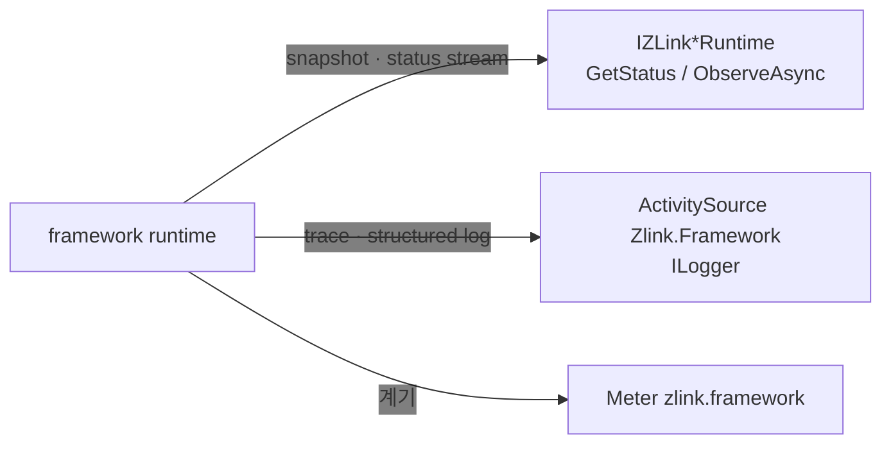

<!-- framework-adapter-nav:start -->
[가이드 홈](../../../index.ko.md) | [이전: Location](10-location.ko.md) | [다음: 운영 — 메트릭 · drain · readiness](12-operations.ko.md)
<!-- framework-adapter-nav:end -->

# 11. Monitoring — 상태 관측과 진단

> **이 장의 계약 소유 문서** — [.NET topology와 host monitoring 공개 인터페이스](../../../common/spec/server/languages/dotnet/interfaces/10-topology-monitoring.ko.md)가
> 다룬다. 이 챕터는 그 계약이 노출하는 네 관측 표면을 사용법 중심으로 설명한다.

handler 호출만으로는 운영을 다 볼 수 없다. 연결이 준비되었는지, 어느 peer가 빠졌는지,
메시지가 어디서 실패했는지도 framework 표면에서 읽어야 한다. framework는 이를 **세
갈래**로 노출한다 — 상태 snapshot과 status stream, 표준 진단(trace·log), 표준 meter다.

runtime event를 DI handler로 받는 표면은 없다. 관측은 전부 아래 세 갈래를 통한다.

## 1. 관측 표면

| 무엇을 보나 | 표면 | 어디서 다루나 |
|---|---|---|
| Host lifecycle(relocate·drain·readiness) | `IZLinkFrameworkRuntime.Status` · `ObserveAsync` | [12-operations](12-operations.ko.md) §6.1 |
| MeshNode의 node·peer·channel 준비 상태 | `IZLinkRouteMeshRuntime.GetStatus` · `ObserveAsync` | [12-operations](12-operations.ko.md) §5 |
| ClientServer channel의 target 상태 | `IZLinkClientServerRuntime.GetStatus` · `ObserveAsync` | 이 챕터 §2 |
| pub/sub channel의 publisher 상태 | `IZLinkFanoutRuntime.GetStatus` · `ObserveAsync` | 이 챕터 §2 |
| Location store 상태와 topology | `IZLinkLocationRuntimeQuery` | [10-location](10-location.ko.md) §4 |
| 메시지 수신·dispatch·실패와 흐름 | 진단 level + `ActivitySource`·`ILogger` | 이 챕터 §3 |
| CCU·큐 깊이 같은 수치 | `Meter` `zlink.framework` | [12-operations](12-operations.ko.md) §1 |



세 갈래는 소비 방식이 다르다. **상태 표면**은 지금 값을 읽거나 변화를 순서대로 받을
때, **진단**은 개별 메시지가 어디서 어떻게 끝났는지 추적할 때, **meter**는 대시보드에
올릴 수치를 모을 때 쓴다.

## 2. 상태 snapshot과 status stream

상태 표면은 모두 같은 모양이다 — `GetStatus(name)`이 immutable snapshot 한 장을,
`ObserveAsync(name, ct)`가 그 이후 변화를 순서대로 준다.

```csharp
var fanout = app.Services.GetRequiredService<IZLinkFanoutRuntime>();

var status = fanout.GetStatus("user.events");   // 지금 값 한 장
if (!status.IsReady)
    logger.LogWarning("fanout not ready: {Channel} {State}", status.ChannelName, status.State);

await foreach (var observed in fanout.ObserveAsync("user.events", cancellationToken: ct))
{
    // publisher가 붙고 빠질 때마다 Sequence 순서로 도착한다.
    var update = observed.Status;
    logger.LogInformation("publishers={Count} state={State} seq={Seq}",
        update.ReadyPublisherCount, update.State, update.Sequence);

    // 이 구독이 놓친 개수. 합치기로 건너뛴 것과 영영 못 보는 것이 나뉘어 있다.
    if (observed.Loss.DiscardedTerminalCount > 0)
        logger.LogWarning("lost terminal statuses: {Count}", observed.Loss.DiscardedTerminalCount);
}
```

ClientServer channel도 같다. `IZLinkClientServerRuntime`은 그 channel에서 이 process가
맡은 역할(`LocalRole`)과 select-one 후보인 target 목록을 함께 준다.

```csharp
var clientServer = app.Services.GetRequiredService<IZLinkClientServerRuntime>();
var channel = clientServer.GetStatus("profile");

foreach (var target in channel.Targets)
    logger.LogInformation("target {Node} weight={Weight} state={State} reason={Reason}",
        target.NodeRid, target.Weight, target.State, target.UnavailableReason);
```

세 가지 공통 규칙을 지킨다.

- **`Sequence`는 그 이름 안에서 단조 증가한다.** 두 snapshot의 선후는 `Sequence`로
  판단한다. `ObservedAt`은 표시용 시각이다.
- **`IsReady`와 `State`를 함께 읽는다.** `ZLinkTopologyState`는 `Starting`·`Ready`·
  `Degraded`·`Stopping`·`Stopped`·`Failed`이고, 준비되지 않은 이유는
  `ZLinkTopologyReason`(`NoReadyPeer`, `LocationUnavailable`, `Draining` 등)으로 온다.
- **stream은 hosted service에서 소비한다.** `ObserveAsync`는 취소될 때까지 열려 있으므로
  `BackgroundService`처럼 host 수명에 묶인 자리에서 돌린다.

`IZLinkFanoutRuntime`은 자동 구독으로 등록한 channel만 조회할 수 있다. 그 밖의 이름을
넘기면 `ZLinkConfigurationException`이다.

## 3. 메시지 흐름 추적

메시지 흐름 추적은 메시지의 수신, handler 전달과 terminal 결과를 기록한다.
`CorrelationId`는 한 request와 reply를 연결하고, `FlowId`는 그 request가 시작한
후속 Spot·Actor·Channel 호출까지 연결한다.

Application은 기록 수준, 정상 흐름의 sampling 비율과 message byte 크기 포함 여부만
설정한다. Log 저장 위치와 trace exporter는 application의 표준 logging·telemetry
설정이 소유한다.

```csharp
builder.Services.AddZLinkFramework(options =>
{
    options.ConfigureDispatch().Diagnostics
        .SetLevel(ZLinkDiagnosticsLevel.Normal) // 오류와 주요 처리 경계를 기록한다.
        .SetSampleRate(0.1)                     // 정상 흐름의 10%를 Flow 단위로 선택한다.
        .IncludeMessageSizes(false);            // Payload 내용과 byte 크기를 기록하지 않는다.
});
```

| Level | 기록 범위 |
|---|---|
| `Off` | Message flow와 dispatch error를 만들지 않는다. |
| `Errors` | Error, backpressure와 drop만 기록한다. |
| `Normal` | Error와 주요 처리 경계를 기록한다. |
| `Detailed` | `Normal`에 byte 크기와 terminal 경과 시간을 추가할 수 있다. |

기본값은 `Errors`다. `Off`에서는 trace event, attribute, 문자열과 sampling hash를
만들지 않는다. 출력만 버리는 logger filter는 이 조건을 만족하지 않는다.

운영 중에는 DI에서 process singleton인 `IZLinkDiagnosticsRuntime`을 얻어 이후
처리의 level을 바꾼다.

```csharp
public sealed class DiagnosticsSwitch(IZLinkDiagnosticsRuntime diagnostics)
{
    public void Disable() =>
        diagnostics.Level = ZLinkDiagnosticsLevel.Off; // 이후 처리부터 trace 생성 비용을 제거한다.

    public void EnableNormal() =>
        diagnostics.Level = ZLinkDiagnosticsLevel.Normal;
}
```

.NET runtime은 trace를 `ActivitySource` 이름 `Zlink.Framework`로 내보낸다.
`ILogger`의 structured log를 사용할 때는 `corr`와 `flow` field로 각각 request와
업무 흐름을 검색한다. Publish는 subscriber별 결과를 확인하지 않으므로 target별
trace나 count를 만들지 않는다.

정확한 attribute와 전파 규칙은
[메시지 흐름 추적](../../../common/spec/26-message-flow-tracing.ko.md)과
[Flow 상관관계](../../../common/spec/27-flow-correlation.ko.md)를 참고한다.

## 4. 자주 발생하는 문제

- **runtime event를 DI handler로 받고 싶다** → 그런 표면은 없다. 상태 변화는
  `ObserveAsync` stream으로 받고(§2), 개별 메시지의 처리 결과는 진단으로 본다(§3).
- **`ObserveAsync`가 아무것도 주지 않는다** → 그 이름에 변화가 없으면 stream도 조용하다.
  현재 값이 필요하면 `GetStatus`로 snapshot을 먼저 읽고 stream을 이어 받는다.
- **자동 연결 상태를 보고 싶다** → location store를 등록한 배포에서는
  `IZLinkLocationRuntimeQuery`로 store 상태와 topology를 조회한다
  ([10-location](10-location.ko.md) §4).
- **health/metric endpoint를 기대한다** → framework는 HTTP endpoint를 만들지 않는다.
  readiness는 `IZLinkFrameworkRuntime.IsReady`를 앱의 기존 endpoint에 연결하고
  ([12-operations](12-operations.ko.md) §4), 수치는 meter `zlink.framework`를 앱의
  수집 파이프라인에 등록해 노출한다([12-operations](12-operations.ko.md) §1).
- **등록되지 않은 메시지를 알고 싶다** → `ConfigureDispatch().Diagnostics`의 level을
  `Errors` 이상으로 설정하고 application의 `ILogger` 또는 `ActivitySource` exporter를
  확인한다. Request 실패는 error reply로 돌아가며, send 실패는 diagnostic record로
  확인할 수 있다. Publish는 subscriber별 결과를 확인하지 않으므로 target별 record를
  만들지 않는다.
- **Spot timer handler 실패를 보고 싶다** → 진단 level `Errors` 이상에서 dispatch 오류로
  기록된다. timer 정책은 [06-spot](06-spot.ko.md) §6을 참고한다.

## 5. 관련 문서

- 이 챕터 계약의 실행 검증 예문: [13-interface-catalog](13-interface-catalog.ko.md) §7 — 검증 클래스 `EventingContracts`
- 정식 계약: [spec/aspnet-core-monitoring](../../../common/spec/server/languages/dotnet/01-system-structure.ko.md)
- location 운영 조회: [10-location](10-location.ko.md)
- 런타임 메트릭·mesh 상태·drain 관측: [12-operations](12-operations.ko.md)

---
<!-- framework-adapter-nav:bottom:start -->
[가이드 홈](../../../index.ko.md) | [이전: Location](10-location.ko.md) | [다음: 운영 — 메트릭 · drain · readiness](12-operations.ko.md)
<!-- framework-adapter-nav:bottom:end -->
