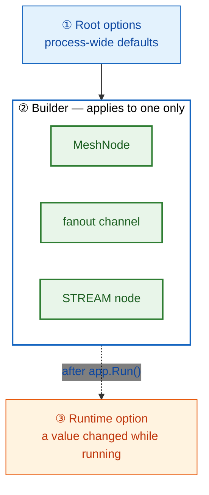

<!-- framework-adapter-nav:start -->
[Guide Home](../../../index.en.md) | [Previous: E2E Testing](15-e2e-testing.en.md) | [Next: Where ZLink Fits](17-alternative.en.md)
<!-- framework-adapter-nav:end -->

# 16. Options — Configuration List And Defaults

> **The documents that own this chapter's contract** —
> [Topology public interfaces](../../../common/spec/server/languages/dotnet/interfaces/03-configuration-topology.en.md)
> and
> [Host configuration interfaces](../../../common/spec/server/languages/dotnet/interfaces/02-configuration-host.ko.md)
> define the exact signatures and value ranges. This chapter helps you **list that surface
> out and judge when to change it.**

The earlier chapters explain features and cover only the settings needed at that point. This
chapter is one place that collects every setting you can specify.

**Most of them work fine unchanged.** That's why every table below lists the default —
check the relevant row when a reason to change it comes up, and use the default until then.

## 1. Where A Setting Applies

The same setting has a different scope depending on where you specify it.



```csharp
builder.Services.AddZLinkFramework(options =>
{
    options.Codecs.Use(ZLinkProtobufCodec.Default);   // ① Root — applies to every payload in this process.

    var mesh = options.AddRouteMesh("play")           // ② Builder — applies only to this one node.
        .Listen(node.MeshEndpoint)
        .SetRoutingIdPrefix("play")
        .SetSpotLimit(2_000);
    mesh.Channel("room").Server();
});

// ③ Runtime — changed while running.
app.MapPost("/admin/drain", (IZLinkRouteMeshRuntimeOptions runtime) =>
{
    runtime.Channel("room").Weight = 0;               // Only stops accepting new requests. The connection is kept.
    return Results.Ok();
});
```

| Spot | Scope | When it can change |
| --- | --- | --- |
| Root `options` | Process-wide default | Only before `app.Run()` |
| Builder | That one node/channel/STREAM node | Only before `app.Run()` |
| Runtime option | Some values already running | While running ([What Can Change While Running](#7-실행-중-바꿀-수-있는-것)) |

There's no surface to call a builder again after `app.Run()`. A bad combination isn't
deferred to the first call — it's **blocked as an exception at host startup.**

## 2. Root Options

Values applied across the whole process.

| Setting | What it sets | Default | When to change it |
| --- | --- | --- | --- |
| `DefaultRequestTimeout` | The ceiling a request waits for a response | 30s | The service's response is slower than that, or you want to fail faster |
| `DefaultSocketSendTimeout` | The ceiling to wait when there's no slot to send into ([backpressure](#31-backpressure--송신-대기-동작)) | 1s | To tolerate congestion longer, or to fail faster |
| `Codecs.Use(...)` | How the payload is turned into bytes | The built-in default codec | Fixing on Protobuf/MessagePack, or using your own serializer |
| `AddHandlersFromAssemblyOf<T>()` | The assembly to find handler types in | Not searched | Letting handlers be discovered automatically |
| `DisableImplicitHandlerAutoRegistration()` | Turns off auto-registration of discovered handlers | On | Controlling which handler opens on which channel purely through registration code |
| `UseFilter<T>()` | Common processing to put in front of handlers | None | Gathering logging/validation/authorization in one place |
| `ConfigureMetadata()` | The metadata keys allowed to pass between a client connection and an actor | No key allowed | Something like auth info needs to pass from the connection to the actor |
| `ConfigureNetwork()` | The default `BindHost`/`AdvertiseHost` for every endpoint | Unspecified | The bind address and advertised address need to differ in a container/Kubernetes |
| `ApplicationVersion` | This process's application version | `0` | Picking a relocation target by version during a zero-downtime deploy |
| `MaintenanceWave` | The maintenance group name this process belongs to | None | Grouping nodes to maintain/replace in sequence |
| `Worker` | The thread pool heavy work is handed off to | Max `processor count × 2` (min 2) · 30s idle · 1024 queue | Handing off a lot of slow computation/I/O to a worker |

- Choosing a codec and registering your own serializer: [05-channel-messaging](05-channel-messaging.ko.md#7-직렬화-codec)
- The difference between discovering and exposing a handler: [05-channel-messaging](05-channel-messaging.ko.md#3-handler를-channel에-노출하기)
- The scope a filter applies to: [05-channel-messaging](05-channel-messaging.ko.md#5-filter--공통-처리)
- Worker calls: [06-spot](06-spot.ko.md#6-timer와-worker)
- The deployment flow that uses version/maintenance groups: [12-operations](12-operations.ko.md)

`AddLocationStore(...)` and `AddRelocationStore(...)` are also registered at the root. The
auto-connect that finds a peer by logical name is covered by
[10-location](10-location.ko.md); the store used when moving state to another node is
covered by [07-actor-spot](07-actor-spot.ko.md).

> **Metadata only lets through a key you've opened.** Unless you specify per-direction
> allowed keys with `AllowSessionToActor` and `AllowActorToSession`, no value passes at all.
> Since it fails silently — the value just disappears with no error — don't forget this
> setting in a setup that passes authentication results from a connection to an actor.

## 3. MeshNode Options

A [MeshNode](03-concepts.ko.md#1-channel--서버-간-연결) is the basic unit of a connection
between servers, and one process creates one per mesh. The following are specified on the
builder `AddRouteMesh(name)` returns, and apply only to that one node.

| Setting | What it sets | Default | When to change it |
| --- | --- | --- | --- |
| `Listen(endpoint)` · `Listen(port)` | This node's own endpoint for other nodes to connect to | None | Always needed. Leave the port `0` to get one automatically |
| `SetBindHost` · `SetAdvertiseHost` | A bind/advertise address just for this node | The root `ConfigureNetwork()` value | Each node needs a different address rule |
| `SetRoutingIdPrefix(...)` | The prefix of an auto-issued identifier | None | The common case. Gets a new identifier on every restart, so it never mixes with the previous process |
| `SetRoutingId(...)` | A fixed identifier for this node | None | Only when the same identifier must carry over even after replacing the process |
| `SetPlacementWeight(int)` | The ratio at which a new Spot/actor is placed on this node | 100 | Mixing nodes of different specs, or halting new placement |
| `SetSpotLimit(int)` | The ceiling on Spots this node can hold at once | Unlimited | Enforcing a memory limit by Spot count |
| `SetActorLimit(int)` | The ceiling on this node's actor count | Unlimited | Setting a per-node cap on connected-user count |
| `SetActivationConcurrency(int)` | The number of Spot/actor activations that can proceed concurrently | 128 | Limiting store load when activations pile up |
| `SetDefaultRequestTimeout(...)` | The default wait ceiling for a request going out from this mesh | The root value (30s) | Only this mesh's response is slow or fast |
| `PeerConnections.Connect(endpoint)` | A peer endpoint to connect to manually | None | A setup that doesn't use auto-connect |

The registrations done in `Objects().Server()` and `Channel(name).Server()` (stable type,
relocation policy, channel weight) are covered by [06-spot](06-spot.ko.md) and
[05-channel-messaging](05-channel-messaging.ko.md). Manual connection is covered by
[05-channel-messaging](05-channel-messaging.ko.md#6-연결-제어).

### 3.1 Backpressure — Send-Wait Behavior

A sent message leaves through a per-peer send queue, and once that queue hits its ceiling,
the sender waits. At this point, **it waits up to `DefaultSocketSendTimeout` (1s by
default) for a slot to open**, submits once the slot opens, and if it never opens, ends in a
`DeadlineExceeded` exception. It's never auto-resent, so whether to retry is up to the
application.

```csharp
await client.SendToChannel("profile", command).Async(ct);
// This await finishing means only "my runtime accepted the submission."
// It doesn't mean the peer received it or the handler finished.
```

Why the peer's delay becomes this side's wait, and when the ceiling locks and unlocks, is
covered by [04-backpressure](04-backpressure.ko.md). This section and the next only cover
the options that set values within that behavior. Flow control itself is owned by Core, and
the exact contract is covered by [the core guide's socket option](https://kairos-code-dev.github.io/zlink/guide/12-socket-options/).

> **Logical Multicast is judged separately per target.** Failing to submit to one target
> doesn't roll back a target already accepted, and it doesn't return a per-target failure as
> the publish result either.

### 3.2 Options That Set The Backpressure Ceiling

`ConfigureRouterSocket()` sets the ceiling for the socket this node uses; `ConfigureSpotPublisher()`
sets the ceiling for the publish socket Spots use to exchange events with each other. If
unspecified, the backend default is used — an unspecified socket gets the value the runtime
computes based on connection count. At the default profile, if there are 64 or fewer
connections, it's `1,048,576 bytes` (1 MiB) per direction per peer, and the per-connection
value shrinks as connections grow
([04-backpressure §4.1](04-backpressure.ko.md#41-auto-hwm--미지정-socket의-자동-계산)).
**Both high-water marks limit the bytes the queue holds, not the message count, and apply
per connection** — check whether the value multiplied by your target peer count fits your
process memory budget ([04-backpressure](04-backpressure.ko.md#4-영향을-주는-옵션)).

| Setting | What it sets | Raising it | Lowering it |
| --- | --- | --- | --- |
| `SendHighWaterMark` | Bytes this node can hold, per peer, **to send**. `0` means unlimited | Absorbs more of a momentary burst | The sender waits sooner, surfacing congestion faster |
| `ReceiveHighWaterMark` | Bytes this node can hold, per peer, **after receiving**. `0` means unlimited | Tolerates more processing delay | This node fails to pick messages up sooner, delaying the peer's send first |
| `MaxMessageSize` | The max size of one message that will be accepted | Can exchange a larger payload | Blocks an excessive payload at the door |
| `MailboxMessageBudget` · `MailboxByteBudget` | The message count and bytes one execution unit like a Spot/Actor can hold | A slow execution unit tolerates more of a burst | Surfaces a delayed execution unit sooner |
| `ReceiveTimeout` · `SendTimeout` | The socket-level wait ceiling | — | The default behavior is enough in most cases |
| `Linger` (publish socket) | How long to wait for a remaining message when closing | Doesn't drop the last publish on shutdown | The default is `0`, so it closes immediately |

The two ceilings differ only in direction, not in character. Each sets **how many bytes your
own node will hold**, and that ceiling carries through to the peer's flow. Replacing the
per-execution-unit ceiling with a single host-wide byte budget is a settled design; its
applied status is disclosed by
[04-backpressure §6](04-backpressure.ko.md#6-framework-runtime-적용-범위).

**Raising the high-water mark isn't the default response.** A larger ceiling absorbs
congestion into memory, which makes `DeadlineExceeded` show up later — and that delays
learning the cause just as much. Raise it only for a short, clear burst window; if
processing delay keeps happening, check the processing side (receiving node count, handler
execution time) instead of the ceiling. Conversely, to fail fast and switch to a different
path, lower the ceiling and shrink `DefaultSocketSendTimeout`.

Leaving `MaxMessageSize` unlimited means one message can exceed the ceiling by any amount,
making it impossible to compute the worst-case memory a queue can occupy. If you're planning
process memory based on the byte ceiling, specify a finite value.

## 4. Error Handling And Diagnostics

`ConfigureDispatch()` sets **the behavior when an unregistered packet arrives** and **how
much diagnostics is recorded.**

```csharp
var dispatch = options.ConfigureDispatch();
dispatch.Unhandled.Request = ZLinkUnhandledDispatchAction.ReplyError;  // The sender receives it as an error.
dispatch.Unhandled.Publish = ZLinkUnhandledDispatchAction.Drop;        // Drops an event no one's interested in.
dispatch.Diagnostics
    .SetLevel(ZLinkDiagnosticsLevel.Normal)
    .IncludeMessageSizes(false);
```

`Unhandled` is set separately for the three directions request/send/publish.

| Value | Behavior | When to pick it |
| --- | --- | --- |
| `ReplyError` | Sends an error response to the sender | The default for request. The caller needs to know right away |
| `LogAndDrop` | Logs it and drops it | send/publish, when you want a record of the cause without breaking the flow |
| `Drop` | Drops it silently | An event the subscriber isn't interested in mixes in normally |
| `Throw` | Throws an exception | Surfacing a contract mismatch immediately during development/testing |

`Diagnostics` sets the following.

| Setting | What it sets | When to change it |
| --- | --- | --- |
| `SetLevel(...)` | The record level, one of `Off` · `Errors` · `Normal` · `Detailed` | `Normal` normally; `Detailed` only when tracing a cause |
| `SetSampleRate(double)` | The fraction to record | When traffic is heavy enough that recording everything is a burden |
| `IncludeMessageSizes(bool)` | Whether to record message size | Need to check payload size |

How to read the record left here is covered by [11-monitoring](11-monitoring.ko.md).

## 5. Location Options

`ConfigureLocations()` sets the interval and validity period for refreshing location
information, and the number of
[relocations](03-concepts.ko.md#5-relocation--다른-node로-옮겨가기) — an actor or Spot
moving to another node — that can proceed at once. How to register it, and its behavior,
are covered by [10-location](10-location.ko.md).

| Setting | What it sets | Default | When to change it |
| --- | --- | --- | --- |
| `OwnerLeaseRenewInterval` | The interval to renew your own ownership | 5s | Lengthen to reduce store write load |
| `OwnerLeaseTtl` | The time before an ownership with stalled renewal expires | 15s | Shorten to detect failure faster; lengthen to tolerate a temporary delay |
| `OwnerLeaseRenewTimeout` | The ceiling for one renewal attempt | 3s | When the store's response is slow |
| `OwnerLeaseFencingMargin` | The margin to voluntarily give up authority ahead of expiry | 5s | Narrowing the moment two nodes could own the same target |
| `PollingInterval` | The interval to re-read the store when there's no change notification | 1s | Balancing store load against how fast changes are reflected |
| `StoreFailureGrace` | How long a store outage is tolerated | 30s | Once this passes, no new connection starts. Existing connections are kept |
| `RouteCacheMaxAge` | How long a looked-up location is reused | 15s | `0` means no caching. Shorten if moves are frequent |
| `MessageFollowDuration` | How long the previous owner node forwards messages to the new owner | 30s | `0` means it doesn't forward |
| `MaxActiveOutboundRelocations` · `MaxActiveInboundRelocations` | The number of relocations this process runs concurrently | 64 each | A bulk relocation is pressuring the store or network |
| `MaxConcurrentRelocationCaptures` · `MaxConcurrentRelocationRestores` | Concurrency of the application callback that saves/restores state | 8 each | That callback is heavy and monopolizes CPU |
| `MaxRelocationPayloadInFlightBytes` | The memory an in-flight relocation payload can occupy at once | 256 MiB | Moving many Spots with large state |

## 6. STREAM Options

[STREAM](03-concepts.ko.md#4-stream--외부-client-연결) is a connection-oriented channel to
an external client like mobile or a game. Specify the following on the node that receives
that connection. Usage is covered by [09-stream](09-stream.ko.md).

| Setting | What it sets | Default | When to change it |
| --- | --- | --- | --- |
| `AddStreamNode(name).Bind(...)` | The endpoint a client connects to | None | Always needed |
| `SetBindHost` · `SetAdvertiseHost` | The bind/advertise address | The root `ConfigureNetwork()` value | Container deployment |
| `SetTlsServer(cert, key, requireClientCertificate)` | The server certificate and whether a client certificate is required | Off | Exposing this directly to the outside |
| `EnableActorDispatch()` | Hands an incoming packet to the bound actor | Off | A setup that ties the connection to an actor ([08-actor-session](08-actor-session.ko.md)) |
| `AddSession<T>()` | The session implementation that handles connection lifetime | None | Handling connect/authenticate/disconnect directly |
| `ConfigureStreamCompression()` | Compression for payload exchanged with the client | LZ4 | Turning it off with `Disable()`, or swapping in your own codec |

## 7. What Can Change While Running

The rest of the settings are fixed at startup. The settings that can change while running
are:

| Setting | Injected as | What it changes |
| --- | --- | --- |
| Channel weight | `IZLinkRouteMeshRuntimeOptions` | `Channel(name).Weight` — the ratio at which this node accepts new requests. `0` keeps the connection but stops accepting new requests |
| Placement weight | `IZLinkRouteMeshRuntimeOptions` | `Mesh(name).PlacementWeight` — the ratio at which a new Spot/actor is placed on this node |
| Diagnostics level | `IZLinkDiagnosticsRuntime` | `Level` — raise to `Detailed` only while tracing a cause, then revert |

A weight value ranges `0..10000`, with a default of `100`. The operational flow is covered by
[05-channel-messaging](05-channel-messaging.ko.md#운영-drain--restore-런타임) and
[12-operations](12-operations.ko.md).

## 8. What You Must Set

There aren't many settings without a default that you have to specify yourself.

| Required setting | If you skip it |
| --- | --- |
| A MeshNode's `Listen(...)` | Exception at host startup |
| At least one channel or object role on a MeshNode | Exception at host startup |
| Exactly one relocation policy on a Spot/actor factory | Exception at host startup |
| A STREAM node's `Bind(...)` | Exception at host startup |
| `AddLocationStore(...)` if using auto-connect, `PeerConnections.Connect(...)` if not | Can't find a peer to connect to |
| The metadata key to pass between a connection and an actor | The value just fails to pass, with no error |

Everything else starts from its default.

## 9. Common Problems

- **A setting changed, but it didn't take effect** → most options are fixed before
  `app.Run()`. What can change while running is listed in
  [§7](#7-실행-중-바꿀-수-있는-것).
- **Metadata isn't reaching the actor** → check whether `ConfigureMetadata()` allowed that
  key for the right direction. An unallowed key disappears with no error.
- **Another node can't connect in a container** → the bind address may be getting used as the
  advertised address as-is. Use `ConfigureNetwork()` or the node's `SetAdvertiseHost` to
  specify the address a peer should connect to.
- **`send` ends in `DeadlineExceeded`** → it waited for a send slot and hit the ceiling
  ([backpressure](#31-backpressure--송신-대기-동작)). Check the receiving side's
  processing speed first, and if it's a short burst, raise `SendHighWaterMark` or
  `DefaultSocketSendTimeout`.
- **The store slows down when activations pile up** → lower `SetActivationConcurrency`
  (default 128) to reduce concurrent activations.
- **Memory grows a lot during a relocation** → lower `MaxRelocationPayloadInFlightBytes`
  (default 256 MiB) and the concurrent relocation count.

## 10. Related Documents

- The interface index for the registration surface:
  [13-interface-catalog §2 Topology Registration](13-interface-catalog.ko.md#2-topology-등록)
  — the verification class `BuilderContracts`
- The exact signatures and value ranges:
  [Topology public interfaces](../../../common/spec/server/languages/dotnet/interfaces/03-configuration-topology.en.md) ·
  [Host configuration interfaces](../../../common/spec/server/languages/dotnet/interfaces/02-configuration-host.ko.md)
- Registration points and layering: [01-overview](01-overview.ko.md#아키텍처--계층-구조와-등록-지점)
- Runtime observation and operations: [11-monitoring](11-monitoring.ko.md) · [12-operations](12-operations.ko.md)

---
<!-- framework-adapter-nav:bottom:start -->
[Guide Home](../../../index.en.md) | [Previous: E2E Testing](15-e2e-testing.en.md) | [Next: Where ZLink Fits](17-alternative.en.md)
<!-- framework-adapter-nav:bottom:end -->
